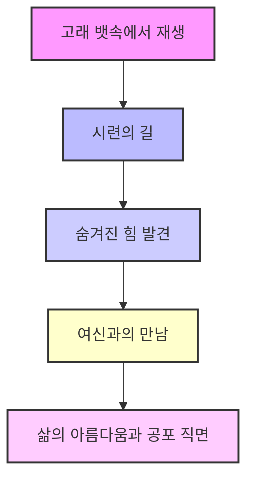
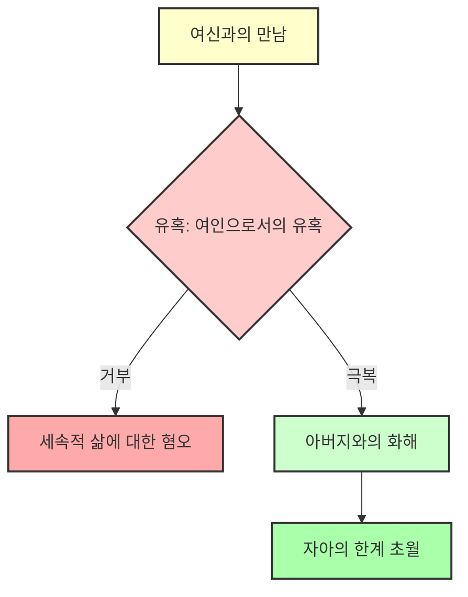
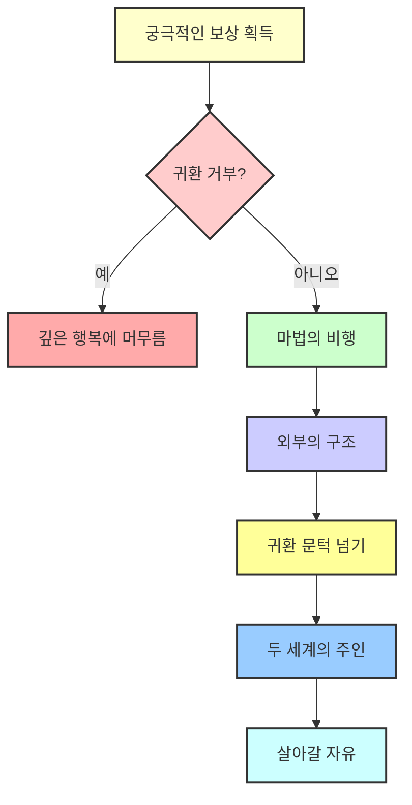
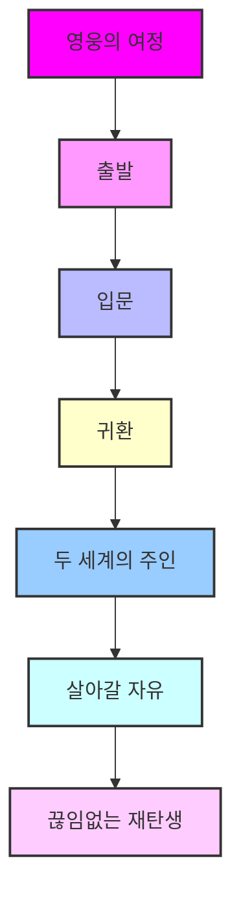

## 천 개의 얼굴을 가진 영웅: 우리 모두의 성장 이야기 
이 책은 조셉 캠벨이 1949년에 쓴 책으로, 전 세계 신화와 전설을 연구해서 모든 영웅 이야기에 공통으로 나타나는 패턴을 찾아낸 거야. 이 패턴을 '모노미스(단일 신화)' 또는 '영웅의 여정'이라고 부르는데, 이 여정은 신이나 옛날 영웅들만의 이야기가 아니라, 우리 각자의 삶에서 겪는 성장과 변화의 과정을 보여주는 지도와 같다고 해. 이 책은 조지 루카스 같은 유명한 영화감독에게도 큰 영향을 줬고, 우리 안에 숨겨진 영웅의 모험을 발견하게 도와주는 책이야.

## 1. 영웅의 여정: 평범한 시작과 모험의 부름 

영웅의 여정은 항상 아주 평범한 곳에서 시작해. 마치 우리가 매일 살아가는 익숙하고, 어쩌면 조금 지루하게 느껴지는 일상과 같다고 보면 돼.

1. **평범한 세상**:
  1. 프로도에게는 샤이어(반지의 제왕에 나오는 평화로운 마을)가, 도로시에게는 캔자스 농장이, 해리 포터에게는 11번째 생일에 숨겨진 마법 세계를 발견하기 전의 평범한 삶이 바로 이 평범한 세상이야. 
  2. 캠벨이 들려주는 옛날이야기 중에는 숲 속 샘물에서 가장 아끼는 황금 공을 가지고 놀던 공주 이야기가 있어. 공이 손에서 미끄러져 깊고 어두운 물속으로 사라져 버리지. 
2. **모험의 **부름:
  1. 공주가 슬퍼하며 울고 있을 때, 갑자기 못생긴 개구리 한 마리가 물 위로 튀어나와. 개구리는 공을 찾아주겠다고 하지만, 대신 공주의 친구가 되어 함께 밥을 먹고 침대에서 자게 해달라고 해. 
  2. 이처럼 예상치 못한 일이 갑자기 나타나서 우리의 평범한 일상을 흔드는 순간을 캠벨은 '모험의 부름'이라고 불러. 
  3. 이 부름은 우리의 세상이 곧 바뀔 거라는 신호와 같아. 운명은 종종 이상하거나 심지어 끔찍한 모습으로 찾아오기도 해. 
  4. 말하는 개구리, 신비한 편지, 아니면 그냥 '내가 뭔가 더 큰 일을 해야 할 것 같아'라는 조용한 느낌일 수도 있어. 
  5. 이 순간은 익숙한 세상이 더 이상 충분하지 않다는 것을 의미해. 우리의 예측 가능하고 완벽했던 삶의 상징인 황금 공이 깊은 곳으로 떨어졌고, 이제 우리는 그곳에서 나타난 미지의 존재와 마주해야 하는 거야. 
  6. 이 부름은 우리 안에 억눌려 있던 본능적인 힘을 상징하기도 해. 
  7. 부처님 이야기도 마찬가지야. 부처님은 늙음, 병, 죽음, 수도승에 대한 모든 지식으로부터 보호받았지만, 신들이 그에게 늙음, 질병, 죽음, 그리고 수도승의 모습을 보여주면서 그의 영웅 여정이 시작되었어. 

## 2. 부름의 거부와 초자연적인 도움 

모험의 부름이 왔을 때, 우리는 종종 두려움과 망설임 때문에 '아니, 괜찮아. 난 지금이 편해'라고 말하며 거부하기도 해.

1. **부름의 거부**:
  1. 공주는 개구리의 조건을 받아들여 공을 되찾지만, 공을 받자마자 약속을 잊고 편안한 옛날 삶으로 돌아가려고 도망쳐 버려. 
  2. 캠벨은 이처럼 부름을 거부하는 것은 우리 자신의 성장을 외면하는 것이라고 경고해. 
  3. 부름을 거부하면 한때 집처럼 느껴졌던 세상이 감옥처럼 변하고, 우리가 거부한 모험은 지루하고 무의미한 삶의 황무지가 되어버려. 
  4. 우리를 부르던 존재가 그림자 속에서 우리를 괴롭히는 괴물로 변하기도 해. 
  5. 그리스 신화의 다프네 이야기가 좋은 예시야. 그녀는 더 높은, 신성한 삶을 상징하는 태양신 아폴론에게 쫓기지만, 두려워하며 도망쳐. 결국 그녀는 월계수 나무로 변해 그 자리에 뿌리박히고, 아름답지만 영원히 움직이거나 성장할 수 없게 돼. 
  6. 이것은 부름을 거부하면 삶 자체를 포기하는 것과 같다는 것을 보여줘. 
  7. 아라비안나이트의 카마르 알-자만 왕자 이야기도 비슷해. 그는 여성에 대한 부정적인 시각 때문에 결혼을 거부하고, 결국 아버지에게 탑에 갇히게 돼. 
  8. 이러한 거부는 미래의 불확실성을 받아들이기보다는 자신의 이익을 고수하려는 욕망에서 비롯돼. 
2. **초자연적인 도움**:
  1. 하지만 만약 우리가 용기를 내어 미지의 세계에 '예'라고 답하면, 마법 같은 일이 일어나. 바로 '초자연적인 도움'이 나타나는 거야. 
  2. 이 도움은 종종 현명한 노인이나 자애로운 할머니 같은 보호자 형태로 나타나서 영웅에게 앞으로의 여정에 필요한 도구와 조언을 제공해. 
  3. 오비완 케노비가 루크에게 아버지의 광선검을 주는 것이나, 간달프가 프로도에게 조언을 해주는 것을 생각하면 돼. 
  4. 테세우스에게는 미로를 헤쳐나갈 실타래를 준 아리아드네 공주가, 두 명의 아메리카 원주민 영웅에게는 태양신 아버지를 찾아가는 여정에서 괴물로부터 보호해 줄 마법 부적과 기도를 준 거미 할머니가 있었어. 
  5. 이 안내자는 단순히 외부의 도움을 주는 존재가 아니야. 캠벨은 이들이 운명 자체의 자비롭고 보호적인 힘을 나타낸다고 말해. 
  6. 이들은 우리가 일단 여정을 시작하기로 결심하면, 우주의 힘이 우리를 돕기 위해 움직일 것이라는 약속과 같아. 우리의 숨겨진 강점과 깊은 지혜가 깨어나기 시작할 거야. 
  7. 우리가 믿기만 하면, 시대를 초월한 수호자들이 나타날 것이라고 해. 
  8. 이러한 보호자는 종종 부적을 주기도 하는데, 남서부 아메리카 인디언 신화의 거미 할머니가 '외계 신들의 깃털'이라는 부적을 준 것이 그 예시야. 

## 3. 첫 번째 문턱 넘기: 미지의 세계로의 진입 

도움을 받은 영웅은 이제 다음 큰 단계인 '첫 번째 문턱 넘기'를 준비해.

1. **첫 번째 **문턱** 넘기**:
  1. 이것은 되돌아갈 수 없는 지점이야. 영웅이 익숙한 세상을 떠나 평범한 삶의 규칙과 한계가 더 이상 적용되지 않는 영역으로 들어서는 순간이지. 
  2. 이 문턱은 항상 '문턱의 수호자'에 의해 지켜지고 있어. 이 수호자는 길을 막는 강력한 존재야. 
  3. 이 수호자들은 전 세계 신화에 나오는 어두운 숲이나 미지의 바다에 사는 오거, 괴물, 악마들이야. 
  4. 이들은 우리의 안전지대를 벗어나는 것에 대한 위험을 나타내지만, 동시에 우리가 두려워하는 우리 자신의 일부를 상징하기도 해. 
  5. 이 수호자들과 맞서는 영웅은 사실 자신의 한계와 마주하는 것이라고 볼 수 있어. 
  6. 고대 그리스 신 판(Pan)은 마을 너머의 황야를 배회했어. 그의 영역으로 들어간 사람들은 갑작스럽고 근거 없는 공포, 즉 '패닉'에 사로잡혀 미쳐버릴 수도 있었지. 판은 마을의 안전과 자연의 야생성, 그리고 인간 마음속의 야생성 사이의 문턱을 지키는 수호자였어. 
  7. 이 수호자를 통과하려면 영웅은 자신의 가치를 증명해야 해. 
  8. 다섯 가지 무기를 가진 왕자 이야기가 좋은 예시야. 그는 던지는 모든 것을 달라붙게 만드는 끈적한 머리 괴물과 싸웠어. 화살, 칼, 곤봉, 심지어 손과 발까지 모두 괴물에게 달라붙어 완전히 무력해졌지. 
  9. 하지만 그는 두려워하지 않았어. 그는 물리적인 힘이 소용없다는 것을 깨닫고, 자신 안에 있는 더 깊은 힘, 즉 '지식의 무기'에 의존해야 한다는 것을 알았어. 이 내면의 힘이 결국 괴물을 제압했지. 
  10. 이 왕자는 나중에 부처님의 전생으로 밝혀져. 그는 지식이라는 신성한 번개로 감각의 세계를 제압하고 신성한 존재가 되었어. 
  11. 영웅이 이 문턱을 넘어서면, 이상하고 경이로운 땅에 도착하지만, 여정은 이제 막 시작된 거야. 
2. 고래의 뱃속:
  1. 영웅은 이제 '고래의 뱃속'이라고 불리는 완전한 어둠과 소멸의 순간에 진입해. 
  2. 이것은 죽음과 재생을 상징하는 강력한 전 세계적인 상징이야. 
  3. 영웅은 수호자를 물리치는 대신, 수호자에게 삼켜져 미지의 존재에게 흡수되고 한동안 완전히 사라져 버려. 
  4. 요나가 큰 물고기에게 삼켜지는 것이나, 빨간 모자 소녀가 늑대에게 잡아먹히는 것을 생각하면 돼. 
  5. 영웅은 무덤이자 자궁인 곳으로 들어가. 이것은 '자기 소멸'의 순간이야. 
  6. 영웅은 새로운 존재로 다시 태어나기 위해 자신의 옛 자아, 자존심, 옛 정체성을 놓아버려야 해. 
  7. 영웅이 삼켜지는 것은 신성한 공간, 즉 사원에 들어가는 것과 같아. 고래의 턱은 용과 괴물에게 지켜지는 사원의 문과 같지. 
  8. 안에서 영웅은 시간 속에서 죽고, 세상의 자궁, 즉 지상의 낙원으로 돌아가. 
  9. 이것은 진정한 죽음이 아니라 급진적인 변화를 의미해. 
  10. 이것은 여정의 첫 번째 큰 행동인 '출발'의 끝이야. 영웅은 평범한 세상을 뒤로하고 이제 모험의 핵심을 마주할 준비가 된 거야. 

## 4. 시련의 길과 여신과의 만남 

고래의 뱃속에서 다시 태어난 영웅은 이제 꿈같은 풍경을 걷게 되는데, 이곳에서 일련의 시험을 통과해야 해.

1. 시련의 길:
  1. 캠벨은 이 단계를 '시련의 길'이라고 불러. 이곳에서 영웅의 진정한 성격이 단련되는 거야. 
  2. 이것은 우리가 가장 좋아하는 이야기의 부분이야. 영웅이 극복해야 할 일련의 도전들이 펼쳐지지. 
  3. 헤라클레스가 12가지 과업을 수행하는 것, 루크 스카이워커가 요다와 함께 훈련하는 것, 해리 포터가 매년 호그와트의 위험에 맞서는 것을 생각하면 돼. 
  4. 이 시련들 속에서 영웅은 종종 이전에 만났던 안내자의 비밀스러운 도움을 받거나, 처음으로 자신 안에 숨겨진 힘을 발견하게 돼. 
  5. 고대 로마 이야기인 프시케(Psyche) 이야기가 좋은 예시야. 아름다운 처녀 프시케는 신성한 연인 큐피드를 잃고, 그를 되찾기 위해 큐피드의 질투심 많은 어머니인 여신 비너스가 내린 일련의 불가능한 과업을 수행해야 했어. 
  6. 첫 번째로 그녀는 밤이 되기 전에 엄청난 양의 곡식 더미를 분류해야 했어. 절망적으로 보였지만, 개미 군대가 나타나 모든 씨앗을 분류해 주었지. 
  7. 다음으로 그녀는 사나운 식인 양 떼로부터 황금 양털을 모아야 했어. 강가의 부드러운 갈대가 그녀에게 양 떼가 지나간 후 가시덤불에 걸린 양털을 모으라고 속삭여 주었어. 
  8. 모든 시련에서 숨겨진 조력자가 나타나. 개미, 갈대, 접근하기 어려운 샘물에서 물을 길어오는 것을 돕는 독수리까지. 
  9. 이 모든 것은 영웅은 결코 혼자가 아니라는 동일한 진실을 상징해. 
  10. 이 도전들은 영웅에게 자신의 자존심보다 더 큰 힘에 의존하고, 자신을 인도하는 우주의 자비로운 힘을 신뢰하도록 가르치기 위해 고안된 거야. 
  11. 수메르 신화의 이난나(Inanna)가 지하 세계로 내려가는 이야기는 변형의 문을 통과하는 가장 오래된 기록 중 하나야. 이난나는 하늘과 땅을 버리고 지하 세계로 내려가는데, 그곳에서 일곱 개의 문마다 옷을 벗겨지는 등 많은 장애물에 직면해. 
  12. 이 시련은 영웅이 자아를 버릴 수 있는지 시험하는 과정이야. 
2. 여신과의 만남:
  1. 이 시련들을 이겨낸 영웅은 이제 여정의 궁극적인 보상, 즉 가장 깊은 경험을 할 준비가 돼. 
  2. 캠벨은 이것을 '여신과의 만남'이라고 불러. 
  3. 이것은 영웅의 영혼이 세상의 여왕 여신과 신비롭게 결혼하는 것을 의미해. 
  4. 그녀는 아름다움, 완벽함, 그리고 삶 자체의 행복을 궁극적으로 나타내는 존재야. 
  5. 그녀는 어머니, 자매, 연인, 신부이며, 모든 욕망에 대한 해답이자 오랜 망명 후에 다시 편안함과 양분을 얻을 것이라는 약속이야. 
  6. 하지만 이 여신은 단순히 자애롭고 온화한 존재가 아니야. 그녀에게는 무서운 면도 있어. 
  7. 그녀는 좋은 어머니일 뿐만 아니라 나쁜 어머니이기도 해. 금지하고, 벌하고, 집어삼키는 존재이지. 
  8. 그녀는 자궁이자 무덤이며, 창조자이자 파괴자야. 
  9. 그녀는 삶의 모든 아름다움과 모든 공포를 포함하는 총체적인 존재야. 
  10. 캠벨은 젊은 사냥꾼 악타이온(Actaeon)이 숲 속 연못에서 벌거벗은 여신 다이아나(Diana)가 목욕하는 것을 우연히 발견한 이야기를 들려줘. 그녀는 아름다움의 절정이었지만, 필멸자의 눈에 띄자 사랑이 아닌 분노로 반응했어. 
  11. 그녀는 악타이온을 사슴으로 변하게 했고, 그는 자신의 사냥개들에게 찢겨 죽었어. 
  12. 여신의 아름다운 면과 무서운 면 모두를 움츠러들지 않고 마주할 수 있는 영웅, 그녀를 삶의 총체성 그대로 사랑할 수 있는 영웅은 궁극적인 시험을 통과한 거야. 
  13. 그는 삶 자체를 통달한 것이지. 
  14. 아일랜드 요정 이야기에서 왕자가 장애물을 극복하고 타바틴티(Tabatinti)의 여인을 만나 6일 밤낮을 함께 보낸 이야기가 그 예시야. 
  15. 여신은 신화의 총체성을 나타내며, 영웅을 감각적인 모험의 숭고한 절정으로 이끌어. 

## 5. 유혹과 아버지와의 화해 

여신과의 행복한 결합 직후, 영웅은 종종 마지막 유혹에 직면해.

1. **여인으로서의 유혹**:
  1. 이것은 문자 그대로 여인이 남자를 유혹하는 것이 아니라, 심오한 심리적 순간을 의미해. 
  2. 여신과의 행복한 일치를 경험한 후, 영웅은 육체의 세계, 즉 모든 불완전함, 고통, 추악함을 가진 물리적인 세계를 거부해야 할 대상으로 보려는 유혹을 받아. 
  3. 이것은 '혐오감'의 순간이야. 
  4. 삶, 육체, 존재의 지저분한 현실이 완벽함을 엿본 순수한 영혼에게는 갑자기 참을 수 없게 느껴질 수 있어. 
  5. 햄릿이 "아, 더러워라! 잡초만 무성한 정원 같구나. 자연의 추하고 역겨운 것들이 판을 치는구나!"라고 외치는 순간과 같아. 그는 세상의 추악함, 배신, 근친상간을 보았고, 그것이 그를 역겹게 만든 거야. 
  6. 영웅은 이 혐오감을 넘어서야 해. 그는 영적인 것과 물리적인 것이 적이 아니라는 것을 이해해야 해. 
  7. 그는 신성한 것을 하늘에서뿐만 아니라, 이 너무나도 견고한 육체 속에서도 볼 줄 알아야 해. 
  8. 여기에 갇히는 것은 세상을 부정하는 청교도주의에 빠져, 거짓된 순수함이라는 이름으로 삶 자체를 거부하는 것이 돼. 
  9. 성 베드로와 성 베르나르 같은 성인들의 이야기도 종교적인 인물조차 유혹에 직면하고 저항해야 한다는 것을 보여줘. 
2. 아버지와의 화해:
  1. 이것은 영웅을 다음 큰 시련인 '아버지와의 화해'로 이끌어. 
  2. 여신이 보이는 세계의 신비를 나타낸다면, 아버지는 모든 것의 근원인 보이지 않는 힘의 궁극적인 신비를 나타내. 
  3. 하지만 이 아버지 인물은 종종 무서운 오거(괴물)로 나타나. 그는 시험을 설정하고, 심판하며, 삶과 죽음의 힘을 쥐고 있는 존재야. 
  4. 구약성서의 하나님이 가장 충실한 종 욥을 아무 이유 없이 벌하는 것처럼 보이는 것을 생각하면 돼. 
  5. 나바호족 쌍둥이 영웅들의 아버지인 태양신을 생각해 봐. 아들들이 마침내 그의 집에 도착했을 때, 그는 그들을 두 팔 벌려 환영하는 대신 죽이려고 해. 
  6. 그는 그들을 날카로운 조개껍데기와 터키석 가시에 던지고, 과열된 땀 오두막에서 쪄 죽이려 하며, 독이 든 파이프를 피우게 해. 
  7. 아버지는 왜 그렇게 무서운 존재일까? 캠벨은 이 오거 아버지가 영웅 자신의 자존심의 투영이라고 설명해. 
  8. 그는 영웅이 스스로 만들어낸 정체성을 놓아버리는 것에 대한 영웅 자신의 저항을 나타내. 
  9. 아버지는 궁극적인 폭군이자 과거를 지키는 존재이며, 영웅은 그를 극복해야 해. 
  10. 하지만 화해는 아버지를 물리치는 것에서 오는 것이 아니야. 그것은 아버지를 이해하는 것에서 와. 
  11. 영웅은 두려움을 넘어 자신의 영혼을 열고, 우주의 역겹고 미친 비극들이 모두 더 큰 장엄한 계획의 일부라는 것을 보아야 해. 
  12. 그는 자신과 아버지가 하나라는 것을 깨달아야 해. 
  13. 나바호족 쌍둥이들이 아버지의 모든 시험을 통과했을 때, 아버지는 마침내 만족하며 그들을 안아주고 말해. "그래, 이들이 내 자식들이다. 시련은 끝났다." 
  14. 영웅은 궁극적인 힘의 얼굴을 보았고, 파괴되지 않았어. 그는 인정받은 거야. 
  15. 18세기 신학자 조나단 에드워즈는 물과 불의 생생한 이미지를 사용하여 신의 분노로 회중을 위협했어. 그는 그들이 지옥의 구덩이 위에 실 한 가닥에 매달려 있다고 경고했지만, 동시에 신의 자비와 은혜를 통한 구원의 가능성도 이야기했어. 
  16. 그리스 신화의 파에톤(Phaethon) 이야기는 무모한 행동의 결과를 보여줘. 그는 아버지인 태양신 헬리오스(Helios)의 궁전으로 가서 태양 마차를 빌려. 아버지의 경고에도 불구하고 파에톤은 태양 마차를 너무 높이, 너무 낮게 몰아 세상을 불태우고 얼어붙게 만들었어. 
  17. 이처럼 아버지는 세상의 힘을 상징하며, 영웅은 이 힘을 이해하고 받아들여야 해. 

## 6. 신격화와 궁극적인 보상 

이러한 깨달음은 입문의 절정인 '신격화(apotheosis)'로 이어져.

1. **신격화**:
  1. 이것은 영웅이 신이 되는 순간이야. 인간적인 한계가 사라지고, 영웅은 선과 악, 삶과 죽음, 남성과 여성 같은 대립되는 개념들을 넘어설 수 있게 돼. 
  2. 그는 더 이상 단순히 남자나 여자가 아니야. 그는 신성하고 양성적인 존재가 돼. 
  3. 불교 신화에서 이것은 보살(bodhisattva)의 상태와 같아. 보살은 깨달음을 얻었지만, 모든 살아있는 존재에 대한 연민 때문에 세상에 남기로 선택한 존재야. 
  4. 관세음보살은 천 개의 팔을 가지고 모든 존재를 포용하기 위해 손을 뻗는 모습으로 묘사돼. 
  5. 그는 남성이자 여성이며, 중국과 일본에서는 자비의 여신인 관음으로 숭배돼. 
  6. 이러한 양성적인 본질은 궁극적인 진실을 상징해. 영웅은 시간과 영원, 물리적인 것과 영적인 것이 두 가지 다른 것이 아니라 동일한 현실의 두 가지 측면이라는 것을 깨달은 거야. 
  7. 영원의 보석은 탄생과 죽음의 연꽃 속에 있어. 
  8. 그는 이원성을 초월하고 우주와 하나가 된 거야. 
  9. 마하야나 불교의 보살 아발로키테슈바라(Avalokiteśvara)는 연민과 모든 생명체를 깨달음으로 이끌겠다는 서원으로 유명해. 그는 무지함을 초월한 영웅이 도달하는 신성한 상태를 나타내며, 세상의 고통과 쾌락을 깊은 평온함으로 포용해. 
  10. 그는 중국과 일본에서 남성과 여성 모두로 표현되며, 극동의 마돈나로 여겨져. 
  11. 이러한 양성적인 표현은 창조의 신비를 상징하며, 하나가 둘로, 그리고 다시 많은 것으로 나뉘고, 둘의 재결합을 통해 새로운 생명이 탄생하는 과정을 나타내. 
2. **궁극적인 보상**:
  1. 이 신성한 상태에서 영웅은 '궁극적인 보상'을 받아. 
  2. 이것은 그가 얻은 상이야. 생명의 묘약, 성배, 황금 양털, 또는 단순히 삶을 변화시키는 심오한 지혜일 수도 있어. 
  3. 이것은 그의 백성에게 구원을 가져다줄 것이야. 
  4. 아일랜드 영웅인 외로운 섬의 왕자는 회전하는 황금 방에서 잠자는 여왕과 6일을 보낸 후, 불타는 우물에서 생명의 물 세 병을 채워. 
  5. 수메르 영웅 길가메시는 우주 바다 밑바닥으로 잠수하여 불멸의 식물, 즉 '그의 시대에 사람이 다시 젊어지는 식물'을 뽑아. 
  6. 이 보상은 우주의 무궁무진한 생명 에너지의 상징이야. 
  7. 그것은 프로메테우스의 불, 부처의 지혜, 그리스도의 은혜와 같아. 
  8. 그것은 삶과 죽음의 문제에 대한 해답이야. 
  9. 영웅은 근원을 찾았고, 이제 자신의 세상을 재생시킬 힘을 가지고 있어. 
  10. 이 단계에서는 종종 유머가 등장하는데, 이는 신들을 우상으로서 초월하고 마음과 영혼을 모든 존재가 꿈처럼 변형되는 희귀한 영역으로 옮기는 역할을 해. 
  11. 예를 들어, 힌두 신화에서 티탄과 신들이 불멸의 술을 놓고 싸우는 이야기가 있어. 신들은 죽지 않는 꿀을 얻기 위해 은하수를 휘젓기 위해 일시적인 휴전을 제안해. 
  12. 마오리 신화에서 마우이(Maui)가 마후이카(Mahuika)를 속여 불의 보물을 얻어 세상에 준 이야기가 그 예시야. 
  13. 길가메시도 불멸의 물냉이를 찾았지만, 여신 시두리 사비투(Siduri Sabitu)는 그에게 낙원의 문을 닫았어. 그녀는 그에게 삶의 필멸적인 즐거움을 즐기라고 조언했지만, 그는 고집했고 뱃사공 우르샤나비(Urshanabi)를 찾으라는 지시를 받았어. 
  14. 길가메시는 뱃사공의 시종들을 물리친 후, 우트나피쉬팀(Utnapishtim)을 만났고, 그는 우주 바다 밑바닥에 자라는 식물의 비밀을 알려주었어. 
  15. 길가메시는 그 식물을 가져왔지만, 잠자는 동안 뱀에게 빼앗겨 실망했어. 
  16. 인간은 젊음의 샘과 같은 것을 통해 육체적인 불멸을 추구했지만, 진정한 불멸은 몸과 개성에 의해 시야가 더 이상 방해받지 않을 때 경험되는 거야. 

## 7. 귀환: 세상으로 돌아오기 

하지만 여정은 끝나지 않았어. 영웅은 상을 얻었지만, 이제 그것을 다시 가져와야 해.

1. 귀환의 거부:
  1. 이것은 영웅의 여정의 세 번째이자 마지막 행동인 '귀환'으로 이어져. 
  2. 지하 세계의 영광 이후, 영웅은 가장 어려운 과업인 평범한 일상 세계로 돌아가는 것에 직면해야 해. 
  3. 이것은 종종 도전이 되는데, 변형된 영웅은 자신이 경험한 것을 이해하지 못할 세상으로 돌아가고 싶지 않을 수도 있기 때문이야. 
  4. 깊은 곳의 행복은 쉽게 포기되지 않아. 
  5. 부처님 자신도 깨달음을 얻은 후, 자신의 메시지가 열정에 사로잡힌 세상에 전달될 수 있을지 의심했어. 
  6. 힌두 왕 무추쿤다(Muchukunda)는 신들이 큰 전투에서 승리하는 것을 도운 후, 원하는 모든 보상을 제안받았어. 그는 강력한 왕이자 세상의 주인이었어. 그가 무엇을 원할 수 있었을까? 그는 지쳐 있었어. 그가 요구한 것은 끝없는 잠뿐이었지. 
  7. 그는 깊은 동굴로 물러나 문명들이 흥망성쇠하는 동안 수억 년 동안 잠들었어. 그는 세상의 투쟁으로 돌아갈 욕망이 없었어. 
  8. 에스키모 이야기의 까마귀도 탐욕 때문에 고래 뱃속에 갇혔다가 마을 사람들에 의해 고래가 잘려나가면서 탈출하는 이야기가 있어. 
2. **마법의 비행**:
  1. 하지만 영웅이 돌아가고 싶어 하더라도, 그가 보상을 얻은 힘들이 그를 놓아주지 않으려 할 수도 있어. 
  2. 만약 트로피가 신들의 축복으로 얻은 것이 아니라 훔친 것이라면, 영웅은 그것을 훔친 화난 악마들과 신들에게 쫓겨 도망쳐야 해. 
  3. 이것은 '마법의 비행'으로 시작되는데, 마법적인 방해물과 회피로 가득 찬 활기차고 종종 코믹한 추격전이야. 
  4. 웨일스 영웅 그완바흐(Guanbach)는 여신 케레드윈(Keredwin)의 가마솥에서 영감의 마법 물약 세 방울을 우연히 맛보게 돼. 모든 것을 알게 된 그는 공포에 질려 도망쳐. 
  5. 하지만 그녀가 그를 쫓아. 그는 자신을 토끼로 변신시키고, 그녀는 그레이하운드가 돼. 그는 물고기가 되고, 그녀는 수달이 돼. 그는 새가 되고, 그녀는 매가 돼. 
  6. 마침내 그는 자신을 밀알 하나로 변신시켜. 그녀는 검은 암탉이 되어 그 밀알을 찾아 삼키지만, 그를 파괴할 수는 없어. 
  7. 그녀는 9개월 후에 그를 위대한 시인 탈리에신(Taliesin)으로 낳아. 
  8. 이러한 변신으로 가득 찬 비행은 영웅이 이제 세상의 형태를 통달하여 변화하고 적응할 수 있음을 보여줘. 
  9. 때로는 추격자를 늦추기 위해 영웅은 마법의 물건을 뒤로 던지기도 해. 
  10. 고전 동화에서 오누이가 물 요괴에게서 도망치면서 머리빗을 뒤로 던지자 털 산이 되고, 빗을 던지자 가시 산이 돼. 마지막으로 거울을 던지자 요괴가 오를 수 없는 매끄러운 유리 산이 돼. 
  11. 이러한 장애물은 영웅이 초자연적인 세계의 힘을 사용하여 인간 세계로의 귀환을 보호할 수 있는 능력을 나타내. 
3. **외부의 구조**:
  1. 하지만 영웅이 갇혀서 스스로 돌아올 수 없다면? 태양의 여신 아마테라스(Amaterasu)처럼 절망의 동굴에 숨어 나오기를 거부한다면? 
  2. 그때는 세상이 그들을 찾아 나서야 해. 이것이 '외부의 구조'야. 
  3. 일본의 태양 여신 아마테라스가 동굴에 숨었을 때, 온 세상이 어둠에 잠겼어. 다른 모든 신들이 밖에 모여 보석으로 장식된 큰 나무를 세웠어. 
  4. 그들은 모닥불을 피웠고, 젊은 여신이 격렬하고 즐거운 춤을 추자 8백만 신들이 너무 크게 웃어 하늘이 흔들렸어. 
  5. 아마테라스는 소리가 궁금해서 밖을 엿보았어. 그녀는 신들이 동굴 앞에 놓아둔 거울에 비친 자신의 모습을 보았고, 아름다운 여신에게 흥미를 느껴 밖으로 나왔어. 
  6. 강력한 신이 즉시 그녀의 손을 잡고 끌어냈고, 다른 신은 그녀 뒤에 밧줄을 쳐서 다시 물러설 수 없게 했어. 
  7. 세상은 구원자를 다시 유혹해야 했어. 삶 자체는 자신의 갱신의 열쇠를 쥐고 있는 존재를 구하러 와야 했지. 
4. **귀환 **문턱** 넘기**:
  1. 영웅이 스스로의 힘으로 돌아오든, 세상에 의해 구조되든, 그는 마지막 도전에 직면해야 해. 
  2. 이것이 '귀환 문턱 넘기'야. 이것은 영웅이 평범한 삶의 세계로 다시 진입하는 것을 의미해. 
  3. 그리고 이것은 충격일 수 있어. 영웅은 자신이 얻은 초월적인 지혜를 종종 사소한 일상 세계의 현실과 조화시켜야 해. 
  4. 그는 비범한 의식을 유지하면서 평범한 세상에서 사는 법을 배워야 해. 
  5. 두 세계, 즉 신성한 세계와 인간 세계는 사실 하나야. 신들의 영역은 우리가 아는 세계의 잊혀진 차원일 뿐이지. 
  6. 하지만 이것을 표면만 보는 사람들에게 어떻게 전달할까? 공허의 언어를 '예'와 '아니오'의 언어로 어떻게 번역할까? 
  7. 이것이 돌아온 영웅이 종종 오해받거나 심지어 바보로 여겨지는 이유야. 
  8. 불쌍한 립 반 윙클은 산에서 20년 동안 잠들었어. 그는 초자연적인 존재와 만났지만, 긴 수염과 녹슨 총 외에는 아무것도 가지고 돌아오지 않았어. 
  9. 세상은 완전히 변해 있었어. 그는 새로운 정치나 새로운 얼굴들을 알지 못했어. 
  10. 모두가 그를 미친 노인이라고 생각했어. 
  11. 그는 문턱을 넘었지만, 아무것도 가져오지 못했어. 그의 여정은 농담이 되어버렸지. 
  12. 아일랜드 영웅 오신(Oshin)도 젊음의 땅에서 행복한 세월을 보냈지만, 결과에 대한 경고에도 불구하고 고향으로 돌아가기로 선택했어. 
  13. 그는 돌아오자마자 땅을 밟았고, 즉시 눈먼 노인으로 변했어. 
  14. 이 이야기는 즉각적인 고통이나 기쁨 앞에서 우주적인 관점을 유지하는 것의 어려움을 강조해. 
5. 두 세계의 주인:
  1. 이 마지막 문턱을 성공적으로 넘는 영웅은 '두 세계의 주인'이 돼. 
  2. 그는 평범한 세상에서 살면서도 신성한 것과의 연결을 잃지 않는 드문 개인이야. 
  3. 그는 시간의 관점에서 영원의 관점으로, 세계의 분할을 자유롭게 넘나들 수 있어. 
  4. 그는 세상의 지나가는 형태를 궁극적인 현실로 착각하지 않아. 
  5. 하지만 그는 또한 그것들을 거부하지도 않아. 
  6. 그는 영원한 것과 시간적인 것, 그리고 시간적인 것과 영원한 것을 모두 봐. 
  7. 이것이 그리스도와 크리슈나 같은 위대한 세상의 구원자들의 상태야. 
  8. 예수님은 변모 사건에서 제자들을 높은 산으로 데리고 올라가. 그리고 잠시 동안, 세상 사이의 장막이 걷혀. 
  9. 그의 얼굴은 태양처럼 빛나고, 그는 고대 예언자 모세와 엘리야와 함께 서서 이야기해. 
  10. 제자들은 두려워해. 그들은 인간의 형태 뒤에 있는 신성한 현실을 본 거야. 
  11. 그리고 그만큼 빠르게 환상은 사라져. 예수님은 다시 그냥 예수님이야. 
  12. 그리고 그는 그들을 산 아래로, 인간의 세상으로 다시 이끌어. 
  13. 그는 두 영역의 주인이야. 
  14. 힌두 왕자 아르주나(Arjuna)는 전장에서 자신의 친척들과 싸워야 한다는 생각에 절망에 빠져. 그의 신성한 마부인 신 크리슈나(Krishna)는 그에게 자신의 진정한 우주적 형태를 드러내. 
  15. 그것은 무한한 얼굴과 팔을 가진 존재로, 모든 신과 모든 생명체를 포함하는 온 우주가 천 개의 태양처럼 불타오르는 모습이었어. 
  16. 아르주나는 양쪽 군대의 모든 전사들이 신의 무서운 입속으로 돌진하는 것을 봐. 
  17. 그는 삶과 죽음이 거대한 우주적 춤의 일부일 뿐이라는 것을 이해해. 
  18. 그는 자신의 역할이 단순히 신성한 의지의 도구가 되는 것임을 깨달아. 
  19. 그리고 환상은 닫혀. 크리슈나는 다시 그의 친구이자 마부이며, 인간 세상의 전투를 준비해. 
6. 살아갈 자유:
  1. 이러한 통달은 영웅을 여정의 마지막 단계로 이끌어. 
  2. 두 세계를 통합한 그는 이제 '살아갈 자유'를 얻어. 
  3. 이것은 무엇을 의미할까? 그는 더 이상 죽음을 두려워하지 않아. 
  4. 그는 더 이상 대립되는 개념들에 얽매이지 않아. 
  5. 그는 세상을 선과 악, 성공과 실패의 관점에서 보지 않고, 단일한 신성한 존재의 발현으로 봐. 
  6. 그는 세상의 슬픔에 참여할 수 있지만, 영원한 자아가 모든 고통을 초월한다는 것을 알기 때문에 그것에 의해 파괴되지 않아. 
  7. 영웅은 '되어가는 것'의 옹호자이지, '되어버린 것'의 옹호자가 아니야. 
  8. 그는 변화의 주체야. 
  9. 그는 새로운 것을 위한 길을 만들기 위해 오래된, 굳어진 형태를 부수는 존재야. 
  10. 어제의 영웅은 오늘 자신을 십자가에 못 박지 않으면 내일의 폭군이 돼. 
  11. 그는 모든 성취, 모든 정체성을 기꺼이 놓아버리고 다음 순간이 탄생하도록 허용해야 해. 
  12. 영웅의 삶은 최종적인 성취가 아니라 끊임없는 재탄생의 삶이야. 

## 8. 영웅의 여정: 우리 삶의 지도 

캠벨은 이 모든 것이 우리 모두에게 비밀이라고 말해. 여정은 끝나지 않고, 춤은 계속된다고.

1. **영웅의 여정은 우리 모두의 이야기**:
  1. 조셉 캠벨이 밝혀낸 것은 문화와 시간을 벗겨내면 인간의 이야기는 하나의 이야기라는 놀라운 사실이야. 
  2. 수천 년 전 돌에 새겨진 신화든, 지난 주말에 본 블록버스터 영화든, 길은 똑같아. 출발, 입문, 귀환. 
  3. 이것이 왜 그렇게 강력할까? 우리가 직면하는 도전들이 무작위가 아니라는 것을 알려주기 때문이야. 
  4. 길을 잃은 느낌, 용과 마주하는 공포, 우리의 재능을 세상으로 다시 가져오기 위한 투쟁. 이것들은 우리가 실패하고 있다는 신호가 아니야. 
  5. 이것들은 우리가 길 위에 있다는 신호야. 우리 자신의 영웅적인 여정의 필수적인 단계들이지. 
2. **신화는 지도이다**:
  1. 이 책의 가장 큰 교훈은 신화가 허구가 아니라 지도라는 생각이야. 
  2. 그것은 삶의 어려운 통로를 헤쳐나가는 심리적, 영적인 안내서야. 
  3. 캠벨은 현대 사회에서 우리가 이 고대 지혜와의 연결을 잃었다고 봤어. 
  4. 그가 말했듯이, "모든 신들은 죽었다." 
  5. 우리는 시대를 초월한 상징의 우주를 사실과 숫자의 세계로 바꾸었고, 그 과정에서 우리는 두 개로 분열되어 우리 자신의 활력의 깊은 무의식적 근원에서 단절되었어. 
  6. 현대 영웅의 과업은 외부 세계에서 용을 죽이는 것이 아니라, 내면으로 여행하여 '조화로운 영혼의 잃어버린 아틀란티스'를 밝히는 것이라고 그는 말해. 
3. **여정의 핵심 단계**:
  1. 캠벨은 영웅의 여정을 다음과 같이 요약해. 영웅은 평범한 삶에서 벗어나 모험의 문턱으로 유인되고, 그곳에서 그림자 수호자와 만나 싸워. 
  2. 그는 어둠의 왕국으로 나아가 마법의 힘과 맞서고, 궁극적인 시련을 겪어 보상을 얻어. 
  3. 이 보상은 여신과의 결합, 아버지 창조주와의 화해, 또는 자신의 신격화일 수 있어. 
  4. 본질적으로 이 보상은 의식의 확장이야. 
  5. 영웅은 그가 얻은 보물로 세상을 회복시키기 위해 자신의 힘이 사라지는 문턱으로 돌아와야 해. 
  6. 이것이 바로 모노미스(단일 신화)인데, 다양한 이야기와 신화에서 여러 가지 형태로 나타나는 복잡하고 다면적인 틀이야. 
  7. 어떤 이야기는 몇 가지 핵심 요소에 초점을 맞추고, 다른 이야기는 여러 주기를 하나의 서사로 결합하기도 해. 
  8. 시간이 지나면서 신화와 이야기는 왜곡되거나 모호해질 수 있고, 원래의 의미를 잃을 수도 있어. 
  9. 문명이 진화하고 신화적인 관점에서 멀어지면서, 오래된 이미지와 주제는 종종 합리화되고 현대적인 가치에 맞게 재해석돼. 
  10. 오늘날에는 예수 그리스도와 같은 상징적인 인물조차도 한때 신성한 존재로 여겨졌던 것과는 달리, 도덕적 교훈을 가진 역사적 인물로 축소되었어. 
  11. 신화의 시를 전기, 역사 또는 과학으로 해석하는 것은 신화의 죽음으로 이어져. 
  12. 과학과 역사로서 신화는 터무니없어. 
  13. 문명이 이런 식으로 신화를 재해석하면, 상징과 현실 사이의 연결이 끊어지고 사원은 박물관이 돼. 
  14. 이미지를 다시 살리려면, 영감을 받은 과거에서 밝혀주는 힌트를 찾아야 해. 왜냐하면 이 힌트들이 반쯤 죽은 도상학의 광대한 영역에 있는 영원히 인간적인 의미를 드러내기 때문이야. 
  15. 세례 의식은 신화적 영역으로의 영혼의 여정과 육체로의 귀환을 상징해. 
  16. 세례를 원죄를 씻어내는 것으로 해석하는 일반적인 이차적인 해석은 재탄생의 개념을 무시하고, 따라서 신화적 상징과 우리 자신의 영혼의 모험 사이의 완전한 대응 체계를 무시하는 것이 돼. 
4. **우리 삶에 적용하기**:
  1. 그렇다면 이 장대한 지도를 우리 삶에 어떻게 적용할 수 있을까? 
  2. 첫째, '부름'을 인식하는 법을 배워야 해. 변화가 필요하다고 알려주는 조용한 속삭임이나 큰 경고음 말이야. 
  3. 그것은 당신이 두려워하는 기회일 수도 있고, 피하고 있는 어려운 대화일 수도 있으며, 계속 미루고 있는 창의적인 프로젝트일 수도 있어. 
  4. 그것을 거부하지 마. 작은 한 걸음이라도 그것에 대한 답이 될 수 있어. 
  5. 둘째, 당신의 안내자를 찾아. 신화 속의 초자연적인 도움은 우리 주변에 있어. 
  6. 우리가 읽는 책, 우리에게 영감을 주는 멘토, 우리를 믿어주는 친구들 속에 있지. 
  7. 그것은 당신이 필요할 때 딱 맞춰 도착하는 예상치 못한 조언일 수도 있어. 
  8. 이러한 조력자들을 찾아봐. 그들은 당신의 여정을 위한 도구를 줄 준비가 되어 있어. 
  9. 마지막으로, 당신의 괴물들을 재구성해. 당신이 직면하는 용과 오거들은 외부의 적이 아니야. 
  10. 그것들은 당신 자신의 두려움, 당신 자신의 한계, 당신을 과거에 묶어두고 싶어 하는 당신 자신의 폭군 '홀드패스트(Holdfast)'의 투영이야. 
  11. 그것들을 파괴해야 할 대상으로 보지 말고, 넘어서야 할 문턱으로 봐. 
  12. 당신이 극복하는 모든 도전은 당신을 더 강하고, 더 현명하며, 더 온전한 당신 자신으로 만드는 입문식이야. 

