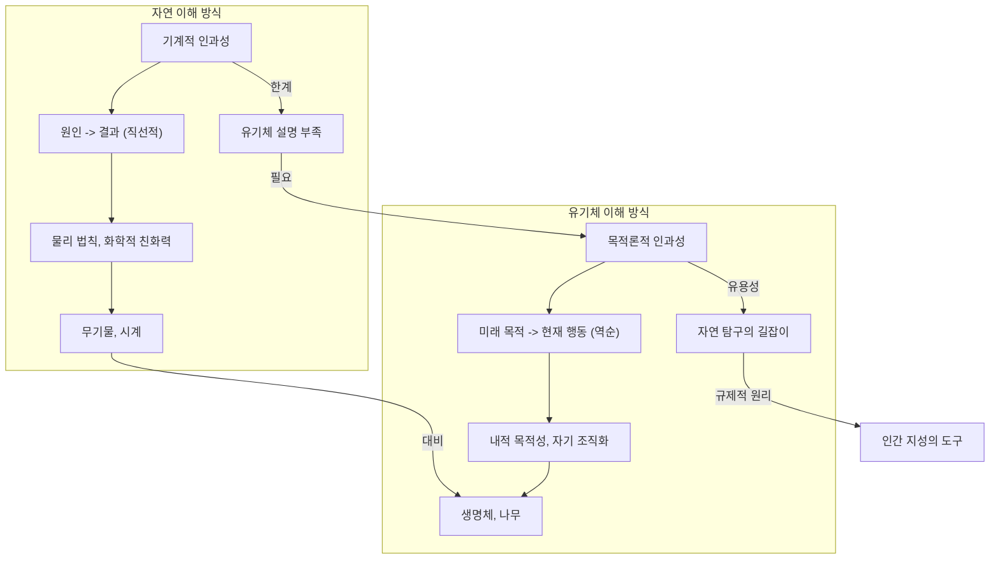
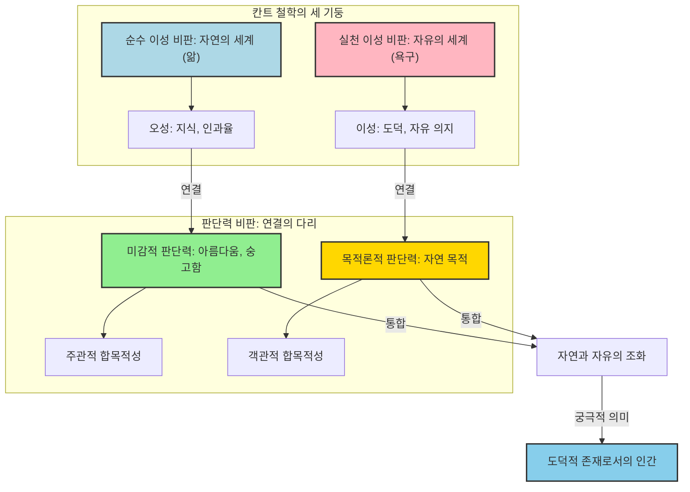

## 칸트의 '판단력 비판': 자연과 자유를 잇는 다리
이 책은 임마누엘 칸트가 쓴 세 권의 중요한 철학책 중 마지막 책이야. 우리가 세상을 이해하는 방식(과학)과 우리가 어떻게 살아야 하는지(도덕)라는 두 가지 큰 질문을 던졌던 칸트가, 이 두 가지가 서로 동떨어져 보이지만 사실은 연결되어 있다는 걸 보여주려고 쓴 책이라고 보면 돼. 아름다움을 느끼는 감정부터 시작해서, 자연이 왜 목적을 가진 것처럼 보이는지, 그리고 우리가 어떻게 도덕적인 존재가 될 수 있는지까지 깊이 파고드는 책이야.

## 1. 칸트 철학의 큰 그림: 두 개의 대륙과 깊은 시면 

1. **칸트 철학의 두 기둥**: 칸트는 우리가 세상을 이해하는 방식을 크게 두 가지로 나눴어.
  1. **자연의 세계 (**순수 이성**)**:
  - 이곳은 모든 것이 원인과 결과로 움직이는 곳이야. 마치 사과가 나무에서 떨어지거나 물이 위에서 아래로 흐르는 것처럼, 모든 것이 정해진 규칙대로만 굴러가는 거대한 기계 장치 같은 곳이지. 
  - 우리가 오감으로 경험하고 과학으로 탐구하는 바로 그 세계를 말해. 
  - 칸트의 첫 번째 책인 '순수 이성 비판'은 우리가 무엇을 알 수 있는지, 즉 우리 인식의 한계를 탐구했어. 
  2. **자유의 세계 (**실천 이성**)**:
  - 이곳은 도덕과 자유의 법칙이 숨 쉬는 곳이야. 인간이 본능이나 물리적인 원인과 결과에 얽매이지 않고 스스로 도덕적인 결정을 내릴 수 있는 숭고한 자유의 영역이지. 
  - 이곳은 눈에 보이지 않는 우리의 내면 세계로, '이렇게 행동해야만 한다'는 도덕 법칙이 존재하는 곳이야. 
  - 두 번째 책인 '실천 이성 비판'은 우리가 무엇을 해야만 하는지, 즉 도덕적인 당위의 문제를 다뤘어. 

2. **두 세계 사이의 깊은 시면**:
  1. 문제는 이 두 세계 사이에 도저히 건널 수 없을 것 같은 아득하고 캄캄한 시면이 가로놓여 있었다는 점이야. 
  2. 우리는 뼈와 살로 이루어져 물리 법칙에 지배를 받는 자연의 일부이면서 동시에 그 인과율을 끊어내고 도덕적인 자유를 행사하는 주체이기도 하니까, 정말 모순적이지? 
  3. 칸트는 이 간극을 '우리의 모든 인식 능력에게는 한없이 넓지만 동시에 접근할 수도 없는 영역'이라고 표현했어. 
  4. 만약 이 두 세계를 연결하는 다리를 놓지 못한다면, 우리의 도덕적인 결심이 물리적인 세계 속에서 실제 행동으로 이어질 수 없을 테고, 도덕이라는 건 결국 머릿속에서만 맴도는 공허한 자기만족에 불과할 거야. 

3. **판단력의 등장: 다리를 놓는 능력**:
  1. 칸트는 이 아득하게 갈라진 두 대륙을 무사히 이어줄 새로운 다리가 필요하다고 생각했어. 
  2. 그 다리의 이름이 바로 '판단력'이야. 
  3. 칸트는 인간의 영혼이 가진 세 가지 능력을 전통적인 삼단논법의 구조(대전제, 소전제, 결론)에 빗대어 설명했어. 
  - **지성 (오성)**: 어떤 현상에 대해 보편적인 법칙, 즉 대전제를 던져주는 지식의 능력이야. 
  - **이성**: 궁극적인 목적을 향해 나아가며 결론을 도출해내는 욕망의 능력이야. 
  - **판단력**: 이 둘 사이를 이어주는 중간자 역할을 해. 특정 개별 사례를 마주했을 때 그것을 보편적인 규칙 아래로 포섭하며 우리에게 쾌와 불쾌의 감정을 전달하는 능력이지. 
  4. 감정은 아는 것(지성)과 원하는 것(이성) 사이를 이어주는 중간 지대에 자리하고 있어. 
  5. 판단력은 감정과 연결된 정신 능력으로, 앎의 세계를 다루는 오성과 욕구의 세계를 다루는 이성 사이에 자리함으로써 둘을 연결할 수 있는 유일한 다리가 될 수 있는 거야. 

## 2. 아름다움의 비밀: 무관심한 만족과 자유로운 유희 

1. **아름다움이란 무엇인가**:
  1. 칸트는 판단력이 내리는 '반성적 판단'을 크게 네 가지 형태로 구분했어.
  - 달콤한 초콜릿을 먹을 때 느끼는 쾌적함. 
  - 누군가 위험을 무릅쓰고 타인을 돕는 것을 보았을 때 느끼는 도덕적인 감정. 
  - 아름다움. 
  - 숭고함. 
  2. 이 중 아름다움, 즉 미감적 판단이 어떻게 일어나는지를 설명하기 위해 칸트는 '자유로운 유희'라는 개념을 제시했어. 
  - **자유로운 유희**: 평소에 우리의 지성(오성)은 엄격한 감독관처럼 상상력이 가져온 감각적 재료들을 개념이라는 틀 안에 가두어 버려. '이것은 사과다', '이것은 의자다' 하고 딱딱하게 규정하고 분류하는 식이지. 
  - 하지만 우리가 어떤 대상을 보고 아름답다고 느낄 때는 지성이 그 엄격한 개념의 잣대를 들이밀기를 멈추고, 상상력이 가져온 다채로운 감각적 형태들과 부드럽게 어우러져 유희를 즐기기 시작해. 
  - 마치 무도회장에서 두 파트너가 서로를 통제하려 들지 않고 완벽한 호흡으로 왈츠를 추는 것과 같아. 
  - 이 인지 능력들의 자유로운 조화 속에서 느끼는 해방감, 그 순수한 쾌감이 바로 칸트가 말하는 아름다움의 본질이야. 

2. 목적 없는 합목적성:
  1. 아름다움을 유발하는 대상의 특징을 칸트는 '목적 없는 합목적성'이라고 불렀어. 
  2. 어떤 대상이 특정한 실용적인 용도나 뚜렷한 외부적 목적이 전혀 없음에도 불구하고, 마치 누군가 아주 정교한 의도를 가지고 설계한 것처럼 그 내부의 모든 부분들이 완벽한 형태적 조화를 이루고 있는 상태를 말해. 
  3. 예를 들어, 스마트폰이나 드라이버 같은 도구는 목적에 딱 맞게 잘 만들어졌다고 생각하지만, 그걸 보고 순수하게 아름다워서 눈물을 흘리지는 않아. 그것들은 편리함이나 나사 조이기라는 뚜렷한 목적이 있으니까. 
  4. 하지만 숲속 깊은 곳에 피어난 야생 난초를 생각해 봐. 그 꽃은 당신의 책상을 장식하기 위해 피어난 것도 아니고, 누군가에게 비싸게 팔리기 위해 존재하는 것도 아니야. 목적이 없지. 
  5. 목적이 전혀 없음에도 불구하고 그 난초의 꽃잎이 그리는 우아한 곡선, 미묘하게 번져가는 색채의 그라데이션, 줄기의 황금 비율을 보면 마치 최고의 예술가가 평생을 바쳐 치밀하게 조각한 것처럼 완벽해. 
  6. 외부적 목적이 없는데도 내적으로 완벽한 목적을 가진 것처럼 보이는 이 신비로운 형태의 조화가 바로 아름다움의 본질이야. 

3. **아름다움의 종류: **자유미와 부수미:
  1. 칸트는 아름다움의 종류를 두 가지로 나눴어.
  - 자유미: 어떤 대상이 사전에 '무엇이어야 한다'는 확정된 개념 없이 그 자체로 순수하고 온전한 것을 뜻해. 
  - 예를 들어, 이슬람 사원의 기하학적인 아라베스크 무늬나 잭슨 폴록의 추상적인 선과 색채를 볼 때, 그것이 현실에 무엇을 재현했는지 알 필요 없이 형태가 그려내는 패턴 그 자체만으로 상상력이 자유롭게 춤을 추며 기쁨을 줘. 
  - 개념이라는 닻을 완전히 끊어낸, 말 그대로 자유롭게 부유하는 아름다움이지. 
  - 부수미: 어떤 대상이 '어떠해야 한다'는 완벽성에 대한 개념이 은연중에 깔려 있는 상태에서 느끼는 아름다움이야. 
  - 예를 들어, 도로를 미끄러지듯 달려가는 최신형 스포츠카를 볼 때 우리는 아름답다고 느끼지만, 그 바탕에는 스포츠카라면 응당 공기저항을 최소화하고 엄청난 속도로 달릴 수 있는 구조를 갖춰야 한다는 뚜렷한 목적성에 대한 개념이 이미 깔려 있어. 
  - 자유미가 개념으로부터 완전히 해방된 투명하고 순수한 경험이라면, 부수미는 개념의 테두리 안에서 느껴지는 조금은 제약된 아름다움이라고 할 수 있어. 

4. 무관심성**: 순수한 미적 판단의 조건**:
  1. 칸트는 진정한 미감적 판단, 즉 순수한 취미 판단을 내리려면 '무관심성'이라는 엄격한 조건 하나를 반드시 지켜야 한다고 강조했어. 
  2. 여기서 말하는 무관심이란 대상 자체에 흥미가 없다는 뜻이 아니야. 대상을 향한 당신의 실질적인 이해관계나 욕구가 없어야 한다는 뜻이지. 
  3. 어떤 대상을 아름답다고 말할 때, 당신은 그 대상이 현실에 실제로 존재하는지, 혹은 그것을 당신이 소유하고 차지할 수 있는지에 아무런 관심이 없어야 해. 
  4. 예를 들어, 미술관에서 17세기 네덜란드 화가가 그린 탐스러운 과일과 빵이 놓인 정물화를 감상하다가 배가 고파서 저 빵을 먹고 싶다는 식욕을 느꼈다면, 그건 미적인 쾌감이 아니라 생리적인 욕구의 발현이라는 거야. 
  5. 그것은 대상을 소유하고 소비하려는 욕구이지, 무관심한 태도가 아니야. 
  6. 진정한 아름다움은 그것을 취하려는 어떠한 욕망도 없이 그저 대상의 형태를 조용히 관조하는 것만으로 보편적인 만족을 주는 순수한 기쁨이야. 
  7. 외부의 감각적 자극이나 끌어오르는 격렬한 감정에 전혀 기대지 않는, 아주 맑고 투명하며 고요한 상태에서의 판단이지. 

## 3. 숭고함의 경험: 이성의 위대함을 깨닫는 순간 

1. **숭고함이란 무엇인가**:
  1. 아름다움이 대상을 평온하게 관조하며 마음의 휴식과 조화를 얻는 상태라면, 숭고함은 우리의 마음을 격렬하게 뒤흔들고 산산조각 낼 듯 압도하는 움직임이야. 
  2. 아름다움이 지성과 상상력의 경쾌한 왈츠라면, 숭고함은 충돌과 불협화음에서 시작돼. 
  3. 숭고함은 형태가 없거나 너무 거대해서 끝이 없는 것처럼 보이고, 평온함보다는 두려움이 섞인 묘한 쾌감을 동반해. 
  4. 이것은 상상력과 이성이 서로 충돌하는 경험에 가깝지. 

2. **숭고함의 두 가지 형태**: 칸트는 숭고함을 우리 마음의 한계를 시험하는 두 가지 형태로 섬세하게 나누어 설명했어.
  1. **수학적 **숭고:
  - 인간의 유한한 감각으로는 도저히 그 끝이나 한계를 헤아릴 수 없는 압도적으로 거대한 크기 앞에서 느끼는 감정이야. 
  - 예를 들어, 제임스 웹 우주망원경이 찍어 보낸 수십억 광년 떨어진 은하들이 모래알처럼 흩뿌려져 있는 밤하늘을 마주했을 때를 떠올려 봐. 당신의 상상력은 그 엄청난 크기와 거리를 어떻게든 한눈에 포착하고 그려내려 애쓰지만, 결국 그 무한함 앞에서 처참하게 실패하고 붕괴해 버리고 말지. 
  - 이집트 피라미드나 로마의 성 베드로 대성당처럼 너무 거대해서 한눈에 담을 수 없는 건축물 앞에서 느끼는 감정도 마찬가지야. 
  - 상상력의 실패와 이성의 승리:
  - 우리의 상상력은 대상을 조각내어 세어 나가는 '파악'의 과정은 무한히 계속할 수 있지만, 그 무수한 조각들을 하나의 완전한 이미지로 직관 속에 아우르는 '포괄'의 능력은 어느 순간 한계에 부딪혀 버려. 
  - 상상력이 무한한 크기 앞에서 과부하가 걸려 다운되는 순간, 우리 마음은 스스로의 한계를 느끼고 일종의 고통을 겪게 돼. 
  - 하지만 바로 이 상상력이 패배하고 고통받는 지점에서 우리 내면의 이성이 번쩍이며 깨어나. 
  - 이성은 감각적 한계와 타협하지 않고, 상상력에게 무한이라는 총체성을 끝내 요구하고 상상해 내라고 압박하지. 
  - 결국 이 고통스러운 한계가 오히려 우리 안에 잠자고 있던 이성의 무한한 능력을 발견하는 짜릿한 쾌감으로 전환되는 순간이야. 
  2. **역학적 숭고**:
  - 시야를 뒤덮으며 몰려오는 거대한 쓰나미, 모든 것을 집어삼킬 듯 맹렬하게 불을 뿜어내는 화산, 번개가 내리치며 미친 듯이 소용돌이치는 성난 바다 같은 물리적인 폭력성 앞에서 느끼는 무력감이야. 
  - **안전한 거리의 중요성**: 칸트는 이 두려운 자연이 우리에게 숭고함으로 다가오려면 우리는 반드시 물리적으로 안전한 곳에 있어야 한다고 덧붙였어. 
  - 만약 화산 폭발 한가운데 있거나 침몰하는 배 위에서 생명의 위협을 받는다면 숭고함을 느낄 여유 따위는 없겠지. 그저 살아야겠다는 생존 본능만 남을 테니까. 
  - 따뜻하고 안전한 방 안에서 창밖으로 몰아치는 거대한 태풍을 바라보거나, 영화관 의자에 편히 앉아 재난 영화의 압도적인 쓰나미 장면을 볼 때만 우리는 그 파괴력에서 숭고함을 느껴. 
  - **도덕적 자각의 승리**:
  - 분명 물리적인 몸을 가진 당신은 저 거대한 자연의 힘 앞에서 한없이 연약한 존재야. 
  - 하지만 자연의 힘에 상상력이 무릎을 꿇고 좌절하는 바로 그 순간, 우리 내면의 가장 깊은 곳에서 잠들어 있던 이성이 번쩍이며 깨어나. 
  - '비록 나의 연약한 육체는 저 폭풍에 쉽게 부서지고 소멸할 수 있지만, 나의 본질은 저런 물리적 인과율에 얽매여 있지 않다. 나는 저 거대한 자연조차 갖지 못한 것, 즉 물리 법칙을 초월하는 자유와 도덕적 법칙을 품고 있는 숭고한 정신을 가졌다.' 이 강렬한 자각이 뇌리를 스치는 거야. 
  - 자연이 주는 생명의 위협에 완전히 짓눌리지 않고 어느 정도 안전한 거리에서 그 두려움을 관조할 때, 우리는 단순히 벌벌 떠는 것이 아니라 상상력의 한계에 부딪혀 고통받던 마음이 역설적으로 그 물리적 한계를 훌쩍 뛰어넘을 수 있는 인간 내부의 무한한 도덕적 초감각적 목적지를 깨달으며 엄청난 쾌감으로 도약하는 거야. 
  - 물리적 왜소함을 도덕적 위대함으로 역전시키는 인간 정신의 승리라고 할 수 있지. 

3. **숭고함과 도덕성의 **연결:
  1. 숭고함의 경험은 우리를 자연의 거대함 앞에 무릎 꿇리고 좌절시키는 게 아니야. 오히려 그 어떤 자연 현상도 침범할 수 없는 우리 자신의 내면적 존엄성을 깨닫게 하는 계기가 돼. 
  2. 화산의 힘이 내 육신은 파괴할 수 있어도 내 안에 도덕적 양심과 이성적 판단 능력은 파괴할 수 없다는 사실을 깨닫는 것, 이것이 자연을 초월한 내면의 힘에 대한 자각과 존경심이야. 
  3. 숭고함은 우리 안에 있는 '초감성적 규정'을 일깨워. 즉 우리는 단순히 먹고 자는 물리적 존재를 넘어서 자유 의지를 가지고 무엇이 옳고 그른지 판단하고 선택할 수 있는 도덕적 존재라는 사실을 문득 깨닫게 되는 거야. 
  4. 숭고함은 대상에 있는 것이 아니라 그것을 바라보는 우리 마음의 상태야. 거대한 자연은 그저 스위치 같은 것으로, 우리 마음속에 잠자고 있던 위대함을 탁 하고 켜주는 계기일 뿐이지. 
  5. 칸트는 숭고함을 느끼려면 우리에게 이미 도덕적 감정이 갖춰져 있어야 한다고 말해. 숭고한 경험이 우리를 도덕적으로 만드는 게 아니라, 거꾸로 우리 안에 도덕성이 있기 때문에 숭고함을 느낄 수 있다는 거야. 
  6. 결국 숭고함이란 자연의 위대함을 느끼는 경험이 아니라, 바로 우리 자신 안에 위대함을 느끼는 경험이라고 할 수 있어. 

## 4. 예술과 천재성: 자연이 예술에 규칙을 부여하는 방식 

1. **예술과 과학의 차이**:
  1. 칸트에게 있어서 예술은 과학과 아주 확연하게 구분되는 활동이야. 
  2. 수학이나 물리학 같은 과학은 명확한 개념, 공식, 논리적 증명 과정을 통해 얼마든지 학습하고 또 남에게 전달할 수 있어. 
  3. 하지만 칸트가 말하는 진정한 예술적 창조, 즉 순수 예술은 오직 '천재성'이라는 특수한 능력을 통해서만이 세상에 태어나. 
  4. 콜럼버스의 달걀 비유처럼, 과학은 방법을 알면 누구나 따라 할 수 있지만, 예술은 아는 것을 넘어 실제로 해내는 기술이야. 

2. **천재성의 본질**:
  1. 칸트는 천재성을 '자연이 예술에게 규칙을 부여하는 타고난 마음의 소질'이라고 정의했어. 
  2. 모차르트나 베토벤 같은 위대한 예술가들이 영혼을 울리는 교향곡을 작곡할 때, 첫 번째 마디는 이런 규칙으로, 두 번째 마디는 이런 공식으로 썼다고 명확하게 개념적으로 설명할 수 있을까? 불가능하지. 
  3. 자신도 모르는 사이 내면에서 무언가 끌어올라 악보 위에 음표를 쏟아낼 뿐이야. 
  4. 진정한 예술적 천재에게는 매뉴얼이 없어. 마치 자연이 숲속에서 씨앗을 키워 나무를 자라게 하고 꽃을 피워내듯, 그들의 내면에 깃든 무의식적이고 자연스러운 힘을 통해 미감적 이념들을 세계로 밀어내는 것이지. 
  5. 그들은 남의 규칙을 따르지 않아. 그들이 내놓은 작품 자체가 훗날 다른 이들에게 예술의 새로운 매뉴얼이자 모범이 되는 거야. 
  6. 천재의 가장 큰 특징은 압도적인 독창성이야. 모방이 아니라 창조를 하는 것이지. 
  7. 천재는 자연이 준 선물과 같아서, 천재 자신조차도 자기가 어떻게 그런 영감 넘치는 작품을 만들었는지 단계별로 설명하거나 가르칠 수가 없어. 그 창조 과정에는 분석이 불가능한 어떤 신비로움이 깃들어 있지. 

3. **취미의 역할: 천재성을 다듬는 정원사**:
  1. 맹렬하고 거친 천재성이 아무런 통제 없이 마음대로 뻗어나가기만 하면 문제가 생길 수 있어. 불꽃이 너무 뜨거우면 다 태워버리듯이 말이야. 
  2. 영감이 솟구치는 대로 끌어올리는 상상력의 재료들을 아무런 여과 없이 내놓기만 한다면, 그것은 이해할 수 없는 난해한 덩어리나 무질서한 헛소리로 변질될 위험이 커. 
  3. 여기서 이 야생마 같은 천재성을 제어하고 형태를 다듬어 사람들에게 전달될 수 있도록 만들어 주는 또 다른 능력이 등장하는데, 그것이 바로 '취미'야. 
  4. 천재성이 상상력에 비옥한 흙과 재료들을 끊임없이 공급해 주는 우물이라면, 취미 판단은 그것을 적절하게 가지치기하고 다듬는 정원사의 가위 같은 역할을 하는 거야. 
  5. 넘치는 것은 잘라내고, 튀는 것은 균형을 맞추어 보편적인 아름다움의 틀 안에 안착시키지. 
  6. 칸트가 생각한 참된 예술적 건전성이란 천재성의 뜨거운 불꽃과 취미의 차갑고 이성적인 제어가 아주 팽팽하게 조화를 이룰 때 비로소 완성되는 것이었어. 

4. **예술 작품의 '정신'과 '**미감적 이념**'**:
  1. 우리가 어떤 예술 작품을 보고 '기술은 좋은데 영혼이 없어' 혹은 '정신이 빠졌어'라고 말할 때가 있잖아. 칸트는 바로 그 '정신'(독일어로는 '가이스트')이 정확히 무엇인지를 설명해. 
  2. 이 '가이스트'는 작품의 생명력을 불어넣고 관람자의 상상력을 끝없이 자극하는 역동적이고 창조적인 정신으로 이해해야 해. 
  3. 이 정신이 깃들어 있을 때, 혐오스러운 괴물조차도 아름다운 예술 작품으로 승화될 수 있는 것이지. 
  4. 천재가 작품에 불어넣는 그 정신의 정체가 바로 '미감적 이념'이야. 
  5. **미감적 이념**: 상상력이 만들어낸 하나의 표상(이미지나 상징)인데, 이 표상은 아주 특별한 힘을 가지고 있어. 우리에게 수많은 생각들을 연쇄적으로 떠오르게 하지만, 결코 '이것은 바로 이것이다'라고 정의할 수 있는 단 하나의 명확한 개념으로는 설명되지 않아. 
  - 마치 언어라는 그물을 유유히 빠져나가는 풍부하고 무한한 의미의 덩어리 같다고 할 수 있지. 
  - 예를 들어, 로마 신화의 최고신인 주피터를 '신들의 왕'이라고 논리적으로 설명하는 대신, '발톱에 번개를 쥔 주피터의 독수리'라는 강렬한 이미지를 던져주는 거야. 
  - 이 이미지는 단순히 힘이 세다는 정보를 넘어, 신성한 위엄, 누구도 거스를 수 없는 무시무시한 힘, 피할 수 없는 신속하고 가혹한 정의 등 수많은 생각과 감정의 폭포수를 우리 마음속에 쏟아내게 해. 
  - 결국 천재의 가장 위대한 야망은 우리 이성이 품을 수 있는 가장 추상적이고 심오한 개념들(영혼, 창조, 자유, 지옥 등)을 우리 눈에 보이고 귀에 들리는 감각적인 형태로 만들어 우리 앞에 제시하는 것이야. 

5. **예술의 분류와 시의 우위**:
  1. 칸트는 미감적 이념을 어떤 매체로 전달하느냐에 따라 예술의 갈래를 나눴어. 
  - **언어 예술**: 수사학과 시. 
  - **조형 예술**: 건축, 회화, 조각, 조경. 
  - **감각 **유희** 예술**: 음악과 색채. 
  2. 칸트는 이 모든 아름다운 예술 중 '시'에 최고의 지위를 부여했어. 
  - 시는 오로지 천재성에 뿌리를 두고 상상력을 완전히 해방시켜 마음을 무한히 확장시키니까. 
  - 제한된 단어 안에서 미감적 이념을 가장 완벽하게 구현하는 것이 시의 권능이라고 본 것이지. 
  3. **수사학 비판**: 칸트는 수사학(대중을 설득하는 연설 기술)을 '사람의 마음을 조종하고 인간의 감정적인 약점을 파고드는 일종의 기계적인 설득 기술'이라고 비판했어. 
  - 법정이나 설교단처럼 진실과 엄숙한 의무를 다루어야 하는 자리에는 수사학이 전혀 어울리지 않는다고 강하게 비판했지. 
  - 대중을 선동하는 기술이 발전할수록 사회의 이성은 병든다는 경고처럼 들려. 
  4. **음악에 대한 평가**: 칸트의 음악에 대한 평가는 현대인의 시각에서는 조금 당황스러울 수 있어. 
  - 그는 감각에 강하게 의존하는 음악을 시보다 한 단계 낮게 평가했어. 
  - 음악은 말없이 강렬한 정서를 불러일으키는 건 인정하지만, 시처럼 오랫동안 곱씹을 수 있는 뚜렷한 개념을 남기지는 않아 일시적인 감정적 즐거움에 그치기 쉽다고 봤거든. 
  - 게다가 주변 사람들에게 원치 않는 소음으로 강요될 수 있다고 불평하기도 했어. 향수를 뿌린 사람이 방에 들어오면 원치 않아도 그 냄새를 맡아야 하는 것처럼, 음악도 청각을 통해 타인의 공간을 무례하게 침범할 수 있다는 아주 현실적인 지적이었지. 

## 5. 자연의 목적성: 기계론과 목적론의 조화 

1. **자연을 이해하는 두 가지 렌즈: 기계론과 목적론**:
  1. **기계론**:
  - 아주 정교하게 맞물려 돌아가는 거대한 시계 태엽을 떠올려 보면 이해하기 쉬워. 톱니바퀴 하나가 돌아가면 그 물리적인 힘 때문에 곧바로 다음 톱니바퀴가 밀려서 돌아가는 것처럼, 세상의 모든 자연 현상을 원인과 결과라는 건조한 물리적 법칙으로만 설명하려는 태도야. 
  - 이 관점은 근대 과학이 발전하는 데 필수적인 도구였고, 칸트 역시 이 점을 깊이 인정했어. 
  - 구름이 모이고 기압이 낮아지면 비가 오고, 온도가 영하로 떨어지면 물이 어는 것처럼, 어떤 의도가 숨어 있는 게 아니라 단순한 인과 관계라는 것이지. 
  2. **목적론**:
  - 우리가 길가에 피어난 들꽃 한 송이나 숲속을 뛰어다니는 다람쥐 한 마리를 마주할 때, 시계 태엽의 비유는 한계를 드러내. 
  - 시계는 아무리 정교해도 스스로 자신과 똑같은 시계를 낳지 못하고, 부품 하나가 고장 났다고 해서 스스로 상처를 치유하지도 못해. 
  - 하지만 생명체는 완전히 달라. 나무 한 그루를 예로 들면, 잎사귀는 뿌리를 위해 광합성을 하고, 뿌리는 잎사귀를 위해 물을 길어 올리지. 서로가 서로를 살리는 구조야. 
  - 생명체 내 각 부분들은 전체를 유지하기 위해 존재하고, 또 그 전체는 다시 각 부분을 살려두기 위해 존재해. 
  - 이것은 단순히 물리적인 원인과 결과가 당구공 부딪히듯 일직선으로 이어지는 기계론만으로는 도저히 설명이 안 되는 경이로운 현상이야. 
  - 마치 누군가 아주 분명한 의도와 목적을 가지고 처음부터 그렇게 지성적으로 설계한 것처럼 보이는 현상이지. 
  - 그래서 우리는 생명체를 이해하려고 할 때 목적론적 원리를 끌어오게 돼. 

2. 자연 목적**: 유기체의 특별한 인과성**:
  1. 칸트는 유기체의 비밀을 풀기 위해 '합목적성'이라는 핵심 개념을 도입했어. 어떤 것이 목적에 딱 들어맞는 것처럼 보인다는 의미야. 
  2. 주관적 합목적성: 대상이 우리 마음의 인식 능력들과 조화를 이루어 순수한 즐거움을 줄 때 경험하는 거야. 예를 들어 멋진 풍경을 보고 '아름답다'고 느낄 때처럼, 대상의 실제 목적과는 상관없이 우리 내부에서 일어나는 조화로운 느낌에 관한 것이지. 
  3. **객관적 합목적성**: 우리의 감정과는 무관하게 대상 자체가 어떤 내적인 목적을 위해 완벽하게 조직되어 있다고 판단하는 거야. 새 날개가 비행에 최적화된 구조를 갖추고 심장이 혈액을 순환시키는 기능을 하는 것을 볼 때처럼, 유기체 자체가 특정 목적을 위해 정교하게 조직되었다고 이성적으로 판단하는 것이지. 
  4. 칸트는 유기체만이 가진 아주 특별한 성질을 설명하기 위해 '자연 목적'이라는 개념을 만들어냈어. 
  - 살아 있는 존재 안에서는 각각의 부분들이 전체를 위해 존재하고 동시에 그 전체가 또 부분들을 위해 존재한다는 거야. 마치 서로가 서로를 끊임없이 만들어내는 끝없는 순환 고리 같다고 할 수 있지. 
  - 예를 들어, 잎은 나무 전체를 위해 광합성을 하지만, 나무 전체는 다시 새로운 잎을 만들어 내. 뿌리는 나무를 지탱하고 영양분을 공급하는데, 나무는 그 에너지로 다시 뿌리를 더 깊이 뻗게 만들지. 
  - 이처럼 모든 부분이 서로의 원인이자 동시에 결과가 되는 특별한 종류의 순환적 인과관계가 바로 자연 목적의 핵심이야. 
  5. **기계와 유기체의 차이**:
  - 시계의 톱니바퀴는 시계가 잘 작동하기 위해 존재하지만, 시계 자체가 새로운 톱니바퀴를 만들어 내거나 닳아버린 부품을 스스로 수리하지는 못해. 
  - 하지만 나무는 스스로를 조직하고 유지하는, 자기 자신이 원인이자 결과인 존재야. 
  - 이 '스스로를 조직하는 힘'(형성력)이 있느냐 없느냐가 생명체와 기계를 가르는 근본적인 차이점인 것이지. 

3. **목적론의 역할과 한계: **규제적 원리:
  1. 자연에서 이렇게 놀라운 목적성을 발견했다고 해서 '신이 정말로 자연을 이렇게 설계했습니다'라고 증명할 수 있다고 칸트는 말하지 않아. 오히려 그런 식의 주장이 얼마나 위험한지를 경고하고 있지. 
  2. 칸트에게 이 목적론은 현실이 실제로 그렇다는 '구성적 원리'가 아니야. 그보다는 우리가 자연을 연구할 때 '마치 그런 것처럼' 생각하면 유용하다는 '규제적 원리'일 뿐이야. 
  3. **미로 속 실타래 비유**: 마치 끝을 알 수 없는 너무나 거대하고 캄캄한 미로 속에 우리가 떨어져 탐험을 시작해야 하는 상황과 같아. 자연이라는 미로는 너무나 복잡해서 우리 인간의 짧은 경험과 유한한 지능으로는 그 전체 구조나 완벽한 법칙을 한눈에 다 파악할 수 없지. 
  - 그럴 때 우리가 미로 속에서 길을 완전히 잃지 않기 위해 할 수 있는 유일한 방법은 손에 긴 실타래를 쥐고 그 실을 조금씩 풀면서 앞으로 조심스럽게 나아가는 것이야. 
  - 자연을 연구할 때 이 실타래의 역할을 하는 것이 바로 목적론, 즉 반성적 판단력이야. 
  - 자연이 마치 지적인 창조주에 의해 어떤 일관된 목적과 규칙을 가지고 설계된 것처럼 일단 우리 스스로 가정을 하고 들여다본다는 것이지. 
  - 그래야만 그 무질서해 보이고 압도적인 현상들 속에서 어떤 패턴을 찾아내고 생태계를 분류하고 생명체의 기능을 의미 있게 연구할 수 있으니까. 
  - 이 실타래가 우리에게 미로의 진짜 객관적인 구조나 신의 존재 여부를 100% 증명해 주는 건 아니지만, 적어도 우리가 멈추지 않고 과학적 탐구를 계속해 나갈 수 있도록 돕는 아주 주관적이고 필수적인 안내선 역할을 하는 것이지. 
  4. 결국 목적론적 판단은 신의 존재를 증명하기 위한 망원경이 아니야. 그보다는 복잡한 생명 현상이라는 거대한 책을 우리가 읽어 나갈 수 있도록 도와주는 일종의 안경과 같아. 

4. 판단력의 이율배반**: 기계론과 목적론의 충돌과 해결**:
  1. 우리가 자연을 탐구할 때 사용하는 두 가지 상충하는 원칙들이 머릿속에서 정면으로 부딪히는 현상을 '판단력의 이율배반'이라고 불러. 
  - **첫 번째 원칙**: 모든 물질적 사물과 그 형태는 오로지 기계적 법칙에 의해서만 가능하다고 판단해야 한다. (과학의 대원칙) 
  - **두 번째 원칙**: 어떤 물질적 산물, 즉 유기체는 기계적 법칙만으로는 결코 판단할 수 없고 반드시 목적을 필요로 한다. 
  2. 이 두 원칙이 자연 자체가 어떤지를 단정 짓는 '구성적 원리'라면 완전히 모순되어 둘 중 하나는 무조건 거짓이어야 해. 
  3. 하지만 이 두 원칙이 자연 자체가 어떤지를 단정 짓는 것이 아니라, 오직 우리의 인지 능력이 자연을 탐구하고 이해하기 위해 채택하는 '반성적 규칙'이라고 시각을 살짝 틀어 보는 거야. 
  - **서로 다른 색깔의 안경 비유**: 마치 양손에 서로 다른 색깔의 안경을 쥐고 있는 것과 비슷해. 평소에는 기계론이라는 투명 안경을 끼고 세상의 모든 인과 관계를 설명하려 노력하다가, 생명체처럼 너무나 경이롭고 복잡한 현상을 마주하면 그 안경만으로는 시야가 흐려지니까 얼른 목적론이라는 색경으로 바꿔 끼고 그 안의 질서를 파악한다는 뜻이지. 
  - 대상을 파헤치기 위한 서로 다른 두 개의 렌즈 혹은 도구일 뿐이므로, 이 둘은 우리 내면에서 실제로 충돌하지 않는다는 것이지. 

5. **생명의 기원: 후성설과 형성 충동**:
  1. 칸트는 생명이 탄생하는 매 순간 신이 직접 개입한다는 '우일론'을 비판했어. 이는 자연의 일관된 법칙성을 무너뜨리고 과학적 탐구의 여지를 막아버린다고 보았지. 
  2. 또한, 태초에 이미 모든 생명체의 배아가 완성된 형태로 존재한다는 '전성설'도 거부했어. 이 이론은 잡종의 탄생이나 돌연변이, 유전 현상을 설명할 수 없었거든. 
  3. 칸트는 당시 자연학자 블루멘바우의 '후성설'을 수용했어. 후성설은 생명체가 백지 상태에 가까운 배아에서 출발해 발생 과정 속에서 점진적으로 그리고 스스로 형태를 갖춰 나간다는 이론이야. 
  4. **재즈 뮤지션 비유**: 아주 훌륭한 재즈 뮤지션들이 무대에서 연주하는 방식과 비슷하다고 할 수 있어. 전성설이 신이 모든 악보의 음표 하나하나를 처음부터 끝까지 다 적어 놓고 기계처럼 똑같이 연주하라고 지시한 것이라면, 후성설은 기본적인 테마와 화성학적 법칙이라는 거대한 뼈대만 던져주는 거야. 
  - 그 엄격한 뼈대를 주되, 그 안에서 뮤지션들이 스스로 환경과 분위기에 맞춰 끊임없이 새로운 멜로디와 변주를 창조해 낼 수 있는 재능, 즉 '형성 충동'을 생명체 내부에 부여한 것과 같아. 
  - 생명이란 곧 대자연이 연주하는 아주 즉흥적이고도 규칙적인 재즈 연주와 같다는 것이지. 
  5. 자연은 외부의 명령에만 수동적으로 움직이는 고장 난 기계가 아니라, 기계적 법칙이라는 엄격한 물리적 한계 안에서도 스스로를 조직하고 상처를 입으면 치유하고 환경에 맞게 적응하며 형태를 만들어내는 역동적인 힘을 내면에 품고 있다는 뜻이야. 

## 6. 자연의 궁극 목적: 인간과 문화 

1. **자연의 최종 목적은 인간**:
  1. 우리가 세상을 찬찬히 둘러보면, 광활한 대지의 흙이나 흐르는 강물, 공기는 그 자체로는 아무런 생명적 의도나 스스로의 목적이 없어. 
  2. 하지만 그것들은 묵묵히 씨앗을 품어 식물이 자라나는 완벽한 바탕이 되어주고, 그 식물은 초식동물을 먹여 살리고, 초식동물은 다시 육식동물의 먹이가 되어 거대한 생태계를 유지하게 돼. 
  3. 이처럼 꼬리에 꼬리를 무는 거대한 생태계의 사슬의 맨 꼭대기, 그 궁극의 목적지에는 과연 누가 서 있는 걸까? 칸트의 대답은 매우 명확하고 흔들림이 없어. 지구라는 지상 자연의 궁극적인 목적은 단 하나, 바로 '인간'이야. 
  4. 식물이나 동물은 이성이 없기 때문에 스스로 목적을 설정할 수 없고 그저 주어진 본능에 따라 살아갈 뿐이야. 
  5. 오직 인간만이 고도의 이성과 지성을 이용하여 가치를 창출하고 자연의 모든 사물을 자신의 목적을 위한 수단으로 사용할 수 있는 유일한 존재이기 때문이지. 
  6. 인간이 없다면 이 세계는 그저 무의미하게 돌아가는 맹목적인 연극 무대에 불과하다는 것이야. 

2. **인간의 역설: 자연의 목적이지만 자연의 편애는 없다**:
  1. 인간이 자연의 궁극적 목적이라고 해서 대자연이 마치 자애로운 어머니처럼 인간을 특별히 편애하거나 맹목적으로 보호해 주느냐, 자연의 섭리가 인간의 행복만을 위해 돌아가느냐 하면 전혀 그렇지 않아. 
  2. 지진으로 땅이 갈라지고 화산이 폭발하고, 눈에 보이지도 않는 끔찍한 전염병이 돌고, 잔인한 맹수가 달려드는 그 압도적인 대자연의 폭력 앞에서는 인간 역시 그저 나약하고 쉽게 부서지는 동물의 하나일 뿐이야. 
  3. 자연의 거대한 기계론적 파괴력은 그것이 휩쓸고 지나가는 자리에 있는 인간의 도덕적 가치나 위대함을 전혀 고려하지 않고 무자비하게 덮쳐와. 
  4. 이는 자연이 애초부터 인간이 그 품 안에서 온갖 쾌락을 누리며 안전하고 안락하게 살아가도록 운명 지어 놓지 않았다는 씁쓸한 진실을 뜻해. 
  5. 인간은 스스로를 지키기 위해 처절하게 투쟁해야만 하는 환경에 던져진 존재라는 점을 칸트는 절대 잊지 않고 짚어내. 

3. **인간의 진정한 목적: 행복이 아닌 문화**:
  1. 자연이 생태계의 꼭대기에 인간을 세워 두고서도 막상 인간의 행복이나 안락한 삶을 전혀 보장해 주거나 목적으로 삼지 않았다면, 도대체 자연은 이 험난하고 잔인한 세상에서 인간을 통해 무엇을 이루려고 하는 걸까? 
  2. 칸트는 단호하게 선언해. 자연이 인간에게 의도한 궁극적인 목적은 '행복'이 결코 아니라고. 
  3. 행복이라는 개념은 너무나도 주관적이고 인간의 덧없는 욕망과 끝없는 상상력에 따라 시시각각 변하기 때문이야. 어제의 행복이 오늘의 권태가 되기도 하니까. 
  4. 그렇다면 진짜 목적은 무엇인가? 칸트는 그것을 '문화'라고 불러. 
  5. 여기서 칸트가 말하는 문화는 단순히 예술을 즐기거나 문명을 화려하게 발전시키는 것을 넘어서, 인간이 스스로 목적을 설정하고 그것을 실현할 수 있는 능력을 기르는 모든 과정을 뜻해. 
  6. 특히 칸트는 이것을 '훈련의 문화'라고 부르며 아주 중요하게 다뤄. 우리는 육체를 가진 동물이기 때문에 끝없이 무언가를 욕망하고 남보다 앞서려 이기적으로 행동하려는 거친 본능을 가지고 있어. 
  7. 훈련의 문화란 바로 이러한 욕망과 동물적 본능의 폭정으로부터 우리 자신의 의지를 해방시키는, 말 그대로 뼈를 깎는 과정이야. 
  8. 내면의 야생성을 길들이고, 우리 안의 거친 동물적 본성을 스스로 제어하고 이성의 차분한 목소리를 따를 수 있는 내면의 자유를 획득해 나가는 수련의 과정, 그것이 자연이 인간에게 부여한 진정한 사명이라는 것이지. 

4. **전쟁의 역설: 문화 발전의 어두운 이면**:
  1. 문화가 발달해 나가는 인류의 역사를 되짚어 보면, 칸트도 텍스트 속에서 피할 수 없는 현실의 비참함을 고백해. 
  2. 극소수의 특권층이 수준 높은 문화와 예술, 과학을 여유롭게 즐기는 동안, 대다수의 평범한 사람들은 생계를 유지하기 위해 기계적인 노동에 시달리고 억압받아야 하는 끔찍한 불평등이 필연적으로 발생하니까. 
  3. 문화의 눈부신 발전 뒤에는 항상 타인의 피눈물 나는 희생이 따랐다는 씁쓸한 사실이 있지. 
  4. 칸트는 이러한 인류 발전의 어두운 이면을 '화려한 비참함'이라는 역설적인 표현으로 날카롭게 묘사했어. 
  5. 그는 가장 끔찍한 비극인 전쟁조차도 철학적이고 목적론적인 관점에서 해석해. 
  - 전쟁은 인간의 제어할 수 없는 이기심, 타인을 지배하려는 지배욕과 탐욕이 빚어낸 참혹한 결과물이야. 수많은 생명이 무의미하게 사라지는 순수한 악의 발현처럼 보이지. 
  - 하지만 놀랍게도 역설적이게도 인간은 이 파괴적인 고통과 전쟁의 위협 속에서 자신의 재능과 기술 문명을 극한으로 발달시키게 돼. 
  - 그리고 서로 죽고 죽이는 끊임없는 갈등과 파멸의 공포는 결국 인간들로 하여금 다 같이 멸망하지 않기 위해 억지로라도 평화 조약을 맺고 법적인 권위를 세우도록 강제해. 
  - 그 치열하고 참혹한 과정의 궁극적인 지향점은 국가 간의 거대한 갈등을 조율하고 평화를 유지할 수 있는 세계 시민적 공동체라고 칸트는 보았어. 
  - 즉, 자연은 인간의 그 끔찍한 악과 전쟁의 참상조차도 결국 인간을 법적이고 도덕적인 질서로 나아가게끔 거칠게 깎고 다듬는 채찍질, 일종의 도구로 사용한다는 아주 깊고도 서늘한 통찰을 보여주는 것이지. 

## 7. 신의 존재: 증명이 아닌 도덕적 요청 

1. **물리신학의 한계: 자연으로는 신을 증명할 수 없다**:
  1. 아주 작은 벌레 하나의 정교한 생명 구조를 가만히 들여다볼 때나 밤하늘의 별을 보며 우리는 자연스럽게 '이 모든 것을 만들어낸 위대한 설계자, 즉 신이 분명히 존재하겠구나' 하는 경외감을 느껴. 
  2. 하지만 칸트는 이런 방식으로 신의 존재를 증명하려는 시도, 즉 '물리신학'에 냉철한 메스를 들이대. 
  3. 물리신학은 자연에서 발견되는 목적성과 정교함을 증거로 삼아 신의 존재와 그의 도덕적 속성을 객관적으로 증명하려는 시도야. 마치 시계가 정교하니 훌륭한 시계공이 있다는 논리처럼 말이지. 
  4. 그러나 칸트의 논리에 따르면, 물리신학이 자연의 증거들을 통해 우리에게 증명해 줄 수 있는 것은 기껏해야 우주를 아주 정교하게 설계할 수 있는 뛰어난 지능을 가진 '우주적 건축가'나 '위대한 예술가'가 어딘가에 존재할지도 모른다는 개연성 정도야. 
  5. **성벽의 왕 비유**: 우리가 깊고 어두운 숲속을 걷다가 엄청나게 웅장하고 정교한 성을 발견했다고 상상해 봐. 우리는 이 성을 지은 사람이 천재적인 건축 기술을 가진 왕이라고 확신할 수 있지. 
  - 하지만 그 성벽의 돌덩이들을 아무리 뚫어지게 쳐다본다고 한들, 그 왕이 굶주리는 백성을 사랑하는 자비로운 통치자인지, 아니면 채찍을 휘두르는 잔혹한 폭군인지를 알아낼 방법은 없어. 
  - 경험적인 물질 데이터만으로는 그 배후에 있는 설계자의 도덕적 성품을 증명해 낼 수 없다는 것이지. 
  6. 우주가 아무리 수학적으로 정교하고 눈부시게 아름답다고 한들, 그 건축가가 우리 인간의 기준에서 완벽하게 선하고 도덕적이며 억울한 자를 구원하는 정의로운 창조주라는 사실을 물리적 증거만으로는 결코 입증할 수 없어. 
  7. 왜냐하면 우리가 사는 이 자연에는 숨 막히게 아름다운 생명도 있지만, 동시에 쓰나미로 무고한 생명이 한순간에 휩쓸려가고 맹수가 약자를 무참히 찢어 죽이는 무의미한 파괴와 고통, 불합리함이 똑같은 무게로 뒤섞여 있기 때문이야. 자연은 결코 도덕적으로 움직이지 않거든. 
  8. 요컨대, 자연이라는 거대한 책은 '이 세계는 도대체 왜 존재하는가?', '우리는 도덕적으로 살아야 하는데 왜 세상은 도덕적이지 않은가?'라는 인간의 가장 궁극적이고 형이상학적인 질문에 대해서는 그저 완벽하고 무겁게 침묵하고 있을 뿐이야. 

2. **도덕 목적론: 도덕적 삶을 위한 신의 요청**:
  1. 자연의 물리적 질서만으로는 영원히 채워지지 않는 거대한 공백을 메우기 위해 '도덕 목적론'이 등장해. 
  2. 자연 속에서는 아무리 현미경을 들이대도 도덕이나 양심의 세포를 발견할 수가 없어. 오직 인간의 내면, 우리 실천 이성 안에서만 '너는 마땅히 선해야 한다'는 도덕 법칙이 엄연한 사실로 존재하지. 
  3. 이 인간 내면의 도덕적 최종 목적을 우주 전체로 확장할 때 비로소 우리는 우주의 설계자를 단순한 기계 제작자에서 지고한 도덕적 입법자로 격상시킬 수 있게 돼. 
  4. **스피노자의 절망과 칸트의 도약**:
  - 평생을 철저하게 이타적이고 의롭게 살고자 노력했지만 신의 섭리 같은 건 믿지 않았던 무신론자 스피노자를 상상해 봐. 그는 자신이 아무리 선하게 살아간들, 대자연은 자신의 도덕성에 아무런 관심이 없다는 끔찍한 사실을 깨닫게 돼. 
  - 남을 짓밟고 부를 축적한 비열한 사기꾼이든, 평생 남을 위해 헌신하고 희생한 성자든, 자연의 맹목적인 기계론 앞에서는 똑같이 병에 걸려 고통받고, 똑같이 늙어가며, 결국에는 무의미한 혼돈의 심연, 완전히 똑같은 흙구덩이 무덤 속으로 무자비하게 던져지지. 
  - 이 서늘한 사실을 깨닫는 순간, 도덕을 지키려 했던 그의 모든 숭고한 노력은 대자연의 폭력성과 허무함 앞에서 완전히 산산조각 날 위기에 처해. '내가 왜 굳이 이토록 힘들게 선하게 살아야 하는가?' 이것이 바로 무신론적 도덕주의자가 필연적으로 마주하게 되는 가장 깊은 도덕적 절망의 순간이야. 
  - 바로 이 깊은 절망과 딜레마의 지점에서 칸트의 위대한 철학적 도약이 일어나. 
  - 우리의 내면은 목소리를 높여 '최고선'(도덕적으로 선한 사람이 그의 걸맞은 행복을 누리는 완벽하게 정의로운 세계)을 향해 도덕적으로 살라고 강력하게 명령하는데, 현실의 자연 법칙은 그것을 전혀 돕지 않고 오히려 잔인하게 방해해. 
  - 이 거대한 모순 속에서 우리가 도덕적 노력을 냉소하며 포기하지 않고 그 숭고한 의무를 끝까지 밀고 나가기 위해서는, 우리는 '인과율이 지배하는 차가운 자연의 법칙과 당위가 지배하는 뜨거운 도덕 법칙을 최종적인 차원에서 조화시켜 줄 수 있는 유일한 존재, 즉 도덕적인 세계의 창조자인 신의 존재를 요청할 수밖에 없다'는 것이지. 
  5. **'요청'의 의미**: 여기서 '요청'이라는 단어가 매우 중요해. 
  - 이것은 물리적 증거나 이론적인 지식을 통해 신의 존재를 객관적으로 100% 입증해 냈다는 뜻이 절대 아니야. 
  - 신이 과학적으로 존재한다는 것이 아니라, 우리가 허무주의에 빠지지 않고 도덕적 존재로서 살아가기 위한 실천적이고 필연적인 필요에 의해 신의 존재를 우리 마음속에 주관적으로 받아들이고 가정해야만 한다는 뜻이야. 
  - 자연을 관찰해서 신을 증명하려던 물리신학이 처참하게 실패한 그 빈자리에, 인간의 자유와 도덕성이 기반한 도덕적 신학이 웅장하게 들어서는 순간이지. 
  - 칸트가 말하는 이 도덕적 신의 요청은 우리의 유한한 지성을 뛰어넘는 신비의 영역을 겸허히 인정하는 것이야. 
  - 단지 우리가 스스로 부여한 숭고한 도덕적 목적을 잃지 않기 위해, 언젠가는 궁극적으로는 이 무심한 자연과 우리의 도덕적 열망이 하나로 수렴될 것이라는 깊은 희망을 유추를 통해 확립해내는 정교하고도 위대한 철학적 건축물인 셈이지. 

3. **이성의 한계와 신앙의 역할**:
  1. 칸트는 초감각적인 영역, 즉 신이나 영혼 같은 대상에 대해서는 이성의 한계를 아주 명확하게 긋는 것이 오히려 우리에게 엄청나게 유익하다고 분석했어. 
  2. **태양 비유**: 마치 한낮에 태양의 실체를 내 눈으로 똑똑히 파악하겠다고 맨눈으로 태양을 뚫어지게 바라보면 시력을 잃어버리는 것과 같아. 
  - 태양의 표면을 해부하듯이 직접 볼 수는 없지만, 그 태양이 비춰주는 밝은 빛을 이용하면 우리가 걸어가야 할 도덕적인 길을 아주 또렷하게 확인하면서 걸을 수 있잖아. 
  - 초감각적 존재를 대하는 우리의 태도도 딱 이와 같아야 한다는 것이지. 
  3. **이론적 증명의 실패**: 칸트는 신의 존재를 이론적으로 증명하려는 네 가지 전통적인 방식들이 왜 실패할 수밖에 없는지 해체했어. 
  - **삼단논법**: 초감각적인 존재는 우리의 시간과 공간이라는 경험적 틀 밖에 있기 때문에 논리적 기계 장치 안에 아예 입력할 수 없어. 
  - **유추**: 유한한 인간의 뇌가 작동하는 방식을 무한하고 초감각적인 신에게 똑같이 부여할 수는 없어. 
  - **확률**: 확률이나 개연성이라는 개념 자체가 성립하려면 경험적 데이터라는 토대가 있어야 하는데, 초감각적 대상에 대해서는 경험적 데이터가 없으므로 확률을 논할 수 없어. 
  - **가설**: 어떤 현상을 설명하기 위해 가설을 세우려면 최소한 그 가설에 등장하는 대상이 현실에서 존재할 수 있다는 근본적인 가능성이 확실해야 하는데, 신이나 영혼의 불멸 같은 초감각적 존재는 그 가능성을 경험적으로 증명하거나 담보할 길이 없어. 
  4. **세 가지 인식 층위**: 칸트는 우리가 무엇을 어느 수준까지 인식할 수 있는지 세 가지 층위로 분류했어. 
  - **의견의 대상**: 지금 당장은 확인하거나 증명할 수 없지만, 미래에 경험할 가능성이 열려 있는 대상들(에테르, 외계 행성의 거주자 등). 
  - **사실의 대상**: 삼각형의 네 각의 합이 180도라는 기하학의 원리나 오감을 통해 당장 확인하고 증명할 수 있는 경험적 사물들. 
  - 놀랍게도 '자유'가 유일하게 이 사실의 층위로 진입하는 개념이야. 자유는 초감각적인 이념이지만, 인간이 본능을 억누르고 도덕적 법칙에 따라 행동하는 실제 행동을 통해 그 실제성이 증명되기 때문이지. 
  - **신앙의 대상**: 신, 초월적인 최고선, 영혼의 불멸 같은 것들. 여기서 신앙은 맹목적인 믿음이 아니라, 우리가 도덕적인 의무를 끝까지 수행하기 위해 마음속으로 반드시 전제해야만 하는 자발적이고 실천적인 확신을 의미해. 

## 8. 아름다움은 도덕성의 상징이다 

1. **미는 도덕성의 상징**:
  1. 칸트는 '미는 도덕성의 상징이다'라고 선언했어. 
  2. 언뜻 들으면 고개가 갸우뚱해질 수 있어. 향기나 색채 같은 감각적인 아름다움이 어떻게 의무나 선 같은 엄숙한 도덕의 이념과 연결될 수 있을까 하고 말이야. 
  3. **맷돌 비유**: 헌법과 법치에 의해 평화롭게 통치되는 군주국은 살아 움직이는 육체에 비유하고, 절대 권력자 개인의 폭력적인 의지에 의해 억눌린 전제 국가는 손으로 돌리는 맷돌에 비유했어. 
  - 맷돌은 누군가 손잡이를 돌리는 물리적인 힘에 의해 맹목적으로 곡식을 짓눌러 가루로 만들어 버려. 전제주의 독재 국가 역시 절대자의 폭력적인 의지에 의해 시민들의 자유를 기계적으로 짓눌러 버리지. 
  - 외형은 전혀 다르지만 작동하는 내부의 메커니즘이 같다는 것이 상징의 핵심이야. 
  4. 우리는 무의식적으로 이 거대한 상징의 방식을 자연의 아름다움에도 매일 적용하면서 살아가고 있어. 
  - 크고 곧게 뻗은 삼나무 숲을 올려다보면서 장엄하다고 말하고, 봄이 되어 밝게 핀 꽃이 가득한 들판을 보며 풍경이 화나게 웃고 있다고 표현하지. 파스텔톤의 부드러운 색채를 보며 순진무구하다거나 겸손하다고 느끼기도 해. 
  - 사실 나무와 꽃, 색채에는 아무런 인격이나 도덕적 의지가 없는데도 말이야. 
  5. 그럼에도 우리가 그렇게 느끼는 이유는 아름다움을 경험할 때 우리 마음이 작동하는 방식이 도덕적 판단을 내릴 때의 마음과 너무나도 깊이 닮아 있기 때문이야. 
  - 아름다운 풍경을 볼 때 우리는 이기적인 소유욕이나 이해관계를 확 내려놓고, 그저 대상 그 자체를 관조하면서 상상력의 자유를 만끽해. 
  - 이처럼 사심 없이 대상을 존중하는 내면의 상태는 우리가 도덕적인 행동을 결단할 때 요구되는 순수하고 이타적인 마음의 상태와 완벽한 평행선을 이뤄. 
  - 그래서 칸트에게 아름다움이란 우리를 감각적 쾌락이라는 좁고 이기적인 방에서 이끌어내어 더 숭고하고 보편적인 도덕적 감정의 바다로 건너가게 해주는 아름다운 상징의 다리가 되는 것이지. 

2. **아름다움과 도덕성의 유사성**:
  1. 우리가 아름다움을 느낄 때의 마음 상태와 우리가 도덕 법칙을 따를 때의 마음 상태가 그 구조가 놀라울 정도로 유사하다는 것이 칸트의 논리야. 
  2. 우리가 아름다운 꽃을 보고 즐거워할 때, 우리는 그 꽃을 소유하거나 다른 용도로 사용하려는 어떤 이기적인 이해관계도 없이 순수하게 그 형식의 조화를 즐겨. 
  3. 마찬가지로 우리가 정말로 도덕적인 행위를 할 때는 어떤 이익이나 칭찬을 바라서가 아니라, 그것이 마땅히 해야 할 의무이기 때문에 행하는 거잖아. 
  4. 이 두 가지 경험 모두 '사심 없음'이라는 공통된 구조를 가져. 
  5. 바로 이 점 때문에 아름다움은 도덕성의 상징이 될 수 있다는 것이지. 

3. **자연미와 도덕적 품성**:
  1. 칸트는 특히 자연의 아름다움에 대한 순수한 관심이 선한 품성의 증표가 될 수 있다고 주장해. 
  2. **나이팅게일 노래 비유**: 숲속에서 들려오는 아름다운 새 소리에 깊이 매료되는데, 그것이 어떤 목적도 없이 순수하게 자연이 만들어내는 소리라고 믿기 때문이야. 
  - 그런데 만약 나중에 알고 보니 그 소리가 사실은 어떤 소년이 교묘하게 흉내낸 것이었다는 사실을 알게 되면, 우리의 감동은 순식간에 사라져 버릴 거야. 
  - 이것은 우리가 자연의 아름다움에서 단지 예쁜 형태나 소리만이 아니라, 어떤 기만도 없는 진실성, 즉 도덕성과 유사한 가치를 발견하고 있음을 보여주는 아주 좋은 예시야. 

## 9. 칸트 철학의 완성: 자연과 자유의 통합 

1. **칸트 철학의 최종 목표**:
  1. 칸트의 '판단력 비판'은 그의 철학 여정의 마지막 대작으로, 서로 전혀 다른 두 세계(자연의 세계와 자유의 세계)가 어떻게 연결될 수 있는지 탐험하는 위대한 여정의 시작점이야. 
  2. 이 책은 칸트가 이전에 썼던 두 권의 책에서 엄격하게 분리했던 두 세계, 즉 '사실의 세계'(자연)와 '당위의 세계'(도덕)를 통합하는 다리 역할을 해. 
  3. 우리는 미적 경험과 자연의 목적성을 통해서 이 차가운 인과 법칙의 세계 속에서도 더 깊고 의미 있는 도덕적 세계의 가능성을 엿볼 수 있게 된 것이지. 

2. **판단력의 통합적 역할**:
  1. '판단력 비판'은 '순수 이성 비판'이라는 거대한 기둥과 '실천 이성 비판'이라는 또 다른 기둥을 연결해서 그 위에 웅장한 아치를 완성시키는 마지막 쐐기돌(키스톤) 역할을 해. 
  2. 이 돌이 제자리에 딱 박힘으로써 칸트의 철학이라는 거대한 건축물 전체가 비로소 하나의 견고하고 완전한 구조물로 완성되는 거야. 
  3. 우리가 자연 속에서 아름다움을 느끼고 또 목적을 발견하면서, '아, 이 필연적인 자연 법칙의 세계와 저 자유로운 도덕의 세계가 완전히 동떨어진 게 아니구나. 결국에는 조화를 이룰 수 있겠구나' 하는 희망을 품게 되는 것이지. 

3. **궁극적인 메시지**:
  1. 칸트가 던지는 마지막 메시지는 정말 놀라워. 우리가 아름다운 석양을 보면서 느끼는 그 벅찬 감정이 단순히 개인적인 취향의 문제가 아니라, 어쩌면 이 세계의 근본적인 구조를 엿볼 수 있는 아주 중요한 단서라면 어떨까? 
  2. 칸트는 바로 이걸 이야기하는 거야. 우리가 느끼는 가장 사적인 감정인 이 아름다움이 어쩌면 저 차가운 인과 법칙의 세계와 우리의 따뜻한 도덕적 자유의 세계를 연결하는 바로 그 연결고리일 수 있다는 것이지. 
  3. 그 벅찬 감동의 순간은 어쩌면 이 우주가 우리의 도덕적 이상과 조화를 이룰 수 있다는 희미한 신호이자, 두 세계를 잇는 다리가 실제로 존재한다는 증거일지도 몰라. 
  4. 결국 가장 중요한 건 이거야. 우리가 자연을 마치 어떤 목적을 가진 것처럼, 마치 우리의 도덕적 사명을 위해 준비된 무대인 것처럼 바라볼 수 있다는 바로 그 사실. 
  5. 이게 왜 중요하냐면, 우리가 물리 법칙에 지배를 받는 이 현상 세계의 일부이면서도 동시에 그 세계를 뛰어넘는 자유로운 도덕의 주체로서 살아갈 수 있다는 가능성을 활짝 열어 주기 때문이야. 
  6. 차가운 기계적 자연 속에서도 의미를 발견하고 그 의미의 정점에 우리의 도덕적 삶을 딱 세움으로써, 칸트는 근대 철학의 가장 거대한 프로젝트 중 하나를 성공적으로 완성시킨 것이지. 

