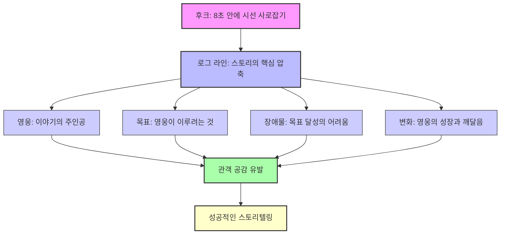
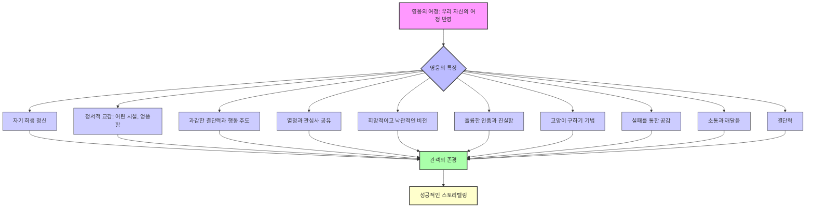

## 픽사 스토리텔링: 마음을 움직이는 이야기의 비밀
이 책 '픽사 스토리텔링'은 픽사 애니메이션 스튜디오에서 20년 넘게 스토리와 캐릭터를 만들어온 매튜 룬이 스토리텔링의 힘과 그 방법을 알려주는 책이다. 스토리텔링이 왜 중요한지, 어떻게 사람들의 마음을 사로잡고 행동하게 만드는지, 그리고 위대한 스토리를 만드는 구체적인 방법들을 쉽고 재미있게 설명한다. 개인의 삶부터 비즈니스, 마케팅까지 모든 분야에서 스토리가 어떻게 성공을 이끄는지 깨닫게 해줄 것이다.

## 1. 스토리텔링, 왜 중요할까? 

1. **스토리텔러는 세상을 움직이는 사람이다.**
  - 스토리텔러는 미래 세대의 비전, 가치, 그리고 중요한 의제(어젠다)를 설정하는 역할을 한다. 
  - 예를 들어, 스티브 잡스는 25년 동안 사람들에게 감동과 웃음, 용기를 주며 인생을 바꿀 경험을 제공했다. 
  - 저자 매튜 룬도 픽사에서 20년 넘게 스토리와 캐릭터를 만들고, 할리우드에서 시나리오를 쓰며, 비즈니스 리더들에게 스토리 제작법을 강의하는 스토리텔러이다. 
2. **인간은 스토리를 갈망하는 존재이다.**
  - 우리는 스토리를 듣고, 보고, 말하고, 다시 이야기하는 것을 좋아한다. 
  - 욕망과 두려움을 스토리텔링으로 표현하며, 스토리는 삶에 활력과 의미를 부여한다. 
  - 트위터에 글을 올리거나 인스타그램에 사진을 올리는 것도 일종의 스토리텔링이다. 
  - 악수, 손잡기, 요리하기, 이마 찡그리기 같은 평범한 행동에도 감정을 전달하는 스토리가 담겨 있다. 
  - 소설, 영화, 홍보, 연설, 브랜드 광고, 심지어 가족이 운영하는 장난감 가게까지, 우리 주변 세상은 온통 스토리로 가득하다. 
3. **스토리는 정보를 기억하게 하고 감동을 준다.**
  - 그냥 정보나 통계 자료만 보면 사람들은 5%밖에 기억하지 못한다. 
  - 하지만 같은 정보라도 스토리나 사건과 함께 전달하면, 사람들은 그 정보를 훨씬 오래 기억한다. 
  - 심리학자 제롬 브루너에 따르면, 스토리를 통해 정보를 접할 때 22배나 더 잘 기억한다고 한다. 
  - 어릴 적 저자가 수업 시간에 숫자를 잊어버린 것도 정보에 스토리가 없었기 때문이다. 
  - 소설 '정글북'의 저자 루디야드 키플링은 "역사를 이야기로 가르치면 절대 잊어버리지 않을 것이다"라고 말했다. 
4. **스토리는 깊은 유대감을 형성한다.**
  - 보석 전문업체 티파니 앤 컴퍼니는 서사, 색상, 서체, 이미지를 조화시켜 인상적인 브랜드 스토리를 전달한다. 
  - 상징적인 로빈 블루 색상은 고요함과 일상 탈출의 정서를 자아내고, 우아하고 정교한 느낌을 준다. 
  - 광고에 사용되는 사진과 이미지는 사랑과 로맨스의 정서를 풍긴다. 
  - 이 모든 것이 합쳐져, 티파니 제품을 한 번도 구매한 적 없는 사람에게도 마음속에 남는 인상적인 브랜드 스토리를 전달한다. 
  - 콘텐츠를 스토리 속에 넣으면 머릿속에 5%밖에 남지 않던 내용이 65%까지 남게 되며, 깊은 유대감을 느끼게 된다. 
  - 픽사의 영화 '인사이드 아웃'을 본 관객들은 어떤 스토리가 기억에 남고 어떤 스토리가 잊히는지 그 과정을 이해하게 된다. 

## 2. 스토리가 우리에게 미치는 과학적인 영향 

1. **스토리는 기억에 남고 직접적으로 영향을 미친다.**
  - 인류의 조상들은 생사가 엇갈리는 상황에서 스토리텔링을 통해 의사소통하고 삶의 교훈을 남겼다. 
  - 고대 인류의 동굴 벽화는 일종의 스토리보드였으며, 그들의 지혜는 스토리로 살아남았다. 
  - 스토리는 우리를 감정의 롤러코스터에 태우고, 몸 안에서 화학작용을 일으켜 실질적인 영향을 미친다. 
  - 기쁨의 눈물과 슬픔의 눈물은 화학 성분이 다르다는 이론도 있다. 
  - 웃거나 미소 지을 때는 도파민과 엔돌핀이 분비되고, 슬프거나 우울할 때는 옥시토신이 분비된다. 
  - 이런 감정의 오르락내리락이 사람들을 이야기에 몰입하게 만든다. 
2. **감정의 롤러코스터를 활용한 **스토리텔링**.**
  - 영화 '업'의 첫 장면은 사람들을 웃고 울고 뭉클하게 만드는 대표적인 예이다. 
  - 젊은 남녀가 사랑에 빠져 결혼하고 자녀 계획을 세우는 행복한 순간에는 도파민과 엔돌핀이 분비된다. 
  - 여자가 불임 판정을 받는 장면에서는 행복 호르몬이 무너지며 옥시토신이 분비되어 연민을 느끼게 한다. 
  - 남자가 아내를 감싸며 여행을 제안할 때는 다시 행복 호르몬이 솟구치지만, 여행 경비가 없다는 사실에 다시 무너진다. 
  - 노인이 된 남자가 아내와의 약속을 기억하고 비행기 표를 사려 할 때 다시 행복해지지만, 아내에게 표를 주기도 전에 아내가 세상을 떠나는 장면에서 관객은 큰 슬픔을 느낀다. 
  - 이처럼 감정의 급격한 변화는 관객을 이야기에 붙잡아 두는 강력한 힘이 된다. 
  - 위대한 리더나 연설가들은 이러한 긴장과 이완의 기술을 활용하여 사람들을 움직인다. 
3. **스티브 잡스의 **롤러코스터 스토리텔링**.**
  - 스티브 잡스는 정보를 전달하거나 픽사의 비전을 이야기할 때 스토리와 정보를 잘 연결했다. 
  - 2007년 아이폰을 처음 선보이던 날, 그는 롤러코스터 스토리텔링 방식을 활용했다. 
  - "2년 반 동안 기다린 바로 그 날입니다"라는 말로 관객의 감정을 고조시켰다. 
  - "지금껏 나온 모든 스마트폰은 전혀 스마트하지 않았죠. 오히려 멍청했습니다"라고 말하며 분위기를 가라앉혔다. 
  - "하지만 제 스마트폰은 컴퓨터만큼 스마트합니다"라고 다시 분위기를 반전시켰다. 
  - "스타일러스 펜을 사용하는 모든 스마트폰이 거추장스럽지 않으셨습니까?"라고 다시 질문하며 불편함을 상기시켰다. 
  - "하지만 제 스마트폰은 완벽한 터치스크린 방식입니다. 손가락만 움직여서 아이폰의 모든 기능을 조정할 수 있습니다"라고 말하며 관객의 환호를 이끌어냈다. 
  - 이처럼 감정의 롤러코스터를 태우는 것이 마음을 움직이는 스토리를 전달하는 핵심이다. 
4. **결정은 감정에서 시작된다.**
  - 우리가 내리는 모든 결정(신발 선택, 배우자 선택, 공연 관람 등)은 감정을 토대로 이루어진다. 
  - 큰 결정이든 작은 결정이든, 모든 결정은 감정이 시작되는 우뇌에서 이루어진다. 
  - 그다음 자신의 선택이 좋았는지 아닌지를 판단하는 과정은 좌뇌에서 이루어진다. 
  - 스토리텔링은 전달자와 청중 사이에 개인적인 유대감을 형성하여, 사람들이 결정을 내리는 데 영감을 준다. 
  - 예를 들어, 영화 '포레스트 검프'에서 주인공이 버스 정류장에서 타인에게 자신의 인생 이야기를 들려주며 유대감을 형성하는 것처럼 말이다. 

## 3. 8초 안에 고객의 시선을 사로잡는 '후크' 

1. **후크는 독자의 시선을 사로잡는 첫인상이다.**
  - 이야기를 시작할 때 첫 줄부터 독자를 사로잡아야 한다. 마치 "내 말 좀 들어봐, 궁금해서 못 견딜 걸"이라고 말하는 것과 같다. 
  - 사람의 집중력은 평균 8초밖에 지속되지 않는다. 
  - 투자자 앞에서 사업을 설명하거나, 회사에서 프레젠테이션을 하거나, 광고를 할 때 8초 안에 관심을 끌지 못하면 이미 끝난 게임이다. 
  - 사람들이 당신의 가게에 오거나 웹사이트에 방문하기 전에, 충분히 들을 만한 가치가 있는 스토리가 있다는 확신을 심어주어야 한다. 
2. **할아버지의 '고릴라 조'와 '물로켓' 후크.**
  - 저자의 할아버지는 장난감 가게에 사람들이 눈길도 주지 않고 지나치는 것을 보고, 관심을 사로잡을 전략을 궁리했다. 
  - 할아버지는 키 1.8m의 거대한 고릴라 인형 '조'를 유리 진열장에 놓았다. 조는 기계장치가 있어 사람들이 지나갈 때마다 몸을 돌리거나 흔들었다. 
  - 조는 사람들의 관심을 사로잡았고, 사람들은 가게 안에는 무엇이 있을지 궁금해하며 가게로 들어왔다. 
  - 할아버지는 물로켓을 발사해 인도 한복판에 착륙시키거나, 가게 앞에서 커다란 동물 옷을 입고 물로켓을 쏘아 올리기도 했다. 
  - 저자의 아버지는 가게 유리창 앞에서 장난감을 조립하는 모습을 보여주어 아이들의 호기심을 자극했다. 
  - 이 모든 것이 사람들의 관심을 낚는 '후크' 기술이었다. 
3. **'만약에'로 시작하는 후크.**
  - 할리우드 감독이나 포춘 선정 CEO들 앞에서 강연할 때, 특별하고 예측 불가능하며 갈등을 불러일으키는 후크가 필요하다. 
  - "만약에"로 시작하는 시나리오가 8초 안에 승부수를 던지는 데 도움이 된다. 
  - **영화 '**인크레더블**'**: "만약에 슈퍼히어로들이 사람을 구하는 일이 금지된다면 어떨까?" 
  - **영화 '**라따뚜이**'**: "만약에 프랑스 요리 전문가가 꿈인 생쥐가 있다면 어떨까?" 
  - **영화 '**굿 다이노**'**: "만약에 소행성이 지구와 충돌하지 않아 공룡이 멸종되지 않았다면?" 
  - **영화 '**토이 스토리**'**: "만약에 어떤 아이에게 가장 아끼던 장난감 대신 새 장난감이 생긴다면?" 
  - 이러한 후크는 영화뿐만 아니라 회사 직원들의 사기를 북돋우거나 고객의 마음을 움직일 때도 효과적이다. 
  - **스티브 잡스의 아이팟**: 2001년 아이팟을 소개하며 "만약에 여러분의 주머니에 수천 곡의 노래를 담아서 다닐 수 있다면 어떻겠습니까?"라는 후크를 던졌다. 
  - **일론 머스크의 테슬라**: "만약에 한 기업에서 미적으로 대단히 매력적인 전기 자동차를 만든다면 어떻겠습니까?"라는 후크를 사용했다. 
  - 이러한 '만약에' 후크는 평범한 세상을 뒤흔들고 사람들의 마음을 사로잡는다. 
4. **간단명료하고 시각적인 후크.**
  - 후크는 긍정적일 수도 있고 부정적일 수도 있으며, 전달하고 싶은 스토리에 따라 달라진다. 
  - 테슬라는 긍정적인 후크로 전기차의 대안을 제시했다. 
  - 인크레더블은 부정적인 후크로 슈퍼히어로 활동 금지라는 상황을 제시했다. 
  - 8초 안에 승부를 보려면 후크는 간단명료해야 한다. 
  - 알버트 아인슈타인은 "단순하게 설명하지 못하면 그 내용을 충분히 이해하지 못한 것이다"라고 말했다. 
  - **영화 속 간단명료한 후크 예시**: 
  - '좋은 친구들': "내가 기억할 수 있는 가장 오래 전부터 나는 늘 갱스터가 되고 싶었다."
  - '토이 스토리': "나는 강도다, 다들 꼼짝 마!"
  - '페리스의 해방': "부모님을 속이는 비결은 바로 축축한 손이야. 축축한 손은 아주 훌륭한 비특이성 증상이지. 이제 난 그것 때문에 아주 큰 신뢰를 얻고 있어."
  - 아리아나 허핑턴은 저서 '제3의 성공'에서 "2007년 4월 6일, 나는 피를 흥건히 흘린 채 집 사무실 바닥에 쓰러져 있었다"라는 첫 문장으로 독자를 사로잡았다. 
  - 후크는 시각화할 수도 있다. 영화 포스터, 잡지 사진, 유리 진열장의 고릴라처럼 말이다. 
  - **찌그러진 노트북 사례**: 보험 회사 직원이 찌그러진 노트북을 고객 앞에서 열어 보여주며, 자신이 겪었던 사고와 보험 혜택 경험을 스토리로 풀어내 고객의 호기심을 자극하고 공감을 얻었다. 
  - 시각뿐 아니라 후각, 청각, 촉각, 미각 등 다른 감각으로도 청중을 사로잡을 수 있다. 
  - 무료 음식, 사탕, 향수, 핸드크림, 와인 등은 관심을 끌고 대화의 물꼬를 트는 도구다. 
  - 장난감 가게에서는 아이들이 좋아하는 영화 음악을 틀고, 고소한 팝콘을 나눠주며, 나무 기차나 태엽 장난감을 직접 체험하게 한다. 
  - 가게 벽에 사진, 그림, 포스터를 붙여 가게의 역사를 보여주는 것도 시각적 후크이다. 

## 4. 스토리를 압축하는 '로그 라인'과 '엘리베이터 피치' 

1. **후크는 맛보기, 로그 라인은 스토리의 핵심이다.**
  - 후크는 스토리에 대한 궁금증을 유발하는 맛보기 장치일 뿐, 스토리는 아니다. 
  - 후크를 스토리로 전환하려면 '로그 라인'을 만들어야 한다. 
  - 로그 라인은 수천 년 동안 스토리텔링에 사용된 4가지 요소를 포함해야 한다. 
  - 로그 라인은 30초에서 3분 사이에 말할 수 있어야 하며, 심지어 한 문장으로 끝날 수도 있다. 
  - 엔터테인먼트 산업에서는 로그 라인을 '엘리베이터 피치'라고도 부른다. 
  - 엘리베이터에서 거장 감독과 단둘이 탔을 때, 그가 내리기 전 짧은 순간에 아이디어를 소개하는 것처럼 말이다. 
  - 비즈니스에서는 이 로그 라인이 기업의 강령(미션 스테이트먼트)이 되기도 한다. 
2. **로그 라인 예시: 영화 '**몬스터 주식회사**'** 
  - **로그 라인**: 몬스터 세계에서 최고의 겁주기 몬스터인 설리는 우연히 인간 아이와 친구가 되면서 아이들이 몬스터에게 해롭지 않다는 사실을 알게 되는데, 이때부터 온갖 위험, 즉 직업을 잃거나 감옥에 가거나 가장 친한 친구와 멀어지게 되는 위험을 무릅쓰고 아이들을 겁주는 행위가 잘못되었다는 사실을 폭로한다.
  - **영웅**: 설리 (아이들 겁주기 전문 몬스터)
  - **목표**: 아이들을 겁주는 행위가 잘못되었다는 진실을 폭로해 아이들을 구하는 것.
  - **장애물**: 직장에서 해고당하는 것, 가장 친한 친구를 잃는 것, 추방당하는 것.
  - **변화**: 순진했던 설리가 의식이 깨어있는 몬스터로 변화할 것이다.
3. **로그 라인 예시: 페이스북** 
  - **로그 라인**: 사람들이 공동체를 만들고 더 가깝게 지내도록 하여 친구 및 가족과 유대감을 유지하고 세상에서 벌어지는 일들을 알며 자신들에게 무엇이 중요한지 공유하고 표현하게 한다.
  - **영웅**: 모든 사람 (페이스북 사용자)
  - **목표**: 사람들이 공동체를 만들고 더 가깝게 지내는 것.
  - **장애물**: 세상은 너무 넓어 사람들이 유대감을 유지하기 어렵다.
  - **변화**: 사람들은 친구 및 가족과 유대감을 유지하고 세상에서 벌어지는 일을 알며 자신들에게 중요한 문제를 공유하고 표현할 수 있다.
4. **로그 라인의 4가지 요소 활용법.**
  - **영웅**: 개인이든 기업이든 목표를 향해 나아가야 한다. 용을 물리치거나, 새로운 고객을 확보하거나, 더 좋은 제품을 만드는 것 모두 목표가 될 수 있다. 
  - **장애물**: 영웅은 반드시 장애물과 마주해야 한다. 그래야 관객은 긴장감을 놓지 않고 스토리에 몰입한다. 
  - 장애물은 살인마, 경쟁자, 실패한 우주선처럼 흐름에 방해가 되는 사건이나 인물, 반전 등이 될 수 있다. 
  - **변화**: 스토리의 끝에서는 영웅이 변화를 겪게 되며, 이 과정이 잘 흘러간다면 관객도 변화하게 된다. 
  - **당신의 로그 라인 만들기**: 당신이 함께 일했거나 일하고 싶은 사람이나 조직의 목표, 장애물, 그리고 당신의 제품/서비스/해결책이 어떤 도움을 주며 어떤 긍정적 변화를 선사하는지 적어보자. 
  - **다른 로그 라인 예시**: 
  - "만약에 현재 고객과 잠재 고객에게 더 가까이 다가가 더 좋은 영향력을 미칠 데이터를 체계화하는 방법이 있다면 어떤가?"
  - "만약에 저소득 가정에 무료로 금융 서비스와 프로그램을 제공해 자신의 집을 소유하고 경제적 안정을 확보하는 데 도움을 줄 수 있다면 어떤가?"
  - "만약에 즐겁게 노는 것이 인생에서 가장 중요한 일인 단순한 시절로 돌아가게 해주는 장난감 가게가 있다면 어떤가?"
  - "만약에 일상의 쓰레기를 친환경 연료로 바꾸어 어떤 드로리안에도 사용할 수 있다면 어떤가?" (영화 '백투더퓨처'의 미스터 퓨전 로그 라인)

## 5. 우리가 푹 빠지는 '영웅'의 비밀 

1. **영웅은 스토리의 중심이자 우리의 거울이다.**
  - 영웅은 큰 역경에도 인내하고 견뎌낼 힘을 추구하는 평범한 개인이다. 
  - 저자의 가족 이야기처럼, 모든 스토리에는 시작, 중간, 끝이 있고 영웅이 등장한다. 
  - 영웅이 보여주는 비전, 용기, 자기 희생 정신은 남녀노소 모두에게 감동을 준다. 
  - 수만 년 전 동굴 벽화나 고대 길가메시 서사시에서도 영웅의 모습을 찾아볼 수 있다. 
  - 인간은 태생과 상관없이 자신을 인생의 주인공이라고 생각하며, 영웅의 여정은 우리 자신의 여정을 반영하거나 우리가 가고 싶은 길을 보여주기 때문에 공감한다. 
  - 영화 '트루먼 쇼'의 트루먼처럼, 때로는 우리가 인생의 주인공인데도 타인의 들러리가 된 것 같은 기분이 들 때가 있어 영웅과 유대감을 느끼고 싶어 한다. 
  - 영웅은 스토리텔링에서 가장 중요한 캐릭터인 주인공(프로타고니스트)으로 등장한다. 
  - 그리스어로 프로타고니스트는 '앞장서서 싸우는 사람' 또는 '시련에 처한 사람'이라는 뜻이다. 
  - 영웅은 스토리를 담아내는 그릇이며, 영웅의 관점은 우리의 자기중심적인 현실을 반영한다. 
2. **무엇이 스토리를 독창적으로 만드는가?** 
  - 모든 스토리는 영웅이 등장하고 시작, 중간, 끝 구조를 이루지만, 누가 이야기하느냐에 따라 내용은 전혀 달라진다. 
  - **인류 최초의 **스토리텔러: 사냥꾼들은 생존을 위해 죽인 동물들에 대한 이야기를 통해 인간과 동물의 관계, 미지의 세계를 설명했다. 
  - **농경 사회의 스토리**: 농업으로 삶의 방식이 바뀌면서, 식물의 순환처럼 끝없이 순환하는 신비의 상징이 스토리에 담겼다. 
  - **현대인의 스토리**: 현대인은 세계대전, 경제 대공황, 전염병, 컴퓨터, 인터넷, 로봇, 우주선 등 새로운 사건과 문명을 경험하며 '소셜 네트워크', '스타워즈' 같은 스토리를 창조한다. 
  - 우리가 창조하는 스토리는 자기만의 고유한 경험에 영향을 받는다. 
  - 뒷마당에서 겪은 일, 첫 키스 이야기 등 일상이 모두 스토리의 금광이다. 
  - 누구에게나 자신만의 '스토리 지문'이 있다. 
  - 가족의 어린 시절 고생담이나 개인적 경험에서 영감을 얻은 고전 영화('스탠 바이 미', '해리포터')도 많다. 
  - 픽사의 영화 대부분은 우리 주변에서 일어나는 일들, 지난 100년간 일어난 일들에 관한 이야기이다. 
  - 슈퍼히어로, 자동차 발명, 인구 과잉, 쓰레기 증가, 환경 문제 등이 픽사의 상상력에 불을 지피는 소재가 된다. 
  - 청중에게 스토리를 효과적으로 전달하려면, 길가메시나 우디처럼 영웅의 유사성을 활용하여 나만의 스토리를 만들어야 한다. 
  - 지극히 개인적인 이야기지만, 세상 사람들에게 익숙한 메시지나 교훈을 신선한 방식으로 전달하는 새로운 스토리가 된다. 
  - 이런 스토리를 만들려면 청중이 공감할 수 있는 훌륭한 영웅이 반드시 필요하다. 
3. **훌륭한 영웅(리더)을 만드는 방법.** 
  - **자기 희생 정신**: 신화학자 조지 캠벨은 영웅을 자신보다 더 큰 존재를 위해 자기를 희생하는 사람으로 정의한다. 
  - 정서적 교감: 영웅과 관객 사이에는 반드시 정서적 교감이 이루어져야 한다. 관객은 주인공을 좋아하고, 그의 대의명분을 신뢰해야 한다. 
  - 영웅이 매혹적일 때, 그 캐릭터는 판매를 촉진하고, 브랜드를 강화하며, 고객과 긴밀한 유대감을 쌓게 된다. 
  - 사람들은 영웅이 운전하는 차, 입는 옷, 먹는 음식을 따라 하고 싶어 한다. 
  - 영웅은 사람뿐 아니라 동물, 사물, 만화 캐릭터도 될 수 있다. 아이들이 만화 캐릭터 장난감을 사고 싶어 하는 것처럼 말이다. 
  - **어린 시절 보여주기**: 호감형 영웅이나 리더를 만드는 가장 좋은 방법은 그의 어린 시절을 보여주는 것이다. 누구에게나 어린 시절이 있기 때문에 관객의 마음을 얻기 쉽다. 
  - 영화 '모아나'는 첫 10분 동안 모아나가 아기 거북이를 보호하는 모습을 보여주며 호감을 얻는다. 
  - '스타워즈'의 악당 다스 베이더도 어린 시절 로봇과 포트레이서를 만들던 아이였다는 사실을 보여주며 호감형 캐릭터의 면모를 드러낸다. 
  - 공감대를 높이기 위해 영웅을 고아로 설정하기도 한다. 월트 디즈니, 로알드 달, JK 롤링 등 많은 작가가 이 기법을 사용했다. 
  - **엉성하고 엉뚱한 면모 부여**: 우스꽝스러운 모습이나 엉뚱한 성격을 보여주며 약한 특징을 부여하면 호감을 살 수 있다. 
  - 어둡고 음침한 악당이라도 그보다 더 사악한 악당이 존재하면 관객의 호감을 얻기도 한다. (예: 다스베이더가 황제 팰퍼틴에게 복종하는 모습) 
  - 영웅이 희생자의 처지가 되면 관객은 더 연민을 품는다. 
  - **과감한 결단력과 행동 주도**: 영웅은 스토리 속에서 과감한 결단력으로 행동을 주도해야 한다. 그렇지 않으면 관객은 흥미를 잃는다. 
  - **열정과 관심사 공유**: 리더도 대중이 공감할 만한 열정과 관심사를 보여준다. 
  - 정치인들이 색소폰 연주, 농구, 젤리빈 선호, 브로콜리 싫어함 등 개인적인 특징을 부각하여 대중과 친밀해지는 '하우디 팩터'를 활용하는 것처럼 말이다. 
  - **희망적이고 낙관적인 비전**: 리더는 반드시 희망적이고 낙관적인 비전을 보여주어야 한다. 주인공의 여정은 긍정적이고 실현 가능해야 한다. 
  - 주인공은 의심이 많거나 좌절한 캐릭터일지라도, 성공의 가능성이 있으면 신념을 가지고 역경에 맞서 싸운다. 
  - **훌륭한 인품과 **진실함: 리더는 인품도 훌륭해야 하며, 진실함과 공정함의 가치를 두어야 한다. 
  - 주인공은 스스로에게 진실해야 하고, 여정을 통해 진실해져야 대중의 마음을 얻는다. 
4. **'**고양이 구하기**' 기법과 실패를 통한 공감.** 
  - **고양이 구하기**: 스토리 초반에 주인공이 자신보다 못한 처지에 있는 다른 캐릭터에게 인정을 베푸는 모습을 보여주는 기법이다. 
  - 어린 모아나가 아기 거북이를 돕는 장면, 미스터 인크레더블이 고양이를 구하거나 노인을 돕는 장면, 알라딘이 고아들에게 빵을 나눠주는 장면 등이 이에 해당한다. 
  - 이는 관객으로부터 즉각 공감을 얻고, 주인공이 신뢰할 만한 캐릭터임을 보여주는 효과적인 방법이다. 
  - 기업이나 리더들도 환경이나 사회 분야에 기부하는 행위를 통해 진정성 있는 공감대를 형성한다. 
  - **동료에게 보답**: 좋은 리더는 주위 사람을 돕는 일에 인색하지 않으며, 자신에게 도움을 준 동료들에게 칭찬이나 보상으로 보답한다. 
  - 비즈니스에서는 보너스, 연봉 인상, 승진 등의 형태로 이루어진다. 
  - **실패를 통한 공감**: 영웅은 늘 성공해서 존경받는 것이 아니라, 절대 포기하지 않기 때문에 존경받는다. 
  - 영화 '인디아나 존스'는 끊임없이 실패하고 소중한 것을 잃어버리지만, 관객은 그의 실패를 통해 공감하고 긍정적으로 생각한다. 
  - 픽션이든 논픽션이든, 사랑받는 영웅과 리더는 모두 쉽게 상처받는 약한 존재이며, 싸우고, 실패하고, 승리한다. 
  - 스티브 잡스도 넥스트와 리사 컴퓨터에서 수많은 실패를 겪었고, 마이클 조던도 약 1만 2천 번의 슛을 실패했지만 여전히 전설이다. 
  - 리더가 꿈과 목표를 포기할 때 관객은 그를 싫어한다. 영웅은 끝까지 싸울 것이라는 사실을 관객에게 알려야 한다. 
  - 월트 디즈니는 "승리와 패배의 차이는 멈추지 않는 데 있다"고 말했다. 
5. **소통과 깨달음, 그리고 **결단력**.** 
  - **소통**: 영웅은 소통의 DNA를 타고났으며, 자신의 생각을 진심을 담아 말하고 어려운 상황일수록 더욱 돋보인다. 
  - 영웅은 도움을 요청하고, 먼지 자욱한 길 한복판에서 적과 마주한다. 
  - 스토리의 마지막에 영웅은 여정에서 깨달은 교훈으로 관객과 소통하며, 그 지혜에는 이야기의 핵심 주제가 담겨 있다. 
  - 영화 '업'에서 주인공 칼은 아내의 책을 통해 "모험을 함께 해줘서 고마워요. 이젠 당신만의 새로운 모험을 떠나세요"라는 메시지를 발견하고, 아내를 놓아주어야 한다는 깨달음을 얻는다. 
  - 리더도 직원, 동료, 고객과 이런 깨달음을 공유해야 한다. 
  - **결단력**: 리더는 결단력이 있어야 하고, 영웅도 마찬가지다. 
  - 실패와 죽음이 임박했을 때 영웅은 머뭇거리지 않고 결정을 내린다. 
  - 바라던 결과가 아니더라도 주저하거나 애매한 태도를 취하지 않는다. 
  - **다양한 캐릭터의 필요성**: 좋은 스토리를 만들려면 행동을 주도하는 영웅과 더불어 멘토, 동맹, 악당 등 다른 캐릭터도 필요하다. 
  - '스타워즈'에서 오비완 케노비, 레아, 한솔로, 추바카, C-3PO, R2-D2, 다스 베이더 같은 캐릭터들이 없었다면 루크 스카이워커의 이야기는 지루했을 것이다. 

