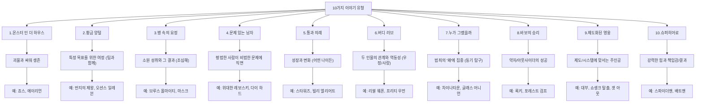
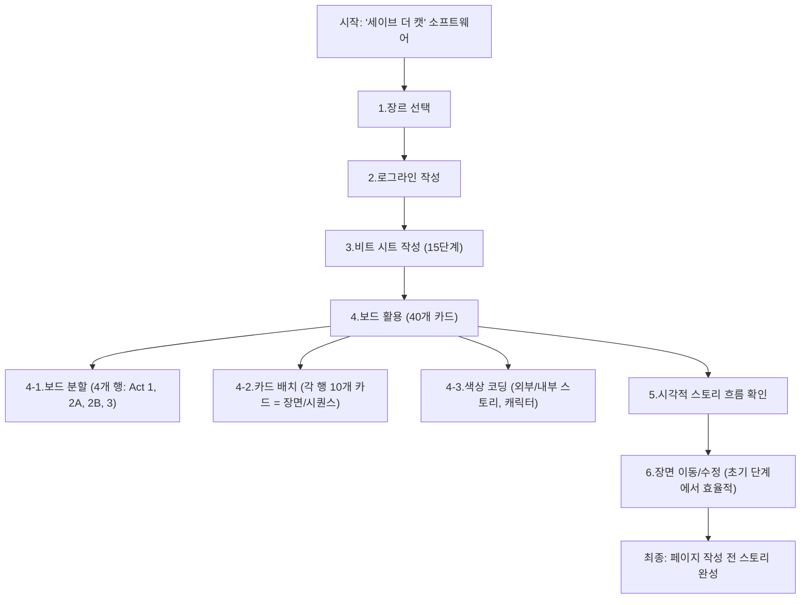

## 블레이크 스나이더의 '세이브 더 캣'으로 스토리 만들기 
이 책은 영화 시나리오를 쓰는 사람들을 위한 책인데, 복잡한 이야기를 쉽고 명확하게 만드는 방법을 알려주는 책이야. 특히 '비트 시트'라는 15가지 단계로 스토리를 구성하는 방법을 제시해서, 누구나 좋은 이야기를 만들 수 있도록 도와주는 것이 핵심 메시지라고 보면 돼.

## 1. '세이브 더 캣'이란 무엇일까? 

1. **제목의 의미**: '세이브 더 캣(Save the Cat)'은 주인공이 초반에 고양이를 구하는 것처럼 착한 행동을 해서 관객들이 주인공을 좋아하게 만드는 장면을 말해 .
  - 이 장면은 주인공이 겉으로는 거칠거나 나쁜 사람처럼 보여도, 속으로는 좋은 사람이라는 걸 보여줘서 관객들이 주인공에게 공감하고 응원하게 만드는 역할을 해 .
  - 마치 처음 만난 사람이 무뚝뚝해도 길 잃은 강아지를 도와주는 걸 보면 '아, 저 사람 좋은 사람이구나' 하고 생각하게 되는 것과 같다고 보면 돼.
2. **책의 탄생 배경**: 작가인 블레이크 스나이더는 시나리오 작가로 활동하면서 겪었던 경험과 배운 점들을 모아서 이 책을 썼어 .
  - 그는 시나리오 작업이 잘 풀리지 않던 시기에, 자신이 배운 것들을 정리해서 다른 작가들이 좀 더 쉽게 글을 쓸 수 있도록 돕고 싶어 했지 .
  - 이 책은 출간되자마자 엄청난 인기를 얻었고, 많은 영화 제작자와 작가들에게 큰 영향을 주었어 .

## 2. 블레이크 스나이더의 '비트 시트' 15단계 

블레이크 스나이더의 '비트 시트'는 마치 건물을 지을 때 설계도처럼, 이야기의 뼈대를 15가지 핵심 단계로 나누어 설명하는 방법이야. 이 단계들을 따라가면 이야기가 탄탄해지고, 관객들이 몰입하기 쉬워진다고 보면 돼 .

1. 오프닝 이미지** (**Opening Image**)** 
  - 이야기 시작 부분에 나오는 한 장면으로, 주인공의 평범한 일상이나 이야기의 전체적인 분위기를 보여주는 거야.
  - 마치 영화 포스터처럼, 이 한 장면으로 영화가 어떤 내용일지 짐작하게 해주는 거지.
  - 예시: <mark>라이온 킹</mark>에서 프라이드 록에서 모든 동물이 모여 심바의 탄생을 축하하는 장면 . 평화로운 왕국의 모습을 보여주며 이야기의 시작을 알린다.

2. 테마** 제시 (**Theme Stated**)** 
  - 이야기가 무엇에 대한 것인지, 어떤 메시지를 전달할 것인지 넌지시 알려주는 대사나 장면이야.
  - 주인공이 겪게 될 갈등이나 깨달음을 미리 보여주는 힌트라고 생각하면 돼.
  - 예시: <mark>라이온 킹</mark>에서 무파사가 심바에게 "햇빛이 닿는 모든 곳이 우리의 왕국이다"라고 말하는 장면 . 심바의 책임감과 미래의 왕으로서의 운명을 암시한다.

3. 설정** (**Setup**)** 
  - 주인공과 주변 인물들을 소개하고, 그들의 성격, 목표, 그리고 부족한 점들을 보여주는 부분이야.
  - 관객들이 주인공에게 공감하고, 앞으로 어떤 일이 벌어질지 궁금하게 만드는 단계라고 보면 돼.
  - 예시: <mark>라이온 킹</mark>에서 심바의 어린 시절, 왕이 되고 싶은 꿈, 그리고 스카의 질투심을 보여주는 장면 .

4. 촉매** (**Catalyst**)** 
  - 주인공의 삶을 완전히 바꿔놓는 중요한 사건이야. 이 사건 때문에 주인공은 더 이상 평범하게 살 수 없게 되고, 새로운 여정을 시작하게 돼.
  - 마치 도미노가 쓰러지기 시작하는 첫 번째 도미노처럼, 모든 이야기의 시작점이 되는 사건이지.
  - 예시: <mark>라이온 킹</mark>에서 무파사의 죽음 . 이 비극적인 사건이 심바의 도피와 성장의 계기가 된다.

5. **숙고 (**Debate**)** 
  - 촉매 사건 이후, 주인공이 '내가 이 일을 해야 할까?', '도망칠까?' 하고 고민하는 부분이야.
  - 마치 중요한 결정을 앞두고 밤새도록 고민하는 것처럼, 주인공의 내면적인 갈등을 보여주는 단계지.
  - 예시: <mark>라이온 킹</mark>에서 심바가 죄책감에 시달리며 왕국을 떠나 도망치는 장면 .

6. 2막 진입** (Break into Two)** 
  - 주인공이 고민을 끝내고, 새로운 세상으로 발을 들이는 결정적인 순간이야. 이제 이야기는 본격적으로 새로운 국면으로 접어들게 돼.
  - 마치 새로운 게임의 다음 레벨로 넘어가는 것처럼, 주인공의 여정이 시작되는 지점이라고 보면 돼.
  - 예시: <mark>라이온 킹</mark>에서 심바가 티몬과 품바를 만나 하쿠나 마타타의 삶을 시작하는 장면 .

7. B 스토리** (**B Story**)** 
  - 주요 이야기와는 별개로 진행되는 또 다른 이야기인데, 주로 주인공의 내면적인 성장이나 다른 인물과의 관계를 다루는 경우가 많아.
  - 마치 메인 요리 옆에 나오는 사이드 메뉴처럼, 주된 이야기의 맛을 더 풍성하게 해주는 역할을 해.
  - 예시: <mark>라이온 킹</mark>에서 심바가 티몬과 품바와 함께 성장하며 새로운 우정을 쌓는 과정 .

8. **즐거움과 게임 (**Fun and Games**)** 
  - 주인공이 새로운 세상에서 겪는 재미있거나 흥미로운 일들을 보여주는 부분이야. 영화 예고편에 나올 만한 신나는 장면들이 주로 여기에 해당돼.
  - 마치 여행의 초반에 새로운 풍경을 즐기는 것처럼, 주인공이 새로운 환경에 적응하며 즐거움을 느끼는 시기라고 보면 돼.
  - 예시: <mark>라이온 킹</mark>에서 심바가 티몬과 품바와 함께 하쿠나 마타타를 부르며 걱정 없이 지내는 장면들 .

9. 중간점** (**Midpoint**)** 
  - 이야기의 절반 지점으로, 상황이 크게 반전되거나 주인공의 목표가 더 명확해지는 중요한 순간이야. 이제 주인공은 되돌아갈 수 없는 지점에 도달하게 돼.
  - 마치 게임에서 중간 보스를 물리치고 다음 단계로 넘어가는 것처럼, 이야기의 흐름이 완전히 바뀌는 지점이라고 보면 돼.
  - 예시: <mark>라이온 킹</mark>에서 심바가 날라를 다시 만나 스카가 왕국을 망치고 있다는 소식을 듣는 장면 . 심바는 과거의 책임을 다시 마주하게 된다.

10. **악당이 다가온다 (**Bad Guys Close In**)** 
  - 중간점 이후, 주인공에게 닥쳐오는 위협이나 어려움이 점점 커지는 부분이야. 내면적인 갈등이 심해지거나 외부의 적들이 더욱 강하게 압박해와.
  - 마치 폭풍우가 몰아치기 시작하는 것처럼, 주인공의 상황이 점점 더 힘들어지는 시기라고 보면 돼.
  - 예시: <mark>라이온 킹</mark>에서 스카의 폭정으로 왕국이 황폐해지고, 심바가 자신의 역할에 대해 다시 고민하는 장면 .

11. **모든 것을 잃다 (**All Is Lost**)** 
  - 주인공이 모든 희망을 잃고 절망에 빠지는 가장 낮은 지점이야. 때로는 소중한 것을 잃거나 큰 실패를 겪기도 해.
  - 마치 바닥까지 떨어져 더 이상 내려갈 곳이 없는 것처럼, 주인공이 가장 큰 좌절을 경험하는 순간이지.
  - 예시: <mark>라이온 킹</mark>에서 심바가 무파사의 환영을 보고 자신의 과거와 마주하며 깊은 절망에 빠지는 장면 .

12. 영혼의 어두운 밤** (Dark Night of the Soul)** 
  - '모든 것을 잃다' 순간 이후, 주인공이 자신의 내면을 깊이 들여다보고 중요한 깨달음을 얻는 부분이야. 이 과정을 통해 주인공은 완전히 다른 사람으로 변하게 돼.
  - 마치 어두운 터널을 지나 빛을 발견하는 것처럼, 주인공이 자신을 성찰하고 새로운 결심을 하는 시간이라고 보면 돼.
  - 예시: <mark>라이온 킹</mark>에서 심바가 물에 비친 자신의 모습을 통해 무파사의 모습을 발견하고, 자신의 정체성과 사명을 깨닫는 장면 .

13. 3막** 진입 (**Break into Three**)** 
  - 주인공이 새로운 깨달음을 바탕으로, 문제를 해결하기 위한 마지막 계획을 세우고 행동에 나서는 순간이야.
  - 마치 긴 고민 끝에 '그래, 이렇게 해보자!' 하고 결심하는 것처럼, 주인공이 최종 목표를 향해 나아가는 단계라고 보면 돼.
  - 예시: <mark>라이온 킹</mark>에서 심바가 왕국으로 돌아가 스카와 맞서 싸우기로 결심하는 장면 .

14. 피날레** (Finale)** 
  - 이야기의 절정으로, 주인공이 그동안 배운 모든 것을 활용해서 최종 목표를 달성하기 위해 싸우는 부분이야. 모든 갈등이 해결되고, 주인공의 성장이 증명돼.
  - 마치 게임의 마지막 보스전처럼, 주인공이 모든 능력을 총동원해서 최종 시험을 통과하는 순간이지.
  - 예시: <mark>라이온 킹</mark>에서 심바가 스카와 대결하고, 프라이드 록을 되찾는 장면 .

15. 마지막 이미지** (**Final Image**)** 
  - 이야기의 마지막 장면으로, 오프닝 이미지와 대조를 이루며 주인공이 얼마나 변했는지, 세상이 어떻게 달라졌는지를 보여줘.
  - 마치 영화의 엔딩 크레딧이 올라가기 전, 모든 것이 해결된 후의 모습을 보여주는 것처럼, 이야기의 완결성을 더해주는 장면이야.
  - 예시: <mark>라이온 킹</mark>에서 심바가 새로운 왕이 되어 프라이드 록에서 자신의 아들을 들어 올리는 장면 . '생명의 순환'이 다시 시작되었음을 보여주며 오프닝 이미지와 대조를 이룬다.

## 3. '세이브 더 캣'의 장점과 한계 

1. **장점**:
  - **초보 작가에게 유용**: 시나리오 구조를 처음 접하는 사람들에게는 이야기가 어떻게 흘러가야 하는지 명확한 가이드라인을 제공해 줘 .
  - 마치 요리 초보에게 레시피를 알려주는 것처럼, 복잡한 이야기를 쉽게 시작할 수 있도록 도와주는 거지.
  - **구조의 중요성 강조**: 이야기에 구조가 얼마나 중요한지 깨닫게 해주고, 창의성을 방해하지 않으면서도 탄탄한 이야기를 만들 수 있다는 걸 보여줘 .
  - 마치 건물을 지을 때 튼튼한 뼈대가 있어야 멋진 외관을 만들 수 있는 것과 같아.
  - **접근성 높은 설명**: 책의 내용이 대화하듯이 쉽고 재미있게 쓰여 있어서, 누구나 쉽게 이해하고 따라 할 수 있어 .
  - 마치 친구가 옆에서 이야기하듯이 편안하게 정보를 전달해 주는 느낌이라고 보면 돼.
  - **캐릭터 공감 유도**: '세이브 더 캣' 같은 개념은 관객들이 주인공에게 쉽게 공감하고 몰입할 수 있도록 도와줘 .
  - 마치 처음 보는 사람이라도 작은 선행을 보면 호감을 느끼는 것처럼, 주인공의 매력을 효과적으로 보여주는 방법이야.
  - **이야기 유형 분류**: '몬스터 인 더 하우스', '황금 양털' 등 10가지 이야기 유형(장르)을 제시해서, 작가들이 자신의 이야기에 맞는 틀을 찾고 구체적인 목표를 설정하는 데 도움을 줘 .
  - 마치 옷을 만들 때 다양한 디자인 샘플을 보고 아이디어를 얻는 것처럼, 이야기의 큰 그림을 잡는 데 유용해.

2. **한계**:
  - **지나치게 경직된 규칙**: 특정 페이지에 특정 사건이 일어나야 한다고 너무 강하게 주장해서, 작가들의 창의성을 제한할 수 있다는 비판이 있어 .
  - 마치 모든 요리를 정해진 시간과 순서대로만 해야 한다고 강요하는 것과 같아서, 때로는 답답하게 느껴질 수 있지.
  - **시대에 뒤떨어진 예시와 관점**: 1990년대 할리우드 영화들을 주로 예시로 들고 있어서, 현재의 영화 시장이나 관객들의 취향과는 맞지 않는 부분이 많아 .
  - 마치 30년 전 유행했던 패션 잡지를 보면서 지금 옷을 고르는 것과 같아서, 현실과 동떨어진 느낌을 줄 수 있어.
  - **설명의 부족**: '왜' 이런 규칙을 따라야 하는지에 대한 깊이 있는 설명이 부족해서, 일부 규칙들이 자의적으로 느껴질 수 있어 .
  - 마치 '그냥 이렇게 하세요'라고만 말하고 이유를 설명해 주지 않는 선생님처럼, 납득하기 어려운 부분이 있을 수 있지.
  - **오만한 어조**: 저자의 자신감이 지나쳐서 독자들에게 가르치려 드는 듯한 어조가 불편하게 느껴질 수 있다는 의견도 있어 .
  - 마치 잘난 척하는 사람의 이야기를 듣는 것처럼, 내용 자체는 좋아도 듣기 거북할 수 있다는 거지.

## 4. '세이브 더 캣'의 핵심 개념들 

'세이브 더 캣' 책에는 비트 시트 외에도 이야기를 더 재미있고 효과적으로 만드는 여러 가지 유용한 아이디어들이 담겨 있어.

1. 로그라인** (**Logline**)** 
  - **정의**: 영화의 핵심 내용을 한두 문장으로 요약하는 거야. 마치 영화 예고편을 한 문장으로 압축한 것과 같다고 보면 돼 .
  - **중요성**: 좋은 로그라인은 영화의 매력을 한눈에 보여주고, 제작자나 투자자들에게 흥미를 유발하는 데 아주 중요해 .
  - **구성 요소**:
  - **주인공**: 이야기가 누구에 대한 것인지 명확하게 보여줘야 해 .
  - **목표**: 주인공이 무엇을 원하는지, 어떤 목표를 가지고 있는지 알려줘야 해 .
  - **문제**: 주인공이 목표를 달성하는 데 어떤 어려움이나 장애물이 있는지 보여줘야 해 .
  - 아이러니: 주인공이 그 목표를 달성하기에 가장 부적합한 인물이라는 점을 보여주는 거야. 이 아이러니가 이야기를 더 흥미롭게 만들어 .
  - 예시: <mark>다이 하드</mark>의 존 맥클레인(경찰)이 아내를 만나러 LA에 왔다가 테러리스트에게 점령당한 건물에 갇히는 상황 . 평범한 경찰이 거대한 테러에 맞서 싸워야 하는 아이러니가 이야기를 더욱 긴장감 있게 만들지.

2. **고양이를 구하는 순간 (**Save the Cat** Moment)** 
  - **정의**: 주인공이 초반에 착한 행동을 해서 관객들이 주인공을 좋아하게 만드는 장면이야.
  - **목적**: 주인공이 겉으로는 나빠 보여도 속으로는 좋은 사람이라는 걸 보여줘서, 관객들이 주인공에게 공감하고 응원하게 만드는 역할을 해 .
  - **효과**: 특히 복잡하거나 도덕적으로 모호한 캐릭터일수록, 이 장면을 통해 관객과의 연결고리를 만들 수 있어 .

3. 수영장의 교황** (Pope in the Pool)** 
  - **정의**: 지루하거나 설명적인 정보를 전달해야 할 때, 관객의 시선을 사로잡는 흥미로운 시각적 요소나 사건을 함께 보여주는 기법이야.
  - **목적**: 관객이 지루한 설명에 집중하지 않고도 중요한 정보를 자연스럽게 받아들이게 해.
  - **예시**: 교황이 수영장에서 수영하는 모습을 배경으로, 등장인물들이 지루한 회의를 하는 장면. 관객은 교황의 모습에 시선을 빼앗기면서도 대사를 통해 정보를 얻게 되는 거지.

4. **이중 맘보 점보 (**Double Mumbo Jumbo**)** 
  - **정의**: 한 영화에 두 가지 이상의 '믿기 어려운' 설정(마법 시스템이나 비현실적인 요소)을 넣지 말라는 조언이야.
  - **목적**: 관객들이 이야기에 몰입하기 위해서는 '이런 세상이 존재한다'는 믿음(현실성)을 한 가지만 요구해야 해. 너무 많은 비현실적인 요소를 넣으면 관객들이 혼란스러워하고 이야기에 집중하기 어려워져.
  - **예시**: 로봇이 세상을 지배하는 이야기와 마법사가 등장하는 이야기를 한 영화에 동시에 넣으면 관객들이 혼란스러워할 수 있어.

5. **언론은 배제하라 (Keep the Press Out)** 
  - **정의**: 이야기에 언론(기자, 뉴스 보도 등)을 등장시키지 말라는 조언이야.
  - **목적**: 언론이 등장하면 이야기가 너무 커지고 복잡해져서, 주인공의 개인적인 이야기에 집중하기 어려워질 수 있어.
  - **현대적 해석**: 이 조언은 30년 전 책이 쓰여질 당시에는 유효했지만, 지금은 SNS 등으로 정보가 빠르게 퍼지는 시대라서 언론을 완전히 배제하기는 어려울 수 있어. 하지만 이야기의 규모를 불필요하게 키우지 않도록 주의하라는 의미로 받아들일 수 있지.

6. 파이프 깔기** (Laying Pipe)** 
  - **정의**: 나중에 중요한 역할을 할 정보나 요소를 이야기 초반에 미리 보여주는 거야.
  - **목적**: 나중에 갑자기 등장하는 요소가 뜬금없게 느껴지지 않고, 이야기가 자연스럽게 흘러가도록 만들어.
  - **예시**: 1막에서 서랍 속에 총이 있다는 것을 보여줬다면, 3막에서는 그 총이 발사되어야 한다는 '체호프의 총' 원칙과 비슷해.

7. **시나리오 물리학의 불변의 법칙 (Immutable Law of Screenplay Physics)** 
  - **정의**: 이야기를 항상 단순하게 유지하고, 사건들이 자연스럽게 흘러가도록 만들며, 주인공의 감정 변화가 관객과 일치하도록 하라는 원칙이야.
  - **목적**: 관객들이 이야기에 쉽게 몰입하고, 주인공의 여정을 함께 경험할 수 있도록 해.

8. **빙하를 조심해 (Watch Out for That Glacier)** 
  - **정의**: 주인공에게 닥쳐오는 위험은 즉각적이고 직접적이어야 한다는 조언이야. 너무 느리거나 멀리 있는 위험은 긴장감을 떨어뜨려.
  - **목적**: 관객들이 주인공의 위험에 공감하고 긴장감을 느끼도록, 위험을 주인공의 눈앞에 바로 가져다 놓아야 해.
  - **예시**: 시속 2마일로 움직이는 빙하가 다가오는 것은 긴장감이 없어. 대신, 주인공이 바로 앞에 있는 위험에 처하게 만들어야 해.

## 5. 10가지 이야기 유형 (Story Archetypes) 

블레이크 스나이더는 영화의 장르를 10가지 이야기 유형으로 분류했어. 이 유형들은 작가들이 이야기를 시작할 때 큰 틀을 잡는 데 도움을 준다고 보면 돼.

1. 몬스터 인 더 하우스** (Monster in the House)** 
  - **개념**: 닫힌 공간 안에 있는 괴물 같은 존재와 싸워 생존해야 하는 이야기야.
  - **예시**: <mark>죠스</mark>, <mark>에이리언</mark>, <mark>엑소시스트</mark>.
  - 마치 집에 침입한 괴물로부터 가족을 지켜야 하는 상황과 같다고 보면 돼.

2. 황금 양털** (Golden Fleece)** 
  - **개념**: 주인공이 특정 목표를 달성하기 위해 여정을 떠나고, 종종 팀원들과 함께하는 이야기야.
  - **예시**: <mark>반지의 제왕</mark>, <mark>오션스 일레븐</mark>.
  - 마치 보물을 찾기 위해 친구들과 함께 모험을 떠나는 것과 같다고 보면 돼.

3. 병 속의 요정** (Out of the Bottle)** 
  - **개념**: 소원 성취나 마법 같은 일이 벌어지면서 생기는 결과를 다루는 이야기야. '소원을 조심해'라는 교훈을 주는 경우가 많아.
  - **예시**: <mark>브루스 올마이티</mark>, <mark>마스크</mark>.
  - 마치 요정 램프를 문질러 소원을 빌었지만, 예상치 못한 문제가 생기는 것과 같다고 보면 돼.

4. **문제 있는 남자 (**Dude with a Problem**)** 
  - **개념**: 평범한 사람이 갑자기 비범한 문제나 상황에 직면하게 되는 이야기야.
  - **예시**: <mark>위대한 레보스키</mark>, <mark>다이 하드</mark>.
  - 마치 평범한 직장인이 어느 날 갑자기 스파이 임무를 맡게 되는 것과 같다고 보면 돼.

5. **통과 의례 (**Rites of Passage**)** 
  - **개념**: 주인공이 성장하고 변화하는 과정을 다루는 이야기야. 꼭 어린 시절에만 해당되는 것이 아니라, 어떤 나이든 삶의 중요한 변화를 겪는 시기를 포함해.
  - **예시**: <mark>스타워즈</mark>, <mark>빌리 엘리어트</mark>.
  - 마치 사춘기 소년이 어른이 되기 위해 여러 경험을 하는 것처럼, 인생의 중요한 전환점을 다루는 이야기라고 보면 돼.

6. 버디 러브** (Buddy Love)** 
  - **개념**: 두 인물의 관계와 그들의 역동성에 초점을 맞춘 이야기야. 우정이나 사랑을 다루는 경우가 많아.
  - **예시**: <mark>리썰 웨폰</mark>, <mark>프리티 우먼</mark>.
  - 마치 서로 다른 두 사람이 함께 사건을 해결하며 우정을 쌓아가는 버디 무비와 같다고 보면 돼.

7. **누가 그랬을까 (Whydunit)** 
  - **개념**: 누가 범인인지보다는 '왜' 범죄가 일어났는지, 즉 범죄의 동기와 배경에 초점을 맞춘 이야기야.
  - **예시**: <mark>차이나타운</mark>, <mark>글래스 어니언</mark>의 일부.
  - 마치 탐정이 범인을 잡는 것보다, 범인이 왜 그런 선택을 했는지 심리적으로 파고드는 것과 같다고 보면 돼.

8. **바보의 승리 (The Fool Triumphant)** 
  - **개념**: 사회적으로 약자이거나 어수룩해 보이는 인물이 모든 역경을 딛고 성공하는 이야기야.
  - **예시**: <mark>록키</mark>, <mark>포레스트 검프</mark>.
  - 마치 모두가 무시하던 사람이 결국에는 큰 성공을 거두는 감동적인 이야기와 같다고 보면 돼.

9. **제도화된 영웅 (**Institutionalized**)** 
  - **개념**: 주인공이 특정 집단이나 제도(회사, 군대, 사회 시스템 등)의 규칙에 순응할 것인지, 아니면 반항할 것인지 고민하는 이야기야.
  - **예시**: <mark>대부</mark>, <mark>쇼생크 탈출</mark>, <mark>겟 아웃</mark>.
  - 마치 거대한 조직 안에서 개인의 자유를 찾아 싸우는 것과 같다고 보면 돼.

10. 슈퍼히어로** (Superhero)** 
  - **개념**: 강력한 힘을 가진 캐릭터가 그 힘에 따르는 책임감과 결과에 대해 고민하는 이야기야.
  - **예시**: <mark>스파이더맨</mark>, <mark>배트맨</mark>.
  - 마치 엄청난 능력을 가진 사람이 '이 힘을 어떻게 써야 할까?' 하고 고민하는 것과 같다고 보면 돼.

## 6. 시나리오 작가를 위한 실용적인 조언 

블레이크 스나이더는 시나리오 작가들이 글을 쓸 때 도움이 될 만한 여러 가지 실용적인 조언들도 함께 제공해.

1. **자신만의 목소리 찾기**: 다른 영화나 캐릭터를 모방하기보다는, 자신만의 독특한 시각과 경험을 담아 이야기를 만들어야 해 .
  - 마치 다른 사람의 옷을 빌려 입는 것보다, 자신에게 가장 잘 어울리는 옷을 직접 디자인하는 것과 같다고 보면 돼.
  - 자신이 아는 사람들의 특징이나 실제 경험에서 영감을 얻어 캐릭터를 만들면 더욱 생생하고 독창적인 이야기가 나올 수 있어.

2. **과도한 설명 피하기 (Overwriting)** 
  - 시나리오를 쓸 때, 장면이나 인물의 행동을 너무 자세하게 묘사하지 않는 것이 중요해. 독자가 상상할 여지를 남겨두는 것이 좋아 .
  - 마치 그림을 그릴 때 모든 세부 사항을 다 그리는 대신, 중요한 부분만 강조해서 보는 사람이 상상력을 발휘하게 하는 것과 같다고 보면 돼.
  - 시나리오의 첫 번째 독자는 영화를 보는 관객이 아니라, 시나리오를 읽는 제작자나 감독이라는 점을 기억해야 해. 그들이 이야기를 쉽게 이해하고 상상할 수 있도록 간결하게 쓰는 것이 중요해 .

3. **글쓰기 훈련 (Discipline of Writing)** 
  - 매일 꾸준히 글을 쓰는 습관을 들이는 것이 중요해. 아무리 짧은 시간이라도 매일 글을 쓰는 시간을 확보해야 해 .
  - 마치 매일 운동을 조금씩이라도 꾸준히 해야 건강해지는 것처럼, 글쓰기도 꾸준함이 가장 중요하다고 보면 돼.
  - 하루에 한 페이지, 또는 30분이라도 좋으니 자신에게 맞는 목표를 세우고 실천하는 것이 중요해.

4. **시나리오 읽기**: 영화만 보는 것이 아니라, 다른 시나리오들을 많이 읽어보는 것도 좋은 작가가 되는 데 큰 도움이 돼 .
  - 마치 좋은 글을 쓰기 위해 다른 작가들의 작품을 많이 읽는 것과 같다고 보면 돼.

## 7. '세이브 더 캣' 소프트웨어와 보드 활용법 

'세이브 더 캣'은 시나리오 작가들이 이야기를 더 체계적으로 구성할 수 있도록 소프트웨어와 '보드'라는 도구를 제공해.

1. **소프트웨어 활용**:
  - **단계별 진행**: 소프트웨어는 장르 선택, 로그라인 작성, 비트 시트 구성 등 '세이브 더 캣'의 모든 단계를 순서대로 따라가도록 도와줘 .
  - 마치 요리 앱이 레시피의 각 단계를 차례대로 안내해 주는 것처럼, 작가가 길을 잃지 않고 이야기를 구성할 수 있도록 이끌어 주는 거지.
  - **초기 작업의 중요성**: 작가들이 바로 페이지를 쓰기보다는, 아이디어 구상, 전제 설정, 구조화 등 초기 작업에 충분한 시간을 투자하도록 유도해 .
  - 마치 건물을 짓기 전에 튼튼한 기초 공사를 하는 것처럼, 이야기의 뼈대를 단단하게 만드는 데 집중하게 해.

2. 보드** 활용 (40개 카드)** 
  - **개념**: 큰 보드(코르크 보드나 화이트보드)를 4개의 행으로 나누고, 각 행에 10개의 인덱스 카드(총 40개)를 배치해서 이야기의 흐름을 시각적으로 정리하는 방법이야 .
  - 마치 여러 장의 사진을 벽에 붙여놓고 전체적인 흐름을 한눈에 보는 것과 같다고 보면 돼.
  - **보드의 구성**:
  - **4개의 행**: 1막, 2막 전반부(2A), 2막 후반부(2B), 3막을 나타내 .
  - **10개의 카드**: 각 카드는 하나의 장면이나 시퀀스(여러 장면이 모인 단위)를 의미해 .
  - **시각적 정리**:
  - **스토리 흐름**: 보드를 통해 이야기의 전체적인 흐름, 캐릭터의 움직임, 주요 사건들을 한눈에 파악할 수 있어 .
  - **감정선 추적**: 각 카드에 색깔 점을 찍어 주인공의 외부적인 이야기(파란색)와 내부적인 감정 변화(빨간색)를 동시에 추적할 수 있어 .
  - 마치 지도에 여행 경로와 함께 감정 상태를 표시해서, 어디서 기뻤고 어디서 힘들었는지 한눈에 보는 것과 같다고 보면 돼.
  - 갈등** 요소 확인**: 악당 캐릭터에 특정 색깔(예: 초록색)을 부여하고, 보드에 그 색깔이 충분히 나타나지 않으면 갈등 요소가 부족하다는 것을 쉽게 알 수 있어 .
  - **효율적인 수정**: 페이지를 쓰기 전에 보드 위에서 장면들을 이리저리 옮겨보거나 삭제하면서 이야기의 문제점을 미리 발견하고 수정할 수 있어 .
  - 마치 건물을 짓기 전에 설계도를 여러 번 수정해서 완벽하게 만드는 것처럼, 시간과 노력을 절약할 수 있는 효과적인 방법이야.

