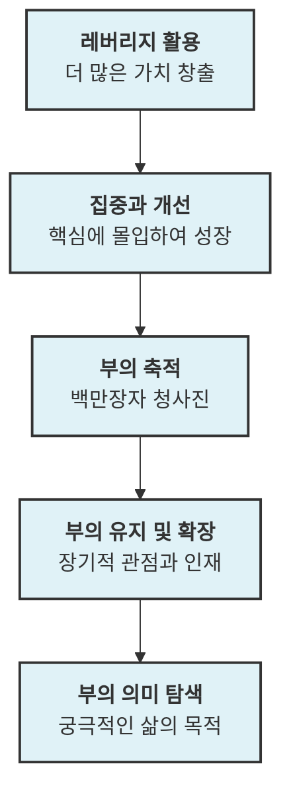

## 1. 개요

### 1.1 서론
이 보고서는 알렉스 호르모지(Alex Hormozi)의 성공 철학을 바탕으로, 부를 창출하고 유지하며 궁극적으로 삶의 의미를 탐색하는 여정을 종합적으로 다룬다. 특히, 레버리지<mark>, 집중, 개선, </mark>인내라는 핵심 원칙을 통해 어떻게 물질적 성공을 이루고, 그 과정에서 겪는 어려움을 극복하며, 최종적으로는 진정한 만족을 얻을 수 있는지 심층적으로 분석한다. 이 주제는 단순히 돈을 버는 방법을 넘어, 개인의 성장과 삶의 목적을 찾아가는 데 중요한 통찰을 제공한다.

### 1.2 전체 구조

## 2. 돈 버는 방식의 핵심: 레버리지 
돈을 버는 방식은 단순히 열심히 일하는 것을 넘어, '레버리지'를 얼마나 잘 활용하느냐에 달려 있다.

### 2.1. '일'의 재정의: 시간 대비 산출량 극대화 
1. **기존의 '일' 개념에 대한 비판** 
  1. 많은 사람들이 '열심히 일한다'는 것을 '오래 일한다'거나 '더 노력한다'는 의미로 생각하지만, 이는 지식 노동자에게는 비효율적이다. 
  2. 물리적인 '힘 x 거리'라는 정의는 지식 노동에 적합하지 않다. 
  3. 단순히 시간을 많이 투입하거나 노력하는 것만으로는 경쟁자를 이길 수 없다. 
2. **알렉스 호르모지의 '일' 정의: 산출량(**Outputs**)** 
  1. 일은 곧 산출량이며, 산출량은 '횟수(Volume) x 레버리지(Leverage)'로 정의된다. 
  2. 즉, 어떤 일을 몇 번 하는지와 그 일을 한 번 할 때 얻는 결과의 크기를 곱한 것이다. 
  3. 더 빠르게 일한다는 것은 시간당 산출량을 늘리는 것을 의미한다. 
3. **레버리지의 중요성** 
  1. 레버리지는 지렛대의 길이에 비유할 수 있으며, 같은 힘으로 더 큰 것을 들어 올리는 능력이다. 
  2. 사업에서는 '기업 가치(Enterprise Value)'를 높이는 것이 산출량을 늘리는 방법이다. 
  3. 더 많이 활동하는 것은 시간과 신체 능력에 한계가 있지만, 레버리지를 늘리는 것은 한계가 없다. 
  4. 워렌 버핏은 코카콜라 CEO보다 적은 시간을 일하고도 10배 더 많은 수익을 얻었는데, 이는 소유자로서의 레버리지 덕분이다. 

### 2.2. 레버리지 극대화 전략: '더 나은' 선택 
1. **경쟁 우위 확보** 
  1. 경쟁에서 이기려면 단순히 열심히 일하는 것보다 레버리지를 더 잘 활용해야 한다. 
2. **레버리지의 다양한 예시** 
  1. **기술/숙련도**: 하루 100통의 전화를 걸더라도 더 뛰어난 기술을 가진 사람이 더 많은 성과를 낸다. 
  2. **자동화**: 자동 다이얼러를 사용하여 통화 시간을 극대화하는 사람이 더 많은 일을 해낸다. 
  3. **데이터/정보**: 더 좋은 고객 목록을 가진 사람이 더 많은 성과를 얻는다. 
  4. **타이밍**: 적절한 시기에 적절한 구매자에게 전화하는 것이 더 큰 레버리지를 제공한다. 
  5. **제안**: 더 좋은 제안을 하는 사람이 더 많은 성과를 얻는다. 
  6. **확장성**: 자신의 피치를 녹음하여 1천만 명에게 보내는 것이 직접 전화하는 것보다 훨씬 큰 레버리지를 가진다. 
  7. **팀 활용**: 혼자서 100통의 전화를 거는 것보다 15명의 팀이 대신 전화하게 하는 것이 훨씬 큰 레버리지이다. 
3. **시간과 돈의 교환 비율** 
  1. 우리는 모두 시간을 돈으로 바꾼다. 
  2. 시간당 더 많은 산출량을 얻는 것이 더 많은 돈을 버는 핵심이다. 

### 2.3. '새로운 것'이 당신을 가난하게 만드는 이유: 집중의 부재 
1. **정보 없는 낙관주의(**Uninformed Optimism**)의 함정** 
  1. 새로운 기회를 접할 때, 사람들은 성공 사례의 '하이라이트'만 보고 쉽게 낙관한다. 
  2. 하지만 실제로는 수많은 장애물과 어려움이 존재하며, 이를 알게 되면 '정보 있는 비관주의(Informed Pessimism)' 단계로 넘어간다. 
  3. 이후 시간과 노력을 투자했지만 성과가 없으면 '의미의 위기(Crisis of Meaning)' 또는 '절망의 계곡(Valley of Despair)'에 빠진다. 
  4. 대부분의 사람들은 이 단계에서 포기하고 또 다른 '정보 없는 낙관주의'의 사이클로 돌아간다. 
  5. 이는 비디오 게임에서 죽으면 몇 초 후에 다시 시작하지만, 사업에서는 몇 년 후에 다시 시작하는 것과 같다. 
2. **다양한 일에 손대는 것의 위험성** 
  1. **건설업 친구의 사례**: 지붕 공사, 일반 계약, 주택 개조 등 여러 사업을 동시에 하려다 결국 아무것도 제대로 성장시키지 못했다. 
  2. **'돈을 테이블에 남겨두지 않는다'는 오해**: 여러 기회를 쫓는 것은 결국 가장 중요한 한 가지에 집중하지 못하게 하여 더 큰 돈을 잃게 만든다. 
  3. **성공한 자수성가 여성들의 공통점**: 포브스 선정 자수성가 여성 부자들은 대부분 한 가지 사업(지붕, 의료, 소프트웨어 등)을 오랜 기간 꾸준히 하여 성공했다. 
  4. **실패로 가는 지름길**: 여러 가지 일을 짧은 기간 동안 하고, 도움을 받지 않으며, 같은 실수를 반복하는 것이다. 
  5. **학습의 정의**: '같은 조건에서 다른 행동'을 하는 것이 학습이다. 행동이 변하지 않으면 배운 것이 아니다. 
3. **'마법 지팡이' 비유와 집중의 힘** 
  1. 수많은 사업을 벌였지만 돈을 벌지 못했던 친구에게 '마법 지팡이'로 가장 유망한 사업 하나만 남긴다면 어떻게 될지 물었다. 
  2. 친구는 "정말 쉬울 것"이라고 답했지만, 다른 사업들을 정리하는 '힘든 대화'를 피하려 했다. 
  3. 성공은 종종 이러한 '힘든 대화'를 통해 불필요한 것을 잘라내는 데서 온다. 
  4. **'**빨간 드레스** 입은 여자' 비유**: 매력적이지만 주의를 분산시키는 새로운 기회들을 의미한다. 
  5. 성공할수록 더 큰 '빨간 드레스'가 나타나며, 이에 '아니오'라고 말하는 훈련이 필요하다. 
  6. 이는 단기적인 유혹에 넘어가지 않고 장기적인 목표에 집중하는 인내심을 기르는 것과 같다. 
  7. 인내심은 감정이 아니라 행동에 관한 것이다. 두려움에도 불구하고 행동하는 용기처럼, 유혹에도 불구하고 '아니오'라고 말하는 행동이 인내심이다. 

### 2.4. '더 나은' 것이 레버리지인 이유: 지루함 속의 성장 
1. **'더 나은' 것이 '새로운 것'보다 낫다** 
  1. 레버리지는 투입 대비 더 많은 것을 얻는 것이므로, 현재 하는 일을 '더 잘'하면 더 많은 것을 얻을 수 있다. 
  2. 예를 들어, 콜 스크립트, 콘텐츠, 웹사이트, 팔로우업, 제안 등을 개선하면 같은 활동으로 더 큰 성과를 얻는다. 
2. **'더 나은' 것은 '지루함'에서 온다** 
  1. 많은 기업가들이 새로운 것을 시작하는 것은 감정적인 만족을 주지만, 진정한 성장은 기존의 지루한 작업을 개선하는 데서 온다. 
  2. 랜딩 페이지의 38번째 A/B 테스트는 흥미롭지 않지만, 더 많은 돈을 벌게 해준다. 
  3. 해야 할 줄 알지만 하지 않는 일들을 하는 것이 '더 나은' 것을 만든다. 
3. **'더 나은' 것의 구체적인 예시** 
  1. **이메일 팔로우업**: 5분 이내에 리드에게 전화하면 매출을 3배 늘릴 수 있지만, 이는 지루한 시스템 구축(CRM, 라운드 로빈 등)을 필요로 한다. 
  2. **시스템 개선**: 두 개의 다른 사업을 운영하는 사람 중 '시스템'을 더 잘 구축한 사람이 더 많은 것을 얻는다. 
4. **'나 자신을 코칭한다면?'** 
  1. 가장 효과적인 질문 중 하나는 '만약 내가 나 자신을 코칭한다면, 나에게 무엇을 하라고 조언할까?'이다. 
  2. 자신은 모든 정보를 가지고 있으며, 다른 의도가 없으므로 가장 현명한 조언을 할 수 있다. 
  3. 자신의 조언을 따르지 않는 것은 '나는 특별하다'고 착각하는 오만함이다. 

### 2.5. 집중의 힘: 한 가지에 올인 
1. **분산된 시기 vs 집중된 시기** 
  1. 알렉스 호르모지는 과거 6개의 헬스장, 런치 비즈니스, 치과 및 카이로프랙틱 에이전시 등 9개의 사업을 운영했지만, 돈을 벌지 못했다. 
  2. 아내의 조언으로 가장 수익성이 높고 시간 투입이 적은 '짐 런치(Gym Launch)' 사업 하나에 집중하기 위해 다른 모든 사업을 정리했다. 
  3. 그 결과, 12개월 만에 월 150만 달러, 그 후 12개월 만에 월 450만 달러의 수익을 달성했다. 
2. **실패를 불가능하게 만드는 집중** 
  1. 한 가지에 집중하면 실패하기 어렵게 된다. 
  2. 오랜 기간 한 가지 일을 하면 형편없기 어렵게 된다. 
  3. 다른 누구보다 더 많이 하면 최고가 될 수밖에 없다. 

### 2.6. 장기적인 관점과 제품 개선: 기초 다지기 
1. **빠른 성장의 함정** 
  1. 많은 사람들이 빠른 성장을 원해 제품의 기초를 다지지 않고 홍보에만 집중한다. 
  2. 이는 '입소문'이라는 보이지 않는 손에 의해 부정적인 영향을 미쳐, 결국 광고 비용이 증가하고 사업이 정체된다. 
  3. 제품을 제대로 만들지 않고 홍보만 하면 결국 고객들은 떠나고, 새로운 것을 찾아 헤매는 악순환에 빠진다. 
2. **장기적인 성공을 위한 투자** 
  1. 제품을 제대로 만드는 데 12개월을 투자하는 것이 장기적으로는 모든 것을 쉽게 만든다. 
  2. 하지만 대부분의 사람들은 단기적인 성과에 집착하여 기초를 다지는 대신 여러 단기적인 '지름길'을 택한다. 
3. **'더 나은' 것이 가져오는 **레버리지 
  1. '더 나은' 것은 투입 대비 더 많은 산출량을 가져온다. 
  2. 작은 사업과 큰 사업의 활동량은 크게 다르지 않다. 단지 모든 활동이 같은 방향으로 정렬되어 있을 뿐이다. 
  3. **지루하지만 효과적인 개선 활동**:
  - 랜딩 페이지 A/B 테스트를 매주 진행한다. 
  - 이메일 A/B 테스트를 매주 진행한다. 
  - 필요하기 전에 새로운 광고 소재를 만든다. 
  - 영업팀과 고객 성공팀의 역할극을 매일 진행한다. 
  - 같은 역할에 대해 10번 더 인터뷰하여 최고의 인재를 찾는다. 
  4. 이러한 지루한 활동들이 결국 더 많은 돈을 벌게 해준다. 

### 2.7. 활동에 대한 헌신: 결과보다 과정 
1. **결과가 아닌 활동에 집중** 
  1. 2021년 말, 한 사업가는 비현실적인 목표를 세웠지만, 알렉스 호르모지는 그에게 '매일 같은 활동에 헌신하라'고 조언했다. 
  2. 초반에는 성공했지만, 결과에 만족하여 속도를 늦추자 다시 정체되었다. 
  3. 알렉스 호르모지는 '당신의 일은 당신에게 더 많은 영향을 미친다'고 강조하며, 결과가 아닌 활동에 대한 헌신을 통해 자신이 누구인지 단련해야 한다고 말했다. 
  4. 행동과 결과를 분리하고, 반복적인 행동을 통해 자신을 단련하는 것이 중요하다. 

### 2.8. 20배의 노력으로 1,000배의 결과: 디테일의 힘 
1. **'좋음'과 '탁월함'의 차이** 
  1. 7점짜리 책과 9.5점짜리 책의 차이는 약 20배의 노력이다. 
  2. 하지만 판매량에서는 1,000배의 차이를 가져올 수 있다. 
  3. 이는 투입 단위당 50배의 증가를 의미하며, 엄청난 레버리지이다. 
  4. 기회는 종종 작업복을 입고 '일'처럼 보이기 때문에 대부분의 사람들이 놓친다. 

### 2.9. 실제 세계에서의 레버리지 시연: 제안 개선 
1. **'더 나은 제안'의 힘** 
  1. 알렉스 호르모지는 '더 나은 제안'이 어떻게 레버리지를 증가시키는지 시연했다. 
  2. 단순히 책 10권을 1,000달러에 판매하는 것에서 시작하여, 제안에 가치를 더할수록 사람들이 더 많이 구매하려 했다. 
2. 가치** 추가를 통한 레버리지 증가** 
  1. **베스트셀러, 높은 평점**: 책의 가치를 높인다. 
  2. 수익** 증대 사례**: 책을 읽고 월 수익이 4배 증가한 사례를 제시한다. 
  3. **저자 사인**: 개인적인 가치를 더한다. 
  4. **개인 휴대폰 번호**: 접근성을 높여 특별함을 부여한다. 
  5. **영업 스크립트 검토 및 팀 훈련**: 실질적인 비즈니스 개선 지원을 추가한다. 
  6. **트래픽 전문가의 **퍼널** 분석**: 트래픽을 2배 늘릴 수 있는 구체적인 컨설팅을 제공한다. 
  7. **네트워크를 통한 핵심 인재 채용**: 회사의 가장 큰 약점을 보완할 인재를 찾아준다. 
  8. **2시간 오퍼 컨설팅**: 제안을 개선하여 전환율과 가격을 높이는 방법을 알려준다. 
  9. **채널 노출**: 1천만 회 노출되는 채널에 출연시켜 광고 효과를 제공한다. 
3. **궁극적인 레버리지: 환불 보장** 
  1. '12개월 내에 지불한 금액의 3배를 벌지 못하면 전액 환불하고 모든 작업은 유지한다'는 파격적인 보장을 추가한다. 
  2. 이러한 보장은 고객의 위험을 극도로 낮춰 구매를 유도한다. 
4. **결론: '더 잘하는 것'이 핵심** 
  1. 결국 '더 잘하는 것'이 레버리지를 증가시키는 핵심이다. 
  2. 산출량은 횟수와 레버리지의 곱이며, 레버리지를 높이는 방법은 현재 하는 일을 '더 잘'하는 것이다. 
  3. 이를 위해서는 한 가지에 오랫동안 집중하고, 모든 행동을 하나의 결과에 맞춰야 한다. 
  4. 외부에서는 쉬워 보이는 성공도 수년간 수많은 '아니오'를 말한 결과이다. 

## 3. 백만장자가 되는 청사진: 부의 창출과 유지 
백만장자가 되기 위한 구체적인 단계와 전략을 제시한다.

### 3.1. 부의 창출 기본 원칙: 소유와 집중 
1. **백만장자의 정의** 
  1. 주 거주지를 제외한 순자산이 100만 달러를 초과하는 사람이다. 
  2. 순자산은 자산에서 부채를 뺀 금액이다. 
  3. 유동 순자산(현금)과 일반 순자산(자산 가치)은 다르다. 
2. **백만장자가 되는 두 가지 방법: 벌거나 소유하거나** 
  1. **벌어서 되는 방법**: 연 20만 달러를 벌고 100% 저축한다고 가정하면, 세금(50%)을 고려할 때 100만 달러를 모으는 데 10년이 걸린다. 
  - 이 방법은 세금과 생활비로 인해 시간이 오래 걸린다. 
  2. **소유해서 되는 방법**: 연 25만 달러의 이익을 내는 자동화된 사업을 소유하고, 이를 4배의 가치로 매각하면 100만 달러의 순자산을 얻을 수 있다. 
  - 이 방법은 훨씬 빠르며, 시간은 아군이 되어 배수(multiplier)를 얻을 수 있다. 
3. 분산** 투자의 위험성: 무지에 대한 헤지** 
  1. 워렌 버핏의 말처럼, 분산 투자는 '무지에 대한 헤지'이다. 무엇을 하는지 모를 때만 분산 투자를 한다. 
  2. 초기에는 돈보다 시간과 주의가 가장 귀중한 자원이다. 
  3. **'7가지 수입원' 신화 비판**: 많은 사람들이 여러 수입원을 추구하지만, 이는 주의를 분산시켜 어떤 것도 성공시키기 어렵게 만든다. 
  4. 부자들은 하나의 수입원에 '올인'하여 그것이 넘쳐흐를 때까지 집중한 후, 그제야 부를 분산시킨다. 
  5. 여러 가지에 10%의 주의를 분산하는 것은 한 가지에 모든 노력을 쏟는 사람과 경쟁할 수 없다. 
  6. 어떤 사업이 성공할지는 '어떤 사업을 할 것인가'가 아니라 '어떤 사업에 노력할 것인가'에 달려 있다. 
4. **기업가의 5단계: 절망의 계곡을 넘어** 
  1. **1단계: 정보 없는 낙관주의(**Uninformed Optimism**)**: 기회가 좋아 보이지만 정보가 부족한 상태이다. 
  2. **2단계: 정보 있는 비관주의(**Informed Pessimism**)**: 뛰어들고 나면 예상치 못한 장애물을 알게 되어 비관적이 된다. 
  3. **3단계: **절망의 계곡**(**Valley of Despair**)**: 대부분의 사람들이 포기하고 다른 기회를 찾아 다시 1단계로 돌아가는 단계이다. 
  4. **4단계: 정보 있는 낙관주의(**Informed Optimism**)**: 어려움을 극복하고 기회에 대한 이해를 바탕으로 다시 낙관적이 된다. 
  5. **5단계: 성취(Achievement)**: 목표를 달성하는 단계이다. 
  6. 대부분의 초보자들은 1~3단계를 반복하며 진정한 성취에 도달하지 못한다. 
  7. 이 과정을 한 번 겪고 나면, 다음 목표를 설정할 때 어려움을 예상하고 인내심을 가지고 추진할 수 있게 된다. 

### 3.2. 장기적인 관점: 올바른 기초 다지기 
1. **단기적 vs 장기적 건설 비유** 
  1. 10초 안에 가장 높은 탑을 쌓으라면 불안정하게 쌓아 올릴 것이다. 
  2. 하지만 10일 안에 가장 높은 탑을 쌓으라면 처음부터 안정적인 벽돌로 기초를 다질 것이다. 
  3. 빨리 가려는 조급함이 잘못된 방식으로 사업을 구축하게 만든다. 
  4. 100만 달러 사업을 1,000만 달러로 키우지 못하는 이유는 처음부터 잘못 지었기 때문이다. 
  5. 때로는 1,000만 달러에 도달하는 가장 빠른 방법은 0에서 다시 시작하여 올바르게 짓는 것이다. 
2. **제품 우선주의: 입소문의 힘** 
  1. 사업을 올바르게 구축하는 가장 어려운 점은 처음부터 훌륭하고 가치 있는 제품을 판매해야 한다는 것이다. 
  2. **잘못된 방식**: 제품을 만들고 홍보하여 판매를 시작하지만, 제품이 좋지 않으면 더 많이 홍보할수록 부정적인 평판이 쌓여 광고 비용이 증가한다. 
  3. **올바른 방식**: 제품을 만들고 홍보한 후, 홍보에만 집중하지 않고 제품을 계속 개선하여 고객이 만족하고 친구에게 추천하도록 만든다. 
  4. 이렇게 하면 거대한 기반을 가진 사업을 구축하여 계속 성장할 수 있다. 
3. **인재 채용의 중요성** 
  1. 단순히 빈자리를 채우는 것이 아니라, 한 역할에 20명을 인터뷰하여 적합한 인재를 찾아야 한다. 
  2. 사업이 정체된다면, 기초가 없는 수직적인 사업을 구축했음을 깨달아야 한다. 

### 3.3. 첫 100만 달러를 위한 전술: 시장, 제안, 채널 
1. **'굶주린 군중' 찾기: 시장의 중요성** 
  1. **핫도그 스탠드 비유**: 아무리 싸고 맛있고 빨리 조리되는 핫도그라도, '굶주린 군중' 앞에 놓지 않으면 팔리지 않는다. 
  2. **시장이 가장 강력한 변수**: 시장은 경제와 사업에서 가장 강력한 힘이다. 
  - 코로나19 팬데믹 때 화장지를 팔면 무조건 팔린다. 
  - 신문사에 서비스를 팔면 시장 자체가 줄어들기 때문에 성장하기 어렵다. 
  3. **제안(Offer)의 중요성**: 시장이 평범하다면, 우월한 제안이 다음 레버리지이다. 
  - '무료로 시작하고 결과가 나오면 지불'하는 제안은 '돈을 내고 결과는 불확실'한 제안보다 훨씬 강력하다. 
  4. **설득력(Persuasion)의 중요성**: 시장이 크고 제안이 훌륭하다면, 설득력이 마지막 요소이다. 
  - 시장이 매우 강력하다면, 설득력이 부족하고 제안이 형편없어도 팔 수 있다. 
  5. **'굶주린 군중'을 찾는 4가지 요소** 
  - **고통(Pain)**: 고객이 절실히 필요로 하는 것을 팔아야 한다. 
  - **구매력(Purchasing Power)**: 고객이 구매할 능력이 있어야 한다. (예: 실업자에게 이력서 컨설팅을 팔기 어려운 이유) 
  - **쉬운 타겟팅(Easy to Target)**: 고객을 쉽게 찾을 수 있어야 한다. (예: 간호사는 찾기 쉽지만, 크로아티아의 사이키델릭 아즈텍인은 찾기 어렵다) 
  - **성장하는 시장(Growing Market)**: 시장 자체가 성장하고 있어야 한다. (예: 신문사 시장은 아무리 잘해도 전체 시장이 줄어들어 성장이 어렵다) 
  - 이 네 가지 요소가 모두 충족되어야 한다. 
2. **하나의 아바타, 하나의 제품, 하나의 채널** 
  1. **단순한 성공 공식**: 100만 달러 이상을 벌기 위한 가장 간단한 공식은 '하나의 아바타(고객), 하나의 제품, 하나의 채널'에 집중하는 것이다. 
  2. **아바타**: 돕고 싶은 한 명의 매우 구체적인 사람을 명확히 정의한다. 
  3. **제품**: 사업을 너무 일찍 복잡하게 만들지 말고, 하나의 제품에 집중하여 그것을 3배 더 많이 팔 방법을 고민한다. 
  4. **채널**: 현재 사용 중인 하나의 채널(콜드 콜, 콘텐츠, 유료 광고 등)에 집중하여 더 잘하고 더 많이 한다. 
  - 새로운 채널을 추가하는 것은 사업을 복잡하게 만들고, 초기 단계에서는 비효율적이다. 
  5. **다양화는 나중 문제**: 고객 확보 방식의 다양화는 사업 규모가 커져 위험을 줄여야 할 때 고려한다. 
  6. 처음부터 올바르게 구축하고 사업을 복잡하게 만들지 않는 것이 100만 달러에 도달하는 가장 빠른 방법이다. 
3. 가치** 방정식: 거부할 수 없는 제안 만들기** 
  1. **가치의 4가지 변수** 
  - 꿈의 결과**(Dream Outcome)**: 고객이 가장 원하는 결과가 무엇이며, 그 결과에 얼마나 큰 가치를 부여하는가? (예: 체중 감량 vs 백만장자 되기) 
  - **인지된 달성 가능성(**Perceived Likelihood of Achievement**)**: 구매를 통해 원하는 결과를 얻을 가능성이 얼마나 높다고 생각하는가? (예: 50달러짜리 전자책 vs 5,000달러짜리 개인 트레이닝) 
  - **시간(Time)**: 결과를 얻는 데 걸리는 시간(미시적: 매일의 시간, 거시적: 전체 기간)을 최소화한다. 
  - **노력과 희생(Effort & Sacrifice)**: 구매로 인해 시작해야 하는 싫은 일(노력)과 포기해야 하는 좋아하는 일(희생)을 최소화한다. 
  2. **완벽한 제안**: 가장 크고 매력적인 꿈의 결과를, 절대적으로 보장된 방식으로, 즉시, 아무런 노력 없이 얻는 것이다. 
  3. 숨겨진 비용: 제안의 가장 비싼 부분은 돈이 아니라 고객이 구매 결과로 해야 하는 다른 일들이다. 
  - (예: 마케팅 대행사 서비스는 같지만, 고객이 해야 할 일이 적을수록 가치가 높아진다.) 
  4. **전략적 **레버리지: 제안은 사업의 모든 부서(마케팅, 영업, 전달)에 영향을 미치는 가장 큰 레버리지 중 하나이다. 
  5. Acquisition.com은 포트폴리오 기업의 제안을 개선하여 12개월 만에 매출 1.8배, 이익 3.01배 성장을 달성한다. 

### 3.4. 마케팅 및 판매: 고객 확보의 핵심 
1. **선순환 구조** 
  1. **제품 만들기(제안)** → **홍보하기(리드 확보)** → **판매하기(구매 유도)** → **제품 개선(더 좋게 만들기)** → **더 많이 홍보하기**의 선순환을 반복한다. 
2. **8가지 광고 방법** 
  1. **스스로 할 수 있는 4가지 (**핵심 4가지**)** 
  - **웜 아웃리치(Warm **Outreach**)**: 지인에게 1:1로 연락한다. 
  - **콘텐츠 게시(Content Posting)**: 아는 사람들에게 1:다수로 콘텐츠를 게시한다. 
  - **유료 광고(Paid Ads)**: 모르는 사람들에게 1:다수로 광고를 집행한다. 
  - **콜드 아웃리치(Cold Outreach)**: 모르는 사람들에게 1:1로 연락한다. 
  - 이 4가지 중 충분히 하지 않으면 아무도 당신의 제품을 사지 않을 것이다. 
  2. **다른 사람이 해줄 수 있는 4가지 (레버리지)** 
  - 고객 추천**(Referrals from Customers)**: 고객이 다른 고객을 추천한다. 
  - **직원(Employees)**: 직원이 핵심 4가지 활동을 대신 수행한다. 
  - **대행사(Agencies)**: 대행사가 핵심 4가지 활동을 대신 수행한다. 
  - **제휴사(Affiliates)**: 인플루언서나 제휴사가 자신의 오디언스에게 광고를 대신 해준다. 
  3. **초기에는 한 가지에 집중**: 첫 100만 달러를 벌 때는 핵심 4가지 중 한 가지에 집중하는 것이 좋다. 
3. **창업자의 역할: 마케팅과 판매에 깊이 관여** 
  1. 초기에는 창업자가 직접 마케팅과 판매에 참여하는 것이 비용 효율적이고, 장기적인 성공에 필요한 기술을 습득하는 데 도움이 된다. 
  2. 나중에 다른 사람을 고용할 때, 창업자가 직접 경험했기 때문에 올바른 방법을 가르치고 인재를 평가할 수 있다. 
4. **판매 프로세스 구축: 스크립트와 반복** 
  1. **체계적인 프로세스**: '흥미롭다'고 생각하는 단계부터 돈을 지불하는 단계까지의 체계적인 프로세스를 구축한다. 
  2. **시행착오**: 처음에는 시행착오를 겪으며 무엇이 효과적인지 파악한다. 
  3. **성공 사례 분석**: 성공적인 판매가 발생하면, 그 과정을 역추적하여 반복 가능한 프로세스를 만든다. 
  4. **스크립트의 중요성**: 창업자가 판매에서 벗어나 사업을 확장하려면 스크립트를 만들어 다른 사람에게 가르칠 수 있어야 한다. 
  5. 창업자는 제품에 대한 확신이 가장 강하므로, 다른 판매자들이 최대한의 성과를 낼 수 있도록 프로세스를 구축해야 한다. 

### 3.5. 자신에게 보상하기: 위험 감수와 균형 
1. **위험 감수(Risk Tolerance)와 보상** 
  1. 자신에게 얼마를 언제 지불할지는 개인의 위험 감수 수준에 따라 다르다. 
  2. 알렉스 호르모지는 초기 헬스장 사업에서 모든 이익을 재투자하다가 결국 모든 돈을 잃었다. 
  3. 사업에서 현금을 인출하면 놀랍게도 더 많은 현금이 나타나는 경우가 많다. 
2. **개인 목표 설정: 은행 잔고 PR** 
  1. 은행 잔고를 늘리는 것을 개인적인 목표로 삼으면, 사업에서 현금을 인출하고 개인 지출을 줄이게 된다. 
  2. 은행 잔고가 충분하면 사업 결정 시 스트레스가 줄어들고 더 나은 결정을 내릴 수 있다. 
  3. 사업 가치만 추구하다가 삶을 즐기지 못하는 것을 피하기 위해, 노동의 결실을 소비하는 균형이 필요하다. 
3. **현금 흐름 배분 전략** 
  1. **33% 규칙 (자본 집약적 사업)**:
  - 33%는 자신에게 지불한다. 
  - 30%는 성장(새로운 지점)에 투자한다. 
  - 나머지는 비상 자금(사업 및 개인)으로 비축한다. 
  2. **워터마크(Watermark) 방식**:
  - 매월 필요한 성장 비용(예: 2개 지점 추가, 2명 채용)을 계산한다. 
  - 월 이익에서 이 비용을 뺀 후, 특정 워터마크(항상 계좌에 남겨두는 금액)를 초과하는 모든 금액을 현금 흐름으로 분배한다. 
  - 이 방식은 성장률 유지에 더 공격적이고, 개인의 위험 감수 수준에 따라 유연하게 적용할 수 있다. 
4. **신뢰할 수 있는 조언자** 
  1. 수수료를 위해 현금 인출을 권유하는 재정 고문이 아닌, 장기적인 관점에서 부를 쌓는 데 도움을 줄 수 있는 조언자가 필요하다. 

### 3.6. 목표 설정: 활동에 집중하고 문제 해결 
1. **결과가 아닌 활동에 집중** 
  1. 대부분의 사람들은 '스마트 목표'와 같은 결과 중심의 목표를 설정하지만, 알렉스 호르모지는 '활동'에 집중한다. 
  2. 목표는 '무엇이 일어날 것인가'가 아니라 '무엇을 할 것인가'여야 한다. 
  3. 한 사업가는 월 목표를 달성하면 노력을 늦췄는데, 이는 목표를 잘못 정의했기 때문이다. 
  4. 활동 자체를 목표로 삼으면, 항상 목표를 달성하고 더 많은 것을 이룰 수 있다. 
  5. 결과가 아닌 통제 가능한 '투입(Inputs)'에 집중해야 한다. 
2. **'100의 법칙(Rule of 100)'** 
  1. 100일 동안 100가지 주요 행동을 하면, 보통 첫 번째 원하는 결과를 얻을 수 있다. 
  2. **예시**:
  - 매일 100명의 지인에게 연락한다. 
  - 매일 100명의 모르는 사람에게 연락한다. 
  - 매일 100분 분량의 콘텐츠를 만든다. 
  - 매일 100달러를 광고에 지출한다. 
  3. 이러한 활동 자체를 목표로 삼고, 판매 여부와 관계없이 매일 100가지 투입을 수행해야 한다. 
3. **과학적 방법론을 통한 목표 설정** 
  1. **1단계: 문제 정의**: 실제로 어떤 문제를 해결하려는가? (예: 로고 재디자인이 아닌, 홈페이지 전환율 문제) 
  2. **2단계: 가설 설정**: '만약 X라면 Y가 될 것이다'라는 가설을 세운다. (예: 웹사이트를 재디자인하면 전환율이 증가할 것이다) 
  3. **3단계: 측정 방법**: X와 Y를 어떻게 측정할 것인가? (예: 재디자인 여부, 전환율 10% 이상 여부) 
  4. **4단계: 결과 분석**: 실제로 행동했는지, 그리고 결과가 나타났는지 확인한다. 
  - 행동하지 않았다면, 왜 행동하지 않았는지 문제를 해결한다. 
  - 행동했지만 결과가 나타나지 않았다면, 가설이 틀렸거나 다른 제약 조건이 있음을 파악한다. 
  5. 이러한 반복적인 개선 과정을 통해 사업을 발전시킨다. 

### 3.7. 부를 유지하고 더 부유해지기: 장기적 관점과 인재 
1. **'한 번만 부자가 되면 된다'** 
  1. 멘토의 조언처럼, 게임을 올바르게 플레이하면 한 번만 부자가 되면 된다. 
  2. '농장을 걸고 도박하지 마라'는 말처럼, 모든 것을 걸고 큰 위험을 감수하지 말아야 한다. 
  3. **제프 베조스의 인용**: "큰 성공은 수많은 실험에서 나온다." 
  4. **위험 관리**: 적은 돈으로 큰 위험을 감수하여 부를 창출하고, 많은 돈으로는 작은 위험을 감수하여 부를 보존한다. 
  5. 한 번 크게 성공하면, 다시 모든 것을 걸 필요 없이 그 부를 유지하고 늘려나가야 한다. 
2. **쿼드 마케팅 캘린더: 모든 방향의 마케팅** 
  1. 사업은 내부와 외부 모두에서 마케팅이 필요하다. 
  2. **4가지 마케팅 방향**:
  - **잠재 고객(Prospects) → 고객(Customers)**: 가장 일반적인 광고 활동이다. 
  - **고객(Customers) → 재구매 고객(Repeat Customers)**: 기존 고객에게 계속 광고하여 재구매를 유도한다. 
  - **후보자(Candidates) → 직원(Employees)**: 인재를 유치하기 위한 마케팅이다. 
  - **직원(Employees) → 참여 직원(Engaged Employees)**: 직원들의 참여도를 높이고 교육하여 고객과 회사에 더 큰 가치를 제공하도록 한다. 
  3. **'천 개의 손을 가진 천재' 신드롬**: 잠재 고객을 고객으로 전환하는 데만 능숙하고, 인재 확보 및 육성에 실패하면 모든 일을 혼자 해야 하는 상황에 처한다. 
  4. 기업 가치**(**Enterprise Value**) 창출**: 단순히 돈을 버는 것을 넘어, 다른 사람에게 팔 수 있는 가치 있는 자산(사업)을 구축해야 한다. 
  5. 사업 구조를 '천재'가 아닌 '시스템'으로 만들면, 창업자가 없어도 가치를 제공할 수 있어 기업 가치가 크게 증가한다. 
  6. 부를 창출하는 가장 빠른 방법 중 하나는 사업을 신뢰할 수 있고, 위험이 없으며, 지속 가능하게 만드는 것이다. 
  7. 사람 없이도 200만 달러의 이익을 낼 수 있지만, 1,000만 달러 이상으로 성장하려면 '사람' 문제를 해결해야 한다. 
3. **평판(Reputation) 구축: 브랜드의 힘** 
  1. **'꽃다발' 비유**: 개인의 경험, 기술, 성격 특성을 모아 '꽃다발'처럼 평판을 만든다. 
  2. **부정적인 경험의 영향**: 하나의 부정적인 경험(예: 음주 운전 사고)은 전체 꽃다발(평판)을 망칠 수 있다. 
  3. **브랜드의 정의**: 브랜드는 '아는 것'과 '모르는 것' 사이의 연관성이다. 
  - (예: 알렉스 호르모지의 영상에서 가치를 얻은 사람들이 Acquisition.com 모자를 사고 싶어 하는 것처럼) 
  4. **명품 브랜드의 작동 방식**: 유명인(킴 카다시안)과 제품을 연관시켜, 고객이 그 제품을 통해 유명인의 지위를 대리 만족하게 한다. 
  5. **부정적인 **연관성** 제거**: 브랜드는 부정적인 연관성을 피하기 위해 문제가 있는 유명인과의 계약을 해지한다. 
  6. **가치 제공을 통한 평판 구축**: 사람들에게 빠르고 쉽게 소비할 수 있는 위험 없는 가치를 제공하면 '고객 잉여(Customer Surplus)' 또는 '선의(Goodwill)'가 쌓인다. 
  7. **선의의 **복리 효과: 선의는 자본보다 빠르게 복리 효과를 낸다. 
  - (예: 드웨인 '더 락' 존슨, 후다 뷰티, 코너 맥그리거, 조지 클루니는 자신의 브랜드를 통해 수십억 달러 규모의 회사를 만들었다.) 
  8. **평판을 잃는 위험**: 아무리 많은 선의를 쌓았더라도, 한 번의 잘못된 결정으로 모든 것을 잃을 수 있다. 
  - (예: '부러진 꽃' 비유처럼, 하나의 부정적인 요소가 전체 평판을 망친다.) 
  9. 단기적인 이익을 위해 평판을 위험에 빠뜨리지 않는 것이 장기적으로 가장 현명한 사업 결정이다. 
4. **복리(Compounding): 부의 8번째 불가사의** 
  1. **복리의 개념**: 원금에 이자가 붙고, 그 이자에 다시 이자가 붙어 기하급수적으로 증가하는 현상이다. 
  2. **워렌 버핏의 사례**: 그는 복리의 힘을 이해하여 지난 10년간 나머지 경력 전체보다 더 많은 돈을 벌었다. 
  3. **장기적인 관점의 중요성**: 복리는 장기적인 관점을 가질 때만 진정으로 발휘된다. 초기 몇 년은 미미하지만, 30년이 지나면 믿을 수 없는 수준이 된다. 
  4. 분산** 투자를 피해야 하는 이유**: 복리 과정을 방해하기 때문이다. 
  5. **자산(**Equity**)의 복리**: 사업 지분은 가장 강력한 복리 수단 중 하나이다. 
  - (예: 판다 익스프레스는 45년 동안 600개 지점을 열었지만, 최근 1년 동안 그 어떤 해보다 더 많이 성장했다.) 
  6. **'지루함이 당신을 부자로 만든다'**: 사업을 오래 지속하면 지루해질 수 있지만, 그 지루함 속에 복리의 힘이 숨어 있다. 
  7. **찰리 멍거의 인용**: "돈은 사고파는 데서 벌리는 것이 아니라, 기다리는 데서 벌린다." 
  8. **인내심의 정의**: 인내심은 '그동안 무엇을 할지 알아내는 것'이다. 
  - 계획을 고수하고, 복리 과정을 방해하지 않기 위해 때로는 무시하고 내버려 두는 것이 필요하다. 
  9. 마시멜로 테스트: 성공적인 아이들은 마시멜로를 응시하며 의지력을 사용한 것이 아니라, 마시멜로를 보지 않거나 다른 활동을 하며 '그동안 무엇을 할지' 알아냈다. 
  10. **기술 개발의 중요성**: 기술을 개발하면 인내심을 가질 수 있는 '그동안 할 일'이 생겨, 장기적인 계획이 결실을 맺을 때까지 기다릴 수 있다. 

## 4. 부의 궁극적인 의미: 삶을 즐기고 게임을 플레이하기 
진정한 부는 단순히 돈을 많이 버는 것을 넘어, 삶의 목적을 찾고 의미 있는 '게임'을 플레이하는 데 있다.

### 4.1. 부의 두 가지 수준: 개인적 필요 충족과 게임 플레이 
1. **부의 1단계: 개인 재정 충족** 
  1. 모든 개인적인 재정적 필요가 충족되는 단계이다. 
  2. 최고급 생활을 하는 데 드는 비용은 생각보다 많지 않다. (예: 전용기, 고급 레스토랑, 명품, 람보르기니, 영양사, 치료 등 월 15만 달러, 연 400만 달러 소득) 
  3. 자신에게 '충분한' 것이 무엇인지 파악하는 것이 중요하다. 
  4. 개인적인 꿈의 목록을 작성하고, 실제 필요한 금액을 계산하면 생각보다 적은 돈으로도 편안하게 살 수 있음을 알게 된다. 
2. **부의 2단계: 무한한 부와 게임 플레이** 
  1. 지역사회에 환원하고, 진정으로 중요한 모든 일을 할 수 있는 충분한 돈을 가진 단계이다. 
  2. 이 단계에서는 돈을 더 많은 돈을 버는 '게임'을 하는 수단으로 사용한다. 
  3. '부를 즐긴다'는 것은 '일하지 않는다'는 의미가 아니다. 
  4. 자신이 하는 일을 싫어하기 때문에 일하지 않는 것을 꿈꾸는 경우가 많다. 
  5. 진정한 자유는 '일할 수 있는 선택권'을 가지는 것이다. 
  6. 인간은 가치 있는 일을 할 때 가장 뛰어나며, 목적 의식을 통해 힘을 얻는다. 
  7. 계속해서 목표를 높이지 않으면 정신적인 힘을 잃게 된다. 

### 4.2. 무한 게임으로서의 삶: 끝없는 성장과 목적 
1. **'더 쉬운 것'이 아닌 '더 즐거운 것'** 
  1. 사람들은 더 쉬운 것을 원한다고 생각하지만, 실제로는 더 즐거운 것을 원한다. 
  2. 즐거움과 쉬움은 반드시 같은 것이 아니다. 
  3. 부를 즐긴다는 것은 평생 몰두할 수 있는 일을 찾아, 그 형태나 느낌이 시간이 지나도 변할 수 있음을 받아들이는 것이다. 
2. **죽음의 상기: 게임의 본질** 
  1. 결국 모든 것을 가지고 갈 수 없으므로, 돈을 쌓아두는 것 자체가 목적이 될 수 없다. 
  2. 게임의 요점은 '게임을 플레이하는 것'이며, 게임을 플레이함으로써 승리하는 것이다. 
3. 유한 게임** vs **무한 게임 
  1. 유한 게임: 결혼하는 것, 사업에서 이기는 것과 같이 명확한 끝이 있는 게임이다. 
  2. 무한 게임: 결혼 생활을 유지하는 것, 사업을 계속하는 것과 같이 끝없이 지속되는 게임이다. 
  3. 인생의 가장 위대한 게임들은 무한 게임이다. 
  4. 결승선이 없음을 깨닫지 못하면, 결승선에 도달해도 승리감을 느끼지 못한다. 
  5. 이러한 깨달음은 시간을 보내는 방식을 재구성하고 부를 즐기는 데 도움이 된다. 
  6. **윈스턴 처칠의 인용**: "절대 포기하지 않는 한, 당신은 이긴다." 
  7. 이것이 삶과 부를 즐기는 청사진이다. 

## 5. 잔인한 비즈니스 진실: 성공을 위한 현실적인 조언 
13년간의 사업 경험을 통해 얻은 잔인하지만 현실적인 비즈니스 진실들을 제시한다.

### 5.1. 누구에게 팔 것인가: 부유층 시장의 매력 
1. **부유층에게 먼저 팔아라** 
  1. 돈이 생길 때까지는 부유층에게 팔고, 그 후에 모든 사람에게 팔아라. 
  2. 중간 시장은 가장 위험한 곳이다. 
  3. 소수의 사람들에게 많은 것을 제공하는 것이 다수의 사람들에게 적은 것을 제공하는 것보다 훨씬 어렵다. 
2. **테슬라의 사례** 
  1. 테슬라는 25만 달러짜리 로드스터를 부유층에게 먼저 팔아 자금을 확보했다. 
  2. 그 다음 10만 달러짜리 고급차를 팔고, 점차 가격을 낮춰 대중적인 모델(모델 3)을 출시했다. 
  3. 각 단계는 이전 단계보다 훨씬 어려웠는데, 저가로 대량 판매하려면 엄청난 인프라가 필요하기 때문이다. 
3. **대량 판매의 어려움** 
  1. 가난한 사람들에게 팔아 돈을 버는 유일한 방법은 엄청난 양을 파는 것이다. 
  2. 월마트, 아마존은 처음부터 효율성을 기반으로 대량 판매를 위해 구축된 사업이다. 
  3. 이들은 효율성을 위해 검소한 문화를 의도적으로 조성한다. 
  4. '가난한 사람'이라는 표현은 과장된 것이지만, 핵심은 '볼륨' 기반 전략이다. 
4. **부유층 문제 해결의 이점** 
  1. 부유층의 문제를 해결하면 더 높은 가격을 청구할 수 있다. 
  2. 1만 달러를 가진 사람에게 100달러는 순자산의 1%이지만, 1억 달러를 가진 사람에게 100달러는 아무것도 아니다. 
  3. 부유층은 절대적인 금액으로는 더 많이 지불하지만, 상대적인 가치로는 더 적게 지불하므로, 이들의 문제를 해결하는 것이 더 쉽다. 
  4. 더 많은 이익으로 고객에게 더 많은 가치를 제공하고도 여전히 돈을 벌 수 있으며, 대규모 인프라를 구축할 필요가 없다. 
  5. **은행 설립 비유**: 은행을 설립하려면 2,500만~1억 달러가 필요하며, 수많은 사람들의 돈을 처리할 인프라를 구축해야 한다. 
  6. **프리미엄 전략**: 부유층에게 프리미엄 제품을 판매하고, 틈새시장에 집중하여 소수의 사람들에게 많은 가치를 제공한다. 
  7. 이렇게 하면 경쟁이 덜하고, 비효율성이 있어도 돈을 벌 수 있다. 
5. **넷플릭스 vs 아마존 프라임 비디오** 
  1. 넷플릭스는 월 13~15달러에 수백만 달러를 들여 영화와 쇼를 제작한다. 이는 엄청난 가치 제공이다. 
  2. 아마존 프라임은 연 99~129달러에 넷플릭스와 유사한 비디오 서비스는 물론, 익일 배송까지 제공한다. 
  3. 대중에게 판매하려면 엄청난 가치 불균형을 제공하고, 고객이 절대 해지하지 않도록 만드는 인프라를 구축해야 한다. 
6. Acquisition**.com과 School.com의 이중 전략** 
  1. **Acquisition.com**: 부유층을 위한 프리미엄 브랜드로, 이미 5천만 달러 이상의 자산을 가진 고객의 자산을 2억 5천만 달러로 늘리는 데 투자한다. 연 1~2건의 거래만 진행한다. 
  2. **School.com**: 초보 기업가를 위한 대중 브랜드로, 5년간 수천만 달러를 투자하여 월 99달러에 엄청난 가치를 제공한다. 수백만 명의 사용자를 수용할 수 있는 인프라를 구축했다. 
  3. 알렉스 호르모지는 School.com에 투자하기 전에 Acquisition.com을 통해 충분한 돈을 벌어, 대중에게 판매할 수 있는 인프라를 구축할 여유를 마련했다. 
7. **부유층에게 판매하는 방법** 
  1. **가장 쉬운 방법**: 부유층에게 판매하는 다른 사람의 방식을 따라하고, 절반의 시간에 2배의 가격을 청구한다. 
  2. **부유층은 '시간'에 돈을 지불한다**: 부유층은 무엇보다 '시간'을 중요하게 생각한다. 
  3. 가치 방정식** 적용**:
  - 결과**(Outcome)**: 그들이 원하는 결과를 약속한다. 
  - **위험(Risk)**: 구매 시 원하는 결과를 얻을 가능성이 높다는 인식을 준다. (예: 최고의 성형외과 의사는 보증을 하지 않아도 높은 신뢰를 얻는다.) 
  - **시간 지연(Time Delay)**: 결과를 최대한 빨리 얻게 해준다. 부유층은 즉각적인 결과에 많은 돈을 지불한다. 
  - **노력과 희생(Effort & Sacrifice)**: 고객이 아무것도 하지 않고 모든 것을 대신 해주기를 원한다. 
  4. **화이트 글러브 서비스**: 부유층에게는 고도로 맞춤화된 '화이트 글러브' 서비스를 제공하는 것이 합리적이다. 
  5. **시간 절약 vs 돈 절약**: 부유층에게는 '얼마나 많은 시간을 절약해 줄 것인가'로 판매하고, '얼마나 많은 돈을 절약해 줄 것인가'로는 판매하지 않는다. 

### 5.2. 우선순위의 부재: 잘못된 문제 해결 
1. **정보 부족이 아닌 우선순위 부족** 
  1. 문제를 해결하는 것은 쉽지만, 어떤 문제를 해결해야 할지 모르는 것이 문제이다. 
2. **'마법 지팡이' 사례 재언급** 
  1. 연간 1,000만 달러를 버는 기업가가 56개의 회사를 운영하고 있었다. 
  2. 가장 큰 회사 하나만 남기고 나머지를 정리하면 5배 성장시키는 것이 "농담처럼 쉬울 것"이라고 말했다. 
  3. 알렉스 호르모지는 그에게 '마법 지팡이'를 휘두를 수 있다고 말했고, 1년 후 그는 실제로 그렇게 하여 성공했다. 
  4. 전략은 자원의 우선순위를 정하는 것이다. 무한한 선택지 속에서 제한된 자원(시간, 돈, 사람)을 어떻게 배분할 것인가가 전략이다. 
  5. 하나의 명확한 목표, 하나의 회사, 하나의 고객에 집중하면 우선순위가 명확해진다. 
3. **잘못된 문제 해결의 함정** 
  1. 많은 사람들이 '고유한 통찰력'을 찾지만, 실제로는 목표가 없거나 해결하려는 문제를 정의하지 못한다. 
  2. **미디어 회사의 사례**: 4천만 구독자를 가진 미디어 회사가 수익화를 목표로 하면서도, 미디어 회사의 SOP(표준 운영 절차) 최적화에 집중하려 했다. 
  3. 알렉스 호르모지는 그들에게 '제품이 없다면 돈을 벌 수 없다'고 지적하며, 제품 개발이 우선순위임을 알려주었다. 
  4. 자신이 편안하고 잘 아는 문제(미디어 문제)만 해결하려 하기 때문에 잘못된 문제에 집중하는 경우가 많다. 
  5. **영업 전문가의 사례**: 영업 실적이 40%로 좋은데도 '클로저 프레임워크'에 대해 질문했다. 
  6. 이는 영업이 사업의 제약 조건이 아님에도 불구하고, 자신이 좋아하는 분야(영업)에 대해 배우고 싶어 했기 때문이다. 
  7. 실제 문제는 리드 부족, 고객 이탈, 팀 부족 등 다른 곳에 있을 수 있다. 
4. **사업의 균형: 약한 고리 강화** 
  1. 개인으로서는 강점에 집중해야 하지만, 사업 전체는 가장 약한 고리만큼만 강하다. 
  2. 사업은 균형이 필요하며, 창업자가 가장 좋아하지 않는 부분이 종종 사업의 제약 조건이 된다. 
  3. (예: 사람을 싫어하는 창업자는 채용, 교육, 관리에 어려움을 겪어 사업 성장에 한계가 생긴다.) 
  4. 창업자는 자신의 강점에만 집중하려 하지만, 사업은 창업자의 제약 조건에 따라 성장한다. 
  5. 따라서 창업자는 자신이 싫어하는 분야를 배우거나, 그 분야에 능숙한 사람을 고용해야 한다. 

### 5.3. 인재의 중요성: 최고의 인재는 더 많은 가치를 창출한다 
1. **'최고의 인재는 아직 고용되지 않았다'** 
  1. 멘토의 말처럼, 최고의 인재는 미래에 있으며 아직 만나지 못했다. 
  2. 팀에 뛰어난 인재가 한 명 있다면, 두 명만 있어도 훨씬 더 많은 돈을 벌 수 있다. 
  3. 스티브 잡스, 빌 게이츠, 일론 머스크, 마크 저커버그 등 많은 리더들이 인재의 중요성을 강조했다. 
  4. 올바른 '누구(Who)'만 있다면, 그들은 당신보다 100배 더 똑똑하고 경험이 많아 사업 성장을 도울 수 있다. 
2. **Gym Launch 매각 **경험 
  1. Gym Launch 매각 과정에서 투자 은행가들과 잠재 구매자들의 팀을 보며, 알렉스 호르모지는 자신의 팀과 그들의 팀 간의 인재 수준 차이를 깨달았다. 
  2. 자신의 팀도 1억 달러 이상의 사업을 만들었지만, 상대방 팀의 평균적인 인재 수준은 훨씬 높았다. 
  3. 이는 '사람'이 얼마나 중요한지 깨닫는 중요한 순간이었다. 
3. **구글의 사례: '이 광고는 형편없다'** 
  1. 래리 페이지는 '낙하산'을 검색했을 때 라디오나 자동차 광고가 나오는 것을 보고, 스크린샷을 찍어 '이 광고는 형편없다'고 적어 엔지니어링 룸에 붙였다. 
  2. 다음 날 밤, 한 개발자가 밤새워 AdSense를 개발하여 검색어와 광고를 더 잘 연결했다. 
  3. 이는 리더가 구체적인 해결책을 제시하지 않아도, 유능한 인재는 문제를 해결할 수 있음을 보여준다. 
4. **'멍청한 규칙'과 낮은 기준** 
  1. 팀에 '멍청한 규칙'(예: 정시에 출근하라, 일하는 동안 술 마시지 마라, 넷플릭스 보지 마라)이 많다면, 이는 당신의 기준이 낮고 멍청한 사람들을 고용하고 있다는 신호이다. 
  2. 고객 서비스 통화 중에 넷플릭스를 보지 말라는 규칙은 상식적인 일이며, 이런 규칙이 필요하다는 것은 인재 수준이 낮다는 것을 의미한다. 
5. **아마존의 '평균 수준 높이기' 규칙** 
  1. 새로운 직원을 고용할 때마다 팀의 평균 수준을 높여야 한다. 
  2. 통제하지 않으면 모든 회사는 인재 수준이 희석된다. (6점짜리는 5점짜리를 고용하고, 5점짜리는 4점짜리를 고용하는 식) 
  3. 사람들은 자신에게 위협이 되지 않는 사람을 고용하려 하기 때문이다. 
  4. 하지만 매번 팀의 평균 수준을 높이는 사람을 고용하면, 팀은 계속해서 더 좋아지고 똑똑해지며, 회사는 성장한다. 
  5. 사업의 수준은 '두뇌의 수와 지능'에 비례한다. 
  6. 초기에는 자신이 모든 직무를 더 잘할 수 있었지만, 이는 사업의 한계를 자신으로 만들었다. 
  7. 다른 사람의 돈으로 10년간의 경험을 쌓은 사람을 고용하여, 사업을 '고객 성공 10년차'에서 시작하는 것이 훨씬 효율적이다. 
6. **'힘든 대화'의 중요성** 
  1. 초기 회사에서는 경험 없는 사람이 리더십 역할을 맡는 경우가 많다. (예: 5명 회사에 COO) 
  2. 가족이나 친구, 초기에 고용한 직원이더라도 역할에 적합하지 않을 수 있다. 
  3. 원하는 돈을 벌려면 '힘든 대화'를 해야 한다. 
  4. 많은 사람들이 병목 현상 지점에서 평범함을 받아들이고, '힘든 대화'를 피하기 때문에 사업이 정체된다. 
  5. **해결책**: 경험 많은 사람을 고용하여 기존 직원을 교육하고, 그 직원이 잘할 수 있는 다른 역할에 집중하도록 재배치한다. 
  6. 이것은 강등이 아니라 '투자'로 포장할 수 있다. 
  7. 피터의 원리**(Peter Principle)**: 사람들은 자신의 무능력 수준까지 승진한다. (예: 유능한 영업사원이 무능한 영업 관리자가 되는 경우) 
  8. 이러한 상황에서 해고하기 어렵기 때문에, 많은 기업들이 부적합한 인재를 계속 유지하게 된다. 
  9. 사업을 어렵게 만드는 것은 복잡함이 아니라 '누군가의 감정을 상하게 하고 싶지 않은 마음'이다. 
7. **인재에 대한 투자: 10배의 산출량** 
  1. 알렉스 호르모지는 사모펀드 회사들을 보며, 높은 수준의 인재를 유치하기 위해 보상 기준을 재설정해야 함을 깨달았다. 
  2. 인재의 가치를 이해하자 사업 성장 방식이 완전히 바뀌었다. 사업을 구축하는 것보다 '사업을 구축할 팀을 구성하는 것'에 집중하게 되었다. 
  3. Acquisition.com은 인재 채용에 가장 많은 자원을 투자한다. 
  4. **인재 시장의 현실**: 유능한 인재는 높은 보수를 요구하며, 이를 지불할 의사가 있는 회사가 승리한다. 
  5. **가장 큰 **차익 거래**(Arbitrage)**: 인재에게 10배의 산출량을 얻기 위해 보수를 지불하는 것이다. 
  6. **B급 인재 vs A****급 인재**: 10만 달러를 받는 B급 인재 5명보다 17만 달러를 받는 A급 인재 1명이 훨씬 효율적이다. 
  7. 지식 노동에서는 지능에 대한 엄청난 수익률이 존재한다. 
  8. 경험 많은 인재에게 25~50% 더 많은 돈을 지불하여 10년의 성장을 앞당기는 것이 훨씬 이득이다. 
  9. 하지만 많은 소기업 소유주들은 완벽한 인재에게 연봉 5천 달러를 아끼려 한다. 

### 5.4. 성장 vs 개선: '더 나은' 것이 '더 큰' 것을 이끈다 
1. **'더 나은' 것이 성장을 이끌고, '더 큰' 것은 비대함을 이끈다** 
  1. 트루엣 캐시(Chick-fil-A 창업자)는 '더 크게'가 아닌 '더 나은' 것을 추구했다. 
  2. 그는 자신들이 더 나아지면 고객들이 더 커지기를 요구할 것이라고 믿었다. 
2. **칙필레(Chick-fil-A) vs 보스턴 마켓(Boston Market)** 
  1. **보스턴 마켓**: 빠르게 성장하기 위해 월스트리트에서 자금을 조달하고 프랜차이즈를 확장했다. 
  2. **칙필레**: 부채 없이 책임감 있게 한 번에 한 지점씩 성장했다. 
  3. 보스턴 마켓은 빠르게 성장했지만, 인재가 희석되고 비대해져 결국 파산했다. 
  4. **용병(Mercenaries) vs 선교사(Missionaries)**: 보스턴 마켓은 돈을 위한 '용병'이었고, 칙필레는 제품과 경험을 믿는 '선교사'였다. 
  5. 제프 베조스도 장기적으로는 '선교사'가 항상 이긴다고 말했다. 
  6. 보스턴 마켓이 파산하는 동안 칙필레는 계속 성장했다. 
  7. 경쟁자가 먼저 시장에 진입하더라도, 당신의 제품이 더 좋다면 결국 승리한다. 
3. **일론 머스크의 '10배 개선' 원칙** 
  1. 일론 머스크는 새로운 시장에 진입할 때, 기존 솔루션보다 '10배 더 나은' 제품을 만들어야 한다고 말한다. 
  2. **사탕 사업 포기 사례**: 초콜릿이나 사탕 시장에 진입하려 했으나, 기존 제품보다 10배 더 나은 제품을 만들 수 없다고 판단하여 포기했다. 
  3. **스페이스X**: 재사용 가능한 로켓으로 우주 비행 비용을 10배 절감하여 시장에 진입했다. 
  4. **테슬라**: 처음 출시된 대중용 테슬라 모델은 자동차 잡지에서 역대 최고 점수를 받았다. 
  5. 일론 머스크는 '10배 더 나은' 제품에 집중했고, 고객들은 그 제품을 요구하여 테슬라가 성장할 수밖에 없었다. 
4. **성장 정체 시 '개선'에 집중** 
  1. 사업 성장이 정체되었다면, '성장하지 않겠다'고 생각하고 '품질'을 미친 듯이 개선하는 데 집중해야 한다. 
  2. **전술적 개선**:
  - **영업**: 리드에게 30분 이내에 연락하던 것을 5분 이내로 단축한다. 
  - **마케팅**: 모든 광고에 테스트된 훅(hook)을 사용하고, 5배 더 많은 광고를 만든다. 
  3. 이러한 '한 가지 개선'을 다음 분기에도 계속 추가하고, 체크리스트를 만들어 모든 과정에 적용한다. 
  4. 하나의 '은총알'이 아니라 100개의 '황금 BB탄'이 모여 엄청난 결과를 만든다. 
  5. 이러한 개선을 통해 입소문이 나고, 고객 생애 가치(LTV)가 급증한다. 
  6. 많은 사업가들이 '더 싼 리드'나 '낮은 고객 확보 비용(CAC)'을 원하지만, 실제로는 '고객당 수익'이 충분하지 않은 경우가 많다. 
5. **성장은 **후행 지표**, 개선은 **선행 지표 
  1. 성장은 후행 지표이며, 성장을 만드는 것은 '개선'이라는 선행 지표이다. 
  2. '성장을 위한 성장'은 잘못된 목표이다. 
  3. 돈을 버는 것이 유일한 목표라면, 너무 많은 길로 인해 집중하기 어렵다. 
  4. 선교사(Missionaries)가 용병(Mercenaries)보다 성공하는 이유는, 선교사는 '최고의 치킨 샌드위치'를 만드는 것과 같은 핵심 약속에 집중하기 때문이다. 
  5. 돈이 목표라면 회사는 분산되고, 핵심 약속을 개선하는 데 집중하지 못해 결국 실패한다. 

### 5.5. 방해 요소 제거: 중요한 일에 집중 
1. **'불을 타게 내버려 두라'** 
  1. 많은 사람들이 하루 종일 일하지만, 중요하지 않은 일에 방해받아 아무것도 이루지 못한다. 
  2. '공을 앞으로 나아가게 하는' 중요한 일을 위해 시간을 확보해야 한다. 
  3. 대부분의 일은 몇 시간, 심지어 몇 분 안에 해결해야 할 '존망의 위기'가 아니다. 
  4. **헬스장 물 파이프 터진 사례**: 새벽 5시 30분에 물 파이프가 터졌다는 전화를 받았지만, 당장 할 수 있는 일은 없었다. 
  5. **엘리너 루스벨트 사례**: 새벽 3시에 사촌이 죽었다는 소식을 듣고 '아침까지 기다릴 수 있었다'고 말했다. 
  6. 모든 것을 긴급하게 여기면 모든 것이 우선순위가 되어 아무것도 우선순위가 아니게 된다. 
  7. 사업을 단기적으로 망하게 하는 것은 거의 없다. (결제 시스템 중단 외에는 거의 없다.) 
  8. '이것은 힘들지만, 중요한 일을 하지 않는 것이 더 힘들 것이다'라고 받아들이고, 일부 '불'은 타게 내버려 두는 것이 중요하다. 
2. **방해받지 않는 시간 확보** 
  1. 알렉스 호르모지는 매일 4~6시간 동안 가장 중요한 일에 방해받지 않고 집중한다. 
  2. '이것이 사실이라면, 다른 모든 문제가 사라질 한 가지는 무엇인가?'라는 질문을 던지고, 그 한 가지를 실현하는 데 모든 노력을 쏟는다. 
  3. 초기에는 새벽 4시에 일어나 6시간 동안 일하고, 나중에는 오전 6시부터 정오까지 일했다. 
  4. 팀원들은 알렉스 호르모지가 오후에만 회의를 한다는 것을 알았다. 
  5. 더 많은 리더를 고용하면서 회의가 줄어들었고, 이제는 일주일에 한 번만 회의를 한다. 
3. **'아니오'라고 말하는 기술** 
  1. 누군가 중요한 연결이라고 생각하는 사람과의 만남을 제안해도, '월요일에만 회의를 한다'고 말하고, 상대방이 맞추지 못하면 만나지 않는다. 
  2. 사업 성장에 필요한 것이 명확하다면, 다른 사람의 제안은 방해가 될 뿐이다. 
  3. **사회적 거절 전략**: 책 출시, 회사 매각 등 중요한 이벤트를 핑계로 '아니오'라고 말한다. 
  4. 이는 상대방에게 거절의 이유를 제공하여 불편함을 줄여준다. 
4. **일정 관리와 위임** 
  1. 비서들에게 오전 시간을 비워두도록 지시하고, 회의는 오후 늦게부터 역순으로 예약하도록 한다. 
  2. 알렉스 호르모지는 자신의 캘린더에서 회의가 줄어들수록 더 많은 돈을 번다는 것을 깨달았다. 
  3. 반면, 그의 아내 레이라는 위임, 팀 투자, 자원 우선순위 지정, 프로젝트 점검, 인재 채용 등 바쁜 일정을 통해 생산성을 높인다. 
  4. 최고 수준의 기업가 정신은 항상 '앞서서 채용'하는 것이다. 
  5. 사업이 충분히 성장하면 결국 '사람'을 다루는 일이 된다. 마케팅, 영업, 제품, 재무, 법률, 기술 등 모든 기능은 결국 사람에 의해 실행된다. 
  6. 최고 수준의 사업은 모두 동일하며, 그 수준에서 사업을 운영하는 법을 배워야 한다. 

### 5.6. 브랜드 구축: 장기적인 가치와 경쟁 우위 
1. **브랜드는 시간이 오래 걸리지만 가장 **가치** 있는 것** 
  1. 브랜드는 광고 수익률을 높이고, 고객이 당신에게서만 구매하도록 만든다. 
  2. 알렉스 호르모지는 브랜딩의 중요성을 깨닫는 데 10년이 걸렸다. 
  3. **브랜드의 정의**: 사람들이 '아는 것'과 '모르는 것'(당신의 사업) 사이에 만드는 연관성이다. 
2. **브랜드 구축의 3가지 요소** 
  1. **당신이 말하거나 보여주는 것**: 통제 가능한 부분이다. (예: 알렉스 호르모지의 모자와 Acquisition.com의 가치 연관성) 
  2. **다른 사람들이 말하는 것**: 광고나 제품 경험을 통해 다른 사람들이 당신에 대해 말하는 것이다. 
  3. **고객이 경험하는 것**: 가장 강력한 요소이다. (예: 영화 광고를 보고 친구의 추천을 듣고 영화를 본 후의 경험) 
  4. 고객의 경험이 탁월해야 다른 사람들이 긍정적인 입소문을 낸다. 
  5. 추천하는 사람은 자신의 '관계 자본'을 걸기 때문에, 추천받은 고객은 특별히 잘 대우해야 한다. 
3. **장기적인 브랜딩과 가격 프리미엄** 
  1. 큰 약속을 하고 꾸준히 이행하면, 사람들은 당신이 말한 대로임을 믿게 된다. 
  2. **마케팅의 가장 큰 규칙**: 사실을 말하고 진실을 말하라. 지킬 수 없는 약속을 하지 마라. 
  3. **가격은 가장 강력한 레버**: 가격은 사업에서 통제할 수 있는 모든 것 중 이익에 가장 강력한 레버리지이다. 
  4. 브랜드의 강도는 경쟁사보다 얼마나 더 높은 가격을 청구할 수 있는지로 측정된다. (예: 나이키 vs 일반 브랜드) 
  5. 브랜드는 더 높은 가격으로 더 많은 제품을 판매할 수 있게 해준다. 
  6. 브랜드 ROI는 긍정적인 연관성을 만드는 데 드는 비용과 그로 인한 가격 인상 수익을 비교하여 측정한다. 
4. **브랜드는 장기 투자** 
  1. 직접 반응 광고가 '월급'이라면, 브랜드는 '장기 투자'이다. 
  2. 초기에는 돈을 투자하지만 복리 효과가 나타나지 않지만, 시간이 지나면 복리 효과가 엄청난 괴물이 된다. 
  3. 브랜드는 광고 수익률을 높이고, 시장보다 훨씬 높은 가격을 책정할 수 있게 하며, 고객이 계속해서 당신에게서만 구매하도록 만든다. 
  4. 고객은 위험을 감수하고 구매했기 때문에, 약속을 이행하면 다른 제품을 시도할 위험을 감수하지 않고 계속 구매한다. 
5. **브랜딩의 근사치: 콜드 트래픽 워밍업** 
  1. 최첨단 직접 반응 마케팅 전략은 브랜드를 근사치로 모방한다. 
  2. **워밍업 시퀀스**: 콜드 트래픽(당신을 모르는 사람들)을 대상으로 가치 있는 PDF, 5일 챌린지 등을 제공하여 신뢰를 구축한다. 
  3. 이는 브랜드를 구축하는 방식과 동일하지만, 시간 창을 압축하려는 시도이다. 
  4. (예: 무료 휴가를 제공하고 이틀 동안 늪지대를 판매하는 것처럼, 짧은 시간 안에 신뢰를 구축하려 한다.) 
  5. 진정한 '빅 브랜드'는 수백만 명의 사람들에게 동일한 수준의 신뢰를 구축하는 것이다. 

### 5.7. 시스템의 세분화: 입력과 출력의 명확화 
1. **'왜 지금 10배 확장할 수 없는가?'** 
  1. 사업에 투자할 때, '왜 지금 10배 확장할 수 없는가?'라고 묻는다. 
  2. **문제점과 해결책**:
  - 광고 수익률** 하락**: 광고가 형편없다는 의미이다. 
  - **콜 **볼륨** 처리 불가**: 채용, 교육, 영업팀 훈련 방법을 모른다는 의미이다. 
  - **약속 이행 불가**: 백엔드 시스템화 및 교육 개선이 필요하다는 의미이다. 
  3. 이 질문을 통해 사업의 제약 조건(bottleneck)을 빠르게 파악할 수 있다. 
2. **개인의 기술과 지시의 모호성** 
  1. 개인의 기술 수준은 지시의 모호성과 반비례한다. 
  2. (예: '제품을 홍보해달라'는 지시를 알렉스 호르모지에게 하면 모든 것을 알아서 하지만, 5살 아이에게 하면 컴퓨터 켜는 법부터 가르쳐야 한다.) 
  3. 똑똑한 사람은 효율적인 투자이다. '존, 이탈률을 고쳐줘'라고 말하면 존은 모든 하위 작업을 안다. 
  4. 하지만 기업가는 세부 사항을 알아야 인재를 평가하고 업무를 점검할 수 있다. 
3. **광고 제작 프로세스 세분화** 
  1. **문제**: 광고가 형편없어 확장할 수 없다. 
  2. **해결책**: 광고 제작 프로세스를 세분화한다. 
  - **사전 작업**:
  - 역대 최고 성과 광고 20개를 다시 시청한다. 
  - 이번 주에 본 흥미로운 광고들을 검토한다. 
  - 최고 성과 광고를 재현하거나 재구성한다. (오래된 영상, 새로운 편집 / 같은 메시지, 새로운 촬영) 
  - 새로운 아이디어와 기존 광고에서 영감을 받아 30개 이상의 새로운 광고를 만든다. 
  - 이 프로세스를 매주 반복한다. (주 2.5일 준비, 2.5일 촬영) 
  3. 이러한 기본 행동을 수행하지 않으면, 아무리 노력해도 광고 성과는 개선되지 않는다. 
4. **영업팀 확장 프로세스 세분화** 
  1. **문제**: 영업팀을 확장할 수 없다. 
  2. **해결책**: 채용 프로세스를 세분화한다. 
  - **행동 수준**: 100명에게 링크드인으로 연락해야 1명을 채용할 수 있다. 
  - 이탈률** 고려**: 영업사원 이탈률(예: 분기당 1명, 월 20%)을 고려하여, 팀을 성장시키려면 더 많은 아웃리치가 필요하다. 
  - **목표 설정**: 팀을 10배 늘리려면 500번의 아웃리치가 필요하며, 이는 50번의 인터뷰로 이어진다. 
  - **인터뷰 속도**: 분기 말까지 채용을 완료하고 생산성을 높이려면 주당 10~15번의 인터뷰를 진행해야 한다. 
  3. **'10배 확장'의 사고방식**: 0명에서 40명으로 팀을 늘리는 것은 가능하다. 이는 '무엇이 가능한가'에 대한 믿음의 문제이다. 
  4. **익숙함의 함정**: 많은 기업가들이 자신이 편안한 수준(예: 5명 영업팀, 일일 1,000달러 광고 지출)에서 멈춘다. 
  5. **한계 돌파**: '왜 일일 1만 달러를 지출할 수 없는가?', '왜 90일 안에 30명의 영업사원을 고용할 수 없는가?'와 같은 질문을 던져야 한다. 
  6. **고수준 기업가의 실행력**: 수십억 달러 기업가는 7일 만에 200명을 인터뷰하여 팀을 구성한다. 
  7. 사업의 입력과 출력을 가장 작은 행동 단위로 세분화하여, 그 행동을 극대화해야 한다. 

### 5.8. 해킹이 아닌 품질: '더 나은' 것에 집중 
1. **해킹(Hacks)이 아닌 근본에 집중** 
  1. 단기적인 트렌드나 '해킹'에 집착하면, 그 트렌드가 끝나면 사업도 끝난다. 
  2. 광고 플랫폼의 전반적인 목표(예: 유튜브는 클릭과 시청)에 최적화해야 한다. 
  3. 알고리즘 변화에 일희일비하기보다, '모두가 공유하고 싶어 할 만큼 좋은' 콘텐츠를 만드는 데 집중해야 한다. 
  4. 100시간을 들여 하나의 탁월한 것을 만드는 것이, 100개의 평범한 것을 만드는 것보다 훨씬 낫다. 
2. **양에서 질로: 학습 곡선** 
  1. 초기에는 많은 양을 만들어야 하지만, 이는 '품질을 만드는 데 얼마나 많은 노력이 필요한지'를 배우는 과정이다. 
  2. 유튜버들의 사례처럼, 처음에는 많은 영상을 만들다가 점차 '더 나은' 영상이 훨씬 큰 수익을 가져온다는 것을 깨닫는다. 
  3. 20% 더 나은 영상이 2배의 노력으로 5배의 조회수를 가져올 수 있다. 
  4. 시간이 지남에 따라 모든 플랫폼은 품질에 최적화된다. 
3. **'더 많은' 것이 아닌 '더 나은' 것** 
  1. 사람들은 '더 많은' 가치보다 '더 나은' 가치를 원한다. 
  2. 기업가의 역할은 13년의 비즈니스 교훈을 2시간으로 압축하는 것처럼, 방대한 정보를 가장 핵심적인 형태로 증류하는 것이다. 
  3. 고객은 '초당 가치'를 원하며, 소비할 때마다 높은 가치를 얻어 멈출 수 없게 만들어야 한다. 
4. **품질은 '디테일'에 있다: 반복적인 개선** 
  1. 품질은 많은 노출을 통해서만 깨닫는 디테일에 있다. 
  2. **'페인트칠' 비유**: 책을 쓸 때 초고를 작성하고, 그 위에 여러 번 페인트칠을 하듯 수정하고 개선한다. 
  3. 컨설팅 업계에서는 보고서를 여러 번 검토하며 구두점, 데이터, 오타 등 특정 유형의 오류만 집중적으로 찾는다. 
  4. 영상 편집도 마찬가지로 조명, 전환, 사운드, 콘텐츠 등 각 요소를 여러 번 검토한다. 
  5. 다양한 관점에서 반복적으로 검토하고 다듬는 과정이 품질을 만든다. 
  6. 돈은 '편집'과 '증류'에서 벌리는 것이지, '창작'에서 벌리는 것이 아니다. 
  7. 평범함을 벗어나려면, 해킹을 쫓지 말고 반복적인 개선 작업에 모든 노력을 쏟아야 한다. 
5. **품질 프로세스 문서화** 
  1. 품질은 프로세스를 가르침으로써 사람들에게 전달할 수 있다. 
  2. (예: 와이어프레임, 녹화, 전환, 검토 등 각 단계에 대한 체크리스트를 만든다.) 
  3. 대부분의 사람들은 자신이 하는 일을 문서화하지 않아, 매번 바퀴를 재발명하고 새로운 직원을 교육하는 데 어려움을 겪는다. 
  4. 프로세스를 문서화하면 자신이 더 나아지고, 직원을 쉽게 교육하여 자신을 대체하고 품질을 유지할 수 있다. 

### 5.9. 최고의 인재는 더 많은 가치를 창출한다 (재강조) 
1. **최고의 인재는 비용이 더 들지만, 그 이상의 가치를 창출한다** 
  1. 이는 사업에서 가장 큰 차익 거래 기회이며, 인간이 일하는 한 계속될 것이다. 
  2. 소기업 소유주들은 이를 이해하지 못하고, 대기업만이 인재 전쟁을 벌인다. 
  3. 가장 큰 기업들이 인재를 위해 경쟁하는 것은 인재가 그들을 큰 기업으로 만들기 때문이다. 
2. **인재 유치의 조건: **가치** 있는 미션** 
  1. 필요한 수준의 인재를 유치하려면, 그들이 의미 있다고 생각하는 미션을 가져야 한다. 
  2. (예: 성인 산업에 종사하는 친구는 높은 수준의 인재를 찾기 어렵다.) 
  3. **일론 머스크의 사례**: 그의 모든 사업(테슬라, 스페이스X, 트위터)은 '세상을 구하는' 미션을 내세워, 사람들이 밤낮으로 일하게 만든다. 
3. **인재 **투자 수익률 
  1. **첫 5만 달러 연봉 직원**: 첫 지점을 관리하여 두 번째 지점을 열 수 있게 했고, 이는 연 25만 달러의 이익을 창출하여 5배의 수익률을 얻었다. 
  2. **첫 30만 달러 연봉 직원**: 첫 번째 뛰어난 영업사원으로, 연 500만 달러의 매출을 올렸다. 14배의 수익률을 얻었다. 
  3. **첫 100만 달러 연봉 직원**: 첫 90일 만에 300만 달러를 절약하고, 자신의 네트워크를 통해 회사를 매각하는 데 도움을 주었다. 50배의 수익률을 얻었다. 
  4. 놀랍게도, 더 많은 돈을 쓸수록 가치 차익 거래가 증가했다. 
  5. 인재는 여전히 가장 저평가된, 가장 큰 돈벌이 차익 거래 기회이다. 

### 5.10. 가장 큰 문제: 제품의 본질 
1. **가장 큰 문제는 '뻔한 것'이다** 
  1. 디테일은 중요하지만, 사업가들은 종종 가장 뻔한 질문에 답하기를 피한다. 
  2. '당신의 음식을 먹어봤는가?', '당신이 파는 운동 프로그램을 해봤는가?', '당신 제품의 고객이 되어봤는가?'라는 질문에 대부분 '아니오'라고 답한다. 
  3. 가장 어려운 일은 종종 자존심을 가장 상하게 하는 일이다. 
  4. **크리스 윌리엄슨의 인용**: "당신이 찾고 있는 마법은 당신이 피하고 있는 일 속에 있다." 
  5. 당신의 서비스가 좋지 않거나, 음식이 평범할 수 있다는 사실을 직면하는 것이 가장 어렵다. 
  6. 평범함과 탁월함의 차이는 수백 가지 디테일에 있다. 
2. **펠로톤(Peloton) 창업자들의 사례** 
  1. 펠로톤 창업자들은 '모든 사람의 하루 중 최고의 부분이 될 수 있다면'이라는 믿음으로 사업을 시작했다. 
  2. 고객들이 운동 후 '믿을 수 없다'고 말하고 다른 사람들에게 이야기할 수밖에 없을 정도로 제품을 얼마나 좋게 만들어야 할까? 
  3. 이것이 자신이 파는 제품이 얼마나 좋은지 판단하는 기준이 된다. 
3. **자기기만의 위험성** 
  1. 많은 사람들이 '우리가 최고다'라고 스스로에게 거짓말을 한다. 
  2. 자신이 부족하고, 경험이 없으며, 충분히 노력하지 않았다는 사실을 직면하는 것이 두렵기 때문이다. 
  3. 결국, 제품이 평범하다면 많은 사람들에게 그 사실만 알리게 될 뿐이다. 
  4. 사업을 장기적으로 생각한다면, 제품이 평범할 때는 최대한 적은 사람들이 알게 하는 것이 좋다. 
4. **입소문이 날 때까지 기다려라** 
  1. 제품이 탁월하고, 사람들이 자발적으로 입소문을 내기 시작할 때(마케팅 없이도 성장할 때) 비로소 '가솔린'을 부어야 한다. 
  2. **School.com 투자 사례**: 알렉스 호르모지는 School.com이 마케팅 없이도 매달 자체적으로 성장하는 것을 보고 투자했다. 
  3. 제품이 탁월하고 입소문으로 성장하는 것을 확인한 후, 자신의 영향력을 더해 수많은 사람들에게 플랫폼을 알렸다. 
  4. 사람들은 연관성 때문에 구매할 수 있지만, 제품 때문에 머무른다. 
5. **엄청난 성장의 시기: 기회를 포착하라** 
  1. 알렉스 호르모지는 4번의 뚜렷한 성장 시기를 경험했다. 
  2. **첫 번째 시기 (헬스장)**: 페이스북 광고가 매우 저렴했던 시기에 1달러 투자로 30달러를 벌었다. 
  3. **두 번째 시기 (Gym Launch)**: 10만 달러를 투자하여 1,000만 달러를 벌었다 (100배 수익률). 
  - 이 시기에는 기회가 나타나면 '트럭을 후진시켜 모든 것을 싣는' 것처럼 올인해야 한다. 
  - Gym Launch의 성공은 헬스장 사업에서 얻은 30배 수익률 제품 덕분이었다. 
  - 입소문 덕분에 광고 없이도 상당한 수익을 올릴 수 있었다. 
  4. 틈새시장이 작고 연결성이 높을수록 입소문의 영향이 커져 엄청난 수익을 얻을 수 있다. 
  5. 이러한 시기에는 입소문을 유지하고 약속을 이행하기 위해 속도를 조절해야 한다. 

### 5.11. 광고의 중요성: 아무도 당신의 존재를 모른다 
1. **아무도 당신의 존재를 모른다; 더 많이 광고하라** 
  1. 알렉스 호르모지는 길거리에서 사람들이 자신을 알아보지만, 자신의 책 출간 소식은 거의 아무도 몰랐다. 
  2. **헨리 포드의 사례**: 헨리 포드는 자신의 CMO에게 같은 광고 캠페인을 계속 보는 것에 지쳤다고 말했지만, CMO는 "아직 시작도 안 했다"고 답했다. 
  3. 우리는 고객이나 잠재 고객이 우리의 이름을 기억하기도 전에 우리의 광고에 질려버린다. 
  4. 세상에는 너무 많은 사람들이 있고, 사람들의 주의는 너무 분산되어 있어, 광고가 그들에게 도달해도 기억할 가능성은 낮다. 
2. **상기시키는 것이 가르치는 것보다 중요하다** 
  1. 우리는 가르침보다 상기시키는 것이 더 필요하다. 
  2. 사람들은 인내심을 가지거나 장기적으로 생각하라는 메시지를 계속해서 듣고 싶어 한다. 
  3. 같은 메시지를 반복해서 전달하면, 고객은 매번 긍정적인 경험을 한다. 
  4. 콘텐츠에 필요한 참신함의 양은 생각보다 훨씬 적다. 
3. **'**4x4**' 규칙: 매일 4시간 핵심 4가지 활동** 
  1. **핵심 4가지 활동**:
  - 아는 사람들에게 1:1로 연락한다. 
  - 모르는 사람들에게 1:1로 연락한다. 
  - 1:다수로 콘텐츠를 만든다. 
  - 1:다수로 광고를 집행한다. 
  2. **'100의 법칙'**:
  - 매일 100분 분량의 콘텐츠를 만든다. 
  - 매일 100번의 아웃리치(콜드 또는 웜)를 한다. 
  - 매일 최소 100달러를 광고에 지출한다. 
  3. 이러한 활동을 하지 않으면 아무도 당신의 존재를 모를 것이다. 이것이 사업에 가장 큰 위협이다. 
  4. 창업자는 '비를 내리게 할 수 있어야' 한다. 돈을 벌려면 사람들이 당신의 존재를 알아야 한다. 
  5. 광고는 돈을 버는 전제 조건이다. 
  6. 제품이 아무리 좋아도 아무도 모르면 돈을 벌 수 없다. 

### 5.12. 10만 달러/월까지는 광고에 집중, 그 이후는 제품 개선 
1. **월 10만 달러까지는 광고에 집중** 
  1. 충분한 고객이 유입되지 않으면, 제품에 대한 피드백을 얻고 개선할 기회가 없다. 
  2. 월 10만 달러까지는 모든 초점을 광고에 맞춰야 한다. 
2. **그 이후는 제품 개선에 집중** 
  1. 월 10만 달러를 넘어서 계속 확장하려면 제품을 개선해야 한다. 
  2. 고객이 추천하고, 만족하며, 계속 머무르거나 재구매하도록 만들어야 한다. 
  3. 이것을 해결하지 않으면 '새는 양동이'가 되어 나중에 큰 문제가 된다. 
  4. **초기 경력의 실수**: 광고가 효과가 있으면 계속 광고만 하려 했다. 
  5. 추천** 전략**: 월 10만 달러에 도달한 후, 모든 초점을 '양동이의 구멍을 메우는 것'에 맞춰라. 
  6. 구멍을 메우면, 같은 광고 노력으로도 꾸준히 성장할 것이다. 
  7. 그 후에 다시 광고를 10배 확장할 방법을 고민한다. 
  8. **대안의 위험성**: 제품 개선 없이 광고만 늘리면, 결국 인프라가 너무 커지고 문제가 너무 많아져 광고를 줄일 수도 없는 상황에 처한다. 
  9. 초기에 문제를 해결하는 것이 나중에 훨씬 큰 사업을 구축하는 기반이 된다. 

### 5.13. 100만 달러/년 미만: 하나의 채널, 하나의 아바타 
1. **집중의 중요성** 
  1. 너무 많은 소기업 소유주들이 여러 사업, 여러 제품, 여러 아바타에 집중하려 한다. 
  2. 돈 있는 모든 사람에게 '예'라고 말하는 것은 사업에 '아니오'라고 말하는 것과 같다. 
  3. 월 10만 달러를 벌면서 6명의 고객을 모두 만족시키는 좋은 제품을 만들 수는 없다. 
  4. 하나의 매우 구체적인 고객 유형(아바타)을 위해 하나의 문제(하나의 제품)를 해결하고, 그 제품을 템플릿화하고 개선하는 데 집중해야 한다. 
  5. 하나의 채널(콜드 이메일, 콜드 콜, 틱톡 광고, 유튜브 영상 등)에 집중하여 그것을 마스터해야 한다. 
2. **두 번째 채널은 나중에** 
  1. 월 100만 달러 정도에 도달했을 때 두 번째, 세 번째 고객 확보 채널을 고려하는 것이 좋다. 
  2. 새로운 채널은 시간과 비용이 많이 들고, 초기에는 비효율적이다. 
  3. 첫 번째 채널이 당신 없이도 동일하거나 더 높은 수준으로 작동할 수 있도록 사람과 시스템을 구축해야 한다. 
  4. 그 후에 두 번째 채널에 자원을 투입할 수 있다. 
  5. 알렉스 호르모지는 월 400만 달러에 도달한 후에야 두 번째 채널(콜드 이메일, 콜드 콜, DM)을 시작했다. 
  6. 두 번째 채널이 매출의 절반을 차지하는 데 12개월이 걸렸다. 

### 5.14. 항상 '무료'로 시작하라 
1. **'무료'는 항상 더 많은 돈을 벌게 해준다** 
  1. 알렉스 호르모지는 '무료로 시작하는 것'이 더 많은 돈을 벌지 못한 경우를 본 적이 없다. 
2. **피트니스 사업 사례** 
  1. 경험이 없었을 때, 사람들을 무료로 훈련시켜 결과를 얻게 했다. 
  2. 고객은 돈을 내지 않았지만, 시간과 불편함이라는 '숨겨진 비용'을 지불했다. 
  3. 이러한 숨겨진 비용을 줄일수록 더 많은 돈을 청구할 수 있다. 
3. **초보 기업가의 실수** 
  1. 많은 초보 기업가들이 '아무도 내 것을 사지 않는다'고 말하지만, 그들에게는 고객 후기나 성공 사례가 없다. 
  2. 처음부터 돈을 받으려 하면, 아무도 당신을 믿지 않을 것이다. 
  3. 자신도 제품이 좋은지 모르는 상태에서 돈을 받는 것은 옳지 않다. 
4. **무료로 시작하는 이점** 
  1. **확신과 자신감**: 결과를 얻으면 사업에 대한 확신과 자신감을 얻는다. 
  2. **마케팅 자료**: 그 결과를 마케팅에 활용하여 더 많은 고객을 유치할 수 있다. 
  3. **대규모 회사에도 적용**: 포트폴리오 회사의 새로운 소프트웨어 제품도 상위 100명의 고객에게 무료로 제공하여 피드백을 받았다. 
  4. 수익** 창출 방법**:
  - **고객 후기(Testimonial)**: 고객 후기를 남겨준다. 
  - 입소문** 추천(Referral)**: 다른 고객을 추천해준다. 
  - **유료 전환(Paid Conversion)**: 일정 기간 후 유료 고객으로 전환된다. 
  5. 고객이 '멈추고 싶지 않다'고 말할 정도로 잘해주면, 그때 유료로 전환할 수 있다. 

### 5.15. 약속보다 증거: 신뢰 구축의 핵심 
1. **약속보다 증거가 더 강력하다** 
  1. 초보 기업가들은 '1억 달러 제안' 책을 읽고 엄청난 보너스와 보증을 내세우지만, 아무도 사지 않는다. 
  2. 아무리 훌륭한 약속을 해도, 1,000개의 고객 후기를 가진 사람보다 고객을 더 많이 확보할 수 없다. 
  3. 증거는 항상 약속보다 더 설득력이 있다. 
  4. 초기에는 최대한 많은 증거를 확보해야 한다. 
2. **증거를 더 설득력 있게 만드는 4가지 요소** 
  1. **최신성(Recent)**: 오래된 증거보다 지난주 증거가 더 설득력 있다. 
  2. **시각성(Visual)**: 글보다 스크린샷, 사진, 영상이 더 설득력 있다. (예: 체중 감량 전후 사진, 체중 측정 영상) 
  3. **대량(High **Volume**)**: 대부분의 사업은 생각보다 많은 증거를 가지고 있지만, 이를 활용하지 못한다. 
  - (예: 옐프, 구글, 페이스북 리뷰를 스크린샷으로 찍어 벽에 도배하는 것) 
  4. **고통 포착(Capture Pain)**: 고객 후기는 '고통'으로 시작할 때 전환율이 훨씬 높다. 
  - 고통은 고객이 현재 처한 상황과 관련되어 공감을 얻기 쉽다. 
  - 결과로 시작하면 너무 멀리 떨어져 있어 믿기 어렵다. 
3. **증거 수집의 최적 시점** 
  1. 고객 후기를 요청하기 가장 좋은 시점은 '최고의 만족감을 느끼는 순간'이다. 
  2. **판매의 최적 시점**: '최고의 결핍감을 느끼는 순간'이다. (예: 배고플 때 스테이크를 팔고, 배부른 후에 후기를 요청한다.) 
  3. 판매는 결핍감을 높일 때, 증거는 만족감을 높일 때 수집한다. 

### 5.16. 가격 인상: 더 많은 돈을 벌지만 '아니오'를 더 많이 듣는다 
1. **가격 인상은 거의 항상 더 많은 돈을 벌게 해준다** 
  1. 사람들은 10~20% 인상을 두려워하지만, 알렉스 호르모지는 4~5배의 가격 차이를 테스트한다. 
  2. 가격은 생각보다 훨씬 비탄력적이다. (예: 생명 유지 약품은 가격이 올라도 구매한다.) 
  3. 관련성이 높은 제품은 가격 유연성이 높다. 
  4. 가격 인상 시 더 많은 '아니오'를 들을 각오를 해야 한다. 
2. **가격 인상의 이점** 
  1. 수익** 증가**: 가격을 2배 올리고 전환율이 35% 감소해도, 절대적인 수익은 증가한다. 
  2. 이익률** 증가**: 제품 원가가 500달러이고 판매가가 1,000달러일 때, 가격을 2배 올리면 이익은 500달러에서 1,500달러로 3배 증가한다. 
  3. **비용 절감**: 고객 수가 줄어들면 서비스 제공 비용도 줄어든다. 
  4. 더 적은 고객으로 더 많은 돈을 버는 사업이 운영하기 더 쉽다. 
3. **인플레이션과 가격 조정** 
  1. 5~7년간 가격을 변경하지 않은 사업은 인플레이션으로 인해 이익이 0이 될 수 있다. 
  2. 2017년의 79달러는 2024년의 100달러와 같다. 가격을 조정하지 않으면 이익이 사라진다. 
  3. 매년 최소 3~6%의 가격 인상을 하지 않으면 인플레이션을 따라잡지 못한다. 
  4. **워렌 버핏의 See's Candies 사례**: 50년 연속 가격을 인상하여 수십억 달러의 이익을 창출했다. 
  5. 가격 인상은 워렌 버핏이 가장 중요하게 생각한 한 가지였다. 
4. **기존 고객 가격 인상 전략** 
  1. 새로운 고객에게는 단순히 변경된 가격을 적용한다. 
  2. **기존 고객에게는 '가격 인상 안내문'**:
  - 사업에 대한 투자와 그로 인해 고객이 얻을 가치를 설명한다. 
  - 인플레이션 압력으로 인해 가격 변경이 불가피함을 설명한다. 
  - 기존 고객에게는 특정 날짜까지 '기존 가격 유지' 혜택을 제공하여, 즉각적인 고통을 지연시키고 충성도에 대한 보상을 제공한다. 
5. **가격 인상 시 감정적이지 않고 계산적으로 접근** 
  1. 가격 변경 전후의 전환율을 측정하고, 통계적으로 유의미한 샘플 크기를 확보한 후 결정한다. 
  2. 처음 몇 번의 '아니오'는 예상된 것이므로, 감정적으로 반응하지 않는다. 
  3. 대부분의 사람들이 가격을 인상하지 못하거나 성공적으로 하지 못하는 이유는 감정적이기 때문이다. 

### 5.17. 고객과의 대화: 모든 문제 해결의 열쇠 
1. **고객과의 대화로 모든 문제 해결** 
  1. 폴 그레이엄의 말처럼, 고객과 대화하면 거의 모든 사업 문제를 해결할 수 있다. 
  2. 광고 전환율, 페이지 전환율, 가격 문제, 제품 전달 문제 등 모든 것을 고객에게 물어보면 답을 얻을 수 있다. 
  3. 고객은 당신이 봉사하는 사람들이며, 제품을 개선하는 데 필요한 모든 정보를 가지고 있다. 
2. **초기 사업가의 고객 대화 **경험 
  1. 알렉스 호르모지는 경력 초기에 월 10~100달러짜리 멤버십을 팔기 위해 수년간 수백, 수천 번의 고객 통화를 했다. 
  2. 이러한 경험을 통해 고객이 사용하는 단어, 그들을 움직이는 요소를 배웠다. 
  3. 고객과 대화하면, 당신이 생각하는 판매 포인트가 아니라 고객의 눈을 빛나게 하는 '한 가지'를 발견하게 된다. 
  4. 이를 통해 영업 스크립트, 헤드라인, 제품 개선 로드맵을 재정렬할 수 있다. 
3. **고객과의 대화를 두려워하지 마라** 
  1. 대부분의 기업가들은 고객과 대화하는 것을 두려워한다. 
  2. 돈을 더 벌고 싶다면, 전화를 들어 돈을 준 사람들에게 '왜 구매했는지' 묻고, 구매하지 않은 사람들에게 '왜 구매하지 않았는지' 물어라. 
4. **School.com의 고객 **피드백** 활용** 
  1. School.com은 매달 커뮤니티에서 가장 많은 수익을 창출한 상위 10명을 라스베이거스로 초대하여 알렉스 호르모지와 샘과 함께 시간을 보낸다. 
  2. 이는 우승자들에게 좋은 보상이자, 회사에게는 '슈퍼 유저'로부터 귀중한 사용자 피드백을 얻는 기회이다. 
  3. 논란의 여지가 있는 제품 변경에 대해 이들에게 물어본 결과, 만장일치로 '돈을 더 벌게 해줄 것'이라는 답변을 얻어 수개월간의 고민을 해결했다. 
  4. 고객과 대화하면 의사 결정에 대한 확신을 얻고, 더 빠르게 결정할 수 있다. 
5. **고객을 '슈퍼 팬'으로 만드는 대화** 
  1. 고객과 한 번의 통화로 중립적인 고객을 '슈퍼 팬'으로 만들 수 있다. 
  2. 사업의 스토리를 들려주고, 당신이 신경 쓰고 있음을 보여주면, 그 고객은 10~50명의 다른 사람들을 데려올 수 있다. 
  3. 또한, 문제가 생겨도 취소하는 대신 당신에게 전화하여 알려줄 것이다. 
6. **취소 고객과의 대화** 
  1. 고객이 취소를 요청하거나 환불을 요구할 때 전화 통화를 하는 것이 좋다. 
  2. **목표**: 무엇이 잘못되었는지 이해하는 것이다. 
  3. **대화 방식**: 고객의 불만을 최소화하지 말고, 오히려 고객보다 더 화를 내며 공감한다. 
  4. '무엇을 해야 이 문제를 해결할 수 있을까요?'라고 물어보면, 고객이 해결책을 제시하게 된다. 
7. **다양한 고객 유형과의 대화** 
  1. 슈퍼 유저, 보통 유저, 저사용 유저 등 모든 유형의 고객과 대화해야 한다. 
  2. **슈퍼 유저**: 사업에 재투자할 로드맵이나 개선 사항에 대한 아이디어를 얻는다. 
  3. **저사용 유저**: 왜 제품이 효과가 없었는지, 어떤 마찰이 있었는지 파악하여 신규 고객 확보 문제를 해결한다. 
  4. **결론**: 고객과 대화하여 신규 고객 확보 문제를 해결하고, 기존 고객의 가치를 높여 더 오래 머무르게 한다. 

### 5.18. 첫 판매를 위한 전화 스크립트: CLSR 프레임워크 
1. **CLSR 프레임워크** 
  1. **C (Clarify why they're there)**: 고객이 왜 통화에 참여했는지 명확히 한다. 
  - 고객은 이미 어떤 행동(이메일 응답, 게시물 댓글, 광고 클릭 등)을 취했으므로, 그 이유를 물어보면 당신에게 권위가 생긴다. 
  2. **L (Labeling with a problem)**: 고객의 문제를 명확히 정의한다. 
  - "당신은 이것을 원하지만 아직 얻지 못했다는 말씀이시죠?"라고 확인한다. 
  3. **O (Overview their past experiences)**: 과거 경험을 검토하여 '고통 주기(Pain Cycle)'를 유발한다. 
  - "지금까지 무엇을 해봤나요?", "왜 이것이 중요한가요?", "무엇이 방해했나요?"라고 묻는다. 
  - 일시적으로 고객의 결핍감을 높여, 그 결과가 얼마나 중요한지 강조한다. 
  4. **S (Sell the vacation)**: '휴가'를 팔고 '비행기표'를 팔지 마라. 
  - 대부분의 판매자들은 제품의 '기능'(비행기표, TSA, 체크인 등)에 집중하지만, 고객은 '결과'(마우이 해변, 맛있는 음식)를 원한다. 
  - 고객이 성공하기 위해 필요한 3가지 핵심 요소(예: 피트니스, 영양, 책임감)를 제시한다. 
  5. **E (Explain away their concerns)**: 고객의 우려 사항을 해소한다. 
  - 프로그램, 시간, 돈, 의사 결정권자, 실수에 대한 두려움 등 5가지 주요 우려 사항에 대한 해결책을 제시한다. 
  6. **R (Reinforce the decision)**: 구매 결정을 강화한다. 
  - 구매 후 24시간이 가장 중요하다. 고객이 '와우'하고 감동하도록 약속을 지키고, 약속보다 더 빠르게 이행한다. 
  - 고객은 첫 24시간 동안 사업을 판단한다. 
2. **프레임워크의 복제 가능성** 
  1. 이 프레임워크는 다른 사람에게 가르칠 수 있을 만큼 단순하다. 
  2. 알렉스 호르모지는 자신의 헬스장 사업에서 이 프레임워크를 통해 처음으로 다른 사람이 판매를 성공시키는 것을 보고 사업의 가능성을 확신했다. 
  3. 이 프레임워크를 배우면 판매를 복제 가능하게 만들어 다른 사람에게 위임할 수 있다. 

### 5.19. 새로운 것을 하기 전에: 작동하는 것을 10배 더 많이 하라 
1. **작동하는 것을 10배 더 많이 하라** 
  1. 포트폴리오 회사를 인수하면, 마케팅 책임자나 창업자에게 '왜 지금 하는 일을 10배 확장할 수 없는가?'라고 묻는다. 
  2. 대부분은 '할 수 있다'고 답하지만, 다른 우선순위 때문에 하지 않는다. 
  3. 10배 확장을 막는 제약 조건이 있다면, 그 제약 조건을 해결하는 것이 사업 성장의 핵심이다. 
2. 제약 조건** 해결의 예시** 
  1. 아웃바운드** 영업**: '리스트가 부족하다'면, 더 많은 리스트 소스를 찾는 것이 제약 조건이다. 
  2. **광고**: '광고가 충분히 좋지 않다'면, 더 많은 광고 소재를 만드는 것이 제약 조건이다. 
  3. **콘텐츠**: '10배 더 많은 콘텐츠를 만들거나 10배 더 좋게 만들 수 없는가?'라고 묻고, 최고의 콘텐츠에서 작동하는 요소를 찾아 플레이북으로 만든다. 
3. **지루함의 함정** 
  1. 많은 기업가들은 작동하는 것을 발견하면 지루해져서 다른 것을 찾으려 한다. 
  2. 하지만 목표는 작동하는 것에서 마지막 한 방울까지 짜내고, 가능한 한 잘, 가능한 한 많이 하는 것이다. 
4. **기업가의 5단계 (재강조)** 
  1. **1단계: 정보 없는 낙관주의**: 새로운 것을 듣고 낙관하지만 정보가 부족하다. 
  2. **2단계: 정보 있는 비관주의**: 뛰어들고 나서 어려움을 알게 된다. 
  3. **3단계: **절망의 계곡: 어려움에 직면하여 포기하고 다시 1단계로 돌아간다. 
  4. **4단계: 정보 있는 낙관주의**: 작동하는 방식과 확장하는 데 필요한 노력을 이해한다. 
  5. **5단계: 성취**: 목표를 달성한다. 
  6. 대부분의 사람들은 1, 2, 3단계를 반복하며 새로운 마케팅 채널, 제품, 사업을 계속 시도한다. 
5. **'**빨간 드레스** 입은 여자' 비유 (재강조)** 
  1. 새로운 것이 더 쉬울 것이라고 생각하는 것은 항상 기만적이다. 
  2. 새로운 것이 쉬워 보이는 유일한 이유는 충분히 알지 못하기 때문이다. 
  3. 알렉스 호르모지는 새로운 것이 흥미로워 보일 때마다 '경고 신호'로 여긴다. 
  4. **'시체 묻힌 곳' 비유**: 사업의 모든 문제점(시체 묻힌 곳)을 알아야 한다. 
  5. 새로운 것을 시도하는 것보다 현재 작동하는 것을 10배 더 많이 하는 것이 훨씬 적은 미지수를 가지고 있다. 
  6. 기업가 정신은 이미 많은 위험과 미지수를 가지고 있으므로, 알려진 위험은 최대한 줄여야 한다. 
  7. 생존에 필요한 것을 위험에 빠뜨리지 마라. 

### 5.20. 스트레스 관리: 사업은 원래 스트레스다 
1. 성장**, 정체, 하락 모두 스트레스다** 
  1. 사업은 스트레스이며, 스트레스 없는 사람은 죽은 사람뿐이다. 
  2. 사업이 스트레스 받기 때문에 사업을 바꾸려 하는 것은 잘못된 생각이다. 
  3. 모든 사업 시나리오에는 스트레스가 있다. 
2. **스트레스에 대한 인식 변화** 
  1. 과거의 문제들은 지금 보면 '아무것도 아닌' 문제들이다. 
  2. 미래의 당신은 지금의 문제를 '아무것도 아닌' 문제로 생각할 것이다. 
  3. 당신은 더 강해지고, 스트레스에 대한 내성이 높아진다. 
  4. 여전히 같은 문제들을 겪지만, 더 이상 그것을 '문제'로 인식하지 않는다. 
  5. 문제를 '문제'로 분류하는 당신의 선택이 스트레스의 더 큰 원인이다. 
  6. 이러한 관점을 채택하면 스트레스를 덜 받고 더 나은 결정을 내릴 수 있다. 
3. **스트레스는 삶의 사실** 
  1. 스트레스는 불쾌한 자극에서 비롯된다. 
  2. 성장, 정체, 하락 모두 불쾌한 요소들이 있다. 
  3. 항상 싫어하는 것들이 있을 것이므로, 익숙해져야 한다. 
  4. 스트레스는 문제가 아니라, 문제를 해결할 때 발생하는 사실이다. 

### 5.21. 회고 기간(Look Back Window): 청구 주기의 중요성 
1. **회고 기간 이론** 
  1. 고객은 마지막 구매를 기준으로 구매가 좋았는지 판단한다. 
  2. '최근에 나를 위해 무엇을 해주었는가?'라는 말과 같다. 
  3. **에이전시 사례**: 첫 달에 4만 달러를 벌어주고 5천 달러를 청구했지만, 다음 달에 5천 달러를 벌어주고 5천 달러를 청구하자 고객은 불만족했다. 
  4. 세 번째 달에 고객은 취소했다. 고객은 마지막 구매를 기준으로 판단하기 때문이다. 
2. **청구 주기를 늘려라** 
  1. 청구 주기를 늘릴수록 고객이 더 오래 머무른다. 
  2. 매일 청구하면 가치를 제공하지 못한 날이 생겨 고객이 취소할 가능성이 높다. 
  3. 매년 청구하면 고객이 1년에 한 번만 이탈할 기회를 갖는다. 
  4. 청구 주기가 길수록 가격보다 더 많은 가치를 제공할 시간이 길어진다. 
  5. 이는 사업의 변동성을 줄여준다. 
3. **선불 결제 유도 전략** 
  1. 계약에 묶는 것이 아니라, 선불 결제를 유도하여 더 긴 기간 동안 청구한다. 
  2. **가격 할인 또는 보너스**: 선불 결제 시 가격 할인이나 추가 서비스를 제공한다. 
  3. **위험 감소**: 선불 결제 고객에게는 보증을 추가하여 위험을 상쇄한다. 
  4. **연간 결제 옵션**: 기본 결제 방식이 아니더라도, 연간 결제 옵션을 제공하면 10~15%의 고객이 선택한다. 
  5. 이는 사업의 현금 흐름을 2배로 늘릴 수 있다. 
  6. 현금 전환 주기**(Cash Conversion Cycle)**: 선불 현금은 광고 및 판매 수수료 비용을 상쇄하여, 더 빠르게 더 많은 고객을 확보할 수 있게 한다. 
4. **무한한 돈의 흐름** 
  1. 알렉스 호르모지는 고객 확보 및 서비스 제공 비용의 2~3배를 첫 30일 이내에 벌어들이는 4번의 성장 시기를 경험했다. 
  2. 고객이 서비스 제공 비용과 다음 고객 확보 비용까지 미리 지불하는 구조가 되면, 현금은 더 이상 사업의 제약 조건이 아니다. 
  3. 이는 '무한 돈 버그(Infinite Money Glitch)'와 같으며, 2016년 1,000달러에서 20개월 만에 월 440만 달러를 벌 수 있었던 이유이다. 
  4. 세상에는 돈이 넘쳐나며, 당신은 기술을 통해 그 돈에 접근할 수 있다. 

### 5.22. 톱밥 판매: 기존 자산의 재활용 
1. **톱밥 판매 개념** 
  1. 기존 사업에서 이미 가지고 있는 자산(톱밥)을 활용하여 추가적인 수익을 창출하는 것이다. 
  2. **제재소 비유**: 나무를 베어 판자를 만들고 남은 톱밥을 버리지 않고, 비료나 접착제와 섞어 새로운 목재 제품을 만드는 것처럼, 기존 자원에서 새로운 수익원을 창출한다. 
  3. 이는 운영 부담을 늘리지 않으면서 높은 마진을 가진 추가 제품 라인을 만든다. 
  4. 톱밥은 이미 존재하며, 그것을 모으고 '접착제'를 붙여 새로운 제품을 만드는 것이다. 
2. Acquisition**.com의 톱밥 활용** 
  1. Acquisition.com은 기존 건물, 포트폴리오 관리팀, 포트폴리오 기업이 되기에는 작지만 도움이 필요한 리드 흐름을 활용한다. 
  2. 기존 팀이 포트폴리오 기업에 마케팅, 채용, 가격 책정, 판매 확장 방법을 설명하여, 이들이 포트폴리오 준비가 되도록 돕는다. 
  3. 이는 추가적인 운영 비용 없이 수익을 창출하는 방법이다. 
3. **톱밥 활용 프로세스** 
  1. 현재 보유한 모든 자원(인재, 디지털/물리적 자산)을 상세히 파악한다. 
  2. 이러한 자원들을 새로운 방식으로 결합할 방법을 모색한다. 
  3. (예: 헬스장 공간을 사용하지 않는 낮 시간에 다른 사업(팀 훈련, 아동 스포츠 활동)에 임대하여 추가 수익을 창출한다.) 
4. **초과 용량(Excess Capacity)** 
  1. 우버는 사람들이 사용하지 않는 자동차(초과 용량)를 기반으로 한다. 
  2. 에어비앤비는 사람들이 사용하지 않는 방(초과 용량)을 기반으로 한다. 
  3. 이러한 사업들은 다른 사람들의 '톱밥'을 기반으로 구축되었다. 당신의 사업에도 '톱밥'이 있으니 활용해야 한다. 
5. **이중, 삼중, 사중 활용(Double, Triple, Quadruple Dipping)** 
  1. 같은 것을 여러 시나리오에서 재사용하여 더 많은 레버리지를 얻는 것이다. 
  2. (예: 포트폴리오 기업에 대한 이야기를 콘텐츠로 만들면, 포트폴리오 기업에 대한 개입 기회, 콘텐츠 제작, 거래 흐름, 현금 흐름, 팀의 경험 증대 등 여러 가치를 얻는다.) 
  3. 워크숍을 통해 콘텐츠, 거래 흐름, 현금 흐름, 팀의 경험 증대 등 여러 가치를 얻는다. 
  4. 하나의 결정으로 여러 가치 부가적인 것들이 쌓인다. 

### 5.23. 영업사원 무장: 영업과 광고의 통합 
1. **영업사원 지원의 중요성** 
  1. 많은 창업자들이 영업팀에 대해 적대감을 가지거나, 그들에게 충분히 보상하지 않으려 한다. 
  2. 하지만 영업팀은 사업의 생명선이자 현금 흐름의 원천이므로, 그들을 최대한 지원해야 한다. 
  3. 사업의 상당 부분을 영업팀의 핵심 활동을 지원하는 데 할당해야 한다. 
2. **콘텐츠로 영업사원 무장** 
  1. 고객의 특정 우려 사항을 해소할 수 있는 모든 콘텐츠를 엑셀 시트에 정리하여 영업사원에게 제공한다. 
  2. 영업사원은 이 콘텐츠를 고객과 대화 전후에 보내어, 고객의 우려를 해소하고 후속 통화를 예약할 수 있다. 
  3. 이는 영업사원이 직접 설명하는 시간을 줄이고, 콘텐츠가 판매의 일부를 대신하게 한다. 
3. **영업과 광고의 통합** 
  1. 영업과 광고는 동일한 사람에게 통합되어야 한다. 
  2. **Gym Launch 사례**: 마케팅팀은 영업팀이 리드를 충분히 클로징하지 못한다고 불평했고, 영업팀은 리드가 충분히 좋지 않거나 부족하다고 불평했다. 
  3. CRO**(Chief Revenue Officer)로 통합**: 창업자가 CRO가 되어 영업과 마케팅을 통합하면, '고객 확보 부서' 하나만 존재하게 된다. 
  4. 광고와 판매는 동일한 연속선상에 있다. 
  5. **정보 수준에 따른 구매자**: 정보가 적은 구매자는 많은 정보가 필요하고, 정보가 많은 구매자는 이미 충분한 정보를 가지고 있다. 
  6. 판매는 광고가 해결하지 못한 정보의 공백을 채우는 역할을 한다. 
  7. 광고가 탁월하다면 판매가 필요 없을 수도 있다. 
  8. 하지만 여전히 더 많은 정보를 원하는 고객이 있으므로, 영업사원은 그들의 특정 정보 요구를 충족시켜 '아마도'를 '예'로 바꾼다. 
  9. 두 부서를 통합하는 것은 부서 간의 불필요한 갈등을 없애는 가장 큰 레버리지이다. 
  10. 창업자가 CRO 역할을 수행하거나, 유능한 CRO를 찾으면 CEO로 가는 빠른 길이다. 

### 5.24. 사업의 세 가지 다리: 기능적 리더십 
1. **사업의 세 가지 핵심 기능 리더** 
  1. **고객 확보(**Acquisition**)**: 고객을 확보하는 책임자. 
  2. **전달(Delivery)**: 고객에게 약속한 것을 정확히 전달하는 책임자. 
  3. **운영(Operations)**: 사업의 내부 운영을 담당하는 책임자. (법률, 인사, CRM 등 다른 두 기능을 지원) 
  4. 운영 책임자는 사업의 큰 결정을 내리는 것이 아니라, 다른 두 기능의 결정을 지원해야 한다. 
  5. 이 세 가지 기능은 기업 가치를 높이는 세 가지 방법과 일치한다. 
  - 더 많은 고객 확보 
  - 고객 가치 증대 (전달) 
  - 사업 위험 감소 (운영) 
  6. 각 기능에 대한 명확한 책임자를 두는 것이 중요하다. 
2. **창업자의 역할과 인재 채용** 
  1. 초기에는 창업자가 세 가지 역할을 모두 수행할 수 있지만, 점차 자신의 핵심 기술에 더 집중하고 다른 역할을 보완할 사람을 찾아야 한다. 
  2. 면접 과정에서 당신보다 더 나은 것을 배울 수 없다면, 더 나은 사람을 고용해야 한다. 
  3. 결국 모든 사업은 동일한 구조로 귀결된다. 
  - 고객 확보 책임자 (영업, 마케팅 이사) 
  - 운영 책임자 (법률, 인사, 채용) 
  - 고객 전달/제품 책임자 (이행, 제품 경험, UX, 엔지니어링) 
  4. 사업의 궁극적인 모습이 동일하다면, 계속해서 다른 사업으로 옮겨 다니는 것은 어리석은 일이다. 
  5. 사업의 특정 부분이 싫다면, 그 부분을 좋아하는 다른 사람을 고용하여 당신에게 보고하도록 하면 된다. 
  6. 결국 모든 기업가는 팀을 통해 일하게 된다. 
  7. '열정'에 너무 얽매이지 마라. 어떤 사업이든 결국은 사람들과 함께하는 게임이다. 
  8. 이러한 관점을 유지하면 '빨간 드레스 입은 여자'에 대한 상대적인 흥미가 줄어든다. 

### 5.25. 가장 높은 기준을 가진 사람이 책임자가 되어야 한다 
1. **최고의 기준을 가진 사람이 책임자** 
  1. 사업의 모든 수준에서 가장 높은 기준과 가장 낮은 허용 오차를 가진 사람이 책임자가 되어야 한다. 
  2. 당신보다 더 낮은 허용 오차나 더 높은 탁월성 기준을 가진 사람이 있다면, 그 사람이 책임자가 되어야 한다. 
2. **승진 기준** 
  1. 누구를 승진시켜야 할지 판단하는 훌륭한 기준이다. 
  2. (예: 고객 지원팀에서 누가 고객 서비스 경험에 대한 가장 높은 기준을 가지고 있는가? 그 사람이 책임자가 되어야 한다.) 
  3. 근속 기간, 친밀도, 외모가 아니라 '가장 높은 기준'을 가진 사람이다. 
  4. 알렉스 호르모지는 과거에 좋아하는 사람이나 오래 일한 사람을 승진시키는 실수를 저질렀다. 
  5. 하지만 '힘든 상황'이 닥치면, 왜 다른 사람이 승진했는지 설명하고 개선할 기회를 제공해야 한다. 
  6. 승자는 발전하고, 패자는 떠날 것이며, 그것은 괜찮다. 

### 5.26. 채용: 평균 수준을 높이는 인재 
1. **평균 수준을 높이는 사람을 채용하라** 
  1. 아마존에서 가져온 규칙으로, 채용하는 모든 사람이 팀의 평균 수준을 높여야 한다. 
  2. **면접 과정**:
  - 면접관이 후보자로부터 더 많이 배우고 있는가? 
  - 10~20명의 후보자와 대화하여 누가 정말 유능한지 파악한다. 
  - 후보자가 자신의 역할에서 성공에 영향을 미치는 지표의 양과 질을 얼마나 잘 설명하는지 본다. 
  - 그들의 행동이 결과에 어떻게 기여하는지, 그리고 그 결과가 사업 전체에 어떻게 영향을 미치는지 연결할 수 있는가? 
  3. **'평균 수준 높이기' 적용**: 최종 후보자 중 누가 팀의 평균 수준을 높일 것인지 묻는다. 
  4. (예: 일선 고객 서비스 담당자가 10명의 팀에 합류할 때, 그 팀의 평균 수준을 높여야 한다.) 
2. **인재 희석 방지** 
  1. 통제하지 않으면 모든 회사는 인재 수준이 희석된다. 
  2. 하지만 '평균 수준 높이기' 규칙을 유지하면, 회사는 시간이 지남에 따라 계속 개선된다. 
  3. 팀의 평균 수준이 높아지면, 다음 채용 시 더 높은 기준을 적용하게 된다. 
  4. **멘토의 조언**: "당신의 최고의 인재는 아직 오지 않았다. 당신의 최고의 인재는 미래에 있다." 
  5. 최고의 직원, 팀원, 파트너는 과거가 아닌 미래에 있다. 

### 5.27. 팀 관리: 문제 해결을 위한 5가지 이유 
1. **팀원이 원하는 대로 하지 않는 5가지 이유** 
  1. **1. 몰랐다(Didn't know)**: 당신이 원하는 것을 명확하게 전달하지 못했다. 
  - 명확하게 소통하거나 서면으로 전달했는지 확인한다. 
  2. **2. 방법을 몰랐다(Didn't know how)**: 어떻게 해야 할지 몰랐다. 
  - 그 일을 재현하기 위한 단계를 교육해야 한다. 
  3. **3. 언제 해야 할지 몰랐다(Didn't know when)**: 마감일이나 기한을 정해주지 않았다. 
  - 요청한 일에 마감일을 추가해야 한다. 
  4. **4. 하고 싶지 않았다(Didn't want to)**: 동기가 부족했다. 
  - 보상 및 처벌 주기를 통해 동기를 부여한다. (금전적 보상뿐만 아니라 칭찬, 자율성, 재투자 등) 
  - 직원에게 자율성을 주고 투자하면, 그들은 회사에 더 많은 노력을 기울인다. 
  - '그들이 떠나면 어쩌지?'가 아니라 '그들에게 투자하지 않으면 어쩌지?'라고 생각해야 한다. 
  5. **5. 막는 것이 있었다(Something was blocking them)**: 어떤 장애물 때문에 할 수 없었다. 
  - (예: 최고의 요리사가 계란이 없으면 오믈렛을 만들 수 없는 것처럼) 
  - (예: 미디어 팀이 사무실의 낮은 업로드 속도 때문에 집에서 작업했던 사례) 
  - 이러한 장애물을 제거하면 팀의 효율성이 크게 향상된다. 
  6. 이 프레임워크를 사용하면 사람 대신 '이유'를 공격하여 어려운 대화를 해결할 수 있다. 

### 5.28. 가장 어려운 일: 미지의 영역에 도전 
1. **가장 어려운 일은 '모르는 일'이다** 
  1. 사업 성장을 위한 '한 가지' 우선순위가 무엇인지 알더라도, 그것을 어떻게 실현할지는 모를 수 있다. 
  2. 기업가들은 종종 자신이 해결할 줄 아는 문제만 해결하려 한다. 
  3. 이는 3단계 보스를 이기지 못하고 2단계 보스만 계속 이기는 것과 같다. 
  4. 기업가 정신의 어려운 점은 '모르는 것'에 직면하고, 그럼에도 불구하고 행동하며, 결국 성공할 것이라는 믿음을 가지고 포기하지 않는 것이다. 
2. **실패를 받아들이고 계속 나아가라** 
  1. 기업가는 미지의 것을 헤쳐나가는 방법을 모르더라도, 최선을 다하고 여러 번 틀릴 것을 받아들여야 한다. 
  2. 하지만 그 '한 가지' 우선순위는 변하지 않는다. 
  3. 기업가는 한두 번 실패하면 다시 쉬운 일로 돌아가 자존심을 채우려 한다. 
  4. 하지만 기업가 정신은 '유리 조각을 먹는 것'과 같다. 
  5. 성장, 정체, 하락 모두 스트레스가 있지만, 이 모든 시나리오에서 당신은 '모르는 문제'를 해결하고 있다. 
3. **어려움은 경쟁 우위** 
  1. 모든 것을 안다면 이미 일론 머스크일 것이다. 
  2. 기업가 정신은 시행착오를 통해 미지의 것을 알려진 것으로 바꾸는 여정이다. 
  3. **소비재 제품 제조 사례**: 제조가 복잡할수록 경쟁자들이 모방하기 어렵다. 
  4. **'큰 바위' 비유**: 큰 바위 뒤에 큰 돈 가방이 있다. 바위가 클수록 돈 가방도 크다. 
  5. 어려운 문제를 해결하면, 그만큼 사업의 가치가 높아진다. 
  6. 문제 해결에 대한 가치를 부여하면, '힘들다'는 불평 대신 동기 부여가 된다. 
4. **행동을 통한 학습** 
  1. 알렉스 호르모지는 패밀리 오피스 운영 방법을 몰랐을 때, 전문가들과 대화하고 직접 실행하며 배웠다. 
  2. 새로운 것을 시작할 때 항상 막연하게 느껴지지만, 첫 행동을 취하면 모든 것이 명확해진다. 
  3. 10,000시간 책을 읽는 것보다 100번의 전화 판매를 통해 100배 더 많이 배울 수 있다. 
  4. 콘텐츠의 목표는 '생각하는 것'과 '행동하는 것' 사이의 시간을 줄이는 것이다. 
  5. **학습의 정의**: '같은 조건에서 새로운 행동'을 하는 것이다. 
  6. 이 비디오를 본 후에도 행동이 변하지 않았다면, 아무것도 배운 것이 아니다. 
  7. 누군가의 지능은 '같은 자극에 대해 행동을 바꾸는 속도'로 측정할 수 있다. 
  8. 당신의 행동이 변하지 않는다면, 당신은 아무것도 배우지 않은 것이다. 

## 6. 20대 남성을 위한 잔인할 정도로 솔직한 조언: 성공을 위한 마인드셋과 행동 
20대에 성공하기 위한 현실적인 조언과 마인드셋, 그리고 구체적인 행동 지침을 제시한다.

### 6.1. 에너지와 경험치 교환: 유용성 증대 
1. **20대 남성을 위한 조언** 
  1. 알렉스 호르모지는 26세에 첫 100만 달러를 벌었고, 31세에 순자산 1억 달러를 넘겼다. 
  2. 16세에서 28세 사이의 남성에게 주 6일, 하루 12시간 근무를 정상화해야 한다고 말한다. 
  3. 사회는 자존감을 강조하지만, 당신의 가치는 '유용성(utility)'에 기반한다. 
  4. 젊을 때는 유용성이 없지만 에너지가 많으므로, 그 에너지를 '경험치'로 교환하여 유용해져야 한다. 
2. **기업가 정신의 첫 번째 규칙: 가진 것을 활용하라** 
  1. 많은 사람들이 자본, 인맥 등이 없다는 이유로 시작하지 않지만, 중요한 것은 '자원'이 아니라 '수완(resourcefulness)'이다. 
  2. 에너지가 있다면 그 자원을 활용하여 경험을 쌓고, 기술을 개발해야 한다. 
  3. 기술은 처음에는 서툴더라도 수많은 반복과 실패, 점진적인 개선을 통해 숙련된다. 
  4. 이 조언은 친절하기보다 '친절한' 것이며, 때로는 아플 수 있다. 

### 6.2. 재정 방어: 지출 줄이기와 저축 늘리기 
1. 자존심** 버리기** 
  1. 저축액이 10만 달러 미만이라면, 자존심을 버려야 한다. 
  2. 10년 후에는 지금의 친구들과는 다른, 더 나은 친구들이 생길 것이다. 
2. **지출 줄이기 (매우 가난한 경우)** 
  1. **외식 금지**: 할인 식료품만 구매한다. 
  2. **새 옷 구매 금지**: 중고 의류 매장(Goodwill)만 이용한다. 
  3. **무료 친구 행사만 참석**: 돈이 드는 친구 행사는 피한다. 
  - 당신의 목표를 지지하지 않는 친구는 적이다. 
3. **수입 늘리기** 
  1. 현재 직업보다 더 많은 돈을 버는 직업에 지원한다. 
  2. 부업을 한다. 
  3. 현재 기술보다 더 높은 시간당 수입을 얻을 수 있는 기술을 배운다. 
4. **가장 열심히 일하는 사람을 능가하라** 
  1. 새로운 직장이나 장소에 가면, 그곳에서 가장 열심히 일하는 사람을 찾아 그들의 투입량을 2배로 늘린다. 
  2. (예: 100개의 문을 두드리면 200개를 두드리고, 100번 전화하면 200번 전화한다.) 
  3. 알렉스 호르모지의 이웃 야곱은 팀의 목표(100달러/일)보다 3~4배 더 많은 일을 하여 더 빠르게 성장했다. 
5. **36개월 기다리기: 투입에 조급하고 산출에 인내하라** 
  1. 위 단계를 모두 따른 후 36개월을 기다린다. 
  2. 인생은 한 번의 결정으로 바뀔 수 있지만, 결과는 지연될 뿐이다. 
  3. 나무를 빨리 죽일 수는 있지만, 빨리 키울 수는 없다. 
  4. 씨앗이 심어지고 물을 주면 자라고 있지만, 표면 위로 올라오는 데 시간이 걸릴 뿐이다. 

### 6.3. 남성 문제 해결: 몸매 관리와 돈 벌기 
1. **몸매 관리와 돈 벌기** 
  1. 몸매를 가꾸고 돈을 벌면 많은 남성 문제를 해결할 수 있다. 
  2. 여전히 문제가 있겠지만, 더 작아지고 그것을 해결할 자원이 더 많아질 것이다. 
2. **돈 버는 방법: **가치** 제공** 
  1. 돈을 벌려면 고용주나 고객에게 가치를 제공해야 한다. 
  2. 자신의 유용성을 높이면, 다른 삶의 영역에서도 활용할 수 있는 부수적인 기술이 개발된다. 
  3. (예: 영업 기술은 이성과의 대화, 자동차나 집 구매 협상 등 다양한 상황에 적용된다.) 
  4. 이러한 실생활 기술은 다양한 영역에서 활용된다. 

### 6.4. 영업 경험의 중요성: 기술 개발과 피드백 
1. **고객과의 대화 **경험 
  1. 알렉스 호르모지의 백만장자 및 억만장자 친구들은 모두 '고객과의 대화량이 많은 영업 환경'에서 시작했다. 
  2. 이는 문을 두드리거나, 콜드 콜을 하거나, 대면 영업을 하는 등 매일 낯선 사람들과 수많은 대화를 나누는 환경을 의미한다. 
  3. 이러한 경험은 3~5년 동안 이름 없는 영업사원으로 일하며 쌓은 것이다. 
2. **기술 개발: 양과 **피드백 
  1. 기술 개발은 '양(volume)'과 '피드백 루프'를 통해 이루어진다. 
  2. 반복 횟수와 반복 간 개선량의 곱이다. 
  3. 많은 양을 강제로 수행하는 것은 피드백을 통해 개선할 수 있다면 확실히 도움이 된다. 
  4. (예: 100개의 콘텐츠를 만들고, 상위 10%와 하위 10%를 분석하여 잘된 점을 다음 콘텐츠에 적용한다.) 
3. **알렉스 호르모지의 첫 판매 경험** 
  1. 첫 판매 대화는 영업 교육 없이 이루어졌고, 자신이 판매하는지도 몰랐다. 
  2. 고객이 신용카드를 집에 두고 왔다고 하자, 다시 돌아올 것이라고 순진하게 믿었다가 동료들에게 비웃음을 샀다. 
  3. 이 경험을 통해 다른 사람들의 판매 방식을 관찰하고, 고객의 목표를 묻고, 과거 실패 경험을 듣는 등 판매 프레임워크를 개발하기 시작했다. 
  4. 2013년 페이스북 광고가 저렴했을 때, 하루 15~20건의 대면 상담과 전화 상담을 통해 수많은 반복 경험을 쌓았다. 
  5. (예: 콜드 콜 스크립트: "존?", "알렉스입니다. 페이스북에서 저희 서비스에 가입하셨죠? 미친 사람이 아닌지 확인하려고 전화했습니다. 저희는 X와 Y 코너에 있습니다. 몇 시에 오시겠어요?") 
4. **에너지와 라포 형성** 
  1. 긍정적인 어조와 높은 에너지를 유지하면 고객이 더 잘 나타나고, 반대 의견에 유연하게 대처할 수 있다. 
  2. 알렉스 호르모지는 판매 상담 전후에 작은 트램폴린을 뛰며 에너지를 유지했다. 
  3. 트램폴린 위에서는 기분이 나쁠 수 없다. 
5. **경험 부족 vs 어리석음** 
  1. 처음에는 서툴 수밖에 없다. 경험이 없기 때문이다. 
  2. **바나나 비유**: 바나나를 처음 본 아이가 껍질째 먹는 것을 보고 다른 아이가 비웃자, 어른은 '아직 모를 뿐'이라고 말했다. 
  3. 어리석음과 경험 부족은 다르다. 
  4. 수많은 실수를 빨리 저지르고, 그 실수를 과정의 일부로 받아들여야 한다. 
  5. 결국 '판매에서 하지 말아야 할 모든 것'을 알게 되면, 사람들은 당신을 '판매의 달인'이라고 부를 것이다. 
  6. 열심히 일하는 것은 중요하지만, '똑똑하게' 열심히 일하는 것이 더 중요하다. 

### 6.5. 인내심과 조급함: 투입에 조급하고 산출에 인내하라 
1. **인내심의 정의: 그동안 무엇을 할지 알아내는 것** 
  1. 인내심은 '그동안 무엇을 할지 알아내는 것'이다. 
  2. 산출(돈)은 당신이 통제할 수 없는 결과이므로, 산출에 대해서는 인내심을 가져야 한다. 
2. **조급함의 정의: 그동안 행동하는 것** 
  1. 조급함은 '그동안 행동하는 것'이다. 
  2. 일이 더 빨리 진행되어야 한다고 느낄 때, '행동'을 대처 메커니즘으로 사용하라. 
  3. **'행동은 불안을 완화한다'**: 미래에 대한 불안감이 들 때, 통제할 수 있는 유일한 것은 '일하고 개선하는 것'이다. 

### 6.6. 학습과 성장: 피드백 루프와 겸손 
1. **반복과 개선** 
  1. 반복을 통해 더 나아지고, 개선하려는 의도를 가지고 일해야 한다. 
  2. 알렉스 호르모지는 헬스장에서 일한 것은 트레이너가 되기 위함이 아니라, 기술을 배우기 위함이었다. 
2. 피드백** 루프의 중요성** 
  1. **마스터마인드 활용**: 헬스장을 소유하기 전에 헬스장 소유주 마스터마인드에 참여하여 다른 사람들의 실수를 배웠다. 
  2. **다른 소유주 방문**: 주말마다 다른 헬스장 소유주들을 찾아가 질문하고, 그들의 방식을 배우고 자신의 사업에 적용했다. 
  3. **빠른 반복**: 효과가 없으면 버리고, 효과가 있으면 유지하며 빠르게 모델을 개선했다. 
  4. **학습의 정의 (재강조)**: '같은 조건에서 새로운 행동'을 하는 것이다. 
  5. 매일 같은 일을 반복하면 배우지 못할 수 있다. 
  6. **데이터 기반 학습**: 자신의 광고, 판매 통화, 콘텐츠, 회의 데이터를 분석하여 성공적인 패턴을 찾고, 그것을 더 많이 하고 실패한 패턴은 줄인다. 
3. **겸손의 미덕** 
  1. 젊은 사람들은 나이 많은 사람들에게 '멘토'가 되어달라고 요청하여 지위를 부여하면, 수천 달러의 가치가 있는 조언을 무료로 얻을 수 있다. 
  2. 자존심을 버리고 '나는 아무것도 모른다. 배우고 싶다'고 말하면, 많은 사람들이 기꺼이 가르쳐 줄 것이다. 
  3. 결국 중요한 것은 '학습'이다. 
  4. **'나는 자산이다'**: 아버지가 준 가장 큰 선물은 '내가 투자하는 자산'이라는 믿음이었다. 
  5. 기술은 복리 효과를 낸다. (예: 영업과 재무에 능숙하면 수십억 달러를 모금할 수 있다.) 
  6. 기술은 불균형적으로 쌓인다. 하나의 기술만 아는 것보다 두 가지 기술을 알면 10배 더 많은 것을 이룰 수 있다. 
  7. 젊을 때는 처리 능력이 최고조에 달하지만, 경험이 더 많은 나이 든 사람들은 더 많은 것을 알고 있다. 

### 6.7. 몸매 관리: 건강한 습관과 규율 
1. **건강한 습관의 중요성** 
  1. 일찍 잠자리에 드는 한 가지 행동으로 많은 문제를 피할 수 있다. 
  2. **찰리 멍거의 조언**: '어디서 죽을지 알아내고 그곳에 가지 마라.' 어리석음을 피하는 데 집중하면 저절로 똑똑해진다. 
2. **몸매 관리의 이점** 
  1. 몸매가 좋은 남성 그룹은 어떤 과제에서도 몸매가 좋지 않은 남성 그룹보다 더 나은 성과를 낼 것이다. 
  2. 에너지가 많고, 집중력이 높으며, 대인 관계에서도 더 높은 클로징 비율을 보인다. 
  3. 외모가 좋으면 더 많은 돈을 벌고, 더 많이 승진하며, 콘텐츠에서도 더 좋은 성과를 낸다. 
  4. 외모는 사람들이 당신을 보는 모든 방식에 영향을 미치므로, 가장 기본적인 규율인 '먹는 것'을 통제하는 기술을 개발해야 한다. 
  5. 젊을 때 몸매를 가꾸는 것이 좋다. 시간은 나이가 들수록 더 비싸진다. 
3. **음주 자제** 
  1. 음주는 이틀의 시간을 낭비하게 한다. (술 마시는 날과 회복하는 날) 
  2. **무하마드 알리의 인용**: "훈련의 핵심은 나이트클럽, 파티, 여자들을 피하고 밤 9시에 침대에 있는 것이다." 
  3. 알렉스 호르모지는 사업을 확장하는 동안 2년간 술을 마시지 않았고, 지금도 사업이 빠르게 성장하고 있어 술을 자제하고 있다. 

### 6.8. 관계와 목표: 친구보다 목표를 더 사랑하라 
1. 복리 효과** 극대화** 
  1. 지금 하는 모든 행동은 경력과 삶 전반에 걸쳐 복리 효과를 낸다. 
  2. 일찍 잠자리에 들고, 술을 마시지 않고, 몸매를 가꾸고, 반복을 많이 하고, 경험 많은 사람들에게 겸손하게 배우는 등 최대한 많은 이점을 쌓아야 한다. 
  3. 젊을 때는 처리 능력이 뛰어나지만, 나이가 들수록 더 많은 것을 배우게 된다. 
  4. 자존심을 버리고 배우는 것이 중요하다. 
  5. **성경 구절 (마태복음 23:12)**: "자기를 높이는 자는 낮아지고, 자기를 낮추는 자는 높아질 것이다." 
  6. 대부분의 남성들은 존경받고 싶어 하지만, 존경이 없으므로 스스로를 높여 단기적인 만족을 얻으려 한다. 
  7. 하지만 장기적으로는 어리석어 보이며, 당신의 감정은 당신의 목표에 도움이 되는 행동을 하는 데 거짓말을 할 수 있다. 
2. **친구 관계의 영향** 
  1. 친구 그룹은 당신의 행동에 불균형적으로 큰 영향을 미친다. 
  2. 당신이 비교하는 5명의 사람이 당신의 미래를 결정한다. 
  3. 때로는 친구보다 목표를 더 사랑해야 한다. 
  4. **'**외로운 시기**'**: 목표를 추구하는 사람들은 종종 옛 친구들과 어울리지 못하고, 새로운 친구 그룹에 속하지 못하는 외로운 시기를 겪는다. 
  5. 성공의 징후는 도중에 받는 '증오'이다. 
  6. **매트릭스 비유**: 트리니티가 네오에게 '그 길은 가봤고, 끝이 어디인지 안다'고 말하는 것처럼, 옛 삶으로 돌아가지 마라. 
  7. 당신의 목표는 관계보다 더 오래 지속되고 더 많은 것을 제공할 것이다. 
  8. 대부분의 우정은 편의에 기반하며, 당신의 상황이 변하면 사라질 것이다. 
  9. 새로운 기술과 맥락을 개발하고, 더 나은 친구들을 만나게 될 것이다. 
  10. 예외적인 사람이 되려면, 정의상 '예외'가 되어야 한다. 
  11. 당신은 '그룹 안'도 '그룹 밖'도 아닌 '그룹 사이'에 있는 과도기이다. 
  12. 이 외로운 시기에 방해 요소가 없으므로 불균형적으로 많은 일을 할 수 있다. 
3. **미래의 자신을 위해 현재의 자신을 죽여라** 
  1. 당신이 되고 싶은 '미래의 경쟁자'를 상상하고, 그 사람이 되어라. 
  2. 현재의 자신을 죽여야 새로운 자신이 성장할 공간을 얻는다. 
  3. '이 사람이 내 삶에 있으면 목표 달성 가능성이 높아지는가 낮아지는가?', '이 활동이 목표 달성 가능성을 높이는가 낮추는가?'라는 질문을 계속 던져야 한다. 
  4. 알렉스 호르모지는 친구보다 목표를 더 사랑한다. 목표는 친구보다 더 오래 함께할 것이기 때문이다. 
  5. 목표 달성은 새로운 관계의 문을 열어줄 수 있다. 

### 6.9. 부의 과시 vs 투자: 라이프스타일은 경쟁자의 기회 
1. **부의 과시의 허점** 
  1. 가난한 사람들을 감동시키려면 그들보다 더 많이 지출하고, 부유한 사람들을 감동시키려면 그들보다 더 열심히 일하라. 
  2. 페라리를 월 5천 달러에 리스하는 사람은 부자가 아니며, 모든 부유한 사람들은 그것이 얼마인지 알기 때문에 감동받지 않는다. 
  3. 오히려 부유한 사람들은 그 돈을 재투자하여 더 크게 성장해야 한다고 생각한다. 
2. **소비와 투자의 균형** 
  1. 알렉스 호르모지는 오스틴에 170만 달러짜리 집을 현금으로 구매했지만, 이는 한 달 수입으로 감당할 수 있는 수준이었다. 
  2. 이전에는 월 1,200달러짜리 집에 살았다. 
  3. 지출하는 돈은 미래에서 가져오는 것이다. 
  4. 소비와 투자 사이의 균형이 필요하다. 아무것도 쓰지 않으면 돈만 쌓이고 삶을 즐기지 못한다. 
  5. 알렉스 호르모지는 항상 투자에 더 집중한다. 더 나은 자신이 되기 위해서는 돈과 시간이 필요하며, 기회를 위해 준비되어 있어야 한다. 
3. **라이프스타일은 경쟁자의 기회** 
  1. 방어적으로 생활하여 공격적으로 투자해야 한다. 
  2. 자신의 라이프스타일은 경쟁자의 기회이다. 
  3. '비자로 당신(Bizarro you)'은 화려한 라이프스타일을 추구하지만, 기회가 왔을 때 저축이 없어 잡지 못한다. 
  4. 사람들은 당신이 과시한다고 생각하고, 당신이 버는 돈에 비해 너무 많이 쓴다고 생각하여 무책임하게 본다. 
  5. 강하다면 약하게 보여라. 사람들이 예상하는 것보다 더 많은 돈을 가지고 있어야 한다. 
  6. 알렉스 호르모지는 벤틀리를 샀다가 6개월 만에 2만 달러 손해를 보고 팔았다. 전혀 신경 쓰지 않았기 때문이다. 

### 6.10. 성공의 3가지 요소: 시작할 용기, 배울 지능, 포기하지 않는 마음 
1. **성공의 3가지 요소** 
  1. **시작할 용기(Balls to start)** 
  2. **배울 지능(Brains to learn)** 
  3. **절대 포기하지 않는 마음(Heart to never quit)** 
  4. 이 세 가지는 이미 당신에게 있으며, 단지 사용하지 않을 뿐이다. 
  5. 한 가지 일에 평생을 바쳐 계속 개선한다면, 엄청나게 성공할 수밖에 없다. 
2. **방해 요소 제거** 
  1. 사업을 시작하기는 쉬워졌지만, 아무것도 하지 않기도 쉬워졌다. 
  2. 당신의 방해 요소들이 당신이 해야 할 일을 하지 못하게 막고 있다. 
  3. (예: 몸매를 가꾸려면 운동하고, 단백질을 더 많이 먹는 등 기본적인 것을 시작하면 된다.) 
  4. 대부분의 해야 할 일은 이미 알고 있지만, '더 나은 계획'이라는 명목으로 미루고 있다. 
  5. 계획은 새로운 정보가 들어오면 항상 바뀔 것이므로, 일단 시작하고 배워야 한다. 
  6. 자신이 최종 목표가 아닌 '과정의 일부'라는 겸손함을 가지고 시작해야 한다. 
  7. 수천억 달러가 당신을 아무것도 하지 못하게 유혹하고 있다. 
  8. **앤디 포셀의 인용**: "개인적인 탁월함은 궁극적인 반항이다." 
  9. 반항하고 싶다면, 탁월해져라. 

### 6.11. 엔터테인먼트의 함정: 즉각적인 보상 지연 
1. **엔터테인먼트의 목적: 주의 **분산 
  1. 엔터테인먼트의 목적은 당신의 주의를 끄는 것이다. 
  2. 이는 장기적으로 당신에게 더 중요한 일에 주의를 기울이지 못하게 한다. 
  3. 엔터테인먼트에 쓰는 모든 돈과 시간은 당신이 가야 할 곳으로 가는 데 필요한 일을 하지 않는 것이다. 
2. **즉각적인 **보상 지연** 능력** 
  1. 가장 중요한 메타 기술은 '즉각적인 보상을 지연하는 능력'이다. 
  2. 처음에는 한 번의 보상을 얻을 때까지 충분히 오래 버텨야 한다. 
  3. 그 보상은 일반적으로 예상보다 훨씬 강력하며, 계속 노력하게 만드는 동기가 된다. 
  4. 열심히 일하는 사람들은 당신과 다른 피와 살로 만들어진 것이 아니다. 
  5. 그들은 모든 것을 끄고 한 가지에 올인하는 짧은 기간을 가졌다. 
  6. 첫 판매, 첫 리드, 첫 100명의 팔로워 등 첫 피드백 루프가 생기면, 그것에 집착하게 된다. 

### 6.12. 시간의 인식과 인내심: 젊은이들을 위한 조언 
1. **시간의 인식 변화** 
  1. 10년 안에 백만장자가 될 것이라는 계약에 서명할 것인가? 대부분 '예'라고 답한다. 
  2. 20대에게 3초는 매우 긴 시간처럼 느껴지지만, 나이가 들수록 시간의 인식이 빨라진다. 
  3. 알렉스 호르모지는 5살 아이보다 더 인내심을 가질 수 있다. 1년이 그의 삶의 20%가 아니기 때문이다. 
  4. 젊을수록 시간의 인식이 빨라질 것이므로, 인내심을 발휘할 수 있을 것이다. 
2. **학교와 현실 세계의 차이** 
  1. 학교는 명확한 지시, 명확한 결과, 명확한 기한, 즉각적인 피드백을 제공한다. 
  2. 하지만 현실 세계는 정반대이다. 
  3. 초보자들은 현실 세계가 학교처럼 하나의 정답만 있다고 가정하여 결정을 내리지 못한다. 

### 6.13. 두려움 극복: 행동만이 유일한 정답 
1. **많은 정답과 하나의 오답** 
  1. 닐 파텔의 친구들 사례처럼, 성공으로 가는 길은 여러 가지 정답이 있지만, 유일한 오답은 '아무것도 하지 않는 것'이다. 
  2. 두려움(실패에 대한 두려움, 타인의 비난에 대한 두려움)이 당신을 막는 유일한 것이다. 
  3. 친구들의 비난, 사회적 행사에 불참, 돈을 낭비하지 않는 것, 유행하는 브랜드를 입지 않는 것 등 이 모든 것이 당신이 평생 평범함에 대한 압도적인 감정을 느끼게 할 가치가 있는가? 
  4. 알렉스 호르모지는 이 모든 것을 겪었지만, 죽지 않았다. 
  5. 이러한 관계를 잃고 더 많은 시간을 갖는 것이 목표 달성 가능성을 높이는가 낮추는가? 
  6. 목표라는 프레임을 사용하면 모든 것이 명확해진다. 
  7. **균형은 신화다**: 위대한 것을 성취하려는 모든 사람은 균형이 신화임을 깨닫는다. 
  8. 평범함은 '중간'에 있는 것이지만, 불균형한 사람은 한 가지에 더 집중하여 그 분야에서 더 뛰어나다. 

### 6.14. 고통과 성장: 영웅의 기원 이야기 
1. **고통은 영웅의 기원 이야기** 
  1. 패배자들은 자신에게 일어난 일에 대해 이야기하고, 승자들은 그것에도 불구하고 자신이 만들어낸 일에 대해 이야기한다. 
  2. 고난은 현실이지만, 승자에게 고난은 단지 '기원 이야기'일 뿐이다. 
  3. '괴물이 클수록 영웅은 더 위대하다'는 말처럼, 지금 겪는 어려움은 85세에 들려줄 당신의 이야기가 될 것이다. 
  4. 아무도 고난을 겪지 않은 영웅에게는 관심이 없다. 
2. **복권 당첨의 두려움** 
  1. 알렉스 호르모지는 대학 시절 복권에 당첨될까 봐 두려웠다. 
  2. 당첨되면 자신이 이룬 어떤 것도 자신의 것이라고 생각할 수 없을 것이라는 생각이 그를 공포에 떨게 했다. 
  3. 다행히 당첨되지 않았고, 자신의 삶을 스스로 만들 수 있었다. 
3. **고난은 자신을 증명할 기회** 
  1. **에픽테토스의 인용**: "고난을 겪지 않는 것은 수치스러운 일이다. 왜냐하면 그들은 자신이 누구인지 결코 알 수 없을 것이기 때문이다." 
  2. 고난을 겪고 있다면, 이는 당신이 누구인지 스스로에게 증명할 기회이다. 
  3. 고난을 통해 더 강인하고, 회복력 있고, 끈기 있고, 끈질기며, 목표 지향적인 사람이 될 수 있다. 
  4. 아니면 고난을 '발목을 잡는 족쇄'나 '악마'로 여길 수도 있다. 
  5. 모든 사람은 자신만의 '10점 만점의 고통'을 겪는다. 이는 고통을 보편화하고, 당신에게 남은 유일한 질문은 '이제 무엇을 할 것인가?'이다. 
  6. 당신이 되고 싶은 '야만적인 경쟁자', '검투사 영웅'이 되기 위해, 지금 겪는 고난은 필수적인 요구 사항이다. 
  7. 현재의 어려움을 원망하지 마라. 그것은 당신이 되고 싶은 사람이 되기 위한 필수 조건이다. 

### 6.15. '해결하는 근육' 키우기: 행동과 학습 
1. **'해결하는 근육' 키우기** 
  1. '악마'를 극복했다면, 이제 '해결하는 근육'을 키워야 한다. 
  2. '나는 이것을 할 줄 모른다. 하지만 나는 그것을 알아낼 것이다. 왜냐하면 과거에도 알아냈고, 다시 할 수 있기 때문이다.'라고 말한다. 
  3. 다른 사람도 할 수 있다면, 당신도 할 수 있다. 
  4. 무언가를 포기하기 전에 20시간 동안 실제로 시도해 보라. 
  5. 대부분의 경우, 어렵지 않고 단지 시도조차 하지 않았을 뿐이다. 
2. **행동을 통한 학습 (재강조)** 
  1. 무언가를 배우고 싶다고 말하는 것과 실제로 시도하는 것 사이의 시간을 줄이고, '어렵다'고 말하기 전까지의 시간을 늘리면 훨씬 더 많은 것을 이룰 수 있다. 
  2. 대부분의 것을 20시간 안에 배울 수 있지만, 사람들은 첫 20시간을 수년 동안 미룬다. 
  3. 당신이 하는 행동만이 중요하다. 당신의 욕망, 자격, 노력은 중요하지 않다. 
  4. 현실은 당신의 투입(행동)만을 신경 쓴다. 
  5. 선택의 여지가 없을 때 무엇을 이룰 수 있는지 알면 놀랄 것이다. 
3. **포기하지 않는 마음** 
  1. 알렉스 호르모지는 어려운 시기에 '포기'를 선택지에 두지 않았다. 
  2. 실패자로 볼티모어로 돌아가는 것이 다른 어떤 것보다 더 나빴기 때문에, 유일한 선택은 인내하고 계속하는 것이었다. 
  3. 당신보다 훨씬 더 나쁜 일을 겪은 사람들이 많다. 당신이 '악마 카드'를 주장한다면, 그것을 증명하라. 
  4. **노동 윤리**: 노동 윤리는 존경의 통화이다. 
  5. **기업가 정신**: 기업가 정신은 '최고의 사람이 이기는 게임'이 아니라 '마지막까지 버티는 사람이 이기는 게임'이다. 
  6. **레이라의 인용**: "여자에게 데이트를 신청하고, 기회를 잡고, 사업을 시작하고, 광고를 실행하고, 직장을 그만두고, 위험을 감수하라. 85세에 죽음을 앞두고 있을 때, 당신은 더 적은 미친 이야기를 바라지 않을 것이다." 

