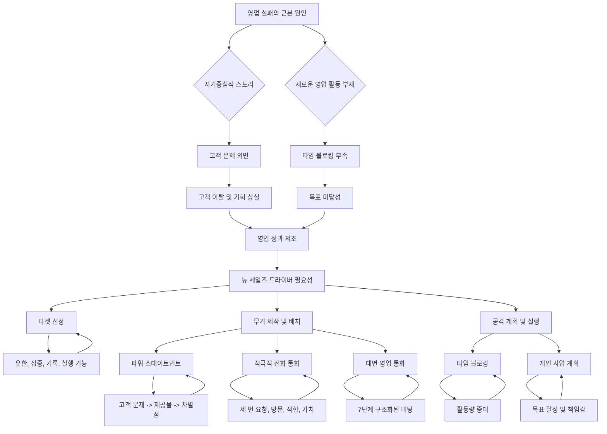

## '뉴 세일즈 심플리파이드' 책 소개
이 책은 영업 전문가 마이크 와인버그가 쓴 '뉴 세일즈 심플리파이드(New Sales. Simplified.)'라는 책의 핵심 내용을 요약한 거야. 영업이 너무 복잡하다고 느끼는 사람들을 위해, 새로운 고객을 찾고 계약을 따내는 과정을 아주 쉽고 단순하게 설명해 주는 실용적인 안내서라고 보면 돼. 이 책은 20년 넘게 현장에서 성공을 거둔 저자의 경험을 바탕으로, 영업의 기본 원칙들을 다시 일깨워주고, 누구나 새로운 비즈니스를 성공적으로 만들어낼 수 있도록 돕는 데 초점을 맞추고 있어.

## 1. 영업의 본질: 왜 많은 사람이 영업에 실패할까? 

영업은 마치 친구에게 내가 만든 멋진 물건을 소개하는 것과 같아. 친구가 뭘 필요로 하는지 알고, 내 물건이 그 친구에게 정말 도움이 될 거라고 믿으면, 자연스럽게 이야기하게 되잖아? 그런데 많은 사람이 이 간단한 본질을 잊어버리고 영업을 너무 어렵게 생각하고 있어.

1. **끔찍한 영업 실패 사례**:
  - 상상해 봐. 너의 작은 회사의 미래가 달린 아주 중요한 발표를 하는 날이야. 
  - 60명이나 앉을 수 있는 거대한 회의실에서, 너의 파트너이자 최고의 영업왕이 발표를 시작해. 
  - 그런데 이 전자회사 사장님이 "30분밖에 없다"고 딱 잘라 말하는 거야. 
  - 시간은 흐르는데, 너의 파트너는 자기 회사 건물 사진만 22분 동안 보여주면서, 회사 자랑, 고객 로고, 복잡한 조직도만 줄줄이 늘어놓는 거지. 
  - 가장 중요한 건, 사장님이나 팀원들에게 단 한 번도 질문을 하지 않아. 그냥 자기 얘기만 하는 거야. 
  - 회의실 분위기는 점점 싸늘해지고, 사장님은 결국 짜증 섞인 목소리로 "데모나 보여주세요"라고 말해. 
  - 결국 기회는 완전히 날아가 버린 거지. 
  - 이 이야기는 실제로 있었던 일인데, 이게 바로 많은 영업인이 겪는 큰 문제의 핵심이야. 
  - 마이크 와인버그는 똑똑한 사람들도 좋은 제품을 가지고 있으면서도, '판매하는 법'을 잊어버려서 실패하는 걸 수없이 봤다고 해. 
  - 그들은 '발표하는 것'과 '판매하는 것'을 헷갈려 하고, 영업을 복잡하고 어색하며 자기중심적인 것으로 만들어 버린 거야. 

2. **영업이 복잡해진 이유**:
  - 와인버그는 영업이 원래는 아주 간단하다고 말해. 사람들은 필요가 있고, 너는 그 필요를 해결해 줄 수 있는 해결책을 가지고 있을 뿐이야. 
  - 너의 일은 그들과 연결해서 너의 해결책이 정말 도움이 될 수 있는지 알아보는 것, 그게 다야. 
  - 그런데 왜 이렇게 많은 사람이 어려워할까? 몇 가지 큰 이유가 있어. 
  - **경제 호황기의 안일함**: 예전에는 경제가 좋아서 가만히 있어도 고객이 저절로 찾아왔어. 
  - 영업인들은 그냥 친절하게 기존 고객을 관리하는 것만으로도 충분히 돈을 벌 수 있었지. 
  - 그래서 새로운 고객을 적극적으로 찾아 나서는 법(사냥하는 법)을 배울 필요가 없었어. 
  - 그러다 경기가 어려워지자, 그들은 완전히 길을 잃어버린 거야. 어떤 과정이나 계획도 없었거든. 
  - **'**세일즈 2.0**' 이론의 오해**: '세일즈 2.0' 같은 새로운 이론들이 등장하면서, 옛날 방식은 다 죽었다고 주장했어. 
  - 전문가들은 '콜드 콜(무작정 전화 거는 것)'은 효과가 없고, 소셜 미디어나 인바운드 마케팅(고객이 스스로 찾아오게 하는 것)을 통해 고객이 찾아올 때까지 기다려야 한다고 말했지. 
  - 이건 마치 다이어트 중인 사람에게 거대한 초콜릿 바를 건네는 것과 같았어. 
  - 수동적이고 소극적인 영업인들이 듣고 싶어 하던 말이었고, 힘들지만 꼭 필요한 일을 하지 않아도 된다는 '핑계'를 준 셈이야. 
  - **멘토의 부재**: 가장 큰 문제는 멘토(선배)들이 사라졌다는 거야. 
  - 예전에는 경험 많은 영업 관리자들이 직접 차에 태우고 다니면서, 미팅 전후로 코칭을 해줬어. 
  - 하지만 이제는 스프레드시트나 고객 관계 관리(CRM) 데이터에 파묻혀 사는 사무직 관리자들이 그 자리를 대신하게 된 거지. 
  - 한 세대의 영업인들이 기본적인 영업 기술을 제대로 배우지 못하게 된 거야. 
  - 이 모든 것이 혼란과 두려움의 완벽한 폭풍을 만들어냈어. 

## 2. 영업 실패의 '달콤하지 않은 16가지 이유' 

와인버그는 이러한 관찰을 통해 영업인들이 새로운 비즈니스를 찾는 데 실패하는 '달콤하지 않은 16가지 이유'를 찾아냈어. 이 모든 것을 다 살펴볼 필요는 없지만, 거의 모든 사람이 한 번쯤 빠지는 몇 가지 함정이 있어.

1. **'**희망의 죄수**' 함정**:
  - 어떤 영업인은 파이프라인(잠재 고객 목록)에 한두 개의 큰 계약이 걸려 있으면, 그 계약이 성사될 거라는 희망에 사로잡혀 다른 모든 일을 멈춰 버려. 
  - 새로운 기회로 파이프라인을 채우는 대신, 하루 종일 걱정하고 궁금해하는 데 시간을 보내는 거지. 
  - 그러면 파이프라인은 마치 곰팡이가 피는 것처럼 썩어가고, 결국 그 계약들이 예상대로 진행되지 않으면 아무것도 남지 않게 돼. 

2. **기존 고객 '베이비시팅' 함정**:
  - 이건 아주 편안한 함정이야. 이미 아는 사람들과 이야기하는 건 쉽고, 그들의 이메일에 답장하고 작은 문제들을 해결해 주는 건 생산적인 일처럼 느껴지거든. 
  - 이런 일들은 너를 필요한 사람처럼 느끼게 해주지만, 네가 최고의 고객 서비스 담당자 역할을 하는 동안, 새로운 비즈니스는 전혀 만들어지지 않아. 
  - 넌 '바쁜 것'과 '효과적인 것'을 헷갈리고 있는 거야. 

3. **가장 큰 실패 원인: 설득력 있는 스토리를 말하지 못하는 것**:
  - 거의 모든 실패의 근본적인 원인은 바로 '설득력 있는 스토리를 말하지 못하는 것'이야. 
  - 대부분의 영업인에게 "무슨 일을 하세요?"라고 물으면, 자기 회사, 제품, 과정에 대한 지루하고 자기중심적인 독백을 늘어놓기 시작해. 
  - 그들은 와인버그가 말하는 '그래서 뭐?(So what?) 테스트'를 통과하지 못하는 거지. 
  - "저희 회사는 29년 동안 사업을 해왔습니다"라고 말하면, 잠재 고객은 속으로 "그래서 뭐? 나한테 뭐가 좋은데?"라고 생각하는 거야. 

## 3. 새로운 영업 성공을 위한 3단계 프레임워크: '뉴 세일즈 드라이버' 

이러한 광범위한 실패에 직면하여, 와인버그는 새로운 복잡한 시스템을 만들지 않았어. 오히려 그 반대였지. 그는 자신의 경력 내내 최고의 성과를 내기 위해 사용했던 간단하고 검증된 프레임워크로 돌아갔어. 그는 이것을 '뉴 세일즈 드라이버(New Sales Driver)'라고 부르는데, 이 책의 핵심이라고 할 수 있어.

1. **'**뉴 세일즈 드라이버**'의 3단계**:
  - 이 프레임워크는 단 세 단계로 이루어져 있어. 
  - 와인버그는 영업인이 새로운 비즈니스를 성공적으로 얻지 못한다면, 그 실패의 원인은 항상 이 세 가지 영역 중 하나에서 문제가 발생했기 때문이라고 단호하게 말해. 
  - 이 간단한 프레임워크가 바로 혼란에서 벗어나는 길이라고 보면 돼. 

## 4. 1단계: 타겟 선정 (Select Your Targets) 

타겟 선정은 마치 장군이 전투를 준비하는 것과 같아. 장군이 병사들을 아무렇게나 들판에 보내 적을 우연히 만나기를 바라겠어? 당연히 아니지. 그건 어리석고 낭비적인 일이야. 장군이 가장 먼저 하는 일은 전략적으로 어디서 싸울지 결정하는 것, 즉 타겟을 선정하는 거야.

1. **타겟 선정의 중요성**:
  - 와인버그는 영업에서 타겟 선정이야말로 우리가 하는 몇 안 되는 진정으로 '전략적인' 일 중 하나라고 말해. 
  - 대부분의 시간은 전화 걸기, 미팅 진행하기 같은 '실행'에 쓰이지만, 타겟을 선택하는 것은 한 발 물러서서 생각할 수 있는 귀한 기회야. 
  - 하지만 대부분의 영업인들은 명확한 타겟 목록 없이 일하고 있어. 
  - 그들은 아무렇게나 돌아다니면서 닥치는 대로 반응하는데, 이는 종종 경쟁자가 이미 몇 달 동안 대화를 주도하고 있던 공식적인 제안 요청(RFP)에 뒤늦게 응하는 결과를 낳지. 

2. **적절한 타겟 목록의 4가지 조건**:
  - 제대로 된 타겟 목록은 네 가지 조건을 갖춰야 해. 
  - **유한함 (Finite)**: 전체 산업 디렉토리처럼 방대한 목록이 아니어야 해. 
  - 현실적으로 추구할 수 있는 정해진 수의 계정이어야 한다는 뜻이야. 
  - 성공적인 사냥꾼들은 유한한 목록에 집중해서 체계적으로 공략해. 
  - 그들은 한 번 시도하고 실패했다고 포기하지 않고, 계속해서 나타나기 때문에 결국 눈에 띄게 되는 거야. 
  - **집중됨 (Focused)**: 모든 사람에게 팔려고 하지 않아야 해. 
  - 큰 성공은 '레이저처럼 집중하는 것'에서 나와. 
  - 성공할 가능성이 높은 특정 고객 유형이나 특정 시장(수직 시장)을 찾아서 그 분야를 장악해야 해. 
  - 그러면 그들의 언어와 문제에 대한 전문가가 되고, 성공은 우연이 아니라 반복 가능한 것이 돼. 
  - **기록됨 (Written)**: 구식처럼 들릴지 모르지만, 와인버그는 반드시 기록해야 한다고 강조해. 
  - 가장 많은 새로운 비즈니스를 창출하는 사람들은 자신의 '기록된 목록'에 따라 움직여. 
  - 화이트보드든 인쇄된 스프레드시트든, 직접 적는 행위 자체가 약속과 명확성을 만들어내. 
  - 그것은 눈에 보이는 실체가 되는 거지. 
  - **실행 가능함 (Workable)**: 계정의 수가 관리할 수 있는 수준이어야 해. 
  - 너무 많으면 각 계정에 충분한 관심을 줄 수 없고, 너무 적으면 전화할 사람이 부족해져. 

3. **타겟을 찾는 최고의 방법**:
  - **최고의 현재 고객 분석**: 타겟을 찾기 시작할 가장 좋은 곳은 바로 너의 '최고의 현재 고객들'이야. 
  - 그들은 누구인지, 그들의 사업은 어떤 모습이고 어떤 느낌인지, 왜 처음에 너에게서 구매했는지 생각해 봐. 
  - 너의 최고의 고객들과 똑같이 생긴 잠재 고객들은 마치 야구에서 가운데로 날아오는 쉬운 공(소프트볼)과 같아. 
  - 너는 이미 그들에게 가치를 제공할 수 있다는 것을 알고 있고, 그것을 증명할 수 있는 성공 사례(케이스 스터디)도 가지고 있잖아. 
  - **'**드림 클라이언트**'를 목표로 삼기**: 와인버그는 더 크게 생각하라고 촉구해. 
  - 목록에 '드림 클라이언트'라고 부르는 몇몇 자리를 남겨두라고 해. 
  - 이들은 너의 한 해 전체를, 심지어 회사 전체의 미래를 바꿀 수 있는 거대한 고객들이야. 
  - 그들의 이름을 단순히 적어두고 꾸준하고 인내심 있게 추구하겠다고 다짐하는 것에서부터 시작돼. 
  - **조직 내 더 높은 직급의 사람들을 타겟팅하기**: 마지막으로, 그는 조직 내에서 더 높은 직급의 사람들을 타겟팅하라고 권해. 
  - 많은 영업인들이 이것을 두려워하지만, 와인버그는 이 두려움이 잘못된 것이라고 말해. 
  - 사실 고위 임원들에게 판매하는 것이 더 쉬운 경우가 많아. 
  - 그들은 사소한 가격 흥정보다는 주요 비즈니스 문제를 해결하는 데 더 관심이 많거든. 
  - 그들은 더 크게 생각하는 사람들이야. 
  - 핵심은 너가 그들의 언어, 즉 '비즈니스 문제'의 언어로 말해야 한다는 거야. 제품 기능에 대한 이야기가 아니라. 
  - 그리고 임원이 "아니요"라고 말해도, 언제든지 아래 직급으로 내려가서 영업할 수 있어. 
  - 하지만 낮은 직급에서 시작해서 거절당하면, 그 사람의 머리 위로 넘어가서 영업하는 것은 거의 불가능하고, 오히려 적을 만들게 될 수도 있어. 
  - 유한하고, 집중적이며, 기록되어 있고, 실행 가능한 타겟 목록이 준비되면, 다음 단계로 넘어갈 준비가 된 거야. 
  - 이제 누구를 공략할지 알았으니, 무엇을 사용할지 결정해야 해. 

## 5. 2단계: 무기 제작 및 배치 (Create and Deploy Your Weapons) 

모든 영업인은 공격을 수행하기 위한 무기고(arsenal)가 필요해. 물론 문자 그대로의 무기는 아니지. 이것들은 타겟과 소통하고 그들의 비즈니스를 따내기 위해 사용하는 도구와 기술들이야. 이 무기고에는 네트워킹, 소셜 미디어부터 적극적인 전화 통화, 프레젠테이션, 제안서까지 모든 것이 포함돼.

1. **궁극의 무기: 너의 '세일즈 스토리'**:
  - 와인버그는 이 모든 무기 중에서 다른 모든 것을 합친 것보다 더 중요한 하나의 무기가 있다고 말해. 
  - 그것은 다른 모든 무기가 세워지는 토대야. 바로 너의 '세일즈 스토리(Sales Story)'지. 
  - 너의 세일즈 스토리는 네가 하는 일과 네가 가져다주는 가치를 설명하는 언어야. 
  - 모든 이메일, 모든 전화 통화, 모든 미팅에서 이 스토리의 일부를 사용하게 될 거야. 
  - 만약 너의 스토리가 약하다면, 네가 하는 다른 모든 일도 약해질 거야. 
  - 하지만 너의 스토리가 강력하다면, 그것은 너의 전체 영업 노력을 완전히 바꿔놓을 수 있어. 

2. **강력한 스토리를 만드는 법: '**파워 스테이트먼트**'**:
  - 무엇이 스토리를 강력하게 만들까? 여기서 이 책의 가장 심오하고 중요한 교훈 중 하나가 나와. 
  - **영업의 가장 흔한 죄: 자기중심주의**: 영업에서 가장 흔한 죄는 '자기중심주의'야. 
  - 대부분의 세일즈 스토리는 온통 판매자 자신에 대한 이야기로 가득해. 
  - "우리는 이걸 하고, 저걸 합니다", "우리는 X년 동안 사업을 해왔습니다", "우리 직원들이 우리의 가장 큰 자산입니다" 같은 식이지. 
  - 이것은 지루하고 핵심을 완전히 놓치는 거야. 
  - 와인버그는 냉정한 진실을 말해줘. 잠재 고객들은 네가 '무엇을 하는지'에 관심이 없어. 
  - 그들은 오직 네가 '그들을 위해 무엇을 할 수 있는지'에만 관심이 있어. 
  - 너의 세일즈 스토리는 너에 대한 것이 아니라, '그들(고객)'에 대한 것이어야 해. 
  - **고객 중심 스토리 공식: '**파워 스테이트먼트**'**: 이 문제를 해결하기 위해, 그는 설득력 있는 고객 중심 스토리를 만드는 간단하지만 혁명적인 공식을 제공해. 
  - 그는 완성된 결과물을 '파워 스테이트먼트(Power Statement)'라고 부르는데, 세 가지 중요한 구성 요소로 이루어져 있고, 그 순서는 절대 바꿀 수 없어. 
  - **1단계: 고객 문제 해결 (**Client Issues Addressed**)**: 첫 번째 구성 요소이자 전체 스토리의 기반은 '고객이 겪는 문제'를 다루는 거야. 
  - 이것은 너의 제품에 대한 이야기가 아니야. 고객의 세상에 대한 이야기지. 
  - 네가 없애주는 고통, 네가 해결해주는 문제, 네가 잡도록 돕는 기회, 그리고 네가 그들을 위해 달성해주는 결과에 대한 이야기야. 
  - **2단계: 너의 제공물 (Your Offerings)**: 두 번째 구성 요소는 네가 실제로 무엇을 판매하는지 간결하고 간단하게 설명하는 부분이야. 
  - **3단계: 너의 **차별점** (Your **Differentiators**)**: 세 번째 구성 요소는 네가 경쟁사보다 왜 더 낫고 다른지 설명하는 부분이야. 
  - **순서의 마법**: 마법은 바로 이 순서에 있어. 
  - 너는 항상 '고객 문제'로 시작해야 해. 왜냐고? 거기에 힘이 있기 때문이야. 
  - 네가 '무엇을 하는지(너의 제공물)'로 시작하면, 구매자는 즉시 "나 이미 저런 거 있어"라고 생각하고 너의 말을 듣지 않아. 
  - 네가 '얼마나 대단한지(너의 차별점)'로 시작하면, 자기애에 빠진 허풍쟁이처럼 들릴 뿐이야. 
  - 하지만 그들의 마음에 있는 문제, 고통, 어려움으로 시작하면, 그들은 귀를 기울여. 
  - 너는 그들을 끌어들이고, 즉시 자신을 제품을 파는 사람이 아니라 '전문가'이자 '문제 해결사'로 포지셔닝하게 되는 거야. 
  - **파워 스테이트먼트 구조 예시**: 파워 스테이트먼트 구조는 이렇게 작동해. 
  - **짧은 헤드라인**: 먼저 맥락을 제공하는 짧은 헤드라인으로 시작해. 
  - **전환 문구**: 그다음에는 "귀사와 같은 회사들은 ~할 때 우리를 찾습니다" 또는 "고위 임원들은 ~할 때 우리를 찾습니다"와 같은 멋진 전환 문구가 나와. 
  - 이것은 마치 너의 최고의 고객들이 증언하는 것처럼, 자랑하지 않으면서도 네가 얻는 결과를 이야기할 수 있게 해줘. 
  - **고객 문제 목록**: 그다음에는 '좌절하다', '당황하다', '~해야 한다는 압박을 받다'와 같은 자극적이고 감정적인 단어를 사용해서 세 개에서 일곱 개의 고객 문제를 나열해. 
  - **예시: 보안 회사 '올세이프'**: 책에 나오는 '올세이프'라는 보안 회사의 예를 들어볼게. 
  - 이들의 예전 스토리는 아마 "우리는 보안 요원과 카메라 시스템을 제공합니다" 같은 지루하고 평범한 이야기였을 거야. 
  - 하지만 새로운 파워 스테이트먼트는 이렇게 시작해. 
  - **헤드라인**: "올세이프는 캐나다 최고의 보안 서비스 제공업체입니다." 
  - **전환 문구**: "건물주들은 올세이프를 찾습니다, 언제냐고요?" 
  - **고객 문제**:
  - "현재 시스템이 약속한 대로 작동하지 않아 좌절할 때." 
  - "보안 요원들이 보여주는 이미지 때문에 계속해서 당황할 때." 
  - "훈련이 제대로 안 되고, 믿을 수 없으며, 계속 바뀌는 경비원들 때문에 지쳤을 때." 
  - 차이가 느껴져? 이건 온통 '고객의 고통'에 대한 이야기야. 
  - 만약 네가 이런 문제들을 겪고 있는 건물주라면, 이제 너는 주의 깊게 듣게 될 거야. 
  - 이런 연결을 만든 후에야 비로소 스토리는 그들이 제공하는 것(인력, 시스템, 모니터링)을 간략하게 언급하고, 그들의 차별점(진정한 원스톱 상점, 가장 전문적인 직원, 고객 이탈이 없음)으로 마무리하는 거지. 
  - **파워 스테이트먼트의 활용**: 이 파워 스테이트먼트는 너의 다른 모든 무기의 '원천 문서'가 돼. 
  - 이것의 일부는 너의 전화 스크립트가 되고, 
  - 일부는 너의 이메일 소개글이 되고, 
  - 전체 버전은 너의 영업 통화 시작 부분이 되는 거야. 

3. **핵심 무기 2: 적극적인 전화 통화 (**Proactive Telephone Call**)**:
  - 이 강력한 스토리를 손에 넣었다면, 이제 다른 두 가지 중요한 무기를 사용할 준비가 된 거야. 바로 '적극적인 전화 통화'와 '대면 영업 통화'지. 
  - **'콜드 콜' 대신 '적극적인 전화 통화'**: 와인버그는 '콜드 콜(Cold Call)'이라는 용어를 싫어해. 
  - 그것은 즉각적인 부정적인 반응을 불러일으키거든. 
  - 그는 이것을 '적극적인 전화 통화(Proactive Telephone Call)'라고 바꿔 부르고, 전문가들이 뭐라고 하든 전화가 대면 미팅을 성사시키는 가장 효과적인 무기라고 단호하게 주장해. 
  - **성공적인 전화 통화의 핵심: 마인드셋**: 전화 통화 성공의 핵심은 너의 '마인드셋(마음가짐)'에서 시작돼. 
  - 너는 저녁 식사 시간에 사람들을 귀찮게 하는 텔레마케터가 아니야. 
  - 너는 전략적으로 선택된 타겟에게 전화하는 중요한 사업가이고, 네가 그들을 진정으로 도울 수 있다고 믿는 사람이야. 
  - 이러한 믿음은 모든 것을 바꿔놓아. 특히 너의 목소리 톤을 말이야. 
  - 치즈 같은 영업 목소리를 버리고, 평범하고 편안하며 자신감 있는 동료처럼 들려야 해. 
  - **전화 통화의 간단한 구조**: 그는 전화 통화에 대한 간단한 구조를 제시해. 
  - 외부 영업인의 목표는 판매하는 것도 아니고, 자격을 확인하는 것도 아니야. 
  - 단 한 가지, '미팅을 잡는 것'이야. 그게 다야. 
  - 전화로 너무 많은 것을 확인하려고 하지 마. 
  - 너는 그들을 타겟 목록에 올린 이유가 있잖아. 너의 임무는 그들을 직접 만나는 거야. 
  - **시작**: 통화는 "안녕하세요, 프레드. 마이크 와인버그입니다. 잠시 시간 좀 뺏을게요."와 같은 간단하고 부담 없는 말로 시작해. 
  - 이것은 인간적이고, 방해했다는 것을 인정하며, "지금 통화 괜찮으세요?"와 같은 한심한 질문과는 달라. 그런 질문은 "아니요"라는 대답을 유도할 뿐이거든. 
  - **미니 파워 스테이트먼트**: 그다음에는 너의 파워 스테이트먼트의 미니 버전을 전달해. 
  - 두 가지 고객 문제와 한 가지 차별점 정도면 충분해. 
  - 그리고 말을 멈춰. 
  - 애피타이저를 제공한 셈이야. 이제 미팅을 요청할 차례지. 
  - **세 번 요청하기**: 여기에 비밀이 있어. '세 번' 요청할 준비를 해야 해. 
  - 잠재 고객은 첫 번째에는 "아니요"라고 말하도록 프로그램되어 있어. 이건 마치 뜨거운 스토브에서 손을 떼는 것과 같은 반사적인 반응이야. 
  - 대부분의 영업인들은 첫 번째 "아니요"를 듣고 "네, 시간 내주셔서 감사합니다"라고 말하고 전화를 끊어. 그들은 실패하는 거지. 
  - 너는 그 초기 저항을 부드럽게 밀고 나가야 해. 
  - **세 가지 마법의 단어: 방문, 적합, 가치**: 이를 위해 와인버그는 세 가지 마법의 단어를 알려줘. '방문(visit)', '적합(fit)', '가치(value)'야. 
  - '미팅'을 요청하는 대신 '방문'을 요청해 봐. 더 따뜻하고 덜 형식적인 느낌을 줘. 
  - 목적을 '네가 그들을 돕기에 적합한지'를 결정하는 것으로 설정해. 이것은 위협적이지 않고, 네가 절박하지 않다는 것을 보여줘. 
  - 그리고 네가 적합하지 않더라도, 함께하는 시간에서 '가치'를 얻을 것이라고 약속해. 
  - 세 번째 요청은 이렇게 들릴 수 있어. "주디, 현재 공급업체에 만족하시는군요. 그래도 저와 한 번 만나주세요. 우리가 적합하지 않더라도, 함께하는 시간에서 가치와 아이디어를 얻으실 거라고 약속합니다." 
  - 그는 종종 세 번째 요청에서 잠재 고객이 마침내 마음을 바꾸고 너를 초대한다고 말해. 

4. **핵심 무기 3: 대면 영업 통화 (**Face-to-Face Sales Call**)**:
  - 미팅을 잡았다면, 네가 하는 일의 정점이라고 할 수 있는 '대면 영업 통화'에 도달한 거야. 
  - 그리고 여기서 대부분의 영업인들이 망쳐버려. 
  - 그들은 나타나서 '토해내기(show up and throw up)' 시작해. 독백, 프레젠테이션, 데모를 쏟아내는 거지. 
  - **주도권을 잡아라**: 와인버그는 네가 반드시 '주도권을 잡아야 한다'고 강조해. 
  - 자신을 비행기의 기장이라고 생각해 봐. 너에게는 비행 계획이 있잖아. 그냥 이륙해서 어떻게 될지 지켜보지는 않을 거야. 
  - 성공적인 영업 통화에는 논리적인 단계(phase)들이 있어. 
  - **성공적인 대면 영업 통화의 7단계**:
  - **1단계: 관계 형성 및 구매자 스타일 파악 (Build Rapport and Identify the **Buyer** Style)**:
  - 이것은 벽에 걸린 물고기에 대한 썰렁한 농담을 하는 것이 아니야. 
  - 인간적인 연결을 만들고, 더 중요하게는 네가 만나는 사람의 성향을 파악하는 거야. 
  - 그들은 빠르게 말하는 추진형 사람인지, 조용하고 분석적인 유형인지, 친근하고 관계 지향적인 사람인지? 
  - 너의 목표는 그들의 스타일에 맞춰 너의 스타일을 약간 조정하는 거야. 
  - **2단계: 의제 공유 및 통화 설정 (Share the Agenda and Set Up the Call)**:
  - 이것이 가장 중요한 단계인데, 거의 아무도 제대로 하지 못해. 
  - 너는 미팅에 대한 너의 계획을 제시하는 거야. 
  - 이렇게 말할 수 있어. "론, 시간 내주셔서 감사합니다. 제가 하고 싶은 것은 이렇습니다. 저는 2~3분 정도 시간을 내서 귀사와 같은 고객들을 위해 우리가 해결하는 문제에 대해 간략히 말씀드릴게요. 그런 다음, 제가 질문을 드려서 귀사의 상황을 이해하고 싶습니다. 그 후에, 우리가 다음 단계를 논의할 적합한지 함께 결정할 수 있을 겁니다. 제가 바라던 바는 이렇습니다. 오늘 이 시간에서 무엇을 얻기를 바라셨나요?" 
  - 이 한 가지 행동으로 세 가지를 달성할 수 있어. 
  - 너를 '전문가'로 차별화하고, 
  - 구매자에게 로드맵을 제공하여 편안함을 느끼게 하며, 
  - 네가 '대화'를 기대하고 '독백'이 아님을 알리는 신호가 돼. 
  - **3단계: **파워 스테이트먼트** 전달 (Deliver Your **Power Statement**)**:
  - 이제 너의 스토리의 전체 3분 버전을 전달해. 
  - 프로젝터를 사용하지 않고, 대화를 나누는 거야. 
  - 고객 문제를 이야기하면서 그들의 반응을 지켜봐. "음" 하는 소리나 고개를 끄덕이는 것을 통해 네가 핵심을 찔렀는지 확인하는 거지. 
  - **4단계: 심층 질문하기 (Ask Probing Questions)**:
  - 이것은 '발견(discovery) 단계'야. 너는 질문할 권리를 얻었어. 
  - 와인버그는 그의 옛 상사, 슬림패스트(Slimfast) 창업자의 말을 인용해. 그가 한 영업 관리자에게 미팅 후에 이렇게 말했다고 해. "신은 너에게 두 개의 귀와 하나의 입을 준 이유가 있다. 그 비율대로 사용해야 한다." 
  - 네가 말하고 있을 때는 배우는 것이 아니야. 너의 임무는 이제 '경청하는 것'이야. 
  - 너의 파워 스테이트먼트에 있던 고객 문제들을 개방형 질문으로 바꿔. 
  - 그리고 문제가 될 만한 부분을 발견하면, 부드럽게 파고들어. 
  - 그들의 문제로 인한 결과가 무엇인지 더 깊이 이해하기 위해 파고드는 거지. 
  - **5단계: 판매 (Sell)**:
  - 이제, 그리고 오직 이제서야 너의 제안을 맞춤화해. 
  - 너는 발견 과정을 거쳤고, 그들에게 무엇이 중요한지 알아. 
  - 이제 너의 제공물을 그들의 고통에 직접 연결할 수 있어. 그들이 사용했던 단어를 사용해서 말이야. 
  - **6단계: 적합성 판단 및 반대 의견 탐색 (Determine Fit and Seek Out Objections)**:
  - 부드럽게 물어봐. "우리의 대화를 바탕으로 볼 때, 우리가 귀사를 돕기에 적합할 것 같습니다. 어떻게 생각하세요?" 
  - 그들의 마음에 있는 것을 들어야 하고, 적극적으로 반대 의견을 찾아야 해. 
  - 그들의 우려 사항을 듣기에 가장 좋은 시기는 바로 지금, 대면해서 듣는 거야. 제안서를 작성하는 데 10시간을 보낸 후가 아니라. 
  - **7단계: 다음 단계 정의 및 일정 잡기 (Define and **Schedule** the Next Step)**:
  - 너는 명확하게 정의되고, 합의되었으며, 일정이 잡힌 '다음 단계' 없이 미팅을 떠나서는 안 돼. 
  - 그것 없이 나간다면, 아무리 기분이 좋았더라도 그 통화는 실패한 거야. 
  - 이러한 구조화된 접근 방식은 구매자의 자연스러운 저항 반응을 막아줘. 
  - 네가 일반적인 영업인처럼 행동하지 않기 때문에, 그들의 방어막은 내려가게 돼. 
  - 너는 적대적인 만남을 협력적인 대화로 바꾼 거야. 
  - 이제 타겟도 있고, 무기도 있으니, 남은 것은 단 하나야. 

## 6. 3단계: 공격 계획 및 실행 (Plan and Execute the Attack) 

이제 과정의 가장 간단하면서도 가장 어려운 부분에 도달했어. 바로 '실행'이야. 여기서 대부분의 영업인들이 실패해.

1. **아무도 '**영업 활동**'을 기본으로 하지 않는다**:
  - 와인버그는 아주 심오한 진실을 말해줘. "아무도 영업 활동(prospecting)을 기본으로 하지 않는다. 아무도." 
  - 그것은 저절로 일어나는 일이 아니야. 
  - 하루에 30분 정도 시간이 비었다고 해서 "야, 지금 적극적인 전화 통화하기 딱 좋은 시간이네!"라고 생각하는 사람은 없어. 
  - 오히려 그 반대야. 삶이 방해꾼처럼 끼어들어. 
  - 급한 고객 서비스 문제, 내부 회의, 개인적인 방해 요소들이 우리의 하루를 가득 채우지. 
  - 그리고 가장 먼저 밀려나는 것이 바로 새로운 비즈니스를 찾는 적극적인 일이야. 
  - 영업 활동을 하고자 하는 '욕구'만으로는 충분하지 않아. 
  - 그것이 확실히 이루어지도록 하는 유일한 방법은 그가 '타임 블로킹(Time Blocking)'이라고 부르는 규율을 통해서야. 

2. **'타임 블로킹'으로 실행력을 높여라**:
  - **타임 블로킹이란?**: 타임 블로킹은 달력에 '높은 우선순위 활동'을 위한 '협상 불가능한 약속'을 자신과 잡는 간단한 행동이야. 
  - 영업 활동은 결코 '급한 일'처럼 느껴지지 않을 것이기 때문에, 너는 그것을 '중요한 일'로 만들어야 해. 
  - 새로운 비즈니스 개발에 얼마나 많은 시간을 할애해야 할지 결정하고, 그것을 매주 90분 또는 2시간 블록으로 일정에 넣어. 
  - 그리고 이 시간을 신성하게 여겨. 마치 CEO와의 미팅만큼이나 중요하게 다루는 거지. 
  - 이메일 알림을 끄고, 휴대폰을 방해 금지 모드로 설정해. 
  - 그 두 시간 동안 너는 오직 '아웃바운드 모드(Outbound Mode)'여야 해. 너의 무기를 타겟에게 발사하는 거지. 

3. **영업은 '숫자 게임'이다**:
  - 이러한 활동에 대한 헌신은 매우 중요해. 왜냐하면 우리가 인정하기 싫어도, 영업은 '숫자 게임'이기 때문이야. 
  - 수학은 항상 통하는 법이야. 깔때기(funnel) 상단에서의 더 많은 활동은 하단에서의 더 많은 결과로 이어져. 
  - 전화 몇 통을 걸어야 미팅을 잡을 수 있는지, 미팅 몇 번을 해야 제안서를 제출할 수 있는지, 제안서 몇 개를 제출해야 계약을 따낼 수 있는지와 같은 '전환율(conversion rates)'을 추적함으로써, 너는 목표를 달성하기 위해 정확히 얼마나 많은 활동이 필요한지 역으로 계산할 수 있어. 
  - 너는 항상 결과를 통제할 수는 없지만, 너의 '활동'은 항상 통제할 수 있어. 

4. **'개인 사업 계획서' 작성**:
  - 이 모든 것을 하나로 묶기 위해, 그는 매년 간단한 '한 페이지짜리 개인 사업 계획서'를 작성하라고 권장해. 
  - 이것은 복잡한 기업 문서가 아니야. 너의 '개인적인 로드맵'이지. 
  - 이 계획서에는 너의 목표(무엇을 할 것인가), 너의 전략(어떻게 할 것인가), 너의 주요 행동(어떤 활동을 할 것인가), 너가 약속하는 활동 지표, 잠재적인 장애물, 그리고 너의 개인 개발 계획이 명시되어 있어. 
  - 이 계획서는 서랍 속에 처박혀 있으라고 만든 것이 아니야. 
  - 그것은 너의 달력에 무엇이 들어갈지를 결정하는 '살아있는 문서'야. 
  - 이것은 책임감을 만들고, 너의 성공에 대한 주인의식을 갖도록 강제해. 

5. **결론: 단순함과 실행**:
  - 결국 모든 것은 '단순함'과 '실행'으로 귀결돼. 
  - 새로운 영업 성공은 마법의 총알이나 비밀스러운 계약 성사 기술에서 오는 것이 아니야. 
  - 그것은 기본을 마스터하고, 전략적인 의도를 가지고 타겟을 선택하며, 강력한 고객 중심 스토리를 만들고, 시간을 확보하여 매일매일 공격을 실행하는 규율에서 오는 거야. 
  - 복잡하지는 않지만, 와인버그가 상기시켜주듯이, '단순한 것'이 '쉬운 것'과 같은 의미는 아니야. 

## 7. '뉴 세일즈 심플리파이드'의 핵심 교훈과 실천 방안 

'뉴 세일즈 심플리파이드'에서 얻을 수 있는 교훈들을 되돌아보면, 그 강력한 '반대 의견' 메시지가 정말 돋보여. 복잡성에 집착하는 세상에서 우리는 성공으로 가는 지름길을 약속하는 새로운 기술, 플랫폼, 이론들에 끊임없이 시달리잖아. 이 책은 지름길은 없다는 것을 상기시켜주는 신선하고도 필요한 메시지를 던져줘. 영업에서의 성공은, 대부분의 가치 있는 일들처럼, '기본 원칙들을 규율 있게 실행하는 것'에서 온다는 거야.

1. **가장 심오한 아이디어: '고객 중심 세일즈 스토리'**:
  - 나에게 가장 심오했던 아이디어는 '세일즈 스토리'의 개념과 그것이 너의 제품이 아니라 '고객의 문제'에 대한 것이어야 한다는 절대적인 필요성이야. 
  - 우리가 '무엇을 하는지'에서 '우리가 어떤 문제를 해결하는지'로 전환하는 것은 단순한 의사소통 기술 그 이상이야. 
  - 그것은 너의 전체 접근 방식에 대한 '철학적인 변화'라고 할 수 있어. 
  - 이것은 너를 제품을 밀어붙이는 '판매자'에서 문제를 해결하는 '컨설턴트'로 바꿔줘. 
  - 이것이 바로 소음을 뚫고 구매자들이 가지고 있는 자연스러운 저항을 극복하는 열쇠야. 
  - 너를 그저 또 하나의 평범한 상품으로 보지 않게 하는 해독제인 셈이지. 

2. **두 번째 강력한 교훈: '아무도 영업 활동을 기본으로 하지 않는다'**:
  - 두 번째 강력한 교훈은 "아무도 영업 활동(prospecting)을 기본으로 하지 않는다"는 말이야. 
  - 이것은 아주 인간적인 통찰력이야. 우리는 모두 '중요한 일'보다는 '급한 일'에 반응하도록 타고났거든. 
  - 우리는 항상 다른 할 일을 찾을 거야. 이메일에 답장하거나, 또 다른 회의에 참석하거나, 책상을 세 번째로 정리하는 것 같은 일들 말이야. 적극적인 아웃리치(잠재 고객에게 먼저 연락하는 것)의 잠재적인 불편함과 거절에 직면하기보다는 말이지. 
  - 이것을 인정하는 것이 약점의 신호가 아니야. 오히려 그것을 극복하기 위한 시스템을 구축하는 첫걸음이지. 
  - 타임 블로킹은 단순한 시간 관리 기술이 아니야. 
  - 그것은 너의 가장 중요한 '급하지 않은 일'을 '급한 일의 폭정'으로부터 보호하는 구조인 셈이야. 

3. **지금 당장 적용할 수 있는 3가지 간단한 행동**:
  - 그렇다면 이 아이디어들을 지금 당장 어떻게 적용할 수 있을까? 여기 네가 취할 수 있는 세 가지 간단한 행동이 있어. 
  - **1. '그래서 뭐? 테스트'를 해봐**:
  - 너의 회사 웹사이트, 링크드인 프로필, 또는 네가 보낸 마지막 영업 이메일을 확인해 봐. 
  - 네가 하는 일에 대해 쓴 모든 문장을 읽고, 각 문장 뒤에 "그래서 뭐?"라고 솔직하게 물어봐. 
  - 만약 그 답이 고객에게 즉각적으로 명확하고 유익하지 않다면, 다시 써. 
  - 그들의 세상, 그들의 고통, 그들의 목표에서부터 시작해. 
  - **2. 다음 주에 '새로운 비즈니스 블록'을 예약해**:
  - 지금 바로 달력을 열고, 다음 주에 90분짜리 새로운 비즈니스 블록 두 개를 예약해. 
  - 그것들을 명확하게 표시하고, 철저하게 지켜. 
  - 시간이 되면, 이메일을 닫고, 휴대폰을 치우고, 그 시간을 오직 너의 타겟 목록에만 집중해. 
  - 몇 통의 전화만 걸거나 몇 개의 이메일만 보내더라도, 너는 적극적인 노력이라는 근육을 키우고 있는 거야. 
  - **3. 다음 영업 통화에서 '의제 공유'를 시도해봐**:
  - 너의 다음 영업 통화에서, 시작할 때 너의 '의제(agenda)'를 공유해 봐. 
  - 우리가 논의했던 프레임워크를 사용해. 
  - 그것이 미팅의 역학 관계를 어떻게 바꾸는지 지켜봐. 
  - 너를 자신감 있는 전문가로 포지셔닝하고 잠재 고객을 편안하게 만드는 방법을 확인해 봐. 
  - 이것은 작은 변화지만, 네가 인식되는 방식에 엄청난 차이를 만들어낼 거야. 

