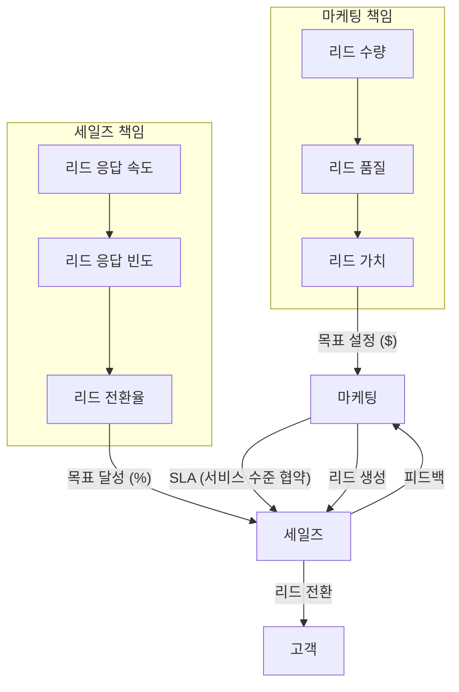
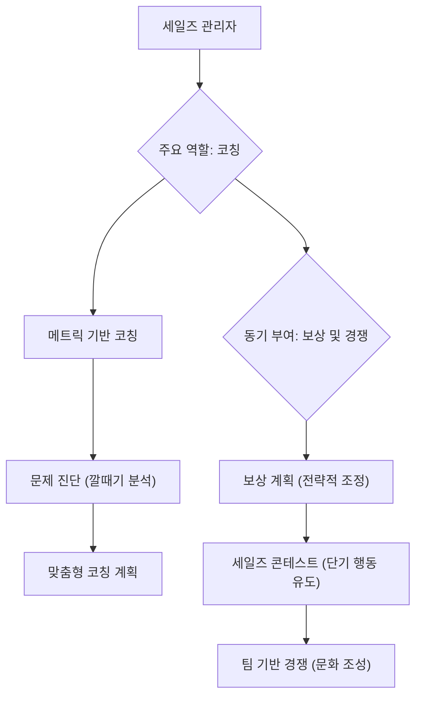

## 세일즈 가속화 공식: 데이터와 기술로 예측 가능한 성장을 만드는 법
이 책은 허브스팟(HubSpot)의 최고 매출 책임자(CRO)였던 마크 로버지가 어떻게 데이터와 기술을 활용해 예측 가능하고 확장 가능한 매출 성장을 이뤄냈는지 설명한다. 특히 세일즈 팀을 만들고 관리하며, 마케팅과 연계하는 과정에서 겪었던 경험과 성공 공식을 공유한다. 

## 1. 예측 가능하고 확장 가능한 매출 성장의 중요성 

예측 가능하고 확장 가능한 매출 성장은 모든 회사가 원하는 목표이다.  하지만 많은 회사들이 이 목표를 달성하지 못하는 경우가 많다. 

1. **데이터 기반 접근 방식의 부족**:
  - 대부분의 회사는 매출 예측을 할 때 감에 의존하는 경우가 많다. 
  - 하지만 세일즈는 인사, 재무, 엔지니어링, 마케팅 등 모든 직무 중에서 가장 수치화하기 쉬운 분야이다. 
  - 데이터를 활용하면 성공을 반복하고 예측 가능성을 높일 수 있는 기회가 많다. 
2. **데이터 활용 능력의 중요성**:
  - 과거에는 데이터를 얻는 것 자체가 어려웠지만, 지금은 데이터가 넘쳐나는 시대이다. 
  - 이제는 쌓여있는 데이터를 어떻게 의미 있게 해석하고 활용할지가 중요하다. 
  - 이를 위해서는 전통적인 세일즈 리더십에 분석적인 사고방식이 더해져야 한다. 
3. **성장 목표 달성을 위한 4가지 핵심 전술**:
  - 허브스팟은 예측 가능하고 확장 가능한 매출 성장을 위해 4가지 핵심 전술에 집중했다. 
  - **동일한 성공적인 **세일즈맨** 채용**: 매번 똑같이 성공할 수 있는 세일즈맨을 뽑는 것이다. 
  - **동일한 방식으로 교육**: 뽑은 세일즈맨들을 똑같은 방법으로 교육하는 것이다. 
  - **동일한 품질과 양의 **리드** 제공**: 매달 같은 품질과 양의 잠재 고객(리드)을 제공하는 것이다. 
  - **동일한 **세일즈 프로세스** 적용**: 세일즈맨들이 동일한 세일즈 프로세스를 사용하도록 하는 것이다. 
  - 이 4가지가 잘 이루어지면 예측 가능하고 확장 가능한 매출 성장을 이룰 수 있다고 믿었다. 

## 2. 이상적인 세일즈맨 채용 공식 

세일즈 팀을 구축하는 데 있어 가장 중요한 부분은 바로 채용이다.  좋은 사람을 뽑는 것이 성공의 절반 이상을 차지한다. 

1. **맥락(Context)의 중요성**:
  - 이상적인 세일즈맨의 모습은 회사마다, 그리고 회사의 성장 단계마다 다르다. 
  - 예를 들어, 유명 브랜드의 제품을 파는 것과 아무도 모르는 신생 회사의 복잡한 제품을 파는 것은 완전히 다른 역량을 요구한다. 
  - 허브스팟 초창기에는 '인바운드 마케팅'이라는 개념 자체가 생소했기 때문에, 고객에게 개념을 설명하고 설득하는 '전도사' 같은 세일즈맨이 필요했다. 
  - 따라서 다른 회사에서 최고의 성과를 냈던 세일즈맨이 허브스팟에서는 잘하지 못하는 경우도 있었다. 
  - 중요한 것은 자신의 회사 맥락을 이해하고, 그에 맞는 이상적인 세일즈맨을 정의하는 것이다. 
2. **이상적인 **세일즈맨** 정의 프로세스**:
  - **이론 수립**: 성공에 기여할 것이라고 생각하는 10가지 기준을 세운다. 
  - **기준 명확화**: 각 기준이 무엇을 의미하는지, 1점부터 10점까지 어떻게 점수를 매길지 구체적으로 정의한다. 
  - **평가 및 기록**: 모든 지원자를 이 기준에 따라 평가하고 점수를 기록한다. 
  - **반복 및 개선**: 채용 후 6~9개월이 지나 누가 잘하고 못하는지 확인하고, 그 결과를 바탕으로 처음 세웠던 기준을 수정하고 개선한다. 
  - **데이터 분석**: 충분한 데이터가 쌓이면 통계적 회귀 분석(어떤 요소가 성공에 가장 큰 영향을 미치는지 분석하는 방법)을 통해 어떤 기준이 실제로 성공과 가장 강하게 연결되는지 과학적으로 밝혀낼 수 있다. 
3. **허브스팟의 이상적인 세일즈맨 기준**:
  - 허브스팟의 분석 결과, 다음 5가지 기준이 성공과 가장 강하게 연관되었다. 
  - 코칭 가능성**(**Coachability**)**: 새로운 것을 배우고 피드백을 받아들이는 능력.  (처음에는 이 기준이 없었지만, 나중에 가장 중요하다고 밝혀졌다. )
  - **호기심(Curiosity)**: 끊임없이 질문하고 배우려는 태도. 
  - **지능(Intelligence)**: 문제를 이해하고 해결하는 능력. 
  - **성공 경험(Prior Success)**: 과거에 어떤 분야에서든 성공을 경험한 이력. 
  - **직업 윤리(Work Ethic)**: 성실하고 꾸준히 노력하는 태도. 
  - 흥미롭게도, 일반적으로 세일즈맨에게 중요하다고 생각하는 '클로징 능력(계약 성사 능력)', '설득력', '반대 의견 처리 능력' 등은 허브스팟에서는 성공과 오히려 부정적인 상관관계를 보였다. 
  - 이는 오늘날의 구매자들이 '신뢰할 수 있는 조언자'나 '컨설턴트' 같은 세일즈맨을 원하며, 강압적인 방식은 통하지 않는다는 것을 의미한다. 

## 3. 효과적인 세일즈 교육 시스템 구축 

세일즈맨을 채용한 후에는 체계적인 교육이 필수적이다.  단순히 옆에서 보고 배우는 방식으로는 예측 가능하고 확장 가능한 성장을 이룰 수 없다. 

1. **전통적인 교육 방식의 한계**:
  - 많은 회사들이 신입 세일즈맨에게 '최고의 세일즈맨 옆에 앉아서 두 달 동안 보고 배우라'고 지시한다. 
  - 하지만 이는 확장 가능하지도, 예측 가능하지도 않다. 
  - 최고의 세일즈맨들은 각자 다른 '초능력'을 가지고 성공한다. 어떤 사람은 활동량이 엄청나고, 어떤 사람은 관계 구축에 뛰어나다. 
  - 신입이 특정 선배의 방식만 배우면 자신의 강점을 살리지 못하고, 심지어 나쁜 습관을 배울 수도 있다. 
2. 체계적인 교육** 프로그램의 필요성**:
  - **표준화된 방법론**: 구매자 여정(고객이 제품을 구매하기까지의 과정), 세일즈 프로세스(판매 단계), 자격 매트릭스(잠재 고객을 평가하는 기준) 등 표준화된 방법론을 구축해야 한다. 
  - **제품 및 프로세스 시험**: 제품 지식 시험, 각 단계별 인증 등을 통해 세일즈맨의 이해도를 평가하고, 이 점수가 실제 성과와 연관되는지 분석하여 교육을 개선한다. 
  - **구매자 관점 이해**: 오늘날 구매자들은 제품 정보에 쉽게 접근할 수 있으므로, 세일즈맨은 단순 정보 전달자가 아닌 '신뢰할 수 있는 컨설턴트'가 되어야 한다. 
  - **실제 경험 제공**: 세일즈맨이 구매자의 입장을 직접 경험하게 하는 것이 중요하다. 
  - 허브스팟에서는 모든 세일즈맨이 교육 기간 동안 직접 웹사이트를 만들고, 블로그를 쓰고, 소셜 미디어 활동을 하고, A/B 테스트를 진행하며 리드 육성 캠페인을 실행했다. 
  - 이를 통해 세일즈맨은 고객의 업무를 깊이 이해하고, 고객과 더 잘 연결될 수 있었다. 
3. **세일즈맨의 사고 리더십(**Thought Leadership**) 강화**:
  - 세일즈맨은 단순히 콜드 콜(무작정 전화 걸기)만 하는 것이 아니라, 온라인에서 잠재 고객과 소통하며 자신의 전문성을 보여줘야 한다. 
  - **온라인 참여**: 잠재 고객이 읽는 블로그에 댓글을 달고, 링크드인 그룹에서 질문에 답하며, 트위터에서 영향력 있는 사람들을 팔로우하고 리트윗한다. 
  - 콘텐츠 제작: 회사 블로그에 직접 글을 기고하여 자신의 브랜드를 구축하고, 잠재 고객과의 신뢰를 쌓는다. 
  - 이러한 활동은 콜드 콜보다 훨씬 효과적인 리드(잠재 고객) 발굴 및 관계 구축 방법이 될 수 있다. 

## 4. 리드(잠재 고객) 발굴 및 마케팅-세일즈 연계 

오늘날 구매자들은 온라인에서 스스로 정보를 찾기 때문에, 전통적인 콜드 콜이나 스팸 메일 방식은 효과가 떨어진다.  대신, 고객이 스스로 찾아오게 만드는 '인바운드 마케팅'이 중요하다. 

1. 인바운드** 마케팅의 중요성**:
  - 고객은 문제가 생기면 온라인에서 검색하고, 블로그 글을 읽고, 백서를 다운로드하며 해결책을 찾는다. 
  - 이러한 '인바운드' 방식은 고객이 먼저 관심을 보이기 때문에 훨씬 효과적이다. 
  - 하지만 많은 회사들이 여전히 콜드 콜이나 스팸 메일 같은 '아웃바운드' 방식에 더 많은 시간과 돈을 투자하고 있다. 
  - 인바운드 마케팅은 고객이 먼저 신호를 보내면, 세일즈맨이 그 신호를 바탕으로 고객에게 접근하는 방식이다. 
2. 콘텐츠 생산 프로세스** 구축**:
  - 인바운드 마케팅의 핵심은 '콘텐츠'이다.  하지만 CEO나 바쁜 임원들이 직접 콘텐츠를 만드는 것은 어렵다. 
  - **전문 기자 채용**: 콘텐츠 생산을 위해 전문 기자를 채용하는 것이 효과적이다. 
  - 기자들은 글쓰기 능력이 뛰어나고, 인터뷰를 통해 정보를 추출하는 데 능숙하다. 
  - 프리랜서 시장이나 대학교 저널리즘 학과 학생들을 활용할 수도 있다. 
  - **사고 리더십 위원회 구성**: 회사 내 전문가들(C-레벨 임원, 세일즈 팀, 제품 개발자 등)로 '사고 리더십 위원회'를 구성한다. 
  - **인터뷰 기반 콘텐츠 생산**: 기자가 위원회 멤버들을 인터뷰하고, 그 내용을 바탕으로 전자책, 블로그 게시물, 소셜 미디어 메시지 등 다양한 콘텐츠를 생산한다. 
  - 리드** 전환**: 콘텐츠 끝에는 '더 많은 정보가 필요하면 클릭하세요' 같은 행동 유도(Call to Action)를 넣어 잠재 고객의 이름, 이메일, 전화번호 등을 받아 리드로 전환한다. 
  - 이러한 프로세스는 회사 전문가들의 부담을 줄이면서도, 양질의 콘텐츠를 지속적으로 생산하여 많은 잠재 고객을 확보할 수 있게 한다. 
3. **세일즈-마케팅 **서비스 수준 협약**(**SLA**) 설정**:
  - 마케팅과 세일즈 팀은 전통적으로 서로를 비난하며 사이가 좋지 않은 경우가 많다. 
  - 마케팅은 세일즈를 '과하게 보상받는 버릇없는 아이들'로, 세일즈는 마케팅을 '하루 종일 미술 공예나 하는 사람들'로 생각한다. 
  - 하지만 구매 여정이 온라인에서 시작되는 오늘날에는 두 팀의 긴밀한 협력이 필수적이다. 
  - **SLA 정의**: 마케팅이 세일즈에 제공해야 할 리드의 양과 품질, 그리고 세일즈가 그 리드를 어떻게 처리해야 할지에 대한 명확한 '서비스 수준 협약(SLA)'을 설정한다. 
  - 리드** 가치 기반 목표 설정**: 단순히 리드 수량만 목표로 삼으면, 마케팅 팀은 전환율이 낮은 쉬운 리드(예: 전자책 다운로드)만 대량으로 생성할 수 있다. 
  - 각 리드 유형별 전환율과 평균 구매 금액을 분석하여 '리드 가치'를 계산한다. 
  - 예를 들어, 전자책 다운로드는 100달러 가치, 데모 요청은 500달러 가치로 책정하는 것이다. 
  - 마케팅 팀의 목표를 '리드 수량'이 아닌 '리드 가치'로 설정하여, 마케팅 팀도 세일즈처럼 '매출 할당량(Revenue Quota)'을 갖게 한다. 
  - **세일즈의 책임**: 세일즈 팀도 리드에 얼마나 빨리, 자주 연락하는지, 그리고 얼마나 많은 리드를 기회로 전환하는지에 대해 책임을 진다. 
  - **데이터 기반 관리**: 매일 마케팅과 세일즈의 SLA 달성 현황을 보고하여 양 팀이 서로의 책임과 성과를 명확히 알 수 있게 한다. 
  - **최적의 콜 패턴 분석**: 리드 유형별로 몇 번 전화하는 것이 가장 효과적인지 데이터를 분석하여 최적의 콜 패턴을 CRM(고객 관계 관리) 시스템에 반영한다. 
  - 예를 들어, 소규모 비즈니스 리드는 5번, 중견 기업 리드는 8번 전화하는 것이 가장 수익성이 높다는 결과가 나올 수 있다. 

## 5. 세일즈 관리 및 동기 부여 

세일즈 관리자의 가장 중요한 역할은 '코칭'이다.  파이프라인(잠재 고객 관리) 관리나 예측은 시스템으로 자동화할 수 있지만, 사람을 성장시키는 것은 관리자의 몫이다. 

1. **메트릭 기반 세일즈 코칭**:
  - **골프 비유**: 골프 코치가 한 번에 너무 많은 피드백을 주면 선수는 혼란스러워한다.  반면, 한두 가지 핵심적인 부분에 집중하여 반복 연습시키는 코치가 더 효과적이다. 
  - **세일즈 적용**: 세일즈 관리자도 신입 세일즈맨의 90가지 문제점을 한 번에 지적하기보다는, 현재 가장 큰 영향을 미 미칠 한두 가지에 집중하여 코칭해야 한다. 
  - **데이터 진단**: 세일즈 깔때기(Sales Funnel)의 각 단계별 지표(리드 수, 연결률, 데모 전환율, 계약 성사율 등)를 분석하여 세일즈맨의 약점을 정확히 진단한다. 
  - 예를 들어, 어떤 세일즈맨이 리드는 많이 확보하지만 데모 전환율이 낮다면, '데모 전환' 단계에 문제가 있다고 판단할 수 있다. 
  - 이때, 단순히 데모 전환율이 낮다고만 볼 것이 아니라, '전화 연결이 안 되는 것인지', 아니면 '전화 연결은 되지만 다음 단계로 넘기지 못하는 것인지' 등 더 깊이 파고들어 문제의 원인을 파악해야 한다. 
  - **맞춤형 코칭**: 진단된 문제점에 맞춰 구체적이고 집중적인 코칭을 제공하고, 다음 달에 해당 지표의 변화를 확인한다. 
  - 이러한 '메트릭 기반 세일즈 코칭'은 세일즈 생산성을 극대화하는 가장 좋은 방법이다. 
2. **세일즈 보상 계획(Compensation Plan)의 전략적 활용**:
  - 세일즈 보상 계획은 CEO의 가장 강력하지만 가장 저평가된 도구이다. 
  - 대부분의 CEO는 보상 계획 설계를 세일즈 책임자에게 위임하고, 세일즈 책임자는 이전 회사에서 사용하던 계획을 그대로 가져오는 경우가 많다. 
  - 하지만 보상 계획은 회사의 전략적 목표에 맞춰 유연하게 조정되어야 한다. 
  - **초기 성장 단계**: 허브스팟 초기에는 고객 확보가 최우선 목표였기 때문에, 공격적인 '사냥꾼(Hunting) 계획'을 사용했다. 
  - 월간 반복 매출(MRR) 1달러당 2달러를 지급하는 방식으로, 단기간에 수천 명의 고객을 확보했다. 
  - **고객 성공 단계**: 고객 수가 늘어나자, 높은 이탈률(Churn Rate)이 문제가 되었다. 
  - 세일즈맨이 어떤 고객을 유치하고 어떤 기대를 심어주느냐에 따라 고객의 최종 성공 여부가 달라진다는 것을 데이터로 확인했다. 
  - 이후에는 '고객 성공 계획'으로 전환하여, 고객 이탈률이 낮은 세일즈맨에게 더 많은 보상을 지급했다. 
  - 이 결과, 6개월 만에 고객 이탈률이 70% 감소하는 놀라운 성과를 거두었다. 
  - **지연 지급 계획**: 고객이 일정 기간(예: 4개월 또는 1년) 이상 유지될 때만 커미션을 지급하는 '지연 지급(Deferred Payment) 계획'을 통해 고객의 장기적인 성공을 유도할 수도 있다. 
  - 보상 계획은 회사의 전략적 목표에 따라 계속해서 변화하고 발전해야 한다. 
3. **세일즈 콘테스트(Sales Contest) 활용**:
  - 세일즈 콘테스트는 단기적인 행동 변화를 유도하는 데 매우 효과적이다. 
  - **목표 설정**: 특정 기간 동안 활동량 증가나 특정 제품 판매 등 단기 목표를 설정한다. 
  - **보상 및 경쟁**: 매력적인 상품을 걸고, 매일 결과를 공유하여 팀원들의 경쟁심을 자극한다. 
  - **팀 기반 경쟁**: 개인 경쟁보다는 팀 기반 경쟁을 통해 팀워크를 강화하고 긍정적인 문화를 조성하는 것이 좋다. 
  - 팀 단위로 고급 식사나 골프 여행 같은 경험을 보상으로 제공하여 함께 성공을 축하하고 문화를 만들 수 있다. 

