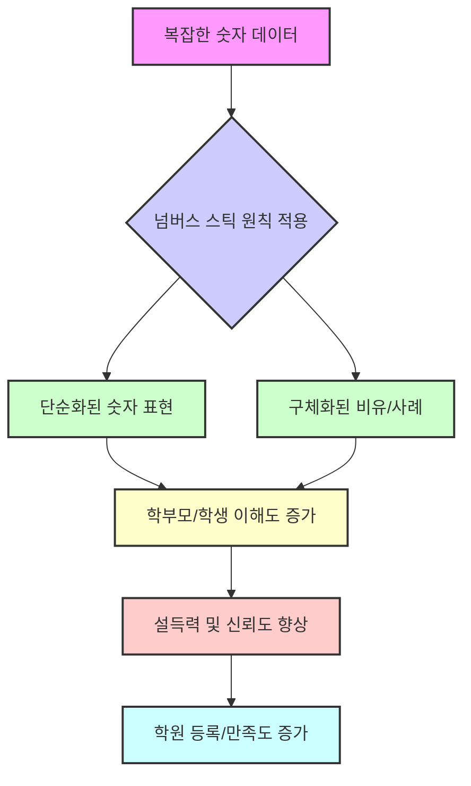
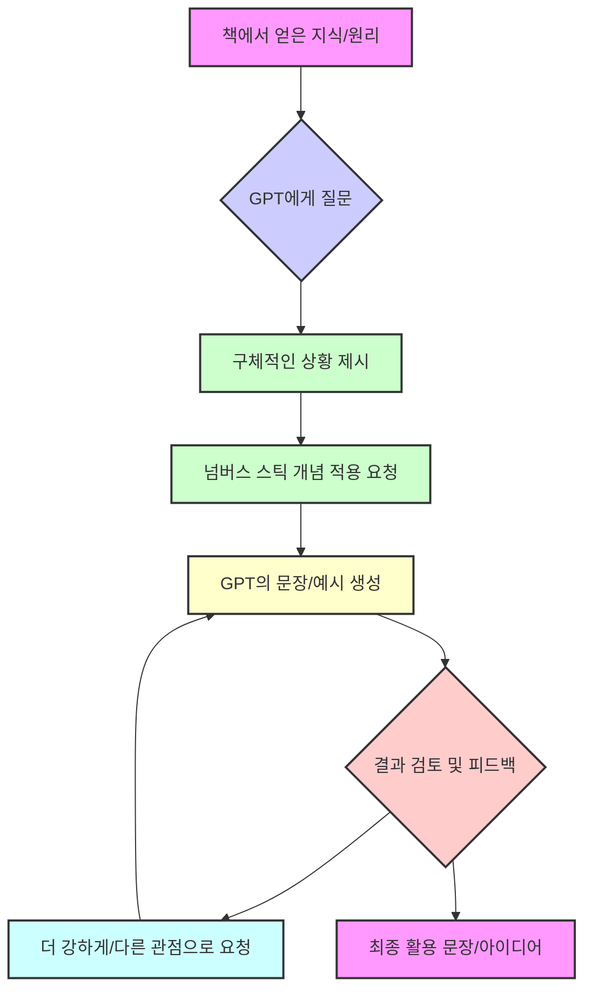

## 1. '넘버스 스틱' 책 소개: 숫자를 번역해서 사람들의 마음을 움직이는 마법 
이 책은 숫자를 마치 낯선 외국어처럼 생각하고, 사람들이 쉽게 이해하고 공감할 수 있는 언어로 번역하는 방법을 알려줘. 복잡한 데이터를 일상적인 크기로 줄이고 따뜻한 감성을 더하면, 숫자가 단순한 정보가 아니라 사람들의 행동을 이끌어내는 강력한 이야기가 될 수 있다는 게 핵심 메시지야.

### 1.1. 숫자는 왜 번역해야 할까? 

1. **숫자는 낯선 외국어와 같아**:
  1. 우리가 복잡한 숫자나 통계를 보면 머리가 아프고 이해하기 어렵잖아? 
  2. 그건 숫자가 우리 뇌에겐 마치 낯선 외국어처럼 느껴지기 때문이야. 
  3. 그냥 숫자를 던져주는 건 정보를 전달하는 데 실패할 뿐만 아니라, 듣는 사람을 대화에서 소외시키는 무례한 행동일 수도 있어. 
2. **우리 뇌는 큰 숫자에 약해**:
  1. 인간의 뇌는 눈에 보이는 '하나, 둘, 셋' 같은 작은 수를 파악하도록 진화했어. 
  2. 0이 잔뜩 붙은 추상적인 큰 숫자를 처리하도록 설계되지 않았기 때문에, 일정 수준을 넘어가면 그냥 '엄청 많구나' 하고 뭉뚱그려 버리는 경향이 있어. 
  3. 예를 들어, 100만 달러와 10억 달러의 차이를 바로 느끼기 어렵잖아? 
  - 하루에 5만 달러(약 6,500만 원)씩 쓴다고 가정하면, 100만 달러는 20일 만에 사라지지만, 10억 달러는 무려 55년 동안이나 쓸 수 있어. 
  - 이렇게 시간을 기준으로 번역하면 그 엄청난 차이가 확 와닿지. 
3. **숫자를 번역해야 하는 이유**:
  1. 숫자를 직관적이고 감성적인 '인간의 언어'로 번역해야만 사람들이 이해하고 행동을 이끌어낼 수 있어. 
  2. 이것은 수학의 문제가 아니라, 숫자를 어떻게 제시하느냐의 문제인 거야. 

### 1.2. 숫자를 번역하는 두 가지 핵심 원칙 

1. **첫 번째 원칙: 숫자를 단순하게 번역하기 (**단순화**)** 
  1. 복잡한 숫자를 우리 뇌가 편하게 받아들일 수 있도록 '쉽게' 바꿔주는 거야. 
  2. 때로는 숫자를 가장 잘 전달하는 방법이 아이러니하게도 숫자를 아예 쓰지 않는 것일 수도 있어. 
2. **두 번째 원칙: 숫자를 구체적으로 만들기 (**구체화**)** 
  1. 추상적인 데이터를 우리 현실 세계로 가져와서 '눈에 보이게' 만들어주는 거야. 
  2. 마치 의사가 "종양 크기가 3cm입니다"라고 말하는 것보다 "포도알 크기만 한 종양이 있습니다"라고 말하는 게 더 확 와닿는 것처럼 말이야. 

## 2. 첫 번째 원칙: 숫자를 단순하게 번역하는 기술 

### 2.1. '1'의 힘을 활용해서 거대주의 함정 피하기 
1. **거대주의 함정**:
  1. 우리는 종종 '은하수만큼 거대하다'는 말처럼 엄청나게 큰 숫자를 던져주면 사람들이 감탄할 거라고 착각해. 
  2. 하지만 우리 뇌는 '버스만큼 거대하다'는 말을 훨씬 더 직관적으로 받아들여. 
  3. 너무 큰 숫자는 오히려 사람들의 인식을 마비시켜서, '심리적 무감각'에 빠지게 만들 수 있어. 
2. **'1'의 힘**:
  1. 거대한 숫자를 '단위 1'로 쪼개서 보여주면 훨씬 이해하기 쉬워져. 
  2. 예를 들어, 농구 선수가 '통산 35,000점'을 득점했다고 하면 그냥 '와, 많다' 정도의 느낌이지만, '한 경기당 27점'이라고 하면 그 선수가 얼마나 꾸준하고 대단한지 바로 와닿는 것과 같아. 
  3. '천 명 중 두 명'처럼 온전한 바구니 기법을 활용해서 파편화된 백분율(0.2%)을 실제하는 개체로 다듬어 주는 것도 좋은 방법이야. 
  4. 정부의 방대한 예산을 '개인의 1년치 노동 시간'으로 축소해서 보여주는 것도 좋은 예시야. 
3. 미니어처** 만들기**:
  1. 다루기 벅찬 거대한 시스템을 작고 귀여운 '미니어처'로 만들어서 보여주는 것도 효과적이야. 
  2. 작은 모형은 우리가 전체적인 역학(어떤 일이 어떻게 돌아가는지)을 한눈에 파악할 수 있게 도와줘. 
  3. 항공사의 복잡한 구조도 '10달러짜리 비행기 표 한 장'으로 모델링(간단하게 표현)할 수 있어. 

### 2.2. 뇌가 편하게 느끼도록 숫자를 다듬기 
1. **깔끔하게 반올림**:
  1. 복잡한 소수점이나 분수 대신에 깔끔하게 반올림한 정수를 쓰면 뇌가 정보를 훨씬 쉽게 처리하고 기억해. 
  2. '0.7인치'라고 말하는 것보다 '1인치'라고 말하는 게 더 직관적이고 기억하기 쉽지. 
2. **사용자 친화적인 단순한 형태**:
  1. 머리 아픈 계산은 소통을 가로막는 큰 장벽이 될 수 있어. 
  2. 과감하게 반올림을 활용해서 이해하기 쉬운 모양으로 다듬으면, 사용자 친화적인 단순한 형태가 가장 큰 힘을 발휘해. 
  3. 완벽한 정확성보다는 사람들이 쉽게 이해하고 공감하는 것이 더 중요해. 

## 3. 두 번째 원칙: 숫자를 구체적으로 만드는 기술 

### 3.1. 익숙한 사물과 비교해서 즉각적인 이해 돕기 
1. **추상적인 것을 구체적인 것으로**:
  1. 막연한 숫자를 우리에게 익숙한 사물과 비교해주면 즉각적으로 이해를 도울 수 있어. 
  2. 예를 들어, '종양 크기는 3cm입니다'보다 '포도알 크기만 한 종양이 있습니다'라고 말하는 게 훨씬 와닿는 것처럼 말이야. 
  3. '44g의 건조 설탕' 데이터를 '도넛 하나와 각설탕 4개를 씹어 먹는 주스'라는 충격적인 감성으로 결합하면 뇌의 감각을 직접 자극해서 즉각적인 행동 변화를 이끌어낼 수 있어. 
2. **단위를 바꿔서 규모의 차이 실감하기**:
  1. 추상적인 '초' 단위를 우리가 매일 느끼는 '일'이나 '연'으로 바꾸면 그 규모의 차이가 훨씬 명확하게 와닿아. 
  2. '마이크로 초'를 '300m 구리선'이나 '400m 컨테이너선', '엠파이어 스테이트 빌딩'으로 바꾸면 만질 수 있는 사물처럼 느껴져. 
  3. 막대한 비용도 '커피 값'으로 나누어 설명하면 금방 이해할 수 있어. 
3. 휴먼 스케일**(인간의 척도) 사용하기**:
  1. 도저히 상상하기 힘든 규모의 숫자를 우리에게 익숙한 기준으로 확 바꿔서 보여주는 방법이야. 
  2. 예를 들어, 우주선이 통과해야 하는 안전한 경로가 '종이 한 장 두께'라고 비유하면 그 위험성이 확 와닿지. 
  3. 지구가 농구공이고 달이 7m 떨어진 야구공이라고 상상하면, 우주의 거대한 스케일을 우리 눈높이에서 이해할 수 있어. 
  4. 에베레스트처럼 높은 봉우리도 '이층집의 크기'로 축소할 수 있고, 끝없이 깊은 바다의 물방울도 '컵 안에 담으면' 그 소중함이 보여. 
  5. 세상을 이해하는 가장 완벽한 척도는 바로 '사람의 기준'이야. 

### 3.2. 숫자에 감성을 얹어 이야기로 만들기 
1. 나이팅게일의 사례:
  1. 크림 전쟁 당시, 병원에서 질병으로 죽어간 영국군 병사가 7개월 동안 '1천 명 중 600명'이라는 충격적인 통계가 있었어. 
  2. 나이팅게일은 이 차가운 숫자를 사람들이 공감하는 이야기로 번역하기 시작했어. 
  3. 그녀는 이 사망률이 '런던 대역병 시절보다 심각하다'고 말해서 사람들의 가슴에 깊이 박혀 있던 비극과 연결했어. 
  4. 또한, '매년 1,100명의 군인을 처형하는 것과 같다'고 말하며, 전쟁터의 일이 아니라 '우리 집 뒷마당에서 벌어지는 끔찍한 범죄'처럼 느끼게 만들었지. 
  5. 심지어 당시 큰 충격을 줬던 '버크네도 침몰 참사'를 끌어와서 '매년 거의 세 번씩이나 그런 참사가 일어나는 것과 마찬가지'라고 표현했어. 
  6. 이렇게 숫자를 '과거의 통계'가 아니라 '바로 지금 이 순간 벌어지는 절대로 용납해서는 안 될 위기 상황'으로 생생하게 전달할 수 있었어. 
2. **'이건 숫자가 아니라 당신의 이야기입니다'**:
  1. 추상적인 데이터를 모두가 공감하는 이야기나 경험과 연결해서 '이건 남의 일이 아니라 바로 나의 문제'라고 느끼게 만드는 것이 핵심이야. 
  2. 매마른 수치 위에 따뜻한 체온을 얹으면 놀라운 변화가 생겨. 
  3. 나와 상관없는 먼 이야기들을 아주 개인적인 상황으로 상상하게 만들면 마음을 움직일 수 있어. 
3. **오감으로 직접 경험하게 만들기**:
  1. 숫자를 우리 몸으로 직접 느끼게 만들 수도 있어. 
  2. 메이저리그 투수의 강속구가 얼마나 빠른지 말로만 설명하는 대신, 공이 홈플레이트에 도달하는 찰나의 순간에 맞춰 '박수를 쳐보게' 하면 시간을 느끼게 돼. 
  3. 수백 켤레의 장갑 더미를 직접 보여주면서 낭비가 얼마나 심각한지 '눈으로 보게' 하는 것도 좋은 방법이야. 
  4. 듣기만 한 정보는 쉽게 잊히지만, 직접 만지고 느낀 것은 본능에 새겨져. 

### 3.3. 시간 지도로 복잡한 시스템을 명확하게 이해시키기 
1. **우주의 나이를 시간 지도로**:
  1. 우주의 나이가 '138억 년'이라고 하면 너무 커서 아무 의미가 없게 느껴져. 
  2. 이럴 때 '시간 지도'를 만들어서 우주의 전체 역사를 '단 하루, 24시간'으로 압축해 보는 거야. 
  3. 빅뱅이 자정에 일어나고, 지구는 오후 4시 반쯤 생기고, 인류의 모든 기록된 역사는 자정 직전 마지막 '단 2초' 동안 일어난 일이라고 설명하면 그 거대하고 추상적인 숫자가 한눈에 들어오는 단순하고 직관적인 그림이 돼. 
  4. 이 지도를 통해 우리가 얼마나 찰나의 순간을 살고 있는지 즉시 파악할 수 있게 되는 거지. 
2. **정부 예산을 시간 지도로**:
  1. 수조 달러에 달하는 정부 예산도 우리에게는 아무 의미가 없어. 
  2. 하지만 그 어마어마한 예산을 '내가 1년 동안 일하는 시간'이라는 지도로 번역하면 어떨까? 
  3. '내가 국방비를 위해 일주일을 일하고, 교육을 위해서는 이틀을 일하는구나'라고 생각하면 훨씬 명확하게 와닿아. 
3. **맥락의 지도**:
  1. 복잡한 정보의 숲에서는 방향을 잃지 않게 도와줄 '지도'가 필수적이야. 
  2. 낯선 도시의 지하철 노선도처럼 가장 중요한 랜드마크만 표시하고, 모든 세부 사항을 알 필요 없이 길을 잃지 않을 정도의 맥락만 주면 돼. 
  3. 튼튼하게 그려진 맥락의 지도는 험난한 데이터의 바다를 안내하는 나침반이 돼. 

## 4. 숫자를 활용한 설득 전략: 학원 운영에 적용하기 

### 4.1. 학원에서 숫자를 사용하는 경우 
1. **학원 실적 어필 및 광고**:
  1. 우리 학원의 점수가 몇 명이고, 몇 명이 몇 점을 받았는지 등 실적을 어필하거나 광고할 때 숫자를 많이 사용해. 
2. 학부모 상담:
  1. 상담할 때 학생의 성적, 레벨, 진도 등을 숫자로 설명하면 객관적이고 신뢰감을 줄 수 있어. 
3. 설명회:
  1. 입시 설명회나 학원 설명회에서 합격률, 등급, 재수 비용 등을 숫자로 제시하면 학부모의 이해를 돕고 설득력을 높일 수 있어. 
4. **광고 문구 제작**:
  1. 블로그 제목이나 SNS 게시물에 'OO하는 방법 세 가지', 'OO 비결'처럼 숫자를 사용하면 클릭률을 높일 수 있어. 

### 4.2. 숫자를 활용해서 전달하고 싶은 메시지 
1. **학원의 결과 포장**:
  1. 우리 학원의 결과가 얼마나 대단한지 보여줄 때 숫자를 사용해. 
  2. 예를 들어, 대형 학원이 '30명 합격'이라고 할 때, 작은 학원은 '5명 중 4명이 100점'이라고 말하면 더 설득력이 있을 수 있어. 
2. **위기감 조성 및 급박한 느낌 주기**:
  1. '지금 안 하면 안 돼요'라는 분위기를 조성할 때 숫자를 많이 사용해. 
  2. '수능까지 며칠 남았습니다', '반에서 몇 명까지만 대학교에 갈 수 있습니다'처럼 위기감을 조성하거나 급박한 느낌을 줄 때 효과적이야. 

### 4.3. 학원 운영에 '넘버스 스틱' 적용하기 

1. **설명회에서 **손실 회피 심리** 활용**:
  1. 학부모 설명회에서 "오늘 가치는 3천만 원이다"라고 말하며, "이 정보를 배워가면 우리 아이 연봉이 그만큼 올라가는 것"이라고 설명하는 거야. 
  2. '3천만 원'이라는 숫자는 대기업 초년생 연봉을 기준으로 잡아서, 영어를 제대로 시키면 그만한 가치를 얻을 수 있다는 의미로 사용했어. 
  3. 재수 비용을 예시로 들 수도 있어. '1년 재수 비용이 4천만 원'이라고 뉴스에서 봤다고 하면서, "오늘 여기서 그 돈을 벌어 가시는 겁니다"라고 말하는 거지. 
  - 인공지능(GPT)에게 '대한민국에서 대학교 재수를 하면 1년에 어느 정도 비용이 들까?'라고 물어보면 객관적인 자료를 찾아줄 수 있어. 
  - 실제로 일반 재수 종합학원 월평균 학원비는 180만 원으로, 1년이면 2천만 원이 넘고, 기숙 재수 학원은 월 400만 원까지도 해. 
2. **학습 효과를 숫자로 드라마틱하게 표현**:
  1. '매일 30분씩 공부하는 것이 1년이 되면 누적 시간이 많아질 거야'라는 문장을 학부모나 학생이 절실하게 느끼도록 만들 수 있어. 
  2. 인공지능(GPT)에게 '넘버스 스틱 개념을 사용해서 문장을 만들어 줘'라고 시키면: 
  - "하루 30분은 짧아 보이지만, 1년 동안 빠지지 않고 공부하면 총 182시간, 3년 동안 유지하면 약 546시간, 즉 60일 이상 매일 풀타임으로 공부하는 것과 같습니다. 수능 전날, 두 달을 남들보다 더 공부할 수 있다면 결과가 어떻게 달라지겠습니까?" 
  - 이것은 단순한 숫자가 아니라, '아침마다 일찍 일어나 책을 펼친 당신의 노력'이자 '꿈을 향한 걸음'이며, '수능 시험장에서 느끼게 될 자신감과 원하는 대학에 합격할 시나리오, 당신의 미래 이야기'라고 감성을 더할 수 있어. 
3. 수강료 인상** 설득**:
  1. 학원 월 수업료가 40만 원이라면, 직접적으로 제시하는 대신 '넘버스 스틱' 원칙을 적용해서 표현할 수 있어. 
  2. "우리 학원 수업료는 한 달에 40만 원이지만, 하루에 약 13,000원으로 자녀의 미래를 위한 투자라고 생각할 수 있습니다." 
  3. "하루에 커피 두 잔 값으로 자녀가 훨씬 더 나은 교육을 받을 수 있는 기회입니다." 
  4. 이렇게 40만 원을 13,000원으로, 다시 커피 두 잔 값으로 후려치면(줄여서 표현하면), 학부모가 느끼는 부담감을 줄일 수 있어. 
  5. "이 금액은 자녀가 시험에서 10점 이상 향상될 가능성을 높여주는 투자다"라고 가치 위주로 전달하는 것도 좋은 방법이야. 
4. 재원생** 이탈 방지 및 신규생 유치**:
  1. 재원생이 초등에서 중등으로, 중등에서 고등으로 넘어가지 않거나 다른 학원으로 이동하는 경우, 이는 '이미지 싸움'이라고 볼 수 있어. 
  2. 우리 학원이 잘하고 있다는 것을 '있어 보이게' 보여준 게 없기 때문에, 다른 학원이 더 많이 보여주는 것에 끌려가는 거야. 
  3. **보여줄 것들**:
  - **결과**: 인증 시험, 학교 시험 결과, 학원 자체 레벨 테스트, 경시대회 수상 실적 등을 보여줘. 
  - **기대 (아이들의 태도)**: 상담 코멘트, 성적표, 포트폴리오, 오답 노트, 빽빽한 교과서, 공부 인증 사진, 동영상 등으로 아이들이 꾸준히 열심히 하고 있다는 것을 보여줘. 
  - **고객 만족**: 학부모 리뷰와 후기를 모아서 보여줘. 
  4. 이런 것들을 학원 내부에 잘 전시하고, 블로그나 SNS 등 온라인상에도 꾸준히 노출해서 학부모들이 쉽게 찾아볼 수 있게 해야 해. 
  5. 초등학생들이 학원에 오고 가면서 중학생 언니, 오빠들의 성과나 포트폴리오를 계속 보게 되면, 자연스럽게 '우리 중학부 잘하나 봐' 하고 나중에 그 학원으로 갈 생각을 하게 돼. 
  6. 간담회는 이런 것들을 '작정하고 보여주는 타이밍'이야. 

### 4.4. 인공지능(GPT) 활용해서 아이디어 구체화하기 

1. **아이디어 짜내기**:
  1. 책을 읽고 '아, 숫자를 이렇게도 쓸 수 있구나' 하고 방법을 알겠는데, 막상 내 상황에 어떻게 적용해야 할지 막막할 때가 많아. 
  2. 이럴 때 인공지능(GPT)을 활용하면 좋아. 내가 직접 머리를 쥐어짜는 대신, GPT에게 아이디어를 내달라고 시키는 거야. 
2. **구체적인 질문**:
  1. GPT에게 책의 특정 챕터나 개념(예: '넘버스 스틱 3장의 나이팅게일 사례')을 언급하며, '이 원리를 사용해서 문장을 만들어 줘'라고 요청할 수 있어. 
  2. 예를 들어, '수업 시간이 5분씩 늘어나는 것은 한 학교 수업 시간이 3주 늘어나는 것과 같은 효과를 지닌다고 설명하고 싶어. 그 3주 동안 얼마나 많은 설명과 흥미로운 주제를 추가할 수 있을지 얘기해 줘야 한다고 생각해. 그래서 그 5분이 소중하기 때문에 학생들이 지각하지 않도록, 숙제를 해오지 않도록 강조하고 싶은데, 어떻게 하면 좋을까?'라고 구체적으로 물어보는 거지. 
3. **GPT의 답변 예시**:
  1. "5분은 짧게 느껴질 수 있지만, 매일 추가되면 한 학기에 15일간의 추가 수업과 같은 효과가 있어요. 15일 동안 새로운 문법 단어를 마치거나, 흥미로운 주제를 깊이 탐구하거나, 시험 대비 시간을 늘릴 수 있습니다." 
  2. "만약 지각이나 숙제 미완료로 수업 시간을 10분을 허비한다면, 하루에 이 두 배의 손실이 발생해요. 한 학기로 보면 무려 6주 취소를 날리는 셈이 됩니다. 10분이면 단어 10개를 외울 시간이고, 중요한 문법 한 가지를 이해할 시간입니다. 이걸 놓친다면, 시험 전날 어려운 문제가 나왔을 때 더 힘들어질 거예요." 
4. **피드백 및 개선**:
  1. GPT가 내놓은 예문이 마음에 들지 않으면, '좀 더 세게 강조해 줘', '고등학생이 뼈저리게 느낄 만한 문장으로 만들어 줘'처럼 피드백을 주면서 계속 개선해 나갈 수 있어. 
  2. 내가 아는 용어(예: '행동 경제학의 손실 회피 심리')를 사용해서 질문하면, GPT가 더 정확하고 효과적인 답변을 줄 수 있어. 
  3. 이렇게 하면 혼자 고민하는 것보다 훨씬 더 구체적인 아이디어를 얻을 수 있고, 지식을 적용하는 데 큰 도움이 돼. 

## 5. '넘버스 스틱'과 함께 읽으면 좋은 책들 

### 5.1. 가격 전략 관련 책 
1. **'고객의 80%는 비싸도 구매한다'**:
  1. 이 책은 '80대 20 법칙'(파레토 법칙)을 바탕으로, 상위 20%의 고객은 가격에 상관없이 구매하고, 중간 60%의 고객은 가격과 할인에 모두 반응하며, 하위 20%는 가격에 매우 민감하다고 설명해. 
  2. 결국 고객의 80%는 가격과 상관없이 비싸도 구매한다는 이론을 이야기하며, 어떻게 하면 상대방에게 비싸도 구매하고 싶게끔 '인식의 프레임'을 바꿀 수 있는지 알려줘. 
  3. 고부가 가치를 만드는 방법에 대해 다루고 있어서, 학원 수강료 설정이나 가치 어필에 큰 도움이 될 거야. 
2. **'**당신의 가격은 틀렸습니다**' (김유진 작가)**:
  1. 이 책은 가격을 어떻게 풀어내느냐에 따라 상대방이 느끼는 포인트가 다르다는 것을 강조해. 
  2. 수강료를 '자녀의 미래를 위한 투자'라고 의미 부여하고 미래 가치에 초점을 맞춰서 학부모에게 이야기하는 관점을 제시해. 
3. **'**프라이싱**' (헤르만 지몬)**:
  1. 가격 설정에 관련된 고전적인 책으로, 원가나 마진 등을 많이 따지는 책이야. 
  2. 제조업 분야에는 큰 도움이 되지만, 인건비가 주된 학원 같은 곳에서는 조금 동떨어졌다고 느낄 수도 있어. 
  3. 하지만 심리적으로 가격에 대한 차별을 어떻게 둘 수 있는지에 대한 통찰을 얻을 수 있어. 

### 5.2. 설득 및 화술 관련 책 
1. **'**팔지 마라, 사게 하라**' (장문정 작가)**:
  1. 이 책은 쇼호스트 장문정 씨가 쓴 책으로, 상대방에게 어떻게 말을 하면 좋을지, 즉 '멘트를 잘 치는 기술'이나 '포장을 잘하는 기술'에 대해 다루고 있어. 
  2. 넘버스 스틱이 숫자를 활용한 설득이라면, 이 책은 숫자 이외의 다른 상황에서도 설득력을 높이는 화술을 알려줘. 
  3. 국내 작가가 쓴 책이라 넘버스 스틱의 예시가 낯설게 느껴질 때, 이 책의 국내 예시들이 더 와닿을 수 있어. 
  4. 장문정 작가의 유튜브 채널 '장문정 TV'에서도 유료 강의 못지않은 좋은 화술 강의들을 찾아볼 수 있어. 
  - 예를 들어, 침대를 팔 때 '꺼짐, 소음, 빈틈, 흔들림'이라는 네 가지 문제점을 제시하고, 그에 대한 해결책을 제시하는 것처럼 말이야. 
  - 아이들 사고 1위가 '낙상 사고'이고, 그중 침대 낙상이 많으니 아이 침대는 성인 침대보다 '15cm 낮아야 한다'고 구체적인 숫자를 제시하며 설득하는 방식도 있어. 
2. **'**스틱**' (칩 히스, 댄 히스)**:
  1. '넘버스 스틱'의 전작으로, 메시지가 뇌리에 착 달라붙게 만드는 여섯 가지 법칙(단순성, 의외성, 구체성, 신뢰성, 감성, 스토리)을 이야기하는 책이야. 
  2. 마케팅, 카피라이팅, 스피치 등 메시지를 전달해야 하는 모든 분야에 적용되는 고전이자 필독서로 강력 추천해. 
  3. '넘버스 스틱'은 '스틱'의 개념 중 '숫자'에만 초점을 맞춰서 더 짧고 직관적으로 쓰인 책이라고 보면 돼. 

## 6. 책을 효과적으로 읽고 활용하는 방법 

### 6.1. 지식을 암기보다 활용에 집중하기 
1. **지식 활용의 중요성**:
  1. 지금은 단순히 지식을 많이 암기하는 것보다, '지식을 잘 써먹는 사람'이 필요한 시대야. 
  2. 모르는 것이 있으면 검색하면 되기 때문에, 모든 것을 머릿속에 다 집어넣을 필요는 없어. 
  3. 책을 읽고 '아, 이런 내용이 어디에 있었지?' 정도만 알고 있으면, 필요할 때 다시 찾아보고 활용할 수 있어. 
2. **적용 포인트 찾기**:
  1. 책을 읽으면서 '아, 이런 건 내가 평상시에 자주 써먹겠다' 싶은 예시들을 기억하거나 메모해두는 게 좋아. 
  2. 설명회나 상담 등 필요할 때마다 백과사전처럼 뒤져가면서 자꾸 써먹다 보면, 예시들이 입에 붙게 될 거야. 

### 6.2. 다른 사람들과 아이디어 나누기 
1. 인증글** 활용**:
  1. 책을 읽고 인증글을 쓰는 것은 머릿속에 내용을 정리하고 이해하는 데 도움이 돼. 
  2. 다른 사람들이 쓴 인증글을 보면서 '아, 이분은 이걸 읽고 이렇게 적용해 보려고 고민하시더라' 하고 새로운 아이디어를 얻을 수 있어. 
  3. 다른 사람의 인증글에 댓글을 달면서 소통하면, 책 내용을 더 깊이 이해하고 본인의 것으로 만들 수 있어. 
2. **토론의 중요성**:
  1. 지식을 적용하는 가장 좋은 방법은 주변 사람들과 토론하는 것이지만, 그럴 기회가 많지 않으니 인공지능(GPT)과 대화해 보는 것도 좋은 방법이야. 

### 6.3. '넘버스 스틱' 독서 가이드 
1. **시간이 없다면**:
  1. 이 책은 예시가 많아서 처음부터 끝까지 읽으면 지루하게 느껴질 수도 있어. 
  2. 시간이 없다면 '3장: 숫자의 감성을 얹어라'만이라도 읽어보는 것을 추천해. 
  3. 그것도 어렵다면, 책 중간중간에 핑크색(혹은 주황색) 박스로 되어 있는 '원래 문장'과 '바꾼 예문'만이라도 읽어봐. 
2. **문화적 차이 극복**:
  1. 외국 서적이다 보니 예시가 우리나라 문화에 딱 맞지 않는 경우도 있어. 
  2. 이럴 때는 원리만 이해하고, '한국 문화에 맞는 예문 좀 만들어 줄래?'라고 인공지능(GPT)에게 요청하면 돼. 
3. **최소 두 번 읽기**:
  1. 이 책은 한 번 읽는 것과 두 번 읽는 것이 느낌이 많이 달라. 
  2. 두 번째 읽을 때는 예문을 직접 만들어 본다는 생각으로 읽어보면 더 도움이 될 거야. 

