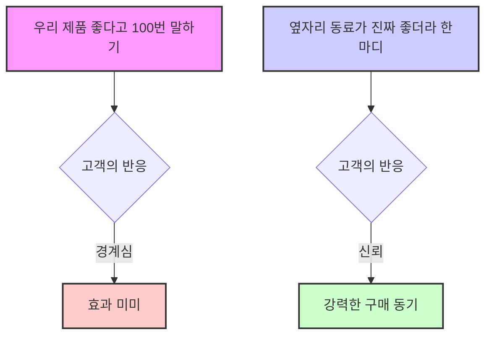
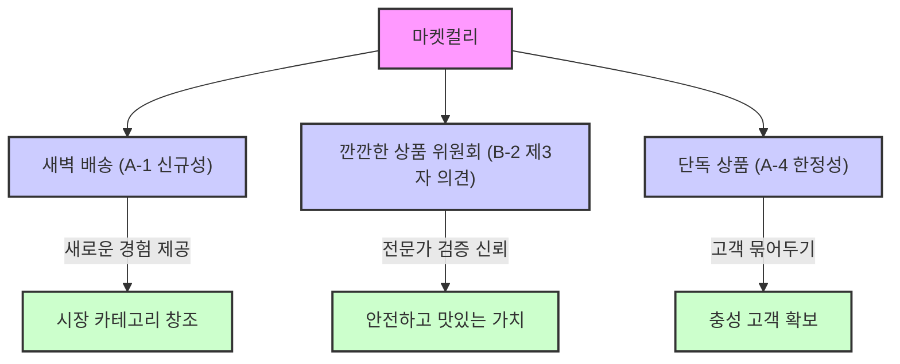
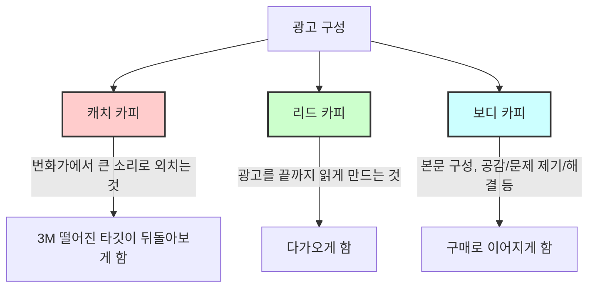

## 다 팔아버리는 백억짜리 카피 대전: 고객의 마음을 움직이는 마법의 언어 
이 책은 수많은 광고와 메시지 속에서 사람들의 마음을 사로잡는 카피(광고 문구)의 비밀을 파헤치는 책이야. 단순히 좋은 단어를 나열하는 게 아니라, 고객의 심리를 깊이 이해하고 그들의 언어로 소통하는 전략적인 사고방식을 알려주는 안내서라고 보면 돼.

## 1. 카피라이팅, 단순한 글쓰기가 아니야! 

카피라이팅은 그냥 글을 쓰는 게 아니라, 마치 사람의 마음을 움직이는 심리 전략과 같아.  우리가 매일 수천 개의 광고를 보지만, 어떤 문구는 그냥 지나치고 어떤 문구는 머리에 콕 박히는 경험을 하잖아?  그 차이가 바로 이 책의 핵심이야.

1. **준비 운동이 90%를 차지해**: 카피를 쓰기 전에 준비하는 과정이 전체 전략의 거의 전부라고 할 수 있어. 
  1. **1단계: 팔고 싶은 상품을 생생하게 떠올려**: 네가 팔고 싶은 물건이 어떤 건지 머릿속에 아주 선명하게 그려보는 거야. 
  2. **2단계: 이상적인 고객을 구체적으로 그려봐**: 이 물건을 쓸 사람이 누구인지, 어떤 사람인지 아주 자세하게 상상하는 거지. 
  3. **3단계: 판매 시점을 '바로 지금'으로 가정해**: 지금 당장 이 물건을 팔아야 한다고 생각하는 거야. 
  4. **4단계: 고객이 얻을 가장 큰 가치를 새겨**: 고객이 이 물건을 통해 무엇을 얻게 될지, 어떤 좋은 점을 느낄지 머릿속에 딱 박아두는 거야. 
  - 우리는 보통 제품의 기능이나 스펙(성능)을 말하고 싶어 하지만, 고객은 스펙이 아니라 그 스펙이 가져다줄 결과와 가치를 사는 거거든. 
  - 예를 들어, '30대 직장 여성'이라고 막연하게 생각하는 것과, '매일 야근에 마스크 때문에 피부가 지쳐서 아침마다 거울 보고 한숨 쉬는 32살 김대리'를 떠올리는 건 완전히 다른 수준의 공감이야. 
  - 이 '가치'라는 건 바로 그 김대리의 한숨을 미소로 바꿔줄 무언가를 찾아내는 과정이라고 보면 돼.  이 정도 깊은 공감이 있어야만 네가 쓰는 키워드가 그 사람 마음에 닿을 수 있어. 

2. **실행 단계: 연장을 고르는 시간이야** 
  1. **5단계: 고객 마음에 꽂힐 단어를 체크해**: 책에 있는 키워드들을 보면서, 네가 떠올린 고객의 마음에 쏙 들어갈 만한 단어들을 골라보는 거야. 
  2. 6단계**: 최고의 가치를 전달하는 최종 카피를 만들어**: 고른 단어들을 조합해서 고객에게 가장 큰 가치를 전달할 수 있는 멋진 문구를 만드는 거지. 

3. **가장 중요한 경고: 거짓말은 절대 안 돼!** 
  - 이 책은 사기나 과장을 위한 기술이 아니야.  네 제품이 가진 진짜 가치를 고객이 가장 잘 이해하고 공감할 수 있는 말로 바꿔주는 도구인 셈이지. 
  - 결국 모든 설득의 기본은 '신뢰'야.  신뢰가 무너지면 아무리 화려한 키워드도 그냥 시끄러운 소음일 뿐이거든. 

## 2. 두 가지 핵심 전략: 직접 말하기 vs 스스로 깨닫게 하기 

카피라이팅에는 크게 두 가지 핵심 전략이 있어. 하나는 제품의 가치를 직접적으로 말해주는 방법이고, 다른 하나는 고객 스스로 그 가치를 발견하게 만드는 방법이야.

1. **A. **특장점**: 우리 제품의 가치를 직접적으로 전달하는 법** 
  - 이건 마치 "이거 정말 좋아요!" 하고 직접적으로 말하는 것과 같아.
  - **A-1. **신규성**: 새로운 것에 끌리는 본능을 자극해** 
  - 사람들은 새로운 것에 본능적으로 끌리거든. '업계 최초', '지금까지 없었던' 같은 키워드들이 여기에 해당돼. 
  - 하지만 요즘엔 '신상', '최초' 같은 말이 너무 많아서 식상하게 들릴 수도 있어. 
  - 진짜 힘은 어떤 가치와 연결되느냐에 달려 있어. 그냥 '새로운 샴푸'는 별 감흥이 없지만, '탈모의 상식을 바꾼 업계 최초의 5가지 성분 샴푸'라고 하면 이야기가 확 달라지지. 
  - 새로운 것이 고객의 구체적인 문제 해결과 연결될 때 비로소 강력한 힘을 얻는 거야. 
  - **A-4. **한정성**, **희소성**: 놓치면 안 된다는 두려움을 자극해** 
  - 이건 "이 기회를 놓치면 후회할 거야!"라고 말하는 고전적인 방법인데, 여전히 가장 효과적이야. 
  - '오늘만', '매진 임박', '재고 소량' 같은 키워드들이 여기에 해당돼. 
  - 우리는 이성적으로 마케팅인 걸 알아도, '재고 두 개 남음' 같은 문구를 보면 심장이 덜컥 내려앉잖아. 
  - 이건 심리적으로 '얻을 수 있다는 기쁨'보다 '놓칠지도 모른다는 손실에 대한 두려움'이 훨씬 강력한 동기가 되기 때문이야.  이걸 '손실 회피 심리'라고 하는데, 인간의 아주 원초적인 심리를 건드리는 거지. 

2. **B. **깨달음**: 고객 스스로 가치를 발견하게 만드는 법** 
  - 이건 마치 "이거 정말 좋지 않나요?" 하고 질문해서 고객 스스로 "아, 정말 좋네!" 하고 깨닫게 만드는 것과 같아.
  - 때로는 너무 직접적으로 "우리 제품 최고예요!"라고 주장하면 고객이 오히려 경계심을 가질 수 있거든. 
  - 이럴 때 필요한 게 바로 '깨달음' 카테고리야. 고객 스스로 "아, 이게 나한테 필요했구나"라고 결론 내리게 만드는 일종의 유도 질문 전략이라고 할 수 있지. 
  - **B-1. 알림 깨달음 주기: 고객이 몰랐던 문제를 부드럽게 꺼내줘** 
  - 이 방법은 고객이 미처 생각하지 못했던 문제를 부드럽게 꺼내주는 방식이야. 주로 질문 형태로 많이 사용돼. 
  - "혹시 ~ 때문에 고민한 적 없으세요?"나 "~만으로 충분하다고 생각하시나요?" 같은 질문들이지. 
  - 이런 질문은 정답을 요구하는 게 아니라, 고객 머릿속에 작은 물음표를 던지는 거야. 
  - 예를 들어, '매일 쓰는 수건, 세균으로부터 안전할까요?'라는 카피를 보면, 그전까지 아무 생각 없이 수건을 쓰던 사람도 순간 "어, 그러게?" 하면서 자기 습관을 돌아보게 되잖아. 
  - 문제점을 인식하는 바로 그 순간, 해결책에 대한 필요성이 자연스럽게 생겨나는 거지. 
  - 여기서 아까 말했던 6단계 프로세스의 '깊은 공감'이 다시 한번 중요해져. 고객이 마음속 깊이 어떤 불안이나 불편을 느끼는지 정확히 알아야만, 바로 그 지점을 콕 찌르는 질문을 던질 수 있거든. 
  - **B-4. 불안불만 요소 활용하기: **불안을 더 명확하게** 만들어줘** 
  - 고객의 불안을 자극하는 질문을 던졌다면, 한 발 더 나아가서 그 불안을 더 명확하게 만들어줄 수 있어.
  - '~이 부족하다면', '이대로 방치하면' 같은 키워드들로 문제의 심각성을 구체적으로 보여주는 거지. 
  - 하지만 여기서 조심해야 할 점이 있어. 고객의 불안을 자극하는 게 자칫하면 사람들을 겁줘서 물건 파는 '공포 마케팅'처럼 보일 수도 있거든. 
  - 그 경계는 '진정성'과 '의도'에 있어.  있지도 않은 불안을 만들어서 불필요한 제품을 팔려고 하면 그건 조작이야. 
  - 하지만 고객이 실제로 겪고 있지만 외면하고 있거나 심각성을 모르는 진짜 문제를 명확히 알려주고, 우리 제품이 그 문제를 진심으로 해결해 줄 수 있다면 그건 도움이 될 수 있는 거지. 
  - 우리는 '문제 해결사'가 되어야지, '공포 조장가'가 되어서는 안 돼.  결국 불안을 건드리는 데서 그치는 게 아니라, 확실한 해결책으로 안심시켜 주는 것까지가 한 세트라고 보면 돼. 

## 3. 두 가지 전략을 결합하는 마법 같은 전략 

이 두 가지 카테고리(특장점과 깨달음)를 결합하면 정말 강력한 카피를 만들 수 있어.

1. **문제 제기 후 즉시 해결책 제시**: 먼저 '깨달음' 키워드로 고객의 현재 상태에 물음표를 던져서 불안을 자극하는 거야. 
  - 예를 들어, "지금 쓰는 영양제, 흡수율까지 따져 보셨나요?"라고 묻는 거지. 
  - 그리고 나서 곧바로 '특장점' 키워드로 완벽한 해결책을 제시하는 거야. 
  - "흡수율을 8배 높인 업계 최초 리포좀 비타민 C를 만나보세요!"라고 말하는 거지. 
  - 이건 문제 인식과 해결책 제시를 한 번에 연결하는 고수들의 카피 전략이야. 

## 4. 제3자의 의견과 사회적 증거의 힘 

우리가 아무리 우리 제품이 좋다고 100번 말해도, 옆자리 동료가 "그거 써봤는데 진짜 좋더라" 하고 한마디 하는 게 훨씬 강력할 때가 많잖아?  이게 바로 '사회적 증거'의 힘이야.

1. **B-2. 제3자의 의견, 고객의 평가 활용하기**: 다른 사람들의 경험과 평가를 빌려오는 거야. 
  - '의사들이 추천하는', '고객 만족도 98%' 같은 키워드들이 대표적이야. 
  - 더 나아가면 '초등학생 자녀를 둔 어머님들께 직접 들어봤습니다'처럼 아주 구체적인 집단의 목소리를 빌려오는 방법도 있어. 
  - 나와 비슷한 사람들의 경험담이 강력한 공감과 신뢰를 만들거든. 
  - 인기를 나타내는 D 카테고리의 '고객이 몰리는', '줄 서서 먹는' 같은 키워드도 같은 맥락이야.  "이렇게 많은 사람들이 선택한 데는 이유가 있을 거야"라는 생각을 하게 만드는 거지. 

## 5. 마켓컬리 사례로 보는 카피 전략 

성공적인 브랜드들은 하나의 전략만 쓰는 게 아니라, 여러 심리적 도구들을 아주 능수능란하게 조합해서 사용해. 마켓컬리를 예로 들어볼까? 

1. 새벽 배송**: A-1 **신규성** 키워드의 대표 주자** 
  - 마켓컬리의 시작을 알린 가장 강력한 키워드는 바로 '새벽 배송'이었어. 
  - 밤 11시 전에 주문하면 아침 7시 전에 문 앞에 도착한다는, 말 그대로 '지금까지 없었던 새로운 경험'을 제공한 거지. 
  - '새벽 배송'이라는 단어 자체가 하나의 브랜드가 되었고, 시장에 없던 새로운 카테고리를 창조해 낸 거야. 

2. 깐깐한 상품 위원회**: B-2 **제3자의 의견** 활용하기의 정수** 
  - 마켓컬리가 항상 강조하는 '깐깐한 상품 위원회'는 바로 '제3자의 의견 활용하기'의 핵심이야. 
  - '컬리가 보증한', '전문가가 선택한'이라는 신뢰의 메시지를 고객에게 주는 거지. 
  - 소비자는 단순히 계란 하나를 사는 게 아니라, 까다로운 전문가들이 검증한 '안전하고 맛있는 계란'이라는 가치를 함께 사는 거야. 

3. **단독 상품: A-4 한정성으로 고객을 묶어두기** 
  - 컬리에서만 파는 '단독 상품'들은 '한정성'을 부여해서 고객들을 마켓컬리에 묶어두는 역할을 해. 
  - 이처럼 성공적인 브랜드들은 여러 심리적 도구들을 아주 능숙하게 조합해서 사용하는 거야. 

## 6. 카피라이팅의 본질: 기능이 아닌 가치를 연결하는 다리 

결국 좋은 카피는 제품의 기능(피처)을 나열하는 게 아니라, 그 기능이 고객의 삶에 어떤 이점(베네핏)과 가치(밸류)를 가져다주는지를 연결하는 '다리'를 놓는 일이야. 

1. 메리트**(특성)와 **베네핏**(가치)을 구분해야 해** 
  - **메리트(특성)**: 제품 자체의 특징이나 기능이야. 예를 들어, 헬스장에서 운동하면 '근육이 붙고 근력이 생기는 것'이 메리트지.  골프 드라이버의 '신소재, 경량, 견고함' 같은 것들이야.  자동차 에어백의 '사용 강도 10톤, 방수 기능' 같은 것들이지. 
  - **베네핏(가치)**: 그 특성으로 인해 고객이 얻게 되는 혜택이나 욕구 충족이야. 헬스장에서 운동해서 '매력적인 몸매를 갖게 되고 이성과의 만남 가능성이 높아지는 것'이 베네핏이야.  골프 드라이버로 '비거리 증가, 실력 향상, 주위의 칭찬'을 받는 것이 베네핏이지.  자동차 에어백으로 '사랑하는 가족과 영원히 함께하는' 안전을 얻는 것이 베네핏이야. 
  - 많은 광고가 제품의 특성(메리트)에만 집중하는 경우가 많아.  스티브 잡스가 애플에서 쫓겨나기 직전 '리사'라는 컴퓨터를 출시했을 때, 뉴욕 타임즈에 기술적 사양들만 잔뜩 나열한 광고를 냈다가 실패한 사례가 있어.  개발자들이 자기 제품에 대한 애착이 너무 커서 제품 자체에만 매몰되어, 소비자들이 느끼고 공감할 수 있는 가치(베네핏)를 놓쳐버린 거지. 
  - 물론 애플 제품의 광적인 팬덤처럼, 이미 제품에 대한 확신이 있는 고객들에게는 가치가 필요 없을 수도 있어.  하지만 우리가 카피라이팅을 하는 대상은 대부분 제품에 대한 확신이 없거나, 본인의 필요조차 정확히 모르는 구매자들이야.  이런 사람들을 사로잡을 수 있는 글쓰기 실력이 우리에게 필요한 거야. 

2. **다리를 놓는 두 가지 설계도: 특장점과 **깨달음 
  - 직접 튼튼한 다리(특장점)를 보여줄 것인가, 아니면 강 건너편에 멋진 풍경을 먼저 보여줘서 다리를 건너고 싶게 만들 것인가(깨달음)는 전략적인 선택의 문제야. 
  - 이 모든 선택의 기반에는 저자가 제안한 6단계 프로세스, 즉 '깊은 공감'이 있다는 점을 잊지 말아야 해. 
  - 고객의 입장에서 그들의 문제와 욕망을 상상하는 과정 없이는 아무리 화려한 키워드를 가져와도 결국 그 다리는 고객의 마음에 닿지 못하는 텅 빈 구조물에 불과할 거야. 

## 7. 카피라이팅을 위한 실용적인 팁들 

이 책은 단순히 이론만 알려주는 게 아니라, 실제로 카피를 쓸 때 도움이 되는 여러 가지 실용적인 팁들도 제공해.

1. **나만의 표현법 리스트를 만들어봐**: 다양한 광고를 보면서 좋은 표현이 있으면 그때그때 메모하고, 자신만의 표현법 리스트를 만들어두는 게 좋아. 
2. **항상 **베네핏**(**가치**)을 사용해**: 사람들은 상품이나 서비스를 얻어서 생기는 즐거운 미래, 즉 베네핏 때문에 기꺼이 돈을 지불하거든.  광고를 할 때는 항상 이 베네핏을 강조해야 해. 
3. **고객 유형에 맞춰 카피를 다르게 써야 해**: 모든 고객은 세 가지 층으로 나뉘기 때문에, 정확한 타겟팅을 설정해서 상황에 맞는 카피라이팅을 하는 것이 중요해. 
  - **A. 상품 구매 욕구가 강하고 흥미가 높은 고객**: 이 고객들에게는 상품명과 오퍼(제안)를 베네핏과 함께 강조해야 해. 
  - 유의어를 키워드로 붙이거나, 소문의 인기 품을 일으키는 등 긴급성을 알리는 것이 효과적이야. 
  - 오퍼의 가치를 고객 입장에서 매력적으로 전달해야 해. 
  - **B. 알고는 있지만 아직 갖고 싶지는 않고 고민 중인 고객**: 이 고객들에게는 지금까지와 다른 점, 차이점 등을 어필해야 해. 
  - '칼리굴라 효과' (하지 말라고 하면 더 하고 싶어 하는 심리)를 사용하거나, "OOO 했던 당신에게"처럼 '칵테일 파티 효과' (자신과 관련된 정보에 더 집중하는 심리)를 활용해서 새로운 점을 어필하는 것도 좋아. 
  - '피아노 카피 효과' (반전 매력)를 사용해서 "어차피 해봤자 거기서 거기일 텐데, 그런데 갑자기..."와 같은 문구로 흥미를 유발할 수 있어. 
  - **C. 내용의 흥미는 있지만 상품을 전혀 알지 못하는 고객**: 이 고객들에게는 판매 대신 해결책을 제시해야 해. 
  - 스토리를 강화하는 '피아노 카피'를 활용해서 "나도 할 수 있다! 어떻게 했길래 했지?"처럼 궁금증을 유발하는 방법이 효과적이야. 
  - 광고라는 느낌이 전혀 들지 않게끔 대중적이고 매력적인 내용으로 고객을 유도하는 것이 중요해. 

## 8. 광고 구성의 기본: 캐치 카피, 리드 카피, 보디 카피 

광고는 크게 세 부분으로 나눌 수 있어. 마치 번화가에서 사람들의 시선을 끄는 과정과 같다고 보면 돼. 

1. **캐치 **카피** (**Catch Copy**)**: 이건 마치 번화가에서 큰 소리로 외쳐서 3미터 떨어진 타겟이 뒤돌아보게 만드는 것과 같아. 
  - 뒤에 오는 리드 카피 내용을 더 강화하거나 궁금증을 유발하고, 매력적인 오퍼(제안)가 필요해. 
2. 리드 카피** (Lead Copy)**: 뒤돌아본 사람들이 다가오게 만드는 부분이야. 
  - 광고를 끝까지 읽게 만드는 역할을 해. 
3. 보디 카피** (Body Copy)**: 다가온 사람들에게 제품에 대해 자세히 설명하고 설득하는 본문이야. 
  - **작성 방법**: 공감 형성, 라포트(신뢰 관계) 구축, 문제 제기 및 해결, 조건 제한, 구체적인 해결책 제시, 베네핏 강조, 클로징(마무리) 순서로 구성하는 것이 중요해. 
  - 일단 쓰고 하루 정도 둔 다음, 수정 작업을 거쳐 최종적으로 확인하는 것이 좋아. 
  - **체크 항목 5단계**:
  - 작성했나요? (내용이 충분한지) 
  - 이 있나? (흥미로운지) 
  - 알기 쉬운가? (이해하기 쉬운지) 
  - 궁금증 유발? (더 알고 싶게 만드는지) 
  - 오탈자 없고 막힘이 없나? (매끄러운지) 
  - **작성 원칙**:
  - 1대 다수가 아닌 1대 1로 대화하듯이 써야 해. 
  - '내가 아닌 당신을 위한' 카피를 써야 해. 
  - 하고 싶은 말을 하나로 압축해야 해. 
  - 많고 좋은 것이 아니라, 핵심을 전달해야 해. 
  - 직접 깨닫게 해야 해. 
  - 객관적인 사실과 구체적인 증거가 들어가야 해. 
  - 읽는 이에게 확신을 줘야 해. 
  - 비교 분석을 통해 논리적으로 설명해야 해. 
  - 어려운 말은 피하고 문장을 짧고 알기 쉽게 써야 해. 
  - 개별 항목 표현은 시각화하고, 정보 표현은 리듬감 있게 해야 해. 
  - '~다'로 끝내기보다는 '~요'를 섞어서 부드럽게 표현하고, 적절한 질문을 던지는 것도 좋아. 
  - **스토리텔링**: 특히 C형 타겟(상품을 전혀 모르는 고객)에게 매우 적합한 방법이야. 
  - 일상에서 최악의 상황을 보여주고, 그 최악에서 경험한 일을 통해 성공을 쟁취하는 과정을 보여줘. 
  - 성공 비결과 베네핏을 제시하고 클로징으로 마무리하는 거지. 
  - 거짓된 스토리는 절대 안 되고, 구체적인 해결책을 제시해야 해. 

## 9. 매력적인 오퍼(제안) 만들기 

오퍼는 고객에게 매력적인 조건을 제시하는 거야. 어떤 오퍼를 어떻게 제시하느냐에 따라 판매가 크게 달라질 수 있어.

1. **오퍼의 여섯 가지 유형**: 
  1. **가격 **오퍼: 할인, 1+1 같은 가격적인 혜택을 주는 거야. 
  2. **리스크 불식**: '불만족 시 100% 환불'처럼 고객의 부담이나 위험을 없애주는 거지. 
  3. **특전 오퍼**: '사은품 증정', '특별 서비스' 같은 추가적인 혜택을 주는 거야. 
  4. **무료 오퍼**: '무료 체험', '무료 배송'처럼 비용 부담을 없애주는 거지. 
  5. **시간 단축**: '빠른 배송', '간편한 설치'처럼 고객의 시간을 절약해주는 거야. 
  6. **편리성 어필**: '쉬운 사용법', '자동 관리'처럼 고객의 편의를 강조하는 거지. 
2. **오퍼 활용 팁**:
  - 두 가지 유형을 혼합해서 사용하는 것도 가능해. 
  - 하지만 기존과 너무 비슷하거나 가치가 낮으면 실패한 오퍼가 될 수 있어. 
  - 성공하려면 경쟁사를 리서치해서 이미 존재하는 오퍼를 개선하고 조합해서 짧게 표현하는 것이 중요해. 
  - 고객이 오퍼를 보고 밝은 표정이 나와야 성공적인 오퍼라고 할 수 있어. 

## 10. 광고 효과를 높이는 심리 기법들 

사람의 심리를 활용하면 광고 효과를 훨씬 더 높일 수 있어.

1. **A. **송중 법칙** (높은 가격, 중간 가격, 낮은 가격)**: 세 가지 가격 옵션을 제시하면, 사람들은 보통 중간 가격을 선택하는 경향이 있어. 
2. **B. **반보 3의 원리: 큰 것을 먼저 제안하고 거절당하면, 그다음에는 조금 더 작은 조건으로 유도하는 방법이야. 
3. **C. **자이언스 효과** (단순 노출 효과)**: 어떤 대상에 자주 노출될수록 호감과 신뢰도가 높아지는 현상이야. 
4. **D. **가격 표시 앵커링 효과: 원래 가격을 보여주고 지운 다음, 옆에 낮은 가격을 표시하면 낮은 가격이 더 매력적으로 느껴지는 효과야. 
5. **E. **희소성의 법칙: '한정 수량', '기간 한정'처럼 얻기 어려운 것에 더 가치를 느끼는 심리를 이용하는 거야. 
6. **F. **베블런 효과: 가격이 높을수록 오히려 가치가 높다고 생각해서 구매하는 현상이야. 
7. **G. **결정 회피의 법칙: 선택지가 너무 많으면 결정을 미루거나 포기하는 경향이 있어. 
8. **H. **밴드왜건 효과: 유행에 따라 상품을 구매하는 심리야. 
9. **I. 가격 표시 단위 낮추기 및 저스트 프라이스 사용**: '월 9,900원'처럼 가격 단위를 낮추거나, '단돈 1만원'처럼 저렴함을 강조하는 거야. 
10. **J. 복수의 심리**: 여러 개를 묶어서 판매하거나, 여러 혜택을 동시에 제공하는 거야. 
11. **K. 배너 광고에서는 이미지 활용**: 배너 광고에서는 반드시 이미지가 시각적으로 큰 영향을 미치기 때문에, 자극적인 이미지를 완성하는 것이 중요해. 
  - 문장 효과를 사용해주고, 타겟 유형별로 구상해야 효과가 있어. 

결국 사람의 마음을 움직이는 가장 효과적인 소통은 상대방의 마음을 깊이 이해하려는 진심 어린 노력에서 시작된다는 어쩌면 아주 당연한 진리를 다시 한번 확인하게 되는 거야.  이 책은 판매를 위한 카피에 초점을 맞추고 있지만, 오늘 우리가 나눈 원리들은 중요한 프레젠테이션, 동료를 설득하는 이메일, 심지어 아이에게 새로운 습관을 길러주고 싶을 때처럼 모든 종류의 설득이 필요한 순간에 적용될 수 있어. 

