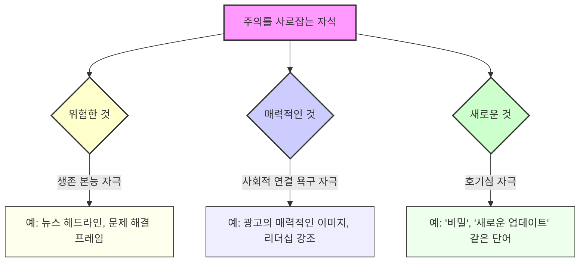
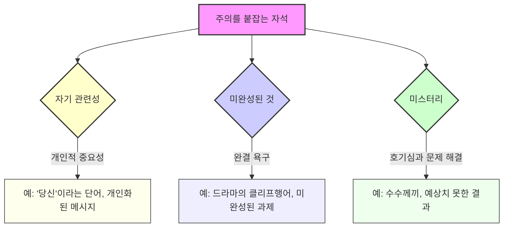
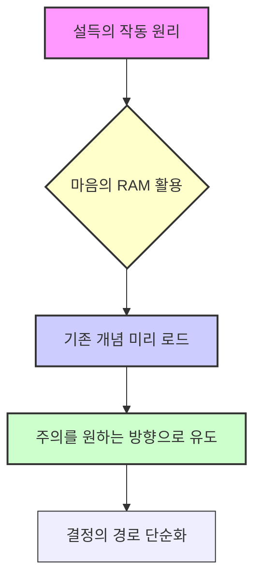
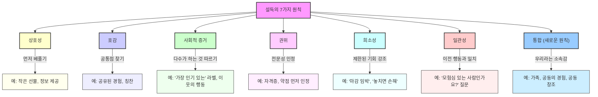

## 로버트 시알디니의 『프리-설득』: 설득의 무대를 미리 준비하는 기술
이 책은 로버트 시알디니의 베스트셀러 『설득의 심리학』의 후속작으로, 설득의 순간이 오기 전에 사람들의 마음을 어떻게 준비시킬 수 있는지 알려준다. 단순히 메시지를 잘 전달하는 것을 넘어, 메시지를 받아들이기 좋은 상태로 만드는 '프리-설득(Pre-Suasion)'의 중요성을 과학적인 연구와 실제 사례를 통해 설명한다. 설득은 우리가 말을 시작하기 훨씬 전부터 시작된다는 것이 이 책의 핵심 메시지이다. 

## 1. 설득의 비밀: 특권의 순간을 만드는 마법 

우리는 보통 누군가를 설득할 때, 어떤 말을 할지, 어떻게 말할지에만 집중하곤 한다. 하지만 이 책은 설득의 진짜 비밀은 말을 하기 직전의 '특권의 순간(Privileged Moment)'을 만드는 데 있다고 말한다. 

1. **특권의 순간이란?**
  - 사람의 마음이 특정 메시지를 아주 잘 받아들일 준비가 되는 짧은 시간이다. 
  - 마치 씨앗을 심기 전에 좋은 흙을 고르는 것과 같다. 좋은 흙에 심어야 씨앗이 잘 자라듯이, 사람의 마음을 미리 준비시켜야 설득이 잘 통한다는 것이다. 

2. **특권의 순간을 만드는 방법**
  - 상대방의 주의를 특정 생각이나 감정으로 이끄는 질문이나 행동을 한다. 
  - 예를 들어, 시알디니는 젊은 시절 손금을 봐주면서 사람들이 자신을 믿고 마음을 열게 되는 '준비된 순간'을 경험했다. 
  - 저자의 컨설턴트 친구는 프로젝트 비용을 말하기 전에 10만 달러 같은 큰 숫자를 먼저 제시해서, 실제 비용에 대한 저항을 줄였다. 
  - 저자 본인도 안식년 협상 때, 부학장이 좋은 조건들을 먼저 제시해서 감사한 마음이 들게 한 후, MBA 강의 요청을 했을 때 거절하기 어려웠다고 한다. 

3. **주의 집중의 중요성**
  - 사람들은 어떤 결정을 내릴 때, 가장 합리적인 정보보다는 그 순간 가장 눈에 띄는 정보에 영향을 받는다. 
  - 예를 들어, 날씨가 좋은 날 데이트 만족도를 더 높게 보고하고, 흐린 날은 낮게 보고하는 것처럼, 날씨와 데이트는 상관없지만 그 순간의 기분이 영향을 준다. 
  - "당신은 모험심이 강한 사람인가요?"라고 물으면, 대부분 "네"라고 답한다. 그 직후 "새로운 음료를 시도해 보시겠어요?"라고 물으면, 모험심이 강한 사람이라는 생각 때문에 더 쉽게 동의하게 된다. 

## 2. 주의 집중의 마법: 마음의 스포트라이트를 비추는 방법 

사람의 뇌는 한 번에 한 가지에만 집중할 수 있는 '병목 현상'이 있다. 그래서 무엇이든 우리의 주의를 사로잡으면, 그것은 실제보다 훨씬 더 중요하게 느껴진다. 

1. **주의 집중은 곧 중요성이다**
  - 노벨상 수상자 대니얼 카너먼은 "인생에서 당신이 생각하는 것만큼 중요한 것은 없다. 당신이 그것에 대해 생각하는 동안에는."이라고 말했다. 
  - 이것은 마치 언론이 무엇을 생각해야 할지 직접 말해주지 않아도, 무엇에 대해 생각해야 할지 알려주는 것과 같다. 
  - 예를 들어, 2000년 뒤셀도르프 폭탄 테러 후, 언론이 '동유럽 이민자'와 '극우주의'를 집중 보도하자, 독일인들의 '극우주의'에 대한 우려가 0%에서 35%로 급증했다가, 보도가 사라지자 다시 줄어들었다. 
  - 9.11 테러 10주년 때도 언론이 관련 보도를 쏟아내자, 9.11을 중요한 사건으로 여기는 비율이 30%에서 65%로 뛰었다가, 기념일이 지나자 다시 줄어들었다. 

2. **마술사의 비밀: 주의를 조종하는 기술**
  - 마술사들은 관객의 주의를 한 손에 집중시켜, 다른 손에서 트릭을 부린다. 
  - 이처럼 설득의 대가들은 단순히 주의를 끄는 것을 넘어, 주의를 원하는 방향으로 이끈다. 
  - 예를 들어, 의학 시술의 '90% 생존율'은 '10% 사망률'보다 훨씬 안심하게 들린다. 사실은 같지만, '생존'에 주의를 집중시키기 때문이다. 
  - 윈스턴 처칠은 덩케르크 철수 후, 패배가 아닌 '용기와 회복력의 기적'으로 상황을 재구성하여 대중의 주의를 희망으로 돌렸다. 
  - 스티브 잡스는 아이폰을 소개할 때, 기술 사양보다는 '세 가지 기기가 하나로 통합된 혁명적인 제품'이라는 점에 주의를 집중시켰다. 

3. **주의를 이끄는 실용적인 방법**
  - 프레젠테이션을 할 때는 가장 중요한 한 가지에 모든 것을 집중시킨다. 
  - 시각적인 단서, 반복, 감정적인 요소를 활용하여 주의를 고정시킨다. 
  - 협상할 때는 가장 강력한 주장을 초반에 강조하고 자주 반복한다. 
  - 이메일을 쓸 때는 제목이 즉시 주의를 끌도록 한다. 
  - 주의는 그냥 생기는 것이 아니라, 의도적으로 만들어야 하는 '무기'와 같다. 

## 3. 원인이 되는 초점: 비난의 대상을 바꾸는 마법 

우리는 어떤 일이 일어났을 때, 가장 눈에 띄는 것에 그 원인을 돌리는 경향이 있다. 이것을 '초점이 원인이다(What's focal is causal)'라고 부른다. 

1. **초점이 원인이 되는 현상**
  - 축구 경기에서 팀이 이기면 쿼터백과 리시버가 영웅이 되지만, 사실 보이지 않는 곳에서 블로킹을 한 공격 라인맨이나 작전을 짠 코치의 역할도 똑같이 중요하다. 하지만 우리의 주의는 눈에 띄는 선수들에게만 집중된다. 
  - 유튜브 영상이 잘 되면, 카메라에 나오는 내가 칭찬을 받지만, 사실은 편집자, 리서처, 썸네일 디자이너 등 보이지 않는 팀원들의 노력이 더 크다. 
  - 경찰 심문 연구에서, 카메라가 용의자에게만 집중되면 사람들은 자백이 진실이라고 믿었고, 카메라가 형사에게 집중되면 자백이 강요된 것이라고 믿었다. 카메라 각도만 바뀌었을 뿐인데, 원인과 결과에 대한 인식이 완전히 달라진 것이다. 

2. **초점을 활용하여 문제 해결 및 책임 분배하기**
  - 팀 프로젝트가 지연될 때, 나쁜 관리자는 "왜 이렇게 늦어지고 있나요?"라고 팀원들을 비난한다. 이때 초점은 '팀원들'이 되고, 팀원들은 방어적으로 변한다. 
  - 하지만 현명한 리더는 "우리가 쓰는 소프트웨어가 하루에 두 번씩 멈춘다니 정말 답답하겠네요. 이 문제 때문에 우리가 어려움을 겪고 있어요."라고 말한다. 이때 초점은 '소프트웨어'가 되고, 팀원들은 문제의 희생자가 되어 리더와 함께 해결책을 찾으려 한다. 
  - 새로운 컴퓨터 구매를 설득할 때, 컴퓨터 가격을 먼저 말하는 대신, 오래된 컴퓨터 때문에 낭비되는 생산성에 초점을 맞춘다. 그러면 오래된 컴퓨터가 문제의 원인이 되고, 새 컴퓨터는 해결책이 된다. 
  - 성공적인 프로젝트에 대한 공로를 인정받고 싶다면, 최종 보고서에 이름만 올리는 것이 아니라, 자신이 기여한 독특한 부분에 스포트라이트를 비춘다. 

3. **핵심 요약**
  - 사람들이 어떤 일의 원인을 어떻게 이해하는지에 영향을 미칠 수 있다. 
  - 신용을 부여하거나 문제를 해결할 때, 강조하고 싶은 특징에 정신적인 스포트라이트를 비춘다. 
  - 그것을 초점으로 만들면, 뇌는 자동으로 그것을 원인으로 연결한다. 

## 4. 주의를 사로잡는 세 가지 자석: 위험, 매력, 새로움 

우리는 매일 수많은 자극 속에서 살고 있다. 이 혼란 속에서 우리의 메시지가 주목받으려면, 뇌가 본능적으로 반응하는 '주의 사령관(Commanders of Attention)'을 활용해야 한다. 시알디니는 이를 '끌어당기는 것들(Attractors)'이라고 부르며, 세 가지 주요 요소가 있다. 

1. **위험한 것 (The Dangerous)**
  - 숲을 걷다가 나뭇가지 부러지는 소리를 들으면, 모든 신경이 그 소리에 집중된다. 생존 본능이 작동하기 때문이다. 
  - 뉴스는 위기, 갈등, 재앙에 대한 헤드라인을 내세워 우리의 주의를 끈다. "주식 시장이 폭락하고 있다"는 "주식 시장이 정상적으로 움직이고 있다"보다 훨씬 클릭률이 높다. 
  - **윤리적 활용:** 공포를 조장할 필요는 없다. 메시지를 문제 해결이나 위험 회피에 초점을 맞춰 구성한다. 
  - "공부 습관을 개선하는 방법" (약함) → "공부 망치는 최악의 실수" (강함) 
  - "새로운 프로젝트 관리 시스템 제안" (약함) → "주당 10시간을 낭비하는 워크플로우 병목 현상 분석" (강함) 
  - **주의:** 위협적인 메시지는 명확하고 실행 가능한 해결책을 함께 제시해야 효과적이다. 그렇지 않으면 사람들은 현실을 부정하거나 회피하게 된다. 

2. **매력적인 것 (The Attractive)**
  - 성적인 매력은 강력한 주의 집중 요소이다. 광고에서 자동차 옆에 슈퍼모델을 세우는 것만이 아니다. 
  - 사람들은 자신을 더 매력적이고, 존경받고, 다른 사람들과 연결되게 만드는 것에 깊은 관심을 갖는다. 
  - 스킨케어 광고는 깨끗한 피부뿐만 아니라, 그로 인해 얻는 자신감을 판매한다. 대중 연설 강좌는 의사소통 기술뿐만 아니라, 리더로 인정받는 능력을 판매한다. 
  - **주의:** 성적인 매력은 제품과 관련성이 있을 때 효과적이다. 세제나 주방용품 같은 중립적인 제품에는 오히려 역효과를 낼 수 있다. 

3. **새로운 것 (The Novel)**
  - 새로운 알림을 확인하고 싶은 충동은 '새로움'에 대한 우리의 호기심 때문이다. 
  - 새로운 정보, 아이디어, 기기는 잠재적인 기회나 위협을 알리므로, 우리는 이를 평가해야 한다고 느낀다. 
  - '비밀'이나 '새로운 업데이트' 같은 단어가 제목에서 강력한 이유이다. 
  - **활용:** 메시지를 새로운 발견으로 구성한다. 
  - "방금 제가 생각하는 방식을 완전히 바꾼 것을 배웠습니다." 
  - "어떤 사람들은 성공하고 어떤 사람들은 실패하는 이유가 있습니다. 그리고 그것은 당신이 생각하는 것이 아닙니다." 
  - "업데이트: 이 문제에 접근해야 하는 새로운 방법입니다." 
  - **주의:** 너무 많은 새로움이나 끊임없는 장면 전환은 오히려 혼란과 짜증을 유발하여 설득력을 떨어뜨릴 수 있다. 

## 5. 주의를 붙잡는 세 가지 자석: 자기 관련성, 미완성, 미스터리 

주의를 끄는 것은 시작에 불과하다. 일단 주의를 사로잡았다면, 이제는 그 주의를 계속 붙잡아 두는 것이 중요하다. 이를 '자석(Magnetizers)'이라고 부르며, 세 가지 강력한 요소가 있다. 

1. **자기 관련성 (**Self-Relevance**)**
  - 세상에서 가장 흥미로운 주제는 바로 '나 자신'이다. 사람들은 자신과 관련된 것에 본능적으로 끌린다. 
  - 단체 사진을 보면 우리는 자신의 얼굴을 가장 먼저 찾고 가장 오래 본다. 
  - 메시지를 개인화하면 더 많은 주의를 끌고, 더 오래 기억되며, 더 자주 참고된다. 
  - 예를 들어, "사람들은 시간 관리를 잘해야 한다" 대신 "당신이 하루 한 시간을 되찾는 방법"이라고 말한다. 
  - '당신(You)'이라는 단어는 강력한 자석이다. 
  - **주의:** 메시지가 강력하면 효과가 증폭되지만, 제품이나 메시지가 약하면 오히려 역효과를 낼 수 있다. 

2. **미완성된 것 (The Unfinished)**
  - 우리의 뇌는 미완성된 과제나 해결되지 않은 이야기에 대해 강한 불편함을 느낀다. 이것을 '자이가르닉 효과(Zyronac effect)'라고 한다. 
  - 드라마 제작자들은 매 에피소드를 클리프행어(Cliffhanger)로 끝내서 시청자들이 다음 회를 기다리게 만든다. 
  - **활용:**
  - 이메일에서 "현재 전략에 세 가지 치명적인 실수가 있습니다. 첫 번째는..."이라고 시작하면, 사람들은 나머지 두 가지를 듣고 싶어 할 것이다. 
  - 프레젠테이션에서 "해결책은 잠시 후에 말씀드리겠지만, 먼저 문제가 시작된 놀라운 이유를 이해해야 합니다."라고 말한다. 
  - 이야기를 할 때는 결말부터 시작한다. "제가 신발 한 짝만 신고 CEO에게 프레젠테이션을 하게 된 이야기를 해드릴게요. 모든 것은 일주일 전에 시작되었죠." 

3. **미스터리 (The Mystery)**
  - 사람들은 수수께끼를 좋아한다. 미스터리는 우리의 호기심을 자극하고, 해결책을 찾고 싶게 만든다. 
  - 결론을 바로 제시하는 대신, 결론으로 이어지는 퍼즐을 제시한다. 
  - **활용:**
  - "마케팅 캠페인 A에 투자해야 합니다" 대신 "캠페인 A와 B는 예산과 팀이 같았는데, 왜 캠페인 A가 10배의 수익을 냈을까요? 함께 파헤쳐 봅시다."라고 말한다. 
  - 이렇게 하면 지루한 설명이 흥미로운 탐정 이야기로 바뀐다. 
  - 청중은 단순히 듣는 것이 아니라, 발견의 여정에 동참하게 된다. 

## 6. 보이지 않는 연결고리: 연상의 힘 

우리의 뇌는 정보를 개별적으로 처리하지 않고, 서로 연결하고 분류하며 저장한다. 이것을 '연상(Association)'이라고 한다. 

1. **연상이 작동하는 방식**
  - 특정 냄새가 어린 시절을 떠올리게 하고, 특정 노래가 감정을 불러일으키는 것이 바로 연상 때문이다. 
  - 시알디니의 연구에서, 구름 낀 하늘 이미지를 본 사람들은 재정 기부에 더 동의하는 경향을 보였다. 구름이 무의식적으로 차분함과 안정감을 불러일으켜 위험 회피 성향을 줄였기 때문이다. 
  - 와인 가게에서 프랑스 음악을 틀면 프랑스 와인 판매가 늘고, 독일 음악을 틀면 독일 와인 판매가 늘었다. 손님들은 음악 때문에 와인을 샀다는 것을 인지하지 못했지만, 음악이 무의식적으로 '프랑스적임'이나 '독일적임'을 연상시켰기 때문이다. 

2. **브랜딩과 **연상
  - 코카콜라는 수십 년간 행복, 우정, 축하와 제품을 연관시키기 위해 수십억 달러를 썼다. 음료 자체는 설탕물에 불과하지만, 이러한 연상 덕분에 전 세계 수십억 명의 마음속에 특별한 의미를 갖게 되었다. 
  - 롤렉스나 메르세데스-벤츠 같은 명품 브랜드는 단순히 시계나 자동차를 파는 것이 아니라, 지위, 탁월함, 세련됨이라는 연상을 판매한다. 
  - 이러한 연상은 우연이 아니라, 이미지, 메시지, 일관된 감정적 자극을 통해 세심하게 설계되고 강화된다. 

3. **연상을 활용하는 방법**
  - **언어:** SSM 헬스케어 시스템은 '총알(bullet points)', '문제 공격(attack a problem)' 같은 군사적 표현을 '정보(information points)', '문제 접근(approach a problem)' 같은 진보적 표현으로 바꿨다. 이러한 언어 변화는 직원들의 행동에 긍정적인 영향을 미쳤다. 
  - **은유:** 범죄를 '도시를 황폐화시키는 야수'로 묘사하면, 야수를 잡고 가두는 것과 같은 강력한 조치에 대한 지지를 높인다. 
  - **물리적 감각:** 무거운 클립보드에 붙은 이력서를 평가하면 후보자를 더 중요하게 생각하고, 따뜻한 커피를 들고 있으면 상대방을 더 친근하게 느낀다. 
  - **자기 자신:** 사람들은 자신과 닮은 사람에게 끌린다. 코카콜라가 병에 흔한 이름을 인쇄하여 제품을 개인적인 것으로 만든 것처럼, 공통점을 강조하면 친밀감을 높일 수 있다. 
  - **처리 용이성:** 대칭적이고 친숙한 얼굴, 발음하기 쉬운 이름, 읽기 쉬운 글꼴은 신뢰감을 준다. 복잡한 이름이나 읽기 어려운 글꼴은 의심을 불러일으킨다. 

4. **핵심 요약**
  - 모든 메시지는 의도했든 안 했든 연상을 불러일으킨다. 
  - 메시지 주변의 음악, 이미지, 단어, 환경을 의도적으로 조작하여 긍정적이고 관련성 있는 연상을 만든다. 
  - 연상을 통제하면, 이야기를 통제할 수 있다. 

## 7. 설득의 무대: 설득적 지리 

설득은 진공 상태에서 이루어지지 않는다. 물리적, 심리적 공간은 설득의 힘을 억누르거나 증폭시킬 수 있다. 시알디니는 이를 '설득적 지리(Persuasive Geographies)'라고 부른다. 

1. **환경이 설득에 미치는 영향**
  - 저자는 특정 책상에서 글이 더 잘 써지는 것을 느꼈다. 환경 자체가 집중력을 높여주기 때문이다. 
  - 한 회사는 회의실에 잠재 고객의 사진을 걸어두는 것만으로 직원들의 성과를 향상시켰다. 사진은 무의식적으로 고객의 필요에 주의를 돌리게 했다. 
  - 대학 기금 모금원들이 일반 사무실에서 전화했을 때보다 대학 강의실에서 전화했을 때 기부율이 훨씬 높았다. 강의실이라는 환경이 '학생'이라는 정체성을 다시 활성화시켜, 대학에 대한 긍정적인 경험과 기억을 떠올리게 했기 때문이다. 

2. **환경을 활용하여 원하는 분위기 조성하기**
  - **창의성과 협업:** 긴 직사각형 테이블에 마주 앉는 대신, 둥근 테이블에 앉거나 화이트보드를 보며 나란히 앉는다. 이는 경쟁보다는 팀워크와 문제 해결을 유도한다. 
  - **어려운 대화:** 사무실을 벗어나 편안하고 따뜻한 공간에서 대화한다. 커피숍의 물리적인 따뜻함은 사람들을 감정적으로 더 따뜻하고 수용적으로 만들 수 있다. 
  - 권위**:** 유튜브 스튜디오에 책을 가득 채워 놓는 것은 지식과 학습이라는 연상을 미리 심어준다. 
  - **주의:** 환경은 단순한 배경이 아니라, 대화의 적극적인 참여자이다. 

3. **핵심 요약**
  - 메시지를 전달할 때, 어떤 말을 할지뿐만 아니라 '어디서' 말할지도 중요하다. 
  - 물리적, 심리적 환경을 설득 목표에 맞춰 최적화하여 강력한 '홈그라운드 이점'을 확보한다. 

## 8. 설득의 작동 원리: 마음의 RAM을 활용하는 방법 

설득은 마법이 아니라, 우리의 뇌가 작동하는 방식에 대한 이해를 바탕으로 한 '메커니즘'이다. 

1. **마음의 RAM 비유**
  - 우리의 의식적인 주의(conscious attention)는 컴퓨터의 RAM(단기 기억 장치)과 같다. 빠르고 강력하지만 용량이 매우 제한적이다. 한 번에 몇 가지 프로그램만 실행할 수 있다. 
  - 나머지 지식, 기억, 가치관은 하드 드라이브(장기 기억 장치)에 저장되어 있다. 모두 존재하지만, 즉시 접근할 수는 없다. 
  - 설득은 새로운 거대한 프로그램을 설치하려 하지 않는다(사람의 신념 체계를 바꾸려 하지 않는다). 대신, 하드 드라이브에 있는 작고 기존의 프로그램을 RAM에 조용하고 능숙하게 미리 로드한다. 
  - 예를 들어, "당신은 모험심이 강한 사람인가요?"라고 물으면, 뇌는 '모험심이 강한 나'라는 파일을 RAM에 로드한다. 그 상태에서 "새로운 음료를 시도해 보시겠어요?"라고 물으면, 뇌는 이미 로드된 프로그램을 사용하여 쉽게 결정한다. 
  - 즉, 설득은 원하는 개념을 일시적으로 쉽게 접근할 수 있도록 만들어, 뇌가 따르기 쉬운 '최소 저항의 경로'를 만드는 것이다. 

2. **윤리적 사용의 중요성**
  - 이러한 메커니즘을 이해하면 그 강력함을 알 수 있지만, 동시에 '조작적인 사람'이 되지 않도록 윤리적인 가이드라인이 필요하다. 
  - 설득은 나중에 후회할 일을 하도록 속이는 것이 아니다. 
  - 비윤리적인 설득은 거짓말 위에 사업을 짓는 것과 같아서, 단기적으로는 성공할지 몰라도 결국 무너지고 평판과 관계를 망친다. 
  - **조직의 비윤리적 행위가 가져오는 세 가지 문제 (삼중 종양 구조)** 
  - **유인 (Attraction):** 부정직한 관행은 속이려는 의지가 있는 직원을 끌어들인다. 
  - **유지 (Retention):** 부정직함을 용인하거나 보상하는 조직은 내부에서 회사를 속일 가능성이 가장 높은 직원을 유지하게 된다. 
  - **부담 (Strain):** 고객을 오도하도록 압력을 받는 직원들은 도덕적 스트레스를 겪고, 이는 피로, 번아웃, 높은 이직률로 이어진다. 
  - 윤리적인 설득의 목표는 환상을 만드는 것이 아니라, '진실을 밝히는 것'이다. 
  - 메시지의 진정으로 좋고, 가치 있고, 중요한 점을 찾아 능숙하게 부각시키는 것이다. 

## 9. 설득의 6가지 고속도로와 새로운 7번째 원칙: 통합 

시알디니는 그의 이전 저서 『설득의 심리학』에서 6가지 설득 원칙을 제시했지만, 『프리-설득』에서는 새로운 7번째 원칙인 '통합(Unity)'을 추가했다. 이 원칙들은 우리의 뇌가 결정을 더 빨리 내리도록 돕는 '심리적 고속도로'와 같다. 

1. 상호성** (**Reciprocation**)** 
  - **원칙:** 사람들은 자신에게 먼저 베푼 사람에게 보답하려는 의무감을 느낀다.
  - **활용:** 요청하기 전에 진정성 있고 예상치 못한 가치를 먼저 제공한다.
  - 회의 전에 작은 선물, 유용한 정보, 커피를 사주는 것은 상대방의 뇌가 친절에 보답할 방법을 찾도록 준비시킨다.
  - 저자의 콘텐츠 제작 철학은 99%의 좋은 콘텐츠를 무료로 제공하는 것이다. 그러면 상호성 원칙이 수년간 준비된다.
  - 호텔에서 수건 재사용률을 높이기 위해, 손님을 대신해 환경 단체에 기부했다고 알리자 재사용률이 47% 증가했다.

2. 호감** (Liking)** 
  - **원칙:** 우리는 알고 좋아하는 사람의 요청에 더 쉽게 동의한다.
  - **활용:** 대화를 시작하기 전에 진정한 공통점을 찾고 강조한다.
  - "당신도 케임브리지 출신이시군요!" 또는 "골든 리트리버 사진이네요! 저도 키워요."와 같이 공유된 정체성이나 진심 어린 칭찬에 주의를 집중시킨다.
  - 그러면 이후의 대화는 따뜻한 연결의 렌즈를 통해 걸러진다.

3. 사회적 증거** (**Social Proof**)** 
  - **원칙:** 우리는 다른 사람들이 많이 하는 행동을 더 올바르다고 생각한다.
  - **활용:** 아이디어를 제시하기 전에, 동료들이 이미 하고 있는 것에 주의를 돌린다.
  - "이 소프트웨어를 사용해야 합니다" 대신 "우리 경쟁사 세 곳이 모두 새로운 소프트웨어 플랫폼으로 전환했습니다."라고 말한다.
  - 그러면 당신의 아이디어는 안전하고, 인기 있고, 올바른 선택처럼 보인다.
  - 베이징 식당에서 '가장 인기 있는'이라고 표시된 요리는 주문이 13~20% 증가했다.

4. 권위** (Authority)** 
  - **원칙:** 우리는 합법적인 권위에 복종해야 할 깊은 의무감을 느낀다.
  - **활용:** 다른 사람이 당신의 전문성을 인정하게 하거나, 당신이 주장을 하기 전에 미묘하게 전문성을 드러낸다.
  - 의사는 진단을 내리기 전에 벽에 졸업장을 걸어둔다. 졸업장이 설득을 하는 것이다.
  - 생산성 조언을 하기 전에, 의사 시절의 관련 이야기를 언급하는 것은 권위 채널을 미리 준비시켜 조언이 더 큰 무게를 갖게 한다.
  - 신뢰를 얻는 역설적인 방법은 강점을 제시하기 전에 약점을 인정하는 것이다. 폭스바겐이 비틀을 '못생겼지만 믿을 수 있는' 차라고 부른 것처럼 말이다.

5. 희소성** (**Scarcity**)** 
  - **원칙:** 우리는 가용성이 제한된 것을 더 매력적으로 생각한다.
  - **활용:** 기회를 제시하기 전에, 사람들이 행동하지 않으면 무엇을 잃을지에 주의를 집중시킨다.
  - "이 강좌는 1년에 한 번만 수강 신청을 받으며, 금요일에 마감됩니다."라고 말하면, 희소성이 지배적인 생각이 된다.
  - 그러면 강좌의 가치는 더 높게 인식된다.
  - 폐업을 발표한 컵케이크 가게의 컵케이크는 개당 4달러에서 250달러로 팔렸다.

6. 일관성** (**Consistency**)** 
  - **원칙:** 우리는 이미 말하거나 행동한 것과 일관성을 유지하려는 강력한 욕구가 있다.
  - **활용:** 요청하기 전에, 상대방이 특정 가치를 긍정하도록 질문한다.
  - "당신은 모험심이 강한 사람이라고 생각하나요?" 또는 "환경 보호가 당신에게 중요한가요?"
  - "네"라고 답하면, 그들의 뇌는 일관성 고속도로가 활짝 열린다.
  - 이후에 새로운 제품을 시도하거나 환경 단체에 기부하라는 요청은 그들의 진술된 자아상과 일관성을 유지하는 방법이 된다.

7. 통합** (**Unity**): 새로운 7번째 원칙** 
  - **원칙:** 단순한 호감을 넘어, '우리(We)'라는 깨지지 않는 소속감을 만드는 것이다.
  - **호감과의 차이:** 호감은 애정(나는 당신이 좋다)에 가깝지만, 통합은 정체성(당신은 나다)에 가깝다. 
  - 통합이 존재할 때, 사람들은 단순히 동의하거나 협력하는 것을 넘어, 마치 자신의 살점을 지키듯이 서로를 위해 희생하고 보호한다. 

- **통합을 만드는 핵심 요소**
  - **혈연 (**Kinship**):** 가장 강력하고 원초적인 형태의 통합이다. 가족을 돕는 것은 비용-편익 분석을 하지 않는 본능적인 행동이다. 
  - 학생들에게 부모가 설문조사를 작성하면 시험 점수를 추가해 준다고 하자, 97%의 부모가 응했다.
  - '형제', '자매', '조국' 같은 단어를 사용하여 가상의 가족을 만들 수도 있다. 
  - **공유된 장소 (Shared Place):** 같은 고향, 같은 학교, 같은 나라 출신이라는 점은 강력한 유대감을 형성한다. 
  - 케임브리지 의대 동문은 서로에게 즉각적인 주의를 기울이고, 조언이나 연결을 요청하면 기꺼이 돕는다. 
  - 2차 세계대전 중 일본 외교관 스기하라 지우네는 리투아니아에서 수천 명의 유대인 난민에게 비자를 발급했는데, 이는 '인간'이라는 공유된 정체성에 대한 그의 연민 때문이었다. 
  - **함께 행동하기 (Acting Together):** 사람들이 함께 움직이고, 노래하고, 창조할 때 '우리'라는 깊은 감각이 형성된다. 
  - 의대생들이 밤샘 공부를 함께하며 복잡한 내용을 이해하려고 애쓸 때, 개인에서 '하나의 다중 뇌 유기체'가 되어 시험을 이기려 했다. 
  - 사람들이 단순히 다른 사람과 손가락을 맞춰 두드리는 것만으로도, 그 사람에게 더 도움이 되고 협력적이 될 가능성이 훨씬 높다. 
  - 공동 창조** (Co-creation):** 아이디어에 대한 동의를 얻어야 할 때, 완성된 결과물을 제시하는 대신, '함께 만들어가는 과정'을 제안한다. 
  - "완성된 계획입니다" 대신 "아이디어의 시작 단계인데, 함께 만들어 주셨으면 합니다."라고 말한다.
  - 그러면 상대방은 수동적인 평가자가 아니라, 적극적인 공동 창조자가 된다.
  - 그들이 아이디어를 기여하면, 그 계획은 더 이상 당신의 계획이 아니라 '우리의 계획'이 된다. 사람들은 자신의 아이디어를 옹호하고 성공시키기 위해 투자한다. 
  - 이것은 그들을 설득하는 것이 아니라, 스스로 설득하도록 만드는 것이다. 

## 10. 설득의 지속성: '예스'를 영원히 만드는 방법 

설득을 통해 '예스'를 얻어냈다고 해서 끝이 아니다. 일시적인 동의를 지속적인 변화로 만들려면 '프리-설득'만큼이나 '포스트-설득(Post-Suasion)'이 중요하다. 

1. **약속 (**Commitment**)의 힘**
  - 사람이 어떤 행동을 하도록 유도되면, 특히 눈에 띄거나 노력이 필요한 행동이라면, 그 행동은 정체성을 재구성하고 충성심을 강화한다. 행동이 신념에 앞서는 것이다. 
  - **의료 예약 사례:** 단순히 전화로 예약 알림을 주는 것보다, 환자 스스로 다음 예약 시간을 적게 하는 작은 자발적인 행동이 예약 불이행률을 18%나 줄였다. 
  - **정체성 관련 행동:** 최저 임금 인상과 같은 사회적 포용 정책에 설득된 사람이 자발적으로 상당한 기부를 한다면, 그 행동은 그들의 자아 개념 속에 깊이 뿌리내려 선호도를 강화한다. 

2. **결정을 지속시키는 세 가지 방법**
  - **능동적으로 만들기 (Make it active):** 수동적인 고개 끄덕임으로는 부족하다. 즉시 작고 물리적인 행동을 취하게 한다. 
  - 회의에 동의하는 것뿐만 아니라, 즉시 휴대폰을 꺼내 일정에 추가하게 한다.
  - 새로운 전략에 동의하는 것뿐만 아니라, 첫 번째 실행 항목을 직접 적게 한다.
  - 고객이 제품을 구매하면 보증 카드를 작성하게 한다. 자신의 이름과 세부 정보를 쓰는 행위가 구매를 더 구체적이고 자신의 것으로 느끼게 한다.
  - **공개적으로 만들기 (Make it public):** 우리는 다른 사람들에게 일관성 있게 보이려는 강한 욕구가 있다. 결정을 공개적으로 선언하면, 내적, 외적 압력을 받아 그 결정을 지키려 한다. 
  - 팀이 새로운 워크플로우에 동의하면, 누군가 그룹 이메일로 그 결정을 요약하게 한다. 그러면 그것은 공개 기록이 된다.
  - 친구가 5K 마라톤에 참가하기로 약속하면, 소셜 미디어에 게시하도록 격려한다. 그러면 친구는 자신의 소셜 서클 전체를 책임 파트너로 삼게 된다.
  - **자발적으로 만들기 (Make it voluntary):** 약속이 지속되려면, 사람들은 자신이 결정을 내렸다고 느껴야 한다. 
  - 상대방이 동의한 후, "이것이 좋은 방향이라고 생각하시고, 기꺼이 참여해 주셔서 정말 감사합니다."라고 말한다.
  - 이는 그들의 결정이 당신이 강요한 것이 아니라, 그들 스스로 내린 결론임을 강화한다.

3. **핵심 요약**
  - 설득 도구는 진정한 가치를 밝히는 데만 사용해야 한다. 당신의 진실성은 가장 큰 자산이다. 
  - '예스'를 얻은 후에도, 능동적이고, 공개적이며, 자발적인 약속을 즉시 확보하여 일시적인 동의가 의미 있는 장기적인 변화로 이어지도록 해야 한다. 

