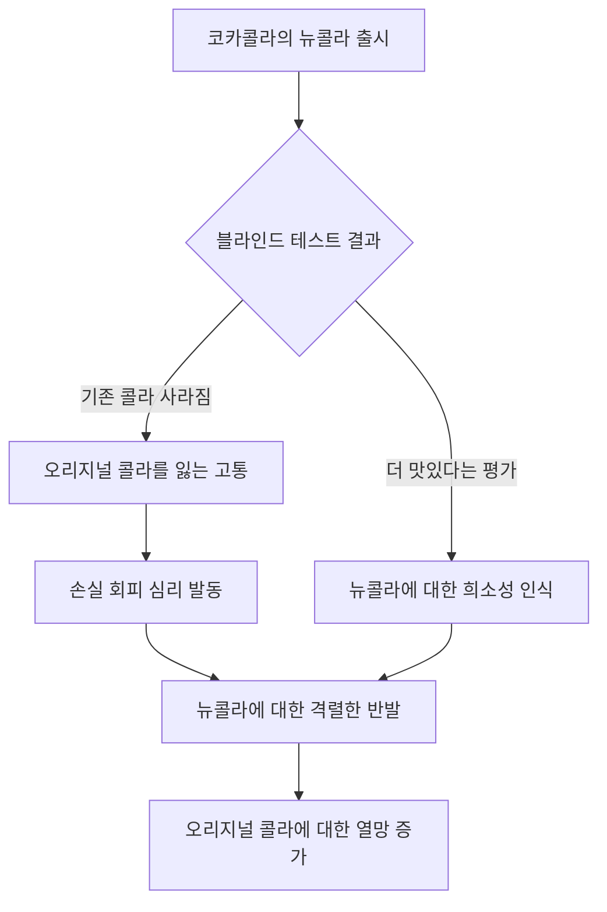
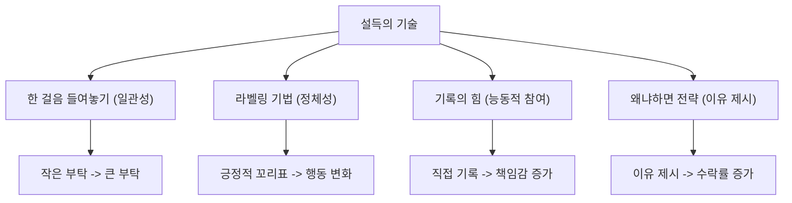

## 설득의 심리학 3: YES를 끌어내는 60가지 설득 비밀
이 책은 사람들이 왜 논리적이지 않은 상황에서도 '예스'라고 대답하게 되는지, 그 숨겨진 심리적 스위치들을 과학적인 연구를 통해 파헤친다. 설득의 기술을 단순히 나열하는 것을 넘어, 인간 심리의 흥미로운 단축키(휴리스틱)들을 이해하고 이를 어떻게 활용하거나 방어할 수 있는지 알려준다. 작은 변화가 어떻게 큰 영향력을 만들어내는지 다양한 사례와 함께 설명하며, 일상생활과 비즈니스에서 설득력을 높이는 실용적인 전략들을 제시한다.

## 1. 일관성의 원칙: 한 걸음의 놀라운 마력 

사람들은 자신이 한 번 정한 태도나 입장을 계속 유지하려는 강한 욕구를 가지고 있다. 마치 한 번 발을 들여놓으면 다음 발걸음을 내딛기가 훨씬 쉬워지는 것과 같다.

1. **'한 발 들이밀기 전략' (**Foot-in-the-door technique**)** 
  - 처음에는 아주 작은 부탁을 들어주게 만들면, 나중에는 훨씬 더 큰 부탁도 쉽게 수락하게 되는 심리적 현상이다.
  - **사례 1: 안전 운전 표지판 설치** 
  - 부자 동네 주민들에게 잔디밭에 가로 2m, 세로 1m의 큰 '안전 운전' 표지판을 세워달라고 요청했을 때, 단 1%만이 동의했다.
  - 하지만 2주 전에 '창문 앞에 안전 운전자가 돼 주세요'라는 작은 스티커를 붙여달라고 먼저 요청하고, 거의 모든 주민이 동의하게 만들었다.
  - 2주 후, 같은 주민들에게 큰 표지판 설치를 요청했더니 무려 76%가 동의했다.
  - 주민들은 작은 요청에 동의하면서 스스로를 '안전 운전이라는 가치 있는 일에 동참하는 의식 있는 시민'이라고 생각하게 되었고, 이 이미지에 일관적으로 행동하려 했다.
  - **사례 2: 세일즈 분야** 
  - 빈틈없는 세일즈 전문가는 "먼저 작은 주문으로 시작하라"고 조언한다.
  - 전체 제품군 유통 계약을 맺기 위한 포석으로, 고객이 작은 상품이라도 주문하게 만들면 그 고객은 더 이상 잠재 고객이 아니라 '진짜 고객'이 된다.
  - 아주 작은 첫 주문이라도 성사시키면, 고객은 스스로를 그 회사의 고객으로 인식하고 다음 구매에 더 쉽게 동의한다.
  - **사례 3: 마케팅 조사** 
  - 관심 없는 잠재 고객에게 일단 10분만 시간을 내달라고 요청하거나, 간단한 설문 조사에 응할 의사가 있는지 물어보는 식으로 작은 한 걸음을 내딛게 한다.
  - 이렇게 하면 나중에 수많은 문항에 답하도록 유도하기가 훨씬 수월해진다.
  - **사례 4: 가정 방문 조사** 
  - 집주인들에게 집에 연구원 4~5명이 2~3시간 머물며 모든 물건을 열거하고 분류하는 매우 불편한 요청을 했을 때, 22%만이 동의했다.
  - 하지만 3일 전에 '가정에서 헝겊을 사용하는지에 관한 설문 조사'에 응해달라는 작은 요청을 먼저 하고 대다수가 동의하게 만들었다.
  - 이후 더 큰 요청을 받은 주민들 중 약 53%가 동의했다.
  - **사례 5: 아이들과 우리 자신** 
  - 숙제를 하지 않거나 방을 치우지 않는 아이들에게 '잠깐 동안 숙제를 같이 하자'거나 '아끼는 장난감을 다 가지고 놀면 상자에 다시 갖다 놓으라'는 작은 요청을 먼저 한다.
  - 아이들이 강제가 아닌 자발적으로 작은 부탁에 동의하면, 더 열심히 공부하거나 집을 더 깨끗하게 유지할 가능성이 커진다.
  - 우리 자신에게도 정복할 수 없어 보이는 큰 목표보다 '집 앞을 가볍게 산책하는' 아주 작은 과제를 부여하고 실천하면, 결국 더 큰 목표를 달성하게 된다.
  - 공자의 "천리길도 한 걸음부터"라는 말처럼, 먼저 소파에서 몸을 일으키는 것에서 시작하는 것이 중요하다.
2. 라벨링 전략** (**Labeling** technique): 상대방을 내 뜻대로 움직이는 꼬리표 붙이기** 
  - 상대방에게 어떤 특성, 태도, 신념과 같은 긍정적인 '꼬리표(라벨)'를 붙인 다음, 그 라벨에 어울리는 행동을 요구하는 전략이다.
  - 칭찬과는 조금 다르다. 칭찬은 과거 행동에 대한 것이지만, 라벨링은 그 사람의 내적인 특성이나 정체성에 호소하는 방식이다.
  - **사례 1: 스타워즈의 **루크 스카이워커 
  - 루크는 다스베이더에게 "난 당신 안에 아직 선함이 남아 있다는 걸 알아. 난 느낄 수 있어"라고 말하며, 그에게 '선함'이라는 라벨을 붙였다.
  - 이 단순한 말로 다스베이더가 밝은 쪽으로 넘어오게 설득할 수 있었다.
  - **사례 2: 선거 **투표율** 높이기** 
  - 유권자들에게 "당신은 평균적인 사람들보다 투표 및 정치적 행사에 참여할 가능성이 높은 시민"이라고 말해 '훌륭한 시민'이라는 라벨을 붙였다.
  - 이 라벨이 붙여진 유권자들은 평균적인 시민이라는 라벨이 붙여진 사람들보다 자신을 더 나은 시민으로 생각했고, 실제로 일주일 후 투표율이 15% 더 높았다.
  - **사례 3: 팀원 동기 부여** 
  - 프로젝트 때문에 힘들어하는 팀원에게 그가 얼마나 열심히 끈기 있게 노력하는 사람인지 일깨워주고, 과거에 비슷한 과제를 성공적으로 마무리했었다는 사실을 상기시켜 '유능한 사람'이라는 라벨을 붙여준다.
  - **사례 4: 아이들의 글씨 연습** 
  - 교사가 아이들에게 "글씨를 잘 쓰는 일에 관심이 많구나"라고 말했더니, 아이들이 쉬는 시간에도 열심히 글씨 연습을 하는 것을 발견했다. 심지어 보는 사람이 없을 때도 마찬가지였다.
  - **사례 5: 항공사 고객 신뢰** 
  - 항공사 승무원이 비행을 마치며 "여러분께서 선택할 항공사가 많다는 것을 알고 있습니다. 그럼에도 저희를 선택해 주셔서 감사합니다"라고 말하는 것은, 고객에게 '현명한 선택을 한 사람'이라는 라벨을 암시한다.
  - 이는 고객이 스스로 자신의 선택과 항공사에 대해 더 큰 신뢰를 느끼게 만든다.
  - **사례 6: 질문을 통한 라벨링 효과** 
  - 도움을 요청하기 전에 "당신은 남을 잘 도와주는 사람입니까?"라고 질문하는 것만으로도 부탁을 들어줄 확률이 299%에서 77%로 높아졌다.
  - 상대방에게 직접 '이 라벨이 당신에게 맞느냐'고 물어봄으로써 스스로 그 라벨에 맞는 행동을 하도록 유도하는 것이다.
  - **주의사항** 
  - 이 전략은 '어둠의 세력'에 휩쓸리게 하는 데도 똑같이 매력적일 수 있으므로, 도덕적이고 윤리적으로 사용해야 한다.
  - 라벨은 그 사람의 타고난 능력, 경험, 성격을 정확히 반영할 때만 사용해야 한다.
3. **말한 대로 행동하게 하라: 약속의 힘** 
  - 사람들은 바람직한 행동을 할 것이라고 공개적으로 말한 후에는, 그 말한 대로 행동해야 한다는 부담감을 느낀다.
  - **사례 1: 선거 투표율 높이기** 
  - 선거일 하루 전 유권자들에게 '투표할 것인가'라고 물어보고, 그렇게 대답한 이유를 말해달라고 요청했다.
  - 질문을 받은 사람들의 투표율은 질문을 받지 않은 사람들보다 25.2% 더 높았다.
  - 사람들은 사회적으로 인정받는 행동(투표)에 참여할 것이라고 대답해야 한다는 부담을 느끼고, 공개적으로 말한 후에는 그 약속을 지키려 한다.
  - **사례 2: 식당 **노쇼**(**No-show**) 줄이기** 
  - 식당 주인이 예약 전화를 받는 직원의 말을 살짝 바꾼 것만으로 노쇼 비율을 30%에서 10%로 줄였다.
  - 원래는 "예약을 취소해야 할 일이 있으면 꼭 전화 주세요"라고 말했지만, "예약을 취소해야 할 일이 생기면 전화 주시겠습니까?"라고 질문형으로 바꿨다.
  - 고객들이 "예"라고 대답하고 전화를 끊게 되면, 그들은 약속을 지켜야 할 것 같다는 의무감을 느꼈다.
  - **약속을 굳건히 하는 요소** 
  - 약속은 자발적이고 능동적이며 공개적으로 이루어져야 한다.
  - 예를 들어, 선거 운동원이 유권자에게 "투표하시는 걸로 기록해두고 다른 사람들에게도 이 사실을 알리겠습니다"라고 말하면 약속이 더욱 굳건해진다.
  - **적용 분야** 
  - **자선 모금 활동:** 가족, 친구, 동료들에게 기부할 생각이 있냐고 먼저 물어본 후 활동을 시작하면, 모금 가능한 액수를 가늠할 수 있을 뿐 아니라 실제로 그들이 기부할 가능성이 높아진다.
  - **팀 프로젝트 관리:** 팀원들에게 특정한 프로젝트를 지지할 의사가 있는지 직접 물어보고 '예'라는 대답을 기다린다. 동의를 받아낸 후에는 팀원들 각자에게 프로젝트를 지지하는 이유를 설명하도록 하면, 말뿐인 동의를 행동으로 바꿀 수 있다.

## 2. 사회적 증거의 원칙: 다수의 힘 

사람들은 불확실한 상황에서 다른 사람들이 어떻게 행동하는지 주변을 둘러보고, 그 행동을 따라하려는 경향이 있다. 특히 자신과 비슷한 사람들이 많을수록 그 효과는 더 커진다.

1. **긍정적 사회적 증거의 활용** 
  - **호텔 수건 재사용 연구:** "환경을 보호합시다"와 같은 일반적인 호소보다 "이 방에 묵었던 투숙객 75%가 수건을 다시 사용했습니다"와 같은 구체적인 정보가 훨씬 효과적이었다.
  - **영국 세금 연구:** "대부분의 영국 국민"보다는 "당신과 같은 지역 주민 대부분이 제때 세금을 낸다"는 메시지가 훨씬 강력했다. 사람들은 자신과 비슷한 상황에 있는 다른 사람들의 행동을 중요한 판단 기준으로 삼기 때문이다.
2. 부정적 사회적 증거의 함정 
  - 다수의 사람들이 바람직하지 않은 행동을 하고 있다고 알려주면, 오히려 그 행동을 따라하게 되는 경우가 있다.
  - 예를 들어, "많은 사람들이 공원에서 나무 조각을 훔쳐갑니다"라고 알려주면, 그것이 마치 용인되는 행동처럼 느껴져 오히려 도난을 부추길 수 있다.
  - 이는 "남들도 다 하는데 뭐"라는 심리 때문이다.
3. **부정적 **사회적 증거** 피하기** 
  - 바람직하지 않은 행동의 만연함을 보여주는 대신, 바람직한 행동을 하는 다수에 초점을 맞춘다.
  - **긍정적인 통계 제시:** "방문객 97%는 소중한 자연 유산을 보호합니다"와 같이 긍정적으로 제시한다.
  - **명확한 지시:** "그냥 가져가지 마세요"와 같이 명확히 지시하는 편이 나을 때도 있다.
4. 평균의 자석 효과** (Average Magnet Effect)** 
  - 사람들은 자신이 평균보다 잘하고 있을 때(예: 전기를 덜 쓰고 있을 때), 그 행동이 바람직하다는 인정이나 칭찬이 없으면 "내가 굳이 이렇게까지 할 필요 있나" 하고 평균 수준으로 돌아가려는 경향이 있다.
  - **캘리포니아 전기 사용량 연구:** 이웃집보다 전기를 많이 쓰던 사람은 사용량을 줄였지만, 적게 쓰던 사람은 "나는 너무 아꼈나" 싶어서 사용량을 늘렸다.
  - **해결책:** 전기 사용량이 평균보다 적은 가정에 칭찬의 의미로 스마일 표시를 같이 보냈더니, 계속 절약 행동을 유지했다. 잘하고 있는 사람에게는 긍정적인 피드백으로 그 행동을 강화해 주는 것이 중요하다.

## 3. 선택과 가치의 원칙: 적절한 선택지의 힘 

선택지가 많다고 항상 좋은 것은 아니다. 때로는 너무 많은 선택지가 오히려 사람들을 혼란스럽게 만들고 결정을 방해할 수 있다.

1. **선택 과부하 현상 (**Choice Overload**)** 
  - 너무 많은 옵션은 사람들을 압도하고 피곤하게 만들어, 결국 "그냥 사지 말자"거나 "다음에 결정하자"고 미루게 만든다.
  - **잼 시식 연구:** 24가지 잼이 있을 때보다 6가지 잼이 있을 때 구매율이 무려 10배나 높았다.
  - 물론 아이스크림 가게처럼 다양한 선택지 자체가 매력 포인트가 되는 경우도 있지만, 대부분의 비즈니스에서는 너무 많은 옵션이 오히려 판매에 해가 될 수 있다.
2. **가치 인식 높이기** 
  - 무료라는 딱지 대신, 제공하는 정보나 서비스의 가치를 인정받을 방법을 고민해야 한다.
  - 아주 적은 비용이라도 지불하게 하는 것이 오히려 인식되는 가치를 높일 수 있다.
  - 예를 들어, P&G가 헤드앤숄더 샴푸 종류를 확 줄였을 때 판매량이 늘어난 사례가 있다.
3. 타협 효과** (Compromise Effect)** 
  - 사람들은 보통 극단적인 선택지(가장 싸거나 가장 비싼 것)를 피하고 중간 지점을 택하려는 경향이 있다.
  - **윌리엄 소노마 제빵기 사례:** 비싼 제빵기를 팔던 가게에서 훨씬 더 비싼 최고급 모델을 내놓았더니, 기존의 비싼 모델이 갑자기 합리적으로 보이면서 판매량이 두 배로 늘었다.
  - 새로운 최고가 제품이 등장하면서 기존의 가장 비싼 제품이 이제 중간 가격대의 합리적인 타협안으로 보이게 된 것이다.
  - 이는 제품 라인업을 구성할 때 중요한 시사점을 주는데, 최고가 제품은 그 자체의 판매량도 중요하지만 바로 아래 단계 제품의 매력을 높여주는 역할도 한다.

## 4. 손실 회피와 희소성의 원칙: 잃는 고통이 더 크다 

사람들은 무언가를 얻는 기쁨보다 잃는 고통을 훨씬 크게 느낀다. 또한, 가질 수 없거나 잃어버릴지도 모른다는 생각은 우리의 판단에 큰 영향을 미친다.

1. 코카콜라 뉴콜라** 사태** 
  - 코카콜라가 야심 차게 내놓았던 뉴콜라는 블라인드 테스트에서 더 맛있다는 평가도 많았다.
  - 하지만 막상 기존 콜라가 사라지고 뉴콜라만 남게 되자, 사람들이 엄청나게 격렬하게 반발했다.
  - **원인:** 테스트 때는 뉴콜라가 새롭고 아직 가질 수 없는 '희소성'을 띠었을 수 있다. 하지만 출시 후에는 오리지널 콜라가 '빼앗긴 것', '잃어버린 것'이 되었다.
  - 사람들은 무언가를 얻는 기쁨보다 잃는 고통(손실 회피)을 훨씬 크게 느끼는 경향이 있다. 오리지널 콜라에 대한 열망은 바로 이 잃어버림에 대한 강력한 반작용이었다.
2. **손실 프레임 (Loss Framing) 활용** 
  - 무언가를 '얻을 수 있다'고 말하는 것보다 '놓치면 손해다'라고 말하는 것이 더 효과적일 수 있다.
  - **에너지 절약 캠페인:** "절약하시면 연간 50달러를 아끼실 수 있습니다"보다 "절약하지 않으시면 연간 50달러를 잃게 됩니다"라는 메시지가 사람들의 행동 변화를 더 효과적으로 유도했다.
  - 잠재적인 손실을 강조하는 것이 더 강력한 동기 부여가 된다.
  - **주의사항:** 진실성이 중요하다. 없는 손실을 만들어 내거나 과장하는 것은 단기적으로 효과가 있을지 몰라도 결국 장기적인 신뢰를 해칠 수 있다.

## 5. 사소하지만 강력한 설득 기술들 

일상생활에서 쉽게 적용할 수 있는 작은 변화들이 설득력을 크게 높일 수 있다.

1. 기록의 힘**: 약속이나 목표를 직접 적게 하기** 
  - 단순히 듣거나 보기만 하는 것보다, 능동적으로 참여하여 직접 쓰는 행위는 훨씬 강력한 약속의 효과를 지닌다.
  - **병원 예약 **노쇼** 줄이기:** 병원에서 다음 약속 날짜와 시간을 환자가 직접 카드에 적게 했더니, 예약을 잊거나 어기는 비율(노쇼)이 눈에 띄게 줄었다.
  - 자신의 의지를 물리적인 행동으로 옮기는 과정에서 그 약속에 대한 책임감과 일관성을 유지하려는 동기가 더 강해지기 때문이다.
2. **'왜냐하면' 전략: **이유 제시의 힘 
  - 어떤 부탁을 할 때 '왜냐하면'이라는 단어와 함께 이유를 제시하면 수락률이 훨씬 높아진다.
  - **복사기 세치기 실험:** 복사기 앞에서 세치기를 할 때, 그냥 부탁하는 것보다 "왜냐하면 제가 좀 급해서요"라고 이유를 대면 수락률이 60%에서 94%로 높아졌다.
  - 더 놀라운 것은 "왜냐하면 복사를 해야 해서요"와 같이 너무나 당연한 말을 해도 93%나 수락했다는 점이다.
  - 사람들은 기본적으로 이유 있는 행동을 선호하는 경향이 있으며, '왜냐하면'이라는 단어 자체가 '이 사람 이유가 있구나'라는 신호로 작용한다.
  - 특히 작은 부탁의 경우에는 그 이유의 타당성을 깊게 따지기 전에 일단 수락하게 만드는 힘이 있다.
  - **역활용:** 고객에게 "왜 저희 서비스를 계속 이용하시나요?"라고 물어보는 것도 좋은 방법이다. 스스로 이유를 생각하고 말하게 함으로써 긍정적인 태도를 강화하고 충성도를 높일 수 있다.

## 6. 환경의 미묘한 영향력: 행동을 바꾸는 작은 변화 

우리가 상호작용하는 환경은 우리의 행동과 의사결정에 생각보다 훨씬 큰 영향을 미친다.

1. **책임감에 미치는 영향** 
  - **자전거 광고지 실험:** 깨끗하고 그래피티 없는 골목에서는 자전거에 붙은 광고지를 바닥에 버리는 사람이 33%에 불과했다.
  - 하지만 그래피티가 있는 골목에서는 광고지를 버리는 사람이 69%로 급증했다.
  - 환경의 작은 변화가 사람들의 책임감과 행동에 큰 영향을 미칠 수 있음을 보여준다.
2. **창의성에 미치는 영향** 
  - **천장 높이 실험:** 참가자들을 일반 천장 높이의 방과 낮은 천장 높이의 방에 배치하고 창의적인 문제를 풀게 했다.
  - 일반 천장 높이의 방에 있던 사람들이 낮은 천장 방에 있던 사람들보다 더 높은 창의적 문제 해결 능력을 보였다.
3. **토론 및 협상 방식에 미치는 영향** 
  - **좌석 배치:** 원형 좌석 배치는 그룹 지향적인 사고방식을 장려하는 반면, 각진 또는 사각형 배치는 자기중심적인 접근 방식을 유도한다.
  - **협상 장소:** 운동선수가 홈 경기에서 유리한 것처럼, 협상가도 익숙한 장소(홈팀)에서 협상할 때 더 좋은 성과를 낸다.
  - 한 연구에서 홈팀이 중립적인 방을 자신들의 취향에 맞게 꾸밀 수 있도록 허용했더니, 홈팀이 방문팀보다 훨씬 더 좋은 성과를 냈다.

## 7. 실수에서 배우는 지혜: 실패를 성공의 발판으로 

실수를 두려워하기보다는, 실수에서 배우는 것이 개인과 조직의 성장에 매우 중요하다.

1. **타인의 실수에서 배우기** 
  - 성공한 기업가들의 전략만 쫓기보다는, 실패로 이끈 함정들을 이해하는 것이 엄청난 가치를 제공한다.
  - 워런 버핏의 투자 자문가 찰리 멍거는 '어리석음 목록(inanities list)'을 만들어 다양한 기업의 잘못된 결정을 기록하고 분석했다.
2. **실수의 긍정적 역할** 
  - 연구에 따르면, 부정적인 경험은 긍정적인 경험보다 우리의 주의를 더 많이 끌고 더 풍부한 교훈을 제공한다.
  - 자신과 타인의 실수로부터 배우는 것이 성장에 큰 영향을 미친다.
3. 오류 관리** (Error Management, EMT)** 
  - 실수를 개인적인 실패로 여기기보다는 학습 과정의 필수적인 부분으로 인식하고 분석하는 접근 방식이다.
  - **호텔 체인 연구:** 직원이 실수를 효과적으로 해결하는 것을 목격한 고객들은, 아무런 문제가 없었던 고객들보다 더 높은 만족도와 충성도를 보였다.
  - 실수를 학습과 개선의 기회로 재구성함으로써, 회복력과 적응력을 키우고 고객과의 신뢰를 강화할 수 있다.

## 8. 영향력 강화: 자신감과 전문성의 힘 

메시지의 내용뿐만 아니라, 메시지를 전달하는 사람의 태도와 전문성도 설득력에 큰 영향을 미친다.

1. **인지된 전문성의 역할** 
  - 뇌 영상 연구에 따르면, 우리가 유명한 경제학자와 같은 '전문가'로부터 조언을 받는다고 믿을 때, 익숙하지 않은 금융 결정에서도 그들의 조언을 훨씬 더 신뢰하는 경향이 있다.
  - 이때 회의적이거나 평가적인 역할을 하는 뇌 영역은 최소한의 활동을 보인다. 이는 전문가의 권위가 조언의 실제 내용보다 더 중요하게 작용할 수 있음을 시사한다.
2. **자신감 강화** 
  - 모든 분야의 전문가가 될 수는 없지만, 자신감을 높이는 것은 설득 기술 향상에 큰 도움이 된다.
  - **과거 성공 경험 회상:** 과거에 힘을 얻었던 순간들을 되돌아보는 것은 자신감을 높이는 효과적인 방법이다.
  - 한 연구에서 면접을 준비하는 사람들을 두 그룹으로 나누어, 한 그룹은 힘을 얻었던 순간을, 다른 그룹은 무력했던 경험을 회상하게 했다. 힘을 얻었던 그룹이 다른 그룹보다 더 좋은 성과를 보였다.
3. **과도한 자신감의 역효과** 
  - 지나친 자신감은 때때로 설득력을 떨어뜨릴 수 있다.
  - **음식 평론가 연구:** 유명 음식 평론가의 리뷰는 그가 식사 경험에 대해 '절대적인 확신'을 표현했을 때보다 '불확실성'을 표현했을 때 더 큰 영향력을 발휘했다.
  - 전문가는 확고한 신념을 가질 것이라고 기대하기 때문에, 오히려 의심을 표현하면 추가적인 주의와 참여를 유도하여 메시지를 더 설득력 있게 만든다.
  - 자신감과 겸손함 사이의 미묘한 균형을 유지하는 것이 중요하다. 자신의 한계나 이론, 제품의 한계를 인정하는 것이 역설적으로 신뢰와 호기심을 높여 설득력을 강화할 수 있다.

## 9. 팀의 동기 부여와 몰입 증진: 의미와 계획의 힘 

팀원들이 자신의 일에서 가치와 의미를 찾고, 구체적인 계획을 세우도록 돕는 것이 중요하다.

1. **일의 의미 부여** 
  - 많은 직원들이 자신의 일에서 가치나 중요성을 느끼지 못해 잠재력을 충분히 발휘하지 못한다.
  - **콜센터 연구:** 대학 동문들에게 기부를 요청하는 콜센터 직원들을 대상으로 한 연구에서, 자신의 업무가 장학금으로 학생들의 삶을 변화시킨다는 증언을 읽은 그룹은, 개인적인 이익에 초점을 맞춘 그룹보다 두 배 이상의 기부 약속을 받아냈다.
  - 자신의 일이 직접적인 영향과 의미를 가진다는 것을 알게 될 때 동기 부여가 크게 증가한다.
2. **개인적인 몰입과 **실행 의도 계획** (Implementation Intention Plans)** 
  - **환자 예약 불참률 감소:** 환자들이 직접 자신의 다음 진료 예약 날짜와 시간을 적게 했더니, 예약 불참률이 18% 감소했다. 이는 개인적인 몰입의 한 형태이다.
  - **실행 의도 계획:** 특정 목표를 달성하기 위한 '언제, 어디서, 어떻게'를 구체적으로 명시하는 상세한 전략이다.
  - **투표 행동 연구:** 투표 의도를 구체적으로 계획한 가구는 그렇지 않은 가구보다 선거일에 투표할 가능성이 훨씬 높았다.
  - 관리자와 리더는 직원들이 자신의 일에서 의미를 찾고, 실행 의도 계획과 같은 전략을 통해 목표에 개인적으로 몰입하도록 장려함으로써 동기 부여와 몰입을 높일 수 있다.

## 10. 거절할 수 없는 제안 만들기: 타이밍과 정밀함의 기술 

협상에서 성공하려면 무엇을 제안하는지뿐만 아니라, 언제 어떻게 제안하는지가 중요하다.

1. **초기 제안의 중요성: **앵커링 효과** (Anchoring Effect)** 
  - 협상에서 첫 제안은 전체 협상 과정의 기준점(앵커)을 설정한다.
  - 고객이 원래 생각했던 것보다 높은 초기 가격을 제시하더라도, 최종 합의 가격은 그 앵커에 더 가까워지는 경향이 있다.
  - **자동차 판매원 사례:** 고객이 2,000달러를 생각하고 차를 사러 왔을 때, 판매원이 5,000달러를 먼저 제시하면 최종 가격은 고객의 원래 예산보다 판매원의 앵커에 더 가깝게 형성될 가능성이 높다.
  - 고객은 판매원을 전문가로 여기기 때문에, 높은 가격이 제품에 대한 추가적인 가치를 암시한다고 생각할 수 있다.
2. **정확한 금액 제시의 설득력** 
  - 둥근 숫자 대신 '513달러'와 같이 매우 구체적인 금액을 제시하면 설득력이 크게 증가한다.
  - 이는 제품 가치를 결정하는 데 세심한 연구와 계산이 들어갔음을 암시하여, 고객에게 더 정당하고 현실적으로 보이게 한다.
3. 대비 효과** (Perceptual Contrast) 활용** 
  - 덜 매력적인 제안과 대조하여 자신의 제안을 더욱 매력적으로 보이게 하는 기술이다.
  - **안토니오 쿠초 셰프의 레스토랑:** 메뉴에 베스파 스쿠터와 같은 특이하고 비싼 품목을 추가했더니, 스쿠터 자체는 잘 팔리지 않았지만 파스타나 샐러드 같은 다른 메뉴들이 상대적으로 더 매력적으로 보였다.
  - 매우 비싼 품목의 존재는 더 저렴한 옵션의 매력을 높여준다.
  - **와인 메뉴 예시:** 15가지 와인과 함께 160달러짜리 와인 한 병을 추가하면, 갑자기 15달러짜리 와인이 훨씬 더 매력적인 선택지로 보인다.

## 11. 설득의 인내심: 타이밍의 미묘한 조절 

설득은 메시지를 전달하는 것뿐만 아니라, 청중이 그 메시지를 언제 어떻게 처리하도록 허용하는지에 달려 있다.

1. **단기 결정 vs. 장기 결정** 
  - **단기 결정 (예: 이번 주말 외식):** 비용과 같은 구체적이고 유형적인 요소를 고려한다.
  - **장기 결정 (예: 몇 달 후 크리스마스 저녁 식사):** 도덕과 가치와 같은 더 추상적인 수준에서 평가한다. 모두가 가는 크리스마스 저녁 식사는 공동체 의식과 소속감이라는 가치에 부합하기 때문에 참석을 결정할 수 있다.
2. **요청 타이밍 조절** 
  - 아파트 페인트칠과 같은 도움이 필요할 때, 친구들에게 미리 요청하면 동의할 가능성이 높아진다.
  - 요청이 멀게 느껴질수록 친구들은 우정과 지지라는 가치에 따라 더 쉽게 약속한다.
3. **시간 부여의 역설** 
  - 더 많은 시간을 주는 것이 항상 더 많은 행동으로 이어지는 것은 아니다.
  - **빵집 바우처 연구:** 만료 기간이 긴 바우처를 가진 고객들이 만료 기간이 짧은 바우처를 가진 고객들보다 바우처를 사용할 가능성이 낮았다.
  - 너무 많은 시간은 미루거나 잊어버리게 만들 수 있다.
  - 사람들에게 요청을 고려할 시간을 주는 것은 그들의 행동을 가치와 일치시키는 데 도움이 되지만, 너무 많은 시간을 주면 긴급성과 행동 자체가 우선순위에서 멀어질 수 있음을 이해하는 것이 중요하다.

## 12. 설득의 윤리적 사용: 양날의 검 

설득의 원리들은 매우 강력하며, 어떻게 사용하느냐에 따라 긍정적일 수도, 부정적일 수도 있는 '양날의 검'과 같다.

1. **도덕적, 윤리적 사용의 중요성** 
  - 모든 설득 전략은 도덕적, 윤리적 문제없이 다른 사람에게 피해가 없게끔 사용되어야 한다.
  - 법적인 측면도 물론 따져야 한다.
  - 어떤 특성, 태도, 신념과 같은 라벨은 그 사람의 타고난 능력, 경험, 성격을 정확히 반영할 때만 사용해야 한다.
2. **신뢰와 장기적인 관계** 
  - 단기적인 이익을 위해 남을 속이거나 조종하는 데 사용한다면, 결국에는 신뢰를 잃게 되고 장기적으로는 손해가 된다.
  - 이러한 지식들을 무기가 아니라, 서로에게 이로운 결과를 만들어내는 도구로서 현명하고 정직하게 사용하는 것이 중요하다.

