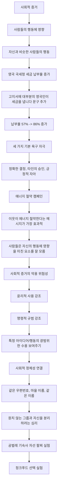

## 설득의 심리학 4: 작은 시도로 큰 변화를 만드는 스몰 빅의 힘
이 책은 로버트 치알디니와 동료들이 쓴 '설득의 심리학 4'로, 일상생활과 업무에서 작은 시도로 큰 변화를 만들어내는 '스몰 빅'의 비밀을 알려주는 책이야. 사람들의 행동과 결정을 바꾸는 데 어떤 심리적인 요소들이 중요한지, 그리고 그 요소들을 어떻게 활용할 수 있는지 과학적인 연구 결과들을 바탕으로 쉽게 설명해 줄 거야. 이 책을 통해 설득과 영향력의 세계에서 작지만 강력한 변화를 만드는 방법을 배울 수 있을 거야.

## 1. 메시지 프레임: 어떻게 말하느냐가 중요해 

메시지를 어떻게 전달하느냐에 따라 사람들의 반응이 완전히 달라질 수 있어. 마치 같은 음식이라도 어떤 그릇에 담느냐에 따라 더 맛있어 보이거나 맛없어 보이는 것처럼 말이야.

1. **사회적 규범의 힘**: 사람들은 다른 사람들이 어떻게 행동하는지에 큰 영향을 받아.
  1. 예를 들어, 재채기를 할 때 코나 입을 가리지 않는 친구가 있다고 생각해 봐. 이때 "재채기할 때 얼굴을 가리는 건 예의 바른 행동이야"라고 말하는 것과 "재채기할 때 얼굴을 가리지 않는 건 무책임한 행동이야"라고 말하는 것 중 어떤 게 더 효과적일까? 
  2. 연구에 따르면, 메시지 프레임의 성공은 상대방이 사회적 규범을 어떻게 인식하는지에 달려있어. 
  - 만약 상대방이 재채기할 때 얼굴을 가리는 것이 규범이라고 생각한다면, 그 규범을 어기는 사람의 부정적인 측면을 강조하는 것이 효과적이야. "재채기할 때 얼굴을 가리지 않는 사람들은 정말 무책임한 사람이야"라고 말하는 식이지. 
  - 반대로, 얼굴을 가리지 않는 것이 규범이라고 생각하는 사람이라면, 얼굴을 가리는 것의 긍정적인 측면을 강조하는 메시지가 더 효과적이야. "얼굴을 가리는 게 얼마나 좋을까?"라고 말하는 것처럼 말이야. 
  3. **예방 접종 실험**: 이 원리를 확인하기 위해 연구자들은 인플루엔자 예방 접종에 대한 실험을 했어. 
  - 참가자들에게 대부분의 학생이 예방 접종을 할 것이라는 기사와 대부분의 학생이 예방 접종을 하지 않을 것이라는 기사 중 하나를 읽게 했어. 
  - 그다음, 예방 접종을 한 사람과 하지 않은 사람의 특징을 설명하는 기사를 읽게 했지. 
  - 결과는 예상대로였어. 대부분의 학생이 예방 접종을 맞았다고 생각한 참가자에게는 예방 접종을 맞지 않은 사람들의 특징을 설명한 메시지가 더 설득력이 있었고, 대부분의 학생이 예방 접종을 맞지 않았다고 생각한 참가자에게는 예방 접종을 맞은 사람들의 특징을 설명하는 메시지가 더 설득력이 있었어. 
  - 이건 마치 "다들 숙제를 다 했는데 너만 안 했어!"라고 말하는 것과 "숙제를 다 하면 얼마나 좋을까?"라고 말하는 것의 차이와 같아. 상대방이 어떤 상황을 규범으로 생각하는지에 따라 메시지를 다르게 전달해야 한다는 거야. 
  4. **악용의 위험성**: 이런 설득 방법은 강력해서 악용될 수도 있어. 저자는 윤리적으로 사용되기를 바란다고 강조했어. 
  5. **실생활 적용**:
  - 헬스클럽에서 새 회원에게 "대부분의 회원이 사용한 수건을 세탁 바구니에 넣어둡니다. 그렇지 않은 회원은 다른 사람에 대한 존중이 부족한 것입니다"라고 말하는 것. 
  - 신입사원 오리엔테이션에서 "대부분의 동료들이 비용을 정확하고 정직하게 정산합니다. 그렇지 않다면 부서 전체를 실망시키는 일입니다"라고 말하는 것. 
  - 당뇨병 환자에게 "대부분의 당뇨 환자는 운전 전에 혈당을 체크합니다. 그렇게 하지 않는다면 타인을 위험에 빠뜨리는 것입니다"라고 말하는 것. 
  6. **상대방의 인식 파악**: 가장 중요한 건 메시지를 전달하기 전에 상대방이 사회적 규범에 대해 어떻게 생각하는지 먼저 파악하는 거야. 
  - 회의에 늦는 것을 대수롭지 않게 생각하는 직원들에게 "시간을 지키는 것이 얼마나 중요한지 알아?"라고 말하는 것보다, "늦게 오는 사람들은 이런 부정적인 영향을 줍니다"라고 말하는 것이 더 효과적일 수 있어. 

## 2. 미래의 나를 위한 행동: 스스로를 설득하는 스몰 빅 

우리는 미래의 나를 위해 지금 행동해야 한다는 메시지를 많이 들어. 마치 부모님이 자식에게 "나중에 후회하지 않으려면 지금 공부해라"라고 말하는 것처럼 말이야.

1. **미래의 자신에 대한 **도덕적 책임: 연구자들은 사람들이 미래의 자신에게 도덕적 책임을 느끼면, 자신에게 이로운 방향으로 행동할 가능성이 높다는 가설을 세웠어. 
  1. **은퇴 저축 실험**: 200명의 대학교 교직원을 대상으로 은퇴 저축 습관에 대한 연구를 진행했어. 
  - 모든 직원에게 저축의 중요성을 강조하는 메시지를 보냈지만, 마지막 단락은 그룹마다 다르게 구성했어. 
  - 한 그룹에는 "장기적인 이익을 고려해 지금부터 저축을 시작하세요. 미래의 복지가 당신의 결정에 달려있습니다"와 같이 기본적인 미래의 자기 이익을 강조했어. 
  - 다른 그룹에는 "은퇴를 대비해 자기 자신에 대한 책임을 져야 합니다. 미래의 당신을 결정짓는 것은 지금의 당신입니다"와 같이 미래의 자신에 대한 의무를 강조했어. 
  - **결과**: 미래의 자신에 대한 의무를 강조한 그룹은 저축률이 0.85% 증가했어. 
  - 이 작은 차이가 평생 저축액에서는 68,797달러(약 9천만 원)의 차이를 만들 수 있고, 1년 반 일찍 은퇴할 수 있는 효과를 가져올 수 있어. 
  2. **한계점**: 이 메시지가 모든 사람에게 효과적인 건 아니야. 미래를 가깝게 느끼지 못하는 사람들에게는 큰 차이가 없었어. 
  3. **최상의 전략**: 하지만 미래에 대한 책임 메시지는 일반적으로 사용하기에 최상의 전략이야. 왜냐하면 미래에 관심 없는 사람들에게도 일반적인 관심 메시지와 크게 다르지 않은 효과를 보였기 때문이야. 
2. **미래의 모습을 시각적으로 보여주기**: 미래의 나를 위한 행동을 유도하는 가장 효과적인 방법은 미래의 내 모습을 직접 보여주는 거야. 
  1. 노화 사진** 실험**: 참가자들에게 은퇴 연금 할당률을 조정하게 하면서, 절반은 현재 사진을, 나머지 절반은 70세가 된 노화된 사진을 보게 했어. 
  2. **결과**: 노화된 사진을 본 참가자들은 수입의 6.2%를 저축에 할당한 반면, 현재 사진을 본 참가자들은 4.4%만 할당했어. 무려 40%의 차이가 난 거야. 
  3. **적용 사례**:
  - 금연을 설득하는 의사가 담배가 노화를 앞당기는 앱을 사용해 환자의 나이 든 모습을 보여주는 것. 
  - 미래의 자신이 어떤 모습일지 사진으로 보여주는 것은 마치 "지금 네가 이렇게 행동하면 나중에 이렇게 될 거야"라고 직접 보여주는 것과 같아. 
  4. **간접적인 방법**: 미래의 모습을 직접 보여주기 어렵다면, "세월이 흘러도 당신의 가장 중요한 정체성은 변하지 않는다"는 사실을 일깨워주는 것만으로도 자신과 미래의 자신을 연결시켜 줄 수 있어. 
  5. **결론**: 과소비나 과식을 줄이기 위해 죄책감을 주거나 복잡한 인센티브를 제공하는 대신, 미래의 자기 모습을 그려보게 함으로써 유혹에 굴복하지 않고 미래를 내다보며 결정을 내릴 수 있도록 도울 수 있어. 

## 3. 미루는 습관 줄이기: 마감 기한의 마법 

우리는 즐겁지 않은 일뿐만 아니라 즐거운 일조차도 미루는 경향이 있어. 마치 "내일 할 일은 내일로 미루자"는 스페인 속담처럼 말이야. 

1. **선물 카드 실험**: 연구자들은 사람들이 미루는 습관 때문에 선물 카드를 사용하지 않는다는 점에 주목했어. 
  1. 참가자들에게 고급 베이커리에서 사용할 수 있는 10달러짜리 교환권을 주고, 유효 기간을 다르게 설정했어. 하나는 3주, 다른 하나는 2개월. 
  2. **예상**: 유효 기간이 긴 교환권(2개월)이 더 긍정적으로 평가받았고, 더 많은 사람이 사용하겠다고 말했어 (70% vs 50%). 
  3. **실제 결과**: 하지만 실제로는 유효 기간이 짧은 교환권(3주)이 유효 기간이 긴 교환권보다 무려 5배나 더 많이 사용되었어. 
  4. **이유**: 사람들은 유효 기간이 길면 '나중에 써야지' 하고 미루다가 결국 잊어버리거나 바빠서 사용하지 못하는 경우가 많았어. 
  5. **결론**: 소비자들에게 더 매력적으로 보일 것이라는 잘못된 믿음으로 긴 유효 기간을 제공하는 대신, 기간을 짧게 두는 것이 더 효과적이라는 거야. 
2. **실생활 적용**:
  1. 소프트웨어 회사가 신규 사용자 등록을 촉진하고 싶다면, "지금 바로 등록하시겠어요? 다음 주에 다시 문의해 주세요" 대신 "지금 바로 등록하세요! 내일 다시 문의해 주세요"와 같이 마감 기한을 짧게 설정하고, 일찍 등록한 사람에게 혜택을 주는 것. 
  2. 재정 상담사가 웹 세미나 참석률을 높이고 싶다면, 초대장에 "0월 0일까지 참석 확인 부탁드립니다"라고 적힌 확인 날짜를 예상보다 촉박하게 바꾸는 것. 
  3. 이메일 초청장의 등록 마감을 촉박하게 했더니 클릭률이 88% 올랐다는 다른 연구 결과도 있어. 
3. **특별한 순간은 지금**: 영화 '사이드웨이'의 한 장면처럼, 특별한 와인을 특별한 순간을 위해 아껴두다가 결국 마시지 못하는 경우가 있어. 
  1. 마야는 마일즈에게 "당신이 61년산 슈발 블랑을 따는 순간이 바로 특별한 순간이에요"라고 말해. 
  2. 이처럼 미루지 말고 지금 바로 행동하는 것이 중요해.

## 4. 더 적게 투자하고 더 많이 얻는 스몰 빅: 부가 효과의 함정 

우리는 보통 무언가를 더 많이 제공하면 더 좋다고 생각해. 마치 선물에 이것저것 덤을 많이 넣어주면 받는 사람이 더 좋아할 거라고 생각하는 것처럼 말이야. 하지만 때로는 덜어내는 것이 더 효과적일 수 있어.

1. 부가 효과** vs **평균 효과: 행동 과학자들에 따르면, 사람들은 특징이나 정보를 더 제공하면 장점들이 더해져 더욱 설득력을 발휘할 거라고 믿어 (부가 효과). 
  1. 하지만 제한을 평가하는 사람에게는 이런 부가적인 노력이 첨가 효과를 제공하는 대신, 오히려 평균 효과로 이어져 가치를 떨어뜨릴 수 있어. 
  2. 이건 마치 뜨거운 물에 따뜻한 물을 더하면 전체 물의 온도가 미지근해지는 것처럼, 이미 강력한 장점에 무언가를 더하는 것이 오히려 원래의 매력을 떨어뜨리는 효과를 낸다는 거야. 
2. **MP3 패키지 실험**: 연구자들은 이 가설을 확인하기 위해 MP3 패키지 실험을 진행했어. 
  1. 설명자 역할의 참가자들에게 두 개의 MP3 패키지를 보여줬어. 하나는 아이팟 터치, 다른 하나는 아이팟 터치에 음악 무료 다운로드 혜택을 추가한 것. 
  2. 설명자들은 대부분 무료 다운로드 혜택이 있는 제품을 더 가치 있다고 선택했어 (92%). 
  3. 하지만 구매자 그룹에서는 흥미롭게도 무료 다운로드가 제공되지 않았을 때보다 무료 다운로드를 제공할 때 더 적은 금액을 지불하겠다고 밝혔어. 
  4. 가치를 높이기 위해 무료 다운로드 서비스를 더한 것이 오히려 구매자의 눈에는 제품의 가치를 떨어뜨린 거야. 
3. **호텔 숙소 실험**: 또 다른 실험에서는 참가자들이 유명 여행 웹사이트에서 숙소를 찾는 역할을 맡았어. 
  1. 오성급 풀장이 달린 호텔에 머물 경우 평균적으로 얼마를 지불할 수 있느냐고 물었어. 
  2. 그런데 참가자들이 이 호텔에 삼성급 레스토랑이 있다는 사실을 알게 되자, 지불 가능한 금액을 15% 정도 깎았어. 
  3. 호텔 주인 역할을 맡은 참가자의 3분의 2는 광고에 레스토랑 소개를 추가하는 것이 숙박비를 높이는 데 도움이 될 것이라고 잘못 예상했어. 
4. **쓰레기 무단 투기 벌칙 실험**: 제품뿐만 아니라 아이디어를 설득하는 경우에도 비슷한 경향이 나타났어. 
  1. 시의회에서 거리의 쓰레기를 줄이기 위한 벌칙으로 두 가지 중 하나를 선택하게 했어.
  - 투기 벌금 750달러 
  - 투기 벌금 750달러와 사회봉사 두 시간 
  2. 대부분의 공무원(86%)은 벌금과 사회봉사를 함께 부과하는 것을 선택했어. 
  3. 하지만 다른 그룹의 사람들에게 이 조건을 평가하도록 요청했더니, 벌금 750달러와 사회봉사 두 시간이 벌금 750달러만 물리는 것보다 덜 가혹하다고 응답했어. 
  4. 이미 매력적이지 않은 상황에 부정적인 요소를 더하면 오히려 약간의 호감을 갖게 되는 일이 발생한 거야. 
5. **이유**: 제안을 소개하는 사람(제안자)은 각 측면에 집중하는 경향이 있지만, 평가자들은 전반적인 상황에 중점을 두고 접근하기 때문이야. 
6. **해결책**: 모든 고객에게 약간의 덤을 얹어주기 위해 자원을 투입하는 대신, 소수의 선별적인 고객에게 더 의미 있는 덤이나 특징을 투자하는 방식으로 바꾸는 것이 좋아. 
  1. 이렇게 하면 자원을 낭비하는 것을 피할 수 있고, 가장 소중한 고객에게 맞춤화된 혜택을 제공함으로써 상호성 원칙을 실천할 수 있어. 

## 5. 약속 이행률 높이기: 구체적인 행동 약속의 힘 

우리가 병원 예약을 깜빡하거나 새 목표를 세웠다가 흐지부지되는 것처럼, 약속을 잘 지키지 못하는 경우가 많아. 이건 단순히 의지의 문제가 아니라, 약속을 어떻게 하느냐에 따라 달라질 수 있어.

1. **능동적이고 구체적인 약속**: 사람들이 약속을 좀 더 능동적으로, 그리고 구체적으로 하게 만드는 것이 중요해. 
  1. **병원 예약 사례**: 영국 보건당국은 예약 불이행 때문에 연간 1조 원이 넘는 손실을 본다고 해. 
  - 병원에서 직원이 다음 예약 카드를 그냥 적어주는 대신, 환자가 직접 자기 손으로 날짜와 시간을 쓰게 하는 거야. 
  - 이런 아주 작은 행동 변화만으로도 예약 불이행률이 무려 18%나 줄었다는 연구 결과가 있어. 
  2. **호텔 수건 재사용 사례**: 호텔에서 "환경보호를 위해 수건 재사용에 동참해 주시겠어요?"라고 막연하게 묻는 것보다, "수건을 재사용하시겠습니까?"라고 훨씬 구체적으로 물었을 때 실제 재사용률이 더 높았어. 
  - 환경보호에 동참하겠다는 막연한 선의의 확인보다는, 구체적인 행동 약속이 훨씬 강력하다는 증거지. 
  - 심지어 수건 재사용을 약속한 사람들은 방 나갈 때 불 끄는 것 같은 다른 친환경 행동도 더 많이 했다고 해. 
  3. 실행 의도: 이건 마치 "투표하실 거죠?"라고 묻는 것보다 "언제, 어디서, 어떻게 투표하러 가실 건가요?" 하고 구체적인 계획을 떠올리게 하는 것이 실제 투표율을 높이는 것과 같아. 
  - 언제 접종받을 건지 날짜와 시간을 적어보게 했을 때 실제 접종률이 눈에 띄게 높아졌어. 
  - 단순히 '해야지'라고 생각하는 것과 '언제 어떻게 해야겠다'라고 계획하는 것은 행동 가능성에서 정말 큰 차이를 만들어. 

## 6. 미래 고정화 기법: 부담스러운 목표를 쉽게 만드는 방법 

어떤 목표가 너무 부담스럽거나 과거에 실패했던 경험이 있다면, 지금 당장 시작하기 망설여질 때가 많지? 마치 "다이어트는 내일부터!"라고 외치는 것처럼 말이야. 이럴 때 '미래 고정화 기법'이 도움이 될 수 있어.

1. 미래의 결정** vs 현재의 결정**: 사람들은 지금 당장 시작해야 하는 변화보다는 미래의 어떤 특정 시점에 시작될 변화에 더 쉽게 동의하는 경향이 있어. 
  1. 심리적으로 보면, 미래의 결정은 '이게 가치 있는 일인가?' 하는 이상적인 기준으로 판단하지만, 현재의 결정은 '내가 이걸 지금 할 수 있나? 현실적인 어려움은 없나?' 하는 실현 가능성을 더 따지기 때문이야. 
  2. 예를 들어, 유류세를 당장 올린다고 하면 반대가 심하지만, "4년 후에 올리겠습니다"라고 말하면 지지율이 훨씬 높아지는 것과 같아. 
2. **세이브 모어 투모로우 (**Save More Tomorrow**) 프로그램**: 미국의 유명한 퇴직 연금 프로그램이 대표적인 성공 사례야. 
  1. "지금 당장 저축액 늘리세요"라고 하면 다들 망설이지만, "나중에 월급 오르면 그 인상분에서 자동으로 저축액 늘리도록 미리 약속하시죠"라는 방식은 훨씬 수용도가 높았어. 
  2. 미래의 일이라고 생각하면 심리적인 부담이 확 줄어드는 거지. 
3. **적용**: 지금 망설여지는 약속이나 목표가 있다면, 이걸 미래 시점의 약속으로 바꿔서 스스로나 다른 사람의 동의를 더 쉽게 얻어낼 수 있어. 

## 7. 협상과 가격 책정의 심리: 숫자의 마법 

협상 테이블이나 물건값을 정하는 상황에서도 작은 디테일이 큰 차이를 만들 수 있어. 마치 마트에서 9,900원짜리 물건이 10,000원짜리보다 훨씬 싸게 느껴지는 것처럼 말이야.

1. 앵커링 효과** (Anchoring Effect)**: 협상할 때 먼저 가격을 부르는 것이 유리하다는 '앵커링 효과'는 많이 들어봤을 거야. 
  1. 먼저 제시된 숫자가 일종의 닻(앵커) 역할을 해서 이후 논의의 기준점을 만들기 때문에 유리한 거야. 상대방은 그 첫 제안을 무시하기 어렵고, 그 주변에서 협상을 시작하게 되는 경향이 있지. 
  2. **구체적인 숫자의 힘**: 단순히 먼저 제안하는 것을 넘어서, 아주 정확하고 구체적인 숫자를 첫 제안으로 던지는 것이 훨씬 강력한 앵커가 돼. 
  - 예를 들어, 그냥 "4,000달러"라고 부르는 것보다 "3,935달러" 이런 식으로 말이야. 
  - 이렇게 딱 떨어지지 않는 숫자는 마치 계산해서 내놓았다는 인상을 줘. 그럼 듣는 사람 입장에서는 '저 숫자에 뭔가 이유가 있겠구나'라고 생각하게 돼서 쉽게 반박하거나 큰 폭으로 가격을 깎기가 어려워지는 심리적 효과가 발생하는 거지. 
  3. **주의점**: 물론 너무 비현실적이거나 근거 없는 숫자는 신뢰를 잃게 할 수 있으니, 어느 정도 합리적인 범위 내에서의 정밀함이 중요해. 
2. 왼쪽 숫자 효과** (Left-Digit Effect)**: 우리가 가격을 왼쪽에서 오른쪽으로 읽기 때문에, 가장 왼쪽에 있는 숫자가 가격 인식에 가장 큰 영향을 미쳐. 
  1. 19,900원은 딱 보면 '1만 원대'로 인식되지만, 불과 100원 차이인데도 2만 원은 '2만 원대'로 확 넘어가 버리지. 
  2. 특히 가장 왼쪽 숫자가 바뀔 때 (1에서 2로, 2에서 3으로 넘어갈 때) 심리적인 가격 저항선이 훨씬 크게 느껴져. 
  3. 미국 JC페니 백화점이 정직 마케팅을 한다고 이런 990원 같은 가격을 없앴다가 오히려 매출이 뚝 떨어진 사례도 있어. 
3. **정보 제시 순서**: 묶음 상품을 제시하는 방식에서도 이런 가격 인식의 묘함이 나타나. 
  1. 예를 들어, 음악 70곡을 29.99달러에 파는 상품이 있다고 해보자. 
  2. 이때 "29.99달러에 70곡 드립니다"라고 말하는 것보다 "70곡을 29.99달러에 드립니다" 즉, 혜택 곡수를 먼저 말하는 것이 더 효과적이라는 연구가 있어. 
  3. 사람들이 더 큰 숫자인 '70곡'이라는 혜택에 먼저 주목하고 거기에 앵커링 되기 때문이야. 
  4. 어떻게 정보를 구성해서 제시하느냐에 따라서 같은 상품도 정말 다르게 인식될 수 있다는 걸 보여주는 예시지. 

## 8. 목표 달성과 동기 부여: 과업 중요성과 범위 목표 

회사에서 금전적 인센티브 같은 것도 장기적으로 보면 효과가 떨어진다는 비판이 많아. 돈만으로는 사람들의 동기를 계속 유지하기 어렵다는 거지. 이럴 때 '과업 중요성'이라는 개념이 도움이 될 수 있어.

1. **과업 중요성 (Task Significance)**: 내가 하는 일이 어떤 의미를 가지고, 또 어떤 영향을 미치는지 명확하게 인식하는 것이 강력한 동기 부여 요인이 돼. 
  1. **콜센터 연구**: 아그랜트 교수의 유명한 콜센터 연구가 이걸 아주 잘 보여줘. 
  - 대학 기금 모금 콜센터 직원들을 두 그룹으로 나눴어. 
  - 한 그룹에게만 그들의 모금 활동 덕분에 장학금을 받게 된 학생을 직접 만나서 이야기를 나눌 기회를 준 거야. 
  - **결과**: 자신의 노력이 누군가에게 정말 실질적인 도움을 준다는 걸 직접 확인한 직원들은 전화 횟수나 모금액 같은 생산성이 월등히 높아졌을 뿐만 아니라, 업무 만족도 자체도 크게 향상됐어. 
  - 주목할 점은 그들이 추가적인 금전적 보상을 받은 게 아니라는 거야. 
  - 단지 자신의 일이 갖는 의미와 영향력, 이걸 깨닫게 된 것만으로도 그렇게 강력한 동기 부여가 이루어진 거지. 
2. 범위 목표** 설정**: 다이어트처럼 과거에 실패 경험이 있을 수 있는 목표에 다시 도전할 때, 목표 설정 방식도 중요해. 
  1. "일주일에 1kg 빼기"처럼 구체적인 목표를 주는 것보다, "0.5kg에서 1kg 사이로 빼세요"처럼 범위를 설정해 주는 것이 더 효과적이야. 
  2. **체중 감량 클럽 연구**: 10주 프로그램이 끝난 후 다음 프로그램에 재등록하겠다고 응답한 비율을 보면, 범위 목표 그룹이 80% 이상이었고, 구체적 목표 그룹은 약 50% 정도였어. 
  3. 실제 감량한 몸무게 차이는 거의 없었는데도 말이야. 
  4. **이유**: 범위 목표가 참가자들에게는 좀 더 달성 가능해 보이고, 혹시 목표에 좀 못 미치더라도 '아, 완전히 실패한 건 아니구나' 하는 심리적 안정감을 줘. 그래서 다시 도전할 동기를 더 강하게 부여하는 거지. 실패에 대한 두려움을 줄여주는 거야. 
3. 작은 영역 가설** (Small Area Hypothesis)**: 목표를 향해 나아가는 과정에서 우리의 집중 포인트를 조절하는 것도 중요해. 
  1. 이 가설은 목표 달성까지 남은 과정에 따라서 동기 부여에 효과적인 초점이 달라진다는 이론이야. 
  2. **시작 단계**: 목표를 막 시작했을 때는 이미 달성한 작은 진전에 집중하는 것이 효과적이야. 예를 들어 "와, 벌써 이만큼이나 해냈네!"라고 생각하는 것처럼 말이야. 
  3. **마무리 단계**: 반면에 목표 달성이 눈앞에 다가왔을 때 (절반 이상 진행됐을 때)는 목표까지 남은 작은 거리에 집중하는 것이 더 강력한 추진력을 줘. "이제 요만큼만 더하면 된다!"라고 생각하는 것처럼 말이야. 
  4. **초밥집 포인트 카드 연구**: 도장 10개를 모으면 초밥 1인분을 무료로 주는 카드 실험이 있어. 
  - 열 칸짜리 카드에 도장을 하나도 안 찍어주는 것보다, 12칸짜리 카드에 미리 도장 두 개를 쾅쾅 찍어주는 것이 고객들이 목표 (무료 초밥)를 달성하는 비율이 더 높았어. 
  - 둘 다 고객이 직접 찍어야 하는 도장 개수는 10개로 똑같은데도 말이야. 
  - **이유**: 후자의 경우 처음에는 '어, 이미 두 개는 얻었네' 하고 그 진전에 집중하게 되고, 막판에는 '아, 이제 두 개만 더 먹으면 된다' 하고 남은 거리에 집중하게 만들기 때문이라고 봐. 
  5. 항공사 마일리지나 커피 쿠폰 모으는 것도 다 이런 원리를 이용한 거야. 

## 9. 환경과 심리적 거리두기: 맥락의 중요성 

우리가 있는 환경 자체가 우리 행동에 미치는 영향도 무시할 수 없어. 마치 깨진 유리창 하나를 방치하면 더 큰 범죄로 이어진다는 이론처럼 말이야.

1. **환경의 영향**: 사무실 천장 높이가 창의적 사고나 분석적 사고에 영향을 준다는 이야기처럼, 주변 환경이 우리의 생각과 행동에 영향을 미칠 수 있어. 
2. 심리적 거리두기** (Psychological Distancing)**: 어떤 어려운 문제에 부딪혔을 때, 단순히 의자의 등을 기대고 뒤로 살짝 물러나는 것만으로도 문제에 대한 심리적 거리가 생겨서 덜 어렵게 느껴지고, 좀 더 큰 그림에서 창의적인 해결책을 떠올리는 데 도움이 된다는 연구 결과도 있어. 
  1. 시간적 거리를 두는 것, 예를 들어 "1년 뒤에 나라면 이 문제를 어떻게 볼까?"라고 생각해 보는 것도 비슷한 효과가 있어. 
  2. 이런 사소한 신체적, 정신적 거리 조절이 문제 인식 자체를 바꿀 수 있다는 거지. 
3. 맥락** 디자인의 힘**: 결국 설득의 본질은 상대를 조종하는 것이 아니라, 서로에게 이로운 방향으로 생각과 행동의 변화를 자연스럽게 이끌어내는 데 있어. 
  1. 이를 위해 맥락을 신중하게 디자인하는 것의 힘을 꼭 기억해야 해. 

## 10. 사회적 증거의 힘: 다수가 하는 대로 따르려는 심리 

영국 국세청 공무원들에게는 세금 환급 서류를 제때 제출하지 않고 세금을 제때 내지 않는 사람들이 많아서 심각한 문제였어.  수년 동안 가산금이나 연체료, 법적 대응 같은 메시지를 보냈지만, 효과가 별로 없었지. 

1. 작은 변화**, 놀라운 결과**: 2009년, 영국 국세청은 '인플루언스 앳 워크'의 컨설팅을 받아 새로운 접근법을 활용했어. 
  1. 기존 고지서에 단 한 문장을 더하는 작은 변화를 줬을 뿐인데, 놀라운 결과를 만들었어. 
  2. 새로운 고지서를 보내자 미납분 6억 5천만 파운드 중에서 5억 6천만 파운드가 거둬져 납부율이 86%에 달했어. 
  3. 그전에는 5억 1천만 파운드 중에서 2억 9천만 파운드만 거둬져 납부율이 57%에 불과했거든. 
  4. 이 작은 변화로 영국 국세청은 전해보다 최대 56억 파운드의 세금을 더 거둘 수 있었고, 35파운드의 장부상 부채도 줄일 수 있었어. 
2. 사회적 증거** (Social Proof)**: 고지서에 더한 변화는 바로 '대부분의 사람들이 세금을 낸다'는 사실을 알려준 것이었어. 
  1. 이것이 바로 과학자들이 '사회적 증거'라고 부르는 인간 행동의 근원적인 법칙이야. 
  2. 사람들의 행동은 상당 부분 주변 사람들로부터 영향을 받아. 특히 자신과 비슷하다고 생각하는 사람들로부터 더 큰 영향을 받지. 
  3. 새들이 떼를 지어 살고, 물고기가 무리를 이루어 다니는 것처럼, 대뇌 피질이 없는 유기체조차도 주변의 다른 누군가에게 근원적으로 영향을 받아. 
  4. 사회적 증거는 새로운 개념이 아닐 수도 있지만, 우리는 이 개념을 어떻게 행동으로 옮길 수 있을지에 대해 점점 더 많은 것을 배우고 있어. 
3. **세 가지 기본 욕구 자극**: 세금 고지서의 사소한 변화가 큰 차이를 가져온 것은 인간의 세 가지 기본 욕구를 모두 건드렸기 때문이야. 
  1. **가능한 정확한 결정을 내리려는 욕구**: 복잡한 일상에서 대부분의 사람들이 하는 대로 따르는 것은 현명한 결정을 내리는 가장 효율적인 방법이라고 생각하는 거야. 
  2. **다른 사람들에게 영감을 믿고 다른 사람들의 승인을 얻으려는 욕구**: 일반적으로 다른 사람들이 의미하는 대로 따르면 대중의 승인을 받고 사회적 연결 확률이 높아진다고 생각하기 때문이야. 
  3. **스스로를 긍정적으로 보려는 욕구**: 무임 승차자가 되고 싶어 하는 사람은 거의 없어. 다른 모든 사람이 제때 세금을 낸다는 사실을 알게 되면, 아직 세금을 내지 않은 사람들은 무임 승차자가 되고 싶어 하지 않고, 책임을 다하는 사람으로서 자기 이미지를 보여주고 싶어 해. 
4. **사람들은 사회적 증거의 영향력을 잘 모른다**: 사회적 증거의 영향력이 얼마나 강력한지 볼 때, 사람들이 그 대단한 영향력에 대해 잘 모르고 있다는 사실이 놀라워. 
  1. **에너지 절약 캠페인**: 캘리포니아 주택 소유자 수백 명을 대상으로 에너지 절약에 영향을 미치는 네 가지 잠재적인 요소에 대해 질문했어. 
  - 환경 문제에 도움을 줄 수 있다. 
  - 미래 세대를 보호하기 위해서 에너지를 절약한다. 
  - 에너지를 절약하면 돈을 아낄 수 있다. 
  - 주변에 많은 사람들이 이미 에너지를 절약하고 있다. 
  2. 주택 소유자 중 상당수는 자신의 행동에 가장 덜 영향을 주는 것으로 '이미 많은 이웃이 그렇게 하고 있다'는 응답을 했어. 
  3. 하지만 실제 실험에서는 '대부분의 이웃이 에너지를 절약하기 위해 애쓰고 있다'는 구체적인 조사 자료를 알린 그룹이 가장 효과적인 것으로 나타났어. 
  4. 사람들은 어떤 것이 자신의 미래 행동에 영향을 미칠지 잘 모를 뿐만 아니라, 실제로 어떤 일이 발생한 이유에도 자신을 설득한 것이 무엇인지 제대로 이해하지 못해. 
  5. **길거리 악사 기부 실험**: 뉴욕 지하철에서 길거리 악사에게 돈을 주고 가는 통근자 수를 조사했어. 
  - 통근자가 음악가에게 다가가기 전에 연구자가 고용한 사람이 먼저 다가가서 통근자 앞에서 음악가 모자에 동전을 넣었어. 
  - **결과**: 기부를 한 사람의 숫자가 8배가량 늘어났어. 
  - 하지만 기부한 통근자들과 인터뷰를 했을 때, 그들은 다른 사람이 돈을 주는 장면이 자신의 행동에 영향을 끼쳤다고 인정하지 않았어. 대신 "그가 연주한 곡이 마음에 들었거든요", "저는 다른 사람들에게 관대한 편이랍니다", "저 음악가가 불쌍해 보였어요"와 같이 나름대로 자신의 행동을 정당화했어. 
  6. **결론**: 사람들은 어떤 일이 일어나기 전에 자신에게 영향을 미친 요소를 알아차리지 못해. 
  - 기업은 고객 응답에 기반한 마케팅 전략이 실패하는 경우가 많은데, 이는 고객이 자신의 결정에 영향을 준 요소를 정확히 반영하지 못하기 때문이야. 
  - 대신, 타겟 고객들이 동일시하는 대다수 사람들이 어떻게 행동했는지를 보여주면, 타겟 고객은 그렇게 행동할 가능성이 높아져. 
5. **사회적 증거 효과 극대화**: 사회적 증거 효과를 극대화하려면 약간의 특수성을 더하는 것이 좋아. 
  1. **영국 국세청 고지서 사례**: 세금 고지서에 '세금을 제때 내는 영국인의 수'뿐만 아니라, '고지서 수령자와 같은 우편번호를 쓰는 사람들 중 제때 세금을 납부한 사람의 비율'을 넣었어. 
  - 그랬더니 응답률이 67%에서 79%로 올랐어. 
  2. 사회적 정체성** 연결**: 세 번째 고지서에는 사회적 정체성을 좀 더 좁혀서, '같은 우편번호를 사용하는 사람들 중 이미 세금을 납부했다'는 사실을 알리는 대신, 고지서에 '마을 이름'을 적어 넣었어. 
  - 이 작은 변화는 응답률에서 더욱 커다란 변화를 이끌었는데, 세금을 납부한 사람이 무려 83%에 달했어. 
  - 결론적으로, 메시지를 목표로 하는 그룹의 사회적 정체성과 되도록 가깝게 연결시키는 것이 효과적이야. 
  - 온라인에서는 IP 주소를 활용해 특정 지역 사람들과 관련한 사회적 증거를 전달할 수 있어. 
  3. **이름을 통한 연결**: '인명 뉴스성'이라는 개념을 이용해 사람의 이름을 통해서 비슷한 시도를 할 수 있어. 
  - 2012년 미국 대통령 선거 기간 동안 오바마 선거 운동 조직은 등록자의 같은 이름과 같은 사람들이 얼마나 투표했는지 살펴볼 수 있게 해주는 이메일을 보냈어. 
6. **원치 않는 그룹과 자신을 분리하려는 심리**: 사람들은 자신이 속하고 싶은 그룹의 특성에 부합하게 행동하도록 동기 부여되지만, 동시에 자신이 속하고 싶지 않은 그룹의 일상적인 행동을 피하도록 동기 부여되기도 해. 
  1. **자선 팔찌 실험**: 한 대학교 기숙사 학생들이 자선 팔찌를 구입했는데, 연구 조교들이 근처 '공부 벌레 기숙사' 학생들에게도 똑같은 자선 팔찌를 건네고 기부금을 요청했어. 
  - 이 '공부 벌레 기숙사' 학생들은 학문적 활동에만 몰두하는 괴짜라는 평판이 있었어. 
  - **결과**: '공부 벌레 기숙사' 학생들이 자선 팔찌를 사기 시작하자, 목표 기숙사 학생들의 팔찌 착용률이 30% 감소했어. 
  - 이는 팔찌를 차는 것이 '공부 벌레 기숙사' 학생들과 연관되는 것을 피하기 위해서 팔찌를 차지 않은 것으로 해석돼. 
  2. **음식 선택 실험**: 학부생 참가자들에게 캠퍼스에서 패스트푸드를 가장 많이 먹는 학생이 '학부생'이라고 얘기하거나 '대학원생'이라고 얘기했어. 
  - 다른 참가자들 앞에서 선택할 때는 '대학원생들이 정크푸드를 가장 많이 먹는다'는 이야기를 들은 학부생들이 정크푸드를 훨씬 적게 선택했어. 
  3. **결론**: 새로운 시장을 찾는 기업은 특정 제품을 새로운 소비자층에 소개할 때, 기존 제품을 사용하던 소비자들이 새로운 소비자층과 연관되는 것을 피해서 제품을 포기하는 상황이 벌어지지 않도록 주의해야 해. 
7. **바람직하지 않은 행동 강조의 위험성**: 이전 달에 보건소를 찾아오지 않은 사람의 숫자를 공표하면 다음 달 예약 불이행 건수가 오히려 늘어난다는 연구 결과도 있어. 
  1. 만약 다수의 사람들이 아직 바람직한 행동을 실행하지 않고 있다면, 바람직한 행동을 강조하는 전략은 성공적이지 못할 거야. 
  2. 이 경우, 다수가 되는 사람이 꾸며내고 싶은 충동을 느끼겠지만, 이런 시도에는 강력하게 반대해. 왜냐하면 사회적 증거가 꾸며진 것이라는 사실이 드러나는 순간, 사람들은 더는 신뢰하지 않을 것이고 최악의 경우 이 시도가 유효하다고 생각할 것이기 때문이야. 
8. **두 가지 다른 접근법**:
  1. **명령적 **규범** (**Injunctive Norms**) 강조**: 주어진 상황에서 널리 인정받는 행동을 강조하는 거야. 
  - 예를 들어, "캘리포니아 주민 80%는 에너지 절약 프로그램에서 자신의 중요한 역할을 한다고 믿고 있습니다"와 같이 특정 아이디어나 행동을 광범위하게 수용한다는 사실을 보여주는 압도적인 수치를 발표하는 것이 효과적이야. 
  2. **참여하는 사람 증가세 보여주기**: 캠페인 초기 적절한 탄력을 받아야 할 때나 참여하는 사람 증가세를 보여줘야 할 때 효과적인 전략이야. 
  - 예를 들어, "지난 몇 달 사이에 웹 트래픽이 일주일에 몇백 명에서 천 명으로 증가한 블로그"처럼 짧은 시간에 방문자가 5배 증가했다는 사실을 강조할 수 있어. 
  - 페이스북 사용자라면 '좋아요' 증가를 강조할 수 있지. 

![[설득의 심리학 2 (절대 거절할 수 없는 설득 프레임) - 자세한 리포트]]