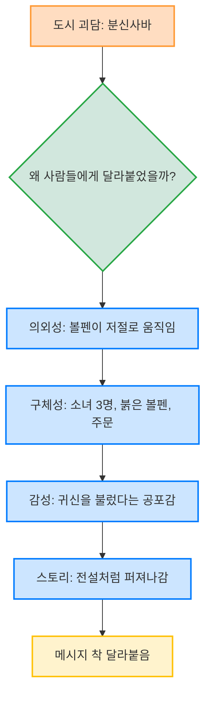
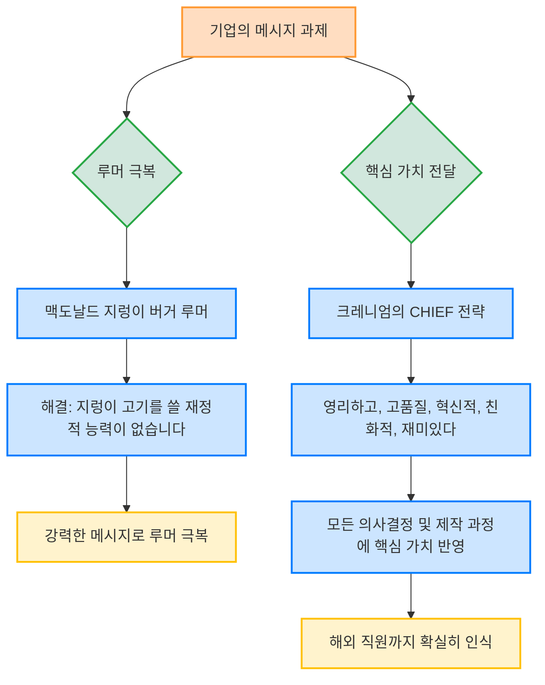

이 책은 메시지를 사람들의 머릿속에 쏙쏙 박히게 만드는 6가지 비법을 알려주는 책이야. 어떻게 하면 내 이야기가 사람들에게 잊히지 않고 오래 기억될 수 있을지, 그리고 그들이 내 말대로 행동하게 만들 수 있을지 궁금하다면 이 책이 답을 줄 거야. 마치 스티커처럼 착 달라붙는 메시지를 만드는 방법을 배울 수 있을 거야.
## 1. 메시지를 착 달라붙게 만드는 6가지 비법 (SUCCESS 원칙) 

메시지를 사람들의 마음에 쏙쏙 박히게 하려면 6가지 중요한 원칙을 지켜야 해. 이 원칙들의 첫 글자를 따면 'SUCCESS(성공)'라는 단어가 되는데, 이 원칙들을 잘 활용하면 누구나 성공적인 메시지를 만들 수 있어.

1. 단순성** (**Simplicity**)** 
  - 메시지의 핵심을 아주 간단하게 만들어야 해. 마치 속담처럼 짧고 깊은 의미를 담는 것이 가장 좋아.
  - 유명한 변호사가 말했듯이, 법정에서 10가지 주장을 하면 배심원들은 아무것도 기억하지 못할 거야. 가장 중요한 한두 가지만 남겨야 해. 
  - 우리가 원하는 건 그냥 요약문이 아니라, '남에게 대접받고 싶은 대로 남을 대접하라'는 황금률처럼 단순하면서도 평생 실천해야 할 만큼 심오한 메시지야. 
  - 핵심을 찾으려면 불필요한 것을 모두 덜어내야 해. 하지만 진짜 어려운 건 중요해 보이지만 가장 중요하지 않은 것을 버리는 일이야. 
  - 뉴스 기자들이 기사 첫 문장(리드)에 가장 중요한 정보를 담는 것처럼, 메시지의 핵심도 단 하나여야 해. 
  - **비유의 힘**: 복잡한 개념을 이미 아는 것에 비유하면 훨씬 쉽게 이해시킬 수 있어.
  - 뇌를 컴퓨터에 비유해서 심리학자들이 뇌 기능을 연구한 것처럼 말이야. 
  - 디즈니랜드에서 직원들을 '배우'라고 부르는 것도 좋은 비유야. 배우는 무대에서 연기하고, 관객에게 즐거움을 줘야 하니까, 직원들도 자연스럽게 그런 행동을 하게 돼. 
  - 반면, 서브웨이가 직원들을 '샌드위치 예술가'라고 부른 건 실패한 비유야. 예술가는 개성이 중요하지만, 서브웨이 직원은 정해진 대로 샌드위치를 만들어야 하니까 행동 지침이 모호해지거든. 

2. 의외성** (**Unexpectedness**)** 
  - 사람들의 예상을 깨뜨려서 관심을 확 끌어야 해.
  - 영화관 팝콘이 하루 세끼 콜레스테롤 식사보다 더 해롭다는 사실처럼, 직관에 반하는 결론을 내세우면 사람들이 깜짝 놀라게 돼. 
  - 놀라움은 사람들의 주의를 집중시키고 곰곰이 생각하게 만들어서 기억에 오래 남게 해. 
  - 하지만 놀라움은 오래가지 않으니, 사람들의 호기심을 자극해서 계속 관심을 유지시켜야 해. 
  - 지식의 공백** 활용**: 사람들이 뭔가 알고 싶지만 모를 때 생기는 '지식의 공백'을 만들어주면 호기심이 생겨. 마치 등이 가려운데 손이 닿지 않는 느낌과 같아. 
  - 이 공백을 채워주면 사람들은 더 오랫동안 메시지에 집중하게 돼. 
  - 정보를 한꺼번에 다 주지 않고, 조금씩 실마리를 흘려주는 방식이 효과적이야. 
  - **의미 없는 놀라움은 피해야 해**: 늑대가 관악대를 덮치는 광고처럼, 충격적이기만 하고 메시지와 상관없는 놀라움은 아무 의미가 없어. 
  - **메시지와 연결된 놀라움**: 미니밴이 갑자기 사고 나는 광고처럼, 예상치 못한 충격으로 안전띠의 중요성을 깨닫게 하는 광고는 효과적이야. 
  - 우리의 예측 시스템(도식)이 깨질 때 놀라움을 느끼고, 왜 그랬는지 이해하려 하면서 메시지를 더 잘 받아들이게 돼. 

3. 구체성** (Concreteness)** 
  - 메시지를 명확하게 만들려면 실제 행동이나 감각적인 정보로 설명해야 해.
  - 많은 회사들이 '사명 선언문', '시너지 전략' 같은 애매모호한 말들을 쓰는데, 이런 말들은 아무 의미도 없어. 
  - '얼음으로 가득 찬 욕조', '면도날이 박혀 있는 사과'처럼 구체적이고 상세한 이미지는 우리 뇌에 잘 기억돼. 
  - 속담도 추상적인 진리를 '손안에 든 한 마리 새가 덤불 속 두 마리보다 낫다'처럼 구체적인 언어로 표현해서 기억하기 쉽게 만들어. 
  - 지식의 저주: 전문가들은 자기가 아는 것을 남들도 알 거라고 착각해서 추상적인 말을 쓰기 쉬워. 마치 외국인에게 영어를 더 천천히 크게 말하면 알아들을 거라고 생각하는 미국인 관광객 같아. 
  - 모두가 이해할 수 있는 공통 언어는 결국 구체적인 언어야. 
  - 구체적인 언어를 쓰는 건 어렵지 않아. 단지 우리가 추상적인 말로 빠져들고 있다는 사실을 잊어버리는 게 문제야. 

4. 신뢰성** (**Credibility**)** 
  - 사람들이 우리의 메시지를 믿게 하려면 신뢰성을 갖춰야 해.
  - 공중위생국장이 공공위생 문제를 말하면 믿겠지만, 일상생활에서는 그런 권위에만 의존하기 어려워. 
  - **스스로 시험하게 하라**: 사람들이 메시지를 직접 경험하고 시험해 볼 수 있도록 도와줘야 해. 마치 물건을 사기 전에 직접 써보게 하는 것처럼 말이야. 
  - **통계의 함정**: 사람들은 큰 숫자를 내세우는 경향이 있지만, 복잡한 통계는 오히려 신뢰성을 떨어뜨릴 수 있어. 
  - 레이건 대통령이 경제 침체를 설명할 때 복잡한 통계 대신 "여러분, 4년 전보다 더 잘 살고 있습니까?"라는 간단한 질문을 던진 것처럼, 사람들이 스스로 판단할 수 있게 해야 해. 
  - 통계는 숫자 자체가 아니라 숫자들 사이의 '관계'를 보여주는 데 사용해야 해. 
  - 통계를 더 인간적이고 일상적인 언어로 설명해서 맥락을 부여해야 해. 
  - **생생한 세부 사항**: 메시지 자체에 신뢰성을 부여하는 좋은 방법은 생생한 세부 사항을 활용하는 거야. 세부 사항은 주장을 더 구체적이고 현실적으로 만들어서 믿음직스럽게 보이게 해. 

5. 감성** (Emotion)** 
  - 상대방이 메시지를 중요하게 받아들이게 하려면 무언가를 느끼게 만들어야 해.
  - 영화관 팝콘 이야기는 사람들이 팝콘의 유해성에 혐오감을 느끼게 했어. '포화지방 37g'이라는 숫자는 아무 감정도 불러일으키지 못하지만, 팝콘이 건강에 해롭다는 이야기는 감정을 자극하지. 
  - 사람들은 추상적인 개념보다는 '한 개인'에게 더 감정을 느끼고 자선을 베푸는 경향이 있어. 
  - **적절한 **감정** 자극**: 어떤 감정을 자극할지 잘 찾아야 해.
  - 10대 흡연자에게 담배의 유해성을 말하는 것보다, 거대 담배 회사의 위선적인 행동을 알려줘서 '반발심'을 자극하는 것이 금연 열풍을 더 강하게 일으킬 수 있어. 
  - **분석적인 모자 벗기기**: 사람들이 계산하거나 분석하는 모자를 쓰면 감정적인 호소에 덜 반응하게 돼. 
  - 자기 이익** 강조**: 사람들은 자기 자신을 가장 중요하게 여겨. 메시지가 그들에게 어떤 이익을 주는지 명확하게 보여주는 것이 가장 단순하고 확실한 방법이야. 
  - '굿이어 타이어를 사용하면 당신은 안심할 수 있다'처럼 직접적으로 '당신'에게 이익이 돌아간다고 말해야 해. 
  - 매슬로의 욕구 피라미드: 사람들의 욕구는 단계별로 나뉘어 있어.
  - 가장 낮은 단계는 생리적 욕구, 그다음은 안전, 소속감과 사랑, 존중, 그리고 가장 높은 단계는 자아실현 욕구야. 
  - 수학 공부의 이유를 설명할 때, 단순히 졸업이나 좋은 대학 같은 하위 욕구(안전, 존중)에 호소하는 것보다, '논리적 사고력을 길러 더 좋은 사람이 되기 위한 정신 근력 운동'처럼 자아실현 같은 상위 욕구에 호소하는 것이 훨씬 효과적이야. 
  - 매슬로는 자아실현이 인간 성취의 최고 단계이며, '절정 경험'(자연이나 예술을 통해 느끼는 강렬한 행복감)이 개인의 성장을 촉진한다고 봤어. 

6. 스토리** (**Story**)** 
  - 상대방이 메시지대로 행동하게 하려면 스토리를 들려줘야 해.
  - 소방관들이 서로의 경험담을 나누면서 화재 현장에 대한 정신적 대응책을 마련하는 것처럼, 스토리는 뜻밖의 상황에 신속하고 효율적으로 대처하도록 도와줘. 
  - 스토리는 일종의 정신 자극제 역할을 해서, 미리 예행연습을 해두는 것과 같은 효과를 줘. 
  - **스토리의 세 가지 플롯** 
  - 스토리는 사람들을 고무시키고 자극하는 엄청난 힘을 가지고 있어. 특별한 창의성 없이도 일상생활에서 좋은 스토리를 찾아내기만 하면 돼. 
  - 교사가 개인적인 이야기를 들려주면 학생들의 관심을 단번에 사로잡을 수 있어. 
  - 어떤 종류의 스토리든 효과적이야. 스토리는 굳이 극적일 필요도, 재미있을 필요도 없어. 스토리의 형태 자체가 가장 어려운 일을 해주기 때문이야. 

## 2. 메시지를 방해하는 악당: 지식의 저주 

우리는 왜 이렇게 좋은 메시지를 쉽게 만들지 못할까? 왜 우리 삶은 속담처럼 착 달라붙는 이야기 대신 길고 지루한 메모들로 가득할까? 그건 우리 머릿속에 '지식의 저주'라는 악당이 있기 때문이야.

1. **지식의 저주란?** 
  - 일단 무언가를 알고 나면, 그것을 '모른다는 것이 어떤 느낌인지' 상상할 수 없게 되는 현상이야.
  - 우리가 아는 정보가 오히려 타인에게 지식을 전달하기 어렵게 만드는 저주인 셈이지. 

2. **'**두드리는 사람**'과 '듣는 사람' 실험** 
  - 엘리자베스 뉴턴은 스탠포드 대학에서 간단한 실험을 했어. 
  - **실험 내용**:
  - '두드리는 사람'은 유명한 노래 25곡 목록을 받고, 한 곡을 골라 리듬에 맞춰 테이블을 두드려. 
  - '듣는 사람'은 그 소리를 듣고 노래 제목을 맞춰야 해. 
  - **실험 결과**:
  - 듣는 사람들은 120곡 중 단 3곡(2.5%)밖에 맞히지 못했어. 
  - 하지만 두드리는 사람들은 듣는 사람이 50% 확률로 맞힐 거라고 예상했지. 
  - **왜 이런 차이가 생길까?** 
  - 두드리는 사람은 테이블을 두드릴 때 머릿속에서 노랫소리를 듣지만, 듣는 사람에게는 그저 의미 없는 '딱딱' 소리만 들려. 
  - 두드리는 사람은 자기가 멜로디를 들으니 듣는 사람도 당연히 알 거라고 생각하고, 못 맞히면 바보 같다고 여겨. 
  - 이것이 바로 지식의 저주야. 일단 정보를 알게 되면, 그 정보를 모르는 사람의 입장을 이해하기 어려워지는 거지. 

3. **일상생활 속 **지식의 저주 
  - 이런 '두드리는 사람'과 '듣는 사람'의 상황은 회사 CEO와 직원, 교사와 학생, 정치인과 유권자, 마케터와 고객 등 우리 주변에서 매일 일어나고 있어. 
  - CEO는 30년 동안 비즈니스 논리에 익숙해져서, 그 지식을 모르는 직원들의 입장을 이해하기 어려워. 
  - 이미 알고 있는 것을 배우지 않은 상태로 되돌리는 것은 불가능해. 

4. **지식의 저주에서 벗어나는 방법** 
  - 첫째, 아예 아무것도 배우지 않는 것 (이건 불가능하겠지?). 
  - 둘째, 메시지를 '변형'하는 것. 이 책에서 말하는 6가지 원칙이 바로 그 방법이야. 

## 3. 성공적인 메시지의 실제 사례 

지식의 저주를 극복하고 성공적인 메시지를 만든 사례들을 살펴보자.

1. **실패한 메시지: '주주 가치 극대화'** 
  - 어떤 부하 직원이 '주주 가치를 극대화해야 한다'고 주장하는 메시지를 만들었다고 해보자.
  - 단순성: 짧고 간결하지만, 속담처럼 유용한 단순성이 부족해. 
  - 의외성: 전혀 없어. 
  - 구체성: 전혀 없어. 
  - 신뢰성: 말하는 사람 입에서 나왔다는 것 외에는 없어. 
  - 감성: 감정을 유발하지 못해. 
  - 스토리: 스토리가 없어. 
  - 이 메시지는 6가지 원칙 중 어느 하나도 제대로 충족하지 못해서 사람들의 마음에 달라붙지 못할 거야.

2. **성공적인 메시지: 존 F. 케네디의 '달 착륙 선언'** 
  - 1962년 존 F. 케네디 대통령은 "앞으로 10년 안에 인간을 달에 착륙시키고 무사히 지구로 귀환시키는 사명 선언"을 했어.
  - 단순성: 물론이야. 
  - 의외성: 당연히 놀랍지. 
  - 구체성: '10년 안에', '인간을 달에 착륙시키고', '무사히 지구로 귀환'이라는 구체적인 목표가 있어. 
  - 신뢰성: 공상과학 소설처럼 들리지만, 대통령의 권위가 신뢰성을 부여했어. 
  - 감성: 사람들의 꿈과 희망을 자극했어. 
  - 스토리: 최소한의 형태로 스토리가 존재해. 
  - 만약 케네디가 평범한 사람처럼 "항공우주 산업 분야에서 국제적인 리더가 되는 것"이라고 말했다면, 아무도 감동하지 않았을 거야. 
  - 케네디의 달 착륙 사명은 지식의 저주를 뛰어넘은 모범적인 사례로, 수백만 명의 행동에 지대한 영향을 미친 탁월한 메시지였어. 

## 4. 메시지를 착 달라붙게 만드는 프레젠테이션 및 교수법 

메시지를 효과적으로 전달하는 것은 프레젠테이션이나 교육 현장에서도 아주 중요해.

1. **프레젠테이션의 5가지 법칙** 
  1. **스토리와 예제가 핵심이다**: 프레젠테이션에서 가장 흔한 실수는 메시지가 너무 추상적이라는 거야. 예시와 스토리는 음식 위에 뿌리는 고명이 아니라, 메인 요리가 되어야 해. 
  2. **뜸 들이지 마라**: 첫 번째 임무는 사람들의 관심을 사로잡는 거야. 서론이 길어지다가 본론에 들어가지도 못하고 넘어지는 경우가 많아. 머리말은 던져버리고 곧장 행동으로 들어가야 해. 
  3. **요점을 강조하라**: 10가지를 말하면 아무것도 말하지 않는 것과 같아. 시간과 시각 자료의 절반 이상을 핵심 메시지에 할애해야 해. 그렇지 않다면 너무 많은 것을 말하려 하는 거야. 
  4. **감질나게 건드려라**: 훌륭한 프레젠테이션은 백과사전이 아니라 추리 소설 같아야 해. 본 내용 전에 반드시 호기심이 먼저 와야 해. 최고의 발표자들은 설명만 하지 않고, 다음에는 어떤 질문으로 사람들을 고민하게 만들지 생각해야 해. 
  5. **현실적으로 만들어라**: 꾸밈이나 시각적 장식물은 필요 없어. 좋은 아이디어에는 그런 것이 필요하지 않아. 

2. **스티커 교수법** 
  - 교사는 매일 아침 스티커 아이디어를 생각해내야 하는 최전선에 있어. 학생들이 수업을 빨리 듣고 싶어 하는 경우는 거의 없으니까. 
  - 단순성: 수업의 핵심을 찾고, 학생들이 이미 알고 있는 지식과 연결해서 설명해야 해. 
  - 의외성: 교육은 물통을 채우는 것이 아니라 불을 지피는 것과 같아. 호기심을 자극하는 것이 불을 지피는 첫 단계야. 
  - 우리가 아는 것과 알고 싶은 것 사이의 '지식의 공백'을 활용하면 몇 주 동안이나 아이들의 관심을 붙잡아 둘 수 있어. 
  - 구체성: 구체적인 감각 경험은 아이디어를 뇌리에 각인시켜. 신용카드 번호보다 노래 가사를 기억하기 쉬운 이유와 같아. 
  - 신뢰성: 학생들이 직접 체험하게 해서 아이디어를 '시식'하게 해야 해. 
  - 통계 수치 자체보다는 통계가 보여주는 '관계'가 더 기억에 잘 남아. 
  - 감성: 분석적이고 추상적인 아이디어를 직관적으로 받아들이게 하고, 가슴을 울리게 만들어야 해. 
  - 스토리: 개인적인 이야기를 들려주면 학생들의 관심을 단번에 사로잡을 수 있어. 
  - 어떤 종류의 스토리든 효과적이야. 스토리는 굳이 극적일 필요도, 재미있을 필요도 없어. 스토리의 형태 자체가 가장 어려운 일을 해주기 때문이야. 
  - **실제 사례**: 귀뚜라미로 함수를 가르치거나, 크리스마스트리로 회계 원리를 가르치는 등 미국 교사들이 6가지 원칙을 활용해 성공적으로 수업하는 사례들이 있어. 

## 5. 도시 괴담과 스티커 메시지 

말도 안 되는 도시 괴담도 사람들의 머릿속에 찰싹 달라붙는 스티커 아이디어의 좋은 예시가 될 수 있어.

1. 분신사바 전설 
  - 시계가 자정을 가리키고 빈 교실에 소녀 3명이 책상을 둘러싸고 앉아 붉은 볼펜을 잡고 주문을 외자, 볼펜이 저절로 움직여 귀신을 부른다는 이야기야.
  - 이 이야기는 한국에서 크게 유행했고, 말도 안 되는 헛소리인데도 사회 전체에 빠르게 퍼져나갔어. 

2. **분신사바가 달라붙은 이유** 
  - 의외성: 볼펜이 죽은 동급생의 이름을 적는 순간, 예상치 못한 결과에 깜짝 놀라게 돼. 
  - 구체성: '소녀 3명', '붉은 볼펜', '자정', '빈 교실' 등 구체적인 이미지가 머릿속에 생생하게 그려져.
  - 감성: 귀신을 불렀다는 공포감과 미스터리가 감정을 자극해.
  - 스토리: 전설처럼 입에서 입으로 전해지면서 스토리가 형성돼.

3. **도시 괴담에서 배우는 교훈** 
  - 우리는 도시 괴담처럼 말도 안 되는 아이디어에서도 교훈을 얻어, 더 유용하고 고귀한 스티커 아이디어를 만들 수 있어.
  - 예를 들어, 박물관 전시 기획자가 시각장애인을 위한 방법을 고민하다가, 회의실 불을 끄고 "이것이 시각장애인들이 박물관에 갔을 때 느끼는 기분입니다"라고 말해서 사람들의 공감을 얻은 것처럼 말이야. 

## 6. 기업과 메시지 

기업에서도 메시지를 잘 만드는 것이 아주 중요해. 특히 루머를 극복하거나 핵심 가치를 전달할 때 말이야.

1. **루머 극복 사례: 맥도날드 '**지렁이 버거**' 루머** 
  - 맥도날드는 10년 넘게 햄버거 고기에 지렁이를 사용한다는 루머로 고통받았어. 
  - 맥도날드는 "우리는 햄버거 패티에 지렁이 고기를 쓸 '재정적 능력이 없습니다'"라는 획기적인 메시지로 이 루머를 잠재웠어. 
  - 이 메시지는 지렁이 고기가 비싸다는 점을 역설적으로 이용해서 루머를 반박했고, 사람들의 머릿속에 박혀 있던 '지렁이 버거' 이미지를 떼어낼 수 있었어. 
  - 이처럼 강력한 메시지는 이전의 잘못된 아이디어를 극복하는 데 큰 힘을 발휘해. 

2. 핵심 가치** 전달 사례: 크레니엄의 'CHIEF' 전략** 
  - 보드게임 회사 크레니엄은 미국 본사 직원과 중국 제조업체 직원 간의 소통 문제를 겪었어. 
  - 크레니엄은 회사의 차별화 전략을 'CHIEF'라는 메시지로 만들었어. 
  - CHIEF는 'Clever(영리하고)', 'High-quality(고품질의)', 'Innovative(혁신적이며)', 'Friendly(친화적이며)', 'Entertaining(재미있다)'의 첫 글자를 딴 거야. 
  - 이 메시지는 조직 내 모든 영역, 심지어 다른 언어를 쓰는 해외 직원까지 회사의 핵심 가치를 확실히 인식하게 만들었어. 
  - 이를 통해 모든 의사결정과 제작 과정에서 회사의 핵심 가치를 최우선으로 할 수 있었지. 

