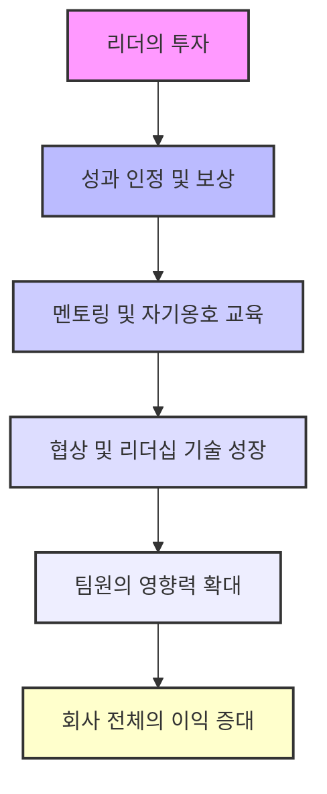
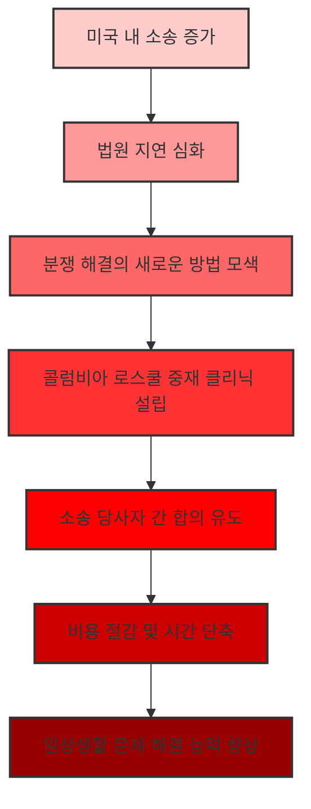

## 1. 협상이란 무엇일까? 
협상은 단순히 돈을 흥정하는 게 아니라, 우리 삶의 관계를 원하는 방향으로 이끄는 과정이다.

### 1.1. 협상에 대한 오해와 진실 
사람들은 협상을 영화 <울프 오브 월스트리트>처럼 테이블을 치며 싸우는 모습으로 오해하는 경우가 많다. 
하지만 이런 모습은 일상적인 협상과는 거리가 멀다. 
협상은 단순히 돈을 주고받는 거래가 아니다. 

### 1.2. 카약 비유로 배우는 협상의 본질 

저자는 신혼여행 중 카약을 타다가 협상의 본질을 깨달았다. 
남편과 카약 방향을 두고 다투다 세 번이나 뒤집혔는데, 그때 가이드가 "저쪽 해변으로 협상해서 가자"고 말했다. 
이때 '협상'이라는 단어가 '방향을 잡고 나아가는 것'이라는 의미로 다가왔다. 
마치 카약을 저어서 원하는 해변으로 가는 것처럼, 협상은 우리 삶의 관계를 원하는 방향으로 이끄는 과정이다. 
이 깨달음 이후 저자는 모든 대화에서 협상의 기회를 보게 되었다. 

### 1.3. 조종(Steering)과 조작(Manipulation)의 차이 

협상을 '조종(steering)'이라고 하면, 혹시 상대를 '조작(manipulation)'하는 것과 헷갈릴 수 있다. 
하지만 둘은 목표와 의도에서 큰 차이가 있다. 
1. **조작(Manipulation)**:
  - 보통 나쁜 의도로 상대를 속이거나 이용하려는 것을 의미한다. 
  - 하지만 미켈란젤로가 흙을 '조작'하여 멋진 예술 작품을 만들었듯이, '조작'은 재료를 능숙하게 다루는 것을 뜻하기도 한다. 
2. **조종(Steering)**:
  - 내가 통제할 수 있는 것(노 젓는 힘, 파도 관찰 등)에 집중하고, 통제할 수 없는 것(바람, 물결)은 받아들이는 것이다. 
  - 상대를 속이거나 나쁜 상황에 빠뜨리는 것이 목표가 아니다. 
  - 협상은 관계를 중요하게 생각하는 '관계 스포츠'와 같다. 
  - 상대방의 목표도 함께 고려하여, 나도 좋고 상대방도 좋은 '윈-윈' 결과를 만드는 것이 목표다. 

## 2. 협상 성공을 위한 첫걸음: 나 자신과의 협상 (거울 단계) 
협상은 상대방과 마주 앉기 전에, 먼저 나 자신과 하는 대화에서 시작된다. 마치 거울을 보며 나를 들여다보는 것과 같다. 

### 2.1. 왜 나 자신과의 협상이 중요할까? 

많은 리더들이 협상 준비를 소홀히 하고, 자존심 때문에 관계를 망치는 경우가 많다. 
협상에서 공격적이거나 지배하려는 태도를 보이는 것은 종종 '두려움'이나 '불확실성'에서 비롯된다. 
나 자신과의 협상(거울 단계)은 이런 두려움을 없애고, 내가 진정으로 원하는 것이 무엇인지 명확히 하는 과정이다. 

### 2.2. 거울 앞에서 던져야 할 5가지 질문 

협상에 들어가기 전에 스스로에게 던져야 할 중요한 질문들이 있다. 이 질문들은 마치 나침반처럼 우리가 올바른 방향으로 나아가도록 돕는다. 

1. **내가 풀고 싶은 진짜 문제는 무엇일까?** 
  - 이 질문은 모든 성공의 시작이다. 문제를 제대로 정의하지 않으면 아무리 노력해도 엉뚱한 곳으로 가게 된다. 
  - **예시: 애플 아이팟과 아이폰** 
  - 스티브 잡스는 처음 아이팟을 만들었을 때, 사람들이 음악을 듣기 위해 아이팟, 일정 관리를 위한 팜 파일럿, 이메일을 위한 블랙베리를 따로 들고 다니는 것을 보았다. 
  - 그는 '음악을 들을 수 있는 기기'라는 문제를 너무 작게 정의했음을 깨달았다. 
  - 진짜 문제는 '모든 것을 하나로 해결할 수 있는 기기'였고, 이것이 아이폰의 탄생으로 이어졌다. 
  - 커리어** 협상에 적용**: 새로운 직업을 구할 때, 단순히 '돈'만 생각하는 것이 아니라, '내 커리어에서 어떤 문제를 해결하고 싶은가?', '어떤 기술을 발휘하고 싶은가?'를 생각해야 한다. 
  - **혁신에 적용**: 기업가라면 '다른 사람들이 아직 해결하지 못한 문제는 무엇인가?'를 고민하는 것이 혁신의 시작이다. 

2. **내가 정말로 필요한 것은 무엇일까?** 
  - 우리의 모든 행동은 '필요'에서 비롯된다. 자신의 필요를 아는 것이 협상력의 원천이다. 
  - 필요는 크게 두 가지로 나눌 수 있다. 
  - 유형적** 필요 (**Tangibles**)**: 만지고, 보고, 셀 수 있는 것들이다. 
  - 예시: 연봉, 직책, 인력 지원, 휴가 일수 등. 
  - 무형적** 필요 (**Intangibles**)**: 삶을 가치 있게 만드는 가치나 원칙들이다. 
  - 예시: 성장, 존중, 자율성, 의미 있는 일, 인정 등. 
  - 이것들이 충족되지 않으면 아무리 돈을 많이 받아도 불행할 수 있다. 
  - **자율성 예시**: 저자는 자율성이 가장 중요한 무형적 필요라고 말한다. 아무리 좋은 조건이라도 자율성이 없으면 만족할 수 없다. 
  - **구체화하기**: '성장'이나 '자율성' 같은 무형적 필요를 '어떤 모습일까?'라고 구체적으로 질문해야 한다. 예를 들어, '자율성은 나에게 어떤 모습일까?'라고 물어보면, '회사가 큰 방향을 제시하고 나를 믿고 맡기는 것'과 같이 구체적인 답을 얻을 수 있다. 
  - 이 질문을 통해 연봉 외에 다른 중요한 가치들을 발견하고, 그것들을 협상에 활용할 수 있다. 

3. **나는 어떤 감정을 느끼고 있을까?** 
  - 협상에서는 감정을 다루는 것이 매우 중요하다. 사람들은 비즈니스 상황에서 감정이 없거나 없어야 한다고 생각하지만, 모두가 감정을 느낀다. 
  - 자신의 감정을 인정하고 기록하면, 감정이 우리를 지배하지 않도록 할 수 있다. 
  - 감정은 의사결정에 중요한 영향을 미치므로, 자신의 감정을 아는 것은 문제 해결의 실마리가 될 수 있다. 
  - **부모 역할에 적용**: 아이가 말을 듣지 않아 화가 날 때, '왜 이렇게 화가 나지?'라고 자책하기보다 '내가 어떤 감정을 느끼고 있지?'라고 비판 없이 질문하면, 더 현명하게 대처할 수 있다. 
  - '왜 이렇게 못했을까?' 같은 질문은 죄책감에 빠지게 하지만, '내가 어떤 감정을 느끼고 있지?'는 비판 없이 현재를 파악하고 앞으로 나아갈 힘을 준다. 

4. **과거에 이와 비슷한 상황을 어떻게 성공적으로 해결했을까?** 
  - 사람들은 협상에 들어가기 전에 과거의 실패나 미래의 불확실성에 집중하여 자신감을 잃는 경우가 많다. 
  - 이 질문은 두 가지 강력한 효과를 준다. 
  - 파워 프라임** (**Power Prime**)**: 과거의 성공 경험을 떠올리는 것만으로도 뇌에 긍정적인 영향을 주어, 다음 협상에서 더 좋은 성과를 낼 가능성이 높아진다. 
  - 데이터 생성: 과거의 성공 사례를 분석하면, 내가 어떤 전략을 사용했을 때 가장 효과적이었는지 알 수 있다. 
  - **적용 방법**:
  - **직무 **협상** 예시**: 승진을 원하는 사람이 '나는 이 상황에서 어떻게 해야 할지 모르겠다'고 할 때, '처음 이 직업을 어떻게 얻었는가?'라고 질문하면, '회사의 비전을 믿고 기여할 수 있다고 설득했다'는 답을 얻을 수 있다. 이것이 바로 승진을 위한 청사진이 된다. 
  - **새로운 상황에 적용**: 만약 완전히 새로운 상황이라면, 직접적인 경험이 없더라도 비슷한 성공 경험을 찾아본다. 
  - 저자는 책을 홍보할 때, 남편의 선거 캠페인을 성공적으로 이끌었던 경험에서 전략을 얻었다. 
  - 암을 이겨내거나, 배우자를 잃고 홀로 아이들을 키운 경험이 있다면, 그 경험에서 얻은 강인함과 전략을 새로운 사업을 시작하는 데 적용할 수 있다. 
  - 이 질문은 자신감을 높이고, 나만의 성공 전략을 찾도록 돕는다. 

5. **첫 번째 단계는 무엇일까?** 
  - 사람들은 종종 모든 단계를 한 번에 해결해야 한다는 압박감에 사로잡혀 시작조차 하지 못한다. 
  - 하지만 대부분의 위대한 리더나 성공적인 기업, 스포츠팀은 '한 번에 한 걸음씩' 나아간다. 
  - 우리는 일주일 안에 할 수 있는 일을 과대평가하고, 1년, 2년, 3년 안에 할 수 있는 일을 과소평가하는 경향이 있다. 
  - 이 질문은 당장 시작할 수 있는 작은 행동에 집중하게 하여, 완벽하지 않아도 일단 시작하도록 돕는다. 
  - **저자의 책 집필 경험**: 저자는 교수, 중재자, 아내, 엄마로서 바쁜 와중에도 딸의 수영 시합장이나 공항에서 15분씩 글을 써서 책을 완성했다. 
  - **아이디어 기록**: 좋은 아이디어가 떠올랐을 때, 완벽하게 다듬으려 하지 말고 일단 휴대폰에라도 기록하는 것이 중요하다. 
  - 작은 변화들이 모여 엄청난 결과를 만들어낼 수 있다. 

## 3. 협상 성공을 위한 두 번째 단계: 상대방과의 협상 (창문 단계) 
거울을 통해 나 자신을 들여다봤다면, 이제 창문을 통해 상대방을 이해하고 함께 나아갈 방법을 찾아야 한다.

### 3.1. '왜(Why)' 대신 '무엇(What)'과 '말해줘(Tell me)'를 사용하라 

질문은 협상의 핵심이다. 특히 '왜'라는 질문 대신 '무엇'이나 '말해줘'를 사용하는 것이 중요하다. 

1. **'왜' 질문의 문제점**:
  - '왜 그랬어?'라고 물으면 상대방은 방어적으로 변하고, 변명하거나 자신을 정당화하려 한다. 
  - 사회복지 분야 연구에서도 '왜' 질문은 사람들을 방어적으로 만들고 제한적인 정보만 얻게 한다고 지적한다. 
  - 스스로에게 '왜 나는 월급을 더 받지 못했을까?'라고 묻는 것도 과거에 갇히게 하여 도움이 되지 않는다. 
2. **'무엇'과 '말해줘' 질문의 힘**:
  - **'말해줘(Tell me)'**: 가장 넓은 범위의 질문으로, 상대방에게 가장 많은 정보를 얻을 수 있게 하고 동시에 신뢰를 쌓는다. 
  - **예시: 여행 후 친구에게**: "여행 어땠어?"(닫힌 질문) 대신 "여행에 대해 말해줘."(열린 질문)라고 물으면 훨씬 풍부한 이야기를 들을 수 있다. 
  - **예시: 자녀에게**: "학교에서 좋은 하루 보냈니?" 대신 "학교에서 있었던 일에 대해 말해줘."라고 물으면 더 많은 대화를 이끌어낼 수 있다. 
  - **예시: 직장 평가**: "이 평가가 지난 한 해를 잘 반영한다고 생각하나요?" 대신 "지난 한 해 회사에서의 경험에 대해 말해줘요. 어떤 점이 어려웠고, 어떤 점이 쉬웠나요? 회사가 당신의 목표 달성을 위해 무엇을 도울 수 있을까요?"라고 물으면 더 많은 정보를 얻고 더 나은 해결책을 찾을 수 있다. 
  - **'무엇(What)'**: '왜' 대신 '무엇'을 사용하면 상대방이 방어 대신 분석하고 진단하게 만든다. 
  - **예시: 의사결정**: "왜 그런 결정을 내렸나요?" 대신 "그 결정에 어떤 것들이 영향을 미쳤나요? 그 결정에 대해 말해줘요."라고 물으면, 상대방은 자신의 결정을 정당화하기보다 분석하고 설명하게 된다. 
  - **예시: **거절** 이유**: "왜 우리에게 거래를 주지 않았나요?" 대신 "우리 제품에 대해 어떤 우려 사항이 있으신가요?"라고 물으면, 상대방은 솔직하게 문제점을 이야기하고 함께 해결책을 찾을 수 있다. 
  - 이런 질문들은 상대방의 감정을 자극하지 않고, 더 많은 정보와 협력적인 분위기를 조성한다. 

### 3.2. '아니요(No)'를 들었을 때의 대처법 

'아니요'라는 대답은 누구에게나 어렵지만, 특히 여성들은 '아니요'를 자신의 가치에 대한 평가로 받아들이는 경향이 있다. 
하지만 '아니요'는 대부분 당신에 대한 것이 아니다. 

1. **'아니요'의 의미**:
  - 정보 부족: 상대방이 당신의 제안을 이해할 정보가 아직 없을 수 있다. 
  - 잘못된 사람: 당신이 잘못된 사람에게 제안했을 수 있다. 
  - 타이밍 문제: 지금이 적절한 시기가 아닐 수 있다. 
  - **통계적 무의미**: 한두 번의 '아니요'는 통계적으로 의미 있는 데이터가 아니다. 더 많은 시도를 통해 배우고 개선해야 한다. 
2. **'아니요'를 '예'로 바꾸는 마법의 **질문**: "어떤 점이 우려되시나요?"** 
  - '왜 안 되나요?'라고 묻는 대신, "어떤 점이 우려되시나요?"라고 물으면 상대방은 방어적이지 않고 솔직하게 자신의 걱정을 이야기한다. 
  - **저자의 책 홍보 경험**: 2020년 팬데믹으로 책 홍보 일정이 모두 취소되었을 때, 저자는 좌절했지만 이 질문을 사용했다. 
  - 어떤 곳은 "직원이 없어서 가상 이벤트를 운영할 수 없다"고 했다. 저자는 "제 팀이 줌 링크를 제공하고 운영을 도와드리면 어떨까요?"라고 제안하여 '예스'를 얻었다. 
  - 다른 곳은 "이 시기에 협상에 집중하고 싶어 할지 모르겠다"고 했다. 저자는 "어떻게 하면 그걸 알아낼 수 있을까요?"라고 물었고, 설문조사 결과 사람들이 협상을 원한다는 것을 알게 되어 '예스'를 얻었다. 
  - 이 질문은 '아니요'를 '행동 계획'으로 바꾼다. 상대방의 우려를 알면, 그 우려를 해결할 방법을 찾을 수 있기 때문이다. 

### 3.3. 어려운 사람과 협상하는 방법 

협상 상대가 공격적이거나 비협조적일 때도 당황하지 않고 대처하는 방법이 있다. 

1. **대화 재시작**:
  - 상대방이 화를 내거나 흥분하면, "잠시 멈추고 다시 생각해볼까요?"라고 제안한다. 
  - "당신이 생각하는 저의 목표는 무엇인가요? 제가 생각하는 목표는 당신을 속이거나 이용하는 것이 아닙니다. 우리는 함께 무엇을 할 수 있을까요?"라고 말하며 대화의 초점을 재설정한다. 
  - '나(I)' 대신 '당신(You)'과 '우리(We)'를 사용하여 상대방의 입장을 이해하고 함께 해결책을 찾으려는 태도를 보인다. 
2. **상대방의 말을 요약하기**:
  - 상대방이 화를 내거나 불평할 때, 질문을 멈추고 상대방의 말을 그대로 요약해준다. 
  - "당신은 이 네 가지에 대해 화가 나 있군요. 첫째, 이것이 싫고, 둘째, 저것이 마음에 안 들고, 셋째, 이것은 말도 안 되고, 넷째, 이것은 당신의 필요를 충족시키지 못하는군요. 제가 놓친 것이 있나요?" 
  - 상대방은 자신의 말을 들으면서 감정이 가라앉고, 당신이 자신을 이해하려 한다는 것을 느끼게 된다. 
3. **존중하며 대화 중단하기**:
  - 이런 노력에도 불구하고 대화가 생산적이지 않다면, "오늘은 생산적인 대화를 하기 어려울 것 같습니다. 저는 당신에게도 가치를 제공하는 해결책을 찾고 싶습니다. 준비가 되면 다시 연락 주세요."라고 말하며 대화를 중단한다. 
  - 이것은 여전히 당신이 대화를 '조종'하고 있다는 것을 보여주며, 상대방에게 생각할 시간을 주고 존중을 표하는 방법이다. 

### 3.4. 관계를 해치지 않고 요구하는 '나-우리(I, We)' 공식 

협상에서 자신의 요구를 말하는 것이 관계를 해칠까 봐 걱정하는 경우가 많다. 하지만 '나-우리(I, We)' 공식을 사용하면 관계를 유지하면서도 효과적으로 요구할 수 있다. 

1. **'**나-우리**' 공식이란?**:
  - "이것은 제가 요청하는 것입니다(I), 그리고 이것이 우리 모두에게 어떻게 도움이 될 것입니다(We)." 
  - 자신의 요구를 명확히 하면서도, 그 요구가 상대방이나 회사 전체에 어떤 이점을 가져다줄지 설명하는 것이다. 
2. **적용 방법**:
  - 승진**/연봉 **협상: "저는 이 회사에서 오랫동안 일하고 싶고, 리더십 자리로 성장하고 싶습니다. 지난 한 해 동안 X, Y, Z와 같은 성과를 냈고, 앞으로도 회사에 더 큰 가치를 제공할 수 있습니다. 저의 전문성과 기여에 걸맞은 보상을 받는다면, 저는 회사에 더 큰 열정으로 기여하고, 이는 결국 회사의 성장으로 이어질 것입니다." 
  - **어려운 시기에도 적용 가능**: 경제적으로 어려운 시기에도 이 공식을 활용할 수 있다. "지금은 힘든 시기이지만, 제가 X라는 성과를 냈고, 저에게 투자하는 것이 회사에 더 큰 이익을 가져다줄 것입니다." 
3. **여성들에게 특히 중요한 이유**:
  - 여성들은 종종 자신의 가치를 낮게 평가하고, 요구하는 것을 주저하는 경향이 있다. 
  - 하지만 자신의 가치를 당당하게 요구하는 것은 이기적인 행동이 아니라, 다른 여성들에게도 본보기가 되고 더 많은 기회를 만드는 일이다. 
  - 당신이 협상하는 방식은 당신이 어떤 리더가 될지, 그리고 회사에 어떤 가치를 가져다줄지를 보여주는 것이다. 

## 4. 협상력을 높이는 추가 전략 
협상력을 높이기 위한 몇 가지 추가적인 전략들이 있다.

### 4.1. 강점에서 시작하라 

경력이 짧거나 경험이 부족하다고 느껴질 때도 자신의 강점에서 시작하는 것이 중요하다. 

1. **자신의 강점 파악**:
  - 학교에서 리더십을 발휘했거나 팀을 이끌었던 경험 등, 현재 직무와 관련된 모든 경험을 강점으로 활용할 수 있다. 
  - **저자의 교수 임용 경험**: 저자는 법대 교수로 지원할 때, 법대 강의 경험은 없었지만, 변호사로서 고객들에게 강의하고 멘토링했던 경험을 강점으로 내세웠다. 
2. **솔직함과 비전 제시**:
  - 없는 경험을 꾸며내지 말고, 자신의 강점을 솔직하게 인정하고 미래에 대한 비전을 제시한다. 
  - 저자는 면접에서 "가장 경력이 많은 사람은 아니지만, 학생들의 경험에 가장 가깝고, 이 프로그램을 30년 이상 이끌 에너지와 비전을 가진 사람"이라고 자신을 소개했다. 
3. **질문을 많이 하라**:
  - "회사는 이 역할을 어떻게 보고 있나요?", "이 역할에서 최고의 성과는 어떤 모습일까요?", "이 역할의 최우선 과제는 무엇인가요?"와 같은 질문을 통해 더 많은 정보를 얻고, 자신을 더 효과적으로 어필할 수 있다. 
  - 모든 것을 알 필요는 없다. 중요한 것은 자신이 모르는 것을 인정하고 배우려는 태도이다. 

### 4.2. 감정적 방해물 다루기: 두려움과 죄책감 

협상에서 '분노', '짜증', '좌절' 같은 감정은 종종 '두려움'과 '죄책감'이라는 두 가지 감정을 숨기고 있다. 

1. **두려움과 죄책감의 작용**:
  - **직장 피드백 상황**: 직원이 피드백에 대해 화를 내거나 방어적일 때, 그 안에는 '내 미래는 어떻게 될까?'라는 두려움과 '내가 더 잘할 수 있었는데'라는 죄책감이 숨어 있을 수 있다. 
  - **육아 상황**: 자녀가 스크린을 너무 많이 볼 때 부모가 화를 낸다면, 그 안에는 '아이가 독서를 싫어하게 될까 봐'라는 두려움이나 '내가 일을 너무 많이 해서 아이와 시간을 못 보내는 건 아닐까'라는 죄책감이 있을 수 있다. 
2. **대처 방법**:
  - 자신이나 상대방이 분노를 느낄 때, "내가 무엇을 두려워하고 있지?", "내가 무엇에 대해 죄책감을 느끼고 있지?"라고 질문한다. 
  - 이러한 근본적인 감정을 인식하면, 감정에 휩쓸리지 않고 더 현명하게 상황을 해결할 수 있다. 

### 4.3. 리더의 역할: 팀원에게 투자하고 권한 부여하기 

리더는 팀원들이 스스로를 옹호하고 가치를 인정받도록 돕는 것이 중요하다. 

1. **성과에 대한 선제적 보상**:
  - 뛰어난 성과를 내는 팀원, 특히 스스로 요구하는 데 주저하는 여성이나 이민자 배경의 팀원들에게 리더가 먼저 나서서 보상을 제공해야 한다. 
  - "당신은 승진할 자격이 있습니다"라고 말하며 그들의 가치를 인정해주는 것이다. 
2. **멘토링을 통한 역량 강화**:
  - 팀원들에게 스스로를 옹호하는 방법과 협상 기술을 가르쳐야 한다. 
  - 이는 팀원들의 협상 및 리더십 기술을 성장시키고, 그들이 회사에 더 큰 영향력을 발휘하도록 돕는다. 
  - 결과적으로 팀원들이 권한을 부여받으면, 그들의 영향력이 커지고 회사 전체의 이익으로 이어진다. 

## 5. 콜럼비아 로스쿨 중재 클리닉의 교훈 
저자가 콜럼비아 로스쿨 중재 클리닉에서 얻은 경험은 협상 기술이 일상생활에서 얼마나 중요한지 보여준다.

### 5.1. 중재 클리닉의 역할 

콜럼비아 로스쿨 중재 클리닉은 1990년대 중반에 설립되었다. 
이는 미국 내 엄청난 수의 소송과 법원의 긴 지연에 대한 대응이었다. 
사람들이 문제를 해결하는 더 나은 방법을 찾을 필요가 있다는 인식에서 시작되었다. 
클리닉은 이미 법원에 계류 중인 사람들이 양측 모두에게 이익이 되는 합의를 찾도록 돕는다. 
이를 통해 소송 비용과 시간을 절약하고, 사람들이 다시 중요한 일상으로 돌아갈 수 있도록 한다. 

### 5.2. 고난도 분쟁에서 얻은 협상 질문의 힘 

저자는 클리닉에서 사람들이 이미 실패한, 감정적이고 복잡한 고난도 분쟁을 해결하도록 돕는다. 
이러한 중재 과정에서 저자가 던지는 질문들이 사람들의 마음을 열고 합의에 도달하게 하는 핵심적인 역할을 했다. 
저자는 이 질문들을 일반인들이 더 일찍 알게 되어, 문제가 법정까지 가기 전에 스스로 해결하고 삶을 더 나은 방향으로 이끌 수 있기를 바란다. 
결국, 이 책은 중재자의 관점에서 본 협상에 대한 통찰을 담고 있으며, 고난도 분쟁에서 효과적이었던 질문들을 일상생활에 적용할 수 있도록 돕는다. 

