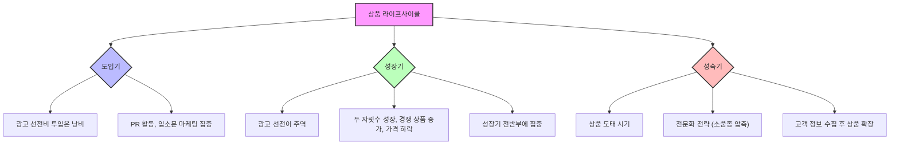
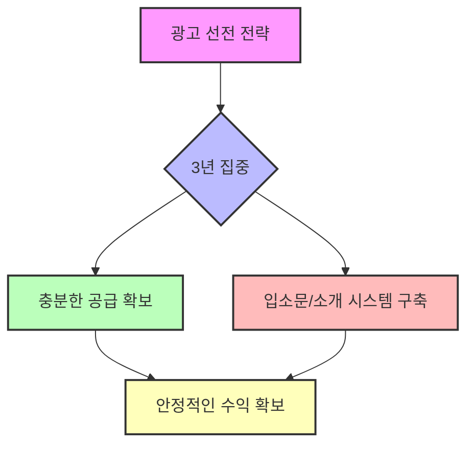

## 책 소개
이 책은 '입소문 전염병'이라는 제목처럼, 고객들이 자발적으로 우리 제품이나 서비스를 주변에 알리도록 만드는 방법을 알려주는 책이야. 간다 마사노리 작가는 마케팅의 신이라고 불릴 정도로 이 분야의 전문가인데, 이 책을 통해 입소문 마케팅의 잘못된 상식을 깨고, 어떻게 하면 사람들이 우리 이야기를 하고 싶어 안달 나게 만들 수 있는지 구체적인 전략을 제시해 줘. 단순히 제품이 좋다고 입소문이 나는 게 아니라, 의도적으로 '화젯거리'를 만들고, 고객의 감정을 움직여서 그들이 우리 회사의 홍보 요원이 되도록 하는 실천적인 방법을 배울 수 있을 거야.

## 본문 정리

## 1. 입소문에 대한 다섯 가지 잘못된 상식 깨기 
사람들이 입소문에 대해 흔히 가지고 있는 생각들이 사실은 틀린 경우가 많아. 마치 우리가 당연하다고 생각했던 것들이 알고 보면 전혀 다른 진실을 가지고 있는 것처럼 말이야. 이 책에서는 입소문에 대한 다섯 가지 상식이 사실은 잘못된 고정관념이라고 말해줘.

1. **고객 만족도가 높으면 입소문이 날까?** 
  - **아니, 그렇지 않아.** 고객이 만족하는 건 당연하다고 생각하기 때문이야.
  - **기대치를 높이면** 고객은 '뭐, 당연한 거 아니야?'라고 생각하고, 다른 사람에게 굳이 이야기하고 싶어 하지 않아.
  - **입소문은** 사람들이 엄청난 감정적인 자극을 받았을 때, 즉 기대 이상의 놀라움을 경험했을 때 생기는 에너지 소모가 큰 행동이야.
  - **전략적으로 기대치를 낮추는 것이 중요해.** 전혀 기대하지 않았는데 예상 밖의 서비스를 받으면, 사람들은 감동하고 흥분해서 주변에 이야기하고 싶어 지는 거지.

2. **상품이 좋으면 입소문이 날까?** 
  - **아니, 이것도 아니야.** 상품이 좋다는 것만으로는 입소문이 나지 않아.
  - **사람들은 익숙한 것에 에너지를 적게 써.** 예상했던 것과 비슷하면 주의를 기울이지 않지.
  - **낯설거나 신기한 경험이 중요해.** 고객이 매장에 들어서자마자 '와, 여기 너무 신기하다!'라고 느끼면서 감정의 균형이 무너질 때, 그때 비로소 집중하고 정보를 흡수하게 돼.
  - **기대와 현실의 '갭'이 놀라움을 만들어.** 기대는 낮았는데 현실은 훨씬 좋아서 그 차이를 크게 느낄 때, 사람들은 그 놀라움을 다른 사람에게 전달하고 싶어 해. 마케팅 메시지로 과장하면 오히려 실망만 안겨줄 수 있어.

3. **나쁜 입소문일수록 빨리 퍼질까?** 
  - **아니, 꼭 그렇지는 않아.** 물론 나쁜 소문이 빠르게 퍼지는 경우도 있지만, 생각보다 사람들이 우리 회사의 나쁜 소문에 그렇게까지 관심이 많지 않아.
  - **사람들은 자기 자신에게 가장 관심이 많아.** 다른 회사가 파산하든 말든, '오늘 저녁 뭐 먹지?', '내일 뭐 하지?' 같은 자기 일상에 더 신경을 쓴다는 거지.
  - **과잉 반응은 금물.** 나쁜 소문에 너무 걱정해서 과잉 반응하면 오히려 불필요한 이슈를 만들 수 있어. 냉정하게 대처하는 것이 중요해.

4. **입소문은 고객이 퍼트리는 것이다?** 
  - **아니, 핵심은 회사 내부 직원들이야.** 물론 고객도 퍼트리지만, 입소문의 진원지는 바로 회사 직원들이라는 거야.
  - **직원들이 회사에 대한 정보를 모르면** 고객은 화젯거리로 삼을 수 없어.
  - **고객의 칭찬을 직원들에게 들려줘.** 고객이 회사에 대해 칭찬한 내용을 적극적으로 모아서 직원들에게 공유하면, 직원들은 자기가 하는 일에 보람을 느끼고 소명감을 갖게 돼.
  - **직원들이 집에서 자랑하게 만들어.** "아빠, 오늘 이런 일이 있었는데, 우리 고객이 내가 해준 서비스 덕분에 문제를 해결했다고 편지를 보냈지 뭐야!" 이런 식으로 직원들이 자발적으로 회사 이야기를 퍼트리게 되는 거지.

5. **입소문은 최고의 홍보 매체다?** 
  - **아니, 업종에 따라 달라.** 입소문이 잘 나는 업종(여행, 호텔, 레스토랑, 영화 등)이 있는 반면, 입소문이 나기 어려운 업종(성형외과, 장례식 등)도 있어.
  - **숨기고 싶거나 알리고 싶지 않은 비즈니스.** 이런 업종에서는 입소문만 믿고 홍보할 수 없어.
  - **입소문이 어려운 업종을 위한 **전략**:**
  - **가볍게 이야기할 수 있는 상품을 만들어.** 성형외과라면 제모나 치아 미백처럼 남에게 말해도 부끄럽지 않은 상품을 중심으로 화젯거리를 만드는 거야.
  - **여러 사람이 함께 이용하도록 유도해.** 그룹 할인처럼 여러 명이 함께 이용하면 입소문이 나기 쉬워져.
  - **도움이 되는 정보를 제공해.** 장례식장이라면 '반드시 알아야 할 장례 절차' 같은 정보를 쉽게 정리해서 나눠주면, 사람들이 어려운 상황에서 도움받은 경험을 주변에 이야기하게 돼.
  - **화젯거리가 될 만한 대상을 만들어.** 장아찌에 돌을 넣으면 맛이 오래간다거나, 밥을 시켰는데 가마솥까지 같이 주는 것처럼, 상품 자체는 평범해도 사람들이 놀랄 만한 요소를 추가하는 거지.
  - **특정 타이밍을 활용해.** 입학, 성년의 날, 꽃가루 알레르기 시즌처럼 사람들이 특정 시기에 관심을 가질 만한 화젯거리를 만드는 거야.

## 2. 고객이 말하고 싶어지는 회사를 만드는 방법 
고객들이 우리 회사 이야기를 하고 싶어 입이 근질근질하게 만들려면 어떻게 해야 할까? 단순히 좋은 제품을 만드는 것을 넘어, 고객의 감정을 움직이고 그들의 내면 깊숙한 욕구를 건드려야 해.

1. **불행이나 재난을 활용한 **스토리텔링 
  - **사람들은 불행이나 재난에 집중해.** 생존 본능 때문에 사건을 상상하는 것만으로도 뇌가 활성화돼.
  - **내 일이 아니면 행복해져.** 다행히 내가 겪은 일이 아니면, 사람들은 마음 놓고 흥미롭게 관전하게 돼.
  - **기업의 불행을 극복 스토리로 만들어.** 만약 우리 회사에 어처구니없는 불행(예: 공장 화재)이 닥쳤다면, 이를 숨기기보다 오히려 사람들에게 알리고 극복하는 모습을 보여주는 거야.
  - **고객의 응원을 이끌어내.** 사람들은 처음에는 관심을 가졌다가, 회사가 당당하게 어려움을 헤쳐나가는 모습을 보면서 응원하고 주변에 소문을 퍼트리게 돼.

2. **극적인 이야기로 고객을 주인공으로 만들어라** 
  - **뇌는 이야기를 좋아해.** 사람들은 이야기 속 주인공이 되어 그 상황을 상상하고 몰입하는 경향이 있어.
  - **롤러코스터 같은 스토리를 만들어.** 우리 회사가 큰 목표를 가지고 노력했지만, 시련과 좌절을 겪고, 그러다 새로운 방법을 찾아 결국 성공했다는 해피엔딩 스토리를 들려주는 거야.
  - **불신감을 없애고 친근감을 높여.** 시련과 좌절을 솔직하게 오픈하면, 사람들은 경계심을 풀고 '이 사람도 나랑 비슷하구나' 하면서 동질감을 느껴.
  - **직원들에게도 신화를 만들어줘.** 직원들에게도 회사의 역경 극복 스토리를 들려주면, 그들은 회사에 몰입하고 자부심을 느끼며 회사 이야기를 퍼트리게 돼.

3. **'적'을 만들어서 고객과 똘똘 뭉쳐라** 
  - **적이 없으면 미션도 없는 거야.** 우리 회사가 무엇을 위해 존재하고, 무엇을 단호하게 거절하는지 명확한 미션이 있어야 해.
  - **고객과 함께 싸울 '적'을 설정해.** 예를 들어, 퍼스널 브랜딩 회사라면 '자신의 정체성과 가치를 인정하지 않는 사회', '인간을 부품처럼 여기는 조직', '콘텐츠를 비웃는 부정적인 시선', '은퇴 후의 불안감' 등을 적으로 설정할 수 있어.
  - **고객의 내면의 불만을 자극해.** 고객들이 그동안 억눌려왔던 불만이나 불안감을 적으로 표현하고, 우리 회사가 그 적과 싸워 이길 수 있도록 돕는 동료가 되어주는 거지.
  - **고객에게 용기와 열정을 심어줘.** "여러분, 초반에는 부족하더라도 우리 콘텐츠를 통해 세상에 메시지를 알리고 가치를 전달합시다! 나중에 그 사람들한테 우리 본때를 보여줍시다!"라고 말하며 고객의 의지를 북돋아 주는 거야.

4. **고객의 내면 욕구를 알아차려 공감하라** 
  - **공감은 내면의 욕구에서 시작돼.** 겉으로 드러나는 표면적인 욕구(명시적인 것)가 아니라, 고객의 마음속 깊이 숨겨진 본심(내면의 욕구)을 상상하고 파악해야 해.
  - **"이 회사는 내 마음을 알아주는구나!"** 고객이 이렇게 느끼면, 진정성을 알아주고 응원하며 입소문을 내게 돼.
  - **고객의 감정(분노, 불만, 불안, 질투, 꿈, 기쁨)을 파악해.** 이 감정의 모멘텀을 잡아서 해소해주거나 강화해주면 입소문으로 이어질 수 있어.
  - **칭찬과 격려로 자부심을 높여줘.** 고객이 자신의 아이디어나 콘텐츠에 대해 자부심과 만족감을 느끼도록 "정말 멋집니다! 훌륭합니다!"라고 칭찬하고 격려해 주는 거야.
  - **콘텐츠의 가치를 확신시켜줘.** "고객님의 콘텐츠는 진짜 많은 사람에게 도움이 될 거예요!"라고 말하며 그들이 만든 것의 가치를 스스로 확신하게 만들어.

5. **고객을 '주인공'으로 만들어라** 
  - **고객이 히어로가 되게 해.** 고객이 우리 회사를 통해 성공하고 변화된 경험을 마치 자신이 영웅이 된 것처럼 이야기하고 다니게 만드는 거야.
  - **우리 회사를 잊지 못하게 해.** 고객이 스스로를 주인공으로 느끼면 우리 회사를 잊지 않고 계속해서 이야기하게 돼.

6. **'줄'을 만들어서 안달 나게 하라 (한정 마케팅)** 
  - **공급을 줄여서 희소성을 높여.** 사람들이 줄을 서게 만들고, 그 줄이 다른 사람들에게 '나도 갖고 싶다'는 욕구를 불러일으키게 하는 거야.
  - **유명 빵집의 **전략**.** 일부러 좌석을 적게 만들어서 사람들이 줄을 서게 하면, 그 줄이 또 다른 사람들을 끌어모으는 효과를 내기도 해.

7. **'커뮤니티'를 만들어 소속감을 느끼게 하라** 
  - **비슷한 고객들끼리 모이게 해.** 입소문은 자기가 대접받고 인정받았을 때, 그리고 자신과 비슷한 사람들이 모여 있을 때 더 잘 나.
  - **꿈의 고객을 명확히 한정해.** 우리가 사귀고 싶은 고객, 꼭 모셔야 할 고객을 명확히 정하고, 그 외의 고객은 과감히 포기하는 것이 중요해.
  - **최고의 대접을 해줘.** 소수의 꿈의 고객에게 집중해서 최고의 서비스를 제공하면, 그들의 만족감은 극대화되고 자연스럽게 입소문으로 이어져.
  - **모든 고객을 사랑하려 하지 마.** 모든 고객을 사랑하려 하면 결국 누구도 사랑할 수 없게 돼.

## 3. 입소문 전염을 위한 여섯 가지 핵심 키 
입소문을 막연하게 생각하지 말고, 구조적이고 시스템적으로 전파하기 위한 여섯 가지 구체적인 환경 설정 키가 있어. 마치 전염병이 퍼져나가듯 입소문이 확산되도록 만드는 시스템이라고 보면 돼.

1. **누구에게 방울을 달아줄까? (전염시키는 사람)** 
  - **킹 팬(King Fan) 또는 **허브**(Hub)를 찾아.** 입소문을 가장 효과적으로 퍼트릴 수 있는 핵심 인물을 찾아야 해.
  - **과거에 고객을 소개해 준 사람.**
  - **소개를 통해 고객이 된 사람.**
  - **영향력 있는 정보 발신자 역할.** (예: 인플루언서, 커뮤니티 리더)
  - **양치기가 양에게 방울을 달아주듯.** 제일 앞에 가는 양에게 방울을 달아주면 다른 양들이 그 소리를 따라가듯, 핵심 인물에게 먼저 감동을 주면 입소문이 증폭될 수 있어.

2. **어떤 상품으로 입소문을 퍼트릴까? (**입소문** 나는 상품)** 
  - **말 전하기 게임에 적합한 상품.** 복잡하거나 이해하기 어려운 상품보다는 알기 쉽고, 구입하기 쉬워서 많은 사람들이 빠르게 써볼 수 있는 상품이어야 해.
  - **부트캠프 프로그램이나 콘텐츠 제작 프로세스.** 사람들이 직접 경험하고 변화를 느낄 수 있는 상품이 입소문에 유리해.
  - **콘텐츠나 서비스 샘플.** 사람들이 쉽게 경험해보고 놀라움을 느낄 수 있는 샘플도 좋은 상품이 될 수 있어.

3. **어떤 장소에서 화제로 삼을까? (이야기하는 장소)** 
  - **고객들이 우리 상품을 이야기할 만한 맥락을 파악해.** 전화 통화, 레스토랑 식사, 등산, 술자리, 친척 모임, 주부 모임, 집들이 등 다양한 상황을 고려해야 해.
  - **온라인 커뮤니티 내부.** 팬덤 퍼널처럼 온라인 플랫폼 안에서 수업을 듣는 사람들끼리 자연스럽게 이야기를 나눌 수 있는 장소도 중요해.

4. **어떤 계기로 화제를 꺼내게 될까? (**진실의 순간**)** 
  - **트리거(Trigger)를 만들어.** 사람들이 굳이 상품 이야기를 하지 않는데, 어떤 계기로 우리 회사 이야기를 꺼내게 될까?
  - **최우수 고객의 질문.** 예를 들어, 집들이에서 "어떤 회사에서 이 아파트를 지었어?" 같은 질문이 나왔을 때, 고객이 자랑스럽게 우리 회사를 이야기할 수 있도록 하는 거야.
  - **콘텐츠 발행 후 좋은 반응.** 고객이 만든 콘텐츠가 좋은 반응을 얻거나 칭찬을 받았을 때, "이런 좋은 콘텐츠, 어디서 얻었어?"라는 질문에 우리 회사를 언급하게 되겠지.
  - **다른 사람을 도와주면서 보람을 느꼈을 때.** "네가 이렇게 콘텐츠를 만들게 된 계기는 뭐야?"라는 질문에 우리 회사를 소개할 수 있어.

5. **무슨 말로 이야기하게 할까? (전달되는 메시지)** 
  - **고객의 언어로 상품을 팔게 해.** 고객 인터뷰를 통해 "왜 우리 회사를 선택했나요?", "어떤 강점과 단점이 있나요?" 같은 질문을 해서 고객이 직접 우리 회사를 설명하는 언어를 찾아야 해.
  - **20초 이내로 간단하게 설명할 수 있는 메시지.** 상대방의 흥미를 끄는 시간이 짧기 때문에, 초등학생도 직감적으로 이해할 수 있는 상품 설명을 만들어야 해.
  - **"나만의 정체성과 가치를 발견하고 표현할 수 있는 콘텐츠를 제공해 줬어."**
  - **"삶의 경력에 도움이 되는 콘텐츠와 서비스를 찾고 있다면 여기 가봐."**

6. **어떤 도구를 제공해 줄까? (영업 사원 도구)** 
  - **휴대 가능하고 쉽게 전달할 수 있는 매개체.** 입소문이 한 번으로 끝나지 않고 계속 파도를 타려면, 고객이 다른 사람에게 빠르게 전달할 수 있는 도구가 필요해.
  - **전단지, 브로셔, 시제품, 체험판.**
  - **휴대 가능한 샘플, 지갑에 넣을 수 있는 카드 안내서.**
  - **쉽게 공유할 수 있는 디지털 콘텐츠.** (예: 성공 사례 동영상, 상세 후기 링크)
  - **소셜 미디어 캠페인, 추천 프로그램, 제휴 마케팅.**

## 4. 입소문과 매출을 동시에 올리는 다섯 가지 실천 프로그램 
입소문을 단순히 퍼트리는 것을 넘어, 실제 매출 증대로 이어지게 하려면 구체적인 실천 프로그램이 필요해. 이 다섯 가지 단계를 통해 입소문과 매출이라는 두 마리 토끼를 모두 잡을 수 있을 거야.

1. **고객의 목소리를 모아 뉴스레터로 발행하라** 
  - **직원들의 사기를 높여.** 고객의 칭찬이나 감동 사례를 모아서 직원들에게 전달하면, 직원들은 보람을 느끼고 회사에 대한 소속감이 높아져.
  - **친근한 톤으로 뉴스레터를 만들어.** 고객의 소리뿐만 아니라 회사의 근황, 재밌는 에피소드 등을 담아서 친밀감을 형성해.
  - **오래 알고 지낸 회사처럼 느끼게 해.** 뉴스레터를 통해 회사 정보를 자주 접하게 되면, 고객들은 마치 예전부터 알고 지냈던 친한 회사처럼 느끼게 돼.
  - **매출 증가와 **입소문** 전파의 연쇄 반응.** 고객의 목소리를 잘 수집하고 편집하여 뉴스레터 형식으로 발행하면, 매출 증가와 입소문 전파가 동시에 일어날 수 있어.

2. **휴대 가능한 입소문 전염 도구를 만들어라** 
  - **주변에 곤란한 사람에게 건네줄 수 있는 도구.** 예를 들어, 뉴스레터 마지막 부분에 "주변에 퇴직 후 일거리를 찾는 분이 있다면 저희 회사를 소개해주세요" 같은 소개 글을 부탁하는 거야.
  - **소개 카드, 명함, 스티커, 마그넷.** 고객이 쉽게 휴대하고 다른 사람에게 전달할 수 있는 물리적인 도구를 만들어.
  - **손편지를 곁들인 감사 선물.** 소개해 준 사람에게는 금전적인 보상보다는 마음이 담긴 손편지나 할인 상품권 같은 선물을 제공해.

3. 소책자를 만들어** 노하우를 공유하라** 
  - **회사의 주요 프로세스나 노하우를 담아.** 일반 책자보다 획기적인 노하우나 상품 구매 판단 기준이 담긴 소책자를 만들어 고객에게 제공해.
  - **고객이 솔루션에 익숙해지게 해.** 소책자를 통해 고객은 우리 회사의 솔루션에 익숙해지고, 이를 다른 사람에게 전달해 줄 수도 있어.
  - **대화체로 친근하게 작성해.** 작가가 직접 이야기하는 듯한 느낌으로 대화체로 작성하면 고객들이 더 쉽게 몰입할 수 있어.
  - **고객의 목소리를 대량으로 모아 수직제(수직적인 책자)를 만들어.** 이것 자체가 입소문이 나게 하고, 고객의 다음 구매를 유도할 수 있어.

4. **오프라인 이벤트를 개최하여 결속력을 높여라** 
  - **온라인의 한계를 넘어 직접 만나게 해.** 온라인 부트캠프만으로는 부족해. 오프라인 이벤트는 사람들이 서로 부대끼며 진한 교류를 할 수 있는 기회를 제공해.
  - **기독교의 예배와 같은 역할.** 오프라인 이벤트는 조직 구성원이라는 것을 확인시키고, 멤버들 사이의 결속력을 높여줘.
  - **새로운 신자를 권유하는 장소.** 열정적인 팬들이 모여 생생한 경험을 공유하고, 그 열정을 다른 사람에게 전달하여 새로운 고객을 모으는 수단이 돼.
  - **브랜드를 확립하고 열성팬을 만드는 과정.** 오프라인에서 직접 만나 교류하는 것은 브랜드를 확립하고 열광적인 팬을 만드는 데 필수적이야.

5. **입소문을 원한다면 화젯거리를 제공하라** 
  - **작용과 반작용의 법칙.** 돈을 원하면 돈을 주고, 고객을 원하면 고객에게 베풀고, 정보를 원하면 정보를 제공해야 해.
  - **놀라움과 감동을 줘.** 입소문을 원한다면 사람들이 '이건 정말 대단해!', '이건 꼭 알려야 해!'라고 생각할 만한 놀라움이나 감동을 제공해서 입이 근질근질하게 만들어야 해.

## 5. 변화에 대한 대응력: 우물 파는 일을 중단하라 
세상은 끊임없이 변하고 있는데, 과거의 성공 방식에만 매달리면 결국 실패하게 돼. 마치 물이 마른 우물을 계속 파는 것처럼 말이야. 변화에 대한 대응력을 키우는 것이 중요해.

1. **변화 대응력의 중요성** 
  - **성공과 실패의 차이는 능력 차이가 아니야.** 머리가 좋고 나쁘거나 노력의 문제가 아니라, 변화에 얼마나 잘 대응하느냐에 달려 있어.
  - **과거의 성공에 갇히지 마.** 승리하는 조직은 변화를 즐기고, 과거의 원칙이나 성공 경험을 깨끗하게 포기할 수 있는 확신과 용기가 있어.
  - **패배하는 조직은 환상에 젖어.** 과거의 연장선상에서 계속 경쟁하려 하지만, 결국 체력만 소모할 뿐이야.

2. 우물** 파는 일을 중단하라** 
  - **마른 우물을 계속 파는 것은 무의미해.** 과거에는 실적이 나빠도 노력하면 대가를 얻을 수 있었지만, 지금은 노력해도 얻는 것 없이 체력만 소진될 뿐이야.
  - **새로운 수맥을 찾아야 해.** 물이 나오지 않는 우물을 계속 파는 것을 멈추고, 밖으로 나와 주변을 둘러보면 풍부한 새로운 수맥을 발견할 수 있을 거야.
  - **간단한 결정을 내리지 못하는 함정.** 많은 회사와 개인들이 마약처럼 중단하지 못하고 마른 우물을 계속 파는 함정에 빠져 있어. (예: 효과 없는 전단지 광고를 계속하는 것)

3. **고객이 원하는 것을 판매하라** 
  - **내가 팔고 싶은 것이 아니라, 고객이 원하는 것을 팔아야 해.** 이것이 장사의 핵심이야.
  - **가전제품 판매점의 사례.** 대형 매장과의 가격 경쟁에서 어려움을 겪던 가전제품 판매점이 문을 닫는 최악의 상황을 가정하고, 기존 고객 데이터베이스를 활용해 건강식품 통신 판매를 시작했어.
  - **고객 데이터베이스는 최대의 자산.** 구매 이력, 가족 구성원, 생애 주기까지 입력된 고객 데이터는 합법적으로 현금을 인쇄할 수 있는 '현금 인쇄기'와 같아.
  - **리스크 없는 신규 사업.** 기존 고객의 신뢰를 바탕으로 새로운 사업에 도전하면, 본업도 활성화시키면서 변화를 즐길 수 있어.

## 6. 상품 라이프사이클에 따른 영업 전략 
모든 상품에는 인간의 삶처럼 '라이프사이클'이 있어. 도입기, 성장기, 성숙기로 나뉘는데, 각 시기에 맞는 영업 전략을 사용해야 해. 마치 아기가 태어나서 자라고 늙어가는 과정에 맞춰 돌봐주는 방식이 다른 것처럼 말이야.

1. 도입기**: 돈을 허공에 날리지 마라** 
  - 광고 선전비** 투입은 낭비.** 이 시기에는 아무리 좋은 상품이라도 사람들이 잘 모르기 때문에, 광고를 해도 인지시키는 데 엄청난 비용과 시간이 들어.
  - **대기업에 맡겨라.** 막대한 자본을 가진 대기업이 아니라면, 이 시기에 광고에 큰돈을 쓰는 것은 비효율적이야.
  - **PR 활동과 **입소문** 마케팅에 집중해.** 신문, 방송 등 매체에 기사화되도록 PR 활동에 중점을 두거나, 입소문 마케팅을 실천하는 것이 최선의 방법이야.

2. 성장기**: 광고 선전의 황금기** 
  - **광고 선전이 고객을 끌어모으는 주역.** 이 시기에는 광고비가 많이 들지만, 매출이 높고 소비자의 반응도 좋아서 충분히 만회할 수 있어.
  - 성장기** 판단 기준:**
  - 두 자릿수 성장이 지속되는가?
  - 경쟁 상품이 급격히 증가하기 시작했는가?
  - 가격이 하락하기 시작했는가?
  - **성장기 전반부에 집중해.** 중소기업이 광고 선전을 효과적으로 활용할 수 있는 시기는 성장기 전반부에 불과해. 이 시기를 놓치면 위험한 투자가 될 수 있어.

3. 성숙기**: 전문화와 시스템 구축** 
  - **상품 도태 시기.** 이 시기에는 대기업들이 본격적인 전쟁에 돌입하고, 중소기업은 광고에 돈을 쏟아부어도 효과를 보기 어려워.
  - 전문화** **전략**.** 상품을 소품종으로 압축하여 전문화를 모색함으로써 광고 선전 효과를 다시 높일 수 있어. (예: 유니클로가 겨울 외투 한 벌만 크게 광고하는 것처럼)
  - **판매 상품은 다양하게, 광고 상품은 압축.** 매장에는 여러 종류의 상품이 있어도 상관없지만, 광고할 때는 특정 상품에 집중해서 효율을 높이는 거야.
  - 고객 정보** 수집 후 상품 확장.** 도장 판매 회사가 도장을 통해 고객 정보를 수집한 다음, 문구, 건강식품, 선호 임용까지 판매하는 것처럼, 성숙기에는 효율적으로 고객 정보를 수집하고 상품 종류를 늘려가는 것이 중요해.
  - 입소문** **소개 시스템** 구축.** 성장기에 고객을 확보해두고, 경기가 좋을 때부터 입소문 소개 등 비용이 들지 않는 시스템을 구축해두는 것이 가장 안정적으로 수익을 확보할 수 있는 방법이야.

## 7. 광고 선전은 3년 안에 끝내라 
광고 선전은 매우 중요하지만, 영원히 할 수는 없어. 마치 단거리 경주처럼, 정해진 기간 안에 최대한의 성과를 내고 다음 단계를 준비해야 해.

1. **광고 중단을 전제로 한 경영.** 광고 선전의 목적은 광고 선전비 없이도 성장하는 회사를 만드는 것이어야 해.
2. **잘 나갈 때 준비해라.** 경기가 좋을 때, 즉 물이 솟아나는 한순간을 잘 활용해서 충분한 고객을 확보하고, 그때부터 입소문 소개 시스템을 구축해 나가야 해.
3. **육체적 한계를 넘어 고객을 모으는 수단.** 광고는 자신의 육체적인 한계를 넘어 24시간 고객을 모을 수 있는 효과적인 수단이야.
4. **흐름에 맞는 수단 사용.** 상품에는 흐름이 있기 때문에, 그 흐름에 따라 고객을 불러모으는 수단을 적절하게 사용해야 해. 무의미한 투자를 할 필요는 없어.
5. 입소문** 시스템 구축의 중요성.** 광고 선전 반응이 끊겨도 입소문과 소개만으로 충분히 고객을 모을 수 있는 비즈니스 태세를 갖추는 것이 중요해.

