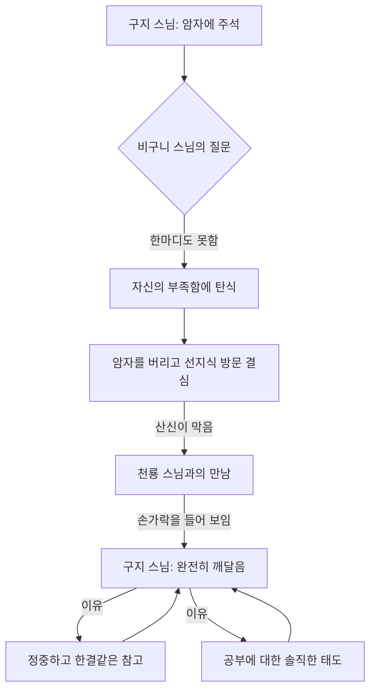

## 1. '그런 깨달음은 없다'는 책, 대체 무슨 이야기를 하는 걸까?
이 책은 우리가 흔히 생각하는 '깨달음'에 대한 환상을 깨부수는 내용을 담고 있어. 저자는 깨달음이 특별한 상태나 노력을 통해 얻는 것이 아니라, 우리 모두가 이미 가지고 있는 '자연스러운 상태'라고 말해. 마치 우리가 숨 쉬는 것처럼 자연스러운 건데, 우리가 쓸데없는 생각과 욕심 때문에 그걸 못 보고 있다는 거지. 이 책은 깨달음을 향한 모든 노력이 오히려 우리를 진실에서 멀어지게 한다고 주장하며, 우리 안팎의 우주를 더 잘 이해할 수 있도록 돕는 안내서이자 현대 영적 수행 풍토에 대한 철학적 비판서라고 할 수 있어.

### 1.1. 저자 U.G. 크리슈나무르티는 어떤 사람일까? 

1. **어릴 적부터 영적인 스승으로 키워진 사람이야.**
  1. 1918년 인도 브라만 집안에서 태어나 고전적인 힌두 문헌을 중심으로 엄격한 교육을 받았어. 
  2. 그의 집안 사람들은 그가 전생에 깨달음에 근접했다고 믿어서, 그를 장차 구루(영적인 스승)가 될 사람으로 키웠지. 
  3. 다양한 영적 스승들과 공부하고 요가 명상을 하며, 자신이 접한 수행과 가르침들을 비판적으로 검토하면서 청소년기를 보냈어. 
  4. 마드라스 대학에서 심리학, 자연과학, 철학 등을 폭넓게 공부하며 깨달음의 상태가 무엇인지 알아내려고 필사적으로 노력했어. 
  5. 동양의 영적 지혜를 서구에 소개하는 신지학회(1875년 블라바츠키 부인이 창설한 단체)의 인기 강연자가 되기도 했어. 
2. 지두** 크리슈나무르티와의 만남과 '**재난**' 같은 변화를 겪었어.**
  1. 1940년대 후반, 그는 지두 크리슈나무르티를 만났어. 지두도 어릴 때부터 구루가 되도록 키워진 인물이었지만, 둘이 만날 즈음에는 이미 구루 역할을 거부하고 있었지. 
  2. 두 사람은 7년 동안 매일 만나 진리의 본성을 탐구했지만, 서로의 차이점을 해결하지 못한 채 헤어졌어. 
  3. 1961년에 이르러 그는 자기 삶을 더 이상 통제하지 못한다고 느끼기 시작했고, 아무 목적도 없이 가족 곁을 떠나 런던으로 갔어. 
  4. 그는 당시 상황을 "나는 아무것도 알지 못하는 상태에서 몇몇 사람의 도움으로 살아가는 부랑자나 다름없었습니다. 내게 아무 의지도 없었습니다. 내가 뭘 하고 있는지도 알지 못했습니다. 나는 미친 거나 다름없었습니다."라고 설명했어. 
  5. 이 시기는 6년간 계속되었고, 그는 "그 상태는 뭐지?"라는 의문에 강렬하게 빠져들었어. 
  6. 49살이 되던 해, 스위스 공원 벤치에서 마침내 그가 '재난'이라고 부르는 현상을 체험했어. 
  7. "내가 그 상태라는 걸 내가 어떻게 알지?"라는 의문이 사라지자, 신체적인 변화가 일어나 일주일간 지속되었고, 몸의 모든 세포에 영향을 미쳤다고 해. 
  8. 이후 생각의 연속성에 대한 환상과 자기 중심체에 대한 감각을 상실하는 과정을 겪었어. 
3. **'**안티 구루**'로 불리며 기존의 깨달음을 비판했어.**
  1. 그는 자신의 상태를 '인간의 자연스러운 상태'라고 부르며, 깨달음을 우리 문화가 만들어낸 '환상'으로 설명했어. 
  2. 이 자연스러운 상태에 이르기 위해 할 수 있는 것은 아무것도 없으며, 오히려 그런 상태를 지향하는 모든 움직임이 우리를 멀어지게 한다고 단호하게 역설했지. 
  3. 영적인 기법, 스승, 개념, 단체를 모두 거부하며, 특히 깨달음과 깨달은 스승을 우상화하고 신비화하는 것을 조롱하며 강렬한 독설을 쏟아냈어. 그래서 '안티 구루'라고 불리기도 해. 
  4. 그는 "자신의 상상 속에서만 존재하는 상태를 찾는 일에 많은 시간과 에너지를 쏟지 말라"고 당부했어. 
  5. 그는 공개 강연은 하지 않지만, 자신을 찾아오는 사람들과는 만났고, "자신은 사람들에게 전할 어떤 메시지도 갖고 있지 않다"고 말했어. 

### 1.2. '깨달음'에 대한 흔한 오해들 

1. **깨달음은 특별한 상태나 초능력이 아니야.**
  1. 사람들은 깨달음을 해탈, 해방, 대자유 같은 말로 표현하며, 때로는 섹스 쾌감을 능가하는 깊은 희열이나 지복(최고의 행복)을 동반하는 것으로 인식하기도 해. 
  2. 하지만 저자는 깨달음이 잡생각이 사라지고 사랑으로 가득하게 되는 상태, 혹은 초능력이나 신비 체험과 같은 것이 아니라고 말해. 
  3. 그는 자신이 다른 이들의 과거, 현재, 미래를 훤히 알 수 있었고, 몸에서 성광(성스러운 빛)이 일고 눈꺼풀이 깜빡이지 않으며, 성기에서 에너지가 머리로 올라오는 등의 이상한 체험을 했지만, 그런 현상들을 깨달음과 전혀 결부시키지 않았어. 
  4. 이런 것들은 일시적인 현상일 뿐이며, 본질적인 자연스러운 상태와는 아무 관련이 없다고 강조했어. 
2. **생각을 없애는 것이 깨달음이라는 오해는 큰 사기야.**
  1. 많은 구루(영적인 스승)들이 수행을 통해 골칫거리인 생각을 없앨 수 있다고 말하지만, 저자는 이를 '큰 사기'라고 비판했어. 
  2. 생각은 생명의 근원과 하나라서 절대로 없앨 수 없다고 해. 
  3. 다만 우리가 본래의 자연스러운 상태에 들어서면, 생각은 저절로 느려지면서 제 리듬을 따라 흘러가게 된다는 거야. 
  4. 생각을 없애려고 하는 것 자체가 또 다른 생각이고, 그것이 바로 거짓이라고 말해. 
3. **깨달음은 노력이나 수행으로 얻을 수 있는 것이 아니야.**
  1. 사람들은 명상, 요가, 참선, 고행 등 온갖 방편을 사용해서 깨달음에 들려고 하지만, 저자는 이런 것들이 아무 소용이 없다고 말해. 
  2. 오히려 이런 행위들은 자아(에고)를 강화시켜주는 역할만 할 뿐이라고 해. 
  3. 중국이나 한국의 선사들도 자신을 뜯어고쳐 다른 무엇인가가 되려는 '되어감'의 길을 배격하고, 막바로 근원을 밝히라고 가르쳤어. 
  4. 저자는 모든 스승의 말과 가르침은 '헛소리'라고 단언하며, 외부의 어떤 힘도 우리를 도와줄 수 없다고 강조해. 
  5. 우리가 할 수 있는 일은 아무것도 없으며, 모든 노력이 끝나버린 '완전한 항복' 상태에서 비로소 자유가 찾아온다고 말해. 

### 1.3. '자연스러운 상태'란 무엇일까? 

1. **우리 모두가 이미 가지고 있는 본래의 상태야.**
  1. 저자가 이야기하는 '자연스러운 상태'는 그의 상태나 신의 상태, 깨달은 사람의 상태가 아니라, 바로 '여러분 자신의 자연스러운 상태'라고 해. 
  2. 이 상태는 인간과는 무관하게 그냥 일어나는 것이며, 우리가 하려고 마음먹는다고 해서 되는 것이 아니야. 
  3. 마치 우리가 숨 쉬는 것처럼, 태어나는 것처럼 자연스러운 것이지. 
2. **자신이 뭘 보고 있는지 알지 못하는 '**알아차림**'의 상태야.**
  1. 자연스러운 상태에서는 자신이 뭘 보고 있는지 알지 못하는데, 그것이 바로 '알아차림'이라고 해. 
  2. 만일 자신이 뭘 보고 있는지 알고 있다면, 우리는 '존재하게' 되고, 이미 알고 있는 낡은 것을 다시 체험하게 될 뿐이라는 거야. 
  3. 이 상태에서는 생각들이 서로 연결되지 않고, 생각이 일어날 때마다 폭발하며, 생각의 연속성이 끊어지고, 생각은 자체의 자연스러운 리듬에 따라 흘러가. 
  4. 마치 물이 흐르듯이 자연스러운 리듬에 따라 모든 것이 흘러가는 상태라고 보면 돼. 
3. **'나'라는 **자아** 연속성이 사라진 상태야.**
  1. 이 상태에서는 생각의 연속성에 대한 환상과 자기 중심체에 대한 감각을 상실하게 돼. 
  2. '나'라는 자아 연속성이 사라진 상태를 '자연스러운 상태'라고 부르며, 종교적이고 관념화된 깨달음과 구분했어. 
  3. 만약 우리가 평생 단 한 번, 1초라도 알아차림의 상태에 있을 수 있다면, '나'라는 연속성은 끊어지고, 체험 구조가 빚어낸 망상, 곧 '나'라고 하는 것은 부서져 버리고 모든 것이 자연스러운 리듬에 따라 흘러갈 거야. 
  4. 이 상태는 '나'라고 부르는 것, 즉 더 높은 자아, 낮은 자아, 영혼, 아트만, 의식과 잠재의식 등 '나'와 관련된 모든 것을 모조리 없애 버릴 거야. 

## 2. 깨달음은 '나'를 버려야만 얻을 수 있는 거야 

### 2.1. 왜 많은 사람이 '슬쩍' 깨닫고 멈춰 설까? 
1. **완전히 깨닫는 사람은 극히 드물어.**
  1. 동자(어린 제자)가 손가락을 들어 보인 것을 보고 깨달은 사람들도 있었지만, 그들은 이름이 언급되지 않아. 
  2. 진짜 제대로 깨달았다면 이름이 소개되지만, '문득 깨달았다', '안목이 열렸다' 정도면 사실 '슬쩍' 깨달은 분들일 가능성이 커. 
  3. 요즘 시대에도 열심히 수행한 20~30년 경력의 공부인(수행자)들 중 '슬쩍' 깨달은 분들이 많아. 
  4. 본인 스스로도 완전히 깨쳤는지 물어보면, '분명하다', '현저하다'고 완전히 자유로운 사람은 굉장히 적다고 해. 
2. **'나'를 버리기 싫어서 완전히 깨닫지 못하는 거야.**
  1. 많은 사람들이 열심히 노력하고 법문(가르침)도 잘 이해하지만, 완전히 깨닫지 못하고 멈춰 서는 이유는 '나'를 버리기 싫어서라고 저자는 생각해. 
  2. 사람들은 깨닫고 싶어 하지만, 정작 위기 상황이나 안 좋은 상황이 오면 도망갈 '뒷구멍'을 만들어 놔. 
  3. 이 '뒷구멍'은 부귀, 명예, 사랑, 자식 등 '나'와 관련된 모든 것들이야. 
  4. 결국 사람들은 '나'라는 실체를 붙들고서 깨달음을 얻으려고 하는데, '나'라는 실체는 없어야만 진정한 깨달음을 만날 수 있어. 
  5. '나'라는 실체가 80점 정도 남아있으면, 눈앞의 실체 없음(진리)은 20점밖에 안 보인다는 거지. 

### 2.2. '나'를 완전히 포기해야만 진정한 자유가 찾아와 

1. **깨달음은 '나'를 완전히 포기할 때 오는 거야.**
  1. 사람들은 깨달은 사람처럼 화려하고 존경받는 사람이 되고 싶어 하지만, 그런 분들은 오히려 '나'를 버렸기 때문에 그렇게 된 거야. 
  2. 진리는 '고정적 실체로서의 자아는 없다'는 단순한 사실인데, 사람들은 실체를 가지고 깨달음을 취하고 싶어 해. 
  3. 자식에 대한 애착처럼, '나'와 관련된 모든 애착은 결국 '나'라는 존재성 때문에 생기는 거야. 
  4. 이런 애착들은 일찍부터 놓았어야 하는 것인데, 20~30년 붙들고 있으면 쉽게 놓을 수 없게 돼. 
  5. 결국 '나'라는 존재를 완전히 내려놓고, 비워내야만 진리가 우리를 덮치고 진리가 우리를 부리게 돼. 
2. **진정한 공부는 '태도와 자세'의 문제야.**
  1. 공부는 얼마나 경전이나 어록을 열심히 봤느냐가 아니라, '마음 하나'와 제대로 계합(하나가 됨)하기 위한 '태도와 자세'가 정말 중요해. 
  2. 구지 스님은 비구니 스님에게 한마디도 못 한 것에 대해 엄청나게 부끄러워하고 참회하는 마음을 가졌어. 
  3. 그는 신변을 정리하고 모든 것을 버리고 공부하러 가겠다는 '대결심'을 내렸는데, 이런 결심을 내는 사람이 진짜 공부인(진정으로 공부하는 사람)이야. 
  4. 대부분의 사람들은 자신이 못한 것에 대한 이유를 다른 곳으로 돌리지만, 구지 스님은 솔직하게 자기 자신을 인정하고 꾸준히 참고(정진)했어. 
  5. 이런 태도와 자세, 그리고 노력까지 곁들여져야만 깨달음의 기연(계기)이 크게 온다고 해. 
3. **자유는 공짜가 아니지만, '나'를 버리면 공짜가 돼.**
  1. '자유는 공짜가 아니다(freedom is not free)'라는 말처럼, 자유를 얻기 위해서는 '나'를 내던져야 해. 
  2. 가장 소중하다고 생각하는 '나'라는 실체 중심의 집착을 확 내던져야만 자유가 찾아와. 
  3. 하지만 '나'를 버린다면, 그때부터는 '자유는 공짜다(freedom is free)'가 돼. 
  4. '나'를 완전히 버린다면, 그 모든 자유를 공짜로 누릴 수 있고, 그것이 드러나는 것을 스스로 확인해야 해. 
  5. 결국 '나'를 선택할 것인지, 아니면 '눈앞(진리)'을 선택할 것인지 둘 중 하나를 솔직하게 선택해야 한다고 저자는 강조해. 

## 3. 깨달음은 '지식'이나 '경험'이 아니라 '자연스러운 상태' 그 자체야 

### 3.1. 지식과 경험은 깨달음과 아무 관련이 없어 
1. **우리가 경험하는 모든 것은 '지식'의 결과물이야.**
  1. 우리는 벤치처럼 단순한 것도 있는 그대로 경험할 수 없어. 경험하는 것은 단지 그것에 관해 갖고 있는 '지식'일 뿐이야. 
  2. 이 지식은 늘 외부에서 들어오고, 자신의 것이 아니라 남의 것이지. 
  3. 아무리 특이하고 심오한 체험이라 해도, 그것은 의식에 저장된 '앎'의 일부일 뿐이야. 
  4. 우리가 태어나기 전에 인류가 경험한 모든 것이 의식의 일부를 이루고 있으며, 그 모든 것은 '오물'과 같다고 해. 
  5. 결국 우리가 체험하는 모든 것은 '생각'이 빚어낸 것이고, 지식이 없다면 경험할 수 없으며, 경험은 다시 지식을 강화시켜주는 악순환에 불과해. 
2. **새로운 경험이란 존재하지 않아.**
  1. 우리는 자신만의 체험이라고 부를 수 있는 어떤 것도 체험할 수 없어. 
  2. 아무리 심오한 체험을 했다 해도, 그것은 자기 의식의 일부인 '지식'의 결과물일 뿐이야. 
  3. 과거의 누군가가 열락지복(최고의 행복) 같은 것을 경험하고 그것을 무아경(자아를 잊은 경지)이라 불렀다면, 그런 경험은 우리의 의식의 일부가 돼. 
  4. 결국 새로운 경험이란 존재하지 않는다는 결론에 이를 수밖에 없어. 과거의 누군가가 경험했으니 그것은 자기 것이 아닌 셈이지. 
  5. 저자는 "만일 내가 열반(깨달음의 경지)을 경험했다고 칩시다. 그것이 과연 열반입니까? 그것은 내가 가지고 있는 지식이 만들어 낸 겁니다. 그것은 열반이 아니라 지식입니다."라고 말해. 
3. **우리는 '지식' 그 자체야.**
  1. 지식에서 해방되는 것은 쉬운 일이 아니야. 왜냐하면 '여러분이 바로 지식'이기 때문이야. 
  2. 이 지식은 우리가 이생에서 얻은 지식뿐만 아니라, 수천만 년 동안 쌓인 지식, 인류가 겪은 모든 경험을 아우르는 지식이야. 
  3. 우리가 누군가에게 의존하고 어떤 권위에 의존하는 한, 우리는 진정한 '개인'이 될 수 없어. 
  4. 모든 전통을 쓸어내 버려야 비로소 자기 자신이 될 수 있고, 그것이 바로 깨달음이며, 생전 처음으로 '개인'이 되는 것이라고 해. 

### 3.2. '현자'는 아무것도 추구하지 않고 그저 존재할 뿐이야 

1. **현자는 아무것도 추구하지 않아.**
  1. 성자(깨달음을 얻은 사람)는 사람들에게 이야기하고 가르치려 하지만, 현자(지혜로운 사람)는 분리되지 않은 의식 상태 속에 존재해. 
  2. 현자는 자기가 자유롭다는 것을 알지 못하며, 따라서 남들을 해방시켜 줘야 한다는 의무감 같은 것도 없어. 
  3. 그는 그냥 존재할 뿐이고, 그 상태에 관해 이야기하다가도 말이 사라져 버려. 
  4. 영적 수행을 통해서는 현자가 될 수 없고, 현자는 되고 싶다고 해서 되는 것이 아니야. 
  5. 현자는 제자를 둘 수 없고, 추종자를 거느릴 수도 없어. 왜냐하면 그것은 남들과 나눠 가질 수 있는 체험이 아니기 때문이야. 
  6. 현자는 모든 과거로부터 해방된 사람이기에 독창적이고 유일무이한 존재이며, 그의 행동이 과거의 그림자에 물들지도 않아. 
2. **모든 원함이 완전히 없는 상태가 바로 깨달음이야.**
  1. 깨달음은 링 안에 타월을 던지는 것 같은 '완전한 항복'이며, 거기서 나오는 것이 바로 '자유'야. 
  2. 그것은 우리가 할 수 있는 게 전혀 없다는 뜻이며, 전면적인 포기, 총체적인 무력함이야. 
  3. 모든 노력이 끝나버린 포기 상태이며, 뭔가를 얻으려는 의도가 내포된 모든 움직임이 끝나는 상태야. 
  4. 이런 원함, 저런 원함 할 것 없이 '모든 원함이 완전히 없는 상태'가 바로 그것이야. 
  5. 이 상태에서는 체험 같은 게 없고, 상상, 의지, 노력, 어떤 지향성을 가진 움직임이 전면적으로 부재해. 
  6. 사람들은 늘 돈, 권력, 섹스, 사랑, 신비 체험, 진리, 깨달음 등 무언가를 얻으려 하는데, 바로 이런 '추구'가 사람들을 자연스러운 상태에서 벗어나게 하는 것이라고 해. 

### 3.3. '나'를 버리면 '눈앞'이 스스로를 닦아 

1. **인위적인 노력과 수행은 쉬어져야 해.**
  1. 많은 수행자들이 자기 정진의 노력을 통해 깨달음을 얻은 후에야 인위적인 노력과 수행이 쉬어지는 거야. 
  2. 수행을 안 한다는 것이 아니라, 자연스럽게 멈춰지는 것이라고 해. 
  3. '한다, 안 한다'는 것은 어떤 개체(나)에 들어갔을 때의 일이지만, 눈앞으로 화련히(완전히) 펼쳐진다면 '한다 안 한다'가 아니야. 
  4. 그때는 '무수지수(하지 않으면서 하게 됨)'의 상태가 되어, 스스로를 닦는 경지까지 가게 돼. 
2. **'눈앞'이 스스로를 닦는 경지.**
  1. '눈앞'이 스스로를 닦는다는 것은 '닦음이 없는 닦음'이 벌어지고 있다는 의미야. 
  2. 이 경지에 가기 위해서는 되게 열심히 노력해야 해. 80점, 90점 정도의 노력이 필요하다고 해. 
  3. '나'라는 실체와 개체(개별적인 존재) 안에 머물러서는 이 경지에 도달할 수 없어. 
  4. '무수지수'의 상태가 되면 인위적인 수행은 멈춰지지만, 정화(깨끗해짐)는 계속 일어나. 
  5. 왜냐하면 자성(본래의 성품)이 닦고, 진여(진실한 본성)가 닦기 때문이야. 내가 수행하는 것이 아니라 진여 스스로 닦고 정화시켜 가는 거지. 
  6. 이때 눈앞의 안목(세상을 보는 능력)이 훨씬 더 크고 넓어지게 돼. 
  7. 사람들은 이런 사실을 잘 믿지 못하는데, 왜냐하면 '나'라는 존재와 실체를 벗어나 본 적이 없기 때문이야. 

## 4. 구지 스님의 손가락 선: '곧장'의 진리 

### 4.1. 구지 스님의 손가락 선 이야기 
1. **구지 스님은 질문을 받을 때마다 손가락 하나를 들었어.**
  1. 구지 스님은 무문관(선종의 공안집) 3칙 '구지수지(구지 스님이 손가락을 세우다)'로 유명한 스님이야. 
  2. 그는 질문을 받을 때마다 다만 하나의 손가락을 들 뿐이었어. 
  3. 어느 날, 구지 스님이 자리를 비운 사이 한 동자(어린 제자)가 찾아온 사람에게 스님처럼 손가락을 세워 보였어. 
  4. 구지 스님은 이 이야기를 듣고 칼로 동자의 손가락을 잘라버렸어. 
  5. 아픔에 울면서 도망가는 동자를 다시 불러 "무엇이 부처냐?"고 묻자, 동자가 손가락을 들려다가 문득 깨달았어. 
  6. 구지 스님은 세상을 떠날 때 "나는 천룡 스님에게서 한 손가락 선(깨달음)을 얻어 일생 동안 누리고도 다 누리지 못했다"고 말했어. 
2. **동자의 손가락을 자른 진짜 이유.**
  1. 동자가 구지 스님을 흉내 내어 손가락을 들었을 때, 누군가는 그것을 보고 깨달음을 얻기도 했어. 
  2. 그래서 동자가 마치 깨달은 사람처럼 소문이 날 수도 있었지. 
  3. 구지 스님은 동자가 자신을 흉내 내는 것을 보고, 칼로 손가락을 잘라버렸어. 
  4. 이것은 단순히 손가락을 자른 것이 아니라, 동자가 손가락이라는 '형태'에 집착하는 마음, 즉 번뇌(괴로움의 원인)와 분별심(구분하는 마음)을 단번에 잘라준 것이라고 볼 수 있어. 
  5. 동자가 피 흘리는 손가락을 들려다가 깨달았다는 것은, '손가락'이라는 형식에 갇혀 있던 마음이 사라지자마자 진리를 '곧장' 보게 된 것을 의미해. 

### 4.2. 손가락에는 뜻이 없어, '곧장'에 뜻이 있지 

1. **깨달음은 손가락 위에 있지 않아.**
  1. 무문(선승)은 "구지와 동자가 깨달은 곳은 손가락 위에 있지 않다"고 말했어. 
  2. 구지 스님은 손가락 선으로 유명하지만, 손가락에는 뜻이 없다는 거야. 
  3. 그럼 뜻은 어디에 있을까? 바로 '곧장'에 있어. 
  4. 구지 스님이 "무엇이 부처입니까?"라는 질문에 '곧장' 손가락을 들었고, 물은 사람도 구지 스님이 손가락을 '곧장' 든 것을 '곧장' 보았어. 이 '곧장'에 뜻이 있다는 거야. 
2. **'곧장'은 변하지 않는 진리야.**
  1. '곧장'에는 어떤 모양이나 형태, 소리, 내용물이 들어가지 않아. 만약 그런 것에 뜻이 들어갔다면 그것은 변하고 항상하지 않을 거야. 
  2. 오히려 뜻 없는 것에 뜻이 들어가야만 모든 경계(상황), 인연(관계), 상황에 따라서 발현될 수 있는 거지. 
  3. 손가락, 펜, 핸드폰, 물병 등 내용물은 변할 수 있지만, '곧장' 올린 것, '곧장' 본 것은 변하지 않아. 
  4. 이 '곧장'은 절대로 변하지 않는 것이며, 이 변하지 않는 것에서 진리의 근본을 찾아야 해. 
  5. '곧장'은 '문득', '홀연히'와 같은 말이야. 문득 손가락을 들고, 홀연히 손가락이 나타나는 것처럼 말이야. 
3. **'곧장'은 '눈앞'에서 펼쳐지는 거야.**
  1. '곧장'은 뭘 잡을 수가 없어. 문득이나 홀연히를 어떻게 잡을 수 있겠어? 규정하거나 의미를 부여할 수 없어. 
  2. '곧장'을 제대로 알려면, '내가 곧장이 되면 돼'. 내가 홀연히가 되면 되는 거지. 
  3. 하지만 '나'라는 실체를 붙들고 있다면, 내 생각으로 '곧장'을 잡아챌 수 있다고 착각한다면, '곧장'과 만날 수 없어. 
  4. '곧장'은 '눈앞'과 같은 말이야. 우리 존재 모두는 '곧장' 드러났고, '곧장' 말하고 듣고 있어. 
  5. '눈앞'은 변하지 않아. 눈앞에서 소리가 들리고, 모양이 나타났다가 사라지지만, '눈앞'은 바뀌지 않아. 
  6. '눈앞'은 원래부터 항상 존재했던 것이며, 늘어나거나 줄일 수도 없고, 더럽히거나 깨끗하게 할 수도 없으며, 태어나거나 사라지게 할 수도 없는 '불생불멸(나지도 죽지도 않음), 불구부정(더럽지도 깨끗하지도 않음), 부증불감(늘지도 줄지도 않음)'의 상태야. 
  7. '눈앞'을 정말로 이해하려면, '눈앞'을 이해하는 것이 아니라 '눈앞'을 만나야 해. 
  8. '눈앞'까지 진리는 따로 구할 수 없어. 다만 '망념(헛된 생각)'을 쉬는 것뿐이야. '나'라는 착각만 딱 쉬면, '눈앞'은 원래 '눈앞'으로 현전(드러남)하는 거지. 

## 5. 구지 스님의 깨달음: '정중하고 한결같은 참고'와 '솔직한 태도' 

### 5.1. 비구니 스님과의 만남과 구지 스님의 참회 
1. **비구니 스님의 시험에 한마디도 못 한 구지 스님.**
  1. 구지 스님은 무주 금화 사람으로, 천룡 스님의 제자였어. 천룡 스님은 마조 스님의 제자인 대매 법상 스님의 법제자 중 한 명이었지. 
  2. 구지 스님이 암자에 있을 때, 실제라는 비구니 스님이 찾아와서 사과(승려의 옷)도 벗지 않고 선상(선을 참고하는 자리)을 세 바퀴 돌면서 말했어. 
  3. "말할 수 있다면 사과를 벗겠어요." 즉, 진리 한마디를 말한다면 사과를 벗겠다는 뜻이었지. 
  4. 하지만 구지 스님은 한마디도 못 했어. 
  5. 날이 어두워지자 구지 스님이 하룻밤 머물도록 권했지만, 비구니 스님은 "말할 수 있다면 하룻밤 쉬어가지요"라고 다시 시험했고, 구지 스님은 또 말을 못 했어. 
  6. 결국 비구니 스님은 바로 떠나버렸어. 
2. **자신의 부족함을 솔직하게 인정한 구지 스님.**
  1. 비구니 스님이 떠나자마자 구지 스님은 "나는 장부(대장부)의 모습을 가지고서도 장부의 기상이 없구나"라며 탄식했어. 
  2. 당시 사회에서는 여성의 지위가 낮았고, 비구니는 더욱 미천하게 여겨졌을 가능성이 커. 
  3. 하지만 구지 스님은 그런 사회적 인식을 넘어, 비구니에게 한마디도 못 한 자신의 부족함을 솔직하게 인정했어. 
  4. 그는 "내가 도대체 뭐 했나, 대장부로 태어나서 이 법을 깨닫지도 못하고"라며 자존심이 상하고 부끄러워했지. 
  5. 결국 그는 분발하여 이 일을 밝히고자 암자를 버리고 여러 선지식(깨달은 스승)을 찾아 법문을 청하려고 신변을 정리했어. 
  6. 그날 밤 산신(산의 신령)이 나타나 "이곳을 떠날 필요가 없다. 내일 육신 보살(육체를 가진 보살)이 찾아와 스님을 위해 설법할 것이니 떠나지 마시오"라고 말하며 그를 막았어. 

### 5.2. 천룡 스님에게서 얻은 깨달음의 기연 
1. **천룡 스님의 손가락 하나에 완전히 깨달아.**
  1. 이튿날 천룡 스님이 암자에 이르렀고, 구지 스님은 그를 맞이하며 비구니 스님과의 일을 빠짐없이 이야기했어. 
  2. 구지 스님이 "도대체 어떻게 해야 합니까? 제가 무엇을 놓쳤습니까?"라고 간절하게 묻자, 천룡 스님이 손가락 하나를 싹 들어 보였어. 
  3. 그 순간 구지 스님은 갑자기, 즉 '문득' 완전히 깨쳤어. 
  4. 마치 석가모니 부처님이 새벽별을 보고 깨닫고, 서산대사가 닭 우는 소리에 깨닫고, 누군가는 기와장 깨지는 소리에 깨닫는 것처럼, 아무것도 아닌 것에 깨달음이 오는 거야. 
2. **'정중하고 한결같은 참고'가 깨달음을 이끌었어.**
  1. 구지 스님이 깨달을 수 있었던 이유는 그가 '정중하고 한결같이 참고(꾸준히 정진하고 탐구함)'했기 때문이야. 
  2. 그는 암자에서 그냥 시간을 보낸 것이 아니라, 매일같이 정진하고 부지런하게, 근면하게, 한결같이 진리가 무엇인가를 스스로 탐구했어. 
  3. 비구니 스님의 시험에 한마디도 못 했지만, 그 기연(계기)이 정말 중요했어. 
  4. 그는 당시 여성에 대한 낮은 인식을 넘어, 공부에 대해 솔직한 마음을 가졌고, 자기 자신을 인정하며 꾸준히 참고했기 때문에 법(진리)이 그에게 걸려든 거야. 
  5. 대부분의 사람들은 정진도 안 하고, 시대적 생각에 매몰되어 비구니를 무시하거나, 쉽게 포기해 버리지만, 구지 스님은 자기 스스로 엄청나게 부끄러워하고 참회하는 마음으로 모든 것을 정리하고 공부하러 가겠다는 '대결심'을 내렸어. 
  6. 이런 '태도와 자세'가 공부의 제일 중요한 점이며, 여기에 '한결같이 참고하는 노력'까지 곁들여져야만 깨달음의 기연이 크게 온다고 해. 

## 6. 무문의 송: 진리의 본분과 번뇌의 단절 

### 6.1. 구지는 용을 망신시키네: 진리의 본분에서 벗어난 '손가락 선' 
1. **왜 **구지** 스님은 **천룡** 스님을 망신시켰다고 할까?**
  1. 무문의 송(시)에는 "구지는 용을 망신시키네"라는 구절이 나와. 여기서 '용'은 천룡 스님을 의미해. 
  2. 천룡 스님은 구지 스님에게 깨달음을 주었고, 구지 스님은 그 깨달음을 평생 누렸지만 다 쓰지 못했다고 했어. 
  3. 천룡 스님 입장에서는 구지 스님이 깨달음을 얻고 널리 전하니 자랑스러워해야 할 것 같은데, 왜 망신시켰다고 했을까? 
  4. 이는 '진리의 본분(근본)' 상에서 그런 거야. 
  5. 깨달음, 즉 진리의 큰 뜻은 '손가락'에 있지 않아. 
  6. 하지만 구지 스님은 평생 동안 자신이 얻은 깨달음을 '손가락 선'이라고 지칭했어. 
  7. 손가락에 있지 않은데 '손가락 선'이라고 지칭하는 순간, 진리의 본뜻과는 멀어지는 거야. 
  8. 천룡 스님은 구지 스님에게 '손가락 선'을 건네준 적이 없는데, 구지 스님이 '손가락 선을 받았다'고 떠벌리고 다니는 셈이 되니, 진리의 본분 차원에서는 천룡 스님을 망신시킨 것이라고 볼 수 있어. 
  9. 진리는 '곧장 선', '문득 선', '홀연히 선'이라고 말해야 하지만, 사람들에게 전하기 어려우니 어쩔 수 없이 '손가락 선'이라고 한 것이지. 
  10. '문득', '홀연히', '곧장'은 써도 써도 다함이 없지만, '손가락'은 결국 사라지고 변하는 내용물일 뿐이야. 

### 6.2. 날카로운 그 칼은 동자를 시험하니: 번뇌의 단절 
1. **칼은 '예리한 **안목**'으로 번뇌를 잘라주는 거야.**
  1. 무문의 송에는 "날카로운 그 칼은 동자를 시험하니"라는 구절이 있어. 
  2. 구지 스님이 칼로 동자의 손가락을 잘랐다고 했지만, 이 '칼'은 물리적인 칼만을 뜻하지 않아. 
  3. 이 칼은 '예리한 기봉(날카로운 가르침)'과 '안목(세상을 보는 능력)'을 상징해. 
  4. 동자는 손가락을 보여주면 된다고 생각하며 '손가락'이라는 형태에 집착했지만, 구지 스님은 칼로 그것을 잘라버렸어. 
  5. 이것은 동자의 번뇌(괴로움의 원인), 분별심(구분하는 마음), 망상(헛된 생각), 실체감(실체가 있다고 여기는 마음)을 단번에 잘라준 것이라고 볼 수 있어. 
  6. 동자가 피 흘리는 손가락을 들려다가 깨달았다는 것은, 번뇌 망상이 단번에 잘려나가자 진리를 '곧장' 보게 된 것을 의미해. 

### 6.3. 거령이 제 손 들기 무슨 힘이 들던가: 자연스러운 깨달음 
1. **'곧장'은 아무런 힘도 들지 않아.**
  1. 무문의 송에는 "거령이 제 손 들기 무슨 힘이 들던가? 단번에 천만 겹의 화산을 쪼개니"라는 구절이 있어. 
  2. 거령은 중국 신화에 나오는 신으로, 한 손으로 화산을 내리쳐 두 동강을 내고 황하(강)가 흐르게 했다고 해. 
  3. 화산은 보통 큰 산이고, 천만 겹의 두꺼운 산이지만, 거령 신은 아무렇지 않게, 너무나 손쉽게 손을 들고 탁 치니 화산이 두 동강이 난 거야. 
  4. 이것은 너무나도 손쉽게, 자연스럽게 번뇌(괴로움의 원인)를 부숴버리는 것을 의미해. 
  5. 화산은 무명(진리를 모르는 상태), 억겁의 번뇌를 상징하고, 그것을 한 번에 너무 손쉽게 탁 하니 진리의 황하가 싹 흐르는 거지. 
  6. 이것은 '곧장' 손을 들고, '곧장' 내려치니 '곧장' 화산이 부서지는 것처럼, '곧장'에는 힘이 들지 않는다는 것을 말해. 
  7. 우리는 '곧장' 보여주고, '곧장' 보고, '곧장' 치고, '곧장' 소리를 듣잖아. 이 '곧장'에는 힘이 하나도 안 들어. 어떤 노력의 요소가 아니라는 거야. 
  8. 아이러니하게도, 이 '곧장'과 제대로 만나기 위해서는 우리가 노력을 거치는 수밖에 없어. 
  9. 노력 없이 '곧장'과 만난 육조 스님 같은 분들도 있지만, 그런 분들은 천년에 한 명 나올까 말까 한 분들이고, 우리는 아니라는 거지. 

