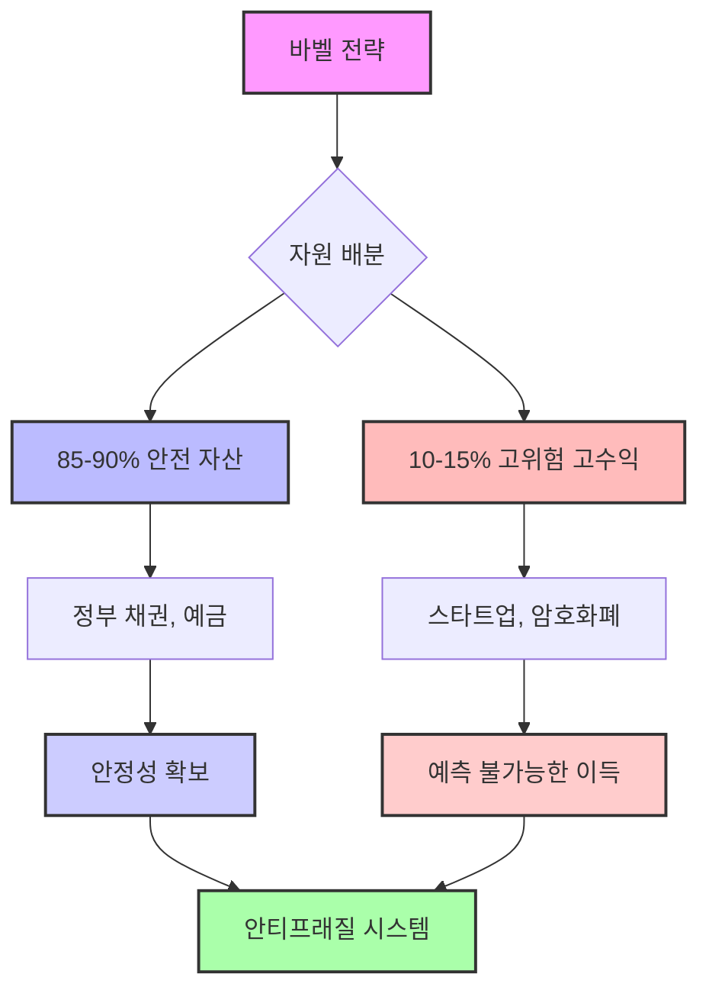
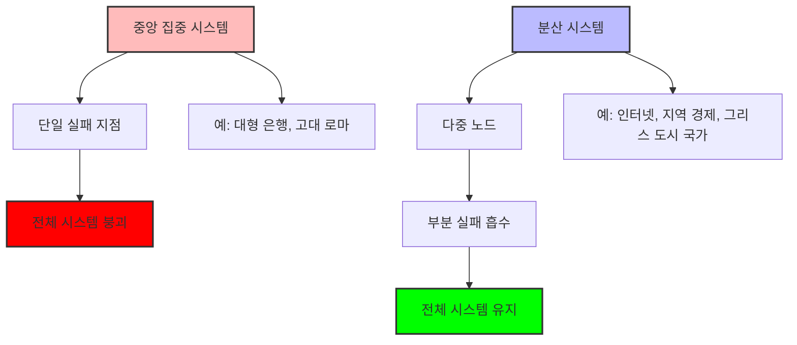
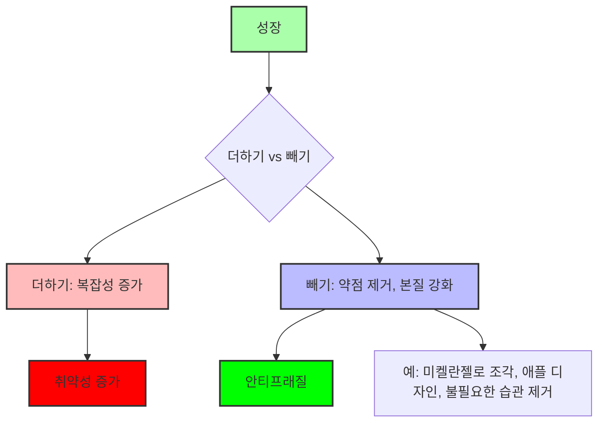
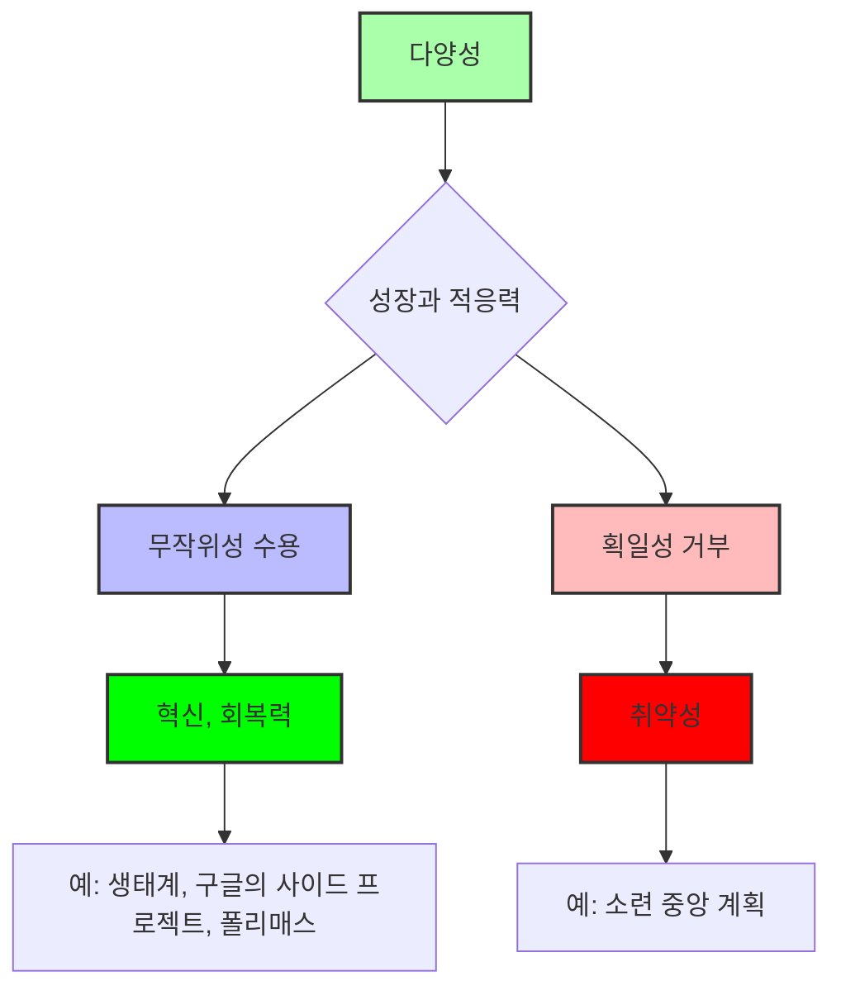
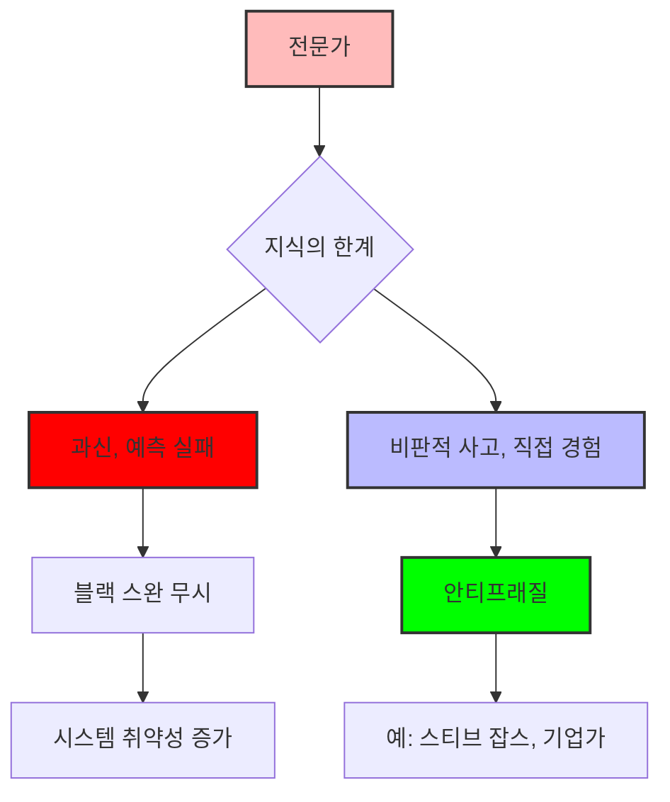

## 안티프래질: 불확실성을 기회로 바꾸는 법
이 책은 예측 불가능한 세상에서 어떻게 하면 혼란과 무질서를 성장의 연료로 삼아 더 강해질 수 있는지 알려주는 책이야. 단순히 충격을 견디는 것을 넘어, 충격 덕분에 더 좋아지는 '안티프래질'이라는 개념을 소개하면서, 우리가 삶의 불확실성을 어떻게 활용해야 하는지 알려주는 해독제 같은 책이라고 보면 돼. 

## 1. 안티프래질이란 무엇일까? 

1. 깨지기 쉬운** 것(**Fragile**)의 반대말은 뭘까?**
  1. 보통 사람들은 깨지기 쉬운 것의 반대말을 '튼튼함'이나 '회복력'이라고 생각할 거야. 
  2. 하지만 튼튼한 건 충격을 받아도 부서지지 않는다는 뜻이고, 회복력은 부서졌다가 원래대로 돌아온다는 뜻이거든. 
  3. 진짜 반대말은 충격을 받으면 오히려 더 강해지고 좋아지는 것을 의미해. 
  4. 이런 개념을 나타내는 단어가 없어서 저자는 '안티프래질(Antifragile)'이라는 새로운 단어를 만들었어. 
2. **신화 속 동물들로 이해하는 **안티프래질
  1. 다모클레스의 칼** (Fragile):** 머리 위에 언제 떨어질지 모르는 칼이 있는 다모클레스처럼, 작은 충격에도 쉽게 무너지는 상태를 말해. 
  2. **불사조 (**Robust**):** 불에 타 죽어도 다시 살아나는 불사조처럼, 충격을 견디고 원래 상태로 돌아오는 것을 의미해. 하지만 더 강해지지는 않아. 
  3. 히드라** (Antifragile):** 머리를 자르면 두 개가 새로 돋아나는 히드라처럼, 혼란과 충격을 겪을수록 더 강해지고 성장하는 특성을 안티프래질이라고 해. 
3. **안티프래질의 핵심:**
  1. 불확실성, 무질서, 혼돈 속에서 오히려 번성하는 특성이라고 보면 돼. 
  2. 예측 불가능한 상황을 피하는 대신, 그 상황을 성장의 기회로 삼는 거야. 

## 2. 스트레스를 기회로 삼아라 

1. **스트레스는 성장의 촉매제이다.**
  1. 우리는 보통 스트레스를 피하려고 하지만, 저자는 스트레스가 성장을 위한 기회라고 말해. 
  2. 마치 운동선수가 몸에 스트레스를 줘서 근육을 키우는 것처럼, 우리 몸과 마음, 시스템도 스트레스를 통해 더 강해질 수 있어. 
  3. 스트레스를 피하면 근육이 약해지고, 면역력이 떨어지고, 정신이 무뎌지는 것처럼, 시스템도 약해지고 결국 무너질 수 있어. 
2. **과잉 보상과 과잉 반응의 힘**
  1. "널 죽이지 못하는 것은 널 더 강하게 만들 거야"라는 말처럼, 어려움에 직면했을 때 우리는 원래 상태보다 더 강해지는 경향이 있어. 
  2. 손에 굳은살이 생기는 것처럼, 반복적인 마찰과 스트레스는 우리를 보호하고 적응하게 만들어. 
  3. 압박 속에서 혁신이 일어나기도 해. 전쟁 중 의학과 기술이 발전한 것처럼 말이야. 
  4. 예측 불가능한 '블랙 스완' 같은 사건에 대비하기 위해서라도 스트레스를 피하지 말고 적극적으로 찾아야 해. 
3. **살아있는 시스템처럼 생각하기**
  1. 고양이는 혼란스러운 상황에서도 적응하고 배우며 성장하지만, 세탁기는 과도한 스트레스에 고장 나 버려. 
  2. 우리 몸 같은 생물학적 시스템은 스트레스에 적응하고 성장하지만, 인공적인 시스템은 안정성만을 추구해서 장기적으로는 취약해질 수 있어. 
  3. 그러니 우리 자신을 기계처럼 다루지 말고, 새로운 기술을 배우거나 신체적 도전을 하는 등 작은 스트레스를 삶에 추가해야 해. 
4. **실패를 성장의 발판으로 삼기**
  1. 숲에 산불이 나면 파괴되는 것처럼 보이지만, 죽은 나무가 타버리고 새로운 성장을 위한 공간과 햇빛을 만들어줘. 
  2. 진화 과정에서 약한 특성이 사라지고 더 강하고 적응력 있는 생명체가 남는 것처럼, 실패는 전체 시스템을 더 강하게 만들어. 
  3. 스타트업의 실패는 개별 기업에는 아프지만, 전체 경제의 혁신과 발전을 이끄는 안티프래질의 연료가 돼. 
  4. 실패를 완전히 없애려고 하면 오히려 회복력을 잃게 되니, 전략적으로 실패를 받아들이고 거기서 배워야 해. 

## 3. 예측의 환상에서 벗어나라 

1. **미래는 예측 불가능하다.**
  1. 사람들은 불확실성을 통제하고 싶어서 예측에 매달리지만, 미래는 본질적으로 알 수 없어. 
  2. 경제학자나 전문가들의 정교한 예측 모델도 현실의 복잡성 앞에서는 무너지는 경우가 많아. 
  3. 2008년 금융 위기 때 금융 기관들이 주택 시장 붕괴를 예측하지 못한 것처럼, 예측은 종종 재앙적인 실패로 이어져. 
  4. 세상은 선형적이지 않고 무작위성에 의해 지배되기 때문에, 확실성을 강요하려는 시도는 실패할 수밖에 없어. 
2. **예측 대신 적응력을 키워라.**
  1. 예측에 의존하기보다는 어떤 미래가 오더라도 적응할 수 있는 능력을 키워야 해. 
  2. '선택성(Optionality)'을 확보하는 것이 중요해. 이는 미래가 어떻게 변하든 유연하게 대처하고 번성할 수 있는 자유를 주는 거야. 
  3. 마치 고대 스토아 철학자들이 삶의 예측 불가능성을 받아들이고 자신의 반응에 집중했던 것처럼, 우리도 통제할 수 없는 것에 에너지를 낭비하지 말고 적응력에 집중해야 해. 
3. **선택성을 높이는 방법**
  1. **투자:** 시장 예측 대신 포트폴리오를 다양화해서 위험을 줄이고 예상치 못한 기회를 잡는 거야. 
  2. **경력:** 특정 산업이나 직업 안정성에 대한 예측에 갇히지 말고, 다양한 기술과 경험을 쌓아서 변화에 적응할 수 있도록 해야 해. 
  3. **자연의 지혜:** 진화가 예측이 아닌 변이와 적응을 통해 이루어지는 것처럼, 우리도 다양한 가능성에 대비해야 해. 
  4. **탈레스의 지혜:** 고대 철학자 탈레스가 올리브 수확이 좋을 것을 예상하고 올리브 압착기를 미리 저렴하게 빌려 큰돈을 번 것처럼, 작은 위험으로 큰 기회를 얻을 수 있는 선택지를 만들어야 해. 

## 4. 바벨 전략을 사랑하라 

1. **바벨 전략이란?**
  1. 바벨 전략은 양극단의 접근 방식을 결합해서 불확실성에 대처하는 강력한 방법이야. 
  2. 대부분의 자원(85~90%)은 아주 안전하고 보수적인 곳에 투자하고, 나머지 소량(10~15%)은 아주 위험하지만 큰 보상을 줄 수 있는 곳에 투자하는 거야. 
  3. 이렇게 하면 재앙적인 손실을 막으면서도 예상치 못한 큰 이득을 얻을 기회를 가질 수 있어. 
  4. 중간 정도의 위험만 있는 어중간한 접근 방식은 피해야 해. 
2. **바벨 전략의 적용**
  1. **투자:** 대부분의 자금을 정부 채권 같은 초안전 자산에 넣고, 소액으로 스타트업이나 암호화폐 같은 고위험 고수익 투자를 하는 거야. 
  2. **경력:** 안정적인 직업이나 수입원을 유지하면서, 동시에 잠재력이 큰 부업을 하거나 새로운 기술을 배우는 데 시간을 투자하는 거야. 
  3. **시간 관리:** 대부분의 시간을 생산적이고 위험이 적은 일상 업무에 할애하고, 소량의 시간을 예술 활동, 혁신적인 아이디어 구상, 영향력 있는 사람들과의 관계 구축 등 고위험 고수익 활동에 쓰는 거야. 
  4. 위험** 관리:** 마치 비행기 조종사가 난기류에 대해 지나치게 조심하는 것처럼, 최악의 상황을 최소화하는 데 집중해야 해. 
3. **역사와 자연 속 **바벨 전략
  1. 토마스 에디슨은 안정적인 연구실 운영을 기반으로 전구 발명 같은 대담한 도전을 할 수 있었어. 
  2. 어떤 식물은 대부분의 씨앗을 안정적인 환경에서 바로 발아시키고, 일부 씨앗은 극한 환경에서도 살아남을 수 있도록 휴면 상태로 유지해. 

## 5. 분산된 힘을 활용하라 

1. **중앙 집중화의 위험성**
  1. 중앙 집중 시스템은 모든 위험이 한 곳에 모여 있어서, 그 한 부분이 무너지면 전체 시스템이 붕괴될 수 있어. 
  2. 겉으로는 효율적이고 강해 보이지만, 예비 시스템이 없어서 위험하게 취약해. 
  3. 2008년 금융 위기 때 대형 은행들이 무너지면서 전 세계 경제가 흔들린 것이 대표적인 예야. 
  4. 고대 로마 제국이 군사력과 행정력을 중앙에 집중했다가 여러 위협에 동시에 대처하지 못하고 무너진 것도 마찬가지야. 
2. **분산화의 힘**
  1. 분산 시스템은 권력과 책임을 여러 곳에 나눠서, 한 부분이 실패해도 전체 시스템이 무너지지 않아. 
  2. 인터넷이 개별 서버가 고장 나도 전체 시스템은 계속 작동하는 것처럼, 분산화는 회복력을 높여줘. 
  3. 지역 경제나 그리스 도시 국가들처럼, 분산된 구조는 국지적인 실패를 흡수하고 전체적인 붕괴를 막아줘. 
  4. 제임스 스콧의 '국가처럼 보기'라는 책에서도 중앙집권적인 통제가 지역의 지식과 유연성을 무시해서 재앙적인 실패로 이어진다고 비판했어. 
3. **삶에 분산화를 적용하는 방법**
  1. **수입원과 기술:** 하나의 직업, 기술, 산업에만 의존하면 위험하니, 여러 수입원을 만들고 다양한 기술을 익혀야 해. 
  2. **투자:** 모든 달걀을 한 바구니에 담지 말고, 다양한 시장, 산업, 통화에 자산을 분산 투자해서 위험을 줄여야 해. 
  3. **관계:** 한두 사람에게만 모든 감정적 지지를 의존하지 말고, 다양한 친구, 가족, 동료, 멘토로 구성된 사회적 관계망을 만들어야 해. 
  4. **작은 충격의 중요성:** 큰 충격 한 번보다 작고 잦은 충격이 시스템을 더 강하게 만들어. 마치 자동차가 시속 50마일로 벽에 한 번 부딪히는 것보다 시속 5마일로 10번 부딪히는 것이 훨씬 덜 파괴적인 것처럼 말이야. 

## 6. 책임감을 가지고 행동하라 (Skin in the Game) 

1. **책임감의 중요성**
  1. '스킨 인 더 게임(Skin in the Game)'은 자신의 행동에 대한 결과를 직접 감수할 때 더 나은 결정을 내린다는 원칙이야. 
  2. 위험과 보상이 일치할 때 시스템과 개인은 가장 잘 작동해. 
  3. 고대 바빌로니아의 함무라비 법전에서는 집이 무너져 피해가 발생하면 건축가가 죽음까지도 책임져야 했어. 이는 건축가들이 품질에 최선을 다하게 만들었지. 
2. **책임감 없는 행동의 위험성**
  1. 2008년 금융 위기 때 금융 기관의 의사 결정자들은 무모한 위험을 감수했지만, 그 결과는 납세자와 일반 시민들이 떠안았어. 
  2. 책임감 없이 이득만 취하려는 시스템은 실패를 반복할 수밖에 없어. 
  3. 저자는 오늘날 많은 관료, 은행가, 유명인사들이 실제 책임은 지지 않으면서 막대한 권력을 행사하고, 시민들이 대가를 치르는 동안 시스템을 악용한다고 비판해. 
  4. 가장 중요한 윤리 원칙은 "다른 사람들을 취약하게 만드는 대가로 자신이 안티프래질해져서는 안 된다"는 거야. 
3. **삶에 책임감을 적용하는 방법**
  1. **관계:** 친구, 가족, 연인 관계에서 자신의 잘못을 인정하고 개선하려 노력할 때 신뢰가 쌓이고 관계가 튼튼해져. 
  2. **리더십:** 알렉산더 대왕처럼 병사들과 함께 위험을 감수하는 리더는 충성심을 얻지만, 안전한 곳에서 명령만 내리는 리더는 사기를 떨어뜨려. 
  3. **혁신과 기업가 정신:** 일론 머스크처럼 자신의 재산을 투자하며 위험을 감수하는 기업가는 신뢰를 얻지만, 개인적인 이해관계 없이 단기적인 이득만 좇는 경영자는 장기적인 안정성을 해쳐. 
  4. **개인적인 성장:** 건강, 관계, 기술 향상 등 어떤 목표든 스스로 노력하고 결과를 받아들여야 해. 
  5. **사기꾼을 사기꾼이라고 말하기:** 사기꾼을 보고도 사기꾼이라고 말하지 않으면, 당신도 사기꾼이 되는 거야. 진실을 말하지 않으면 거짓말쟁이가 되는 것과 같아. 

## 7. 취약한 편안함을 거부하라 

1. **편안함은 함정이다.**
  1. 편안함과 안정성을 추구하는 것은 의존성을 키우고 우리를 취약하게 만들어. 
  2. 동물원 동물이 편안한 삶을 살지만 야생에서는 살아남지 못하는 것처럼, 편안함은 우리를 현실의 혼돈에 취약하게 만드는 우리와 같아. 
  3. 안정적인 직장에 머물거나 갈등을 피하는 것은 단기적으로는 편안해 보이지만, 결국 변화에 대처할 능력을 잃게 만들어. 
2. **불편함을 통해 성장하기**
  1. '배가본딩(Vagabonding)'이라는 책에서처럼, 장기 여행의 예측 불가능성을 받아들이면 새로운 환경에 적응하고 자립심을 키울 수 있어. 
  2. 고대 로마 제국이 부와 안정성에 의존하다가 취약해져 무너진 반면, 몽골 제국은 혹독한 환경에 적응하며 강해졌어. 
  3. 헬스장에서 근육이 스트레스와 저항을 받을 때 성장하는 것처럼, 정신과 영혼도 지적인, 감정적인 도전을 통해 안티프래질해질 수 있어. 
3. **삶에 불편함을 적용하는 방법**
  1. **의도적으로 불편함을 찾아라:** 배우기 어려운 기술을 배우거나, 아무도 모르는 곳으로 이사 가거나, 능력을 시험하는 어려운 프로젝트에 도전하는 거야. 
  2. **다양화:** 하나의 직업 경로에만 매달리거나 한 가지 수입원에만 의존하는 것은 위험해. 기술과 수입원을 다양화해서 경제적 불안정성에 대비해야 해. 
  3. **의료 개입의 신중함:** 현대 의학의 과도한 개입(iatrogenics)은 의도치 않은 해를 끼칠 수 있어. 불필요한 치료를 피하고, 단순하고 증거 기반의 치료를 선호해야 해. 
  4. **의미 있는 삶:** 단순히 오래 사는 것보다 삶의 질과 목적에 집중해야 해. 단식이나 최소한의 의료 개입처럼 자연의 리듬에 맞는 생활 방식을 따르고, 지식이나 다음 세대 양육처럼 의미 있는 기여를 하는 데 집중해야 해. 

## 8. 빼기를 통해 배워라 

1. **빼기의 힘**
  1. 우리는 보통 성장을 '더하기'라고 생각하지만, 저자는 '빼기'를 통해 안티프래질이 생긴다고 말해. 
  2. 약점을 찾아 제거함으로써 시스템, 과정, 습관을 더 강하고 회복력 있게 만들 수 있어. 
  3. 자연은 진화를 통해 부적응적인 요소를 제거하며 번성해. 복잡성을 더하는 것이 아니라 불필요한 것을 덜어내는 것이 진보인 셈이야. 
2. **빼기를 통한 성장 사례**
  1. **미켈란젤로의 조각:** 미켈란젤로가 조각을 만들 때 "조각상이 아닌 모든 것을 깎아냈다"고 말한 것처럼, 불필요한 것을 제거하는 것이 본질을 드러내는 방법이야. 
  2. **에센셜리즘:** 그렉 맥커운의 '에센셜리즘'처럼, 중요한 것에 집중하기 위해 사소하고 불필요한 것을 과감히 잘라내는 것이 명확성과 성공을 가져와. 
  3. **애플의 디자인:** 아이폰의 성공은 끝없는 기능을 추가하는 것이 아니라, 복잡성을 제거하고 필수적인 기능에 집중한 미니멀리즘 디자인 덕분이야. 
  4. **역사적 사례:** 대영 제국처럼 과도하게 확장된 제국은 불필요한 노력을 포기하지 못해 몰락했지만, 대공황 시기에 핵심 역량에 집중하며 간소화한 기업들은 살아남았어. 
3. **삶에 빼기를 적용하는 방법**
  1. **개인 감사:** 에너지, 시간, 자원을 소모하지만 가치를 더하지 않는 습관, 과정, 관계를 찾아내야 해. 
  2. **약한 고리 제거:** 생산성을 저해하는 미루는 습관이나 목표와 맞지 않는 프로젝트처럼, 삶의 가장 약한 고리를 제거하는 데 집중해야 해. 
  3. **관계 정리:** 독성이 있거나 에너지를 소모하는 관계는 사회적, 감정적 틀을 취약하게 만드니, 이런 관계를 제거하고 자신을 강하게 만드는 사람들과 함께해야 해. 
  4. **의료 개입의 최소화:** 불필요한 의료 행위를 줄이는 '비아 네가티바(via negativa)' 접근 방식처럼, 해로운 것을 제거하는 것이 건강에 더 큰 영향을 줄 수 있어. 

## 9. 다양성을 추구하라 

1. **다양성은 성장의 엔진이다.**
  1. 다양성과 무작위성에 노출되는 것은 회복력과 혁신을 키우는 안티프래질의 본질이야. 
  2. 획일성은 취약성을 낳지만, 다양성은 예측 불가능한 상황에서 진화, 개선, 생존을 가능하게 해. 
  3. 마치 면역 체계가 다양한 병원균에 노출되어 강해지는 것처럼, 과도하게 안정화된 시스템은 숨겨진 취약성을 만들어. 
2. **다양성의 힘을 보여주는 사례**
  1. **자연의 진화:** 다양한 환경에 노출된 종은 더 넓은 범위의 특성을 개발하여 생존 가능성을 높여. 
  2. **혁신 기업:** 구글처럼 직원들이 사이드 프로젝트에 시간을 할애하도록 장려하는 기업은 다양한 아이디어와 전략을 통해 혁신적인 제품을 만들어내. 
  3. **중앙 계획의 실패:** 소련 시대의 중앙 계획은 획일성을 강요하여 지역적 특성을 무시했고, 결국 비효율성, 기근, 붕괴로 이어졌어. 
  4. **폴리매스:** 레오나르도 다빈치처럼 다양한 분야의 지식을 결합한 사람들은 끊임없는 호기심과 다양한 경험을 통해 혁신을 이뤄냈어. 
3. **삶에 다양성을 적용하는 방법**
  1. **새로운 경험:** 낯선 곳으로 여행하고, 다른 문화와 관점에 몰입해서 이해의 폭을 넓히고 적응력을 키워야 해. 
  2. **다양한 사람들과 교류:** 반대되는 견해를 가진 사람들과 의미 있는 대화를 나누면서 사고를 날카롭게 하고 공감 능력을 키워야 해. 
  3. **다학제적 학습:** 예술가가 과학을 배우거나 데이터 분석가가 음악을 배우는 것처럼, 다양한 활동을 시도해서 뇌를 자극하고 혁신적인 연결을 만들어야 해. 
  4. **일상의 무작위성:** 출근길을 바꾸거나 새로운 요리를 시도하는 등 의도적인 무작위성을 도입해서 호기심을 자극하고 정체를 막아야 해. 
  5. **금융 다각화:** 자산, 산업, 시장에 걸쳐 투자를 다양화해서 위험을 줄이고 경제적 변동성에 대비해야 해. 

## 10. 전문가를 경계하라 

1. **전문가의 함정**
  1. 전문가들은 종종 확실한 태도를 보이지만, 이는 현실의 복잡성과 무작위성을 설명하지 못하는 경우가 많아. 
  2. 자신들의 지식을 과대평가하고 불확실성을 과소평가해서 재앙적인 실패로 이어지기도 해. 
  3. 2008년 금융 위기 때 금융 전문가들이 주택 시장 붕괴를 예측하지 못한 것처럼, 전문가의 예측은 종종 현실과 동떨어져 있어. 
  4. 대니얼 카너먼의 '생각에 관한 생각'에서도 인지 편향(과신, 통제 착각 등)이 전문가의 판단을 왜곡한다고 지적했어. 
  5. 과거에 의사들이 널리 지지했던 사혈(피 뽑기) 같은 해로운 의료 행위나, 지방을 악마화하고 탄수화물 위주 식단을 권장했던 잘못된 식이 지침처럼, 전문가의 의견도 항상 의심해야 해. 
2. **실용적 지식의 중요성**
  1. 새가 나는 법을 배우기 위해 조류학자의 강의를 듣는 것이 아니라, 직접 날아보고 시행착오를 겪으며 배우는 것처럼, 실용적인 지식이 이론보다 앞서는 경우가 많아. 
  2. 페니실린이나 인터넷의 발명처럼, 많은 혁신은 계획된 연구가 아니라 무작위적인 실험과 시행착오에서 나와. 
  3. 소크라테스가 정의와 추상적 추론에 집착했던 반면, '팻 토니'는 직관과 행동을 중시하는 거리의 지혜를 상징해. 
  4. 완벽한 사업 계획을 세우느라 시간을 낭비하는 기업가보다, 일단 시작하고 부딪히면서 배우는 기업가가 더 성공할 가능성이 높아. 
3. **삶에 전문가 경계를 적용하는 방법**
  1. **비판적 사고:** 전문가의 조언이나 예측을 들을 때, 그들의 가정, 지식의 한계, 놓치고 있는 변수 등을 스스로 질문해야 해. 
  2. **직접 경험:** 추상적인 모델보다는 현실과의 상호작용에서 얻는 '거리의 지혜'를 길러야 해. 
  3. **실험과 적응:** 스티브 잡스가 시장 조사나 전문가 예측을 무시하고 직관과 경험에 의존해 아이폰 같은 혁신적인 제품을 만든 것처럼, 직접 실험하고 실패하며 현실에 적응해야 해. 
  4. **단순화:** 복잡성은 비대칭적인 기회를 가릴 수 있으니, 의사 결정 과정을 단순화해서 잠재적 이득이 위험보다 훨씬 큰 기회를 포착해야 해. 
  5. **역사 속 패자들의 이야기:** 역사는 종종 이론가들에 의해 쓰여져 실천가들의 역할을 과소평가하지만, 토마스 에디슨처럼 수많은 실패를 통해 혁신을 이룬 사람들의 이야기에 주목해야 해. 
  6. **이론과 현실의 간극:** 교실에서 지도를 보며 정글을 배우는 것보다 직접 정글에 들어가 배우는 것이 더 많은 것을 알려주는 것처럼, 이론적 지식보다는 실제 경험을 통해 배우는 것이 중요해. 
  7. **직관을 믿어라:** 모든 것을 완벽하게 설명할 수 없더라도, 행동해야 할 때 자신의 직관을 믿고 움직여야 해. 

## 11. 시간과 안티프래질 

1. 린디 효과**(Lindy Effect): 시간의 시험**
  1. 시간은 무엇이 회복력이 있고 무엇이 취약한지 드러내는 궁극적인 시험대야. 
  2. '린디 효과'는 어떤 것이 오래 지속될수록 앞으로도 더 오래 지속될 가능성이 높다는 개념이야. 
  3. '일리아드' 같은 고전이나 바퀴 같은 오래된 기술이 오랫동안 살아남은 것은 그들이 시대를 초월하는 목적을 가지고 있기 때문이야. 
2. **신기술 맹신(Neomania)의 위험성**
  1. 최신 트렌드와 혁신에 대한 집착인 '신기술 맹신'은 종종 취약성으로 이어져. 
  2. 많은 새로운 아이디어는 시간의 무게를 견디지 못하고 무너지는 경우가 많아. 
  3. 화려한 스타트업이 빠르게 성장했다가 예상치 못한 문제에 직면해 무너지는 반면, 수백 년 된 가업은 적응력과 안정성을 통해 번성하는 경우가 많아. 
3. **시간을 통한 **안티프래질** 구축**
  1. 새로운 것을 무조건 선호하기보다는, 시간의 렌즈를 통해 시스템, 아이디어, 기술을 평가해야 해. 
  2. 무엇이 왜 오랫동안 지속되었는지 살펴보고, 인내심을 길러야 해. 
  3. 과거의 지혜를 존중함으로써 더 튼튼하고 안티프래질한 미래를 만들 수 있어. 

