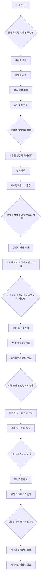

## 책 소개
레이 달리오의 '원칙'은 그가 수십 년간 쌓아온 성공과 실패의 경험을 바탕으로 만들어진 삶과 일에 대한 지침서야. 이 책은 단순히 그의 자서전이 아니라, 우리가 현실을 이해하고, 끊임없이 발전하며, 현명하게 의사결정을 내리는 데 필요한 보편적인 원칙들을 알려줘. 달리오가 브리지워터 어소시에이츠를 세계적인 투자 회사로 키울 수 있었던 비결이 바로 이 원칙들에 담겨 있어. 이 책을 통해 우리는 삶을 기계처럼 최적화하고, 끊임없이 배우며, 잠재력을 최대한 발휘하는 방법을 배울 수 있을 거야.

## 본문 정리

## 1. 현실을 직시하는 것부터 시작해 

1. **현실을 직시하는 게 왜 중요할까?**
  1. 달리오는 1982년에 경제 붕괴에 잘못 베팅해서 거의 모든 걸 잃을 뻔했어. 
  - 이때 그는 시장 때문이 아니라, 현실을 있는 그대로 보지 못했기 때문에 실패했다는 걸 깨달았지. 
  - 이 경험은 그에게 현실을 직시하는 것이 얼마나 중요한지 알려줬어. 
  2. 현실을 직시한다는 건, 불편하고 고통스러워도 진실을 마주하는 훈련을 하는 것과 같아. 
  - 마치 마라톤 선수가 고통을 이겨내고 운동 후의 쾌감을 경험하는 것처럼, 고통을 넘어 교훈을 얻어야 해. 
  - 이런 태도는 우리가 현명하게 꿈을 선택하고, 그 꿈을 실현하는 데 도움을 줄 거야. 
2. **현실을 직시하기 위한 두 가지 핵심 **원칙 
  1. **급진적인 **열린 마음** (**Radical Open-mindedness**)**:
  - 내 생각이 틀릴 수도 있다는 걸 인정하고, 다른 사람들의 다양한 관점을 적극적으로 찾아보는 거야. 
  - 마치 여러 개의 렌즈로 세상을 보는 것처럼, 다양한 시각을 통해 더 넓고 정확하게 현실을 이해할 수 있어. 
  - 이건 마치 라이언 홀리데이의 '장애물은 길이다'에서 장애물이 성장의 기회가 되는 것과 비슷해. 
  2. **급진적인 **투명성** (**Radical Transparency**)**:
  - 숨기는 것 없이 모든 관련 정보를 솔직하게 공유하고, 다른 사람들이 내 생각에 대해 자유롭게 비판할 수 있는 환경을 만드는 거야. 
  - 이런 투명성은 우리의 자아(ego)가 현실을 왜곡하는 걸 막아줘. 
  - 회의를 녹음하고 공유하는 브리지워터의 방식이 대표적인 예인데, 처음엔 어색해도 결국엔 신뢰와 성과를 높이는 데 큰 도움이 됐어. 
3. **현실을 직시하지 못하는 이유: 두려움** 
  1. 실패할까 봐, 틀릴까 봐, 남들이 나를 판단할까 봐 두려워서 현실을 외면하게 돼. 
  - 하지만 달리오는 이 두려움이 스스로를 가두는 감옥과 같다고 말해. 
  2. 그는 1982년의 실패 후, 자신의 실수를 인정하고 전문가들에게 도움을 요청했어. 
  - 이런 취약함(vulnerability)이 오히려 그의 강점이 되었지. 
  - 마치 에이브러햄 링컨이 남북전쟁 때 다양한 의견을 듣기 위해 '경쟁자들로 이루어진 팀'을 만든 것과 비슷해. 
4. **과학자처럼 생각하기** 
  1. 문제를 과학 실험처럼 접근하는 거야. 가설을 세우고, 테스트하고, 결과에 따라 수정하는 거지. 
  - 이렇게 하면 감정이나 편견(cognitive biases) 때문에 판단이 흐려지는 걸 막을 수 있어. 
  - 다니엘 카너먼의 '생각에 관한 생각'에서 말하는 것처럼, 우리의 뇌는 직관에 의존해서 실수를 저지르기 쉽거든. 
  2. 실패를 '피드백'으로 여기고, 감정적으로 흔들리지 않고 과정에 집중해야 해. 
5. 확증 편향**(Confirmation Bias)의 함정 피하기** 
  1. 우리는 보고 싶은 것만 보려는 경향이 있어. 내 믿음을 강화하는 정보만 선택적으로 받아들이는 거지. 
  - 달리오는 1982년 실패 후, 자신의 자아(ego)가 다른 가능성을 보지 못하게 막았다는 걸 깨달았어. 
  2. 그래서 그는 브리지워터에 '어떤 아이디어도 신성하지 않고, 모든 가설은 논쟁의 대상이 될 수 있다'는 문화를 만들었어. 
  - 마치 갈릴레오 같은 과학자들이 기존의 통념에 도전해서 진실을 밝혀낸 것과 같아. 
6. **현실을 직시하는 습관 만들기** 
  1. 내 가설에 의문을 제기하고, 문제가 생겼을 때 감정적으로 반응하기보다 데이터를 모으고 실험처럼 접근해. 
  2. 나를 편안하게 해주는 사람보다는 나에게 도전하는 사람들과 함께하고, 피드백을 적극적으로 요청해. 
  3. 현실은 적이 아니라 아군이라는 걸 기억해. 모든 문제 속에는 성장의 씨앗이 숨어 있어. 

## 2. 끊임없이 진화해야 해 

1. **진화는 생존의 법칙이야** 
  1. 삶은 정체되어 있는 걸 용납하지 않아. 끊임없이 변하고 발전해야만 살아남고 성공할 수 있어. 
  2. 달리오는 개인의 성장과 자연 선택을 비교하면서, 적응하는 자만이 살아남는다고 말해. 
  3. 브리지워터에서는 실패를 '진화 테스트'로 여겼어. 모든 실수가 배우고, 적응하고, 개선할 기회가 된 거지. 
2. **회복력과 적응력은 성공의 핵심이야** 
  1. 브리지워터가 변화에 개방적이었던 것처럼, 우리도 장애물을 성장의 기회로 봐야 해. 
  2. 유발 하라리의 '사피엔스'에서 인류가 성공한 이유가 집단 학습과 혁신 능력 덕분이라고 설명하는 것과 같아. 
  3. 변화를 거부하는 건 성장을 거부하는 거고, 결국 실패로 이어질 거야. 
3. **실패를 데이터로 활용해** 
  1. 브리지워터의 가장 큰 실수들이 가장 값진 교훈이 되었어. 
  - 2008년 금융 위기 때도 과거의 위기에서 배운 교훈 덕분에 큰 피해를 피할 수 있었지. 
  2. 모든 실패를 '데이터'로 보고, 미래의 결정을 더 날카롭게 만드는 피드백으로 삼아야 해. 
  3. 실패를 무시하거나 숨기면, 적응할 기회를 놓치게 돼. 
  4. 토마스 에디슨이 "나는 실패한 게 아니라, 작동하지 않는 1만 가지 방법을 찾았을 뿐이다"라고 말한 것처럼, 수많은 실패를 통해 배우는 과정이 성공으로 이어진다는 걸 기억해. 
4. **고통과 불편함은 성장의 촉매제야** 
  1. 힘든 일을 겪을 때 편안함을 찾으려는 건 실수야. 성장은 편안한 영역의 가장자리에서 일어나거든. 
  2. 캐롤 드웩의 '마인드셋'에서 말하는 '성장 마인드셋'과 비슷해. 도전을 배우는 기회로 보는 사람들이 고정 마인드셋을 가진 사람들보다 훨씬 더 좋은 성과를 내. 
5. **변화를 예측하고 앞서나가야 해** 
  1. 단순히 변화에 반응하는 걸 넘어, 가설에 의문을 제기하고 새로운 관점을 찾아서 미지의 상황에 대비해야 해. 
  2. 스티브 잡스가 자신의 성공을 스스로 파괴하면서까지 끊임없이 혁신했던 것처럼, 과거의 성공에 안주하지 말고 끊임없이 재창조해야 해. 
6. **경험에서 교훈을 추출하는 시스템을 만들어** 
  1. 실패와 거기서 얻은 통찰력을 기록하고, 그걸 바탕으로 원칙과 전략을 다듬는 거야. 
  2. 이 과정은 고통을 발전으로 바꾸고, 모든 좌절을 디딤돌로 만들어줘. 
  3. 평생 학습을 습관으로 만들고, 나에게 도전하는 사람들과 함께하며, 불편하더라도 끊임없이 피드백을 요청해. 

## 3. 급진적으로 투명해져야 해 

1. **급진적 투명성이란 무엇일까?** 
  1. 단순히 솔직한 걸 넘어, 진실과 책임감에 깊이 헌신하는 거야. 
  2. 숨기는 것 없이 모든 관련 정보를 공개적으로 공유하고, 서로의 생각에 도전할 수 있는 환경을 만드는 거지. 
  3. 브리지워터에서는 회의를 녹음하고 공유했는데, 처음엔 회의적이었지만 결국 명확성과 책임감을 높이는 강력한 도구가 됐어. 
2. **왜 급진적 투명성이 필요할까?** 
  1. 자아(ego), 두려움, 정치적인 이유 때문에 조직이 진실을 외면하는 경우가 많아. 
  2. 달리오는 이런 장벽들을 허물고, 모든 직원이 직급에 상관없이 자신의 의견을 말할 권리와 책임이 있다고 강조했어. 
  3. 짐 콜린스의 '좋은 기업을 넘어 위대한 기업으로'에서 위대한 기업들이 '잔인한 사실'을 직시하는 문화를 가진다고 말하는 것과 비슷해. 
3. **불편함을 넘어서는 용기** 
  1. 투명성은 때때로 취약함(vulnerability)을 드러내기 때문에 불편할 수 있어. 
  2. 달리오도 솔직한 피드백을 개인적인 공격처럼 느꼈던 순간들이 있었지만, 자아와 진실을 분리하는 법을 배웠어. 
  3. 감정보다는 아이디어의 본질에 집중해서, 비판을 갈등의 원인이 아니라 개선의 도구로 삼았지. 
  4. 레이 브래드버리의 '화씨 451'에서 불편한 진실을 거부하는 사회가 지적으로 쇠퇴하는 것과 대조적으로, 급진적 투명성은 진실을 보존하고 발전시키려고 해. 
4. **관계와 학습을 강화하는 **투명성 
  1. **개인 관계**: 투명성은 신뢰를 쌓는 데 필수적이야. 정보를 숨기거나 어려운 대화를 피하면 신뢰가 무너져. 
  - 브레네 브라운의 '대담하게 이끌기'에서 취약함이 신뢰와 효과적인 소통을 구축하는 데 중요하다고 강조하는 것과 같아. 
  2. **학습 가속화**: 브리지워터에서는 모든 정보가 공개되어 직원들이 서로의 경험, 성공, 실패로부터 배울 수 있었어. 
  - 회의 녹음은 '집단 지혜의 살아있는 기록'이 되어, 신입 직원들이 더 빨리 배우도록 도왔지. 
  - 우리가 우리의 어려움, 실수, 교훈을 공개적으로 공유하면, 주변 사람들에게도 학습의 파급 효과를 만들 수 있어. 
5. **두려움을 극복하고 투명성을 실천하는 방법** 
  1. 남들의 판단에 대한 두려움을 극복해야 해. 달리오는 주니어 직원들의 비판까지도 기꺼이 받아들였어. 
  2. 진실을 추구하는 것을 승인받으려는 욕구보다 우선시해야 해. 
  3. 투명성이 처음에는 저항에 부딪힐 수 있지만, 시간이 지나면 그 가치를 증명할 거야. 
  4. 솔직함이 편안함보다 더 중요하다고 여기는 문화를 만들어야 해. 
  5. 이런 투명성은 연습과 습관의 변화를 요구하는데, 보통 18개월 정도 걸린다고 해. 

## 4. 의사결정을 시스템화해야 해 

1. **왜 의사결정을 시스템화해야 할까?** 
  1. 모든 결정은 생각을 다듬고 미래의 선택을 안내할 시스템을 만들 기회야. 
  2. 달리오는 브리지워터에서 투자 결정을 자동화하는 알고리즘을 만들었어. 
  - 이건 추상적인 원칙들을 정확하고 실행 가능한 공식으로 바꾼 거지. 
  - 감정적인 개입을 없애고, 데이터와 논리에 기반한 결정을 내릴 수 있게 했어. 
  3. 의사결정을 시스템화하면 추측을 없애고, 장기적인 목표에 맞춰 행동할 수 있어. 
2. **원칙을 문서화하는 것부터 시작해** 
  1. 명확하고 잘 정의된 원칙은 효과적인 의사결정의 토대야. 
  - 달리오는 원칙을 요리 레시피에 비유했어. 각 재료와 단계가 특정 결과를 위해 신중하게 정해지는 것처럼 말이야. 
  2. 다니엘 카너먼의 '생각에 관한 생각'에서 구조화된 사고가 우리의 판단을 흐리게 하는 인지 편향(cognitive biases)을 극복한다고 설명하는 것과 같아. 
  3. 원칙을 문서화하면 압박 속에서도 객관적이고 현실에 기반한 판단을 할 수 있는 참고 자료가 생기는 거야. 
3. **원칙을 반복 가능한 시스템으로 만들어** 
  1. 달리오는 브리지워터에서 주관적이었던 원칙들을 측정 가능한 기준으로 바꿔서 보편적으로 적용할 수 있게 했어. 
  - 이 과정은 결정의 정확성을 높일 뿐만 아니라, 같은 문제를 계속해서 다시 생각해야 하는 정신적인 부담도 줄여줬어. 
  2. 일상적인 결정을 자동화하면, 더 중요한 문제에 집중할 수 있는 정신 에너지를 확보할 수 있어. 
  3. 예를 들어, 매달 수입의 일정 비율을 저축하는 규칙을 세우면, 저축 여부나 금액을 고민할 필요가 없어지는 거지. 
4. **실수를 통해 시스템을 개선해** 
  1. 브리지워터에서는 모든 실패가 시스템을 개선할 기회가 됐어. 
  - 무엇이 잘못되었는지 분석해서 원칙의 빈틈을 찾고, 알고리즘을 업데이트했지. 
  2. 이런 반복적인 테스트와 개선 과정은 과학적인 방법과 비슷해. 
  3. 우리도 결정을 실험처럼 여기고, 그 이유를 기록하고, 결과를 평가해서 새로운 통찰력을 반영해 원칙을 조정해야 해. 
5. **감정적인 개입을 제거해** 
  1. 두려움, 탐욕, 과신 같은 감정은 판단을 흐리게 하고 일관성 없는 결정을 내리게 할 수 있어. 
  2. 시스템을 따르면 이런 감정적인 함정을 피할 수 있어. 특히 압박감이 큰 상황에서 중요하지. 
  3. 세레나 윌리엄스 같은 운동선수들이 압박 속에서도 성공할 수 있었던 비결이 바로 루틴과 시스템 덕분이라고 말하는 것과 같아. 
6. **시스템화된 의사결정을 실천하는 방법** 
  1. 시스템화할 수 있는 반복적인 결정을 찾아봐. 
  2. 작은 일상적인 선택부터 중요한 인생의 변화까지, 각 결정 유형에 대한 생각 과정을 기록해. 
  3. 실제 상황에 원칙을 적용해보고, 필요에 따라 다듬어. 
  4. 이 원칙들을 '플레이북'으로 만들어서 의지할 수 있도록 해. 
  5. 새로운 결정이 생겼을 때, 처음부터 다시 생각하는 대신 시스템을 참고해. 

## 5. 이상적인 아이디어 선별 시스템(Meritocracy)을 만들어야 해 

1. **이상적인 아이디어 선별 **시스템**(**Meritocracy**)이란 무엇일까?** 
  1. 전통적인 권위나 직급, 목소리 크기에 의존하지 않고, 아이디어의 질을 최우선으로 하는 리더십, 팀워크, 의사결정 방식이야. 
  2. 증거, 토론, 그리고 기여자의 신뢰도에 기반해서 최고의 아이디어가 채택되는 시스템이지. 
  3. 달리오는 아무리 똑똑한 사람도 맹점이나 편견이 있기 때문에, 집단 지성을 활용해야만 올바른 결정을 내릴 수 있다고 믿었어. 
  4. 이 시스템은 단순히 공정함을 넘어, 효율성을 높이는 데 목적이 있어. 
2. 신뢰도 가중 의사결정** (**Believability**-Weighted Decision-Making)** 
  1. 달리오는 브리지워터에서 개인의 의견에 그 사람의 과거 실적과 해당 분야의 전문성에 따라 가중치를 부여했어. 
  - 이건 결정이 연공서열이나 카리스마에 좌우되지 않고, 논리와 검증된 능력에 따라 이루어지도록 했지. 
  - 예를 들어, 중요한 토론에서 특정 주제에 전문성이 있는 주니어 직원의 의견이 시니어 임원만큼 중요하게 다뤄질 수 있었어. 
  2. 제임스 서로위키의 '대중의 지혜'에서 다양한 집단이 가장 똑똑한 개인보다 더 좋은 결정을 내리는 경우가 많다고 설명하는 것과 비슷해. 
  3. 우리는 자아(ego)나 권위보다 증거와 논리를 중요하게 여기는 환경을 만들어야 해. 
3. 인지적 다양성**(Cognitive Diversity)을 활용해** 
  1. 단순히 인구통계학적인 다양성을 넘어, 다르게 생각하는 사람들과 함께하는 것이 중요해. 
  - 나의 가설에 도전하고, 불편한 진실을 마주하게 해주는 사람들이 필요해. 
  2. 브리지워터에서는 의견 불일치가 오히려 혁신으로 이어진 경우가 많았어. 
  3. 미국 헌법을 만들 때 건국의 아버지들이 이념적 차이에도 불구하고 토론과 타협을 통해 정부 시스템을 설계한 것과 비슷해. 
  4. 내 의견에 동조하는 사람보다는 나에게 도전하는 사람들을 찾아야 해. 
4. **열린 토론과 존중의 문화** 
  1. 브리지워터에서는 아이디어에 의문을 제기하는 것이 허용될 뿐만 아니라, 기대되는 문화였어. 
  - 직원들은 직급에 상관없이 서로의 생각에 도전하도록 장려되었지. 
  2. 이건 단순히 논쟁을 위한 논쟁이 아니라, 건설적인 대화를 통해 진실을 찾아내기 위함이었어. 
  3. 달리오는 이걸 과학적인 방법과 비교했어. 가설이 엄격하게 테스트되고 검증을 견뎌야 받아들여지는 것처럼 말이야. 
  4. 우리의 목표는 이기는 것이 아니라, 최선의 해결책에 도달하는 것이어야 해. 그러려면 겸손함, 존중, 그리고 증거에 대한 흔들림 없는 헌신이 필요해. 
5. **자아(Ego)를 제거하고 투명성을 높여** 
  1. 이상적인 아이디어 선별 시스템은 자아의 지배를 없애고, 더 나은 결정과 더 큰 혁신을 위한 공간을 만들어줘. 
  2. 브리지워터의 급진적 투명성 정책(회의 녹음 및 공유)은 아이디어가 출처가 아니라 본질에 따라 평가된다는 공통된 이해를 만들었어. 
  3. 투명성은 신뢰를 쌓고, 신뢰는 이상적인 아이디어 선별 시스템의 토대야. 
  4. 사람들이 자신의 목소리가 들리고 아이디어가 공정하게 고려될 것이라고 알면, 더 적극적으로 참여하고 최고의 생각을 기여할 가능성이 높아져. 
6. **이상적인 아이디어 선별 시스템을 구축하는 방법** 
  1. 나의 가설에 도전하는 다양한 사고를 가진 사람들과 함께해. 
  2. 토론이 활발하고, 증거가 감정보다 우선시되는 상호 존중의 환경을 조성해. 
  3. 결정을 문서화하고 결과를 평가하기 위해 다시 검토하는 등 투명성과 책임감을 보장하는 관행을 채택해. 
  4. 가장 중요한 건, 그 누구도 모든 답을 가지고 있지 않다는 사실을 인정하는 거야. 

## 6. 고통스러운 진실을 받아들여야 해 

1. **고통은 성장의 신호야** 
  1. 고통은 적이 아니라, 우리 삶이나 결정에 변화가 필요하다는 분명한 신호야. 
  2. 달리오는 불편함을 피하기보다 정면으로 마주하고, 그걸 성장과 개선의 촉매제로 삼았어. 
  3. 1982년의 실패로 인한 고통은 그가 사업 전략뿐만 아니라 삶의 의사결정 방식까지 근본적으로 재평가하게 만들었지. 
2. **고통스러운 진실은 약점을 드러내고, 약점은 성장의 디딤돌이야** 
  1. 마치 근육을 키우기 위해 근섬유를 찢어야 하는 것처럼, 개선하려면 자신의 결점을 마주하는 불편함을 견뎌야 해. 
  2. 이런 사고방식은 일본의 '카이젠(Kaizen)' 원칙, 즉 '지속적인 개선'과 일치해. 모든 실패와 불편함이 실행 가능한 변화로 이어져야 한다는 거지. 
  3. 고통이 생기면 그 원인을 분석하고, 거기서 얻을 수 있는 교훈을 찾아서 지속적인 변화를 만들어야 해. 
3. **역사 속 위인들도 고통을 통해 성장했어** 
  1. 남북전쟁 당시 에이브러햄 링컨은 끊임없는 비판, 개인적인 비극, 군사적 실패에 직면했어. 
  - 하지만 그는 절망에 굴복하지 않고, 이런 고통스러운 현실을 솔직하게 마주했지. 
  - 그의 역경을 견디고 배우는 능력은 고통이 어떻게 힘과 명확성으로 이어지는지를 보여주는 시대를 초월한 예시야. 
  2. 우리도 도전을 무시하거나 회피하려는 유혹에 저항하고, 용기를 가지고 마주해서 결의를 다져야 해. 
4. **고통스러운 진실을 받아들이는 단계** 
  1. **부정하거나 비난하지 않고 인정하기**:
  - 고통은 종종 방어적인 반응(변명, 회피, 분노)을 유발해서 배우는 걸 방해해. 
  - 모든 좌절을 스승으로 보고, 자아와 감정적인 편견을 벗겨내서 그 안에 숨겨진 교훈을 찾아야 해. 
  - 빅터 프랭클의 '죽음의 수용소에서'에서 고통을 목적과 성찰로 접근하면 깊은 개인적인 성장으로 이어질 수 있다고 말하는 것과 같아. 
  2. **체계적으로 분석하기**:
  - 고통을 해부하는 구조화된 접근 방식을 취해야 해. 근본 원인을 파악하고, 그 고통으로 이어진 결정을 평가하고, 미래에 비슷한 실수를 피하는 방법을 결정해야 해. 
  - 이 과정은 고통을 실행 가능한 지식으로 바꿔줘. 
  - 브리지워터에서는 '피드백 루프'나 '고통 버튼' 같은 도구를 사용해서 팀이 불편함을 실시간으로 인식하고 해결하도록 했어. 
5. **지름길을 피하고 감정적인 회복력을 길러야 해** 
  1. 고통은 종종 가장 빠른 안도감을 찾도록 유혹하지만, 지름길은 의미 있는 성장으로 이어지지 않아. 
  - 마이클 조던이 고등학교 농구팀에서 탈락한 고통을 더 열심히 훈련하는 동기로 삼아 역사상 가장 위대한 선수 중 한 명이 된 것처럼 말이야. 
  2. 고통을 마주하는 건 쉽지 않아. 힘, 인내, 성장에 대한 헌신이 필요해. 
  3. 나를 책임감 있게 만들고 지지해 줄 사람들과 함께하고, 명상이나 규칙적인 성찰 같은 습관을 길러서 어려운 시기에도 중심을 잡아야 해. 
  4. 고통은 일시적이지만, 그것이 키우는 성장은 영구적이라는 걸 기억해. 

## 7. 자신의 약점을 알아야 해 

1. **약점을 아는 것은 강점이야** 
  1. 자신의 약점을 인정하는 건 실패의 표시가 아니라, 깊은 강점의 행동이야. 
  2. 달리오는 자기 인식이 개인의 성장과 효과적인 협업의 토대라고 주장해. 
  3. 브리지워터에서는 마이어스-브릭스 성격 유형 검사 같은 도구를 사용해서 자신과 팀의 한계를 파악했어. 
  - 이건 자신의 능력의 빈틈을 이해하고, 그 빈틈을 다른 사람들이 채우도록 하는 전략이었지. 
  4. 모든 것을 잘할 수는 없어. 약점을 무시하거나 보완하려고만 하면 결국 성공을 방해할 거야. 
2. **자기 인식은 솔직함이 필요해** 
  1. 방어적이거나 부정하지 않고 자신의 한계를 직시해야 해. 
  - 이 단계를 피하면 과신으로 이어지고, 현실을 보지 못하게 돼. 
  2. 다니엘 골먼의 '감성 지능'에서 자기 인식이 성공의 중요한 동력이라고 말하는 것과 같아. 
  3. 달리오는 브리지워터 문화에 이 원칙을 심어서, 직원들이 자신의 강점과 약점을 공개적으로 평가하고 공유하도록 장려했어. 
3. **약점을 활용해서 지원 시스템을 구축해** 
  1. 약점에만 매달리는 게 아니라, 그 지식을 활용해서 나의 맹점을 보완해 줄 팀을 만드는 거야. 
  2. 달리오는 자신과 다른 기술과 관점을 가진 사람들과 함께해서, 조직이 응집력 있고 균형 잡힌 단위로 기능하도록 했어. 
  3. 스티브 잡스가 비전 있는 천재였음에도 불구하고, 자신의 아이디어를 실행하기 위해 숙련된 기술자와 비즈니스 리더 팀에 크게 의존했던 것과 비슷해. 
4. **약점을 파악하는 도구와 **피드백 
  1. 마이어스-브릭스나 DISC 프로필 같은 성격 평가 도구를 사용해서 자신과 팀의 경향을 이해하는 데 도움을 받을 수 있어. 
  2. 하지만 평가만으로는 부족해. 나를 잘 아는 사람, 특히 나와 함께 일하는 사람들의 솔직한 피드백을 들어야 해. 
  3. 달리오는 동료들에게 자주 피드백을 요청했고, 이는 그의 자기 인식이 현실과 일치하도록 도왔어. 
5. **취약함과 겸손함으로 약점을 받아들여** 
  1. 달리오는 특정 이니셔티브를 이끌거나 특정 결정을 내리는 데 자신이 최고의 사람이 아니라는 것을 인정해야 했던 순간들을 회상해. 
  - 자아(ego)가 방해하지 않도록, 그 일에 더 적합한 사람에게 책임을 위임했지. 
  2. 프랭클린 D. 루스벨트가 제2차 세계대전의 복잡성을 헤쳐나가기 위해 다양한 고문과 장군 팀에 의존했던 것처럼, 도움을 요청하는 것은 성공적인 리더들 사이에서 반복되는 주제야. 
  3. 도움을 요청하는 것은 약점이 아니라, 결과를 강화하는 전략적인 움직임이야. 
6. **약점을 아는 것은 협업 능력을 향상시켜** 
  1. 자신의 한계에 대해 투명하면, 신뢰와 상호 존중의 환경을 조성할 수 있어. 
  2. 달리오가 자신의 단점에 대해 솔직했던 것은 팀원들도 그렇게 하도록 격려했고, 사람들이 실수를 인정하고 지원을 구할 수 있는 문화를 만들었어. 
  3. 브레네 브라운의 '대담하게 이끌기'에서 취약함이 리더십에 중요하다고 강조하는 것처럼, 약점을 인정하는 것은 신뢰를 쌓을 뿐만 아니라 다른 사람들도 자신의 불완전함을 받아들이도록 영감을 줘. 

## 8. 의미 있는 관계를 키워나가야 해 

1. **성공은 관계의 질에 달려 있어** 
  1. 달리오는 개인적인 성공이든 직업적인 성공이든, 우리가 맺는 관계의 질에 깊이 뿌리내리고 있다고 굳게 믿어. 
  2. 브리지워터에서는 관계가 단순히 직장의 부산물이 아니라, 문화와 성과의 토대였어. 
  3. 상호 존중, 신뢰, 열린 소통을 바탕으로 한 문화에서 가장 큰 성공이 나왔다고 달리오는 말해. 
  4. 그에게 관계는 거래적이거나 피상적인 것이 아니라, 공유된 가치와 서로의 성장에 대한 헌신을 바탕으로 한 깊이 있는 의미를 가졌어. 
2. **신뢰는 관계의 초석이야** 
  1. 신뢰는 정직함, 일관성, 취약함(vulnerability)을 통해 얻어지는 거야. 
  2. 달리오는 신뢰를 은행 계좌에 비유했어. 스티븐 코비의 '성공하는 사람들의 7가지 습관'에 나오는 '감정 은행 계좌' 개념과 비슷해. 
  - 모든 상호작용은 이 계좌에 입금하거나 인출하는 것과 같아. 친절함, 성실함, 신뢰성은 신뢰를 쌓고, 부정직함, 무시, 깨진 약속은 신뢰를 깎아내려. 
  3. 신뢰는 사람들이 아이디어를 공유하고, 실수를 인정하고, 건설적으로 서로에게 도전할 수 있는 안전한 환경을 만들어줘. 
3. **나에게 도전하고 영감을 주는 사람들과 함께해** 
  1. 달리오는 자신의 편견과 한계를 마주하게 해서 편안한 영역 밖으로 밀어내는 관계를 중요하게 여겼어. 
  2. 브리지워터에서는 그의 결정에 의문을 제기하는 다양한 관점을 가진 사람들을 고용했지. 
  3. 이런 도전적인 관계는 때로는 불편했지만, 개인적인 성장과 더 나은 의사결정에 필수적이었어. 
  4. 프랭클린 D. 루스벨트와 윈스턴 처칠이 제2차 세계대전 동안 서로의 아이디어에 도전하면서도 상호 존중을 유지했던 것과 비슷해. 
4. **가치를 공유하는 사람들과 함께하고 시간과 노력을 투자해** 
  1. **가치 공유**: 공유된 원칙과 상호 존중을 바탕으로 한 관계는 지속되고 번성할 가능성이 더 높아. 
  - 정직함, 성실함, 존중 같은 기본적인 가치를 공유하는 것이 중요해. 
  2. **시간과 노력 투자**: 달리오는 깊이 경청하고 공개적으로 소통하는 것의 중요성을 강조했어. 
  - 브리지워터에서는 잦은 일대일 대화와 피드백 세션이 이해와 공감의 문화를 만들었지. 
  - 데일 카네기의 '인간관계론'에서 적극적인 경청, 타인에 대한 진정한 관심, 감사 표현의 중요성을 강조하는 것과 같아. 
  3. **피상적인 관계는 피하기**: 피상적이거나 거래적인 관계는 단기적인 이점을 줄 수 있지만, 지속적인 성공이나 만족으로 이어지는 경우는 드물어. 
  - 브리지워터는 표면적인 네트워킹 때문이 아니라, 직원들이 서로 형성한 깊고 의미 있는 유대감 때문에 번성했어. 
5. **도전을 통해 관계를 강화해** 
  1. 의미 있는 관계는 취약함, 인내, 그리고 갈등을 해결하려는 의지가 필요해. 
  2. 달리오는 자신의 가장 강력한 관계 중 일부가 의견 불일치와 어려움의 시기에 형성되었다고 말해. 
  - 이런 마찰의 순간들이 존중과 해결에 대한 공동의 헌신으로 접근될 때, 관계를 끊기보다 강화시켜. 
  3. 갈등을 건설적으로 다루면 관계를 손상시키기보다 깊게 만들 수 있다는 걸 기억해. 

## 9. 원칙을 테스트하고 다듬어야 해 

1. **원칙은 살아있는 도구야** 
  1. 원칙은 돌에 새겨진 고정된 규칙이 아니라, 우리의 결정과 행동을 안내하는 살아있고 진화하는 도구야. 
  2. 우리가 성장하고, 배우고, 적응하는 것처럼, 우리의 원칙도 그래야 해. 
  3. 브리지워터에서는 회사의 운영을 지배하는 원칙들을 경험과 피드백을 통해 지속적으로 다듬는 역동적인 틀로 여겼어. 
  4. 이런 접근 방식은 소프트웨어 개발의 '애자일(Agile)' 방식과 비슷해. 시스템이 실제 피드백을 바탕으로 끊임없이 테스트되고, 다듬어지고, 최적화되는 것처럼 말이야. 
2. **실패를 통해 원칙을 만들고 개선해** 
  1. 브리지워터의 원칙들은 힘들게 얻은 교훈, 특히 실패에서 비롯된 것들이 많아. 
  2. 모든 실수는 근본 원인을 파악하기 위해 분석되었고, 얻은 통찰력은 미래에 비슷한 오류를 방지할 수 있는 원칙으로 정리되었어. 
  3. 시간이 지나면서 이 원칙들은 테스트되고 다듬어져서, 회사의 의사결정과 운영 효율성을 향상시키는 피드백 루프를 만들었지. 
  4. 예를 들어, 시장 상황을 평가하는 데 중대한 오류가 발생한 후, 달리오는 즉각적인 문제만 해결한 게 아니라, 근본적인 과정을 면밀히 조사하고 이전에 간과했던 요인들을 반영하기 위해 원칙을 업데이트했어. 
3. **현실에 맞춰 원칙을 다듬어야 해** 
  1. 과학적인 방법처럼, 가설을 테스트하고, 데이터를 수집하고, 결과에 따라 이론을 조정하는 것과 같아. 
  2. 아마존 같은 회사들은 전략과 원칙을 반복적으로 개선하려는 의지 덕분에 번성하고 있어. 새로운 시장과 기술에 적응하면서도 핵심 사명에 충실한 거지. 
  3. 아마존이 끊임없이 관행을 진화시키는 것처럼, 우리도 원칙을 날카롭게 다듬고 개선해야 할 도구로 여겨야 해. 
4. **겸손함과 피드백으로 원칙을 검토해** 
  1. 아무리 효과적이었던 원칙이라도 시간의 흐름과 새로운 지식의 영향을 받지 않을 수 없어. 
  2. 달리오는 정기적으로 원칙을 검토하고, 다른 사람들의 피드백을 구하며, 새로운 경험에 비추어 그 효과를 평가하도록 권장해. 
  3. 이런 관행은 일본 비즈니스 철학의 '카이젠(Kaizen)' 개념과 일치해. 성공적인 관행조차도 면밀한 조사와 개선의 대상이 되는 거지. 
  4. 피드백은 원칙을 다듬는 데 중요한 요소야. 달리오는 다른 사람들의 의견, 특히 나의 가설에 도전하고 다양한 관점을 제공하는 사람들의 의견을 구하는 것의 중요성을 강조해. 
  5. 브리지워터에서는 급진적 투명성 환경을 조성해서 직원들이 회사의 원칙을 비판하고 개선을 제안하도록 장려했어. 
5. **계산된 위험을 감수하고 시행착오를 통해 배워** 
  1. 달리오의 반복적인 접근 방식은 실제 시나리오에 원칙을 적용하고 결과를 관찰하는 것을 필요로 했어. 
  2. 원칙이 원하는 결과를 내지 못했을 때, 그는 완전히 포기하지 않고 새로운 정보를 바탕으로 다듬었어. 
  3. 토마스 에디슨이 전구를 발명하기 위해 수많은 반복과 조정을 거쳤던 것과 같은 사고방식이야. 
  4. 우리도 시행착오 과정을 받아들이고, 모든 실패한 실험이 최적의 해결책에 더 가까이 다가가게 한다는 것을 인식해야 해. 
6. **원칙을 문서화하고 지속적으로 개선해** 
  1. 자신의 원칙을 문서화하는 것부터 시작해. 결정과 행동을 형성하는 지침이 되는 믿음과 규칙을 기록해. 
  2. 그리고 일상생활에서 그것들을 테스트해 봐. 
  3. 정기적으로 이 원칙들을 다시 검토하고, 목표와 일치하는지, 원하는 결과를 내고 있는지 스스로에게 물어봐. 
  4. 다른 사람들, 특히 다른 관점을 가진 사람들에게 피드백을 구하고, 배운 것을 바탕으로 원칙을 기꺼이 조정해야 해. 

