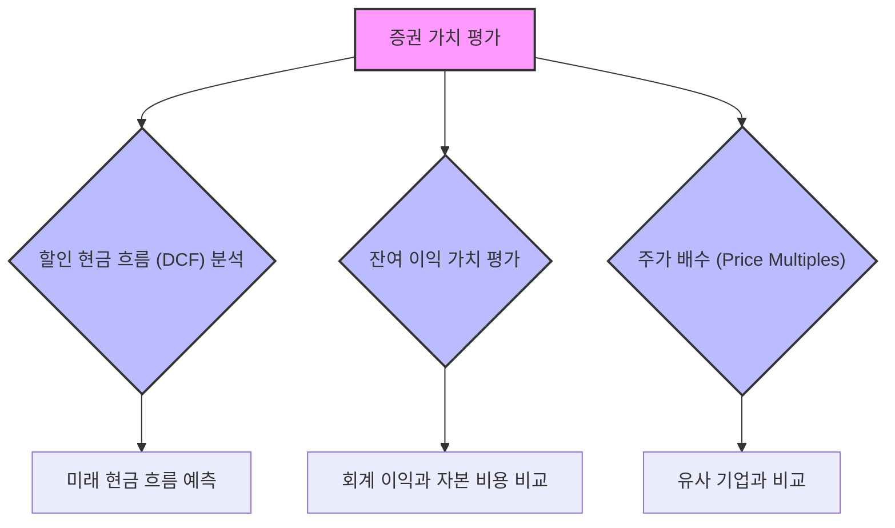

## 스티븐 H. 펜먼의 '재무제표 분석 및 증권 가치 평가' 요약
이 책은 재무제표 분석과 증권 가치 평가를 통합적으로 이해하는 데 필수적인 자료이다. 저자인 스티븐 H. 펜먼 교수는 재무제표를 통해 기업의 진정한 경제적 성과를 파악하고, 이를 바탕으로 주식과 같은 증권의 가치를 정확하게 평가하는 방법을 알려준다. 마치 회사의 건강 검진 기록을 보고 미래를 예측하는 방법을 배우는 것과 같다.

## 1. 재무제표 분석과 가치 평가의 중요성 

재무제표 분석은 기업의 가치를 평가하는 데 아주 중요한 첫걸음이다. 마치 건물을 짓기 전에 설계도를 꼼꼼히 살펴보는 것과 같다고 보면 된다.

1. **책의 핵심 목표**:
  1. 재무제표 분석과 증권 가치 평가를 연결하는 방법을 알려준다.
  2. 이 두 가지가 어떻게 서로 영향을 주고받는지 이해하게 돕는다.
2. **저자 스티븐 H. **펜먼:
  1. 컬럼비아 경영대학원 교수이자 텍사스 오스틴 대학교 맥콤스 경영대학원 교수이다. 
  2. 기업 재무 및 가치 평가 분야의 권위 있는 전문가로, 여러 권의 책을 썼고 300편 이상의 학술 논문에 그의 연구가 인용되었다. 
3. **책의 가치**:
  1. 학생과 전문가 모두에게 유용한 종합 가이드북이다. 
  2. 기업의 재무 상태와 가치를 정확하게 분석할 수 있는 실용적인 도구를 제공한다. 

## 2. 펜먼 교수의 통합적 접근 방식 

펜먼 교수는 재무제표를 단순히 숫자 나열로 보지 않고, 기업의 진짜 가치를 파악하는 도구로 활용하는 방법을 강조한다. 마치 여러 조각의 퍼즐을 맞춰 하나의 큰 그림을 완성하는 것과 같다.

1. 재무제표** 간의 관계 이해**:
  1. 재무제표는 서로 연결되어 있으며, 이 관계를 이해하는 것이 중요하다.
  2. 예를 들어, 손익계산서의 매출이 대차대조표의 현금 흐름에 어떻게 영향을 미치는지 파악하는 것이다.
2. **기업의 진정한 **경제적 성과** 파악**:
  1. 재무제표를 분석하여 기업이 실제로 얼마나 잘 운영되고 있는지 알아낸다.
  2. 겉으로 보이는 숫자 뒤에 숨겨진 진짜 모습을 찾아내는 과정이다.
3. **정보에 기반한 **투자 결정:
  1. 재무제표를 깊이 이해하면 더 현명한 투자 결정을 내릴 수 있다.
  2. 기업의 진짜 가치를 알게 되면, 주식을 살지 말지 더 정확하게 판단할 수 있다.

## 3. 재무제표 분석의 핵심 주제 

이 책은 재무제표를 분석할 때 꼭 알아야 할 중요한 개념들을 다룬다. 마치 요리사가 맛있는 음식을 만들기 위해 재료의 특성을 아는 것과 같다.

1. 수익 인식** (Revenue Recognition)**:
  1. 언제, 어떻게 회사의 수익을 기록해야 하는지에 대한 규칙이다.
  2. 예를 들어, 물건을 팔았을 때 바로 수익으로 잡을지, 아니면 고객이 돈을 냈을 때 잡을지 결정하는 것이다.
2. 비용 대응** (Expense Matching)**:
  1. 수익이 발생한 기간에 그 수익을 얻기 위해 사용된 비용을 함께 기록하는 원칙이다.
  2. 예를 들어, 이번 달에 물건을 팔아 수익을 얻었다면, 그 물건을 만드는 데 들어간 비용도 이번 달에 기록해야 한다는 것이다.
3. **회계 정책이 재무 보고서에 미치는 영향**:
  1. 회사가 어떤 회계 처리 방식을 선택하느냐에 따라 재무제표의 숫자가 달라질 수 있다.
  2. 마치 같은 재료로도 요리법에 따라 맛이 달라지는 것과 같다.

## 4. 경제적 현실을 반영한 재무제표 조정 

때로는 재무제표의 숫자가 기업의 실제 상황을 완벽하게 보여주지 못할 때가 있다. 펜먼 교수는 이런 경우 재무제표를 조정하여 더 정확한 그림을 그리는 방법을 알려준다. 마치 흐릿한 사진을 보정하여 선명하게 만드는 것과 같다.

1. 재무제표** 조정의 필요성**:
  1. 회계 기준이나 정책 때문에 재무제표가 기업의 실제 경제적 상황을 정확히 반영하지 못할 수 있다.
  2. 예를 들어, 감가상각 방법이나 재고 평가 방법 등에 따라 이익이 다르게 보일 수 있다.
2. **실용적인 조정 도구 제공**:
  1. 펜먼 교수는 재무제표를 실제 경제적 현실에 더 가깝게 만드는 구체적인 방법들을 제시한다.
  2. 이러한 조정을 통해 기업의 가치를 더 정확하게 평가할 수 있게 된다.

## 5. 증권 가치 평가 방법 

기업의 가치를 평가하는 다양한 방법들이 있다. 펜먼 교수는 이 방법들을 명확하게 설명하고, 실제 사례를 통해 어떻게 적용하는지 보여준다. 마치 여러 가지 도구를 사용하여 집의 가치를 측정하는 것과 같다.

1. **할인 현금 흐름 (**DCF**) 분석**:
  1. 미래에 기업이 벌어들일 현금 흐름을 예측하고, 이를 현재 가치로 할인하여 기업의 가치를 평가하는 방법이다.
  2. 마치 미래에 받을 용돈을 지금 받는다면 얼마의 가치가 있을지 계산하는 것과 같다.
2. **잔여 이익 **가치 평가** (Residual Income **Valuation**)**:
  1. 기업이 투자한 자본에 대해 기대 수익률을 초과하여 벌어들이는 이익(잔여 이익)을 바탕으로 가치를 평가하는 방법이다.
  2. 회사가 '기대 이상'으로 얼마나 잘 벌고 있는지를 보는 것이다.
3. **주가 배수 (**Price Multiples**)**:
  1. 주가수익비율(PER)이나 주가순자산비율(PBR)과 같이 특정 재무 지표에 대한 주가의 비율을 사용하여 기업의 가치를 평가하는 방법이다.
  2. 비슷한 다른 회사들과 비교하여 우리 회사의 주가가 적정한지 판단하는 것이다.
4. 실제 사례** 적용**:
  1. 펜먼 교수는 이러한 모델들을 주식이나 다른 증권의 가치를 평가하는 데 어떻게 적용하는지 실제 사례를 들어 설명한다.
  2. 이론을 배우는 것을 넘어, 실제로 어떻게 활용하는지 보여주는 것이다.

## 6. 재무제표 분석의 도전 과제 

재무제표를 분석하는 것은 쉽지 않은 일이다. 여러 가지 어려움이 있을 수 있는데, 펜먼 교수는 이런 어려움을 어떻게 헤쳐나갈지 알려준다. 마치 안개가 자욱한 길을 운전할 때 조심해야 할 것들을 알려주는 것과 같다.

1. **복잡한 **회계 기준:
  1. 회계 기준은 복잡하고 다양해서 이해하기 어려울 수 있다.
  2. 나라마다, 산업마다 다른 규칙들이 존재한다.
2. **경영진의 조작 가능성**:
  1. 때로는 경영진이 재무 보고서를 실제보다 좋게 보이도록 조작할 가능성도 있다.
  2. 마치 시험 성적을 좋게 보이려고 답안지를 고치는 것과 비슷하다.
3. **비판적인 접근 방식 개발**:
  1. 이러한 어려움을 인식하고, 재무제표를 볼 때 항상 비판적인 시각을 가져야 한다.
  2. 숫자만 믿지 않고, 그 숫자가 어떻게 만들어졌는지 의심하고 확인하는 자세가 필요하다.

## 7. 실용적인 적용과 명확한 설명 

이 책은 이론만 가르치는 것이 아니라, 실제 회사 사례를 통해 배운 내용을 적용하는 방법을 보여준다. 마치 요리책에 레시피만 있는 것이 아니라, 실제 요리 과정을 사진으로 보여주는 것과 같다.

1. **실제 기업 **사례 연구:
  1. 펜먼 교수는 실제 회사들의 사례 연구와 예시를 포함하여, 배운 기술들을 어떻게 적용하는지 보여준다.
  2. 이론이 실제 상황에서 어떻게 작동하는지 직접 확인할 수 있다.
2. **접근성 높은 자료**:
  1. 이러한 실습 위주의 접근 방식은 복잡한 내용을 더 쉽게 이해하고 관련성을 느끼게 해준다.
  2. 마치 어려운 수학 공식을 실제 문제에 대입하여 풀어보는 것과 같다.
3. **명확하고 매력적인 글쓰기**:
  1. 펜먼 교수의 글은 명확하고 흥미로워서, 복잡한 금융 개념도 모든 수준의 독자들이 이해하기 쉽게 설명한다.
  2. 마치 어려운 이야기를 재미있는 동화처럼 들려주는 것과 같다.
4. **탄탄한 **기초** 제공**:
  1. 이 책은 재무제표 분석과 증권 가치 평가 기술을 향상시키는 데 필요한 견고한 기초를 제공한다.
  2. 마치 튼튼한 집을 짓기 위한 단단한 주춧돌을 놓는 것과 같다.

