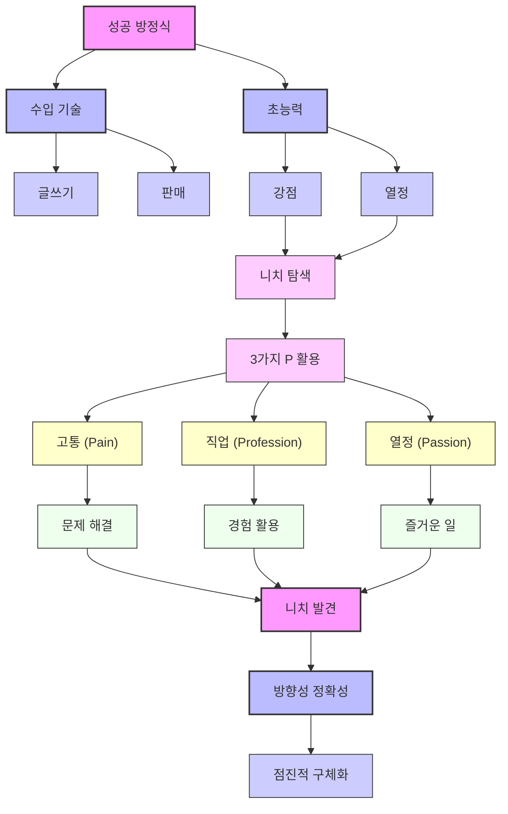

## 성공 방정식: 운과 실력의 비밀을 파헤치다
이 책은 사업, 스포츠, 투자 등 다양한 분야에서 성공과 실패를 가르는 요인인 '운'과 '실력'을 명확히 구분하고, 이 둘이 어떻게 상호작용하는지 알려주는 책이야. 운과 실력을 제대로 이해하면 더 현명한 결정을 내리고 성공 확률을 높일 수 있다고 말해주지.

## 1. 산타페 연구소와 복잡계 사고방식 

산타페 연구소는 학문 간의 경계를 허물고 복잡한 문제들을 여러 분야의 지식을 합쳐서 해결하려는 곳이야.

1. **설립 배경**:
  - 약 35년 전, 과학자들이 학계가 너무 자기 분야에만 갇혀 있다고 생각해서 만들었어.
  - 세상의 중요한 문제들은 여러 학문이 만나는 지점에 있다고 본 거지.
2. **연구 목표**:
  - 학위를 주지 않는 연구소로, 다양한 학문 분야를 넘나들며 기초 연구를 해.
  - 핵심 주제는 '복잡계'인데, 이건 작은 요소들이 서로 영향을 주고받으면서 어떤 결과가 나타나고, 그게 시간이 지나면서 어떻게 변하는지를 연구하는 거야.
3. **개인적인 가치**:
  - 저자는 25년 전쯤 산타페 연구소에 처음 갔을 때 바로 매료되었어.
  - 그곳은 열린 마음과 지적인 호기심을 가진 사람들이 모이는 곳이라고 생각해.
  - 처음에는 비즈니스나 투자와 관련이 없어 보였지만, 복잡계 연구와 비즈니스, 투자 사이에 엄청난 연결고리가 있다는 걸 알게 되었지.
  - 이곳에서의 경험은 개인적으로도 성장하는 계기가 되었고, 직업적으로도 매우 흥미롭고 가치 있는 일이었어.
4. **적용 가능성**:
  - 복잡계 과학의 어려운 이론 자체를 바로 적용하기는 힘들 수 있어.
  - 하지만 '적합성 지형(fitness landscapes)'이나 '규모에 대한 수익 증가(increasing returns to scale)' 같은 비유(metaphor)들은 세상을 바라보는 아주 강력한 렌즈가 돼.
  - 이런 비유들은 비즈니스와 투자를 생각하는 데 엄청난 도움을 준다고 해.
5. **사고방식의 확장**:
  - 인생에서든 비즈니스에서든, 다양한 문제에 맞는 '도구 상자'를 만드는 게 중요해.
  - 산타페 연구소와 그곳 사람들과 교류하는 건 이 도구 상자를 채우는 데 아주 좋은 방법이야.
  - 지적으로도 만족스럽지만, 실제 생활에도 아주 실용적이라고 말할 수 있어.

## 2. 투자자의 관점: '상대방은 누구인가?' 

투자를 할 때는 항상 '내 반대편에 누가 있고, 그 사람은 왜 나와 다른 생각을 하는가?'를 고민해야 해.

1. **투자 결정의 핵심 질문**:
  - 투자를 할 때, 즉 주식을 사고팔 때마다 스스로에게 물어봐야 할 질문이 있어.
  - "내가 아는 것, 혹은 안다고 생각하는 것을 상대방은 왜 모를까?"
  - "상대방은 왜 내 거래의 반대편에 서서 행동하려 할까?"
  - 이건 마치 포커 게임에서 상대방의 패와 생각을 읽으려는 것과 같아.
2. **주식 가격이 잘못 매겨지는 네 가지 이유**:
  - 저자는 시장에서 주식 가격이 잘못 매겨지는 이유를 네 가지로 정리했어.
3. **투자자의 자세**:
  - 투자로 초과 수익을 내고 싶다면, 거래할 때마다 '상대방은 누구이고, 나는 어떤 우위를 가지고 있는가?'를 깊이 생각해봐야 해.
  - 단순히 자신이 가장 똑똑하다고 생각하는 건 위험해. 시장은 겸손함을 가르쳐주는 가장 강력한 메커니즘이니까.
4. **벤저민 그레이엄의 가르침**:
  - 저자는 전설적인 투자자 벤저민 그레이엄의 말을 인용하며 투자 철학의 중요성을 강조해.
  - "자신의 지식과 경험에 용기를 가져라. 사실로부터 결론을 내렸고, 자신의 판단이 옳다고 안다면, 다른 사람들이 주저하거나 다르더라도 행동하라."
  - "군중이 당신에게 동의하지 않는다고 해서 당신이 옳거나 틀린 것은 아니다. 당신이 옳다면 그것은 당신의 데이터와 추론이 옳기 때문이다." 
  - 그레이엄의 핵심 가르침은 투자 기술보다는 '기질(temperament)'과 '철학'에 있어.
  - 사람들이 비이성적으로 행동할 때도, 사실과 자신의 판단이 일치한다면 확신을 가지고 행동해야 한다는 거야.
  - 이런 기질과 철학은 100년이 지나도 변치 않을 투자 성공의 핵심이라고 저자는 말해.

## 3. 약자에게 유리한 전략: 게임을 복잡하게 만들어라 

약자일수록 게임을 복잡하게 만들어서 운의 요소를 늘리는 것이 유리해.

1. **핵심 전략**:
  - 만약 당신이 약자(underdog)라면, 게임을 더 복잡하게 만들어서 '운'의 요소를 주입해야 해.
  - 이것은 많은 사람들이 직관적으로 알지 못하는 유용한 규칙이야.
  - 예를 들어, 체스에서 상대방이 나보다 잘한다고 느끼면, 중반전을 의도적으로 복잡하게 만들어서 상대방의 실력 발휘를 어렵게 하는 거지.
2. 커널 블로토 게임** (Colonel Blotto game)**:
  - 이 전략의 아이디어는 '커널 블로토 게임'이라는 게임 이론에서 나왔어.
  - 이 게임은 두 명의 플레이어가 정해진 수의 병사들을 여러 전장에 배치해서 싸우는 거야.
  - 각 전장에서 더 많은 병사를 배치한 쪽이 승리하고, 더 많은 전장을 이긴 쪽이 전쟁에서 승리하는 식이지.
  - 병사 수가 같고 전장 수가 적으면, 승패가 예측하기 어려운 가위바위보 같은 상황이 돼.
  - 하지만 병사 수가 비대칭일 때(예: 한쪽이 150명, 다른 쪽이 100명), 전장의 수를 늘리면 약자에게 유리해져.
  - 강한 플레이어의 힘을 분산시키고, 복잡성을 더해서 운의 요소를 늘리는 거야.
3. **강자와 약자의 전략**:
  - **강한 플레이어**: 게임을 단순화해서 자신의 실력이나 강점이 경쟁자를 압도하도록 해야 해.
  - **약한 플레이어**: 게임을 더 복잡하게 만들어서 운의 요소를 늘려야 해.
4. **비즈니스 세계에서의 적용**:
  - '파괴적 혁신(disruptive innovation)'이 좋은 예시야.
  - 기존 강자와 정면 대결하는 대신, 강자가 불편해하거나 관심 없는 영역에서 경쟁해서 게임의 규칙을 바꾸는 거지.
  - 이것은 강자가 익숙하지 않은 방식으로 경쟁하게 만들어서 약자에게 기회를 주는 전략이야.

## 4. 남녀의 번식 전략과 변동성: 옵션 가치 높이기 

남녀의 번식 전략은 '옵션'과 같아서, 남성은 변동성을 높여 성공 확률을 높이는 경향이 있어.

1. **남녀의 차이점**:
  - 대부분의 경우 남녀의 평균적인 능력은 비슷하지만, '분산(variance)'은 남성이 여성보다 훨씬 높아.
  - 즉, 아주 뛰어난 남성도 많지만, 아주 뒤처지는 남성도 많다는 거야. 여성은 평균에 더 가깝게 분포하는 경향이 있어.
2. **조상들의 번식 비율**:
  - 인류 조상 중 여성의 비율이 남성보다 약 2배 정도 높았다고 추정돼.
  - 이는 대부분의 남성이 번식에 실패했고, 소수의 남성만이 많은 자손을 남겼다는 의미야.
  - 여성은 번식할 확률이 남성보다 약 2배 높았어.
3. **옵션 이론과의 연결**:
  - 이것을 금융 옵션(financial option)에 비유할 수 있어.
  - 옵션의 가치를 높이려면 '변동성(volatility)'을 높여야 해.
  - 어머니 자연은 대부분의 남성이 번식하지 못할 것을 알았기 때문에, 남성에게는 '변동성을 높이는' 전략을 부여한 거야.
  - 여성에게는 '변동성을 줄이는' 전략을 부여해서 번식 성공 확률을 높인 거지.
4. **사회적 현상과의 연결**:
  - 남성이 분포의 오른쪽 꼬리(아주 뛰어난 집단)에 더 많다는 이야기가 나올 때, 왼쪽 꼬리(아주 뒤처지는 집단)도 함께 살펴봐야 해.
  - 수학 SAT 점수에서 남학생이 여학생보다 평균적으로 높게 나오는 것도, SAT를 보지 않는 남학생들이 왼쪽 꼬리에 몰려 있기 때문일 수 있다는 추측도 있어.
  - 이런 변동성 증가는 비즈니스나 체스 전략뿐만 아니라, 자연의 번식 전략에서도 찾아볼 수 있는 흥미로운 현상이야.

## 5. 남북전쟁 사례: 뒤처질 때 변동성을 높여라 

남북전쟁은 약자가 변동성을 높여 승리할 기회를 만들고, 강자가 변동성을 낮춰 승리를 굳히는 전략을 보여주는 좋은 예시야.

1. **남부의 전략 (약자)**:
  - 남부는 북부에 비해 산업, 인력 등 모든 면에서 열세였어.
  - 하지만 전쟁 초반에는 더 유능한 장군들이 있었지.
  - 이 장군들은 승리할 유일한 기회가 '변동성을 높이는 것'임을 깨달았어.
  - 앤티텀 전투나 게티즈버그 전투에서 리 장군이 엄청난 위험을 감수하고 큰 도박으로 전쟁을 끝내려 했던 것이 그 예시야.
  - 결과적으로 성공하지는 못했지만, 적어도 승리할 기회를 만들었어.
2. **북부의 전략 (강자)**:
  - 북부는 처음에는 남부의 위험한 전략에 맞서려 했지만 성공하지 못했어.
  - 하지만 그랜트 장군이 지휘를 맡으면서 상황이 바뀌었어.
  - 그랜트는 자신의 임무가 '지지 않는 것', 즉 '변동성을 낮추는 것'임을 깨달았어.
  - 그는 점진적으로 남부를 압박해서 결국 무너지게 만들었지.
3. **비대칭 전쟁 (Asymmetric Warfare)**:
  - 이런 비대칭 전쟁에 대한 연구는 200년 전으로 거슬러 올라가.
  - 과거에는 전쟁이 승리보다는 명예를 위한 경우가 많아서 강자와 정면 대결하다가 패배하는 일이 많았어.
  - 하지만 점차 사람들이 승리하려면 '변동성을 높이고' 기발한 전술(예: 게릴라 전술)을 사용해야 한다는 것을 깨달았지.
  - 이것은 커널 블로토 게임의 원리와도 잘 맞아떨어져.
4. **남성의 소모품성**:
  - 역사적으로 전쟁이나 탐험 같은 위험한 일에 남성이 주로 보내진 이유도 여기에 있어.
  - 종족 번식에 필요한 남성의 수가 여성보다 적기 때문에, 남성은 '소모품'으로 여겨졌던 거야.
  - 나폴레옹이 큰 패배 후 "내 병사들은 오늘 밤에 손실을 메울 것이다"라고 말한 것도 이런 관점을 보여주는 예시지.

## 6. 운과 실력의 정의: 통제 가능성의 차이 

운과 실력은 우리가 통제할 수 있는지 없는지에 따라 명확하게 구분돼.

1. **실력 (Skill)의 정의**:
  - 사전적 정의는 '지식을 실행이나 수행에 즉시 적용할 수 있는 능력'이야.
  - 음악가, 운동선수처럼 무언가를 할 줄 알고, 요구될 때 해낼 수 있는 능력을 말해.
2. **운 (Luck)의 정의**:
  - 운은 정의하기가 훨씬 어려워서 철학적인 논쟁으로 이어지기도 해.
  - 저자는 철학자 닉 러쉬(Nick Rush)의 정의를 따르는데, 운은 세 가지 조건이 충족될 때 존재한다고 봐.
  - 더 간단히 말하면, '내가 통제할 수 있는 것'은 실력이고, '내가 통제할 수 없는 것'은 운이라고 할 수 있어.
3. **운-실력 연속체 (**Luck-Skill Continuum**)**:
  - 모든 활동은 '운'과 '실력'이 얼마나 작용하는지에 따라 연속선상에 놓여 있어.
  - **순수 운 (Pure Luck)**: 복권, 룰렛처럼 실력이 전혀 개입하지 않는 활동이야.
  - **순수 실력 (Pure Skill)**: 달리기, 수영, 체스처럼 운이 거의 영향을 미치지 않는 활동이야.
  - **대부분의 활동**: 이 두 극단 사이에 존재하며, 어떤 활동이 이 연속체 어디에 위치하는지에 따라 적절한 전략과 접근 방식이 달라져.
4. **'운을 만든다'는 오해**:
  - "운은 준비가 기회를 만날 때 온다"거나 "열심히 일할수록 운이 좋아진다" 같은 격언들은 좋은 의미를 담고 있지만, 저자의 정의에 따르면 정확하지 않아.
  - 성공 가능성을 높이기 위해 당신이 할 수 있는 모든 행동은 '실력'에 해당해.
  - 예를 들어, 빚 없이 재정적으로 유연한 상태를 유지하고 끊임없이 배우는 것은 '실력'이야.
  - 이런 실력을 통해 통제 불가능한 '운'이 찾아왔을 때, 그 기회를 잡을 수 있는 '준비된 상태'를 만드는 거지.
  - 이것을 '운을 활용하는 실력'이라고 부를 수 있어. 포커 게임도 단기적으로는 운이 작용하지만, 장기적으로는 운을 활용하는 실력이 승패를 결정하는 것과 같아.

## 7. 운과 실력을 구분하는 방법: 통계적 분석과 샘플 크기 

운과 실력을 구분하는 가장 공식적인 방법은 통계적 분석을 이용하는 거야.

1. **통계적 방법**:
  - 통계학에는 '분산의 합 법칙'이라는 아름다운 정리가 있어.
  - 독립적인 분포 A의 분산과 독립적인 분포 B의 분산을 합하면, A+B 분포의 분산과 같다는 거야.
  - 이것을 활용해서 스포츠 같은 분야에서 운과 실력의 기여도를 측정할 수 있어.
2. **스포츠에서의 적용 (예: 농구)**:
  - **분산의 측정**:
  - 우리는 실제 경기 결과의 분산(예: NBA 팀들의 승패 기록)을 알고 있어.
  - 만약 모든 경기가 동전 던지기처럼 순전히 운으로 결정된다면, 어떤 분포가 나올지 수학적으로 모델링할 수 있어. 이것이 '운의 분산'이야.
  - 이 두 가지 정보(실제 결과의 분산과 순수 운의 분산)를 가지고, 방정식을 풀어서 '실력의 분산'이 얼마인지 알아낼 수 있어.
  - **스포츠 리그 순위**:
  - 이 방법을 적용하면, 북미 프로 스포츠 리그를 실력 기여도에 따라 순위를 매길 수 있어.
  - NBA(농구)가 가장 실력 의존도가 높고, 그다음이 메이저리그 야구, NFL(미식축구), NHL(아이스하키) 순이야.
  - NHL이 가장 무작위성에 가깝다고 해.
3. **샘플 크기의 중요성**:
  - 활동의 성격에 따라 필요한 '샘플 크기(sample size)'가 달라져.
  - **실력 위주의 활동**: 우사인 볼트와 달리기 시합을 하는 것처럼, 실력이 압도적인 활동에서는 단 한 번의 경기로도 실력 차이를 알 수 있어. 샘플 크기가 덜 중요해.
  - **운 위주의 활동**: 포커처럼 운의 요소가 큰 활동에서는 실력을 파악하려면 훨씬 더 많은 게임(큰 샘플 크기)을 해야 해.
  - 샘플 크기가 작으면, 운 때문에 얻은 성공을 자신의 실력 때문이라고 착각하기 쉬워.
  - 프로 포커 플레이어들이 수많은 시간을 들여 게임을 하는 이유도, 운의 변동성을 이겨내고 자신의 실력을 드러내기 위해서야.

## 8. 꼬리 분포와 사회적 과정: 예측 불가능한 성공 

일반적인 통계 모델로는 예측하기 어려운 '꼬리 분포(fat-tailed distribution)' 현상들이 있어.

1. **꼬리 분포 (Fat-tailed distribution)**:
  - 일반적인 정규 분포와 달리, 아주 드물게 발생하지만 그 영향이 매우 큰 사건들이 나타나는 분포를 말해.
  - 예를 들어, 지진 같은 물리적 현상이나 전쟁, 혁명, 금융 위기 같은 사회적 현상들이 여기에 해당해.
  - 이런 현상들은 예측하기가 매우 어려워.
2. **사회적 과정의 예측 불가능성**:
  - 특히 영화, 책, 음악 같은 사회적 성공은 예측하기가 거의 불가능해.
  - 이것은 정보가 네트워크를 통해 어떻게 전파되는지와 관련된 '누적 과정(cumulative processes)' 때문이야.
3. **뮤직 랩 실험 (Music Lab experiment)**:
  - 컬럼비아 대학교의 던컨 와츠(Duncan Watts)가 진행한 실험은 이 점을 잘 보여줘.
  - 수천 명의 대학생들에게 무명 밴드의 노래 48곡을 들려주고 평가하게 했어.
  - **통제 집단**: 다른 사람들의 평가를 볼 수 없었어. 객관적인 평가가 이루어졌지.
  - **사회적 집단**: 다른 사람들이 어떤 노래를 좋아하고 다운로드했는지 볼 수 있었어.
  - **결과**:
  - 통제 집단에서는 노래의 '객관적인 품질'이 성공에 영향을 미쳤어.
  - 하지만 사회적 집단에서는 다른 사람들의 평가 패턴이 엄청나게 중요했어.
  - 예를 들어, 통제 집단에서는 평범했던 한 노래가 어떤 사회적 집단에서는 1위를 차지했고, 다른 집단에서는 최하위권에 머물렀어.
  - 이것은 시간을 되감아 다시 재생한다면, 마돈나나 스타워즈, 해리포터 같은 성공작들이 다시 성공할 가능성은 매우 낮다는 것을 의미해.
4. **내러티브의 함정**:
  - 우리는 어떤 것이 성공하면, 그 이유를 설명하기 위해 '내러티브(narrative)'를 만들어내는 데 아주 능숙해.
  - 하지만 실제로는 그 성공의 근본적인 메커니즘을 전혀 모르는 경우가 많아.
  - 이런 내러티브는 종종 인지 편향(cognitive bias)의 원인이 되기도 해.

## 9. 내러티브와 인지 편향: '해석자'의 오류 

우리 뇌의 '해석자(interpreter)'는 사건의 원인을 설명하는 이야기를 만들어내는데, 이 과정에서 운의 역할을 무시하고 인지 편향을 일으킬 수 있어.

1. **가자니가(Gazzaniga)의 '**해석자**'**:
  - 신경과학자 마이클 가자니가(Michael Gazzaniga)는 뇌량(corpus callosum)을 절단한 '분리뇌 환자(split-brain patients)'를 연구했어.
  - 이 환자들은 오른쪽 뇌에만 특정 신호를 주면, 그에 따라 행동하지만, 왜 그렇게 행동했는지 물으면 왼쪽 뇌(언어 담당)가 그럴듯한 이야기를 꾸며내.
  - 이처럼 왼쪽 뇌에 있는 '해석자'는 원인과 결과의 고리를 닫기 위해 끊임없이 이야기를 만들어내는 역할을 해.
2. **운을 모르는 해석자**:
  - 문제는 이 해석자가 '운'에 대해 알지 못한다는 거야.
  - 좋은 결과가 나오면, 뇌는 그 뒤에 좋은 이유(주로 실력)가 있었다고 설명하는 이야기를 만들어내.
  - 나쁜 결과가 나오면, 그 뒤에 나쁜 이유(주로 실력 부족)가 있었다고 가정해.
3. **과정 대 결과 (Process vs. Outcome)**:
  - 이것은 '결과 편향(outcome bias)'이라는 중요한 문제로 이어져.
  - 우리는 나쁜 결과가 나쁜 결정의 결과라고 생각하고, 좋은 결과가 좋은 결정의 결과라고 생각하는 경향이 있어. 하지만 항상 그런 것은 아니야.
  - 포커 플레이어 애니 듀크(Annie Duke)는 이를 '결과론(resulting)'이라고 부르며, 아주 나쁜 습관이라고 지적했어.
4. **운이 큰 활동에서의 문제점**:
  - 실력의 비중이 큰 활동에서는 결과만 봐도 과정이 어땠는지 알 수 있어.
  - 하지만 운의 비중이 큰 활동에서는 결과가 과정을 왜곡할 수 있기 때문에, '과정'에 집중해야 해.
  - 해석자는 이런 상황에서 잘못된 연관성을 만들어서 문제가 돼.
  - 예를 들어, 스포츠에서 코치가 올바른 결정을 내렸지만 결과가 좋지 않을 때, 사람들은 그 결정을 나쁘다고 평가하는 식이지.
  - 이런 현상은 비즈니스나 투자에서도 흔히 발생해.

## 10. 쉬운 게임 찾기: 경쟁 우위를 확보하는 전략 

성공하려면 '쉬운 게임'을 찾아야 해. 즉, 자신의 실력이 가장 잘 발휘될 수 있는 환경을 선택하는 것이 중요해.

1. **핵심 아이디어**:
  - 성공하고 싶다면, 어떤 게임을 하고 있는지, 그리고 그 게임에서 자신이 가장 똑똑한 사람일 가능성이 높은지 생각해봐야 해.
  - 이것은 포커 플레이어 애니 듀크의 사례에서 잘 드러나.
  - 그녀는 높은 판돈의 테이블보다 낮은 판돈의 테이블에서 시간당 수익이 더 높다는 것을 계산하고, 그곳에서 플레이했어.
  - 다른 프로들은 이해하지 못했지만, 그녀는 자신의 실력이 그 테이블에서 압도적이었기 때문에 더 많은 돈을 벌 수 있었던 거야.
2. **투자에서의 적용**:
  - 최근 투자 시장에서는 '인덱스 펀드(index funds)'나 'ETF(상장지수펀드)' 같은 수동 투자로 돈이 몰리는 추세야.
  - 일부 사람들은 경쟁이 줄어들어 능동적인 투자자들에게 더 쉬워질 거라고 생각하지만, 저자는 반대 의견을 제시해.
  - 투자는 제로섬 게임(zero-sum game)이라서 누군가 이기면 누군가는 잃게 돼.
  - 만약 실력 없는 투자자들이 시장에서 빠져나가 인덱스 펀드에 돈을 넣는다면, 능동적인 투자자들은 더 이상 '쉬운 상대'를 찾기 어려워져.
  - 결국, 남은 것은 실력 있는 투자자들끼리의 경쟁이 되므로, 오히려 능동적인 투자가 더 어려워질 수 있다는 거야.
3. **개인의 경험**:
  - 저자는 젊은 시절부터 빚 없이 재정적으로 유연한 상태를 유지하고 끊임없이 배우면서 자신을 발전시켰어.
  - 이런 '실력' 덕분에 예상치 못한 '운'이 찾아왔을 때, 그 기회를 잡을 수 있었다고 말해.
  - 많은 사람들이 기회가 와도 다른 곳에 묶여 있어서 잡지 못하는 경우가 많아.
  - 결국, 운을 활용하는 실력을 키우는 것이 중요하다고 강조해.

## 11. 스타 플레이어 영입의 함정: 조직의 중요성 

다른 조직에서 성공한 '스타'를 영입하는 것이 항상 성공으로 이어지는 것은 아니야. 조직의 환경이 개인의 성과에 큰 영향을 미치기 때문이지.

1. **'스타 추격'의 문제점**:
  - 조직의 성과를 높이기 위해 다른 조직의 스타를 영입하는 것은 논리적인 방법처럼 보여.
  - 하지만 하버드 비즈니스 스쿨의 보리스 그로스버그(Boris Groysberg)의 연구에 따르면, 이런 '스타 추격(Chasing Stars)'은 거의 항상 실망스러운 결과를 낳는다고 해.
  - 평균으로의 회귀** (**Regression toward the mean**)**: 스타가 이전 조직에서 운이 좋았을 수도 있고, 운의 요소는 지속되지 않기 때문에 자연스럽게 평균으로 돌아갈 수 있어.
  - **조직 외부 효과 (Organizational externalities)**: 더 중요한 것은, 스타의 성공이 그 개인의 능력뿐만 아니라 이전 조직의 환경(시스템, 문화, 동료 등) 덕분일 수 있다는 거야.
  - 예를 들어, 골드만삭스에서 뛰어난 트레이더였던 사람이 다른 은행으로 가면, 이전 조직의 지원 시스템이 없어져서 성과가 떨어질 수 있어.
2. **GE 관리자 사례**:
  - GE는 과거에 훌륭한 경영자 양성소로 유명했어.
  - GE 출신 스타 관리자들 중 절반은 GE와 비슷한 조직으로 갔을 때 성공했지만, 나머지 절반은 GE와 매우 다른 조직으로 갔을 때 어려움을 겪었어.
  - 이는 조직 환경이 개인의 성과에 얼마나 중요한지를 보여주는 사례야.
3. **미식축구 선수 사례 (펀터 vs. 와이드 리시버)**:
  - 미식축구에서 와이드 리시버(wide receiver)는 새로운 팀으로 가면 성과가 많이 떨어지는 경향이 있어.
  - 새로운 전술을 배우고, 새로운 쿼터백과 호흡을 맞춰야 하는 등 상호작용 효과가 크기 때문이야.
  - 하지만 펀터(punter)나 필드골 키커(field goal kicker)는 팀을 옮겨도 성과가 거의 변하지 않아.
  - 이들은 공을 스냅해주는 선수 외에는 다른 선수들과의 상호작용이 거의 없기 때문이지.
  - 이 사례는 조직의 상호작용 효과가 개인의 성과에 얼마나 중요한지를 명확히 보여줘.
4. **교훈**:
  - 조직의 성과를 높이기 위해 '스타'를 영입하는 것을 맹신해서는 안 돼.
  - 조직의 외부 효과와 환경이 개인의 성과에 미치는 영향을 충분히 고려해야 해.

## 12. 작은 샘플의 함정: 통계적 오류와 과신 

샘플 크기가 작으면 결과의 변동성이 커져서 잘못된 결론을 내리기 쉬워. 우리는 작은 샘플에서 강한 신호를 보면 과신하는 경향이 있어.

1. **샘플 크기와 **분산:
  - 샘플 크기가 작을수록 결과의 '분산(variance)'이 커지는 경향이 있어.
  - 예를 들어, 동전을 10번 던져서 7번 앞면이 나오는 것은 드물지만 불가능하지 않아.
  - 하지만 10,000번 던져서 5,100번 앞면이 나오는 것은 훨씬 더 드물고, 동전이 편향되었을 가능성이 매우 높아.
  - 우리는 작은 샘플에서 나타나는 강한 신호에 대해 과신하고, 큰 샘플에서 나타나는 약한 신호에 대해 과소평가하는 경향이 있어.
2. **빌 게이츠 재단의 교육 개혁 실패 사례**:
  - 빌 게이츠 재단은 미국 교육 개선을 위해 SAT 점수가 높은 학교들을 조사했어.
  - 그 결과, SAT 점수가 높은 학교들이 대부분 '작은 학교'라는 것을 발견했지.
  - 재단은 작은 학교가 더 효과적이라고 판단하고, 수백만 달러를 들여 큰 학교들을 작은 학교들로 쪼개는 캠페인을 벌였어.
  - 하지만 그들이 묻지 않은 질문은 "SAT 점수가 가장 낮은 학교들은 어디인가?"였어.
  - 답은 역시 '작은 학교'였지.
  - 이것은 작은 샘플 크기 때문에 나타나는 '분산의 꼬리' 현상을 잘못 해석한 거야. 작은 학교는 단순히 학생 수가 적어서 극단적인 결과(아주 좋거나 아주 나쁜)가 나올 확률이 높았던 것뿐이야.
  - 오히려 큰 학교는 더 다양한 고급 과목을 제공할 수 있는 장점이 있어.
3. **심리적 편향**:
  - 우리는 작은 샘플에서 강한 신호를 보면 '과신(overconfident)'하는 경향이 있어.
  - 반대로, 큰 샘플에서 약한 신호를 보면 '과소신(underconfident)'하는 경향이 있어.
  - 카네만(Kahneman)과 트버스키(Tversky)도 사람들이 작은 숫자를 부적절하게 외삽(extrapolate)한다고 지적했어.
4. 최근 편향** (Recency bias)**:
  - 최근에 일어난 일에 더 큰 비중을 두는 '최근 편향'도 문제야.
  - 야구 선수가 시즌 막판에 좋은 성적을 내면, 실제 장기적인 실력보다 더 높은 평가를 받아 더 좋은 계약을 맺는 경우가 있어.
  - 이는 샘플 크기와 장기적인 성과를 고려하지 않은 판단이야.
5. **사회적, 정치적 함의**:
  - 미국 국립보건원(NIH)이 수십억 달러를 연구에 투자하지만, 작은 샘플 크기로 진행되는 생의학 연구가 많아.
  - 이로 인해 잘못된 결과가 많이 나오고, 재현성 위기(replication crisis)로 이어지기도 해.
  - 중국은 소수의 연구에 대규모 샘플(예: 1,000명)을 사용해서 정보의 가치를 높이는 접근 방식을 취하기도 해.
  - 이처럼 샘플 크기의 중요성을 이해하는 것은 과학 연구뿐만 아니라 사회 전반에 걸쳐 매우 중요해.

## 13. 지능 지수(IQ)와 합리성 지수(RQ): 현명한 결정의 비밀 

똑똑하다고 해서 항상 현명한 결정을 내리는 것은 아니야. '합리성 지수(RQ)'는 지능 지수(IQ)와는 다른, 현명한 결정을 내리는 능력을 말해.

1. **IQ와 RQ의 차이**:
  - 토론토 대학교의 키스 스타노비치(Keith Stanovich) 교수는 '지능 지수(IQ)'와 '합리성 지수(RQ)'를 구분했어.
  - **IQ**: 측정 가능한 실제 능력을 나타내지만, 이것이 항상 좋은 결정을 의미하지는 않아.
  - **RQ**: 결정을 내리는 능력을 말하며, IQ와는 부분적으로만 겹치는 별개의 기술이야.
  - 학교 성적은 좋지만 현실 세계에서 결정을 잘 못 내리는 사람, 또는 천재는 아니지만 매일 현명한 결정을 내리는 사람이 그 예시야.
  - RQ는 훌륭한 투자자나 사업가가 되는 데 매우 중요해.
2. **RQ의 구성 요소**:
  - 도구적 합리성** (Instrumental rationality)**: 주어진 제약 조건 내에서 목표를 달성하는 능력이야. 경제학의 효용 이론과 비슷해.
  - 인식적 합리성** (Epistemic rationality)**: 자신의 믿음이 세상과 정확하게 일치하는 것을 의미해. 세상이 변하면 자신의 관점도 업데이트하는 '베이즈주의자(Bayesian)'처럼 유연하게 사고하는 능력이야.
  - '교정(calibration)' 능력도 중요해. 70% 확률로 일어날 것이라고 말했을 때, 실제로 70%의 확률로 일어나는 것처럼 자신의 예측이 정확한지 아는 능력이지.
3. 슈퍼 예측가** (Superforecasters)**:
  - 필 테틀록(Phil Tetlock)의 연구는 RQ의 중요성을 뒷받침해.
  - 수천 명이 참여한 예측 대회에서 상위 2%의 '슈퍼 예측가'들은 우연을 훨씬 뛰어넘는 정확한 예측을 지속적으로 보여줬어.
  - 이들은 '적극적으로 열린 마음(actively open-minded)'을 가진 사람들이었어.
  - 자신의 믿음과 다른 관점을 기꺼이 받아들이고, 심지어 적극적으로 찾아 나서는 사람들이었지.
  - 이런 특성은 RQ 테스트에서 측정하는 능력과 거의 완벽하게 일치해.
4. **RQ의 함양**:
  - IQ는 크게 변하기 어렵지만, RQ는 개인과 조직 모두에서 '함양(cultivate)'할 수 있는 능력이야.
  - 다양한 관점을 접하고, 새로운 정보에 따라 자신의 생각을 업데이트하는 연습을 통해 RQ를 높일 수 있어.
  - 예를 들어, CNN과 폭스 뉴스를 번갈아 시청하며 같은 주제에 대한 다른 관점을 이해하려는 노력처럼 말이야.
  - 이것은 단순히 학벌이나 지능을 넘어, 사람들의 역량을 평가하는 중요한 기준이 될 수 있어.

## 14. 전문가의 함정: 복잡계 예측의 어려움 

전문가라고 해서 모든 것을 잘 예측하는 것은 아니야. 특히 복잡계에서는 전문가의 예측도 크게 벗어나는 경우가 많아.

1. **전문가 예측의 한계**:
  - 필 테틀록의 연구는 '전문가 정치적 판단(Expert Political Judgment)'이라는 책으로 출판되었는데, 정치, 경제, 사회적 결과와 같은 '복잡계(complex systems)'에 대한 전문가들의 예측 능력을 20년 이상 추적했어.
  - 결과는 충격적이었어. 박사 학위까지 가진 전문가들의 예측은 매우 부정확했고, 단순한 외삽 알고리즘(extrapolation algorithms)보다 나을 게 없었어.
  - 심지어 많은 경우 우연보다 나은 예측을 하지 못했지.
  - 전문가들은 예측이 틀렸을 때도 다양한 변명(예: "거의 맞을 뻔했다", "내 예측이 너무 중요해서 상황이 바뀌었다")을 늘어놓는 경향이 있어.
2. **영역 특이성 (Domain-specific)**:
  - 전문가의 능력은 '영역 특이적(domain-specific)'이야.
  - 수학 문제 풀이나 배관 수리처럼 명확한 규칙과 예측 가능한 결과가 있는 분야에서는 전문가가 매우 유용하고, 그들의 의견도 일치해.
  - 하지만 시장 예측, 유가 예측, 지정학적 결과 예측 같은 복잡계에서는 전문가들조차 정반대의 결론을 내리고, 그들의 예측 기록도 매우 좋지 않아.
3. **대중의 심리**:
  - 우리는 심리적으로 전문가에게 의존하고 싶어 하는 경향이 있어.
  - TV에 나오는 전문가들의 말을 듣고 싶어 하고, 그들이 모든 것을 안다고 믿고 싶어 하지.
  - 하지만 복잡계에서는 이런 믿음을 유보하고, 아무도 정확히 알 수 없다는 것을 인정해야 해.
4. **테틀록 연구의 흥미로운 발견**:
  - **미디어 노출과 예측 정확도**: 미디어에 자주 등장하는 전문가일수록 예측 정확도가 떨어졌어. 미디어는 종종 극단적인 견해를 가진 사람들을 선호하기 때문이야.
  - **사고방식의 중요성**: 예측 성공은 성별, 나이, 정치적 성향보다는 '사고방식'과 더 관련이 있었어.
  - **고슴도치 (**Hedgehogs**)**: 하나의 큰 아이디어에 집착하고, 모든 것을 그 관점으로 해석하려는 사람들. 이들은 일시적으로 주목받을 수 있지만, 장기적인 예측은 좋지 않아.
  - **여우 (Foxes)**: 다양한 분야에 대해 조금씩 알고 있고, 자신의 견해를 가볍게 여기며 끊임없이 배우는 사람들. 새로운 정보가 들어오면 자신의 관점을 유연하게 업데이트하기 때문에 장기적으로 더 나은 예측가들이야.
  - 산타페 연구소는 '여우' 같은 사람들을 끌어들이는 곳이라고 저자는 말해.
  - RQ처럼 '여우' 같은 사고방식도 개인적으로 함양할 수 있는 능력이라고 강조하며, 이는 희망적인 메시지라고 할 수 있어.

## 15. 실력의 역설: 실력이 평준화될수록 운이 더 중요해진다 

모두의 실력이 상향 평준화될수록, 작은 '운'의 요소가 결과에 미치는 영향이 훨씬 더 커지는 현상을 '실력의 역설(paradox of skill)'이라고 해.

1. **핵심 아이디어**:
  - 실력과 운이 모두 결과에 기여하는 활동(대부분의 경우)에서, 실력이 증가할수록 운이 더 중요해질 수 있다는 역설적인 현상이야.
  - 이 아이디어는 스티븐 제이 굴드(Stephen Jay Gould)의 책 "풀 하우스(Full House)"에서 유래했어.
2. **두 가지 실력 차원**:
  - **절대적 실력 (**Absolute skill**)**: 현재 세상의 모든 분야에서 절대적인 실력 수준은 역사상 가장 높아.
  - 누적된 지식, 기술 발전 덕분이야.
  - 예를 들어, 오늘날의 투자자가 1960년대에 가면 압도적인 성과를 낼 수 있을 거야.
  - 스포츠에서도 기록이 계속 경신되는 것을 볼 수 있어.
  - **상대적 실력 (**Relative skill**)**: 가장 뛰어난 사람과 평균적인 사람 사이의 실력 차이를 말해.
  - 이 상대적 실력은 시간이 갈수록 줄어들고 있어. 즉, 모두가 상향 평준화되고 있다는 뜻이야.
3. **테드 윌리엄스 사례 (야구)**:
  - 테드 윌리엄스는 1941년에 4할이 넘는 타율을 기록한 마지막 야구 선수야.
  - 굴드는 왜 그 이후로 4할 타자가 나오지 않는지 의문을 제기했어. 오늘날 선수들이 더 잘 훈련하고 영양 상태도 좋고 코칭도 더 나은데 말이야.
  - 그 이유는 오늘날 선수들의 실력이 '더 균일하게 뛰어나기' 때문이야.
  - 타율의 표준편차(standard deviation)가 줄어들었어.
  - 1941년에는 4할 타율이 4표준편차에 해당하는 매우 드문 사건이었지만, 오늘날 4표준편차에 해당하는 타율은 3할 8푼 5리 정도에 불과해. 여전히 뛰어나지만 4할에는 미치지 못하는 거지.
  - 이는 최고 선수와 평균 선수 간의 실력 차이가 줄어들었기 때문이야.
4. **다른 스포츠와 투자에서의 적용**:
  - 올림픽 마라톤이나 100미터 달리기에서 금, 은, 동메달리스트들의 기록 차이가 과거보다 훨씬 줄어든 것을 볼 수 있어.
  - NBA를 제외한 대부분의 프로 스포츠 리그(하키, NFL, 야구)는 '평준화(parity)'되고 있어. 연봉 상한제 같은 제도적 요인도 있지만, 더 많은 인구에서 선수를 뽑고, 훈련과 코칭이 발전하면서 전반적인 실력이 균일해졌기 때문이야.
  - 투자 세계에서도 '초과 수익의 표준편차'가 지난 50년간 꾸준히 감소했어.
  - 닷컴 버블 시기에는 개인 투자자들이 대거 유입되면서 일시적으로 표준편차가 커졌지만, 기관 투자자들이 개인 투자자들을 압도한 후 다시 감소 추세로 돌아섰어.
5. **결론**:
  - 절대적 실력은 높아졌지만, 상대적 실력은 줄어들면서 결과에 대한 '운'의 중요성이 점점 더 커지고 있어.
  - 이는 '쉬운 게임'을 찾아 자신의 차별화된 실력을 적용할 곳을 찾는 것이 더욱 중요해졌다는 것을 의미해.

## 16. 조직과 개인의 기술 수명 주기: 성과 곡선 

개인과 조직 모두 기술과 성과가 시간이 지남에 따라 '곡선'을 그리며 변화해. 젊을 때 성장하고, 정점에 도달한 후에는 점차 하락하는 경향이 있어.

1. **개인의 기술 수명 주기**:
  - **운동선수**: 젊을 때는 실력이 부족하지만, 훈련과 성장을 통해 계속 향상돼.
  - 보통 20대 중반에서 30대 초반에 정점(peak)을 찍고, 그 이후에는 점차 실력이 저하돼.
  - 나이가 들면 반응 속도가 느려지는 등 신체적인 한계가 나타나기 때문이야.
  - **인지 능력**: 일반 지능은 '결정성 지능(crystallized intelligence)'과 '유동성 지능(fluid intelligence)'으로 구성돼.
  - **결정성 지능**: 사실과 지식에 대한 이해력으로, 70대까지 계속 증가하는 경향이 있어.
  - **유동성 지능**: 새로운 것을 처리하는 능력으로, 20대 초반에 정점을 찍고 시간이 지남에 따라 감소해.
  - 이 두 가지 지능의 상반된 변화가 인지 능력의 전반적인 곡선을 만들어내.
2. **조직의 기술 수명 주기**:
  - 조직의 성과도 개인과 유사하게 '곡선'을 따라 변화하는 경향이 있어.
  - **초기**: 젊은 조직은 목적의식이 강하고 민첩해. 투자 단계라서 자본 수익률(return on capital)이 낮을 수 있어.
  - **성장 및 정점**: 성과가 점차 개선되어 정점에 도달해.
  - **하락**: 조직이 커지면서 관료주의(bureaucracy)가 생기고, 시장도 성숙해지면서 성과가 점차 하락하는 경향이 있어.
  - 이러한 패턴은 기업의 자본 수익률 변화를 통해 추적할 수 있어.
3. **투자 분석에서의 활용**:
  - 기업이나 개인이 이 '기술 곡선'의 어느 지점에 있는지 파악하는 것은 투자 분석에 유용한 도구가 될 수 있어.
  - 자본 수익률이 높은 사업이라도, 시간이 지나면서 얼마나 빨리 평균으로 회귀하는지(fade)를 분석할 수 있어.
  - 산업과 분야에 따라 이 회귀 속도는 달라져.
  - **빠른 회귀**: 에너지, 금융 서비스 일부처럼 모방하기 쉽고 상품화된 사업은 수익이 빠르게 경쟁에 의해 사라져.
  - **느린 회귀**: 소비재(예: 프록터 앤드 갬블)처럼 안정적인 사업은 수익 감소 속도가 느려.
  - 이러한 곡선과 산업별 특성을 이해하는 것이 중요해.

## 17. 의도적인 연습 (Deliberate Practice): 진정한 실력 향상법 

'의도적인 연습(deliberate practice)'은 단순히 시간을 많이 투자하는 것을 넘어, 자신의 한계에 도전하고 정확한 피드백을 받으며 실력을 향상시키는 방법이야.

1. **1만 시간의 법칙과 에릭슨의 주장**:
  - 안데르스 에릭슨(Anders Ericsson)은 '1만 시간의 법칙'으로 유명해.
  - 그는 재능이나 선천적인 실력보다는 1만 시간의 '의도적인 연습'을 통해 누구나 엘리트가 될 수 있다고 주장했어.
  - 하지만 데이비드 엡스타인(David Epstein)의 책 "스포츠 유전자(Sports Gene)"나 "레인지(Range)"에서는 1만 시간이 평균일 뿐, 재능의 역할을 무시할 수 없다고 반박해.
2. **의도적인 연습의 정의**:
  - 의도적인 연습은 단순히 반복하는 것이 아니야.
  - **자신의 능력 한계에서 연습**: 현재 자신의 능력보다 약간 더 어려운 수준에서 연습해야 해.
  - **정확하고 시기적절한 피드백**: 코치로부터 정확하고 즉각적인 피드백을 받아야 해.
  - **재미없고 힘든 과정**: 즐겁기보다는 힘들고 고된 과정이야. 충분한 휴식도 필요해.
3. **일상생활에서의 적용**:
  - 대부분의 사람들은 운전처럼 '충분히 잘하는' 수준에 도달하면 더 이상 의도적인 연습을 하지 않아.
  - 하지만 특정 분야에서 진정으로 뛰어나려면 의도적인 연습이 필수적이야.
4. **비즈니스 및 투자에서의 적용**:
  - 문제는 스포츠처럼 피드백이 명확하지 않은 비즈니스나 투자 분야에서 의도적인 연습을 어떻게 적용할 것인가 하는 거야.
  - 투자는 본질적으로 '시끄러운(noisy)' 활동이라서 깨끗한 피드백을 받기 어려워.
  - 저자는 이 질문에 대한 답을 찾기 위해 노력하고 있어.
5. **CEO 코칭 사례**:
  - 저자는 CEO 코칭에서 '시간 관리'에 집중하는데, 이는 의도적인 연습과 가장 유사한 형태라고 생각해.
  - 시간 관리는 단순히 시간을 효율적으로 쓰는 것을 넘어, 자신의 '우선순위(priorities)'를 실제로 어떻게 실행하는지를 보여주는 거야.
  - 우선순위를 정하고, 그에 맞춰 시간을 관리하도록 강제하는 것이 의도적인 연습과 같다고 봐.
  - 투자 위원회 설문조사에서도, 위원들이 중요하다고 생각하는 것과 실제로 시간을 쓰는 것이 정반대인 경우가 많았어.
  - 이처럼 올바른 결정을 내렸지만 결과가 좋지 않을 때, "잘했어, 다시 시도해"라고 격려하고, 잘못된 결정으로 운 좋게 성공했을 때는 "운이 좋았을 뿐이야, 다음엔 더 현명하게 생각해"라고 조언하는 것이 중요해.
  - 결과보다는 '과정'에 집중하도록 돕는 것이 장기적인 성공을 위한 핵심이야.

## 18. 성공 방정식: 수입 기술과 초능력의 교차점 

성공 방정식은 '수입 기술(income skills)'과 '초능력(superpower)'이 만나는 지점에서 시작돼. 이 둘의 조화가 진정한 성공과 자유를 가져다줄 거야.

1. **성공 방정식의 핵심**:
  - 교육 콘텐츠를 만드는 사람들은 두 가지 실수를 저지르곤 해.
  - **돈만 쫓는 경우**: 열정이나 타고난 실력 없이 돈만 쫓다가 지쳐서 포기해.
  - **열정만 쫓는 경우**: 돈을 벌지 못해 지속 가능하지 않아서 결국 포기해.
  - 성공 방정식은 이 두 가지 실수를 피하고, '수입 기술'과 '초능력'이 겹치는 지점을 찾는 거야.
  - 이것은 다른 사람에게는 '일'처럼 보이지만, 자신에게는 '놀이'처럼 느껴지는 일을 찾는 것과 같아.
  - 이 지점을 찾으면 그 분야에서 최고가 될 수 있고, 자신이 좋아하는 일을 하면서도 엄청난 돈을 벌 수 있어.
2. **성장의 차이**:
  - 수입 기술이나 초능력 중 하나에만 집중하는 사람들은 '선형적인 성장(linear growth)'을 경험해. 돈을 벌거나 좋아하는 일을 하지만, 진정한 잠재력을 발휘하지 못해.
  - 반면, 수입 기술과 초능력의 교차점을 찾는 사람들은 '복리 효과(compounding effect)'를 경험해. 시간이 지날수록 기하급수적으로 발전하고, 상상 이상의 성공을 거둘 수 있어.
  - 처음에는 느릴 수 있지만, 장기적으로는 한 가지에만 집중하는 사람들을 훨씬 앞지르게 돼.
3. **합성자(Synthesizer)의 자유**:
  - '합성자 자유(Synthesizer freedom)'에 도달하려면, 자신의 초능력을 개발하고 수입 기술을 배워야 해.
  - 이것은 원하는 시간에 원하는 일을 하면서 열정과 목적을 따르고, 동시에 상당한 수입을 창출하는 상태를 의미해.

## 19. 수입 기술: 글쓰기와 판매 

수입을 창출하는 데 필요한 핵심 기술은 단 두 가지야. 바로 '글쓰기(writing)'와 '판매(selling)'이지.

1. **돈의 중요성**:
  - 돈은 자유를 사고, 기회를 만들고, 꿈을 현실로 만드는 데 필수적이야.
  - 아름다운 집, 세계 여행, 좋아하는 일에 몰두하기, 의미 있는 문제 해결을 위한 팀 구축 등 모든 것에 돈이 필요해.
2. **비즈니스의 목적**:
  - 비즈니스의 목적은 '문제 해결'과 '고통 완화'야.
  - 사람들은 자신의 문제를 해결하고 고통을 덜기 위해 기꺼이 돈을 지불해.
  - 다른 사람의 문제를 해결해주면 보상을 받게 되고, 돈을 주는 사람도 고통이 사라져서 기뻐할 거야.
  - 이것이 '아름다운 돈(beautiful money)'을 버는 방법이야. 자신의 목적과 일치하고, 돈을 받는 사람도 주는 사람도 행복한 돈이지.
3. **필요한 기술은 단 두 가지**:
  - 많은 사람들은 수입을 벌기 위해 광고, SEO, 영업, 채용, 마케팅, 스토리텔링 등 수많은 기술이 필요하다고 생각해서 압도당하고 시작조차 못 해.
  - 하지만 저자는 '글쓰기'와 '판매' 이 두 가지 기술만 있으면 충분하다고 말해.
  - 크리에이터 경제에서 성공한 모든 사람들은 이 두 가지를 배웠고, 이 두 가지에 능숙하지 못한 사람들은 실패했어.
4. **글쓰기와 판매의 비유**:
  - **글쓰기**: '기차 선로'를 만드는 것과 같아. 모든 것의 기반이 돼.
  - **판매**: '기차 엔진'과 같아. 기차를 선로 위에서 움직이게 하는 힘이야.
  - 이 둘이 없으면 아무것도 일어나지 않지만, 둘이 합쳐지면 엄청난 힘을 가진 기계처럼 마법 같은 일을 만들어낼 수 있어.
5. **모든 활동의 기반**:
  - 고객을 '유치(attract)', '전환(convert)', '전달(deliver)'하는 모든 과정은 글쓰기와 판매에 의존해.
  - 콘텐츠 제작, 광고, 영상 스크립트 작성 등은 모두 글쓰기이고, 고객과의 소통, 문제 해결, 고객 지원 등은 판매와 글쓰기의 결합이야.
  - 결국, 매일 하는 일은 대부분 글쓰기 아니면 판매라고 할 수 있어.

## 20. 초능력: 강점과 열정의 결합 

'초능력(superpower)'은 당신의 타고난 강점과 열정이 결합된 것으로, 경쟁에서 압도적인 우위를 점하고 세상에 큰 영향을 미칠 수 있게 해줘.

1. **내면의 부름**:
  - 모든 사람 안에는 위대해지고자 하는 내면의 힘이 있어.
  - 로버트 그린(Robert Greene)은 "당신은 삶의 과업으로 이끄는 내면의 힘을 가지고 있다"고 말했어.
2. **무한한 **레버리지** 시대**:
  - 과거에는 아무리 뛰어나도 자신의 마을 사람들에게만 영향을 미칠 수 있었어. 보상도 제한적이었지.
  - 하지만 지금은 '무한한 레버리지(infinite leverage)' 시대야. 인터넷, 소셜 미디어, AI 같은 도구 덕분에 자신의 초능력을 통해 수백만 명에게 영향을 미치고 엄청난 보상을 받을 수 있어.
  - 물리학에 대한 열정과 강점을 가진 사람이 온라인 비즈니스를 만들면, 전 세계 수백만 명에게 지식을 전달하고 큰 영향력을 행사할 수 있는 거지.
3. **미미한 차이가 엄청난 보상으로**:
  - 경쟁자보다 단 1%만 더 뛰어나도, 모든 고객이 당신에게 올 수 있어.
  - 상위 1%와 상위 2%의 차이는 엄청나.
  - 우사인 볼트(Usain Bolt)는 요한 블레이크(Johan Blake)보다 100미터 달리기에서 1초도 안 되는 차이로 이겼지만, 모든 보상은 우사인 볼트에게 돌아갔어.
  - 이것이 레버리지 시대의 특징이야.
4. **위대함의 중요성**:
  - 자신이 하는 일에 '위대해지는 것'이 성공의 핵심이야.
  - 자신이 하는 일에 뛰어나지 않고 수익을 내는 사람은 없어.
  - 좋은 제품은 마케팅과 판매의 기반이 되고, 좋은 제품을 만들려면 자신이 하는 일에 뛰어나야 해.
  - 이 단계를 건너뛸 수는 없어.
5. **초능력의 구성**:
  - 초능력은 '강점(strengths)'과 '열정(passions)'의 곱셈이야.
  - 타고난 강점과 깊은 열정이 결합될 때, 경쟁에서 불공정한 우위(unfair advantage)를 얻고 세계 최고가 될 수 있어.
  - **마이클 펠프스**: 비정상적으로 긴 팔, 수영 능력, 타고난 운동 신경(강점) + 승리에 대한 집착, 물에 대한 사랑, 1,845일 연속 수영(열정) = 올림픽 메달 28개.
  - **리오넬 메시**: 타고난 스피드, 왼발잡이, 성장 호르몬 결핍(강점) + 스포츠에 대한 사랑, 순수한 게임 열정, 자기 계발 욕구, 팀워크(열정) = 위대한 축구 선수.
  - 성장 호르몬 결핍으로 키가 작고 민첩해진 것이 오히려 강점이 된 것처럼, 약점도 초능력의 일부가 될 수 있어.
6. **초능력은 발전하는 것**:
  - 지금 당장 자신의 초능력이 무엇인지 정확히 알 필요는 없어.
  - 자신이 무엇을 잘하고 무엇을 좋아하는지 대략적으로만 알아도 돼.
  - 시간이 지나면서 초능력은 자연스럽게 발전하고 명확해질 거야.
  - "자신이 하는 일에서 세계 최고가 되는 것이 중요하며, 그 말이 사실이 될 때까지 자신이 하는 일을 계속 재정의해야 한다." 
  - 초능력은 글쓰기와 판매라는 '그릇'을 채우는 내용물이야. 이 그릇을 채울 내용이 있어야 돈을 벌 수 있어.
  - 이것을 찾으면, 자신이 좋아하는 일을 하면서도 돈이 저절로 따라오는 마법 같은 경험을 할 수 있어.

## 21. 니치(Niche) 찾기: 탐색을 통한 발견 

니치(Niche)는 처음부터 정하는 것이 아니라, 자신의 초능력을 따라 탐색하면서 자연스럽게 발견하는 거야.

1. **조기 전문화의 실수 (Mistake of **specific inaccuracy**)**:
  - 많은 크리에이터들이 처음부터 "나는 특정 문제를 해결하기 위해 특정 니치를 돕는다"고 너무 구체적인 니치를 정하는 실수를 해.
  - 이것은 '조기 전문화(premature specialization)'라고 부르는데, 돈이 될 것 같은 니치를 선택하면 시야가 좁아지고 자신의 초능력과 맞는 기회를 놓치게 돼.
  - 니치를 너무 일찍 정하면 다음과 같은 문제가 생겨.
  - **시야가 가려짐**: 좋은 니치를 선택했다고 생각하지만, 실제로는 더 좋은 기회를 보지 못하게 돼.
  - **시작의 어려움**: 너무 많은 선택지 때문에 시작조차 못 하거나, 스트레스를 받아.
  - **목적과의 불일치**: 수익성이 좋아 보여도 자신의 목적과 맞지 않으면 결국 성공하기 어려워.
2. **니치 발견의 원칙**:
  - 니치는 선택하는 것이 아니라, 자신의 초능력을 따르고 즐거운 일을 하면서 시간이 지나면서 '발견'되는 거야.
  - 확대경을 치우고 넓게 보면 진정한 기회를 찾을 수 있어.
  - 자신의 독특한 초능력을 찾고, 관심사를 따라가면서 니치가 당신을 선택하게 해야 해.
  - 자신의 삶에 이미 존재하는 기회들을 찾아봐. 종종 가장 명확한 기회는 바로 눈앞에 있는데도 너무 구체적인 니치를 찾으려다 놓치곤 해.
3. **방향성 정확성 (**Directional accuracy**)이 중요**:
  - '구체적으로 틀리는 것'보다 '방향성 있게 정확한 것'이 훨씬 중요해.
  - 처음에는 넓은 방향만 맞으면 돼. 시간이 지나면서 기회들이 스스로 나타날 거야.
  - 목적(purpose)이 수익(profit)을 창출하는 것이지, 그 반대가 아니야.
  - 자신의 초능력을 추구하는 데 집중하면 돼. 당신은 니치 그 이상이야.
  - 조 로건(Joe Rogan)이나 더 록(The Rock)처럼 다양한 관심사를 가진 사람들도 성공할 수 있어.
4. **니치 탐색 방법 (3가지 P)**:
  - 자신의 강점과 열정을 활용해서 탐색할 세 가지 주제를 선택해봐.
  - **고통 (Pain)**: 당신이 자신의 삶에서 해결했던 문제들은 무엇인가?
  - **직업 (Profession)**: 당신의 과거 직업이나 전문적인 경험은 무엇인가?
  - **열정 (Passion)**: 다른 사람에게는 일처럼 보이지만, 당신에게는 놀이처럼 느껴지는 것은 무엇인가?
  - 저자의 예시: 생산성, 학생, 스토아 철학. 처음에는 스토아 철학에만 관심이 있었지만, 탐색하면서 자신의 초능력을 발견했어.
  - 에이든(Aiden)의 예시: 크론병(고통), 트위터 성장(직업), 글쓰기(열정).
5. **시작하고 배우기**:
  - '배우고 시작하는 것'이 아니라 '시작하고 배우는 것'이 중요해.
  - 넓은 주제를 선택하고 탐색하면서, 시간이 지나면 모든 것이 더 명확해질 거야.
  - 너무 일찍 자신을 제한하지 말고, 탐색하고 열정을 찾으면 돼.

