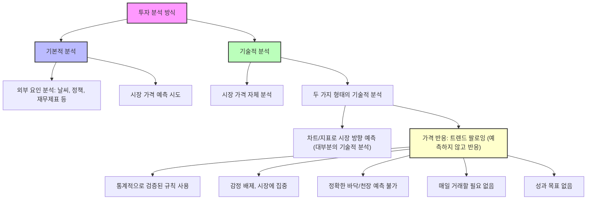
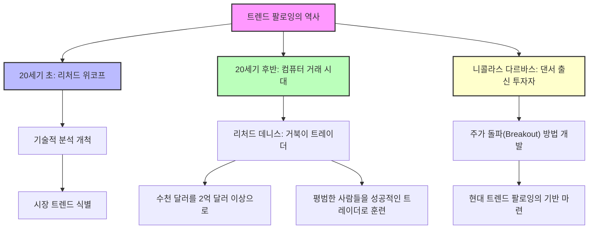
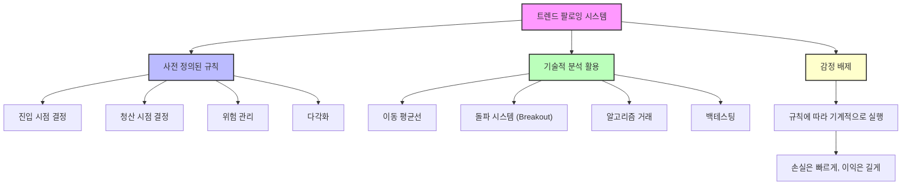
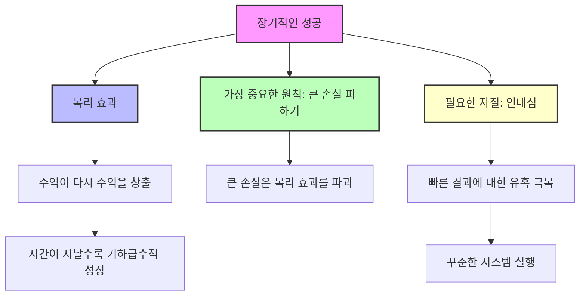
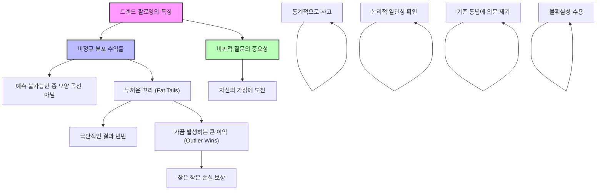

## 트렌드 팔로잉: 시장의 흐름을 타는 투자 전략
이 책은 시장의 큰 흐름(트렌드)을 따라 투자하는 '트렌드 팔로잉' 전략을 소개하는 책이야. 예측보다는 시장의 움직임에 반응하고, 감정보다는 시스템에 따라 투자해서 꾸준히 돈을 버는 방법을 알려주는 거지. 마치 파도타기처럼, 파도를 만들려고 하지 않고 이미 만들어진 파도를 타는 것과 같다고 보면 돼. 

## 1. 트렌드 팔로잉이란 무엇일까? 

트렌드 팔로잉은 시장의 큰 흐름을 따라가는 투자 전략이야. 마치 서퍼가 파도를 예측해서 만드는 게 아니라, 이미 만들어진 파도를 보고 그 흐름에 몸을 맡겨 타는 것과 같아. 

1. **'트렌드'의 의미**:
  - 가격이 움직이는 방향을 말해. 위로 오르거나(상승 트렌드), 아래로 내려가거나(하락 트렌드), 옆으로 움직이는(횡보 트렌드) 세 가지가 있어. 
  - 트렌드 팔로워들은 주로 위로 오르거나 아래로 내려가는 큰 흐름에 관심이 많아. 
2. **'팔로잉'의 의미**:
  - 트렌드가 확실히 나타난 다음에 그 흐름을 따라가는 것을 말해. 
  - 미리 예측하려고 하지 않고, 시장이 움직이는 것을 보고 반응하는 거야. 
  - 예를 들어, 주가가 계속 오르면 따라서 사고, 계속 내리면 따라서 파는 식이지. 
3. **핵심 목표**:
  - 주식, 채권, 통화, 원자재 같은 주요 자산 시장에서 상승장이든 하락장이든 트렌드의 대부분을 잡아서 이익을 내는 것이 목표야. 
  - 이 전략은 단순해 보이지만, 많은 사람이 제대로 이해하지 못하고 있어. 

## 2. 왜 트렌드 팔로잉이 중요할까? 

트렌드 팔로잉은 시장에서 꾸준히 돈을 벌 수 있는 최고의 전략이라고 저자는 말해.  특히 많은 투자자가 어려움을 겪을 때도 이 전략은 빛을 발했어.

1. **시장의 혼란 속에서 빛나는 전략**:
  - 닷컴 버블 붕괴(1990년대 후반)처럼 시장이 크게 흔들릴 때, 많은 투자자가 큰 손실을 봤지만, 트렌드 팔로워들은 계속해서 돈을 벌었어. 
  - 이때는 단기 투자나 유행하는 기술주에만 관심이 많아서 트렌드 팔로잉이 주목받지 못했지. 
  - 하지만 버블이 터진 후, 트렌드 팔로잉의 가치가 다시 중요해졌어. 
2. **변화하는 시장에 대한 유연한 대응**:
  - 시장은 300년 전이나 지금이나 항상 변해.  마치 날씨처럼 말이야. 
  - 트렌드 팔로잉은 이런 변화를 전제로 하는 전략이야. 시장이 오르든, 내리든, 횡보하든 어떤 변화에도 적응할 수 있도록 설계되어 있어. 
  - 독일 마르크화가 유로화로 바뀐 것처럼 큰 변화가 있어도, 이 전략은 유연하게 대처할 수 있어. 
  - 변화를 받아들이는 것이 트렌드 팔로잉 철학의 첫걸음이야. 
3. **월스트리트의 통념에 도전**:
  - 이 전략은 월스트리트의 일반적인 투자 방식과는 많이 달라. 
  - 성공적인 트레이더는 하루 종일 모니터 앞에서 소리 지르는 사람이라는 오해를 깨고, 조용히 집에서 일하며 큰돈을 버는 트렌드 팔로워들도 많아. 

## 3. 투자자와 트레이더: 당신은 어떤 사람인가? 

대부분의 사람은 자신을 '투자자'라고 생각하지만, 시장에서 크게 성공하는 사람들은 스스로를 '트레이더'라고 불러.  이 둘의 차이를 아는 것이 중요해.

1. **투자자(Investor)의 특징**:
  - 돈을 주식이나 부동산 같은 시장에 넣어두고, 시간이 지나면 가치가 오를 것이라고 기대하는 사람이야. 
  - 가치가 떨어질 때를 대비한 계획이 없어. 그저 가치가 다시 오르기를 바라며 계속 가지고 있지. 
  - 주로 상승장(불 마켓)에서 돈을 벌고, 하락장(베어 마켓)에서는 손실을 보는 경향이 있어. 
  - 하락장을 두려워해서 어떻게 대응해야 할지 계획하지 못하고, 손실이 나도 그냥 버티다가 계속 손실을 보게 돼. 
  - 공매도(주가가 떨어질 때 돈을 버는 방법) 같은 복잡한 거래는 배우려 하지 않아. 
  - 언론에서는 투자를 '좋고 안전한 것'으로, 트레이딩을 '나쁘고 위험한 것'으로 여기기 때문에, 사람들이 트레이더가 되거나 트레이딩을 이해하려 하지 않는 경향이 있어. 
2. 트레이더**(Trader)의 특징**:
  - 시장에 돈을 넣어서 '이익'이라는 단 하나의 목표를 달성하기 위한 명확한 계획이나 전략을 가지고 있어. 
  - 무엇을 사고파는지에는 관심이 없어. 시작한 돈보다 더 많은 돈을 버는 것이 중요할 뿐이야. 
  - 매일 거래하지 않아도 트레이더가 될 수 있어. 중요한 건 삶에 대한 관점이야. 
  - 트렌드 팔로워 같은 트레이더는 아프리카 사자가 먹이를 기다리듯, 몇 주나 몇 달 동안 인내심을 가지고 트렌드를 기다려. 
  - 이상적으로는 주가가 오를 때(롱 포지션)와 내릴 때(숏 포지션) 모두 돈을 벌 수 있도록 양쪽으로 거래해. 
  - 하지만 많은 트레이더가 하락장에서 돈을 버는 것을 어려워해.  이 책을 읽고 나면 하락장에서 돈을 버는 것에 대한 혼란과 망설임이 사라질 거야. 

## 4. 기본적 분석 vs. 기술적 분석: 어떤 방식으로 거래할까? 

투자를 분석하는 방법에는 크게 두 가지가 있어. 바로 기본적 분석과 기술적 분석이야. 트렌드 팔로워들은 기술적 분석 중에서도 특별한 방식을 사용해.

1. 기본적 분석**(Fundamental Analysis)**:
  - 시장의 수요와 공급에 영향을 미치는 외부 요인들을 연구하는 방식이야. 
  - 날씨, 정부 정책, 경제 상황, 기업의 재무제표(손익계산서, 대차대조표) 같은 것들을 살펴봐. 
  - 이런 요인들을 분석해서 시장 가격이 변하기 전에 미리 예측할 수 있다고 믿는 거지. 
  - 월스트리트의 대부분은 기본적 분석을 지지해. 닷컴 버블 때도 많은 분석가가 기술주가 영원히 오를 거라고 예측했지만, 결국 많은 사람이 큰 손실을 봤어. 
  - 저자는 야후 파이낸스의 시장 분석 기사를 예로 들며, 기본적 분석이 얼마나 모호하고 주관적인지 비판해. 
  - 유명한 트렌드 팔로워 에드 코타(Ed Cota)는 기본적 분석의 문제점을 재미있는 비유로 설명했어. 식사 중 칼이 떨어져 발에 박혔는데, 기본적 분석가는 칼이 다시 올라올 때까지 기다렸다는 이야기야.  마치 주가가 떨어져도 다시 오를 때까지 무작정 기다리는 투자자들처럼 말이야. 
  - 몰리 풀(Motley Fool)의 '푸딩 이야기'도 기본적 분석의 한계를 보여줘. 아버지가 푸딩 회사의 주식을 샀으니 푸딩을 많이 사라고 가르쳤지만, 언제 팔아야 할지는 알려주지 않았다는 거지. 
2. 기술적 분석**(Technical Analysis)**:
  - 시장 가격 자체가 모든 정보를 반영한다고 믿는 방식이야. 
  - 외부 요인 대신 시장 가격의 움직임 자체를 분석해서 트렌드를 파악하고 이익을 얻으려고 해. 
  - **두 가지 형태의 기술적 분석**:
  - **예측 기반 기술적 분석**: 차트나 지표를 사용해서 시장의 방향을 '예측'하려고 해.  많은 사람이 이 방식으로 돈을 번다고 주장하지만, 학계에서는 우연이나 다름없다고 보는 경우가 많아.  마치 점성술처럼 미신으로 여겨지기도 해. 
  - **가격 반응 기반 기술적 분석 (**트렌드 팔로잉**)**: 이 방식은 시장을 '예측'하지 않아. 대신 시장의 움직임에 '반응'하는 전략을 사용해. 
  - 통계적으로 검증된 거래 규칙을 사용해서 감정 개입 없이 시장에 집중할 수 있어. 
  - 트렌드의 정확한 바닥이나 꼭대기에서 사고팔 수는 없어. 
  - 매일 거래할 필요 없이, 적절한 시장 상황을 인내심 있게 기다려. 
  - 하루에 얼마를 벌어야 한다는 식의 성과 목표를 두지 않아. 시장이 움직이지 않으면 돈을 벌 수 없기 때문이야. 
  - 트렌드 팔로잉이 효과적인 이유는 시장을 '예측'하려고 하지 않고, 그저 '따라가기' 때문이야. 

## 5. 재량적 거래 vs. 기계적 거래: 어떻게 결정할까? 

트레이더는 거래 결정을 내리는 방식에 따라 '재량적 트레이더'와 '기계적 트레이더'로 나눌 수 있어. 트렌드 팔로워들은 주로 기계적 거래 방식을 사용해.

1. 재량적 거래**(Discretionary Trading)**:
  - 트레이더의 시장 지식, 현재 시장 상황에 대한 판단, 그리고 다른 여러 요인들을 종합해서 주관적으로 사고파는 결정을 내리는 방식이야. 
  - 이 결정은 트레이더의 감정이나 편견(행동 편향)에 영향을 받을 수 있어서, 언제든지 바뀔 수 있고 나중에 후회할 수도 있어. 
  - 존 W. 헨리(John W. Henry) 같은 유명한 트렌드 팔로워는 이런 재량적 결정이 행동 편향에 취약하다고 지적했어. 
2. **기계적 거래(**Mechanical** Trading)**:
  - 객관적이고 자동화된 규칙(시스템)에 따라 거래하는 방식이야. 
  - 이 규칙들은 트레이더의 시장 관점이나 철학에서 만들어져. 
  - 트레이더는 이 규칙들을 엄격하게 따르고, 종종 컴퓨터 프로그램에 입력해서 시장에 진입하고 빠져나와. 
  - 기계적 거래 시스템은 감정을 배제하고 규칙을 지키도록 강제해서, 거래를 더 쉽게 만들어줘. 
  - 만약 이 시스템의 규칙을 어기면 큰 손실을 볼 수도 있어. 
  - 캠벨 앤 컴퍼니(Campbell and Company) 같은 성공적인 트렌드 팔로잉 회사들은 재량적 판단을 피하는 것을 철칙으로 삼고 있어. 
  - "재량적 판단을 사용하지 않고 모델을 따르는 것이 우리의 강점 중 하나이다."  이 규칙은 캠벨에서 돌에 새겨진 것처럼 중요하게 여겨져. 
  - 이 방식은 재미없어 보일 수 있지만, 트렌드 팔로잉은 '재미'가 아니라 '승리'에 관한 것이야. 

## 6. 트렌드 팔로잉의 역사와 성공 사례 

트렌드 팔로잉은 새로운 전략이 아니야. 오랜 역사를 통해 많은 성공 사례를 만들어왔어.

1. **초기 개척자들**:
  - 20세기 초, 리처드 위코프(Richard Wikoff)는 기술적 분석을 개척하며 시장 트렌드를 파악하는 방법을 처음으로 제시했어. 
  - 니콜라스 다르바스(Nicholas Darbas)는 댄서였지만, 주가 돌파(Breakout)를 이용해 큰돈을 벌었어. 
2. **현대 트렌드 팔로잉의 상징**:
  - 20세기 후반에는 컴퓨터 거래와 함께 리처드 데니스(Richard Dennis) 같은 인물이 트렌드 팔로잉의 원칙을 대표했어. 
  - 데니스는 몇천 달러를 2억 달러 이상으로 불렸고, '거북이 트레이더(Turtle Traders)'라고 불리는 평범한 사람들을 훈련시켜 놀라운 성공을 거두게 했어. 
  - 이들은 현대 트렌드 팔로잉의 기반을 다졌고, 많은 트레이더에게 영감을 주었어. 

## 7. 트렌드 팔로잉의 심리학: 감정을 다스리는 법 

트레이딩에서 가장 어려운 부분은 바로 심리적인 측면이야. 감정을 잘 다스리는 것이 성공의 핵심이야.

1. **감정의 함정**:
  - 두려움과 탐욕 같은 감정은 충동적인 결정을 내리게 하고, 결국 재정적인 파멸로 이어질 수 있어. 
  - 이기고 싶은 기쁨, 지는 것에 대한 고통, 기회를 놓치는 것에 대한 두려움(FOMO) 같은 감정은 특히 투자를 많이 할수록 강해져. 
2. **손실(**Drawdown**)을 견디는 법**:
  - 손실은 피할 수 없는 부분이야.  마치 파도타기에서 넘어지는 것처럼 말이야.
  - 손실이 나면 의심이 생기고, 너무 일찍 거래를 끝내버릴 수 있어. 
  - 성공적인 트레이더는 손실을 과정의 일부로 받아들여. 
3. **탐욕을 통제하는 법**:
  - 이익이 났을 때 너무 일찍 이익을 확정하고 싶은 유혹이 생겨. 
  - 하지만 트렌드 팔로잉은 시장의 흐름을 끝까지 타는 것이 중요해. 
4. **시스템으로 감정 통제**:
  - 트렌드 팔로잉은 시스템(규칙)을 사용해서 감정적인 롤러코스터를 줄이려고 해. 
  - 규칙이 결정을 내리게 하고, 두려움이나 탐욕 같은 감정이 개입하는 것을 최소화하는 거지. 
5. **인간 행동의 이해**:
  - 시장은 결국 사람들의 심리에 의해 움직여. 
  - 뉴스에 즉각적으로 반응하기도 하지만, 큰 트렌드는 시간이 지나면서 천천히 형성돼. 
  - 사람들의 생각이 서서히 바뀌면서 시장의 큰 흐름이 만들어지고, 트렌드 팔로워들은 이런 변화에서 기회를 찾아. 
  - 충동적인 결정이나 미래의 큰 이익에만 집중하는 것은 행동 함정에 빠지는 거야. 
  - 트렌드 팔로잉은 겉보기에는 단순하지만, 꾸준히 실행하려면 집중력과 규율이 필요해. 

## 8. 트렌드 팔로잉의 작동 방식: 시스템과 규칙 

트렌드 팔로잉은 감정을 배제하고 일관된 결정을 내리기 위해 '시스템'과 '규칙'에 의존해. 마치 요리사가 레시피대로 요리하는 것처럼 말이야.

1. **시스템의 중요성**:
  - 트렌드 팔로워들은 언제 시장에 진입하고, 언제 빠져나올지 알려주는 구체적인 규칙이나 공식(트레이딩 시스템)을 사용해. 
  - 목표는 항상 트렌드를 포착하는 것이야. 
  - 시스템은 다양할 수 있지만, 기본 목표는 비슷해. 
2. **간단한 시스템의 예시**:
  - 예를 들어, 주가가 지난 89일 동안의 최고점을 돌파하면 매수하고(진입), 지난 13일 동안의 최저점 아래로 떨어지면 매도하는(청산) 규칙을 세울 수 있어. 
  - 이런 시스템은 영국 파운드, 원유, 옥수수 같은 선물 시장에서 테스트될 수 있어. 
  - 물론 실제 거래에서는 훨씬 더 많은 테스트와 검증이 필요해. 
3. **기술적 지표 활용**:
  - 트렌드 팔로잉은 기술적 분석을 사용해. 
  - **이동 평균선(**Moving Averages**)**: 주가 변동을 부드럽게 만들어서 트렌드를 더 잘 보이게 해주는 지표야. 
  - 돌파 시스템**(**Breakout** Systems)**: 주가가 특정 가격대를 뚫고 올라가거나 내려갈 때, 시장의 큰 움직임이 시작될 수 있다는 신호를 주는 시스템이야. 
  - **알고리즘 거래(**Algorithmic Trading**)**: 컴퓨터 프로그램이 정해진 규칙에 따라 자동으로 거래를 실행해서, 사람의 감정을 완전히 배제하고 정확하게 거래할 수 있게 해줘. 
  - 백테스팅**(Backtesting)**: 과거 데이터를 가지고 시스템이 얼마나 잘 작동했는지 테스트해서, 자신의 위험 감수 수준과 목표에 맞게 시스템을 최적화하는 과정이야. 
4. 위험 관리**(Risk Management)**:
  - 손실을 관리하는 것이 가장 중요해. 
  - 예를 들어, 한 번의 거래에 전체 자본의 2% 같은 아주 적은 비율만 위험에 노출시키는 거야. 
  - 손실이 나는 거래는 즉시 잘라내서(손절매) 자본을 보존하고, 다음 기회를 잡을 수 있도록 해. 
  - 손실 기간(Drawdown)은 정상적이고 예상되는 일이야. 
5. **다각화(**Diversification**)**:
  - 주식, 채권, 통화, 원자재 등 다양한 시장에 분산 투자해서 위험을 줄이는 전략이야. 

## 9. 통계적 사고와 오컴의 면도날 

트렌드 팔로잉에서는 통계적으로 생각하고, 복잡한 것을 피하고 단순하게 접근하는 것이 중요해.

1. 통계적 사고**(Statistical Thinking)**:
  - 친구가 주식으로 돈을 벌었다고 자랑할 때, '그건 한 번의 거래일 뿐이야. 운인지 실력인지 알 수 없어'라고 생각하는 것이 통계적 사고야. 
  - 하나의 사례만 보고 판단하지 않고, 더 큰 그림을 보려고 노력하는 거지. 
  - 월스트리트의 큰 회사들이 평균 수익률에 집중하는 반면, 트렌드 팔로워들은 시장 전체의 움직임과 상관없이 절대적인 수익률을 목표로 해. 
  - 통계적 사고는 우연에 속지 않도록 도와줘. 
2. 오컴의 면도날**(Occam's Razor)**:
  - 가장 단순한 설명이 종종 가장 좋은 설명이라는 원칙이야. 
  - 트렌드 팔로잉은 이 원칙을 따르는데, 핵심 전략은 '가격 트렌드를 따라가는 것'으로 매우 단순해. 
  - 아이디어 자체가 복잡한 것이 아니라, 이 단순한 전략을 꾸준히 실행하는 것이 어려운 일이야. 

## 10. 장기적인 성공과 복리 효과 

트렌드 팔로잉의 궁극적인 목표는 장기적인 성공과 '복리 효과'를 통해 부를 쌓는 것이야.

1. **복리 효과(Compounding Wealth)**:
  - 복리 효과는 수익이 다시 수익을 창출해서 시간이 지날수록 자산이 기하급수적으로 늘어나는 것을 말해. 마치 눈덩이가 굴러가면서 점점 커지는 것과 같아. 
  - 예를 들어, 2만 달러로 시작해서 매년 25% 또는 50%의 수익을 내면, 몇 년 안에 엄청나게 불어날 수 있어. 
2. **가장 중요한 원칙**:
  - 가장 중요한 것은 '돈을 잃지 않는 것', 또는 '크게 잃지 않는 것'이야. 
  - 큰 손실은 복리 효과를 파괴하기 때문에, 아무리 좋은 수익률을 내도 큰 손실 한 번으로 모든 것이 무너질 수 있어. 
3. **인내심의 중요성**:
  - 복리 효과를 누리려면 엄청난 인내심이 필요해. 
  - 모든 것을 즉시 얻고 싶어 하는 세상에서 인내심을 가지는 것은 정말 어려운 일이야. 

## 11. 성공적인 트렌드 팔로워의 특징 

트렌드 팔로잉으로 성공하는 사람들에게는 몇 가지 공통적인 성격 특성이 있어.

1. **자율적인 학습자**:
  - 스스로 시작하고, 내적으로 동기 부여가 강한 사람이야. 
  - 항상 배우고, 새로운 시장이나 상황에 적응하려고 노력해. 
  - 궁금증이 많아서 어떻게 작동하는지 알고 싶어 하고, 알아낼 때까지 포기하지 않아. 
2. **감정 관리 능력**:
  - 자신의 감정을 잘 관리할 수 있어야 해. 
  - 손실 기간(Drawdown)에도 침착함을 유지하는 것이 중요해. 
3. **시스템에 대한 신뢰와 일관성**:
  - 잠시 손실이 나더라도 자신의 시스템에 대한 확신을 가지고 있어야 해. 
  - 꾸준하게 이기는 것을 습관으로 만들려는 일관된 노력이 필요해. 

## 12. 비정규 분포 수익률과 비판적 질문 

트렌드 팔로잉의 수익률은 일반적인 예측과는 다른 특성을 가지고 있으며, 항상 비판적인 질문을 던지는 것이 중요해.

1. 비정규 분포** 수익률(Non-Normal Distribution)**:
  - 트렌드 팔로잉의 수익률은 사람들의 키처럼 예측 가능한 종 모양의 곡선(정규 분포)을 따르지 않아. 
  - 대신 '두꺼운 꼬리(Fat Tails)'를 가지고 있어. 이는 극단적인 결과, 즉 아주 큰 손실이나 아주 큰 이익이 더 자주 발생한다는 의미야. 
  - 특히, 가끔 발생하는 '아웃라이어 윈(Outlier Wins)', 즉 엄청나게 큰 이익이 이 전략의 주요 강점이야. 
  - 이 큰 이익들이 더 자주 발생하는 작은 손실들을 보상해 주는 역할을 해. 
2. **비판적 질문의 중요성**:
  - 트레이딩뿐만 아니라 삶에서도 올바른 질문을 던지는 능력이 매우 중요해. 
  - 자신의 가정에 도전하고, 통계적으로 생각하며, 논리적인 일관성을 확인하는 질문들을 던져야 해. 
  - 트렌드 팔로워들은 호기심이 많고, 기존의 통념에 의문을 제기하는 것을 두려워하지 않아. 
  - 모든 것에 깔끔한 답을 찾으려 하지 않고, 불확실성을 받아들이는 데 익숙해. 

## 13. 현대 시대의 트렌드 팔로잉 

금융 시장은 기술 발전과 함께 계속 변하고 있어. 트렌드 팔로잉도 이런 변화에 맞춰 발전하고 있어.

1. **기술 발전의 활용**:
  - **빅데이터와 **머신러닝: 이제 정교한 알고리즘이 방대한 데이터를 분석해서, 사람의 눈으로는 보기 어려운 미묘한 패턴과 트렌드를 찾아낼 수 있어. 
  - 이 덕분에 시장 변화에 더 잘 적응하고, 더 정확한 거래 신호를 만들어내는 정교한 트레이딩 시스템이 개발되고 있어. 
2. **ETF의 확산**:
  - 상장지수펀드**(ETF)**의 확산은 트렌드 팔로워들에게 투자할 수 있는 시장을 크게 넓혀주었어. 
  - ETF는 주식, 채권, 원자재, 부동산 등 다양한 자산에 분산 투자할 수 있는 기회를 제공해서, 트렌드 팔로잉 전략을 더 쉽게 실행할 수 있게 해줘. 
3. **변하지 않는 핵심 원칙**:
  - 이런 새로운 기술과 도구들이 생겨나도, 트렌드 팔로잉의 핵심 원칙은 여전히 중요해. 
  - 시장의 흐름을 따르고, 위험을 관리하며, 감정을 배제하는 기본 철학은 변하지 않아.

