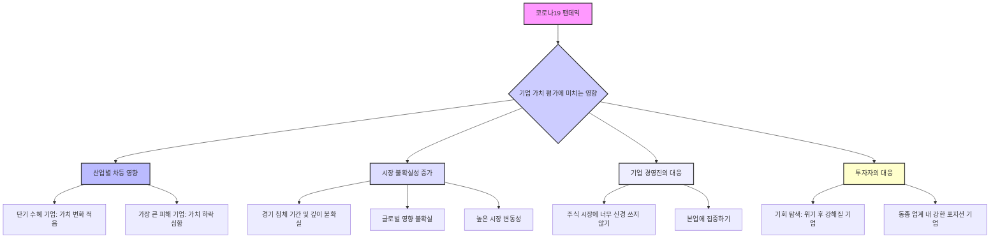
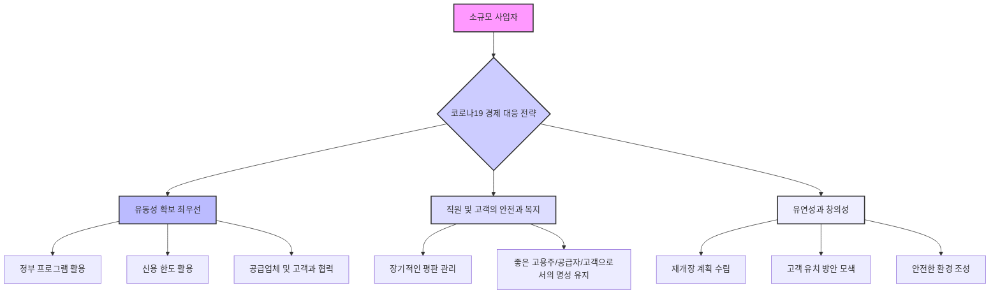
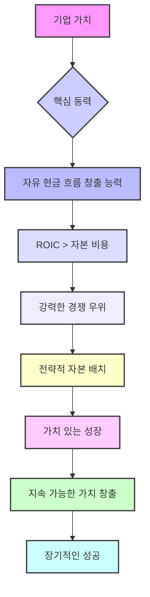

## 책 소개
이 책, 『가치 평가: 기업 가치 측정 및 관리(Valuation: Measuring and Managing the Value of Companies)』는 맥킨지(McKinsey & Company)의 내부 지침서로 시작하여 전 세계 CEO와 투자자들에게 기업 가치 창출의 핵심 원리를 알려주는 필독서가 되었다. 저자 팀 콜러(Tim Koller), 마크 고드하트(Marc Goedhart), 데이비드 웨슬스(David Wessels)는 이 책을 통해 기업이 어떻게 진정한 가치를 만들고, 성장하며, 장기적인 성공을 이룰 수 있는지 명확하게 설명한다. 이 책은 단순히 재무 공식을 넘어, 비즈니스 세계를 움직이는 단순하고 우아한 진실을 이해하는 데 도움을 준다.

## 본문 정리

## 1. 가치 창출의 첫 번째 비밀: 투자 대비 수익률 

사업을 하는 사람이라면 누구나 "우리가 정말 성공하고 있는 걸까? 진짜 가치를 만들고 있는 걸까, 아니면 그냥 바쁘기만 한 걸까?"라는 질문을 하게 된다. 이 질문에 대한 답은 바로 <mark>투자 대비 수익률(</mark>ROIC<mark>: </mark>Return on Invested Capital<mark>)</mark>에 있다.

1. **릴리와 네이트의 이야기**:
  1. 릴리와 네이트는 '릴리의 드레스'라는 옷 가게를 시작했다. 
  2. 그들은 1,000만 달러를 투자해서 1년 만에 180만 달러의 이익을 냈다. 
  3. 이것은 18%의 수익률인데, 은행에 돈을 넣어두면 10%를 벌 수 있었으니, 그들은 분명 가치를 만들고 있었다. 
2. **사촌 로건의 등장과 의문**:
  1. 릴리의 사촌 로건의 사업은 훨씬 빠르게 성장했고, 이익도 급증했다. 
  2. 릴리와 네이트는 자신들이 뭔가 놓치고 있는 건 아닌지 걱정하기 시작했다. 
3. **멘토의 조언: "이익을 얻기 위해 얼마를 투자했는가?"**:
  1. 현명한 멘토는 릴리와 네이트에게 로건의 이익만 보지 말고, 그 이익을 얻기 위해 <mark>얼마나 많은 돈을 투자했는지</mark> 물어봐야 한다고 조언했다. 
  2. 이것이 바로 첫 번째 중요한 교훈이다. 가치는 단순히 얼마나 많이 버느냐가 아니라, <mark>그 돈을 벌기 위해 얼마를 투자했느냐</mark>에 달려있다. 
  3. 이 개념을 <mark>투자 자본 수익률(ROIC)</mark>이라고 부른다. 
  - 마치 사업에 투자한 모든 돈에 대한 성적표와 같다. 
4. **로건 사업의 진실**:
  1. 로건은 빠르게 성장하기 위해 새로운 매장, 화려한 마케팅, 비싼 재고에 엄청난 돈을 쏟아붓고 있었다. 
  2. 그 결과, 투자한 돈 대비 수익률(ROIC)은 오히려 떨어지고 있었다. 
  3. 성장을 유지하기 위해 이익의 대부분을 재투자해야 했기 때문에, 연말에 실제로 남는 현금은 거의 없었다. 
5. **릴리와 네이트 사업의 강점**:
  1. 반면 릴리와 네이트는 독특한 디자인과 효율적인 매장 운영으로 경쟁 우위를 가지고 있었다. 
  2. 고객을 유치하고 성장하는 데 많은 돈을 쓸 필요가 없었기 때문에, ROIC가 높았고 현금 흐름도 좋았다. 
6. **가치 창출의 핵심 원칙**:
  1. 이날 그들은 이 책의 핵심 교훈을 배웠다. <mark>높은 성장은 자본에 대한 좋은 수익률이 동반될 때만 가치가 있다</mark>. 
  2. 기업은 <mark>투자 자본 수익률(ROIC)이 </mark>자본 비용<mark>(</mark>Cost of Capital<mark>)보다 높을 때만 가치를 창출한다</mark>. 
  - <mark>자본 비용</mark>은 투자자들이 비슷한 위험 수준에서 다른 곳에 투자했을 때 얻을 수 있는 수익률을 말한다. 
  - 릴리와 네이트의 경우, 주식 시장에서 벌 수 있었던 10%가 자본 비용이었다. 
  - 그들의 18% ROIC는 10% 자본 비용보다 높았으므로, 그들의 사업은 가치를 창출하는 기계였다. 
  3. 로건의 사업은 위험한 길을 걷고 있었다. 만약 그의 ROIC가 자본 비용보다 낮아지면, 성장하기 위해 투자하는 모든 새로운 돈은 가치를 파괴하는 것이 된다. 
  4. 이것은 매우 중요한 생각이다. 모든 회사가 쫓는 <mark>성장</mark>은 좋은 수익률을 내지 못한다면 <mark>끔찍한 것</mark>이 될 수 있다. 
  - 마치 인플레이션보다 낮은 이자를 주는 저축 계좌에 계속 돈을 넣는 것과 같다. 몸집은 커지지만 실제로는 더 가난해지는 셈이다. 

## 2. 미래를 보는 도구: 할인된 현금 흐름(DCF) 

릴리와 네이트는 성장과 ROIC 사이의 완벽한 균형을 찾는 것이 중요하다고 깨달았다. 하지만 단기적인 어려움과 장기적인 이득 사이에서 어떻게 결정을 내려야 할까? 이때 필요한 것이 바로 <mark>할인된 </mark>현금 흐름<mark>(DCF: Discounted Cash Flow)</mark>이라는 도구이다.

1. **새로운 아이디어, '릴리의 엠포리엄'**:
  1. 몇 년 후, 릴리와 네이트는 더 큰 매장인 '릴리의 엠포리엄'이라는 멋진 아이디어를 냈다. 
  2. 하지만 재무팀은 초기 투자가 엄청나게 필요하며, 첫 4년 동안은 이익이 빠르게 성장하더라도 ROIC와 현금 흐름이 실제로 감소할 것이라고 경고했다. 
  3. 그 이후에는 현금 흐름이 훨씬 높아질 예정이었다. 
  4. 그들은 단기적인 고통과 장기적인 이득 사이에서 어떻게 균형을 잡아야 할지 고민에 빠졌다. 
2. **할인된 **현금 흐름**(**DCF**)의 개념**:
  1. 이것이 바로 저자들이 제시하는 두 번째 중요한 도구인 <mark>할인된 현금 흐름(DCF)</mark>이다. 
  2. 이것은 복잡하게 들리지만, 아이디어는 아주 간단하다. 
  3. 미래를 내다보고, 사업이 앞으로 창출할 모든 현금을 현재 시점으로 끌어와 <mark>하나의 숫자로 그 가치를 평가하는 방법</mark>이다. 
3. **왜 미래의 현금을 현재로 끌어와야 할까?**:
  1. 10년 후에 받을 1달러는 지금 주머니에 있는 1달러보다 가치가 적다. 
  2. 지금 1달러를 투자하면 수익을 얻을 수 있기 때문이다. 
  3. 따라서 미래의 현금을 현재로 가져오려면, 그 기회비용(자본 비용)을 반영하는 비율로 <mark>할인</mark>해야 한다. 
4. **DCF 모델의 적용**:
  1. 릴리와 네이트가 DCF 모델을 적용하자 답이 명확해졌다. 
  2. 현재 사업의 가치는 약 5,300만 달러였지만, 새로운 엠포리엄 컨셉은 단기적인 현금 흐름 감소에도 불구하고 6,200만 달러의 가치가 있었다. 
  3. 장기적인 이득이 단기적인 고통을 훨씬 능가했던 것이다. 
  4. DCF 모델은 그들에게 과감한 도약을 할 수 있는 자신감을 주었다. 
  5. 이것은 당장의 시야를 넘어 사업의 전체 수명 가치를 기반으로 결정을 내릴 수 있게 해주는 도구이다. 

## 3. 비율이 아닌 가치를 쫓아라: 경제적 이익(Economic Profit) 

릴리와 네이트는 DCF 모델을 통해 장기적인 관점을 갖게 되었지만, 또 다른 함정에 빠질 뻔했다. 바로 <mark>경제적 이익(Economic Profit)</mark>이라는 개념을 이해하는 것이 중요했다.

1. **릴리의 영리한 질문**:
  1. 릴리는 "ROIC가 높을수록 좋다면, 14% 수익률만 내는 매장들은 문을 닫아야 하지 않을까? 그러면 회사 전체의 평균 ROIC가 올라갈 텐데"라고 물었다. 
2. **흔한 함정: 비율이 아닌 가치 극대화**:
  1. 이것은 흔히 빠지는 함정이며, 세 번째 핵심 개념인 경제적 이익으로 이어진다. 
  2. 목표는 <mark>수익률(%)을 극대화하는 것이 아니라, 창출하는 가치의 달러 금액을 극대화하는 것</mark>이다. 
3. **경제적 이익의 의미**:
  1. 그들의 자본 비용은 10%였다. 
  2. 14%를 버는 매장들은 여전히 기준치(10%)보다 4%포인트 더 벌고 있었다. 
  3. 이 매장들은 여전히 가치를 창출하고 있었던 것이다. 
  4. 이 매장들을 닫으면 회사 평균 ROIC는 더 좋아 보이겠지만, 회사의 규모는 작아지고 절대적인 달러 가치도 줄어들게 된다. 
4. **경제적 이익 계산**:
  1. <mark>경제적 이익</mark>은 이를 측정하는 간단한 방법이다. 
  2. <mark>ROIC와 자본 비용의 차이</mark>에 <mark>투자된 자본 금액</mark>을 곱한 값이다. 
  3. 이것은 1년 동안 얼마나 많은 가치를 달러로 창출했는지 알려준다. 
5. **릴리와 네이트의 깨달음**:
  1. 릴리와 네이트가 계산해보니, 수익률이 낮지만 여전히 수익성이 있는 매장들을 닫으면 총 경제적 이익이 실제로 감소한다는 것을 알게 되었다. 
  2. 교훈은 <mark>비율(%)을 쫓지 말고, 가치(달러 금액)를 쫓으라</mark>는 것이다. 

## 4. 기대치 쳇바퀴: 주식 시장의 압력 

릴리와 네이트의 사업은 '엠포리엄' 컨셉의 성공으로 엄청나게 성장했고, 더 많은 자본이 필요해졌다. 이제 회사를 공개(상장)할 때가 왔다. 주식 시장에 진입하면서 그들은 새로운 규칙과 압력에 직면하게 되는데, 저자들은 이를 <mark>기대치 쳇바퀴(</mark>Expectations Treadmill<mark>)</mark>라고 부른다.

1. **실제 시장과 금융 시장의 차이**:
  1. 지금까지 릴리와 네이트는 고객, 제품, 현금 흐름의 <mark>실제 시장</mark>에서 활동했다. 
  2. 실제 시장에서는 자본 비용보다 높은 수익률로 자본을 투자하여 가치를 창출한다. 
  3. 하지만 <mark>금융 시장(주식 시장)</mark>에서는 규칙이 다르다. 
  4. 주식 가격은 회사가 <mark>과거에 무엇을 했는지</mark>가 아니라, 투자자들이 <mark>미래에 무엇을 할 것으로 기대하는지</mark>에 기반한다. 
2. 기대치** 프리미엄**:
  1. 릴리와 네이트가 회사를 상장했을 때, 모든 미래 현금 흐름의 내재 가치는 주당 약 20달러였다. 
  2. 하지만 그들이 수년간 투자한 실제 돈(장부 가치)은 주당 7달러에 불과했다. 
  3. 이 추가 13달러는 투자자들이 회사가 미래에 창출할 것으로 기대하는 모든 경제적 이익에 대해 기꺼이 지불한 <mark>프리미엄</mark>이었다. 
3. **기대치 쳇바퀴의 작동 방식**:
  1. 릴리는 "투자자들이 이 프리미엄을 미리 지불하면 어떻게 돈을 버는가?"라고 물었다. 
  2. 답은 이렇다. 만약 회사가 <mark>정확히 기대했던 대로</mark> 성과를 낸다면, 투자자들은 기회비용(자본 비용, 10%)과 동일한 수익률만 얻게 된다. 
  3. 주주들이 그 이상의 수익률을 얻는 유일한 방법은 회사가 <mark>기대치를 뛰어넘는 성과</mark>를 낼 때뿐이다. 
  4. 만약 기대치보다 낮은 성과를 내면, 수익률은 더 낮아진다. 
  5. 이것이 바로 <mark>기대치 쳇바퀴</mark>이다. 
  - 마치 CEO가 어려움을 겪던 회사를 성공적으로 회생시켜 주가가 급등하고 영웅이 된 상황을 상상해봐. 
  - 하지만 이제 쳇바퀴는 더 빨라졌다. 투자자들은 당신이 단순히 잘하는 것을 넘어 <mark>지속적으로 훌륭한 성과</mark>를 내기를 기대한다. 
  - 주가를 유지하려면 더 빨리 달려야 하고, 더 나은 성과를 내야 한다. 
  - 모두가 기대하는 대로 훌륭한 성과를 계속 내더라도, 주식은 그저 평범한 성과를 낼 뿐이다. 
  - 주가를 다시 끌어올리려면 <mark>초인적인 성과</mark>를 내야 한다. 
4. **좋은 회사와 좋은 주식의 차이**:
  1. 이것이 바로 <mark>좋은 회사가 항상 좋은 주식이 아닌 이유</mark>이다. 
  2. 훌륭하고 수익성이 높은 회사라도, 이미 향후 10년간의 완벽한 성과가 주가에 반영되어 있다면 <mark>끔찍한 투자</mark>가 될 수 있다. 
  3. 반대로, 어려움을 겪는 평범한 회사라도 실패에 대한 기대치가 주가에 반영되어 있다면 <mark>환상적인 투자</mark>가 될 수 있다. 낮은 기대치를 뛰어넘는 것이 훨씬 쉽기 때문이다. 
5. **기대치 쳇바퀴의 위험**:
  1. 끊임없이 높아지는 기대치를 충족해야 한다는 압력은 경영진이 잘못된 행동을 하게 만들 수 있다. 
  2. 장기적인 가치 대신 <mark>단기적인 이익</mark>에 집중할 수 있다. 
  3. 이번 분기 실적을 좋게 보이게 하기 위해 연구 개발을 줄이거나 안전에 소홀히 할 수 있다. 
  4. 시장의 성장 욕구를 충족시키기 위해 큰 성공을 바라며 거대하고 위험한 인수를 할 수도 있다. 
  5. 이러한 행동은 진정한 가치 창출과는 반대되는 것이다. 
  6. 주가 급등을 원하는 현재 주주들의 이익을, 현재와 미래의 모든 주주를 위한 집단적 가치보다 우선시하는 것이다. 

## 5. 가치 보존의 원칙: 파이를 키워라, 재분배하지 마라 

기대치 쳇바퀴의 압력 속에서 경영진은 때때로 진정한 가치 창출이 아닌, 겉으로만 좋아 보이는 행동을 할 수 있다. 이때 중요한 것이 바로 가치 보존의 원칙<mark>(Conservation of Value)</mark>이다.

1. 가치 보존의 원칙:
  1. 이것은 책의 가장 강력하고 명확한 원칙 중 하나인 <mark>가치 보존의 원칙</mark>으로 이어진다. 
  2. 이것은 간단하지만 심오한 진실이다. <mark>조각들을 재배열하는 것만으로는 가치를 창출할 수 없다</mark>. 
  3. 회사의 <mark>현금 흐름을 실제로 증가시키지 않는 어떤 것도 가치를 창출하지 않는다</mark>. 
2. **주식 재매입(**자사주 매입**)의 함정**:
  1. <mark>주식 재매입(자사주 매입)</mark>을 생각해보자. 회사가 현금을 사용하여 주식 시장에서 자사 주식을 매입하는 것이다. 
  2. 이 경우 주식 수가 줄어들어 주당 순이익<mark>(EPS)</mark>이 종종 증가한다. 
  3. 노력 없이 EPS가 높아지니 좋은 거래처럼 보인다. 많은 경영진이 이 함정에 빠진다. 
  4. 하지만 가치 보존의 원칙은 "사업의 총 현금 흐름이 증가했는가?"라고 묻게 한다. 
  5. 아니다. 회사는 단순히 현금을 사용하여 자기 자신을 매입한 것뿐이다. 
  6. <mark>전체 파이의 크기는 같고, 단지 더 적고 큰 조각으로 잘린 것뿐</mark>이다. 
  7. EPS는 올라갔지만, 회사는 이제 현금이 줄거나 부채가 늘어 위험해졌다. 
  8. 투자자들은 이러한 증가된 위험을 인식하고 더 높은 수익률을 요구할 것이며, 이는 회사의 주가수익비율(PE ratio)을 낮춘다. 
  9. 결국 높아진 EPS는 낮아진 PE 비율로 완벽하게 상쇄되어 <mark>가치는 창출되지 않는다</mark>. 
3. **회계 트릭과 금융 공학**:
  1. 화려한 회계 트릭이나 복잡한 금융 공학에도 동일하게 적용된다. 
  2. 수익을 늘리거나, 마진을 개선하거나, 자본을 더 효율적으로 사용하여 <mark>사업 운영을 통해 창출되는 현금을 증가시키지 않는 한</mark>, 그것은 단지 가치를 이리저리 옮기는 것일 뿐이다. 
  3. 가치를 창출하는 것이 아니다. 
  4. 시장은 생각보다 똑똑하며, 장기적으로는 환상에 속지 않는다. 

## 6. 자본 비용의 비밀: 분산 불가능한 위험 

우리는 자본 비용, 즉 회사가 넘어야 할 최소 수익률에 대해 많이 이야기했다. 그렇다면 이 숫자는 어디에서 오는 걸까? 그것은 바로 <mark>위험</mark>과 관련이 있다. 하지만 아주 <mark>특정한 종류의 위험</mark>이다.

1. **분산 가능한 위험(**Diversifiable** Risk)**:
  1. 단일 회사를 소유하고 있다고 상상해보자. 핵심 직원이 그만두거나, 새로운 경쟁자가 생기거나, 공장에 불이 날 수도 있다. 
  2. 이러한 위험들은 모두 <mark>분산 가능한 위험</mark>이다. 
  3. 왜냐하면 똑똑한 투자자는 한 회사만 소유하지 않고, 수십 또는 수백 개의 주식으로 구성된 포트폴리오를 소유하기 때문이다. 
  4. 한 회사의 공장에 불이 나더라도, 포트폴리오의 다른 회사는 아마 좋은 한 해를 보내고 있을 것이다. 
  5. 이러한 회사 고유의 위험들은 분산된 포트폴리오 내에서 서로 상쇄되는 경향이 있다. 
  6. 투자자들은 분산을 통해 이러한 유형의 위험을 <mark>무료로 제거</mark>할 수 있으므로, 이에 대한 보상을 요구하지 않는다. 
  7. 따라서 <mark>자본 비용에 영향을 미치지 않는다</mark>. 
2. **분산 불가능한 위험(**Non-diversifiable** or Systematic Risk)**:
  1. 그렇다면 어떤 위험이 중요한가? <mark>제거할 수 없는 위험</mark>이다. 
  2. 이것을 <mark>분산 불가능한 위험</mark> 또는 <mark>체계적 위험</mark>이라고 부른다. 
  3. 경기 침체, 금리 변화, 글로벌 위기와 같이 <mark>경제의 거의 모든 회사에 영향을 미치는 위험</mark>이다. 
  4. 투자자들은 이 위험을 분산시킬 수 없기 때문에, 이 위험을 감수하는 대가를 요구한다. 
  5. 이것이 바로 <mark>자본 비용에 반영되는 위험</mark>이다. 
3. **경영진의 오해와 올바른 접근**:
  1. 이것은 중요한 통찰력이다. 경영진이 걱정하는 대부분의 일상적인 위험(제품 출시 실패, 경쟁사의 행동 등)은 분산 가능하며, <mark>회사의 가치 평가에 영향을 미치지 않는다</mark>. 
  2. 새로운 광고 캠페인 같은 것은 회사의 자본 비용을 실제로 바꾸지 않는다. 
  3. 물론 이러한 위험은 회사의 현금 흐름에 절대적으로 영향을 미치지만, 할인율을 임의로 높여서 처리해서는 안 된다. 
  4. 저자들은 이 점을 매우 명확히 한다. 
  5. 예를 들어, 신흥 시장 프로젝트에 대해 모호한 위험 프리미엄을 할인율에 추가하는 대신, <mark>다양한 시나리오를 통해 생각하는 것이 훨씬 낫다</mark>. 
  - 평상시 시나리오에서 현금 흐름은 어떻게 되는가? 
  - 정치적 위기 시나리오에서는 어떻게 되는가? 
  6. 이러한 다양한 결과를 모델링하고 확률을 할당함으로써, 프로젝트의 진정한 가치와 위험에 대한 훨씬 더 명확하고 솔직한 그림을 얻을 수 있다. 
  7. 이것은 추상적인 할인율에 대한 논쟁이 아니라, <mark>실제 비즈니스 문제에 대한 대화</mark>를 강제한다. 

## 7. 가치 창출의 핵심 요약 및 실천 방안 

릴리와 네이트의 이야기는 모든 사업의 이야기이다. 그들은 열정과 직관에서 시작하여, 단순히 생존하는 회사와 진정으로 번성하고 지속적인 가치를 창출하는 회사를 구분하는 단순하고 시대를 초월한 원칙들을 깊이 이해하게 되었다.

1. **가치 창출의 근본 법칙**:
  1. 사업은 <mark>자본에 대한 수익률이 자본 비용보다 높을 때만 가치를 창출한다</mark>. 
  2. 성장은 가치의 강력한 증폭기이지만, 첫 번째 규칙이 충족될 때만 그렇다. 
  3. 그들은 <mark>할인된 </mark>현금 흐름<mark>(</mark>DCF<mark>)</mark>과 같은 도구를 사용하여 미래를 내다보고 대담하고 장기적인 결정을 내리는 법을 배웠다. 
  4. 공개 시장에 진입했을 때는 기대치<mark> 쳇바퀴</mark>의 끊임없는 압력에 대해서도 배웠다. 
2. **가치 평가의 핵심 메시지**:
  1. 재무 공식과 전문 용어에 얽매이기 쉽지만, 이 책의 가장 강력한 메시지는 그 <mark>심오한 단순성</mark>에 있다. 
  2. 금융 세계의 모든 복잡성에도 불구하고, 사업을 성공시키는 핵심은 한 문장으로 설명할 수 있다. 
  3. <mark>회사는 돈을 투자하고, 투자자들이 동일한 위험 수준에서 다른 곳에서 벌 수 있었던 것보다 더 높은 수익률을 얻을 때 가치를 창출한다</mark>. 
  4. 이것이 바로 자본주의의 엔진이다. 
  5. 전략, 마케팅, 운영 등 다른 모든 것은 이 목표를 달성하기 위한 수단일 뿐이다. 
  6. 성장은 이 엔진을 더 크고 강력하게 만드는 연료이지만, <mark>엔진 자체가 효율적일 때만</mark> 그렇다. 
3. 가치 마인드셋**(Value Mindset) 개발**:
  1. 이 아이디어는 매우 강력하다. 월스트리트의 마법사가 아니더라도 좋은 사업의 기본을 이해할 수 있다는 뜻이다. 
  2. 어떤 회사든 두 가지 간단한 질문을 던지면 된다. 
  - 이 사업이 매장, 기술, 인력에 투자하는 모든 돈에 대해 <mark>좋은 수익률</mark>을 얻고 있는가? 즉, ROIC가 높은가? 경쟁 우위의 증거가 보이는가? 
  - 어떻게 성장하고 있는가? 새로운 매장을 열고, 새로운 제품을 만들고, 다른 회사를 인수하는가? 그리고 그 성장이 <mark>좋은 수익률</mark>을 내는 것처럼 보이는가? 아니면 릴리의 사촌 로건처럼 그저 몸집을 키우기 위해 커지는 것처럼 느껴지는가? 
  3. 이 두 가지 질문을 하기 시작하면, 저자들이 말하는 <mark>가치 마인드셋</mark>을 개발하기 시작할 것이다. 
  4. 세상을 단순히 소비자가 아닌 <mark>소유자</mark>의 관점에서 보게 될 것이다. 
  5. 이러한 마인드셋은 어떤 직업을 선택하든 가질 수 있는 가장 귀중한 자산 중 하나이다. 
4. **단기적인 소음과 장기적인 가치의 차이**:
  1. 또 다른 강력한 교훈은 <mark>단기적인 소음</mark>과 <mark>장기적인 가치</mark>의 차이에 관한 것이다. 
  2. 세상은 분기별 실적, 주가 변동, 회사가 기대치를 뛰어넘었는지 여부에 대해 끊임없이 소리칠 것이다. 
  3. 기대치 쳇바퀴는 현실이며, 최고의 리더들조차 단기적인 결정을 내리도록 유혹한다. 
  4. 하지만 이 책은 그 소음을 꿰뚫어 볼 수 있는 틀을 제공한다. 
  5. 진정한 게임은 분기별 목표를 달성하는 것이 아니라, <mark>수십 년 동안 가치를 창출할 수 있는 건강하고 회복력 있는 회사를 건설하는 것</mark>이다. 
  6. 이번 분기 월스트리트의 기대치를 놓치더라도, 제품, 인력, 브랜드에 대한 투자가 몇 년 동안 성과를 내지 못할지라도, <mark>오늘 투자할 용기</mark>를 갖는 것이다. 
  7. 이것은 비즈니스뿐만 아니라 삶에도 적용되는 교훈이다. 
  8. 훌륭한 교육, 튼튼한 관계, 기술 숙달과 같이 가장 큰 가치를 창출하는 것들은 즉각적인 보상을 거의 제공하지 않는다. 
  9. 그것들은 <mark>초기 투자, 인내, 그리고 장기적인 관점</mark>을 요구한다. 
5. **오늘부터 적용할 수 있는 아이디어**:
  1. **가치 마인드셋 연습**: 다음에 가게에 들어갈 때, "이 사업은 왜 성공적일까? 경쟁 우위는 무엇일까? 얼마나 효율적으로 보이는가? 붐비는가? 직원들은 친절한가?"라고 스스로에게 물어보라. 이것들은 모두 ROIC에 대한 단서이다. 
  2. **기대치에 대한 연구**: 회사의 주가가 실적 발표 후 급등하거나 급락하는 것을 볼 때, 헤드라인 너머를 읽어보라. 실적 숫자 자체 때문이었을까? 아니면 보고서의 어떤 내용이 투자자들의 미래에 대한 기대치를 바꾼 것일까? 이것은 소음에서 신호를 분리하는 법을 가르쳐줄 것이다. 
  3. 가치 보존의 원칙** 기억**: 아무것도 없이 가치를 약속하는 모든 것에 회의적이어야 한다. 너무 좋아서 믿기 어려운 금융 상품이든, 실제 운영 개선보다는 영리한 트릭에 의존하는 사업 전략이든, <mark>진정한 가치는 더 많은 현금 흐름을 창출하는 데서 온다</mark>는 것을 기억하라. 
  4. <mark>파이를 재분배하는 것이 아니라, 파이를 더 크게 만드는 것</mark>이다. 

## 8. 코로나19 팬데믹 시대의 기업 가치 평가 

맥킨지의 팀 콜러는 코로나19 팬데믹과 같은 위기 상황에서도 기업 가치 평가의 기본 원칙은 변하지 않는다고 강조한다. 다만, 시장의 불확실성이 커지고 산업별 영향이 달라지므로, 기업과 투자자는 상황에 맞는 현명한 대응이 필요하다.

1. **코로나19가 기업 가치 평가에 미치는 영향**:
  1. 주식 시장은 하나의 마음이 아니다. 시장은 다양한 투자자들의 관점이 상호작용한 결과이다. 
  2. 모든 기업이나 산업이 동일하게 하락한 것이 아니다. 
  3. 시장은 단기적으로 이득을 볼 기업과 장기적인 가치 변화가 크지 않을 기업을 식별할 수 있었다. 
  4. 가장 큰 피해를 입을 기업과 산업은 가장 많이 하락했다. 
  5. 하지만 모든 기업에 영향을 미치는 엄청난 불확실성이 존재한다. 
  - 경기 침체가 얼마나 오래 지속될지, 얼마나 깊을지, 얼마나 전 세계적일지 알 수 없다. 
  - 이것이 시장 변동성의 주요 원인이다. 
2. **기업 경영진의 대응**:
  1. 기업 경영진이라면 주식 시장이 어떻게 움직이는지에 대해 너무 걱정하지 말고, <mark>본업에 집중</mark>해야 한다. 
  2. 대부분의 시장 움직임은 산업 자체에 의해 좌우되기 때문에, 경영진이 직접 영향을 미칠 수 있는 부분이 많지 않다. 
3. **투자자의 대응**:
  1. 투자자들은 이러한 상황 속에서도 <mark>기회를 찾는다</mark>. 
  2. 위기 상황에서 더 강해지거나, 최소한 동종 업계 내에서 강력한 위치를 유지할 수 있는 기업들을 찾는다. 
  3. 이러한 위기는 일부 산업의 운영 방식을 장기적으로 변화시킬 것이다. 

## 9. 소규모 사업자를 위한 조언: 유동성 확보와 평판 관리 

맥킨지의 팀 콜러는 소규모 사업자들이 코로나19와 같은 경제 위기 상황에서 생존하고 번성하기 위해 가장 중요하게 고려해야 할 두 가지를 강조한다. 바로 <mark>유동성 확보</mark>와 <mark>평판 관리</mark>이다.

1. 유동성** 확보가 최우선**:
  1. 소규모 사업자에게는 <mark>유동성(Liquidity)</mark>이 가장 중요하다. 
  2. 불확실한 시기를 견뎌내야 하기 때문이다. 
  3. 정부 프로그램 신청, 신용 한도 활용 등 필요한 유동성을 확보해야 한다. 
  4. 공급업체나 고객과 협력하여 이 시기를 함께 헤쳐나가는 것도 중요하다. 
2. **직원과 고객의 안전 및 복지**:
  1. 직원과 고객의 <mark>안전과 복지</mark>를 최우선으로 생각하는 것이 절대적으로 중요하다. 
  2. 소비자, 공급업체 등 모든 관계자들은 기업이 위기 상황에서 어떻게 행동했는지 <mark>오래 기억한다</mark>. 
  3. 지금은 좋은 고용주, 고객에게 좋은 서비스를 제공하는 공급자, 공급업체에게 좋은 고객이라는 <mark>평판을 개발하고 유지할 때</mark>이다. 
  4. 이러한 평판과 유동성을 결합하여 위기를 잘 헤쳐나가야 한다. 
3. **유연성과 창의성**:
  1. 사업마다 상황이 다르겠지만, <mark>준비하고, 유연하며, 창의적</mark>이어야 한다. 
  2. 경제가 다시 열릴 때, 고객들이 안전하다고 느끼고 다시 사업장으로 돌아오도록 장려할 수 있는 방법을 고민해야 한다. 
  3. 이러한 노력이 없다면, 위기를 극복하더라도 고객과 직원이 다시 함께 일하고 싶어 하지 않을 수 있다. 

## 10. 스타트업처럼 생각하라: 위기 속 사업 계획 

위기 상황에서 사업을 평가하고 유동성을 확보하는 것은 매우 어렵다. 특히 대출 기관이나 투자자에게 사업의 가치를 설득해야 할 때 더욱 그렇다. 이때는 마치 <mark>스타트업처럼</mark> 처음부터 다시 시작한다는 마음으로 사업 계획을 세우는 것이 중요하다.

1. **위기 상황에서의 **가치 평가:
  1. 코로나19와 같은 상황에서 사업이 몇 달간 문을 닫았고 회복이 불확실할 때, 대출 기관은 돈을 빌려주지 않으려 할 수 있다. 
  2. 이럴 때는 <mark>기본 원칙으로 돌아가</mark> 사업이 위기에서 벗어났을 때 어떤 모습일지에 대한 <mark>최선의 시나리오</mark>를 만들어야 한다. 
2. **구체적인 재개장 계획**:
  1. 사업을 다시 열 때 어떻게 재개할지, 고객을 어떻게 유치할지 등 <mark>매우 구체적인 계획</mark>을 세워야 한다. 
  2. 이를 통해 빠르게 정상 궤도로 돌아가 수익과 현금 흐름을 창출할 수 있다. 
3. **스타트업 마인드셋**:
  1. 지금은 마치 <mark>스타트업</mark>과 같은 상황이다. 
  2. 하지만 과거의 운영 경험을 바탕으로 계획을 세울 수 있다는 장점이 있다. 
  3. 다양한 시나리오에서 몇 주 동안 생존할 수 있는지에 대한 <mark>상세한 </mark>유동성<mark> 전망</mark>을 가지고 있어야 한다. 
  4. 상황과 그것이 자신에게 미치는 영향, 그리고 경제가 다시 열릴 때 어떻게 회복할 수 있을지에 대해 <mark>최대한 준비하고 지식을 갖춰야 한다</mark>. 

## 11. 가치 창출의 근본 원리: 자본 비용을 초과하는 현금 흐름 

기업이 진정으로 성공하고 가치를 창출하는 핵심은 무엇일까? 그것은 바로 <mark>자본 비용을 초과하는 수익률로 현금 흐름을 창출하는 능력</mark>에 달려있다. 이 원칙은 모든 이해관계자의 장기적인 이익을 포괄하며, 지속 가능한 성장의 기반이 된다.

1. **가치 창출의 정의**:
  1. 이 책은 지속 가능한 가치 창출이 <mark>자본 비용을 초과하는 비율로 현금 흐름을 창출하는 것</mark>이라고 주장한다. 
  2. 가치 창출은 시장 경제에서 기업 성공의 주요 척도이며, 주주뿐만 아니라 모든 이해관계자의 장기적인 이익을 포함한다. 
  3. 장기적인 주주 가치를 극대화하는 기업은 더 많은 일자리를 창출하고, 직원을 더 잘 대우하며, 고객을 더 만족시키고, 더 큰 기업의 사회적 책임을 다하는 경향이 있다. 
2. **가치 창출의 핵심 원칙**:
  1. 가치 창출의 핵심 원칙은 <mark>자본 비용을 초과하는 수익률로 미래 현금 흐름을 창출하기 위해 자본을 투자하는 것</mark>이다. 
  2. <mark>성장</mark>과 투자 자본 수익률<mark>(</mark>ROIC<mark>)</mark>이 자본 비용 대비 얼마나 되는지가 가치를 좌우한다. 
3. 가치 보존의 원칙:
  1. 가치 보존의 원칙은 <mark>현금 흐름을 증가시키지 않는 어떤 것도 가치를 창출하지 않는다</mark>고 말한다. 
  2. 회계 기법을 변경하거나, 총 현금 흐름을 변경하지 않고 부채를 자본으로 대체하는 것 등이 이에 해당한다. 
4. **시장과 가치**:
  1. 시장 거품과 금융 위기는 기업과 투자자들이 이러한 근본 원칙을 잊을 때 발생하며, 이는 실제 가치 창출에 대한 혼란으로 이어진다. 
  2. 주식 시장은 변동성이 크지만, 일반적으로 내재 가치를 반영하며, 유동성이 낮은 신용 시장과 달리 위기 상황에서도 잘 작동한다. 
  3. 장기적인 가치 창출에 집중하는 것은 더 강력한 경제, 더 높은 생활 수준, 그리고 개인에게 더 많은 기회를 제공한다. 
5. **핵심 교훈**:
  1. 진정한 가치 창출은 <mark>장기적으로 자본 비용보다 높은 수익률로 현금 흐름을 창출하는 것</mark>이다. 
  2. 분기별 실적 예측이나 회계 속임수와 같은 단기적인 지표에 흔들리지 마라. 시장은 결국 이러한 단기적인 압력을 꿰뚫어 본다. 
  3. 단기적인 압력은 종종 장기적인 가치를 파괴하는 결정으로 이어진다. 
6. **실용적인 예시: 커피 머신 투자**:
  1. 작은 사업을 위해 새 커피 머신에 투자할지 결정한다고 가정해보자. 
  2. 단순히 커피 판매량(수익)만 볼 것이 아니라, <mark>투자 수익률(ROI)</mark>을 고려해야 한다. 
  3. 머신이 1,000달러이고, 커피 및 유지보수 비용을 제외하고 연간 200달러의 추가 수익을 낸다면 ROI는 20%이다. 
  4. 만약 자본 비용(다른 곳에 1,000달러를 투자했을 때 벌 수 있는 수익 또는 대출 이자)이 10%라면, 이 투자는 20%가 10%보다 크기 때문에 <mark>가치를 창출하는 것</mark>이다. 
7. **가치 보존의 오류 피하기**:
  1. 커피 원두 재고 회계 방식을 변경하여(예: 선입선출에서 후입선출로) 보고된 이익을 높이더라도, 실제로 라떼 판매량이나 현금 보유액은 변하지 않는다. 
  2. 커피 사업의 근본적인 가치는 동일하게 유지된다. 
  3. 시장, 고객, 잠재적 구매자들은 회계 트릭만으로는 속지 않을 것이다. 

## 12. 가치 창출의 근본 원리: ROIC와 성장의 조화 

기업 가치 창출의 핵심은 단순히 이익을 내는 것을 넘어, 투자 자본 수익률<mark>(</mark>ROIC<mark>)</mark>과 <mark>성장</mark>이라는 두 가지 요소가 어떻게 상호작용하는지를 이해하는 데 있다. 이 둘의 균형이 기업의 진정한 가치를 결정한다.

1. **가치 창출의 동력**:
  1. 가치는 기업이 <mark>투자 자본 수익률(ROIC)이 자본 비용보다 높은 비율로 현금 흐름을 창출하는 능력</mark>에 의해 좌우된다. 
  2. 기업이 더 빠르게 성장하고 매력적인 수익률로 더 많은 자본을 투입할수록 더 많은 가치를 창출한다. 
2. **ROIC, 매출 성장, 현금 흐름의 관계**:
  1. ROIC, 매출 성장, 현금 흐름은 수학적으로 연결되어 있다. 
  2. <mark>투자율 = 성장률 / ROIC</mark>라는 공식이 성립한다. 
  3. 이는 세 변수 중 두 가지만 알면 나머지 하나를 이해할 수 있다는 의미이다. 
3. **ROIC 수준에 따른 성장 전략**:
  1. <mark>ROIC가 높은 기업</mark>은 더 많은 추가 가치를 창출하므로 <mark>성장을 우선시</mark>해야 한다. 
  2. <mark>ROIC가 낮은 기업</mark>은 성장을 하기 전에 <mark>수익률 개선에 집중</mark>해야 한다. 자본 비용보다 낮은 성장은 가치를 파괴하기 때문이다. 
4. **가치 창출적 성장의 종류**:
  1. 모든 성장이 동일하게 가치를 창출하는 것은 아니다. 
  2. 신제품을 통한 유기적 성장이 인수합병이나 시장 점유율 경쟁을 통한 성장보다 더 많은 가치를 창출하는 경향이 있다. 
5. 가치 보존의 원칙** 재강조**:
  1. 가치 보존의 원칙은 현금 흐름을 증가시키지 않는 행동은 가치를 창출하지 않는다고 말한다. 
  2. 단순히 현금 흐름에 대한 권리를 재배열하는 금융 공학은 가치를 만들지 않는다. 
6. **위험과 가치**:
  1. 위험은 자본 비용과 <mark>미래 현금 흐름의 </mark>불확실성을 통해 가치에 영향을 미친다. 
  2. <mark>분산 가능한 위험</mark>은 자본 비용에 영향을 미치지 않는다. 
7. **핵심 교훈**:
  1. 수익성(ROIC)과 성장의 상호작용이 핵심 메시지이다. 
  2. 특히 사업의 수익성이 높지 않다면, <mark>성장을 위한 성장</mark>은 가치를 파괴하는 지름길이다. 
  3. 대신 효율적인 자본 배치에 집중해야 한다. 
  4. 금융적인 조작은 미래 현금 흐름을 진정으로 증가시키거나 위험을 줄일 때만 가치가 있다. 단순히 현금 흐름의 형태를 바꾸는 것은 아니다. 
8. **실용적인 예시: 두 개의 레모네이드 가판대**:
  1. '가치 주식회사(Value Inc.)'와 '볼륨 주식회사(Volume Inc.)'라는 두 개의 가상의 레모네이드 가판대를 생각해보자. 
  2. 둘 다 초기 수익 100달러로 시작하여 연간 5%씩 수익을 성장시킨다. 
  3. **가치 주식회사**: 매우 효율적이다. 수익이 5달러 증가할 때마다 25달러만 재투자하면 된다. ROIC는 20%이다. 
  4. **볼륨 주식회사**: 덜 효율적이다. 동일한 5달러 수익 증가를 위해 50달러를 재투자해야 한다. ROIC는 10%이다. 
  5. 둘 다 수익은 같은 비율로 성장하지만, 가치 주식회사는 재투자가 적기 때문에 더 많은 현금 흐름을 창출한다. 
  6. 만약 투자자들이 기대하는 자본 비용이 10%라면, 가치 주식회사는 1,500달러의 가치가 있고, 볼륨 주식회사는 1,000달러의 가치가 있다. 
  7. **교훈**: ROIC가 높은 레모네이드 가판대를 운영한다면, 더 많은 가판대를 여는 것(성장)에 집중하라. 
  8. ROIC가 낮다면, 확장하기 전에 현재 가판대를 더 효율적으로 개선하는 데 집중하라. 비효율적인 사업을 확장하는 것은 더 많은 가치를 파괴할 뿐이다. 

## 13. 기대치 쳇바퀴: 주식 시장의 단기적 압력 

주식 시장에서 기업의 가치는 단순히 실제 성과뿐만 아니라 <mark>투자자들의 기대치</mark>에 의해 크게 좌우된다. 이 '기대치 쳇바퀴'는 기업 경영진에게 끊임없는 압력을 가하며, 단기적인 주가 상승이 반드시 장기적인 가치 창출을 의미하지는 않는다는 중요한 교훈을 준다.

1. **총 **주주 수익률**(TRS)의 구성**:
  1. <mark>총 주주 수익률(TRS: Total Returns to Shareholders)</mark>은 주가 상승과 배당금을 합한 것이다. 
  2. 10년 이상의 장기적인 기간 동안 TRS는 실제 기업 성과를 반영한다. 
  3. 하지만 10년 미만의 단기적인 기간 동안 TRS는 <mark>변화하는 투자자 </mark>기대치에 크게 영향을 받으며, 이는 <mark>기대치 쳇바퀴</mark>로 이어진다. 
2. **기대치 쳇바퀴의 의미**:
  1. 기대치 쳇바퀴는 성공적인 기업이 이미 고성능 기업이라 할지라도, TRS를 유지하거나 개선하기 위해 <mark>지속적으로 시장 기대치를 초과해야 한다</mark>는 것을 의미한다. 
3. **TRS의 네 가지 구성 요소**:
  1. TRS는 네 가지 구성 요소로 분해할 수 있다. 
  - 매출 성장 
  - 성장을 위한 투자 
  - 투자자 기대치의 변화(주가수익비율(PE) 변화) 
  - 재무 레버리지(부채 활용) 
  2. 높은 ROIC와 성장을 동반한 <mark>강력한 운영 성과</mark>가 진정한 장기적인 가치 동력이다. 
  3. 하지만 단기적인 TRS는 <mark>기대치 상승</mark>이나 <mark>높은 재무 레버리지</mark>에 의해 부양될 수 있다. 
4. **경영진의 위험한 행동**:
  1. 높은 기대치에 기반한 높은 시장 가치를 가진 기업의 경영진은 이러한 기대치를 충족시키기 위해 <mark>잘못된 행동</mark>을 할 유혹을 받을 수 있다. 
  2. 예를 들어, 장기적인 가치를 파괴할 수 있는 위험한 인수를 하는 것이다. 
5. **기대치 이해의 중요성**:
  1. 기대치를 이해하는 것이 매우 중요하다. 
  2. 시장을 지속적으로 능가하는 기업은 종종 미래 TRS 하락으로 이어진다. 이미 높은 기대치가 주가에 반영되어 있기 때문이다. 
6. **핵심 교훈**:
  1. <mark>단기적인 주식 시장 성과</mark>를 <mark>실제 </mark>가치 창출과 혼동하지 마라. 
  2. 훌륭한 사업이라도, 주가가 이미 지나치게 낙관적인 기대치를 반영하고 있다면 <mark>단기적으로는 좋지 않은 투자</mark>가 될 수 있다. 
  3. 단기적인 주가 상승을 쫓기보다는, <mark>장기적인 현금 흐름을 이끄는 실제 사업 성과</mark>에 집중해야 한다. 
7. **실용적인 예시: 월마트와 타겟**:
  1. 두 소매 거인 월마트와 타겟을 비교해보자. 
  2. 1995년부터 2005년까지 월마트는 매출 성장과 ROIC 모두에서 타겟을 능가했다. 
  3. 하지만 타겟 주주들은 훨씬 더 높은 TRS(24% 대 15%)를 얻었다. 
  4. **이유**: 1995년 타겟은 일부 브랜드의 어려움으로 인해 시장 기대치(PE)가 낮았다. 
  5. 타겟이 사업을 성공적으로 회생시키고 낮은 기대치를 뛰어넘으면서, PE가 크게 증가하여 TRS를 끌어올렸다. 
  6. 월마트는 이미 높은 성과를 내고 있었고, 높은 기대치가 주가에 반영되어 있었기 때문에, 주가를 안정적으로 유지하기 위해서도 이러한 기대치를 지속적으로 충족시켜야 했다. 
  7. 이것이 월마트가 뛰어난 기본 성과에도 불구하고 높은 TRS를 창출하기 어려웠던 이유이다. 
  8. **교훈**: 기대치가 이미 매우 높은 상황을 인지해야 한다. 
  9. 기대치가 낮은 분야에서 훌륭한 결과를 달성하는 것이 불균형적으로 긍정적인 결과를 가져올 수 있다. 
  10. 반면, 이미 천문학적인 기대치를 뛰어넘는 것은 여전히 실망스럽게 느껴질 수 있다. 

## 14. 투자 자본 수익률(ROIC): 경쟁 우위의 원천 

투자 자본 수익률<mark>(ROIC)</mark>은 기업 가치의 핵심 동력이며, 기업이 자본으로부터 얼마나 효율적으로 이익을 창출하는지를 보여준다. 이러한 ROIC는 단순히 운이 아니라, 경쟁 우위라는 명확한 기반 위에 구축된다.

1. **ROIC의 중요성**:
  1. ROIC는 기업이 자본으로부터 이익을 창출하는 능력을 반영하는 <mark>가치의 핵심 동력이다. </mark>
  2. ROIC는 <mark>산업 구조</mark>와 <mark>경쟁 행동</mark>에서 비롯되는 경쟁 우위에 의해 영향을 받는다. 
2. **경쟁 우위의 원천**:
  1. 경쟁 우위는 크게 두 가지 원천에서 발생한다. 
  2. **가격 프리미엄의 다섯 가지 원천**:
  - 혁신적인 제품 
  - 품질 
  - 브랜드 
  - 고객 록인(Lock-in: 고객이 다른 제품으로 바꾸기 어렵게 만드는 것) 
  - 합리적인 가격 규율 
  3. **비용 및 자본 효율성의 네 가지 원천**:
  - 혁신적인 비즈니스 방법 
  - 독특한 자원 
  - 규모의 경제 
  - 확장 가능한 제품 또는 프로세스 
3. **지속 가능한 **ROIC:
  1. 지속 가능한 ROIC는 제품 수명<mark> 주기의 길이</mark>, <mark>경쟁 우위의 지속성</mark>, 그리고 <mark>제품 갱신의 잠재력</mark>에 달려있다. 
4. **ROIC의 실증 분석**:
  1. 실증 분석에 따르면, 미국에서 중간 ROIC는 수십 년 동안 약 10%로 안정적이었지만, 산업 내외에서 크게 다르다. 
  2. 높은 ROIC는 시간이 지남에 따라 지속되는 경향이 있으며, 특히 특허나 브랜드와 같은 강력한 경쟁 우위를 가진 기업에서 더욱 그렇다. 
5. **핵심 교훈**:
  1. 수익성은 우연이 아니다. <mark>명확한 경쟁 우위</mark> 위에 구축된다. 
  2. 자신의 업무나 투자에서 이러한 경쟁 우위를 이해하는 것이 핵심이다. 
  3. "이 회사는 다른 회사들이 쉽게 모방할 수 없는 방식으로 어떻게 돈을 버는가?" 또는 "이 회사가 더 비싸게 받거나 더 저렴하게 운영할 수 있는 독특한 측면은 무엇인가?"라고 스스로에게 물어보라. 
6. **실용적인 예시: 맞춤형 소프트웨어와 마이크로소프트 오피스**:
  1. 맞춤형 소프트웨어 개발 회사와 마이크로소프트 오피스처럼 널리 사용되는 기성 소프트웨어 제품 회사의 차이를 생각해보자. 
  2. **맞춤형 소프트웨어 회사**: 각 프로젝트에서 좋은 마진을 얻을 수 있지만, <mark>확장 가능한 제품이나 프로세스가 낮다</mark>. 
  3. 각각의 새로운 프로젝트는 상당한 새로운 노동력과 개발을 필요로 하여 ROIC를 제한한다. 
  4. **마이크로소프트 오피스**: <mark>규모의 경제</mark>와 <mark>고객 록인</mark>의 이점을 누린다. 
  5. 오피스를 구매하면 호환성 문제 때문에 다른 제품으로 바꾸기 어렵다. 
  6. 새로운 고객을 추가하는 데 마이크로소프트는 거의 비용이 들지 않는다(확장 가능한 제품 또는 프로세스). 
  7. 이것은 마이크로소프트가 매우 높은 마진과 ROIC를 유지하여 시간이 지남에 따라 상당한 가치를 창출할 수 있게 한다. 
  8. **교훈**: 사업을 평가할 때, <mark>확장 가능한 제품이나 프로세스</mark> 또는 <mark>고객 록인</mark>을 가진 기업을 찾아라. 
  9. 이것들이 종종 지속적으로 높은 수익성(ROIC)의 진정한 동력이다. 

## 15. 가치 있는 성장과 그렇지 않은 성장: 성장의 질 

모든 성장이 기업 가치를 높이는 것은 아니다. 진정으로 가치 있는 성장은 투자 자본 수익률<mark>(</mark>ROIC<mark>)이 자본 비용보다 높을 때</mark>만 발생한다. 성장의 원천과 질을 이해하는 것이 지속 가능한 가치 창출의 핵심이다.

1. **가치 창출적 성장의 조건**:
  1. 성장은 <mark>새로운 투자가 자본 비용보다 높은 투자 자본 수익률(ROIC)을 창출할 때만 가치를 만든다</mark>. 
2. **매출 성장의 세 가지 주요 구성 요소**:
  1. 포트폴리오<mark> 모멘텀</mark>: 빠르게 성장하는 제품 시장에 진입하는 것. 
  2. <mark>시장 점유율 성과</mark>: 시장 점유율을 높이는 것. 
  3. 인수합병<mark>(</mark>M&A<mark>)</mark>: 다른 기업을 인수하는 것. 
  4. 대기업의 경우, 시장 점유율 증가보다는 <mark>포트폴리오 모멘텀</mark>과 <mark>M&A</mark>가 성장의 차이를 더 많이 설명한다. 
3. **가장 가치 있는 성장**:
  1. <mark>일반적인 시장 확장</mark>과 <mark>혁신적인 제품을 통해 새로운 시장을 창출하는 것</mark>에 의해 주도되는 성장이 가장 많은 가치를 창출하는 경향이 있다. 
  2. 안정적인 시장에서 점진적인 혁신이나 가격 프로모션을 통해 경쟁사로부터 시장 점유율을 얻는 것은 쉬운 보복으로 인해 장기적으로 중요한 가치를 거의 창출하지 못한다. 
4. **고성장의 어려움과 한계**:
  1. 특히 대기업의 경우, 자연스러운 제품 수명 주기와 새로운 대규모 제품 시장을 지속적으로 찾는 어려움 때문에 <mark>높은 성장을 유지하는 것은 극도로 어렵다</mark>. 
  2. 높은 성장률은 빠르게 감소한다. 
  3. 가장 빠르게 성장하는 기업조차도 10년 이내에 실질 성장률이 5% 미만으로 회귀하는 경향이 있다. 
  4. 포춘 50대 기업에 진입한 기업들은 진입 후 매출 성장률이 급격히 떨어지는 것을 종종 경험한다. 
5. **핵심 교훈**:
  1. 모든 성장이 좋은 성장은 아니다. <mark>성장의 원천을 이해</mark>해야 한다. 
  2. 지속 가능하고 가치 있는 성장은 <mark>새롭고 성장하는 시장으로 확장</mark>하거나 <mark>진정으로 혁신적인 제품을 창출</mark>하는 데서 온다. 
  3. 성숙한 산업에서 단순히 시장 점유율을 공격적으로 다투는 것은 아니다. 
  4. 개인적인 발전에서도, 포화된 틈새시장에서 치열하게 경쟁하기보다는 <mark>새롭고 성장하는 분야를 추구하는 것이 더 보람 있을 수 있다</mark>. 
6. **실용적인 예시: 월마트와 이베이의 성장 경로**:
  1. 물리적 소매업체인 월마트와 온라인 경매 회사인 이베이의 다른 성장 경로를 생각해보자. 
  2. **월마트**: 수십 년 동안 인상적인 성장을 했지만, 결국 둔화되었다. 
  3. 확장을 위해서는 물리적인 매장을 짓고 많은 사람을 고용해야 했기 때문이다. 
  4. 핵심 시장은 방대하지만, 성장은 본질적으로 물리적 확장에 의해 제약된다. 
  5. **이베이**: 온라인 플랫폼으로서 초기에 엄청나게 빠른 성장을 경험했다. 
  6. 물리적인 추가 투자 없이 수백만 명의 사용자를 추가할 수 있었기 때문이다. 
  7. 하지만 핵심 시장은 월마트보다 훨씬 작았고, 물리적 소매업체보다 훨씬 빠르게 성숙기에 도달했다. 
  8. **교훈**: 자신의 경력에서 <mark>최소한의 추가 투자로 영향력을 확장할 수 있는 분야</mark>에서 성장을 추구하는 것(예: 기술을 통해 자신의 기술을 활용)은 빠른 초기 성장을 가져올 수 있다. 
  9. 하지만 디지털 분야에서도 시장에는 자연적인 한계가 있을 수 있으며, 수십 년 동안 지속적인 고성장은 극히 드물다는 것을 인식해야 한다. 

## 16. 책의 핵심 아이디어: 자본 비용을 초과하는 자유 현금 흐름 

『가치 평가: 기업 가치 측정 및 관리』의 핵심 전제는 기업 가치가 <mark>자본 비용을 지속적으로 초과하는 수익률로 자유 현금 흐름을 창출하는 기업의 능력</mark>에 의해 근본적으로 좌우된다는 것이다.

1. **기업 가치의 근본 동력**:
  1. 기업 가치는 기업이 <mark>자본 비용을 지속적으로 초과하는 수익률로 자유 현금 흐름을 창출하는 능력</mark>에 의해 근본적으로 좌우된다. 
2. **지속 가능한 **가치 창출:
  1. 지속 가능한 가치 창출은 <mark>강력한 </mark>경쟁 우위를 가진 기회에 자본을 전략적으로 배치하여 <mark>높은 </mark>투자 자본 수익률<mark>(</mark>ROIC<mark>)</mark>과 <mark>가치 있는 성장</mark>을 이끌어냄으로써 달성된다. 
3. **시장 평가의 본질**:
  1. 이 책은 시장 가치 평가가 궁극적으로 이러한 <mark>기본적인 경제적 원리</mark>를 반영한다고 강조한다. 
  2. 경영진에게 피상적인 회계 지표나 단기적인 시장 압력보다는 실질적인 가치 창출에 집중할 것을 촉구한다. 
4. **성공을 위한 필수 요소**:
  1. 이러한 핵심 원칙을 이해하고 행동하는 것은 지속적인 사업 성공과 모든 시장 환경에서의 효과적인 의사 결정에 필수적이다. 

