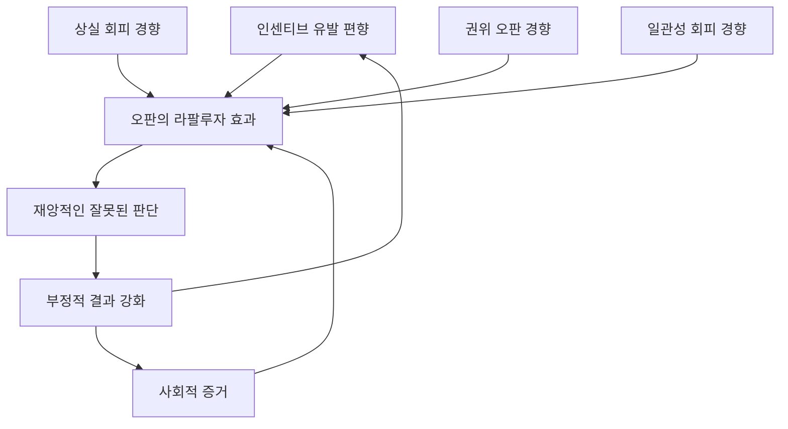

## 찰리 멍거의 세상 지혜: 어리석음을 피하는 삶의 기술
이 책은 워런 버핏의 오랜 사업 파트너인 찰리 멍거의 지혜를 담고 있어. 돈을 버는 방법뿐만 아니라, 세상의 복잡한 문제를 이해하고 현명하게 살아가기 위한 사고방식을 알려주는 책이야. 멍거는 전문가가 되기보다는 여러 분야의 큰 아이디어를 연결해서 세상을 넓게 보는 '세상 지혜'를 추구했어. 이 책을 통해 우리는 멍거처럼 생각하고, 어리석은 결정을 피하며, 더 나은 삶을 만들어가는 방법을 배울 수 있을 거야.

## 1. 찰리 멍거, 그는 누구인가? 

찰리 멍거는 워런 버핏의 조용한 파트너로 알려져 있지만, 사실 그는 '세상 지혜'를 추구한 급진적인 제너럴리스트(다방면 전문가)였어. 그는 망치만 있으면 모든 문제가 못처럼 보인다고 생각했지. 그래서 세상을 제대로 이해하려면 생물학, 물리학, 심리학, 역사 등 다양한 분야의 큰 아이디어들을 머릿속에 엮어 '정신 모델 격자틀(latticework of mental models)'을 만들어야 한다고 주장했어.

1. **대공황이 빚어낸 스토아 철학자** 
  1. 찰리 멍거는 대공황이라는 힘든 시기에 태어나 자랐어. 어린 시절 식료품점에서 하루 10시간씩 일하며 돈의 가치와 최악의 상황에 대비하는 것의 중요성을 깨달았지.
  2. 이 경험은 그를 냉소적으로 만들지 않고, 오히려 스토아 철학자(감정에 휘둘리지 않고 이성적으로 생각하는 사람)처럼 만들었어. 그는 세상이 우리에게 아무것도 빚지지 않았고, 성공하려면 다른 사람보다 더 이성적이어야 한다고 믿었어.
  3. 그의 할아버지는 연방 판사이자 성공한 변호사였지만, 멍거는 독학으로 성공한 벤자민 프랭클린을 가장 존경했어. 프랭클린처럼 다양한 분야를 공부하고 실용적인 삶의 태도를 가졌던 인물이었지.
2. **개인적인 고통 속에서 찾은 지혜** 
  1. 멍거의 삶은 개인적인 고통으로 가득했어. 20대 후반에 이혼하고, 어린 아들을 백혈병으로 잃었으며, 나중에는 의료 사고로 한쪽 눈을 실명하기도 했어.
  2. 하지만 그는 이런 고통을 자신의 철학을 시험하는 기회로 삼았어. "나 자신을 불쌍히 여기는 것이 문제를 해결할까?"라는 질문을 던지며, 자기 연민 같은 실패를 보장하는 정신 습관을 피하기로 다짐했지.
  3. 이때 '역발상 원칙(inversion principle)'이 뿌리내렸을 거야. 행복해지는 방법을 묻기보다, 어떻게 하면 비참해질 수 있는지를 먼저 생각하고 그런 행동을 피하는 것이었지.
  4. 그는 압박 속에서도 이성적이고 신뢰할 수 있는 사람이 되는 것이 궁극적인 초능력이라고 믿었어.
3. **변호사에서 투자자로의 전환** 
  1. 멍거는 세계적인 변호사였지만, 자신의 시간을 파는 일에는 한계가 있다고 생각했어. 그는 돈을 쫓기보다 '금'을 소유하고 싶었지.
  2. 그는 바로 변호사를 그만두지 않고, 부동산과 소규모 사업에 투자하며 점진적으로 전환했어. 이때 그는 '싸구려'를 찾기보다 '품질'을 중요하게 생각했어.
  3. 워런 버핏과 함께 일하게 되면서 버크셔 해서웨이의 방향을 완전히 바꿨어. 버핏이 싸구려 회사를 사서 마지막 이익을 짜내는 '시가렛 버트(cigar butt)' 투자자였을 때, 멍거는 "싸구려라고 쓰레기를 사지 마. 훌륭한 회사를 적당한 가격에 사는 것이, 적당한 회사를 훌륭한 가격에 사는 것보다 훨씬 낫다"고 설득했어.
  4. 이 변화는 버핏에게 큰 자존심 싸움이었지만, 멍거의 수학적이고 심리학적인 논리 덕분에 성공할 수 있었어. 멍거는 '해자(moat)'를 가진 훌륭한 사업이 영원히 성장할 것이고, 나쁜 사업은 결국 영혼을 갉아먹을 것이라고 이해했어.
4. **독립적인 사고와 진실 추구** 
  1. 찰리 멍거는 군중의 행동에 신경 쓰지 않는 독립적인 사고의 소유자였어. 1999년에 모두가 기술주를 살 때, 그는 책을 읽으며 기다렸어.
  2. 그는 들어오는 거래의 99%를 거절해서 '끔찍한 노맨(abominable no man)'이라는 별명을 얻었지만, 개의치 않았어. 비범한 결과를 얻으려면 오랫동안 대중에게 평범하거나 심지어 어리석게 보여도 괜찮다고 생각했지.
  3. 그는 페라리나 개인 섬을 위해 부를 쫓은 것이 아니었어. 부는 그에게 '진실이라고 생각하는 것을 말할 권리'를 주었기 때문에 추구했어. 멍거에게 진실은 궁극적인 사치였어.
  4. 그는 "어디서 죽을지 알면 그곳에는 절대 가지 않을 것"이라는 농담을 자주 했는데, 이는 실패, 어리석음, 오만을 연구하여 그런 길을 피하는 것이 그의 삶의 청사진이었음을 보여줘.

## 2. 정신 모델 격자틀: 다학제적 사고의 힘 

세상이 너무 복잡해서 이해하기 어렵다고 느낀 적이 있다면, 찰리 멍거의 '정신 모델 격자틀' 개념이 도움이 될 거야. 그는 세상을 열쇠 구멍으로만 보는 전문가가 되는 것은 재앙의 지름길이라고 경고했어. 망치만 있으면 모든 문제가 못처럼 보이기 때문이지. 멍거는 삶, 사업, 관계를 헤쳐나가는 비결은 더 많이 아는 것이 아니라, '올바른 것'을 알고 그것들이 어떻게 연결되는지 아는 것이라고 말했어.

1. **격자틀이란 무엇인가?** 
  1. 멍거는 우리의 마음을 고립된 사실들을 저장하는 파일 캐비닛이 아니라, 새로운 정보가 걸릴 수 있는 엮인 구조물, 즉 '격자틀'로 상상하라고 했어.
  2. 이 구조가 없으면 사실들은 그냥 흘러내려 사라져 버린다고 설명했지.
  3. 이 격자틀은 다양한 학문 분야에서 얻은 핵심 아이디어들로 구성돼.
2. **다양한 분야의 큰 아이디어들** 
  1. 멍거의 첫 번째 규칙은 "큰 학문 분야의 큰 아이디어들을 가져야 한다"는 것이었어. 80개 분야의 박사가 될 필요는 없고, 90%의 중요한 일을 하는 5~10%의 핵심 개념만 이해하면 된다고 했지.
  2. **물리학**: '임계 질량(critical mass)'이나 '평형(equilibrium)' 같은 개념을 이해하면 돼. 사업에서도 회사가 충분한 추진력을 얻으면 멈출 수 없는 힘이 되는 지점이 있어.
  3. **생물학**: 멍거는 진화 생물학에 집착했어. 사업 세계는 생태계와 같아서, 기업들은 자원을 놓고 경쟁하고, 적응하거나 멸종하기 때문이야. '틈새 시장(niche construction)'을 이해하면 작은 전문 회사가 거대 기업이 지배하는 시장에서 어떻게 살아남을 수 있는지 알 수 있어.
  4. **수학**: 복잡한 미적분학이 아니라 '순열과 조합(permutations and combinations)' 같은 확률 개념을 알아야 해. 멍거는 기본적인 확률 계산을 할 수 없다면, 다른 사람들이 기술 게임을 할 때 혼자 도박을 하는 것과 같다고 말했어.
  5. **심리학**: 멍거는 심리학을 전공하지 않았지만, 인간을 이해하기 위해 심리학을 깊이 공부했어. 특히 '오판의 심리학'을 통해 인간이 어떻게 잘못된 판단을 하는지 연구했지. 좋은 판단을 연구하기보다 나쁜 판단을 피하는 것이 중요하다고 생각했어.
3. **전문가의 위험성** 
  1. 멍거는 전문가들이 종종 자신의 탁월함에 눈이 멀어 위험하다고 비판했어. 망치만 가진 사람은 모든 것을 못으로 보려고 하기 때문이야.
  2. 2008년 금융 위기 때 경제학자들이 실패한 이유도 여기에 있어. 그들의 모델은 이성적인 행위자를 가정했지만, 인간의 심리적 편향(사회적 증거, 상실 회피 등)을 간과했지.
  3. 멍거의 접근 방식은 지적인 겸손함을 요구해. 자신의 주 전공만으로는 충분하지 않다는 것을 인정하고, 다양한 아이디어를 수집해야 한다고 강조했어.
4. 시너지** 효과: 1+1=3** 
  1. 격자틀의 진정한 마법은 개별 모델들이 합쳐질 때 나타나. 멍거는 이를 '라팔루자 효과(Lollapalooza effects)'라고 불렀어. 3~4개의 모델이 동시에 같은 방향을 가리킬 때 발생하는 현상이야.
  2. 예를 들어, 사이비 종교가 효과적인 이유는 '사회적 증거(social proof)', '인센티브 유발 편향(incentive-caused bias)', '일관성 및 헌신 경향(consistency and commitment tendency)' 같은 여러 심리적 편향이 복합적으로 작용하기 때문이야.
  3. 이런 모델들이 결합하면 인간 행동의 '핵폭발'을 일으킬 수 있어. 격자틀을 이해하면 이런 폭발을 멀리서도 예측할 수 있게 돼.
5. **격자틀 구축을 위한 실천 방법** 
  1. **학습 기계가 되어라**: 멍거는 "항상 책을 읽지 않는 현명한 사람을 본 적이 없다. 단 한 명도 없다"고 말했어. 깊이뿐만 아니라 넓게 읽어야 해.
  2. **'왜'와 '이것은 무엇과 같은가?'를 질문하라**: 새로운 개념을 배울 때, 완전히 다른 분야에서 비유를 찾아보려고 노력해.
  3. **큰 아이디어를 걸러내라**: 사소한 것에 얽매이지 말고, 복리나 파레토 법칙처럼 오랜 시간 동안 유효했던 원칙들을 찾아 격자틀에 포함시켜.
  4. **정신 위생을 실천하라**: 멍거는 자신의 아이디어를 파괴하는 것으로 유명했어. 상대방의 주장을 그들보다 더 잘 설명할 수 없다면, 의견을 가질 자격이 없다고 믿었지. 자신의 격자틀에 구멍이 없는지 끊임없이 점검해야 해.
  5. **객관성을 유지하라**: 멍거는 현실을 있는 그대로 인식하는 것이 중요하다고 강조했어. 자신이 믿고 싶은 대로 현실을 왜곡하지 않도록 노력해야 해.
  6. **자신의 가장 좋아하는 아이디어를 파괴하라**: 매년 자신의 가장 소중한 아이디어 중 하나를 파괴하려고 노력하는 것이 정신적인 훈련이야.
  7. **반대 의견을 경청하라**: 듣기 싫은 말을 해주는 사람에게 반감을 갖지 않도록 자신을 훈련해야 해.
  8. **실수를 다루는 법을 배워라**: 심리적 부인(psychological denial)은 파산으로 이어지는 흔한 길이야. 잘못된 것에 엄청난 노력을 쏟아부었을 때, 그것을 포기하고 다시 싸울 용기를 가져야 해.
  9. **강렬한 이데올로기를 피하라**: 특정 집단의 이데올로기를 맹목적으로 따르고 외치는 것은 자신의 사고를 망칠 수 있어. 정확성, 근면함, 객관성을 지지하는 이데올로기는 좋지만, 특정 정치적 또는 사회적 신념에 맹목적으로 빠지는 것은 위험해.
6. **보상: 평온한 삶** 
  1. 격자틀의 가장 아름다운 보상은 부가 아니라 '평온함'이야. 다학제적인 사고를 가지면 세상의 경제적 호황과 불황, 관계의 변화, 경력의 우여곡절을 예측 가능한 큰 패턴의 일부로 보게 돼.
  2. 반응하기보다 관찰하게 되고, 세상이 복잡하더라도 그것을 지배하는 규칙은 사실 단순하고 몇 가지뿐이라는 것을 깨닫게 돼.
  3. 이런 세상 지혜를 통해 전문가들에게는 마법사처럼 보일 수 있어.

## 3. 역발상: 거꾸로 생각하는 힘 

대부분의 사람들은 행복, 부, 완벽한 파트너를 찾기 위해 앞만 보고 달려가. 하지만 찰리 멍거는 세상을 거꾸로 봤어. 그는 독일 수학자 칼 야코비의 "뒤집어라, 항상 뒤집어라(Invert, always invert)"라는 격언을 삶의 철학으로 삼았지. 야코비는 수학의 어려운 문제들이 거꾸로 생각할 때 가장 잘 풀린다는 것을 알았어.

1. **실패를 피하면 성공은 자연스럽게 따라온다** 
  1. 멍거는 성공적인 삶을 정확히 정의하기는 어렵지만, 실패하는 삶을 보장하는 것들을 나열하는 것은 놀랍도록 쉽다고 깨달았어.
  2. 실패를 유발하는 것들을 피하기만 하면, 성공은 자연스럽게 따라오는 결과가 된다는 거야.
  3. 그는 "내가 어디서 죽을지 알았으면 좋겠다. 거기는 절대 가지 않을 테니까"라는 농담을 자주 했어.
2. **비참한 삶 설계하기 연습** 
  1. 행복한 삶을 원한다면, 멍거는 펜과 종이를 들고 '가장 비참한 삶'을 설계해보라고 조언했어.
  2. 예를 들어, 신뢰할 수 없는 사람이 되고, 강렬한 분노와 자기 연민에 빠지고, 세상의 큰 아이디어를 무시하고 좁은 전문가로 남고, 첫 실패 후 좌절하고, 약물이나 알코올로 현실을 마비시키는 것들이 비참한 삶을 만드는 방법이 될 수 있어.
  3. 이런 '비참함 제조기' 목록을 만들었다면, 이제 할 일은 간단해. 그것들을 하지 않는 거야.
  4. 대부분의 사람들은 무엇을 해야 할지 몰라서 실패하는 것이 아니라, 자신을 방해하는 행동을 멈추지 못해서 실패해. 어리석음을 피하는 데 집중함으로써, 똑똑한 사람들을 넘어뜨리는 자아 중심적인 함정을 피할 수 있어.
3. **사업과 금융에서의 역발상** 
  1. 투자 세계에서 모두가 다음 대박을 찾을 때, 찰리 멍거는 과정을 뒤집었어. 그는 다음 구글을 찾지 않고, '아니오'라고 말할 이유를 찾았어.
  2. 그는 시대에 뒤떨어지기 쉬운 회사, 경쟁이 너무 심한 산업, 과도하게 홍보하는 경영진을 찾았어. 미래의 재앙처럼 보이는 모든 것을 걸러냄으로써, 거의 확실하게 성공할 소수의 고품질 사업만 남게 되었지.
  3. 조종사가 비행 전 체크리스트를 확인하는 것처럼, 멍거는 모든 결정을 내릴 때 '무엇이 잘못될 수 있는가?'를 먼저 물었어. 그는 '옳은 것'을 찾기보다 '틀리지 않는 것'을 찾았어.
  4. 투자와 같은 복리 게임에서 가장 큰 적은 탁월함의 부족이 아니라 '치명적인 손실'이라는 것을 알았어. 50%를 잃으면 본전으로 돌아오려면 100%를 벌어야 하니까. 역발상은 자신의 충동성으로부터 자본을 보호하는 방패 역할을 해.
4. **역발상의 심리학: **라팔루자** 효과 피하기** 
  1. 역발상은 전술적인 도구일 뿐만 아니라 심리적인 방어 메커니즘이기도 해. 멍거의 가장 유명한 관찰 중 하나는 '인센티브 유발 편향'에 대한 것이었어.
  2. 그는 "인센티브의 힘에 대해 생각해야 할 때 다른 것을 생각하지 마라"고 말했어. 시스템이 왜 고장 났는지 이해하려면 사람들을 보지 말고, '인센티브'를 보라는 거야.
  3. 문제를 역으로 생각하여 "이 시스템이 실제로 어떤 행동에 보상하고 있는가?"라고 물으면, 숨겨진 진실을 볼 수 있어. 나쁜 사람들을 비난하는 대신, 나쁜 시스템을 고치는 데 집중할 수 있게 돼.
5. **멍거의 격언들: 현실의 경구** 
  1. 멍거는 역발상을 보완하기 위해 '멍거리즘(Mungerisms)'이라고 불리는 짧고 날카로운 격언들을 사용했어. 이는 결정의 순간에 기억하기 쉽도록 압축된 정신 모델들이었지.
  2. "덧붙일 말이 없다(I have nothing to add)": 워런 버핏이 긴 설명을 마쳤을 때 멍거가 자주 했던 대답이야. 가치 있는 기여를 할 것이 없다면 침묵하는 것이 가장 이성적이라는 것을 보여줘.
  3. "인센티브를 보여주면 결과를 보여주겠다(Show me the incentive and I will show you the outcome)": 사회 분석을 위한 궁극적인 도구야.
  4. "단순한 아이디어를 진지하게 받아들여라(Take a simple idea and take it seriously)": 복리나 기본적인 정직함처럼 섹시하지 않다는 이유로 무시되는 기본 원칙들을 광적으로 일관성 있게 적용하는 사람들이 결국 승리한다고 믿었어.
  5. "에스키모 스케이팅 대회에서 한 발로 서 있는 사람(Being a one-legged man in an ass-kicking contest)": 적절한 정신 도구 없이 복잡한 문제를 해결하려는 사람을 묘사하는 표현이야.
  6. 이런 멍거리즘은 위험한 투자나 일확천금 계획에 흥분할 때 경고등처럼 머릿속에 떠올라야 해.
6. **'끔찍한 노맨'의 지혜** 
  1. 찰리 멍거는 거의 모든 것에 '아니오'라고 말해서 '끔찍한 노맨'이라는 별명을 얻었어. 그는 훌륭한 삶은 소수의 '예스'와 수많은 '노'로 이루어진다고 믿었어.
  2. 역발상은 '아니오'라고 말할 용기를 찾는 데 도움이 돼. 일정을 역으로 생각하면, "오늘 무엇을 해야 할까?" 대신 "지구에서 나의 제한된 시간을 낭비하는 것은 무엇일까?"라고 묻게 돼.
  3. 대부분의 회의, 이메일, 사회적 의무는 깊이 있는 작업과 큰 아이디어를 방해하는 마찰일 뿐이라는 것을 깨닫게 되지.
  4. 멍거와 버핏이 대부분의 시간을 앉아서 책을 읽으며 보낸 이유도 여기에 있어. 그들은 '좋은 기회(fat pitch)'를 기다렸어. 모든 정신 모델이 일치하고 위험이 최소화된 단 하나의 기회를 말이야.
7. **개인적인 역발상 목록 연습** 
  1. 자신이 가진 목표를 역으로 생각해보는 연습을 해봐. 예를 들어, 유튜브 채널을 성공시키고 싶다면, "내 유튜브 채널이 확실히 실패하려면 어떻게 해야 할까?"라고 물어보는 거야.
  2. 일관성: 3개월에 한 번만 게시한다. 품질: 흐릿한 카메라와 나쁜 오디오로 녹화한다. 시청자: 나 자신에 대해서만 이야기하고 가치를 제공하지 않는다. 자아: 분석을 보거나 실수로부터 배우기를 거부한다.
  3. 이 목록을 보면, 이 네 가지를 하지 않는 것만으로도 이미 90%의 사람들보다 앞서 나갈 수 있다는 것을 알게 될 거야. 역발상은 위대함의 비법을 알려주는 것이 아니라, 그것을 방해하는 독을 제거해줘.
8. **역발상의 철학적 깊이** 
  1. 역발상의 핵심은 '지적인 정직함'이야. 우리의 뇌가 자기기만, 낙관주의, 자아에 자연스럽게 맞춰져 있다는 것을 인정하는 것이지.
  2. 우리는 세상이 쉽고 우리가 특별하다고 믿고 싶어 해. 역발상은 차갑고 냉혹한 현실 점검이야.
  3. 실패의 가능성을 받아들이고, 말 그대로 실패를 계획함으로써 그 힘을 약화시켜. 그러면 '안티프래질(antifragile)'해져. 침몰하는 배에서 살아남는 것을 넘어, 빙산을 예측하는 사람이 되는 거야.

## 4. 규율의 토대: 실용적인 사고와 주식 선택의 기술 

찰리 멍거의 사무실에 들어서면, 여섯 개의 화면을 노려보는 광적인 트레이더나 전화로 주식을 사라고 소리치는 사람을 볼 수 없을 거야. 대신 편안한 의자에 앉아 연례 보고서와 전기들을 읽으며 다이어트 콜라를 마시는 사람을 발견할 거야. 겉보기에는 아무 일도 일어나지 않는 것 같지만, 실제로는 매우 중요한 '고위험 사냥'이 진행 중이었지. 이 장에서는 멍거의 추상적인 철학에서 벗어나, 실제 의사 결정의 전술적인 부분으로 들어가 볼 거야.

1. **체크리스트: 부를 위한 조종사의 비밀** 
  1. 멍거가 실용적인 사고에 기여한 가장 중요한 것 중 하나는 '투자 체크리스트' 개념이야. 그는 펀드 매니저와 상업용 항공기 조종사를 자주 비교했어.
  2. 조종사는 수만 시간의 비행 경험이 있어도, 절대 체크리스트 없이 이륙하지 않아. 왜냐하면 인간의 뇌는 압박감, 피로, 과신 상태에서 기본적인 것을 잊어버리기 때문이야.
  3. 멍거의 체크리스트는 단순히 숫자의 목록이 아니라, 질적인 필터(qualitative filters)였어. 그는 다음과 같은 질문들을 던졌어.
  - 이 사업이 나의 '능력 범위(circle of competence)' 안에 있는가? (내가 돈을 버는 방식을 실제로 이해하는가?)
  - '해자(moat)'가 있는가? (브랜드, 특허, 네트워크 효과 등으로 경쟁자로부터 보호받는가?)
  - 경영진은 정직하고 유능한가? (주주를 위해 일하는가, 아니면 자신의 보너스를 위해 일하는가?)
  - 가격은 공정한가? (아무리 좋은 회사라도 너무 비싸게 사면 나쁜 투자다.)
  4. 이 체크리스트 중 하나라도 통과하지 못하면, 멍거는 자신과 타협하지 않고 그 보고서를 '너무 어려운(too hard)' 파일에 던져 넣었어. 대부분의 사람들은 모든 것에 대해 의견을 가져야 한다고 생각하기 때문에 '너무 어려운' 파일이 비어 있지만, 멍거는 '쉬운 기회(no-brainers)'를 찾았어.
2. **능력 범위: 자신의 영역에 머무르기** 
  1. 똑똑한 사람이 가장 하기 어려운 일 중 하나는 '자신이 모른다는 것을 인정하는 것'이야. 우리의 자아는 AI, 주택 시장, 유가 등 모든 것에 대해 전문가가 되기를 원해. 멍거는 이를 '가난의 지름길'이라고 불렀어.
  2. 그는 급진적인 초점의 좁힘을 옹호했어. 부자가 되기 위해 10,000개 회사에 대해 전문가가 될 필요는 없고, 소수의 회사에 대해서만 전문가가 되면 된다고 믿었지.
  3. '능력 범위'는 원의 크기가 아니라 '경계선'이 어디인지 아는 것이 중요해. 자신의 지식이 어디에서 끝나고 추측이 시작되는지 정확히 안다면, 이미 99%의 사람들보다 앞서 있는 거야.
  4. 멍거의 성공은 다른 사람들보다 더 많이 아는 것에서 온 것이 아니라, '자신이 모르는 것을 알고' 그 영역에서 멀리 떨어져 있으려는 규율에서 왔어. 그는 기술주에서 다른 사람들이 수백만 달러를 벌 때도 옆에서 지켜보는 것에 만족했어. 그 분야에서 자신이 우위를 점하지 못한다는 것을 알았기 때문이야.
  5. 자신이 막스 플랑크(진정한 지식을 가진 사람)인지, 아니면 운전사(겉으로만 아는 척하는 사람)인지 구별하는 것이 중요해.
3. **서핑 비유: 사업의 큰 파도를 타기** 
  1. 멍거는 사업의 경쟁적인 특성을 설명하기 위해 '서핑' 비유를 사용했어. 자동차 발명이나 인터넷의 부상과 같은 기술적 또는 사회적 변화의 거대한 파도를 상상해봐.
  2. 초기에는 많은 사람들이 그 파도를 타려고 하지만, 대부분은 실패해. 하지만 소수의 회사들은 일찍 보드에 올라 균형을 잡고 수십 년 동안 그 파도를 타지.
  3. 투자자나 사상가에게 중요한 것은 파도가 해안에 부딪히기 전에 '큰 파도'를 식별하는 것이야. 그리고 '선점자 우위(early mover advantage)'를 찾아야 해.
  4. 마이크로소프트나 코카콜라 같은 회사가 파도 위에서 지배적인 위치를 차지하면, 그들을 밀어내는 것은 엄청나게 어려워져. 그들은 규모의 이점(scale advantages)을 개발하고, 단위 비용이 낮아지며, 브랜드 인지도가 높아지고, 여러 이점이 동시에 복리 효과를 내는 '라팔루자 효과'의 혜택을 받게 돼.
  5. 하지만 멍거는 최고의 서퍼도 결국은 넘어진다고 경고했어. 그는 거대 기업의 '관성(inertia)'을 연구했어. 시간이 지남에 따라 어떻게 느려지고, 비대해지고, 어리석어지는지 말이야. 시어스나 코닥처럼 한때 세상을 지배했던 위대한 회사들이 결국 더 작고 배고픈 상어들에게 먹히는 것을 지켜봤지.
  6. 이는 그에게 파도를 견디는 것을 넘어 혼돈 속에서 더 강해지는 회사의 '안티프래질(antifragility)' 능력을 찾도록 가르쳤어.
4. **주식 선택의 기술: 좋은 기회를 기다리기** 
  1. 멍거의 투자 접근 방식은 한 단어로 요약될 수 있어. 바로 '인내(patience)'야. 그는 야구 역사상 가장 위대한 타자 중 한 명인 테드 윌리엄스를 자주 인용했어.
  2. 윌리엄스는 스트라이크 존을 77개의 작은 사각형으로 나누고, 자신의 '스위트 스팟(sweet spot)'에 들어오는 공만 휘둘렀어. 최악의 지점에 있는 공을 휘두르면 성공 확률이 크게 줄어든다는 것을 알았기 때문이야.
  3. 대부분의 투자자들은 시장이 던지는 모든 공에 휘둘려야 한다고 느끼거나, 주식이 10% 오르면 '놓치는 것에 대한 두려움(FOMO)'을 느껴.
  4. 하지만 멍거는 2년 동안 스윙하지 않고 스트라이크가 지나가는 것을 지켜볼 감정적인 규율을 가지고 있었어. 그러다 마침내 '좋은 기회(fat pitch)'가 오면, 즉 터무니없이 낮은 가격에 훌륭한 회사가 나타나면, 그는 모든 것을 걸고 크게 휘둘렀어.
  5. 이것이 '집중 포트폴리오(focus portfolio)' 전략이야. 멍거는 단순히 분산 투자를 하는 것을 '나쁜 분산 투자(deworsification)'라고 불렀어. 세 가지 놀라운 아이디어가 있다면, 왜 20번째로 좋은 아이디어에 돈을 넣겠냐는 거야.
  6. 멍거에게 위험은 주가 변동성(volatility)이 아니라 '영구적인 자본 손실(permanent loss of capital)'이었어. 그리고 그것을 피하는 가장 좋은 방법은 몇 가지를 아주 잘 알고, 승산이 압도적으로 유리할 때 크게 베팅하는 것이었어.
5. **시가렛 버트 vs. 품질 논쟁** 
  1. 이것은 멍거 역사에서 가장 유명한 부분일 거야. 워런 버핏은 가치 투자의 아버지인 벤자민 그레이엄의 제자였어. 그레이엄의 전략은 거의 죽어가는 회사, 즉 '시가렛 버트'를 싸게 사서 마지막 이익을 짜내는 것이었지.
  2. 멍거는 이 전략을 싫어했어. 시가렛 버트 투자는 스트레스가 많은 삶의 방식이라는 것을 깨달았어. 항상 다음 버려진 것을 찾아야 하니까.
  3. 그는 워런에게 '품질'을 찾도록 설득했어. 매년 15%씩 가치가 성장하는 회사를 사면, 30년 동안 보유하고 자본 이득세(capital gains tax)를 내거나 새로운 투자를 찾을 필요가 없다고 주장했지.
  4. 이 변화는 버크셔 해서웨이를 작은 투자 펀드에서 세계 최대의 복합 기업으로 만들었어. 이는 양적 분석(quantitative analysis), 즉 돈을 세는 것에서 질적 분석(qualitative analysis), 즉 브랜드, 문화, 미래를 판단하는 것으로의 전환을 요구했어.
  5. 멍거는 대차대조표에서 볼 수 없는 '무형 자산(intangibles)'이 장기적으로 가장 많은 가치를 창출한다는 것을 깨달았어.
6. **사업의 도덕적 차원** 
  1. 멍거에게 주식 선택의 기술은 단순히 탐욕에 관한 것이 아니었어. 그것은 '윤리'에 관한 것이었지. 그는 어머니에게 자랑스럽게 보여줄 수 있는 사업만 소유하고 싶다고 믿었어.
  2. 그는 숨겨진 수수료가 있는 복잡한 상품을 파는 월스트리트의 사기꾼들을 경멸했어. 그들을 비윤리적일 뿐만 아니라 '비이성적'이라고 불렀지.
  3. 왜냐하면 장기적으로 세상은 결국 진실을 알게 되기 때문이야. 사람들을 나쁘게 대하면 명성을 망치게 되고, 멍거의 세계에서 명성은 가장 가치 있는 복리 자산이야.
  4. 그는 '코버그의 도덕 발달 단계(Kohlberg stages of moral development)'를 믿었어. 처벌을 피하기 위해 옳은 일을 하는 것에서, 시스템이 생존하기 위한 가장 이성적인 방법이기 때문에 옳은 일을 하는 것으로 나아가는 것이지.
  5. 코스트코(Costco)를 윤리적 탁월함의 예로 들었어. 코스트코는 더 많은 돈을 받을 수 있을 때도 특정 비율 이상으로 제품 가격을 올리지 않아. 단기적인 생각으로는 돈을 버리는 것이지만, 멍거에게는 50년 동안 지속될 고객과의 '신뢰의 해자'를 구축하는 것이었어.
7. **삶에 적용하는 방법** 
  1. 전문 투자자가 아니더라도 멍거의 윤리를 삶에 적용할 수 있어.
  2. **자신만의 '삶의 체크리스트'를 만들어라**: 새로운 직업을 구하거나 프로젝트를 시작하기 전에, '타협할 수 없는 것들(non-negotiables)'은 무엇인지, 즉시 떠나야 할 '위험 신호(red flags)'는 무엇인지 정해.
  3. **자신의 '능력 범위'를 정의하라**: 자신이 실제로 세계 최고 수준인 2~3가지가 무엇인지 파악하고, 시간의 80%를 그곳에 투자해. 다른 모든 것에 대해서는 아웃소싱하거나, 단순히 의견이 없음을 인정해.
  4. **'좋은 기회'를 기다려라**: 모든 기회에 '예스'라고 말할 필요는 없어. 자신의 기술, 가치, 목표와 완벽하게 일치하는 기회를 기다려. 그런 기회가 오면 전적으로 헌신해.
  5. **싸구려보다 '품질'을 중요하게 여겨라**: 노트북을 사든, 신발을 사든, 멘토를 선택하든, 단순히 가격만 보지 마. 장기적인 복리 가치를 봐. 한 달 만에 고장 나는 싸구려 도구는 10년 가는 고품질 도구보다 훨씬 비싸.

## 5. 학제 간 사고: 사고의 사일로 깨기 

대부분의 현대 대학과 기업에서는 찰리 멍거가 '사일로 효과(silo effect)'라고 부르는 것을 만들어냈어. 경제학과는 한 건물에, 심리학과는 다른 건물에, 물리학과는 캠퍼스 건너편에 있어서 서로 거의 소통하지 않아. 그들은 다른 전문 용어, 다른 방법, 다른 측정 기준을 사용하지. 멍거는 이런 학문적 분리가 '지적인 의료 과실'이라고 믿었어.

1. **현실은 인위적인 경계를 신경 쓰지 않는다** 
  1. 멍거는 현실이 우리의 인위적인 경계를 신경 쓰지 않는다고 주장했어. 시장 붕괴, 제품 출시 실패, 가족 위기와 같은 복잡한 문제는 결코 단순히 경제학 문제나 심리학 문제가 아니야.
  2. 그것은 여러 힘이 동시에 작용하는 복잡하게 얽힌 매듭이야. 하나의 학문 분야의 렌즈를 통해서만 본다면, 피아노를 한 건반으로만 연주하려는 것과 같아. 가끔 올바른 음을 칠 수도 있겠지만, 결코 교향곡을 연주할 수는 없을 거야.
2. **전문가 시스템의 실패** 
  1. 멍거는 전문가들을 교육하는 방식에 대해 특히 비판적이었어. 우리는 가장 똑똑한 젊은 인재들을 너무 깊이 전문화시켜서 다른 모든 분야에서는 기능적인 문맹이 되게 한다고 지적했지.
  2. 건물의 물리학은 이해하지만 그 안에 살 사람들의 심리는 모르는 건축가나, 아름다운 수학 모델을 만들지만 인간이 공황과 탐욕에 취약하다는 것을 잊어버리는 경제학자를 생각해봐.
  3. 이런 전문가들은 종종 위험해. 높은 자신감을 가지고 있지만 세상 지혜는 부족하기 때문이야. 그들은 종종 틀리지만 결코 의심하지 않아.
  4. 멍거의 해결책은 '학제 간 사고(interdisciplinary mind)'였어. 그는 모든 분야에 능통하지만 아무것도 제대로 모르는 사람이 되기를 원한 것이 아니었어. 모든 분야의 '큰 아이디어'에 능통하기를 원했지.
  5. 수학, 물리학, 생물학, 심리학, 윤리학과 같은 주요 학문 분야의 핵심 원칙들은 사소한 것보다 핵심에 집중하면 실제로 배우기 쉽다고 믿었어.
3. **종합의 교향곡** 
  1. 멍거에게 학습의 목표는 사실을 축적하는 것이 아니라 '종합(synthesis)' 능력을 개발하는 것이었어. 이는 생물학의 아이디어가 사업 현상을 설명하는 방식을 이해하는 능력이야.
  2. 화학의 '자가 촉매 작용(autocatalysis)' 개념을 예로 들어보자. 이는 반응의 결과물이 같은 반응이 더 빠르게 다시 일어나도록 하는 촉매 역할을 하는 과정이야. 자기 강화 루프(self-reinforcing loop)인 셈이지.
  3. 사업에서는 '네트워크 효과(network effects)'에서 이를 볼 수 있어. 유튜브와 같은 플랫폼을 더 많은 사람들이 사용할수록, 크리에이터들에게 더 가치 있어져. 더 많은 크리에이터가 참여할수록, 시청자들에게 더 가치 있어지지. 이것은 자가 촉매 사업 모델이야.
  4. 사업만 공부한다면 이를 '성장'이라고 부를 수 있지만, 화학을 이해한다면 '가속화'의 본질을 이해하게 돼. 자가 촉매 과정이 일단 시작되면 멈추기 매우 어렵고, 일단 멈추면 다시 시작하기 거의 불가능하다는 것을 인식하게 되지.
  5. 이런 학제 간 통찰력은 현실에 대한 더 깊고 직관적인 이해를 제공해.
4. **사회 과학에 대한 비판** 
  1. 찰리 멍거는 사회 과학, 특히 경제학, 사회학, 심리학에 대해 특별한 불만을 가지고 있었어. 그는 이들이 '물리학 부러움(physics envy)'에 시달린다고 믿었어. 존재하지 않는 인간 행동에 대한 엄격한 수학적 법칙을 만들려고 한다는 거야.
  2. 그는 사회 과학자들이 학문적 자아 때문에 다른 분야의 큰 아이디어들을 종종 무시한다고 주장했어. 경제학자는 자신의 깔끔한 스프레드시트를 망치기 때문에 심리적 편향을 인정하기를 거부할 수 있어.
  3. 멍거는 이를 사회적 규모의 '망치만 가진 사람 증후군'이라고 불렀어. 그는 '다학제적 사회 과학 접근 방식'을 옹호했어. 경제학을 이해하려면 지위(status)에 대한 생물학적 욕구를 이해해야 하고, 법을 이해하려면 '상호성 경향(reciprocation tendency)'과 같은 심리적 경향을 이해해야 한다고 믿었지.
  4. 이런 사일로를 허물면 학자에서 '사상가'로 발전할 수 있어.
5. **정신 모델의 보편적 언어로서의 힘** 
  1. 학제 간 사고의 가장 실용적인 이점 중 하나는 '보편적인 언어'를 제공한다는 거야. 큰 아이디어들을 이해하면 의사, 엔지니어, 배관공, CEO와 대화하고 그들의 작업 논리를 이해할 수 있어.
  2. 그들의 특정 전문 용어를 모르더라도, 같은 패턴이 어디에서나 반복된다는 것을 보기 시작해.
  - **관성(Inertia)**: 물리학(정지 상태의 물체)과 대기업(변화 거부)에서 볼 수 있어.
  - 피드백 루프**(Feedback loops)**: 생물학(항상성)과 금융(시장 거품)에서 볼 수 있어.
  - **파레토 원칙(Pareto principle, 80/20 법칙)**: 자연(종의 분포)과 생산성(성과를 내는 작업)에서 볼 수 있어.
  3. 마음이 이런 패턴을 찾도록 훈련되면, 세상은 혼란스러운 뉴스의 덩어리가 아니라 '작동 중인 예측 가능한 일련의 모델'이 돼.
  4. '지적인 자율성(intellectual autonomy)'을 얻게 돼. 더 이상 전문가가 무엇을 생각해야 할지 알려줄 때까지 기다릴 필요가 없어. 문제를 스스로 해체할 도구를 갖게 되는 거야.
6. **학습의 도덕적 차원** 
  1. 찰리 멍거는 학제 간 사고가 '도덕적 의무'라고도 믿었어. 권력의 위치에 있는 사람, 즉 부모, 관리자, 리더가 좁고 사일로화된 세계관에 기반하여 결정을 내리면, 의도하지 않은 결과를 초래할 가능성이 높다는 거야.
  2. 의료 직업에서의 '인센티브 유발 편향' 사례를 들었어. 한 가지 특정 수술만 할 줄 아는 외과 의사는 무의식적으로 모든 환자가 그 수술을 필요로 한다고 스스로를 설득할 거야. 그는 나쁜 사람이 아닐 수도 있지만, 그의 좁은 전문 지식이 도덕적 맹점을 만들었지.
  3. 마음을 넓힘으로써 맹점을 줄일 수 있어. 사람들에게 작용하는 다양한 힘을 이해하기 때문에 더 공감하게 돼. 자신의 행동이 장기적으로 미칠 영향을 예측할 수 있기 때문에 더 윤리적이게 돼.
  4. 멍거에게 세상 지혜는 단순히 부자가 되는 것이 아니라, 세상의 책임감 있고 이성적인 시민이 되는 것이었어.
7. **T자형 사상가** 
  1. 현대 경력 코칭에서는 'T자형 인재(T-shaped person)'에 대해 이야기해. 한 분야에 대한 깊은 전문 지식(수직 막대)과 여러 분야에 대한 폭넓은 이해(수평 막대)를 가진 사람을 말해.
  2. 찰리 멍거는 궁극적인 T자형 사상가였어. 하지만 그는 수평 막대가 실제로 수직 전문 지식을 보호한다고 주장했을 거야.
  3. 자신의 기술에 대한 깊은 지식은 망치이지만, 세상에 대한 폭넓은 지식은 언제 망치를 내려놓고 드라이버를 집어들어야 할지 알려주는 것이지. 그것은 지성의 '지휘 통제 센터'야.
8. **학제 간 사고를 실천하는 방법** 
  1. **자신의 분야 밖의 책을 읽어라**: 역사를 좋아한다면 게임 이론 책을 읽고, 기술을 좋아한다면 진화 심리학 책을 읽어.
  2. **교차 수분(cross-pollination)을 찾아라**: 새로운 개념을 배울 때, 완전히 다른 세계의 비유를 사용하여 설명하려고 노력해. 예를 들어, "이 마케팅 전략은 생물학의 바이러스와 같다"고 말하는 식이지.
  3. **핵심 아이디어를 찾아라**: 모든 것을 배우려고 하지 마. 여러 학문 분야에 나타나는 아이디어들을 찾아. 그것들이 현실을 하나로 묶는 '핵심 아이디어'야.
  4. **'강철 인간화(steel manning)'를 연습하라**: 다른 사일로에 있는 사람과 의견이 다를 때, 그들의 학문 모델을 사용하여 그들의 주장을 가능한 한 가장 강력한 버전으로 만들어보려고 노력해.
9. **궁극적인 보상: 지적인 자유** 
  1. 학제 간 사고는 진정한 '지적인 자유'로 가는 유일한 길이야. 사일로에 갇혀 있는 한, 다른 사람의 틀에 갇힌 죄수야. 자신이 선택하지 않은 필터를 통해 세상을 보고 있는 것이지.
  2. 하지만 격자틀을 만들고, 상황의 물리학, 생물학, 심리학을 이해하면 필터가 사라져. 르네상스 시대의 박식가들처럼 모든 것의 상호 연결성을 고화질로 보게 돼.
  3. 진정한 의미에서 '개인'이 되는 거야.

## 6. 도덕적 나침반: 자선, 윤리, 그리고 신뢰의 웹 

억만장자에 대한 대부분의 책들은 '어떻게' 돈을 벌었는지, 즉 거래의 메커니즘, 협상의 공격성, 상금의 축적에 초점을 맞춰. 하지만 '가난한 찰리의 연감'의 후반부 강의로 갈수록 어조가 바뀌어. 더 조용하고, 더 사색적이며, 깊이 철학적이 되지. 찰리 멍거는 많은 성공한 사람들이 너무 늦게 배우는 진실을 이해했어. 도덕적 틀이 없는 부는 의미 없는 게임의 높은 점수에 불과하다는 것이지.

1. **'마땅히 받아야 할 **신뢰의 웹**'** 
  1. 이것은 찰리 멍거의 가장 심오한 개념 중 하나일 거야. 고위험 수술팀이나 핵잠수함 승무원을 생각해봐. 그 환경에서 한 사람이 대충 하거나 측정값에 대해 거짓말을 하면 사람들이 죽어. 제대로 기능하려면 서로에게 100% 절대적인 신뢰를 가져야 해.
  2. 멍거는 문명이 작동하고 사업이 번성하는 가장 효율적인 방법은 그런 '신뢰의 웹'을 복제하는 것이라고 주장했어.
  3. 모든 작은 거래에 대해 500페이지짜리 계약서를 작성해야 한다면, 삶의 거래 비용은 감당할 수 없게 돼. 하지만 '마땅히 받아야 할 신뢰'를 가진 사람들과 거래할 때, 삶의 마찰은 사라져. 계약서가 필요 없고, 악수만 있으면 돼.
  4. 찰리와 워런은 종종 몇 장의 종이와 대화만으로 수백만 달러짜리 회사를 샀어. 그들이 순진해서가 아니라, 질적 분석의 달인이었기 때문이야. 그들은 이미 '신뢰의 웹'의 일부인 사람들과만 거래했어.
2. **윈-윈(Win-Win) 윤리** 
  1. 찰리 멍거는 윈-루즈(Win-Lose) 시나리오를 깊이 혐오했어. 그는 고객이 어리석거나 정보가 부족하다는 것에 의존하는 사업 모델은 나쁜 사업 모델이라고 믿었어.
  2. 숨겨진 수수료가 있는 복잡한 상품을 파는 금융 산업의 특정 부분을 보면서, 그는 그것을 비윤리적일 뿐만 아니라 '비이성적'이라고 불렀어.
  3. 왜냐하면 장기적으로 세상은 결국 진실을 알게 되기 때문이야. 사람들을 나쁘게 대하면 명성을 망치게 되고, 멍거의 세계에서 명성은 가장 가치 있는 복리 자산이야.
  4. 그는 '코버그의 도덕 발달 단계'를 믿었어. 처벌을 피하기 위해 옳은 일을 하는 것에서, 시스템이 생존하기 위한 가장 이성적인 방법이기 때문에 옳은 일을 하는 것으로 나아가는 것이지.
  5. 코스트코(Costco)를 윤리적 탁월함의 예로 들었어. 코스트코는 더 많은 돈을 받을 수 있을 때도 특정 비율 이상으로 제품 가격을 올리지 않아. 단기적인 생각으로는 돈을 버리는 것이지만, 멍거에게는 50년 동안 지속될 고객과의 '신뢰의 해자'를 구축하는 것이었어.
3. **자선은 이성적인 문제 해결이다** 
  1. 찰리 멍거는 자선 활동에 관심을 돌렸을 때, 감정적으로 하지 않았어. 단순히 자아를 위해 건물에 자신의 이름을 올리고 싶지 않았어. 그는 건축적, 교육적 문제를 해결하고 싶었지.
  2. 그는 학생 기숙사와 과학 센터를 직접 설계했는데, 인간 상호작용과 빛에 초점을 맞췄어. 자신의 '정신 모델 격자틀'을 자선 활동에 적용한 것이지.
  3. 그는 "학생들이 학문 분야를 넘어 서로 대화하도록 강제하는 공간을 어떻게 설계할 수 있을까?"라고 물었어. 사회 심리학과 환경 공학의 원칙을 사용하여 그가 그토록 소중히 여겼던 학제 간 사고를 촉진하는 물리적 공간을 만들었어.
  4. 그는 또한 가장 위대한 자선 활동은 단순히 '좋은 본보기'가 되는 것이라고 믿었어. 성실하게 살고, 과시적인 소비를 하지 않고, 자신의 지혜를 자유롭게 공유함으로써, 단순한 수표보다 더 많은 가치를 세상에 제공한다고 생각했어. 그는 다른 사람들이 삶의 함정을 피하도록 돕는 '가르치는 기계'가 되고 싶어 했어.
4. **지적인 정직함의 의무** 
  1. 찰리 멍거의 윤리에서 중요한 부분은 '이성적이어야 할 도덕적 의무'였어. 그는 높은 IQ와 좋은 교육을 받았음에도 불구하고 편견, 자아, 게으름에 기반하여 결정을 내린다면, 사회에 대한 의무를 다하지 못하는 것이라고 믿었어.
  2. 지적인 정직함은 '자신에게 가장 가혹한 비평가'가 되는 것을 의미해. 자신이 틀렸을 때 크고 분명하게 인정하는 것을 의미하지.
  3. 찰리와 워런은 종종 연례 회의의 첫 30분을 '누락된 실수(mistakes of omission)'에 대해 이야기하는 데 보냈어. 그들은 천재들도 실수하고, 윤리적이기 위한 유일한 방법은 그런 실패에 대해 투명하게 공개하는 것이라는 것을 세상에 보여주고 싶어 했어.
  4. 멍거에게 '자신에게 거짓말하는 것'은 다른 사람에게 거짓말하는 첫 단계였어. 거울 속의 남자에게 정직할 수 없다면, '신뢰의 웹'의 일부가 될 수 없어.
5. **부, 지위, 그리고 쥐 경주** 
  1. 찰리 멍거는 수십 년 동안 같은 집에 살았어. 그는 슈퍼카나 메가 요트를 소유하지 않았지. 그는 과시적인 소비를 '심리적 함정'으로 보았어. 질투, 지위 불안, 사회적 증거의 '라팔루자 효과'라고 말이야.
  2. 그는 독립할 만큼 충분한 돈이 있으면, 추가적인 돈은 '한계 효용 체감(diminishing marginal utility)'을 갖는다고 주장했어. 점점 더 많은 것을 쫓으며 삶을 보낸다면, 뇌의 원시적인 부분이 지배하도록 내버려두는 것이고, 자신의 생물학적 노예가 되는 것이지.
  3. 멍거의 관점에서 진정한 번영은 '자신이 원하는 방식으로 시간을 보내고, 좋아하는 사람들과 함께 지적으로 자극적인 일을 하는 능력'이었어. 그는 부를 자신의 독립성을 보호하는 '방패'로 보았지, 자신의 지위를 과시하는 '칼'로 보지 않았어.
6. **철학적 유산: 노인의 관점** 
  1. 말년에 찰리 멍거는 '최종 단계(endgame)'에 대해 자주 이야기했어. 그는 자신의 삶을 세상 지혜에 대한 장기적인 실험으로 보았어.
  2. 자신의 수십억 달러를 가져갈 수는 없지만, '이성적인 삶을 위한 청사진'을 남길 수 있다는 것을 알았지. 그는 돈을 버는 사람으로 기억되기보다 '현실을 가르치는 사람'으로 기억되기를 원했어.
  3. 궁극적인 윤리적 행위는 사람들이 명확하게 생각하는 방법을 가르침으로써 세상의 불필요한 고통을 줄이는 것이라고 믿었어. 한 사람이 파멸적인 재정적 결정을 내리는 것을 막거나, 한 부모가 잘못된 판단 경향을 자녀에게 물려주는 것을 막을 수 있다면, 세상을 개선한 것이라고 생각했어.
7. **삶에 적용하는 방법** 
  1. 억만장자가 아니더라도 '가난한 찰리의 연감'의 윤리를 적용할 수 있어.
  2. **자신만의 '신뢰의 웹'을 구축하라**: 말한 것을 지키는 사람이 되어. 고통스러울 정도로 신뢰할 수 있는 사람이 되어. 결국 사람들은 계약서 대신 당신의 파트너십을 요청할 거야.
  3. **모든 협상에서 윈-윈 결과를 추구하라**: 상사, 배우자, 자녀와 협상할 때, 우리 모두가 이겼다고 느끼며 헤어질 수 있는 방법을 찾아. 장기적인 불만을 초래하는 단기적인 이득을 피해야 해.
  4. **'지적인 위생'을 실천하라**: 매년 한 번씩 앉아서 자신의 가장 큰 실수 세 가지를 나열해. 숨기지 말고 분석해. 어떤 경향이 그것들을 유발했는지, 다음번에는 어떻게 피할 수 있을지 생각해봐.
  5. **성공을 재정의하라**: 자신이 소유한 것으로 삶을 측정하는 것을 멈추고, 자신이 가진 독립성의 양과 자신을 신뢰하는 사람들의 수로 측정하기 시작해.
  6. **'가르치는 기계'가 되어라**: 아는 척하는 방식이 아니라, 자신의 주변 사람들의 집단적인 이성(collective rationality)을 강화하는 방식으로 아는 것을 공유해.

## 7. 인간 오판의 심리학: 우리 뇌의 결함 

찰리 멍거의 삶에서 단 하나의 교훈만 얻는다면, 이것을 기억해. "당신의 뇌는 생물학적 걸작이지만, 동시에 결함이 있고 구식인 하드웨어다." 우리는 사바나의 석기 시대 생존을 위해 설계된 소프트웨어를 가지고 21세기를 살아가고 있어. 군중이 달리는 것을 보면, 비용-편익 분석을 할 시간 없이 그냥 달렸을 거야. 그것이 '사회적 증거'였고, 당신을 살렸지. 오늘날, 같은 본능이 사람들을 주택 거품이나 암호화폐 사기에 빠지게 해.

1. **25가지 인간 오판 경향** 
  1. 찰리 멍거는 수십 년 동안 '25가지 인간 오판 경향'을 종합했어. 가장 똑똑한 물리학자와 투자자조차도 자신의 진화적 맹점에 눈이 멀어 실패한다는 것을 깨달았지.
  2. 그는 이런 결함들을 단순히 나열하는 것을 넘어, 그것들이 어떻게 결합하여 '라팔루자 효과', 즉 여러 편향이 같은 방향을 가리킬 때 발생하는 '어리석음의 핵폭발'을 일으키는지 이해하고 싶어 했어.
  3. 이것은 심리학의 정통 용어가 아니라, 멍거가 스스로 만들어낸 개념들이 많아.
2. **주요 오판 경향들** 
  1. **보상 및 처벌 초과 반응 경향 (Reward and Punishment Super-Response Tendency)** 
  - 멍거의 첫 번째 규칙은 "인센티브의 힘에 대해 생각해야 할 때 다른 것을 생각하지 마라"는 것이었어. 사람들은 자신의 행동을 통제한다고 생각하지만, 실제로는 인센티브 구조의 꼭두각시야.
  - 페덱스(Federal Express)의 야간 근무자 이야기가 대표적이야. 시간당 임금을 지급했을 때는 비행기 적재가 제시간에 끝나지 않았지만, 교대 근무당 임금을 지급하고 비행기 적재가 끝나면 퇴근할 수 있게 하자 모든 문제가 해결되었어.
  - 의사가 특정 수술을 권하거나, 변호사가 재판을 원하거나, 영업사원이 프리미엄 패키지를 추천하는 이유를 이해하려면 그들의 성격이 아니라 '수수료 구조'를 봐야 해. "내가 먹는 빵의 주인, 그의 노래를 부른다"는 격언처럼 말이야.
  - 사람을 설득할 때는 이성보다는 '이익'에 호소하는 것이 가장 효과적이야.
  2. **좋아하고 사랑하고 싫어하고 미워하는 경향 (Liking, Loving, and Disliking, Hating Tendency)** 
  - 우리는 좋아하는 사람이나 싫어하는 사람에 대해 객관적이지 못해. 좋아하는 사람의 단점을 무시하고, 싫어하는 사람의 장점을 무시하는 경향이 있어.
  - 이것이 '사랑은 눈먼다'는 말이 단순한 로맨틱 클리셰가 아니라, 재정적, 정치적 재앙이 될 수 있는 이유야.
  - 멍거의 해독제는 '극단적인 객관성'이야. 자신이 사랑하는 것의 결함을 보고, 자신이 싫어하는 것의 장점을 보려고 노력해야 해.
  3. **의심 회피 및 **비일관성 회피** 경향 (Doubt Avoidance and Inconsistency Avoidance Tendency)** 
  - 인간의 뇌는 '모른다는 느낌'을 싫어해. 의심은 긴장 상태를 만들고, 그래서 우리는 안도감을 찾기 위해 서둘러 결론을 내려.
  - 일단 결론에 도달하면, '비일관성 회피 경향' 때문에 그 결론에 갇히게 돼. 과거의 자신과 일관성을 유지하고 싶어 하지.
  - 특정 주식, 다이어트, 정치 이념을 공개적으로 믿는다고 발표하면, 뇌는 자신이 틀렸다는 정보를 걸러내. 마음을 바꾸는 것은 패배처럼 느껴지기 때문이야.
  - 하지만 멍거는 자신의 가장 좋아하는 아이디어를 파괴하는 것을 '지적인 위생'으로 보았어. 자신이 틀렸다는 것을 빨리 인정할수록, 더 빨리 올바른 길로 돌아갈 수 있다고 믿었지.
  4. **상호성 경향 (Reciprocation Tendency)** 
  - 우리는 호의를 갚으려는 깊은 충동을 가지고 있어. 누군가 작은 선물을 주면, 우리는 무언가를 돌려줘야 한다는 압박감을 느껴.
  - 자선 단체가 무료 주소 라벨을 보내는 이유도 여기에 있어. 뇌의 상호성 결함이 기부를 유발할 것이라는 것을 알기 때문이야.
  - 사업에서는 이것이 끊임없이 당신에게 불리하게 사용돼. 공급업체의 무료 점심이나 작은 호의는 심리적인 빚을 만들고, 당신은 종종 훨씬 더 크고 비이성적인 계약으로 갚게 돼.
  - 멍거의 조언은 "숨겨진 대가를 가진 선물에 주의하라"는 것이었어.
  5. 사회적 증거** 경향 (**Social Proof** Tendency)** 
  - 이것은 '무리 심리(herd mentality)'야. 우리는 다른 사람들이 어떻게 행동하는지 보고, 특히 불확실한 시기에 어떻게 행동해야 할지 결정해.
  - 모두가 공황 상태에 빠지면 우리도 공황 상태에 빠지고, 모두가 특정 기술주를 사면 우리도 사.
  - 멍거는 사회적 증거가 피곤하거나, 스트레스를 받거나, 혼란스러울 때 가장 위험하다고 관찰했어. 똑똑한 사람들이 사이비 종교나 폰지 사기에 빠지는 이유도 여기에 있어.
  - 사회적 증거를 이기려면 '편안하게 반대 의견을 가질 용기'가 있어야 해. 4장에서 이야기했던 '좋은 기회'를 기다리는 동안 군중에게 바보처럼 보일 의지가 있어야 해.
  6. **상실 회피 초과 반응 경향 (**Deprival Super-Reaction** Tendency)** 
  - 우리는 같은 크기의 이득보다 손실에 훨씬 더 고통스러워해. 100달러를 잃는 고통은 100달러를 얻는 즐거움보다 두 배나 강해.
  - 이것은 우리가 본전으로 돌아가기 위해 도박을 하게 만들고, 종종 더 많은 것을 잃게 해.
  - 멍거는 이를 '경매 효과(auction effect)'에서 보았어. 두 사람이 회사나 예술품을 놓고 입찰 전쟁에 돌입하면, 아무도 지고 싶어 하지 않기 때문에 합리적인 가치를 훨씬 넘어 계속 입찰해. 더 이상 이기기 위해 입찰하는 것이 아니라, '잃는 것의 상실'을 피하기 위해 입찰하는 것이지. 이렇게 해서 하루아침에 재산이 날아가기도 해.
  - 행동 경제학의 '전망 이론(prospect theory)'과도 비슷해. 사람들은 손실로 인한 고통이 이득으로 인한 기쁨보다 훨씬 크기 때문에 손실을 회피하려는 경향이 있어.
  7. **권위 오판 경향 (Authority Mismeasure Tendency)** 
  - 인간은 본능적으로 리더를 따르려는 경향이 있어. 부족 사회에서는 족장을 따르는 것이 부족을 유지하는 방법이었지.
  - 오늘날 이것은 전문가, 의사, CEO에 대한 맹목적인 복종으로 이어져.
  - 멍거는 챌린저호 폭발부터 금융 위기까지 세계의 많은 재앙이 부하 직원들이 실수를 보았지만, 상사의 권위에 너무 위축되어 말하지 못했기 때문에 발생했다고 지적했어.
  - 그는 아이디어가 누구의 입에서 나오든 상관없이 최고의 아이디어가 승리하는 '평평한 지적 구조(flat intellectual structure)'를 옹호했어.
3. **라팔루자 효과: 어리석음의 **복리** 이자** 
  1. 이것은 멍거의 가장 유명한 심리적 통찰이었어. 하나의 편향은 문제지만, '라팔루자 효과'는 3, 4, 5개의 편향이 모두 같은 방향을 가리킬 때 발생해.
  2. 부동산 거품을 예로 들어보자.
  - **인센티브 유발 편향**: 부동산 중개인과 은행가는 더 많은 집을 팔면 더 많은 돈을 벌어.
  - **사회적 증거**: 이웃이 집을 뒤집어 10만 달러를 벌었으니, 나도 그래야 해.
  - **상실 회피 초과 반응**: 호황을 놓칠까 봐 두려워.
  - **권위 오판**: TV 전문가들은 집값이 절대 떨어지지 않는다고 말해.
  - **비일관성 회피**: 이미 모두에게 자신이 부동산 거물이라고 말했으니, 자신이 옳았다는 것을 증명하기 위해 계속 사야 해.
  3. 이런 것들이 결합하면, 이성은 시스템에서 완전히 사라져. 그 결과는 총체적인 시장 붕괴야. 찰리 멍거의 삶은 이런 라팔루자 효과가 발생하기 전에 이를 발견하는 데 바쳐졌어.
4. **해독제: 체크리스트와 이중 분석** 
  1. 당신을 적극적으로 속이려는 뇌에서 어떻게 살아남을 수 있을까? 찰리 멍거는 모든 주요 결정에 대해 '이중 분석(two-track analysis)'을 사용했어.
  2. **첫 번째 트랙**: 합리적이고 객관적인 요소는 무엇인가? (수학, 물리학, 공급과 수요)
  3. **두 번째 트랙**: 어떤 심리적 결함이 작용하고 있는가? (내 뇌가 사회적 증거나 인센티브에 의해 조종되고 있는가?)
  4. 이 두 가지 렌즈를 통해 모든 문제를 봄으로써, 멍거는 세상이 미쳐갈 때도 제정신을 유지할 수 있었어. 그는 자신의 생물학적 특성을 고치려 하지 않았어. 그것이 불가능하다는 것을 알았기 때문이야. 대신, 체크리스트, 역발상 연습, 그리고 신뢰할 수 있는 파트너(버핏)와 같은 '외부 비계(external scaffolds)'를 구축하여 실수가 재앙이 되기 전에 잡아냈어.
5. **심리학의 **스토아 철학 
  1. 궁극적으로 찰리 멍거의 심리학 연구는 다른 사람들을 조종하는 것이 아니었어. 그것은 '자기 통제(self-mastery)'에 관한 것이었지. 그는 인간 성취의 가장 높은 형태가 '이성적인 마음'이라고 믿었어.
  2. 자신의 편향을 관찰하고 다르게 행동하기를 선택할 수 있는 마음 말이야. 이것은 깊이 스토아적인 삶의 방식이야. 다른 사람들이 소리칠 때 조용하고, 다른 사람들이 서두를 때 인내심을 갖고, 자아를 해칠 때 정직해야 해.
  3. 멍거에게 심리학은 퍼즐의 마지막 조각이었어. 세상의 격자틀과 마음의 결함을 이해하면, 더 이상 상황의 희생자가 아니야. 자신의 이성적인 삶의 '건축가'가 되는 것이지.

## 8. 결론: 비이성적인 세상에서 현명하게 사는 기술 

우리는 '걸어 다니는 책'이라고 불렸던 찰리 멍거의 삶과 정신을 탐험했어. 정신 모델 격자틀을 해체하고, 문제를 역으로 생각하고, 좋은 기회를 기다리고, 우리 자신의 생물학적 결함을 들여다봤지. 하지만 '가난한 찰리의 연감'의 마지막 장을 닫으면서, 이 모든 소음 속에서 궁극적인 메시지는 무엇인지 물어야 해. 99년의 삶의 지혜를 한 방울의 정수로 응축한다면 무엇일까?

1. **멍거의 깊은 메시지: 이성적이어야 할 도덕적, 지적 의무** 
  1. 찰리 멍거의 깊은 메시지는 10억 달러를 축적하는 방법이 아니야. 그것은 '이성적이어야 할 도덕적, 지적 의무'에 관한 것이지.
  2. 우리의 현대 시대는 '라팔루자 효과'처럼 수많은 방해 요소에 시달리고 있어. 우리의 '사회적 증거'와 '상실 회피 초과 반응'을 통해 이익을 얻는 '주의 경제(attention economy)'에 살고 있지.
  3. 우리는 모든 것에 대해 의견을 가지고, 아무것도 깊이 알지 못하도록 부추김을 받아. 멍거의 삶은 현재의 혼돈에 대한 단호하고 스토아적인 반론으로 서 있어.
  4. 그는 조용히 책을 읽고, 사색하며, 꾸준히 어리석음을 피하는 삶이, 광적인 관찰자에게는 마법처럼 보이는 결과를 만들어낼 수 있다는 것을 증명했어.
2. 멍거** 방식의 심리적 영향** 
  1. 멍거의 정신을 받아들이면 세상과의 관계가 달라져. 요령을 찾기보다 모델을 구축하기 시작하면 불안감이 사라지기 시작해.
  2. 왜냐하면 세상은 복잡하지만, 그것을 지배하는 규칙은 안정적이라는 것을 깨닫기 때문이야. 물리학은 변하지 않고, 인간의 기본적인 지위 욕구는 변하지 않으며, 복리의 힘은 변하지 않아.
  3. 삶을 이런 큰 아이디어에 고정시키면, 매일의 뉴스 주기에 휘둘리는 나뭇잎이 아니라 깊은 뿌리를 가진 나무가 돼.
  4. '지적인 자율성'을 얻게 돼. 오늘 무엇을 믿어야 할지 휴대폰을 확인할 필요가 없어. 스스로 알아낼 도구를 갖게 되는 거야.
  5. 이것이 찰리 멍거가 구축한 '심리적 해자'야. 그는 자신의 생각과 함께 혼자 있는 것을 편안하게 여겼어. 합리적인 과정이라는 내적인 검증을 가지고 있었기 때문에 군중의 외적인 검증이 필요 없었지.
  6. 정신 건강 위기와 지위 불안에 시달리는 세상에서, 멍거의 철학은 차분하고, 위엄 있고, 자립적인 삶으로 가는 길을 제시해.
3. **이성적인 삶을 위한 실용적인 원칙** 
  1. 이 여정을 마치고 세상으로 돌아가면서, '가난한 찰리의 연감'에서 추출한 다섯 가지 실용적인 원칙을 오늘부터 적용해봐.
  2. **학습 기계가 되어라**: 매일 최소 한 시간은 순수하게 세상 지혜를 습득하는 데 사용해. 넓게 읽고, 전기들을 읽고, 자신의 직업과 관련 없는 것들을 읽어. 멍거가 말했듯이, "잠자리에 들 때마다 깨어났을 때보다 조금 더 현명해져라."
  3. **적극적인 역발상을 실천하라**: 다음에 어려운 문제에 직면하면, 어떻게 해결할지 묻지 마. 대신 "여기서 재앙을 보장하는 것은 무엇일까?"라고 물어봐. 그런 실패 지점들을 적어보고, 그 주변에 '해자'를 구축해.
  4. **자신의 인센티브를 감사하라**: 자신의 삶과 주변 사람들의 삶을 살펴봐. 옳은 일이기 때문에 행동하는가, 아니면 미묘하게 보상을 받기 때문에 행동하는가? 장기적인 가치와 인센티브를 일치시키기 위해 환경을 바꿔.
  5. **매년 하나의 아이디어를 파괴하라**: 사업, 정치, 또는 자신에 대한 가장 소중한 믿음을 찾아내고, 그것이 틀렸다는 것을 증명하려고 노력하는 습관을 들여. 올해 자신이 틀렸던 단 한 가지도 찾지 못했다면, 충분히 깊이 생각하지 않은 거야.
  6. **'**신뢰의 웹**'을 추구하라**: 자신이 아는 가장 신뢰할 수 있는 사람이 되어. 친절해서가 아니라, 그것이 가장 효율적인 삶의 방식이기 때문이야. 사람들이 계약 없이 당신을 신뢰할 수 있다는 것을 알면, 세상의 최고의 기회들이 당신의 문을 찾아올 거야.
4. **마지막 성찰** 
  1. 찰리 멍거는 종종 장례식에서 친구가 "그는 좋은 사람이었지만, 당신을 죽이는 것들을 피하는 데는 능숙하지 못했다"고 말하는 남자의 이야기를 들려주었어.
  2. 찰리 멍거는 평생 그런 것들을 피하는 사람이 되려고 노력했어. 그는 영웅이 되고 싶지 않았어. 생존자가 되고 싶었지. 그는 천재가 되고 싶지 않았어. 제정신을 유지하고 싶었어.
  3. 그렇게 함으로써 그는 우리 시대의 가장 존경받는 사상가 중 한 명이 되었어. 그는 좋은 삶이 더 열심히 일해서 도달하는 목적지가 아니라, 잘못된 판단의 잡초를 제거함으로써 가꾸는 정원이라는 것을 보여주었어.
  4. 그것은 큰 아이디어를 올바르게 파악하고, 자아를 운전석에서 멀리 떨어뜨리는 느린 복리 과정이야.
  5. 이 요약을 마치고 삶으로 돌아가면서, 찰리 멍거가 땅콩 과자 한 상자를 놓고 당신에게 물었을 법한 한 가지 질문을 남기고 싶어. "지금처럼 생각하고 행동한다면, 20년 후 당신 삶의 '라팔루자 결과'는 무엇일까? 오늘 그것을 역으로 생각할 용기가 있는가?"

