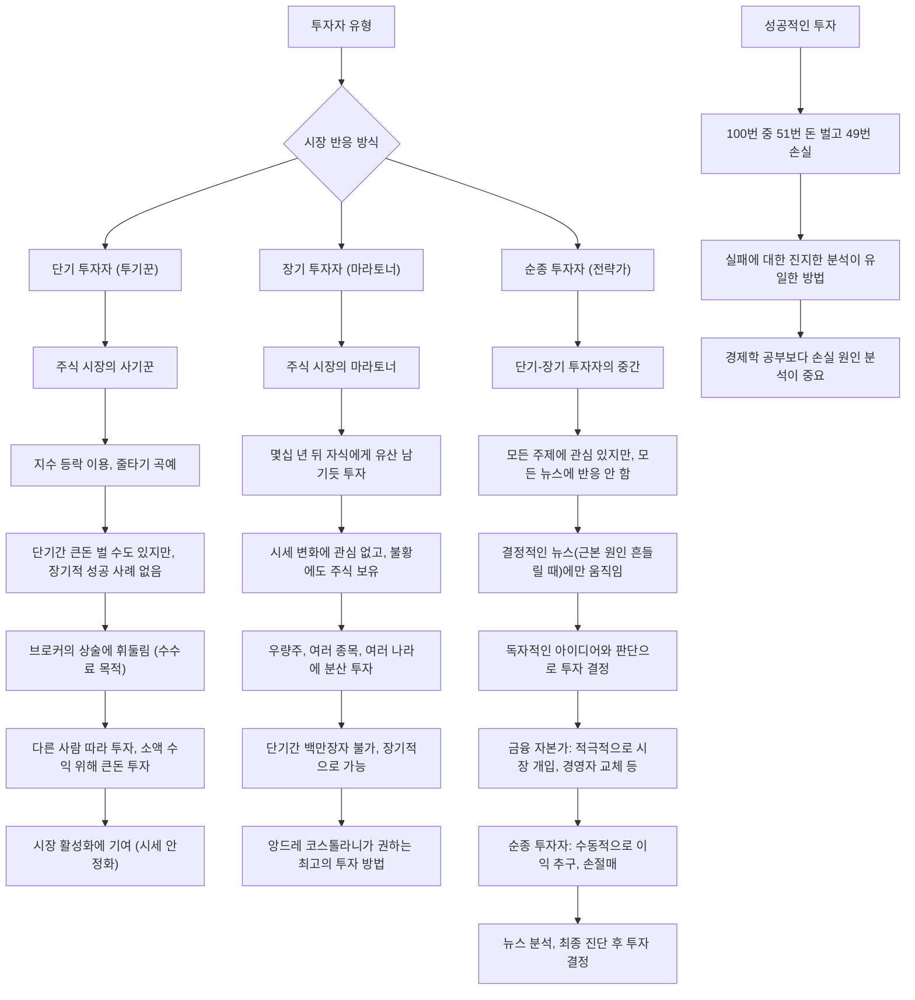
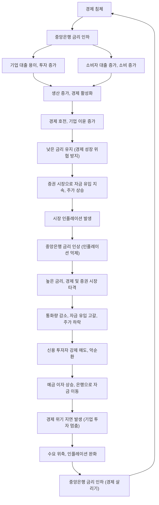
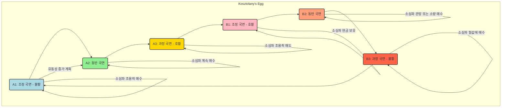

## 돈, 뜨겁게 사랑하고 차갑게 다루어라: 앙드레 코스톨라니의 투자 지혜
이 책은 전설적인 투자자 앙드레 코스톨라니가 들려주는 투자 이야기야. 돈을 뜨겁게 사랑하되, 차갑게 다루는 지혜를 통해 성공적인 투자를 위한 철학과 원칙을 배울 수 있어. 주식 시장의 흐름을 읽고, 자신만의 소신을 지키며, 돈과 행복의 진정한 의미를 찾아가는 여정을 함께 떠나보자.

## 1. 돈이란 무엇일까? 돈과 행복의 관계 

1. **돈은 경제 발전의 엔진이야.**
  1. 사람들은 돈을 벌려고 창의력을 발휘하고, 열심히 일하고, 위험도 감수해. 
  2. 예를 들어, 우리가 매일 출근하는 것도, 새로운 상품을 만드는 것도, 주식이나 부동산에 투자하는 것도 다 돈을 벌기 위해서 하는 일이야. 
  3. 이런 돈을 향한 욕구가 사회를 발전시키는 원동력이 된다고 앙드레 코스톨라니는 말했어. 
2. **돈이 꼭 행복을 가져다주는 건 아니야.**
  1. 500년 전에는 없던 컴퓨터, TV, 자동차 같은 것들이 지금은 흔하지만, 그렇다고 우리가 더 행복해졌다고 단정할 수는 없어. 
  2. 하지만 돈이 의학 발전을 가능하게 해서, 앙드레 코스톨라니처럼 93세까지 건강하게 살 수 있게 해준 것처럼, 돈이 우리 삶에 긍정적인 영향을 미치기도 해. 
  3. 결국 돈과 행복은 비례하는 관계는 아니지만, 서로 영향을 주고받는다고 보면 돼. 
3. **자본주의는 완벽하진 않지만, 인류가 선택한 길이야.**
  1. 앙드레 코스톨라니는 돈에 대한 욕구를 바탕으로 돌아가는 자본주의가 가장 이상적인 시스템이라고 말하고 싶지는 않다고 했어. 
  2. 인류에게는 두 가지 선택지가 있었어.
  1. 크지만 공평하지 않은 케이크 (자본주의).
  2. 작지만 공평하게 나눠진 케이크 (사회주의). 
  3. 대부분의 인류는 전자를 선택했어. 큰 케이크를 키워서 모두가 조금이라도 더 많이 먹을 수 있게 하는 쪽을 택한 거지. 
  4. 사람들은 겉으로는 돈 이야기를 잘 안 하지만, 사실 모두가 돈을 갈망하고 있어. 먹고살아야 하니까 당연한 거야. 

## 2. 돈을 소유하는 것과 버는 것의 차이 

1. **돈을 소유하는 건 큰 기쁨을 줘.**
  1. 통장에 돈이 많다는 사실만으로도 사람들은 행복을 느껴. 마치 100억이 있다면 밥을 안 먹어도 배부를 것 같은 기분이지. 
  2. 돈을 쓰지 않아도, 그저 가지고 있다는 사실만으로도 만족감을 얻는 사람들이 많아. 
2. **돈을 쓰는 즐거움도 중요해.**
  1. 어떤 사람들은 돈을 계산하는 데 그치지 않고, 실제로 삶의 행복을 위해 돈을 사용해. 
  2. 메뉴판 가격을 보지 않고 먹고 싶은 음식을 마음껏 시키는 것처럼 말이야. 
  3. 이런 사람들이 있어야 자본주의 경제가 계속 돌아갈 수 있어. 돈을 쓰는 사람이 없다면 경제는 굴러가지 않을 거야. 

## 3. 진정한 백만장자의 의미 

1. **백만장자는 돈의 액수로 결정되지 않아.**
  1. 앙드레 코스톨라니는 백만장자를 "자기 자본으로 원하는 바를 행하는 데 누구의 간섭도 받지 않는 사람"이라고 정의했어. 
  2. 돈 때문에 회사에 굽실거리거나, 사장이나 고객에게 맞춰 살 필요 없이 자신의 삶을 즐길 수 있는 사람이 진정한 백만장자라는 거지. 
2. **은행 잔고에 집착하면 백만장자가 될 수 없어.**
  1. 아무리 돈이 많아도 은행 잔고를 늘리는 데만 집착하면 결코 만족할 수 없어. 
  2. 맛있는 음식은 배가 부르면 더 이상 먹을 수 없지만, 돈에 대한 욕심은 끝이 없기 때문에 아무리 채워도 만족할 수 없거든. 
  3. 그래서 앙드레 코스톨라니는 돈과 적당한 거리를 두어야 한다고 강조했어. 돈에 대한 지나친 열정은 병적인 집착이나 투자를 불러올 수 있기 때문이야. 
3. **독립적인 태도가 중요해.**
  1. 돈을 너무 아껴서 자린고비처럼 사는 사람이나, 반대로 낭비벽이 심한 사람 모두 독립적일 수 없어. 
  2. 자린고비는 아껴야 한다는 강박감에 갇혀 있고, 낭비벽이 있는 사람은 항상 돈을 다시 마련해야 한다는 압박감에 시달리거든. 
  3. 진정한 백만장자는 돈의 간섭이나 압박감 없이 자유롭게 살 수 있는 사람이야. 

## 4. 단숨에 백만장자가 되는 세 가지 방법 

1. **부유한 배우자를 만나는 거야.**
  1. 돈 많은 배우자와 결혼하면 자연스럽게 부자가 될 수 있어. 실제로 많은 사람들이 결혼을 통해 부자가 되었지. 
2. **유망한 사업 아이템을 찾는 거야.**
  1. 빌 게이츠, 스티브 잡스, 마크 저커버그처럼 좋은 아이템을 발굴해서 큰 부를 이룬 사람들이 많아. 
3. **투자를 하는 거야.**
  1. 앙드레 코스톨라니는 자신의 경험을 바탕으로 투자가 가장 바람직한 방법이라고 말했어. 그는 외환, 원자재, 선물 등 다양한 유가증권에 투자해서 큰 부를 쌓았지. 
  2. 결혼이나 사업은 성공하기 어렵거나 예측하기 힘든 부분이 많지만, 투자는 공부하고 연구하면 성공할 가능성이 있다고 봤어. 
  3. **진정한 투자자란 이런 사람이야.**
  1. 지성인으로서 정치와 경제 상황을 진단하고 예측해서 수익을 창출하려고 심사숙고하는 사람이야. 
  2. 막연하게 주식을 사는 게 아니라, 끊임없이 공부하고 생각하며 수익을 내기 위해 노력하는 사람이지. 

## 5. 돈의 액수에 따른 투자 조언 

1. **앙드레 코스톨라니의 투자 잠언:**
  1. "돈이 많은 사람은 투자할 수 있다."
  2. "돈이 조금밖에 없는 사람은 투자해서는 안 된다."
  3. "그러나 돈이 전혀 없는 사람은 반드시 투자해야 한다." 
2. **돈이 전혀 없는 사람:**
  1. 월세를 못 내거나 의식주 해결이 어려운 사람들을 말해. 
  2. 이런 사람들은 우선 무슨 일이든 해서 돈을 마련해야 해. 앙드레 코스톨라니도 증권 투자로 망한 후 다시 딜러 일을 시작해서 돈을 벌었어. 
  3. 삶을 역전시키기 위해 반드시 투자를 해야 하지만, 일단은 의식주 해결이 먼저야. 
3. **돈이 많은 사람:**
  1. 자신과 가족의 의식주, 자녀 교육비, 연금, 내 집 마련 등 기본적인 문제가 해결된 사람들을 의미해. 
  2. 이들은 투자를 할 수도 있고 안 할 수도 있어. 불을 더 늘리기 위해 주식, 부동산, 비트코인 등에 투자해 볼 수 있지. 
  3. 하지만 어떤 투자든 지나치게 몰두해서는 안 돼. 아무리 돈이 많아도 투자 시장에서 모든 것을 잃고 빚까지 질 수 있기 때문이야. 
4. **돈이 조금밖에 없는 사람:**
  1. 가장으로서 집을 마련해야 하거나, 자녀 교육비 등 당장 돈 쓸 일이 있는 사람들을 말해. 
  2. 이런 사람들은 투기를 해서는 안 돼. 장기간 돈 쓸 일이 없다면 우량주에 투자해도 괜찮지만, 한몫 잡으려고 무리하게 투자하면 안 된다는 거야. 
  3. 왜냐하면 투자에 실패하면 지금의 안정된 의식주마저 잃을 수 있기 때문이야. 상승장이 영원하지 않다는 것을 명심해야 해. 
  4. 투자는 시간 제한 없는 돈으로 해야 하고, 정신적으로도 준비가 되어 있어야 해. 당장 생활에 필요한 돈으로 투자하면 안 된다는 거지. 
  5. **투자는 위험을 감수하는 정신적 준비가 필요해.**
  1. 확실한 수익을 보장해주는 투자 상품은 세상 어디에도 없어. 
  2. 확정 수익을 내세우는 다단계나 금융 사기에 속지 않도록 조심해야 해. 투자는 항상 위험(리스크)을 수반하기 때문이야. 

## 6. 단기 투자자, 장기 투자자, 순종 투자자 

1. 단기 투자자** (투기꾼): 주식 시장의 사기꾼 **
  1. 앙드레 코스톨라니는 단기 투자자를 투자자라고 부르고 싶지 않다고 했어. 
  2. 이들은 지수 등락을 이용해서 짧은 시간에 큰돈을 벌려고 해. 마치 줄타기 곡예를 하는 것과 같지. 
  3. 단기간에 큰돈을 벌 수도 있지만, 주가 움직임을 정확히 예측하기는 매우 어려워. 
  4. 앙드레 코스톨라니는 80년 동안 증권계에 몸담았지만, 장기적으로 성공한 단기 투자자는 본 적이 없다고 했어. 
  5. 은행이나 브로커들은 수수료를 벌기 위해 사람들을 단기 투자로 유도하는 상술을 사용해. 
  6. 단기 투자자들은 소액의 수익을 위해 어마어마한 목돈을 투자하고, 다른 사람들이 하는 대로 따라 하는 경향이 있어. 
  7. 앙드레 코스톨라니는 단기 투기를 부정적으로 보지만, 시장 활성화에는 필요하다고 말했어. 단기 투기꾼들이 있어야 시세가 안정적으로 유지될 수 있거든. 
2. 장기 투자자** (마라토너): 주식 시장의 마라토너 **
  1. 장기 투자자는 단기 투자자와 정반대야. 몇십 년 뒤 자식이나 후손에게 유산으로 남기기 위해 주식을 사두는 사람들이지. 
  2. 이들은 시세 변화에 관심이 없고, 불황이 와도 주식을 팔지 않고 계속 보유해. 
  3. 우량 주식에 투자하고, 모든 종목과 여러 나라에 골고루 분산 투자하는 경향이 있어. 
  4. 미국과 영국의 연기금이 대표적인 장기 투자자라고 할 수 있어. 
  5. 장기 투자는 단기간에 백만장자가 될 수는 없지만, 장기적으로는 가능하다고 앙드레 코스톨라니는 말했어. 그 역시 자신을 장기 투자자라고 생각했고, 우리에게도 장기 투자를 권했지. 
3. 순종 투자자** (전략가): 장기적인 전략가 **
  1. 순종 투자자는 단기 투자자와 장기 투자자의 중간쯤에 있어. 
  2. 모든 투자 정보에 관심은 있지만, 단기 투자자처럼 모든 뉴스에 즉각적으로 반응하지는 않아. 
  3. 대통령의 건강 문제나 지진 같은 일시적인 주가 하락에도 쉽게 주식을 포기하지 않아. 
  4. 다만, 투자한 주식의 근본적인 원인(기초)이 흔들릴 정도로 결정적인 뉴스가 나오면 그때는 움직여. 
  5. 순종 투자자는 자신만의 독자적인 아이디어를 가지고 판단하고 투자 결정을 해. 
  6. 금융 자본가들은 경영에 직접 개입하거나 경영자를 바꾸는 등 적극적으로 시장을 움직이려 하지만, 순종 투자자들은 수동적으로 이익을 얻는 포지션을 취해. 
  7. 이들은 뉴스를 분석하고 자신만의 판단으로 최종 진단을 내린 후 투자를 결정하는 사람들이야. 
4. **성공적인 투자를 위한 조언 **
  1. 투자에 있어서 손실과 수익은 동전의 양면과 같아. 
  2. 성공적인 투자자는 100번의 투자 중 51번 돈을 벌고 49번 손실을 본 사람이야. 
  3. 실패에 대한 진지한 분석만이 성공적인 투자가 될 수 있는 유일한 방법이라고 앙드레 코스톨라니는 강조했어. 
  4. 경제학 공부는 투자에 별 도움이 되지 않고, 손실의 원인을 제대로 분석하고 연구하는 것이 수익을 결정짓는다고 그는 말했어. 

## 7. 주가를 움직이는 진짜 원인: 수요와 공급 

1. **기업 실적이나 뉴스가 주가를 움직이는 게 아니야.**
  1. 많은 사람들이 기업 실적이나 금리 상승 같은 뉴스가 주가를 움직인다고 생각하지만, 앙드레 코스톨라니는 그렇지 않다고 말했어. 
  2. 예를 들어, 기업이 높은 이윤을 냈어도 전문가들이 미래를 어둡게 평가하면 주가는 떨어지기도 해. 
  3. 같은 신문에서 달러 강세가 주가 상승의 원인이라고 했다가 다음 날 하락의 원인이라고 보도하는 것처럼, 뉴스나 전문가들의 설명은 늘 변덕스러워. 
  4. 앙드레 코스톨라니는 이런 정보나 뉴스들이 투자자에게 도움이 되지 않는다고 했어. 전문가들은 주가 변동 후에 그 이유를 끼워 맞추는 것뿐이라고 말이야. 
2. **주식 시장은 변덕스러운 고유한 논리가 있어.**
  1. 주식 시장은 아름다운 여자나 날씨처럼 예측하기 어렵고 변덕스러워. 
  2. 먹이를 유인하듯 마법을 부리다가도 예상치 못한 순간에 찬물을 끼얹기도 하지. 
  3. 앙드레 코스톨라니는 주식 시장의 변동에 대해 냉정함을 유지하고, 논리적인 설명을 찾으려고 하지 말라고 조언했어. 
3. **주가를 움직이는 유일한 논리는 수요와 공급이야.**
  1. 분석가들은 보통 주식의 공급이 수요보다 많으면 주가가 떨어지고, 수요가 공급보다 많으면 주가가 오르며, 둘이 같으면 주가가 움직이지 않는다고 설명해. 
  2. 하지만 우량주라고 해서 꼭 상승하고 부실주라고 해서 꼭 하락하는 건 아니야. 역사적으로 반대의 경우도 많았지. 
  3. 어떤 기업이 이윤이 많고 배당금도 좋고 전망도 밝아도, 주가가 오르는 유일한 이유는 그 주식을 사려는 사람이 팔려는 사람보다 많기 때문이야. 
  4. 결국 주가를 움직이는 본질적인 것은 사는 사람과 파는 사람의 심리, 즉 수요와 공급의 힘겨루기라는 거지. 
  5. 주식을 가진 사람이 급하게 팔려고 하는데, 돈을 가진 사람은 여유롭게 살 마음만 있다면 주가는 떨어질 수밖에 없어. 
  6. 기업의 상황, 전쟁, 정권 같은 것들은 주가에 간접적인 영향을 줄 뿐이야. 이런 변수들이 시세에 영향을 미치려면, 돈을 가진 사람들과 증권을 가진 사람들이 그 상황에 의미를 부여하고 투자할 때 비로소 가능해. 

## 8. 주식 시장의 장기적 흐름: 전쟁, 평화, 경제 발전 

1. **10년 이상의 **주식 시장** 흐름을 결정하는 요소:**
  1. 전쟁과 평화, 그리고 경제 발전이야. 
  2. 앙드레 코스톨라니는 특히 평화가 가장 중요하다고 강조했어. 
2. 수면제 투자법**: 시장에 대한 낙관적인 믿음 **
  1. 앙드레 코스톨라니는 주식 투자에 성공하려면 좋은 우량주를 사서 수면제를 먹고 5년, 10년 동안 잠이 들어야 한다고 말했어. 
  2. 이 말의 핵심은 주식 시장에 대한 낙관적인 믿음이야. 좋은 겨울 다음에는 반드시 봄이 오고, 10년 뒤에는 주가가 반드시 올라갈 것이라는 기대가 깔려 있는 거지. 
  3. 주가는 오르락내리락 하면서 결국에는 올라가기 때문에, 단기적인 움직임에 일희일비하지 말고 길게 봐야 해. 
  4. 앙드레 코스톨라니는 석유 파동이나 전쟁을 직접 겪으면서, 화약 냄새가 나면 투자자들이 투자를 꺼린다는 것을 피부로 느꼈어. 
  5. 상황이 불확실할수록 투자를 주저하고, 상황이 확실해질수록 주식을 늘려야 해. 
3. **개와 주인의 비유: 경제와 주식 시장의 관계 **
  1. 경제와 주식 시장은 항상 나란히 움직이지 않아. 경제가 좋아져도 주식 시장은 일시적으로 하락할 수 있고, 반대로 경제가 나빠져도 주가가 오를 수 있지. 
  2. 앙드레 코스톨라니는 이를 '개와 주인의 이야기'로 비유했어.
  1. 주인(경제)이 공원을 산책하면, 개(주가)도 결국 공원에 도착해. 
  2. 하지만 개는 주인보다 앞서가기도 하고, 뒤처지기도 하고, 옆으로 왔다 갔다 하면서 움직여. 
  3. 결국 경제 상황이 좋아지면 주가도 올라가지만, 그 과정에서 상승과 하락은 있을 수 있다는 거야. 
  3. 경제와 기업이 튼튼하게 성장하지 않으면 주식 시세도 지속적으로 상승할 수 없어. 
  4. 일본의 '잃어버린 20년, 30년'처럼, 경제 기초 지표와 기업 수익이 주가와 괴리되면 결국 주가는 따라갈 수밖에 없어. 
  5. 장기적으로 보면 주식 시장은 경제와 분리될 수 없어. 중요한 것은 과거가 아닌 미래에 대한 믿음이야. 
4. **경제 성장의 원동력: 인간의 욕구 **
  1. 경제 성장의 추진력은 결국 인간의 욕구에서 나와. 더 나은 생활 수준, 더 나은 삶을 살고 싶은 인간의 욕망은 결코 사라지지 않을 거야. 
  2. 이런 믿음을 가지고 투자해야 해. 좋은 기업에 투자하고 수면제를 먹고 기다린다면, 결국 큰돈을 벌 수 있을 거라고 앙드레 코스톨라니는 말했어. 
  3. 예를 들어, 반도체 수요는 앞으로도 계속 늘어날 것이고, 삼성전자 같은 기업은 결국 성장할 것이라는 믿음이 있다면, 지금의 하락장은 엄청난 투자 기회가 될 수 있다는 거지. 

## 9. 중기적 주식 시장의 영향 요소: 통화와 심리 

1. **중기적 주식 시장을 움직이는 두 가지 요소: 통화와 심리 **
  1. **돈 (통화):** 주식 시장에서 돈은 산소나 기름과 같아. 돈이 없으면 아무리 전망이 좋고 경기가 좋아도 주식 거래가 성립되지 않아. 
  2. **심리:** 돈만 가지고 주식 시장이 움직이는 건 아니야. 사람들의 투자 심리도 매우 중요해. 투기 열풍이 불면 가격이 폭등하는 것처럼 말이야. 
  3. 이 돈과 심리가 합쳐져서 중기적인 시장의 흐름(트렌드)을 만들어. 
2. **돈과 심리의 상호작용 **
  1. 강세장** (상승장)의 시작:** 처음에는 소수의 투자자들만 주식을 사기 시작해. 그러다 주가가 조금씩 오르면 새로운 매수자들이 참여하고, 언론에서도 긍정적인 뉴스를 쏟아내면서 시장은 강세장으로 변해. 
  2. 약세장** (하락장)의 시작:** 반대로 돈의 흐름이 부정적으로 바뀌고 투자 심리가 위축되면, 아무리 좋은 경제 소식이 많아도 주가는 하락하게 돼. 
  3. 앙드레 코스톨라니는 중기적인 주식 거래에서는 돈과 상상력(심리)이 경제 기초 지표보다 훨씬 더 결정적인 역할을 한다고 강조했어. 
3. **경기가 주식 시장에 미치는 영향 **
  1. 앙드레 코스톨라니는 경기가 중기적으로 주식 시장에 큰 영향을 미치지 않는다고 말했어. 주식 시장이 꼭 경제 상황을 그대로 반영하는 거울은 아니기 때문이야. 
  2. 새로운 기업이 상장해서 주식 수가 늘어나면, 시중에 돈이 그대로라면 주가는 하락할 수 있어. 
  3. 불황기에는 사람들이 소비를 줄이고 저축을 늘리는데, 이 저축의 일부가 직간접적으로 주식 시장에 유입되면서 주가가 상승하기도 해. 
  4. 결국 중기 투자에서는 경기 상황이 투자 결과에 큰 영향을 미치지 않는다고 보면 돼. 

## 10. 인플레이션 대처법 

1. **인플레이션은 적당하면 좋지만, 통제를 벗어나면 위험해. **
  1. 인플레이션(물가 상승)은 적당하면 따뜻한 물처럼 경제에 좋지만, 통제를 벗어나면 위기가 찾아와. 
  2. 소비자 물가가 오르고, 노조는 임금 인상을 요구하고, 다시 물가가 오르는 악순환이 반복되면 물건 값이 천정부지로 치솟게 돼. 
  3. 이렇게 되면 화폐 가치가 떨어지고, 돈이 주식 시장 대신 금, 그림, 우표, 골동품 같은 곳으로 흘러가. 
  4. 주식 시장에서 돈이 빠져나가면 주가는 하락할 수밖에 없어. 
  5. 결국 통제 불능의 인플레이션은 대량 실업과 금융 위기를 초래할 수 있어. 
  6. 앙드레 코스톨라니는 인플레이션에 대항하는 싸움은 해로울 뿐이며, 인플레이션이 주식 시장에 간접적으로 해롭거나 사실상 아무런 영향도 끼치지 않는다고 말했어. 

## 11. 금리와 주가의 관계 

1. **금리는 돈의 가격이야. **
  1. 금리는 임금 상승, 원자재 가격, 소비, 생산력 향상 등 경제의 모든 요소가 반영되어 결정돼. 
  2. 금리가 높으면 돈을 빌리는 비용이 비싸져서 대출 수요가 줄어들어. 
  3. 반대로 금리가 낮으면 돈을 싸게 빌릴 수 있어서 기업은 투자를 늘리고, 소비자들은 대출을 받아 집이나 다른 소비재를 사려고 해. 
2. **이론과 현실은 다를 수 있어. **
  1. 이론적으로는 금리가 낮아지면 경제가 활성화되어야 하지만, 현실에서는 경기가 침체되면 기업이나 소비자 모두 비관에 빠져 투자를 꺼리거나 소비를 줄이려고 해. 
  2. 이런 상황에서 중앙은행이 발행한 돈은 직접 투자나 소비로 가지 않고 증권 시장으로 흘러 들어가 주가를 올리기도 해. 
3. **금리 인상과 주식 시장의 하락 **
  1. 경기가 호전되고 인플레이션이 발생하면, 중앙은행은 인플레이션을 잡기 위해 금리를 올리기 시작해. 
  2. 높은 금리는 시간이 지나면서 경제와 증권 시장에 나쁜 영향을 줘. 통화량이 줄어들고 증권 시장으로의 자금 유입이 고갈되면서 주가는 하락할 수밖에 없어. 
  3. 신용으로 주식을 샀던 투자자들은 높은 금리 때문에 강제로 주식을 팔아야 하는 상황에 내몰리고, 이는 주가 하락을 더욱 가속화시켜. 
  4. 예금 이자가 높아지면 은행으로 돈이 몰리면서 예금이 주식과 경쟁하게 돼. 
  5. 금리 상승의 결과로 경제 위기는 다소 늦게 나타날 수 있지만, 결국에는 수요 위축으로 이어져. 
4. **금리 상승기에는 주식 처분을 고려해야 해. **
  1. 증권 시장이 금리에 얼마나 빠르게 반응하는지는 시장 참여자들의 생각에 달려 있어. 
  2. 하지만 중앙은행이 금리를 높여 시중의 돈을 회수하기 시작하면, 기업 실적이 좋든 나쁘든 주식 시세가 하락하는 것은 시간문제야. 
  3. 만약 주식 시장이 이전에 좋았다면, 떨어지는 폭은 더 커질 수 있어. 
  4. 앙드레 코스톨라니의 말에 따르면, 금리가 올라가는 시기에는 주식을 처분할 기회를 잡아야 해. 

## 12. 부화뇌동파와 소신파: 어떤 투자자가 될 것인가? 

1. **투자자를 두 부류로 나눠: 부화뇌동파와 **소신파** **
  1. 부화뇌동파**:** 남들을 따라 도박하듯이 투자하는 사람들을 말해. 
  2. **소신파:** 자신만의 원칙과 철학을 가지고 투자하는 사람들을 말해. 
  3. 앙드레 코스톨라니는 우리가 소신파가 되어야 한다고 강조했어. 
2. **부화뇌동파와 소신파를 나누는 네 가지 기준: 돈, 생각, 인내, 행운 **
  1. **돈:**
  1. 재산의 많고 적음이 아니라, 온전한 자기 돈을 가지고 빚이 없을 때 돈이 있다고 말할 수 있어. 
  2. 앙드레 코스톨라니는 빚을 내서 투자했다가 큰 손실을 본 경험을 통해, 절대 빚내서 투자하면 안 된다고 강조했어. 
  2. **생각:**
  1. 주식 시장에서 지적으로 거래하는 투자자는 자신만의 생각을 가지고 있어야 해. 
  2. 그 생각이 옳든 그르든 중요하지 않아. 중요한 건 생각하고 난 뒤에 거래하고, 상상력을 가지고 자신의 생각을 믿어야 한다는 거야. 
  3. 충분히 생각하고 전략을 세웠다면, 친구나 여론, 일상생활에 흔들리지 않을 수 있어. 
  3. **인내:**
  1. "증권 거래소에서는 머리로 돈을 버는 것이 아니라 엉덩이로 번다"는 말처럼, 투자는 인내가 필요해. 
  2. 투자해서 얻는 돈은 고통의 대가야. 처음에는 생각과 다르게 움직이다가 마지막에 가서야 예상대로 되는 경우가 많거든. 
  3. 앙드레 코스톨라니는 투자에 필요한 공식을 "2 곱하기 2는 5 빼기 1"이라고 말했어.
  1. 엔지니어에게는 "2 곱하기 2는 4"처럼 즉각적인 결과가 중요하지만, 투자자에게는 "5 빼기 1"에서 '빼기 1'이 언제 나올지 모르는 인내심이 필요하다는 의미야. 
  4. 투자 근거가 튼튼하고 올바르면, 모든 것을 시간이 해결해 줄 거야. 
  5. 대다수의 투자자들은 시세가 떨어지면 심리적 혼란에 빠져 주식을 팔아치우지만, 성공적인 투자를 위해서는 인내와 주관이 필요해. 
  4. **행운:**
  1. 전쟁, 자연재해, 정치적 혼란, 새로운 발명, 사기 등 예측 불가능한 운의 요소가 투자에 영향을 미칠 수 있어. 
  2. 예를 들어, 신약을 개발한 제약 회사에 투자했는데 경쟁사가 더 좋은 약을 개발하면, 내 판단이 무의미해질 수 있지. 
  3. 돈, 생각, 인내, 행운 이 네 가지 중 하나라도 빠지면 뇌동매매하는 투자자가 될 수밖에 없어. 

## 13. 코스톨라니의 달걀: 시장 국면별 투자 전략 

1. **코스톨라니의 달걀은 시장의 순환을 보여줘. **
  1. 시장은 약세장과 강세장으로 나뉘고, 각각 세 가지 국면(조정, 동반, 과장)으로 세분화돼. 
  2. 달걀의 아랫부분은 불황, 윗부분은 호황을 의미해. 
  3. 이 달걀 그림을 이해하면 지금 시장이 어떤 상황인지, 어떻게 투자해야 할지 알 수 있어. 
2. **강세장으로 가는 길 (왼쪽): 불황에서 호황으로 **
  1. **A1 (조정 국면):** 불황기에는 정부가 유동성을 늘리려고 하지만, 사람들은 비관적이라 거래량이 적고 주식 소유자도 적어. 소심파(똑똑한 투자자)만 조용히 주식을 매수하는 단계야. 
  2. **A2 (동반 국면):** 소심파의 매수로 주가가 조금씩 오르기 시작하면 거래량과 주식 소유자가 늘어나. 소심파는 계속 매수해. 
  3. **A3 (과장 국면):** 거래량과 주식 소유자가 폭증하고, 부화뇌동파(남 따라 하는 투자자)가 참여하면서 주가가 폭등해. 언론도 주식 매입을 보도하고, 모두가 주식 이야기를 해. 이때 소심파는 조용히 주식을 팔기 시작해. 
3. **약세장으로 가는 길 (오른쪽): 호황에서 불황으로 **
  1. **B1 (조정 국면):** 소심파가 주식을 팔기 시작하면서 거래량과 주식 소유자가 줄어들어. 약간의 매도에도 주가가 즉시 하락하고, 투자자들은 예민해져. 소심파는 이미 주식을 다 팔고 현금을 보유하고 있어. 
  2. **B2 (동반 국면):** 거래량은 증가하지만 주식 소유자는 계속 감소해. 시장 분위기는 극도로 예민해지고, 소심파는 편안하게 관망하거나 소량의 주식을 사기도 해. 
  3. **B3 (과장 국면):** 비관주의가 팽배해서 모두가 주식을 팔아치워. 거래량이 폭증하고 주식 소유자는 최저점에 달해. 기업은 멀쩡해도 주식은 안 된다는 생각에 다 팔아버리지. 이때 소심파는 헐값에 주식을 사 모으기 시작해. 
4. **지금 시장은 어디쯤일까? **
  1. 앙드레 코스톨라니는 과거의 시장 상황을 A3 국면(과장 국면)으로 봤어. 모두가 삼성전자 주가에 관심을 가지고 10만 전자를 외치던 시기였지. 
  2. 하지만 지금은 A3 국면이 끝나고 B1 국면(조정 국면)으로 가는 중이라고 추측했어. 주식 시장이 빠지고 있고, 투자자들이 예민해지며, 소심파는 이미 주식을 팔고 있는 상황이라는 거지. 
  3. 금리가 오르면 시장은 하락할 수밖에 없기 때문에, 지금은 주식을 조금씩 처분하고 현금을 확보하는 것이 좋다고 조언했어. 
  4. B3 국면(과장 국면)까지 기다렸다가, 모두가 비관에 빠져 주식을 헐값에 팔 때 과대 낙폭된 종목들을 사 모으면 경제적 자유를 누릴 수 있는 기회가 올 수 있다고 말했어. 

## 14. 17세기 튤립 버블: 투기의 역사 

1. **튤립, 서민의 꽃에서 사회적 지위의 상징으로 **
  1. 17세기 유럽에 터키에서 온 튤립이 들어왔어. 처음에는 평범한 꽃이었지만, 식물학자들이 북유럽 기후에 맞게 개량하면서 인기를 얻기 시작했지. 
  2. 점점 튤립은 서민의 꽃에서 부르주아 계급의 사회적 지위를 상징하는 것으로 변했어. 
  3. 귀족 부인들은 화장실 타일 색깔에 맞는 튤립을 찾고, 집안 인테리어를 튤립 중심으로 꾸미는 등 튤립이 모든 것의 중심이 되었어. 
  4. 다른 사람이 가지고 있지 않은 희귀한 튤립을 소유하는 것이 매우 중요했어. 마치 명품처럼 말이야. 
2. **튤립 투기 열풍과 버블의 형성 **
  1. 부르주아 계급이 튤립으로 지위를 과시하자, 귀족을 닮고 싶었던 돈 많은 서민들도 튤립을 사 모으기 시작했어. 
  2. 정원에 튤립을 장식할수록 가격은 계속 올랐고, 사람들은 더 희귀한 튤립을 찾으려는 욕망에 사로잡혔어. 
  3. 결국 튤립만으로는 부족한 상황이 되자, 계산이 빠른 사람들은 튤립에 선제적으로 투자하기 시작했어. 
  4. 주식 투자자들까지 튤립에 뛰어들면서 튤립 뿌리 가격은 천정부지로 치솟았지. 
3. **튤립 버블의 붕괴 **
  1. 하지만 1637년, 튤립 버블은 터져 버렸어. 350가지 종류의 튤립이 나오면서 더 이상 새롭고 진귀한 튤립이 없어졌거든. 
  2. 그때서야 투자자들은 튤립 가격이 비정상적으로 올랐다는 것을 깨달았어. 
  3. 모두가 튤립을 팔려고 했지만, 아무도 사려고 하지 않으니 가격이 형성되지 않았고, 결국 튤립 뿌리는 양파와 다름없는 값이 되어 버렸어. 
4. **역사에서 배우는 교훈 **
  1. 무가치한 것을 대상으로 한 비이성적인 투기는 결국 경제 재앙으로 끝나. 
  2. 이것은 강세장의 마지막 국면에서 나타나는 전형적인 특징이야. 
  3. 상승 흐름은 비이성적으로 주가를 끌어올리고, 결국 무가치한 주식까지도 모두 끌어올려. 
  4. 사람들은 욕심에 눈이 멀어 높은 가격을 기꺼이 지불하고, 광고나 소문에 속아 투자 게임에 빨려 들어가. 
  5. 튤립 투자자들은 튤립 생산이 소비를 초과하거나, 네덜란드가 튤립을 엄청나게 생산할 것이라고 생각하지 못했어. 튤립 열풍이 영원할 것이라고 착각했던 거지. 
  6. 하지만 결국 초과 공급이 일어나고 사람들이 튤립을 찾지 않는 상황이 오면서 버블은 꺼졌어. 
  7. 앙드레 코스톨라니는 17세기 튤립 버블처럼, 오늘날에도 비트코인, NFT 등 무가치하게 가격이 오르는 것들이 버블일 수 있다고 경고했어. 
  8. 역사적 교훈을 통해 지금 시장이 버블인지 아닌지 생각해 볼 기회를 가져야 해. 

## 15. 앙드레 코스톨라니의 성공 전략: 소신파가 되어라 

1. **성공적인 투자자의 태도: 소신파가 되어 남들과 반대로 행동해라. **
  1. 밀 가격이 떨어질 때 밀을 가지고 있지 않았던 사람은, 밀 가격이 오를 때도 가지고 있지 않아. 즉, 주식 가격이 떨어질 때 주식을 가지고 있어야 해. 
  2. 상승 운동의 제1국면(바닥을 지나 오르기 시작하는 시점)에서는 매수해야 하고, 상승장의 제3국면(호황기)이 오면 시장에서 빠져나갈 준비를 해야 해. 
  3. 주식 시장을 보는 기술의 핵심은 지금 시장이 상승 운동의 어느 국면에 있는지, 하강 운동의 어느 국면에 있는지를 아는 것이야. 
  4. 투자에 정답은 없어. 경험과 지식을 쌓고 시장에 대응하면서 자신만의 투자 철학을 만들어야 해. 
2. **시장 바닥과 꼭지점의 징후 **
  1. **시장 바닥의 징후:** 시장이 악재에도 더 이상 하락하지 않는다면, 그것은 시장이 과잉 매도 상태에 있고 곧 바닥에 이르렀다는 뜻이야. 
  1. 이때 주식을 가진 사람들은 소신파 투자자들이야. 이들은 똑똑하고 시장을 앞서가는 사람들이지. 
  2. 소신파 투자자들은 미래에 대한 믿음과 비전을 가지고 있고, 빚이 없으며, 좋은 소식을 기다리는 인내심이 있어. 
  2. **시장 꼭지점의 징후:** 시장이 호재에도 별 반응을 하지 않는다면, 그것은 과잉 매수 상태에 있다는 의미야. 
  1. 이때 주가는 꼭지점 근처에 왔을 가능성이 높아. 
  2. 주식은 부화뇌동 투자자들의 손 안에 있으며, 이들은 좋은 소식에도 더 이상 살 수가 없어. 
3. **거래량을 통해 시장의 흐름을 읽어라. **
  1. **시세가 떨어지는데 거래량이 많다면:** 많은 주식이 부화뇌동파의 손에서 소신파의 손으로 넘어가고 있다는 뜻이야. 곧 상승 운동이 시작될 징조라고 볼 수 있어. 
  2. **거래량이 적은데 시세가 지속적으로 떨어진다면:** 좋지 않은 징조야. 아직도 부화뇌동파의 손에 주식이 많고, 하락세가 더 가속화될 수 있어. 
  3. **거래량이 많은데 가격이 오른다면:** 좋지 않아. 거래량이 많을수록 하강 국면으로 접어들 가능성이 높아. 소심파는 팔고, 부화뇌동파는 사고 있는 상황이지. 
  4. **거래량이 적은 가운데 주가가 서서히 상승한다면:** 아주 긍정적이야. 주식이 소심파의 수중에 있고, 부화뇌동파에게 넘어가지 않았다는 뜻이야. 주가는 한동안 더 올라갈 가능성이 높아. 
  5. **거래량이 많지 않은 가운데 시장이 상승하거나 하락하면:** 동일한 흐름이 지속될 것임을 시사해. 
  6. **거래량이 점차 늘어나면서 시장이 상승하거나 하락하면:** 흐름에 반전이 멀지 않았다는 것을 의미해. 
4. **언론 보도를 반대로 해석해라. **
  1. 언론이 주식 시장에 대해 긍정적인 전망을 쏟아내고, 마지막 비관론자까지 낙관론자로 바뀌면 시장은 강세장의 정점에 다다랐다는 의미야. 이때는 팔 준비를 해야 해. 
  2. 반대로 모든 언론 매체가 부정적인 보도를 하고, 주식은 끝났다는 뉴스로 도배되어 있다면, 이때가 바로 투자자가 주식을 살 아주 좋은 기회야. 

## 16. 자신만의 투자 철학을 가져야 하는 이유 

1. **대중의 심리에 휩쓸리지 않으려면 훈련이 필요해. **
  1. 대중 매체나 전문가들이 특정 종목을 추천할 때, 경험이 적은 투자자들은 그 말에 반해서 매수하기가 정말 어려워. 
  2. 이론적으로는 대중과 반대로 가야 한다는 것을 알아도, 막상 결정적인 순간에는 대중 심리를 따라가게 돼. 
  3. 이런 부화뇌동 투자자들은 자신만의 신념과 철학이 없기 때문에 남의 것을 따라 하는 거야. 
  4. 결국 이런 태도는 최악의 판단으로 이어질 수 있어. 
  5. 투자가 대중의 히스테리에 파묻히지 않으려면 냉정하다 못해 냉소적이기까지 해야 해. 
2. **투자자는 용기, 적극성, 현명함, 그리고 유연함을 갖춰야 해. **
  1. 투자자는 대중 심리에서 벗어나 하강 운동의 과장 국면(폭락장)에서 매수했다면, 그 이후 주가가 더 떨어져도 계속 보유할 수 있는 강한 주관을 가져야 해. 
  2. 손실이 너무 커져서 '지하실'까지 가는 상황이 와도 견딜 수 있어야 해. 
  3. 주가는 오르락내리락 하면서 상승하기 때문에, 이런 전개 과정을 이해하지 못하면 상황을 다시 검토하게 돼. 
  4. **결정적인 순간에는 자신의 생각과 계획을 버릴 준비가 되어 있어야 해.**
  1. 내가 바닥이라고 생각해서 샀는데 주가가 50% 더 빠졌다면, 내 생각과 다르게 움직이는 거잖아. 
  2. 이때는 왜 빠졌는지, 내가 놓친 변수는 없는지 면밀히 검토해서, 내가 틀렸다면 인정하고 과감하게 계획을 바꿀 수 있어야 해. 
  3. 하지만 신념에 대한 확신이 있다면 계속 밀어붙여야 해. 
  4. 오직 상황이 근본적으로 바뀌고, 내가 탄 배(종목)가 잘못된 것이라고 생각될 때만 가능한 빨리 빠져나와야 해. 
  5. 투자자는 판단력과 유연함을 동시에 갖춰야 해. 
3. 수면제 투자법**: 우량주를 사고 푹 자라. **
  1. 상승 운동의 제3국면(절정기)에서도 너무 일찍 팔면 큰 수익을 놓칠 수 있어. 
  2. 시장의 낙관주의는 24시간 이내에 비관주의로 바뀔 수 있으니, 인터넷이나 TV 같은 일반적인 여론에 휩쓸리지 않아야 해. 
  3. 앙드레 코스톨라니는 마지막으로 "수면제와 우량주를 동시에 사서, 시장의 천둥번개를 의식하지 말고 몇 해 동안 푹 자라"고 조언했어. 
  4. 이 조언대로 하면 잠에서 깨어나는 순간 기쁘고 경이로운 순간을 체험하게 될 것이라고 말했지. 
  5. 주식은 꾸준히 오르거나 빠지는 것이 아니라, 상승과 하락을 반복하며 움직이기 때문에, 이런 움직임에 휘둘리면 돈을 벌 수 없어. 
  6. 결국 자신만의 철학과 신념을 가지고 우량주에 장기 투자하는 것이 중요해. 

## 17. 주식 초보자를 위한 조언: 강세장 투자자가 되어라 

1. **두 종류의 투자자: 강세장 투자자와 **약세장** 투자자 **
  1. 약세장 투자자**:** 주가가 떨어질 것으로 예상하고, 아직 갖고 있지 않은 주식을 미리 팔아 이익을 얻으려는 투자자야. 마치 아직 잡지도 않은 곰의 가죽을 파는 사냥꾼과 같지. 
  1. 주가가 예상과 반대로 오르면 손실을 보게 돼. 
  2. 앙드레 코스톨라니는 이 스타일로 큰돈을 벌었지만, 돈이 전부라고 생각하는 약세장 투자자의 사고방식은 불행한 결과를 초래할 수 있다고 말했어. 
  3. 돈의 가치를 과대평가하고, 돈으로 살 수 없는 것은 없다고 생각하며, 모든 것의 가치가 떨어진다고 믿기 때문에 디플레이션 경제로 이어질 수 있어. 
  4. 앙드레 코스톨라니는 약세장 투자로 돈을 벌었을 때, 함께 즐길 사람이 없어서 기쁨을 누릴 수 없었다고 고백했어. 
  2. **강세장 투자자:** 주가가 오를 것으로 예상하고 주식을 사서 이익을 얻으려는 투자자야.
2. **주식 초보자라면 강세장 투자자가 되어야 해. **
  1. 앙드레 코스톨라니는 초보자에게 무조건 강세장 투자자로 시작할 것을 권했어. 
  2. 강세장이 약세장보다 기회가 더 많기 때문이야. 
  3. 약세장의 하락폭은 최대 100%이지만, 강세장의 상승폭은 무한할 수 있어. 만 원짜리 주식이 100만 원이 될 수도 있거든. 
  4. 앙드레 코스톨라니는 돈을 많이 벌었지만 함께 즐길 사람이 없다는 깨달음을 통해, 돈을 버는 목적과 무엇을 하고 싶은지 생각해 보는 것이 중요하다고 말했어. 

## 18. 투자 조언, 추천 종목, 소문에 대한 진실 

1. **정보를 찾아 헤매지 말고 발견해라. **
  1. 투자에 있어서 정보는 매우 중요해. 남들이 모르는 정보를 알면 큰돈을 벌 수 있지. 
  2. 앙드레 코스톨라니는 정보를 찾아 헤매지 않고, 일상생활 속에서 발견한다고 말했어. 
  3. 택시 운전사나 이사회 장관, 유능한 여성들에게서 정보를 얻지만, 은행가, 브로커, 경제학자들에게서는 정보를 얻지 않는다고 했어. 
  4. 오히려 그들이 말하는 것과 반대로 행동해서 성공했다고 말했지. 
  5. 매일 신문을 읽으면서 세상 돌아가는 감을 잡고, 시세 변동과 관련된 보도에는 관심을 두지 않는 것이 중요해. 
2. **뉴스는 투자자의 도구지만, 해석하는 능력이 필요해. **
  1. 어떤 뉴스가 중요한지 아닌지 구분할 줄 아는 능력(안목)을 키워야 해. 
  2. 일상생활의 논리와 증권 시장의 논리는 완전히 달라. 
  3. 증권 시장은 미래에 일어날 일을 미리 반영하기 때문에, 어떤 사건이 일어난 후에는 이미 확고한 사실이 되어 주가에 반영된 거야. 
  4. 예를 들어, 삼성전자가 유럽 시장에서 1등을 했다는 좋은 소식은 이미 주가에 반영된 과거의 사실이기 때문에, 그때 투자하면 오히려 정점에서 떨어질 가능성이 높아. 
3. **전문가의 추천 종목은 믿지 마라. **
  1. 앙드레 코스톨라니는 레스토랑 웨이터가 추천하는 메뉴는 빨리 팔아치우려는 메뉴이기 때문에 묻지 않는다고 했어. 
  2. 마찬가지로 증권사나 주식 전문가들이 추천하는 종목이나 투자 조언의 90%는 그들이 가진 주식을 우리에게 떠넘기기 위한 것이라고 말했어. 
  3. 추천은 결국 추천 의뢰인의 이익을 위해 존재해. 
  4. 앙드레 코스톨라니는 "특별한 조언이 있다면 반대로 하는 것이 가장 좋다"고 말했어. 누군가 특정 주식을 사라고 하면, 오히려 팔아야 할 생각을 해야 한다는 거지. 
  5. 전문가들의 이야기를 맹신하지 말고, 내가 판단하는 데 참고 자료로만 활용해야 해. 투자는 전적으로 내가 판단하고 책임지는 거야. 

## 19. 어떤 주식을 사야 하는가? 성장 산업과 옥석 가리기 

1. **10배, 100배 수익은 시기가 딱 맞아떨어지는 주식에서 나와. **
  1. 이런 수익은 극히 드물고, 약세장에서는 수익을 얻기 어려워. 
  2. 강세장에서는 최악의 종목을 골라도 조금은 돈을 벌 수 있어. 
  3. 가장 중요한 것은 시장의 추세(상승장인지 하락장인지)를 정확히 판단하고, 그 분위기에 맞는 종목을 골라 투자하는 것이야. 
2. **부자가 되려면 성장 산업에 투자해야 해. **
  1. 시장이 상승 추세라고 판단되면, 성장 가능성이 높은 산업 분야와 주식을 찾아야 해. 
  2. **앙드레 코스톨라니의 원칙:** "증권 거래소는 누구나 아는 사실에는 관심을 기울이지 마라." 
  3. 누구나 다 아는 사실은 정보로서 가치가 없어. 이미 주가에 반영되어 더 이상 오를 여지가 없기 때문이야. 
  4. 내가 선택한 주식이 성장할 것이라는 것을 나만 알고 있는지, 모두가 알고 있는지 판단하고, 주가가 그런 사실들을 이미 반영하고 있는지 검토해야 해. 
3. **성장 산업의 발전 과정: 옥석 가리기 **
  1. 초기에는 새로운 기업들이 많이 생기고, 산업 전체가 성장하면서 모든 주식이 함께 올라. 
  2. 그 후 시장이 커지면 상승세가 멈추고, 양질의 기업에 대한 요구가 커지면서 '옥석 가리기'가 시작돼. 
  3. 이 과정에서 대부분의 기업은 사라지거나 합병되고, 진짜 경쟁력 있는 기업만이 살아남아. 
  4. 새로운 분야는 수직 상승하는 것이 아니라, 지그재그식으로 발전해. 앞으로 나아갔다가 뒤로 물러나기를 반복하지만, 처음 상태로 돌아가지는 않아. 
4. **성장 산업의 유망 기업을 선별해라. **
  1. 성장 산업을 대중보다 먼저 알아야 적정한 가격에 주식을 살 기회를 가질 수 있어. 
  2. 자신이 선택한 종목이 시장에서 인정받으면 10배, 100배의 수익을 올릴 수 있어. 
  3. 반도체 산업처럼 미래가 밝고 압도적인 기술을 가진 기업이 있다면, 지금의 하락장은 매수 기회가 될 수 있어. 
  4. 하지만 단순히 성장하는 산업의 1등 주를 산다고 해서 10배, 100배 수익을 보장하는 것은 아니야. 그 산업 내에서 정말 실력 있고 경쟁력 있는 기업을 찾아 투자해야 해. 

## 20. 앙드레 코스톨라니의 투자 원칙 10가지와 금기 10가지 

```mermaid
graph TD
    A["앙드레 코스톨라니의 투자 철학"] --> B["투자 원칙 10가지"]
    A --> C["투자 금기 10가지"]

    B --> B1["맥을 짚어 업종 결정"]
    B --> B2["충분한 돈으로 행동"]
    B --> B3["생각과 다를 수 있음을 명심하고 인내"]
    B --> B4["확신 있으면 고집스럽게 밀어붙여라"]
    B --> B5["유연하게 행동하고 잘못 인정"]
    B --> B6["새로운 상황 전개 시 즉시 팔아라"]
    B --> B7["보유 종목 리스트 검토, 다시 살 것인지 고민"]
    B --> B8["대단한 가능성 예견 시에만 사라"]
    B --> B9["예측 불가능한 위험 염두에 둬라"]
    B --> B10["주장이 옳더라도 겸손하라"]

    C --> C1["추천 종목, 소문에 귀 기울이지 마라"]
    C --> C2["파는 사람, 사는 사람의 속마음을 안다고 생각하지 마라"]
    C --> C3["손실을 회복하려고 하지 마라"]
    C --> C4["지난 시세에 연연하지 마라"]
    C --> C5["주식을 사놓고 희망 속에 잊지 마라"]
    C --> C6["시세 변화에 민감하게 반응하지 마라"]
    C --> C7["수익, 손실 계산에 집착하지 마라"]
    C --> C8["단기 수익 얻으려 발버둥치지 마라"]
    C --> C9["정치적 견해에 휘둘리지 마라"]
    C --> C10["조금 벌었다고 교만하지 마라"]
```

1. **앙드레 코스톨라니의 **투자 원칙** 10가지 **
  1. **첫째, '맥'이라고 생각되면 어느 업종의 주식을 매입할 것인지를 결정해라.** 시장의 흐름을 먼저 판단하고, 사야 할 때 어떤 산업에 투자할지 정하는 거야. 
  2. **둘째, 압박감에 시달리지 않도록 충분한 돈을 가지고 행동해라.** 빚내서 주식하지 말고, 온전한 자기 돈으로 투자해야 해. 
  3. **셋째, 모든 일이 생각과 다르게 진행될 수 있다는 것을 명심하고 반드시 인내해라.** 내 판단이 옳아도 주가가 예상과 다르게 움직일 수 있으니, 그때는 인내심을 가져야 해. 
  4. **넷째, 확신이 있으면 강하고 고집스럽게 밀어붙여라.** 자신의 분석과 신념이 확실하다면 흔들리지 말고 밀고 나가야 해. 
  5. **다섯째, 유연하게 행동하고 자신의 생각이 잘못될 수 있음을 인정해라.** 내 생각이 틀릴 수도 있다는 것을 항상 염두에 두고, 필요하면 판단을 바꿀 줄 알아야 해. 
  6. **여섯째, 완전히 새로운 상황이 전개되면 즉시 팔아라.** 시장 상황이 예측 불가능하게 변하면 과감하게 주식을 처분해야 해. 
  7. **일곱째, 때때로 자신이 보유한 종목의 리스트를 보고 지금이라도 다시 살 것인지를 검토해라.** 내가 가진 주식을 지금 다시 살 것인지 객관적으로 평가하고, 아니라면 잘못된 판단이었음을 인정해야 해. 
  8. **여덟째, 대단한 가능성을 예견할 수 있을 경우에만 사라.** 정말 확신이 있고, 엄청난 잠재력이 있다고 판단될 때만 투자해야 해. 
  9. **아홉째, 계속해서 예측할 수 없는 위험 역시 항상 염두에 둬라.** 경제는 살아있는 생물과 같아서 항상 예측 불가능한 위험이 도사리고 있다는 것을 잊지 마. 
  10. **열째, 자신의 주장이 옳더라도 겸손해라.** 주식 시장에서 가장 위험한 것은 자만이야. 항상 겸손한 자세로 시장을 대해야 해. 
2. **앙드레 코스톨라니의 **투자** 금기 10가지 **
  1. **첫째, 추천 종목을 따르지 말며 비밀스러운 소문에 귀 기울이지 마라.** 유튜브나 전문가의 추천, 근거 없는 소문은 절대 믿지 마. 
  2. **둘째, 파는 사람이 왜 파는지, 혹은 사는 사람이 왜 사는지를 스스로 알고 있다고 생각하지 마라. 또한 다른 사람들이 자기가 더 많이 알고 있다고 생각해서 그들의 말에 귀 기울이지 마라.** 전문가들도 우리처럼 모르는 부분이 많다는 것을 명심해야 해. 
  3. **셋째, 손실을 다시 회복하려고 하지 마라.** 손실은 빨리 인정하고 잘라내야 해. 뱀에게 물린 팔을 잘라내듯 말이야. 
  4. **넷째, 지난 시세에 연연하지 마라.** 과거의 가격에 얽매여 현재의 투자 판단을 흐리지 마. 
  5. **다섯째, 주식을 사놓은 뒤 언젠가 주가가 오를 것이라는 희망 속에 그 주식을 잊고 지내지 마라.** 주식을 샀다면 계속해서 판단 근거가 유효한지 주기적으로 확인해야 해. 
  6. **여섯째, 시세 변화에 민감하게 반응하지 마라.** 주가가 오르내리는 것에 일희일비하지 마. 
  7. **일곱째, 어디서 수익을 보고 손실을 볼 수 있는지에 계속해서 계산하지 마라.** 단기적인 수익 계산에 집착하지 마. 
  8. **여덟째, 단기 수익을 얻기 위해서 발버둥치지 마라.** 큰돈을 벌려면 장기 보유를 통해 10배, 100배의 수익을 노려야 해. 
  9. **아홉째, 정치적 견해, 즉 지지나 반대에 의해 영향을 받지 마라.** 정치적인 상황에 휘둘려 투자 판단을 내리지 마. 
  10. **열째, 조금 벌었다고 해서 교만하지 마라.** 자만은 투자의 가장 큰 적이야. 

