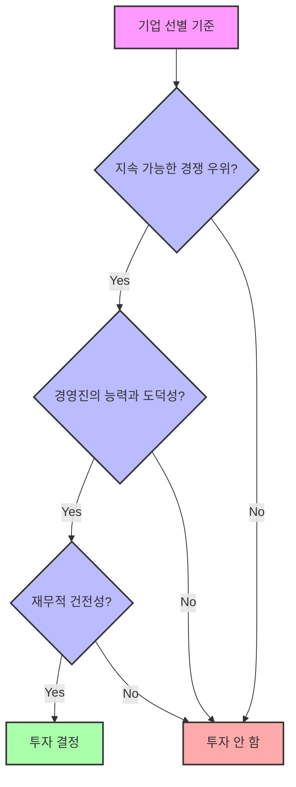
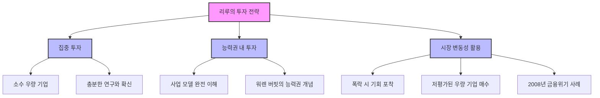
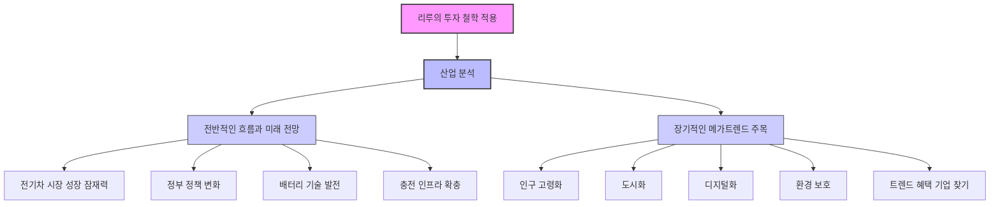
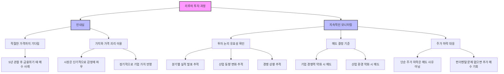
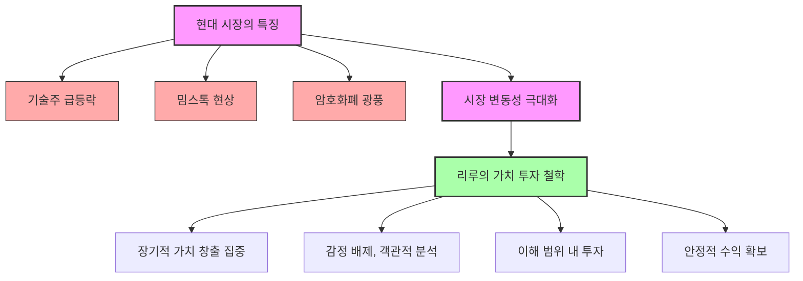

## 리루의 가치 투자 철학: 문명, 현대화, 가치 투자 그리고 중국
이 책은 워렌 버핏과 찰리 멍거가 인정한 천재 투자자 리루의 투자 철학과 전략을 담고 있어. 리루는 단순히 돈을 버는 것을 넘어, 세상을 이해하고 더 나은 미래를 만드는 수단으로 투자를 바라보는 사람이야. 이 책을 통해 우리는 가치 투자의 기본 원칙부터 중국 시장에 대한 깊은 통찰, 그리고 투자자의 자세까지 배울 수 있을 거야.

## 1. 리루는 누구인가? 워렌 버핏이 인정한 천재 투자자 

리루는 워렌 버핏과 찰리 멍거가 자신의 개인 재산을 맡길 정도로 신뢰한 유일한 중국인 투자자야.  그가 운영하는 히말라야 캐피털 매니지먼트는 180억 달러(약 24조 원) 이상의 자산을 관리하고 있고, 찰리 멍거의 9천만 달러를 400% 이상 불려준 놀라운 실력의 소유자지. 

1. **리루의 배경**:
  1. 1966년 중국 허의성 탕산시에서 태어났어. 
  2. 난징대학교에서 물리학을 공부하다가 미국으로 망명했어. 
  3. 콜롬비아 대학교에서 경제학 박사 학위를 취득하고 월 스트리트에 발을 들여놓았어. 
  4. 물리학을 전공한 그가 투자 세계에서 성공할 수 있었던 비결은 바로 과학적 사고방식과 체계적인 분석 능력을 투자에 접목시켰기 때문이야.  마치 물리학자가 현상을 관찰하고 법칙을 찾아내듯이, 그는 시장과 기업을 분석하는 독특한 관점을 가지고 있었어. 

2. **찰리 멍거와의 만남**:
  1. 리루의 투자 철학은 워렌 버핏과 찰리 멍거에게 배운 가치 투자 원칙을 자신만의 방식으로 발전시킨 거야. 
  2. 특히 찰리 멍거와의 만남을 통해 투자 스타일을 완전히 바꾸게 되었어. 
  3. 기존의 복잡한 투자 전략을 포기하고, 오직 우수한 기업의 주식만을 매수해서 장기간 보유하는 '롱홀리(Long-hold)' 전략을 채택했지. 

## 2. 리루의 핵심 투자 원칙: 가치 투자의 세 가지 기둥 

리루는 투자를 할 때 세 가지 핵심 원칙을 반드시 지켜. 이 원칙들은 마치 튼튼한 집을 짓는 기둥과 같다고 보면 돼.

1. **첫째, 기업의 본질적 가치를 철저하게 분석한다**:
  1. 단순히 주가 차트나 기술적 지표만 보는 게 아니야. 
  2. 그 회사가 실제로 어떤 사업을 하는지, 경쟁에서 이길 수 있는 독특한 강점(경쟁 우위)은 무엇인지, 미래 성장 가능성은 어떤지를 깊이 있게 연구하는 거야.  마치 탐정이 사건의 진실을 파헤치듯이 기업의 진짜 가치를 찾아내는 거지.

2. **둘째, 안전 마진을 확보한다**:
  1. 아무리 좋은 기업이라도 적정 가치보다 비싸게 사지 않아. 
  2. 충분히 할인된 가격에서만 매수해서 원금 손실의 위험을 최소화하는 거야.  이건 마치 물건을 살 때 '혹시라도 잘못될 경우를 대비해서 싸게 사는 것'과 같아. 벤저민 그레이엄으로부터 이어져 내려온 가치 투자의 기본 원리이기도 해. 

3. **셋째, 장기적 관점을 유지한다**:
  1. 리루는 단기적인 주가 변동에 흔들리지 않아. 
  2. 최소 3년에서 5년, 때로는 10년 이상 기업을 보유하면서 '복리의 마법'을 경험해.  복리란 이자에 이자가 붙는 걸 말하는데, 시간이 지날수록 눈덩이처럼 불어나는 효과를 말해. 이는 시장의 단기적인 오르내림을 피하고 기업의 실제 가치 상승에 집중할 수 있게 해주는 핵심 전략이야.

## 3. 중국 시장에 대한 깊은 이해와 글로벌 투자 

리루의 투자 철학에서 가장 인상적인 부분은 그가 중국 시장에 대한 깊은 이해를 바탕으로 글로벌 투자를 한다는 점이야. 

1. **중국 시장의 기회 포착**:
  1. 많은 서구 투자자들이 중국 시장을 단순히 위험한 신흥 시장으로만 봤을 때, 리루는 중국의 문화와 비즈니스 환경을 깊이 이해하고 있었어. 
  2. 그래서 다른 투자자들이 놓친 엄청난 기회를 포착할 수 있었지. 

2. **BYD 투자 추천 사례**:
  1. 실제로 리루는 버크셔 해서웨이(워렌 버핏의 회사)가 중국 전기차 회사 BYD에 투자하도록 워렌 버핏과 찰리 멍거에게 추천한 장본인이야. 
  2. 이 투자는 버크셔 해서웨이 역사상 가장 성공적인 투자 중 하나가 되었어. 
  3. 당시 많은 투자자들이 중국 기업에 대해 회의적이었지만, 리루는 BYD의 기술력과 성장 잠재력을 정확히 파악하고 있었던 거야. 

## 4. 기업 선별 기준: 까다로운 심사 과정 

리루는 어떤 기업에 투자할지 선별하는 기준이 매우 까다로워. 마치 최고의 선수를 뽑는 감독처럼 말이야. 

1. **지속 가능한 **경쟁 우위** 확인**: 
  1. 단순히 현재 수익이 좋은 것뿐만 아니라, 5년 후, 10년 후에도 여전히 경쟁력을 유지할 수 있는 독특한 강점(해자)이 있는지를 살펴봐. 
  2. 해자(垓子)란 성 주변에 파놓은 깊은 못처럼, 경쟁사들이 쉽게 따라 할 수 없는 기업만의 방어벽을 의미해. 
  3. 예를 들어, 코카콜라의 강력한 브랜드, 구글의 검색 알고리즘, 아마존의 물류 네트워크 등이 모두 쉽게 모방할 수 없는 해자에 해당해. 
  4. 리루는 이런 해자가 깊고 넓을수록 그 기업의 장기적인 수익성이 보장된다고 봐. 

2. **경영진의 능력과 도덕성 평가**: 
  1. 아무리 좋은 사업이라도 경영진이 능력이 없거나 주주들의 이익을 고려하지 않는다면 투자하지 않아. 
  2. 리루는 경영진과 직접 만나서 그들의 철학과 비전을 확인하는 것을 중요하게 생각해. 
  3. 경영진을 평가할 때는 세 가지 기준을 사용해. 
  - **능력**: 사업을 성공적으로 운영할 수 있는 전문성과 리더십을 의미해. 
  - **성실성**: 도덕적이고 윤리적인 경영을 하는지를 보는 거야. 
  - **주주 친화적 성향**: 경영진이 자신의 이익보다 주주들의 이익을 우선시하는지를 판단하는 기준이야. 
  4. 이를 확인하기 위해 경영진의 과거 발언과 행동, 주주 총회 발언, 언론 인터뷰, 실제 사업 결정 등을 면밀히 분석해.  특히 어려운 상황에서 어떤 선택을 했는지를 중요하게 보는데, 위기 상황에서야 비로소 경영진의 진정한 모습이 드러나기 때문이야. 

3. **재무적 건전성 분석**: 
  1. 부채 비율이 과도하지 않은지, 현금 창출 능력은 어떤지, 자본 배분 능력은 우수한지 등을 면밀히 분석해. 
  2. 이 과정에서 그의 물리학적 사고방식이 빛을 발하는데, 복잡한 재무제표를 마치 물리 법칙처럼 체계적으로 분석해내는 거지. 
  3. 특히 회계상의 이익보다 실제 현금 창출 능력, 즉 '자유 현금 흐름'을 가장 중요하게 봐.  자유 현금 흐름은 기업이 필요한 투자를 모두 마친 후에도 남는 현금을 의미하는데, 이게 꾸준히 증가하는 기업은 주주들에게 배당을 주거나 자사주를 다시 사들여 가치를 높일 수 있고, 새로운 사업에 투자할 수도 있기 때문이야. 
  4. 과도한 부채를 가진 기업은 아무리 사업이 좋아도 투자하지 않아.  부채가 많으면 이자 부담으로 수익성이 떨어지고, 경기가 나빠질 때는 파산 위험까지 있기 때문이지.  그래서 부채 비율, 이자보상배율(기업이 이자를 갚을 능력이 되는지), 유동 비율(단기 부채를 갚을 능력이 되는지) 등을 종합적으로 검토해서 재무 건전성을 평가해. 

4. **미래 성장 동력 판단**: 
  1. 과거의 성장률보다는 미래의 성장 동력을 더 중요하게 봐. 
  2. 연구 개발 투자, 신제품 출시 계획, 시장 확장 전략 등을 통해 앞으로의 성장 가능성을 평가하는 거야. 
  3. 특히 새로운 기술이나 시장 변화에 얼마나 빠르게 적응하고 있는지를 주목해. 

## 5. 포트폴리오 구성과 시장 변동성 대응 

리루의 포트폴리오를 보면 또 다른 특징을 발견할 수 있어. 마치 소수의 정예 부대를 운영하는 장군처럼 말이야.

1. 집중 투자: 
  1. 그는 100개의 주식에 분산 투자하지 않고, 자신이 확신하는 소수의 우량 기업에 집중적으로 투자해. 
  2. 보통 10개 미만의 종목에 집중적으로 투자하며, 가장 확신하는 몇 개 종목에 포트폴리오의 대부분을 투자해. 
  3. 이건 위험해 보일 수 있지만, 충분히 연구하고 확신이 선 기업에만 투자하기 때문에 오히려 리스크(위험)를 줄이는 전략이 돼. 
  4. 또한, 지역적 분산보다는 질적 분산(서로 다른 산업의 우량 기업 선택)을 더 중요하게 생각해서 한 산업의 위기가 전체 포트폴리오에 미치는 영향을 최소화해. 

2. 능력권** 내 투자**: 
  1. 특히 그는 자신이 이해할 수 있는 범위 내에서만 투자해. 
  2. 아무리 수익성이 좋아 보이는 기업이라도 그 사업 모델을 완전히 이해하지 못하면 투자하지 않아. 
  3. 이건 워렌 버핏의 '능력권(Circle of Competence)' 개념과 일맥상통하는 부분이야.  능력권이란 자신이 잘 알고 이해하는 분야 안에서만 투자하는 것을 말해.

3. **시장의 변동성 활용**: 
  1. 대부분의 투자자들이 시장이 폭락할 때 패닉(공황)에 빠지는 반면, 리루는 이를 기회로 활용해. 
  2. 우량 기업들이 시장의 공포로 인해 저평가될 때 오히려 더 적극적으로 매수(주식을 사는 것)해 나서는 거지. 
  3. 2008년 금융위기 때도 마찬가지였어.  많은 투자자들이 손실을 우려해 주식을 팔 때, 리루는 이를 절호의 기회로 여기고 우량 기업들을 대거 매수했어. 
  4. 결과적으로 이후 시장이 회복되면서 엄청난 수익을 거둘 수 있었지. 

## 6. 성공 비결: 학습, 인내심, 겸손함 

리루의 성공 비결은 단순히 투자 기법에만 있는 것이 아니야. 그의 학습에 대한 열정, 끊임없는 자기 개발, 그리고 겸손함이 더 중요한 요소라고 할 수 있어.

1. **끊임없는 학습과 자기 개발**: 
  1. 그는 매일 수많은 기업 보고서와 산업 분석 자료를 읽으며 자신의 지식을 확장해 나가. 
  2. 다양한 분야의 전문가들과 네트워킹(교류)하여 새로운 관점을 얻으려고 노력해. 
  3. 나이가 들어서도 여전히 새로운 기술과 산업 트렌드(유행)를 배우려고 노력하는데, 인공지능, 바이오기술, 신재생 에너지 등 미래 산업에 대한 이해를 높이기 위해 끊임없이 공부하고 있어. 
  4. 이러한 자세는 단순히 투자 수익을 위한 것이 아니라, 변화하는 세상에 적응하고 새로운 기회를 포착하기 위한 필수적인 요소라고 할 수 있어. 

2. **투자는 세상을 이해하는 수단**: 
  1. 리루는 투자를 단순한 돈벌이 수단으로 보지 않아. 
  2. 그에게 투자는 세상을 이해하고 더 나은 미래를 만들어 가는 수단이야. 
  3. 그래서 단순히 주가 상승만을 노리는 것이 아니라, 실제로 사회에 가치를 창출하는 기업들에 투자하려고 해. 
  4. 환경 기술, 혁신적인 의료 기술, 교육 사업 등 인류의 미래에 도움이 되는 분야의 기업들에 특히 주목해. 
  5. 이러한 투자 철학은 단순히 수익성뿐만 아니라 지속 가능한 성장을 추구하는 그의 가치관을 보여줘. 

3. **인내심의 중요성**: 
  1. 리루의 투자 방식에서 우리가 배울 수 있는 가장 중요한 교훈은 '인내심'이야. 
  2. 현대 사회에서는 모든 것이 빠르게 변하고 즉시 결과를 원하는 경우가 많지만, 진정한 부를 축적하기 위해서는 장기적인 관점과 인내심이 필요해. 
  3. 그는 자신이 투자한 기업이 일시적으로 부진한 성과를 보이더라도, 기본적인 투자 논리가 변하지 않는 한 계속 보유해. 
  4. 이러한 인내심이 결국 복리의 힘을 통해 엄청난 부를 창출하는 원동력이 되는 거야. 

4. **감정보다는 논리와 데이터**: 
  1. 그는 투자 결정을 할 때 감정보다는 논리와 데이터에 의존해. 
  2. 시장의 분위기나 다른 사람들의 의견에 휘둘리지 않고 자신만의 분석과 판단을 신뢰해. 
  3. 이건 물리학자로서의 훈련이 투자에 도움이 된 부분이기도 해. 

5. **겸손함**: 
  1. 엄청난 성공을 거두었음에도 불구하고 그는 여전히 시장을 두려워하며 항상 신중하게 접근해. 
  2. 자신이 틀릴 수 있다는 가능성을 항상 염두에 두고 투자 결정을 내리는 거지. 
  3. 이러한 겸손함은 오히려 그의 투자 성과를 더욱 안정적으로 만들어 주는 요소가 돼. 
  4. 과신하지 않고 항상 리스크(위험)를 관리하면서 투자하기 때문에 큰 손실을 피할 수 있고, 장기적으로 안정적인 수익을 창출할 수 있는 거야. 

## 7. 리루의 투자 철학을 실생활에 적용하는 방법 

리루의 투자 철학을 실제로 적용하기 위해서는 구체적인 실행 방법이 필요해. 많은 투자자들이 가치 투자의 개념은 이해하지만, 실제로 어떻게 시작해야 할지 막막해하는 경우가 많지.  리루가 실제로 사용하는 기업 분석 방법을 단계별로 살펴보면서 우리도 그의 투자 철학을 체계적으로 활용해 볼 수 있어.

1. **산업 분석**: 
  1. 리루가 가장 중요하게 생각하는 것은 '산업 분석'이야. 
  2. 개별 기업을 보기 전에 먼저 그 기업이 속한 산업의 전반적인 흐름과 미래 전망을 철저히 분석해. 
  3. 예를 들어, 전기차 산업에 투자할 때도 단순히 특정 회사의 주가만 보는 것이 아니라, 전 세계 전기차 시장의 성장 잠재력, 정부 정책의 변화, 배터리 기술의 발전 속도, 충전 인프라의 확충 계획 등을 종합적으로 검토하는 거야. 
  4. 이러한 산업 분석 과정에서 리루는 특히 장기적인 '메가트렌드'에 주목해. 
  5. 인구 고령화, 도시화, 디지털화, 환경 보호 등 앞으로 수십 년간 지속될 것으로 예상되는 거대한 변화의 흐름을 파악하고, 이러한 트렌드로부터 혜택을 받을 수 있는 산업과 기업을 찾아내는 거지.  이건 단순히 현재의 실적이 좋은 기업을 찾는 것보다 훨씬 더 중요한 과정이야.

## 8. 가치 평가와 안전 마진 확보 

기업의 가치를 평가하고 안전하게 투자하는 것도 리루에게는 매우 중요해. 마치 물건을 살 때 '이게 정말 이 가격만큼의 가치가 있을까?' 하고 꼼꼼히 따져보는 것과 같아.

1. **밸류에이션(가치 평가)**: 
  1. 밸류에이션, 즉 가치 평가 단계에서는 여러 방법을 종합적으로 활용해. 
  2. 현금 흐름 할인법(미래에 벌어들일 현금을 현재 가치로 계산하는 방법), 상대 가치 평가법(비슷한 다른 회사들과 비교하는 방법), 자산 가치 평가법(회사가 가진 자산의 가치를 평가하는 방법) 등을 모두 사용해서 기업의 '내재 가치(Intrinsic Value, 기업의 진짜 가치)'를 계산해. 
  3. 하지만 리루는 정확한 숫자보다는 대략적인 범위를 파악하는 것이 더 중요하다고 생각해.  시장은 너무 복잡하고 변화무쌍하기 때문에 정확한 가치를 계산하는 것은 불가능하다고 보는 거지. 

2. **충분한 **안전 마진 확보: 
  1. 대신 충분한 '안전 마진(Margin of Safety)'을 확보하는 것을 더 중요하게 생각해. 
  2. 내재 가치가 100이라고 계산되면, 60이나 70에 살 수 있을 때까지 기다려. 
  3. 이렇게 하면 설사 계산이 틀렸더라도 큰 손실을 피할 수 있고, 시장이 제 가치를 인정해 줄 때까지 충분한 여유를 가질 수 있어. 

## 9. 인내심과 지속적인 모니터링 

리루의 투자 과정에서 가장 인상적인 부분은 그의 '인내심'이야. 마치 사냥꾼이 먹잇감을 기다리듯이, 그는 적절한 때를 기다릴 줄 알아. 

1. **인내심**: 
  1. 좋은 기업을 찾았다고 해서 바로 투자하지 않고, 적절한 가격이 될 때까지 몇 년이고 기다릴 수 있어. 
  2. 실제로 그는 어떤 기업을 5년 동안 관찰하다가 금융위기 때 주가가 폭락하자 그때 대량 매수한 경험이 있어. 
  3. 이러한 인내심은 시장 타이밍을 맞추려는 것이 아니라, '가치'와 '가격' 사이의 괴리(차이)를 이용하는 거야. 
  4. 시장은 단기적으로 감정에 좌우되지만, 장기적으로는 기업의 실제 가치를 반영하거든. 
  5. 따라서 좋은 기업을 싼 가격에 사서 시장이 그 가치를 인정해 줄 때까지 기다리는 것이 가치 투자의 핵심이야. 

2. **지속적인 모니터링**: 
  1. 주식을 매수한 후에도 지속적인 모니터링(관찰)을 게을리하지 않아. 
  2. 분기별 실적 발표, 산업 동향 변화, 경쟁 상황 등을 계속 추적하면서 투자 논리가 여전히 유효한지 확인해. 
  3. 만약 기업의 기본적인 경쟁력이 약화되거나 산업 환경이 악화된다면, 손실을 감수하고라도 매도를 결정해. 
  4. 하지만 단순한 주가 하락은 매도 사유가 되지 않아.  오히려 기업의 펀더멘탈(기초 체력)에 문제가 없다면 주가 하락을 추가 매수의 기회로 활용해.  이건 일반 투자자들이 가장 어려워하는 부분이기도 해. 손실이 발생하면 본능적으로 팔고 싶어 하는 것이 인간의 심리거든. 

3. 심리적 편향** 극복**: 
  1. 리루는 이러한 심리적 편향(감정적인 치우침)을 극복하기 위해 체계적인 투자 프로세스(과정)를 구축했어. 
  2. 감정에 휘둘리지 않고 미리 정해진 기준에 따라 투자 결정을 내리는 거지.  이건 물리학자로서의 훈련이 큰 도움이 되었다고 그는 말해.

## 10. 세계적인 투자 대가들과의 교류 

세계적인 투자 대가들과의 교류도 리루 성공의 중요한 요소야. 마치 최고의 바둑 기사들이 서로 대국하며 실력을 키우듯이 말이야.

1. **다양한 투자자들과의 소통**: 
  1. 워렌 버핏과 찰리 멍거뿐만 아니라 세스 클라만, 조엘 그린블라트, 하워드 막스 등 다양한 투자자들과 꾸준히 소통하며 투자 아이디어를 공유해. 
  2. 이들과의 토론을 통해 자신의 투자 논리를 검증하고 새로운 관점을 얻는 거지. 

2. **동서양 투자 문화의 가교 역할**: 
  1. 특히 리루는 중국 시장에 대한 깊은 이해를 바탕으로 서구 투자자들에게 중국 투자의 기회를 제공하고, 동시에 중국 투자자들에게는 글로벌 투자의 노하우를 전수하는 역할을 하고 있어. 
  2. 이건 단순한 투자 성과를 넘어 동서양 투자 문화의 가교(다리) 역할을 하고 있다고 볼 수 있어.

## 11. 사회적 책임과 투자 교육 

리루의 투자 철학에서 놓치지 말아야 할 중요한 점은 그가 단순히 개인의 부(재산)만을 추구하지 않는다는 거야. 그는 자신의 투자 수익을 사회에 환원(돌려주는 것)하는 것을 중요하게 생각해. 

1. **사회 환원 활동**: 
  1. 교육, 의료, 환경 보호 등 다양한 분야에서 자선 활동을 펼치고 있어. 
  2. 특히 중국과 미국의 젊은 인재들을 위한 장학 사업에 많은 관심을 기울이고 있지. 

2. **사회적 책임감 반영**: 
  1. 이러한 사회적 책임감은 그의 투자 철학에도 반영돼. 
  2. 단순히 수익만 좋은 기업이 아니라, 사회에 긍정적인 영향을 미치는 기업들을 선호해. 
  3. 환경 친화적인 기업, 혁신적인 기술로 인류의 삶을 개선하는 기업, 공정한 경영을 하는 기업들에 더 많은 투자를 하려고 노력해. 

3. **투자 교육**: 
  1. 리루는 투자 교육에도 많은 시간을 투자해. 
  2. 콜롬비아 대학교에서 정기적으로 강의를 하고, 젊은 투자자들을 위한 멘토링 프로그램(선배가 후배를 지도하는 프로그램)을 운영해. 
  3. 자신이 가진 지식과 경험을 다음 세대에게 전수하는 것을 중요한 사명으로 여기고 있어. 

## 12. 현대 시장에서의 리루 투자 철학의 시사점 

리루의 투자 방식이 현재 시장 상황에서 어떤 의미를 주는지도 살펴볼 필요가 있어. 마치 폭풍우가 몰아치는 바다에서 튼튼한 배가 더 빛을 발하듯이 말이야.

1. **극심한 시장 변동성**: 
  1. 최근 들어 기술주의 급등과 급락, 밈스톡(인터넷 유행으로 주가가 급등하는 주식) 현상, 암호화폐 광풍 등 시장의 변동성(오르내림의 폭)이 극도로 커지고 있어. 

2. **가치 투자의 중요성**: 
  1. 이러한 상황에서 리루의 가치 투자 철학은 더욱 중요한 의미를 가져. 
  2. 단기적인 투기보다는 장기적인 가치 창출에 집중하는 것, 감정에 휘둘리지 않고 객관적인 분석에 기반한 투자를 하는 것, 자신이 이해하는 범위 내에서만 투자하는 것 등은 변동성이 큰 시장에서 안정적인 수익을 얻기 위한 필수 조건이야. 

3. **철저한 준비와 끝없는 인내심**: 
  1. 리루의 성공 비결을 한마디로 정리하면 '철저한 준비와 끝없는 인내심'이라고 할 수 있어. 
  2. 그는 투자를 마라톤에 비유하며, 단거리 달리기처럼 빠른 성과를 쫓지 않고 꾸준히 자신의 페이스를 유지하며 장기적인 목표를 향해 나아간다고 말해. 
  3. 이러한 자세야말로 진정한 부를 축적하는 비결이자 인생에서 성공하는 핵심 원리라고 할 수 있지. 

## 13. 리루의 책 "문명, 현대화, 가치 투자 그리고 중국" 

리루의 책 "문명, 현대화, 가치 투자 그리고 중국"은 2020년에 출판되었어.  이 책은 리루의 깊이 있는 통찰을 엿볼 수 있는 귀한 자료인데, 아쉽게도 아직 중국어로만 출판되어 있어. 

1. **책의 구성**: 
  1. 책의 절반 이상은 중국의 현대화 과정에 대한 그의 체계적인 생각에 초점을 맞추고 있어. 
  2. 나머지 부분은 중국과 미국에서 진행했던 공개 강연과 대담을 바탕으로 가치 투자에 대해 논의한 내용들이 담겨 있어. 

2. **인류 문명의 세 단계**: 
  1. 책의 전반부에서는 인류 문명의 역사를 세 가지 주요 도약 단계로 나누어 설명해. 
  - 1.0 수렵 채집 문명 (사냥하고 열매 따먹던 시절) 
  - 2.0 농업 문명 (농사짓고 정착하던 시절) 
  - 3.0 기술 문명 (지금 우리가 살고 있는 기술 발전 시대) 

## 14. 현대화와 가치 투자의 연결고리 

리루는 중국의 현대화와 가치 투자가 깊이 연결되어 있다고 봐. 마치 두 개의 중요한 퍼즐 조각이 딱 맞아떨어지는 것처럼 말이야. 

1. **중국 현대화에 대한 집착**: 
  1. 리루는 십 대 시절부터 중국의 현대화에 집착했어. 
  2. 왜 중국의 현대화 과정이 그토록 어려웠는지 이해하고 싶어 했지. 
  3. 지난 200년 동안 중국과 외국의 지식인들도 이 거대한 수수께끼를 풀려고 노력했어. 

2. **가치 투자와의 우연한 만남**: 
  1. 가치 투자는 그가 미국에 와서 우연히 워렌 버핏의 연설을 듣고 접하게 된 또 다른 흥미로운 주제였어. 
  2. 나중에 그는 중국의 현대화와 가치 투자 사이에 연결고리가 있다는 것을 발견하게 돼. 

3. **가치 투자의 본질**: 
  1. 그는 가치 투자가 단순히 주식 가격의 차이를 이용하는 것이 아니라, 우리가 투자하는 기업들이 가치를 창출하고 성장하는 과정에 함께 참여함으로써 가장 올바른 방식으로 투자하는 것이라고 결론 내렸어. 
  2. 이것이 가치 투자의 핵심이야. 

4. **복리의 힘과 **현대화: 
  1. 이러한 생각은 그를 새로운 질문으로 이끌었어. 
  - 어떻게 뛰어난 기업들이 장기간 지속 가능한 성장을 이룰 수 있을까? 
  - 성장의 이유는 무엇일까? 
  - 성장에는 한계가 있을까? 
  - 어떤 경제 환경이 이런 성장을 하는 기업들을 촉진할까? 
  2. 그는 뛰어난 기업들뿐만 아니라 전 세계 경제와 인류 사회 전체에서 지난 200년 동안 이상한 현상이 일어나고 있다는 것을 발견했어. 
  3. 바로 경제가 지속적이고 점진적인 성장 단계에 진입하기 시작했다는 거야. 
  4. 이것이 바로 '복리의 힘'인데, 가치 투자에서 가장 중요한 힘이지. 
  5. 하지만 복리 현상은 인류 역사에서 지난 200년 동안만 존재했어. 
  6. 리루는 가치 투자와 복리 개념을 연구하고 경제의 성장 단계를 알게 된 후, 이 두 주제를 분석하기 시작했어. 
  7. 그는 책에서 현대화 과정 자체가 사실은 복리 과정이라고 썼어. 
  8. 그의 정의에 따르면, 현대화는 전체 경제가 지속적인 발전과 무한한 성장 단계에 진입하기 시작하는 현상이야. 
  9. 그는 이를 '현대화의 법칙'이라고 불렀어. 
  10. 리루의 투자 스타일은 이러한 관찰과 밀접하게 관련되어 있어. 
  11. 가치 투자의 본질은 복리의 기회를 탐색하고 발견하는 것인데, 이는 현대화 현상의 산물일 뿐이야. 
  12. 이 두 현상은 같은 현대적 현상으로 볼 수 있어. 
  13. 리루는 중국의 전통 문화가 현대 시장 경제에 잘 맞고, 중국이 앞으로도 많은 투자 기회를 제공할 것이라고 믿어. 

## 15. 가치 투자의 네 가지 큰 아이디어 

리루는 그의 책에서 여러 대학에서 했던 강연 내용을 담고 있는데, 이 강연들은 가치 투자를 이해하는 네 가지 큰 아이디어로 요약될 수 있어.  마치 가치 투자의 지도를 그리는 네 개의 중요한 이정표와 같다고 보면 돼.

1. **주식을 사업의 일부로 본다 (**Stock as a Piece of Business**)**: 
  1. 벤저민 그레이엄, 워렌 버핏, 찰리 멍거, 그리고 리루는 모두 자신이 투자하는 사업의 '주인'이 되는 것을 좋아해. 
  2. 단순히 주식을 사고파는 '트레이더(단기 투자자)'가 아니라, 사업의 진짜 주인이 되는 마음가짐을 가지는 거지. 
  3. 이러한 '소유주 정신'은 투자자들이 사업에 대해 더 많이 배우도록 이끌어. 
  4. 투자자가 자신을 소유주로 볼 때, 위험 대비 보상 비율이 더 균형 잡히게 되고, 돈뿐만 아니라 시간도 투자해서 필요할 때 건설적인 비판을 제공하게 돼. 

2. 미스터 마켓** (Mr. Market)**: 
  1. '미스터 마켓' 비유는 투자와 투기의 차이를 가르쳐줘. 
  2. 미스터 마켓은 극도로 변덕스럽고 생각 없는 사람이라고 생각하면 돼. 
  3. 매일 아침 최신 주가를 소리치고, 하루 종일 계속 그렇게 해. 
  4. 미스터 마켓이 미래에 대해 낙관적일 때는 흥분한 경매인처럼 가격을 올리고, 우울할 때는 가격을 급격히 낮춰. 
  5. 책에서는 시장이 인간의 약점을 발견하는 메커니즘(장치)이라고 말해.  특히 금융 위기가 닥쳤을 때, 지식에 완전히 정직해야만 시장에서 살아남고 발전하며 성장할 수 있다고 강조해. 
  6. 미스터 마켓은 매우 비합리적인 사람이라는 것을 쉽게 알 수 있어. 
  7. 시장은 극단적인 양쪽을 오가며 계속해서 최고점과 최저점 사이를 왔다 갔다 해. 
  8. 대부분의 사람들은 이 위험한 길을 선택하고 자신을 '트레이더'라고 부르는데, 이는 빠른 부와 현금을 제공하는 것처럼 보이는 가장 분명한 길이야. 
  9. 대부분의 트레이더들은 시장의 타이밍을 맞추려고 시도하며, 자신이 다른 트레이더들보다 더 똑똑하고 통찰력이 있다고 생각해. 
  10. 일부는 운이 좋아서 단기간에 많은 돈을 벌기도 하는데, 이는 그들이 정말 시장의 신이라고 스스로 믿게 만들어. 
  11. 하지만 가치 투자는 근본적으로 이 위험한 길을 권장하지 않아. 
  12. 시장 지수(전체 주식 시장의 움직임을 나타내는 지표)는 '제로섬 게임(누군가 얻으면 누군가 잃는 게임)'으로 볼 수 있는데, 그 가치는 투자자와 투기꾼 모두의 모든 투자를 합한 것과 같아. 
  13. 만약 지수가 모든 투자자들의 성과와 같은 속도로 상승한다면, 투기꾼들의 총 성과는 0이 되어야 해. 
  14. 투기꾼들은 장기적으로 좋은 성과를 낼 수 없어.  만약 단기적으로 더 잘한다면, 이는 일종의 합법적인 '프런트 러닝(미리 정보를 이용해 이득을 취하는 행위)'이나 정보 이용, 내부자 정보의 불분명한 영역으로 볼 수 있어. 

3. 안전 마진** (**Margin of Safety**)**: 
  1. 안전 마진은 투자에서 발생할 수 있는 모든 하락 위험에 대비한 '내장된 완충 장치'를 말해. 
  2. 미스터 마켓 비유에서 보았듯이, 시장은 비합리적일 수 있고 오랫동안 비합리적인 상태를 유지할 수 있어. 
  3. 그래서 당신이 투자한 가치와 당신이 믿는 내재 가치(기업의 진짜 가치) 사이에 큰 차이가 생길 수 있지. 
  4. 시장의 위험한 파도 속에서 살아남기 위해서는 안전 마진을 확보하는 것이 권장돼. 

4. 능력권** (**Circle of Competence**)**: 
  1. 능력권은 자신의 지식과 능력의 한계를 찾는 개념이야. 
  2. 가치 투자자들은 투자가 자신의 지식과 지혜를 반영해야 한다고 믿는 경향이 있어. 
  3. 가치 투자자들에게 가장 어려운 일은 자신의 한계를 파악하고 경계를 설정하는 거야. 
  4. 이 경계는 자신이 잘 모르는 분야에 현혹되지 않도록 스스로를 훈련하기 위한 것이야. 
  5. 우리가 항상 스스로에게 물어야 할 두 가지 주요 질문은 다음과 같아. 
  - 어떤 분야, 학문, 또는 산업에서 내가 진정으로 전문가인가? 
  - 언제, 어떻게 진정한 숙달을 이루었는지 알 수 있을까? 
  6. 이 질문들은 답하기 매우 어려워. 
  7. 시장이 당신에게 불리하게 움직이고, 다른 사람들은 돈을 버는데 당신은 실패자처럼 느껴질 때, 어떻게 당신의 결정을 고수하고 올바른 선택을 했다고 확신할 수 있을까? 
  8. 리루는 능력권을 찾을 때, 반대 의견을 가진 가장 똑똑한 사람을 '악마의 변호인(Devil's Advocate, 일부러 반대 의견을 내는 사람)'으로 삼아야 한다고 생각해. 
  9. 만약 당신이 그 사람을 설득할 수 있다면, 당신은 진실과 능력에 더 가까워진 거야. 
  10. 비판을 환영하고, 당신의 아이디어를 반박할 수 있는 반대 의견을 가진 사람들로 팀을 구성해야 해. 
  11. 이 모든 노력 후에도, 당신이 모든 똑똑한 사람들을 당신의 아이디어가 더 우월하다고 설득했더라도, 여전히 '맹점(Blind Spot, 보지 못하는 부분)'이 있을 수 있어. 
  12. 세상을 더 잘 이해하고 예측하기 위해서는 논리와 지식을 완벽하게 만드는 데 많은 시간을 투자해야 해. 
  13. 리루는 투자자들이 경제학자, 사회학자, 심리학자처럼 생각하도록 권장해.  다시 말해, 넓고 깊게 생각하라는 거지. 

## 16. 리루의 투자에서 얻을 수 있는 추가적인 지혜 

```mermaid
graph TD
    A["리루의 투자 지혜"] --> B["투자자의 기질"]
    B --> B1["독립적인 사고"]
    B1 --> B1a["인기 트렌드 무시"]
    B1 --> B1b["집중 투자"]
    B1 --> B1c["과도한 소통 불필요"]
    B --> B2["합리적이고 객관적"]
    B2 --> B2a["감정에 덜 영향 받음"]
    B --> B3["인내심"]
    B3 --> B3a["수년간 현금 보유 가능"]
    B --> B4["결단력"]
    B4 --> B4a["기다리다가 기회 포착 시 과감한 투자"]
    B4 --> B4b["약세장에서 기회"]
    B --> B5["열정"]
    B5 --> B5a["학습에 대한 열정"]
    B5 --> B5b["사업 전반에 대한 열정"]

    A --> C["지적 정직성"]
    C --> C1["미래 예측의 어려움"]
    C1 --> C1a["낮은 기대치"]
    C1 --> C1b["과학자의 태도"]
    C1 --> C1c["실패와 모호함과의 건강한 관계"]

    A --> D["독서의 중요성"]
    D --> D1["역사, 사업 역사, 연간 보고서"]
    D --> D2["성공적인 예측 훈련"]

    A --> E["매도 시점"]
    E --> E1["평가 실수 시 즉시 매도"]
    E --> E2["더 나은 기회 발생 시"]
    E --> E3["가치 평가가 내재 가치에서 너무 벗어날 때"]

    A --> F["공매도 피하기"]
    F --> F1["비대칭적 위험"]
    F1 --> F1a["주가는 100%만 하락, 상승은 무한"]
    F --> F2["이자 부담 및 숏 스퀴즈"]
    F --> F3["정신적 혼란과 집중력 저하"]

    A --> G["저금리 환경"]
    G --> G1["일시적 현상"]
    G --> G2["경고 신호"]
    G --> G3["안전 마진 요구 사항 높여야 함"]

    A --> H["경영진의 중요성"]
    H --> H1["성장 초기 기업에 더 중요"]

    A --> I["사이클 예측 금지"]
    I --> I1["아무도 예측 못함"]
    I --> I2["가치 투자자 아님"]

    A --> J["초보 투자자를 위한 조언"]
    J --> J1["최고의 사람들에게 배우기"]
    J1 --> J1a["듣고, 연구하고, 읽기"]
    J --> J2["실천의 중요성"]
    J2 --> J2a["회사 선택 후 철저히 연구"]
    J2 --> J2b["100% 소유주 마인드로 분석"]

    style A fill:#f9f,stroke:#333,stroke-width:2px
    style B fill:#bbf,stroke:#333,stroke-width:2px
    style C fill:#bbf,stroke:#333,stroke-width:2px
    style D fill:#bbf,stroke:#333,stroke-width:2px
    style E fill:#bbf,stroke:#333,stroke-width:2px
    style F fill:#bbf,stroke:#333,stroke-width:2px
    style G fill:#bbf,stroke:#333,stroke-width:2px
    style H fill:#bbf,stroke:#333,stroke-width:2px
    style I fill:#bbf,stroke:#333,stroke-width:2px
    style J fill:#bbf,stroke:#333,stroke-width:2px
```

리루의 책에는 그의 투자에 대한 많은 생각들이 담겨 있어. 마치 보물 상자에서 귀한 보석을 꺼내듯이, 그의 지혜로운 조언들을 더 자세히 살펴보자. 

1. **투자자의 기질 (**Temperament**)**: 
  1. 리루는 가치 투자자들이 다섯 가지 핵심적인 특징을 가지고 있다고 말해. 
  - **독립적인 사고를 가진 외로운 사람**: 
  - 인기 있는 트렌드나 의견에 덜 신경 쓰는 사람들이 보통 더 좋은 가치 투자자가 돼. 
  - 투자자들의 능력권(자신이 잘 아는 분야)은 거의 겹치지 않기 때문에, 과도하게 소통할 필요가 없다고 리루는 믿어. 
  - 가치 투자자들은 분산 투자(여러 종목에 나누어 투자하는 것)를 신봉하지 않기 때문에, 너무 많은 사업에 투자할 필요가 없어. 
  - 새로운 유행에 대해 다른 사람들과 이야기하는 시간을 줄일수록, 투자할 몇몇 회사들을 연구하는 데 더 많은 시간을 할애할 수 있지. 
  - **합리적이고 객관적**: 
  - 감정에 덜 영향을 받는 사람들이 보통 더 좋은 가치 투자자가 돼. 
  - 수많은 책과 기사들이 초보 투자자들에게 감정 때문에 잘못된 시점에 사고팔 수 있다고 경고하고 있어. 
  - **인내심**: 
  - 버크셔 해서웨이가 완벽한 예시인데, 시장에 매력적인 거래가 능력권 안에 없다면 수년 또는 수십 년 동안 현금을 쌓아둘 의향이 있어. 
  - **결단력**: 
  - 결단력은 종종 인내심과 모순되는 특성으로 보이지만, 좋은 가치 투자자는 두 가지 자질을 모두 갖춰야 해. 
  - 필요하다면 몇 년이고 아무것도 하지 않고 기다릴 의향이 있어야 하지만, 기회가 나타나면 (보통 약세장일 때) 큰 베팅으로 달려들어야 해. 
  - **열정**: 
  - 학습에 대한 열정은 아마도 가장 중요할 거야. 
  - 투자자로서 사업의 모든 측면에 대한 열정을 갖는 것도 물론 중요해. 
  - 찰리 멍거는 종종 돈에 대한 관심과 사업 전반에 대한 열정을 자신의 성공과 장수 비결로 꼽아. 
  - 그는 좋은 투자자는 좋은 사업가여야 하고, 사업 운영에 대한 이해를 가져야 한다고 자주 말해. 
  - 이러한 관심은 '무엇이 회사를 성공하게 만드는가?', '왜 돈을 버는가?', '산업의 미래는 어떨까?', '경쟁 환경은 어떤가?'와 같은 질문들을 던지게 해. 

2. 지적 정직성** (Intellectual Honesty)**: 
  1. 지적 정직성도 리루의 가치 투자 이론의 핵심 부분이야. 
  2. 대부분의 연구는 즉각적인 결과를 내지 못해. 
  3. 투자는 미래에 대한 예측으로 볼 수 있지만, 미래는 거의 예측할 수 없어. 
  4. 결과적으로 미래를 예측하려는 시도는 성공 가능성이 너무 낮아서, 아무것도 모른다는 사실에 편안함을 느껴야 해. 
  5. 가치 투자자들에게는 낮은 기대치, 과학자의 태도, 그리고 실패와 모호함(불확실성)과의 건강한 관계가 필수적이야. 

3. **독서의 중요성**: 
  1. 리루는 가치 투자자들의 많은 시간이 독서에 할애되어야 한다고 말해. 
  2. 독서는 모든 것을 포함해야 하지만, 특히 역사, 사업 역사, 그리고 회사의 연간 보고서를 읽어야 해. 
  3. 멍거는 전기(위인전)를 좋아하는 것으로 유명하고, 버핏은 깨어있는 시간의 80%를 독서에 보낸다고 알려져 있어. 
  4. 방대한 양의 독서, 연구, 분석을 통해 과거 예측의 성공을 더 잘 이해할 수 있고, 이는 좋은 투자를 감지하는 능력을 훈련시켜서 미래에 더 교육받은 예측을 할 수 있도록 도와줘. 

4. **매도 시점**: 
  1. 이 책에서 그는 투자자로서 가장 어려운 일 중 하나인 '매도(주식을 파는 것)'에 대해서도 이야기해. 
  2. 놀랍게도 리루는 가치 투자자들이 매도해야 할 중요한 시점이 있다고 설명해. 
  3. 다음과 같은 경우에 매도해야 한다고 제안했어. 
  - **첫째, 연구 후에 회사 평가에 실수가 있었다는 것을 깨달았을 때**: 이 경우 즉시 매도해야 해. 
  - **둘째, 더 나은 기회가 생겼거나 **기회비용**(다른 것을 포기함으로써 잃는 가치)이 너무 높아졌을 때**: 
  - **셋째, 가치 평가가 내재 가치에서 너무 극단적으로 벗어났을 때**: 

5. 공매도** 피하기 (Avoid Short Selling)**: 
  1. 리루는 다른 가치 투자자들(마니쉬 파브라이, 찰리 멍거, 가이 스피어 등)처럼 공매도(주식을 빌려서 팔고 나중에 싸게 사서 갚는 투자 방식)를 피하라고 조언해. 
  2. 공매도의 세 가지 특징은 다음과 같아. 
  - **첫째, 비대칭적 위험**: 이론적으로 주식은 100%만 가치를 잃을 수 있지만, 상승률은 무한할 수 있어.  공매도를 한다면 당신이 감수하는 비대칭적 위험을 이해해야 해. 
  - **둘째, 이자 부담과 숏 스퀴즈**: 주식을 공매도할 때는 이자를 지불해야 하고, '숏 스퀴즈(주가가 급등하여 공매도 투자자들이 손실을 줄이기 위해 주식을 다시 사들이는 현상)'의 압력은 회사가 망하기 전에 투자자를 파산시킬 수 있어. 
  - **셋째, 정신적 혼란과 집중력 저하**: 공매도는 투자자에게 엄청난 압력을 가하고 정신적 능력을 완전히 차지해.  리루는 공매도가 만들어내는 혼란과 정신적 명료함의 부족이 가장 치명적인 죄라고 믿어.  투자자들은 이러한 집중력 부족으로 인한 기회비용을 종종 간과해.  리루는 자신이 공매도자였던 시절에 이러한 문제들 때문에 많은 훌륭한 투자 기회를 놓쳤다고 믿어. 

6. **저금리 환경**: 
  1. 리루는 저금리 환경이 역사적으로 드물다고 말해. 
  2. 하지만 전 세계 모든 주요 국가들이 같은 양적 완화(중앙은행이 돈을 푸는 정책)와 저금리 정책을 시행하는 것은 훨씬 더 드문 일이야. 
  3. 만약 저금리를 일종의 할인율(미래 가치를 현재 가치로 바꿀 때 사용하는 비율)로 생각한다면, 안전 마진에 대한 평가가 틀릴 수도 있어. 
  4. 저금리 환경은 보통 일시적이고, 경제가 더 나빠지는 것을 막지 못하기 때문에 경고 신호로 봐야 해. 
  5. 저금리 환경에서는 투자자들이 안전 마진 요구 사항을 낮추는 것이 아니라 더 높여야 해. 

7. **경영진의 중요성**: 
  1. 리루는 회사 경영진에 대한 생각도 중요하게 여겨. 
  2. 그는 정상적인 시기에는 성숙한 회사(오래되고 안정적인 회사)의 가치에서 경영진의 중요성이 상대적으로 덜하다고 믿어. 
  3. 하지만 중국에서는 대부분의 회사들이 아직 초기 단계에 있기 때문에, 가치 평가 과정에서 경영진을 고려하는 것이 더 중요하다고 봐. 

8. **사이클 예측 금지**: 
  1. 마지막으로 리루는 사람들이 '사이클(경기 순환)'에 대해 이야기하기 시작하면 가치 투자자가 아니라고 말해. 
  2. 스스로에게 정직한 사람이라면 아무도 사이클을 예측할 수 없어. 
  3. 사이클을 예측하는 사업에 뛰어들면, 거품의 긴 사이클 외에도 주 단위, 심지어 일 단위로 무한히 작은 사이클들이 있다는 것을 알게 될 거야. 

9. **초보 투자자를 위한 조언**: 
  1. 리루는 투자 관리를 하고 싶은 사람들에게 조언을 해달라는 질문을 받았을 때 이렇게 말했어. 
  2. "최고의 사람들에게 배우고, 듣고, 연구하고, 읽어야 한다." 
  3. 투자를 이해하는 가장 좋은 방법은 '실천'이고, 이보다 더 좋은 방법은 없어. 
  4. 가장 좋은 실천은 한 회사를 선택해서 투자할 마음으로 철저히 연구하는 거야. 
  5. 비록 실제로 돈을 투자하지 않더라도, 당신의 능력권 안에서 회사를 선택하고 그 회사의 지분 100%를 소유한다는 관점에서 회사를 철저히 연구하는 과정은 매우 가치 있어. 
  6. 이것이 초보자들에게 아주 좋은 시작점이야. 
  7. 이러한 기초부터 시작할 수 있다면, 훌륭한 증권 분석가가 되는 올바른 길을 걷게 될 거야. 

## 17. 리루의 생애와 철학: 문화대혁명부터 가치 투자 대가까지 

리루는 중국 태생의 미국인 투자자이자 기업가로, 가치 투자 분야에서 두각을 나타낸 인물이야.  워렌 버핏과 찰리 멍거가 인정한 주식 투자의 귀재로 알려져 있으며, 그의 30년 투자 원칙과 전략을 집대성한 "문명, 현대화, 그리고 가치 투자와 중국"은 가치 투자 바이블로 평가받고 있어. 

1. **초기 생애 및 학창 시절**: 
  1. 리루는 1966년 중국에서 태어났어. 
  2. 그의 어린 시절은 문화대혁명 시기였기 때문에 정치적 혼란과 사회적 격변 속에서 이루어졌어. 
  3. 어린 시절부터 학문에 대한 열정을 보였고, 특히 역사와 철학에 깊은 관심을 가졌어. 
  4. 1989년 톈안먼 사건 당시 학생 운동에 참여했고, 그로 인해 미국으로 망명하게 되었어. 
  5. 미국에 도착한 후 컬럼비아 대학교에 입학하여 경제학과 법학을 전공했고, 우수한 성적으로 졸업했어. 

2. **경력**: 
  1. 졸업 후 리루는 투자 업계에 발을 들여놓았어. 
  2. 1997년 히말라야 캐피털 매니지먼트를 설립하여 본격적인 투자 활동을 시작했어. 
  3. 그의 투자 철학은 장기적인 관점에서 기업의 내재 가치를 평가하는 가치 투자를 기반으로 하고 있어. 
  4. 특히 중국 시장에 대한 깊은 이해와 통찰력을 바탕으로 한 투자로 큰 성공을 거두었지. 

3. **리루의 투자 철학**: 
  1. 리루의 투자 철학은 단순한 수익 창출을 넘어, 기업의 본질적인 가치를 이해하고 장기적인 성장을 추구하는 데 중점을 두고 있어. 
  2. 단기적인 시장 변동에 휘둘리지 않으며, 기업의 내재 가치를 철저히 분석하는 방식을 고수해. 
  3. 기업의 재무 상태, 경영진의 역량, 산업 동향 등을 면밀히 분석한 후 투자 결정을 내리며, 이를 통해 지속 가능하고 안정적인 수익을 창출하는 것이 그의 목표야. 
  4. 그는 가치 투자의 핵심이 '인내'와 '이성적 판단'이라고 말해. 
  5. 시장은 감정적이지만, 투자자는 냉정하고 합리적인 판단을 해야 한다고 믿어. 
  6. 따라서 주가 변동에 흔들리기보다는 기업의 성장 가능성을 평가하는 것이 중요하며, 시간이 지나면서 그 가치가 자연스럽게 반영된다고 주장해. 
  7. 이러한 투자 철학은 그가 찰리 멍거의 영향을 받아 얻은 것이며, 이를 기반으로 수많은 성공적인 투자를 이끌어왔어. 
  8. 또한 그는 '위기를 기회로 활용하는 능력'을 강조해. 
  9. 시장의 혼란과 불확실성 속에서도 좋은 기업을 찾아내는 것이야말로 투자자의 역할이라고 말하며, 공포 속에서도 냉정함을 유지하는 것이 중요하다고 말해. 
  10. 그는 여러 차례 경제 위기 속에서도 신중한 접근을 통해 저평가된 기업에 투자하여 성공을 거두었고, 이를 통해 그의 투자 철학이 단순한 이론이 아니라 실전에서도 유효함을 입증했어. 

## 18. 리루의 명언과 성공/실패 사례 

리루는 그의 투자 철학을 담은 여러 명언들을 남겼어. 그리고 그의 투자 여정에는 성공 사례뿐만 아니라 실패 사례도 존재해.

1. **리루의 명언**: 
  1. "투자는 인술(仁術)이다." (투자는 사람을 이롭게 하는 기술이라는 뜻) 
  2. "시장은 감정이지만 투자자는 이성적이어야 한다." 
  3. "위기는 기회의 다른 이름이다." 
  4. "가치 투자는 기업의 본질을 이해하는 것에서 시작된다." 
  5. "성공적인 투자는 지식과 지혜의 결합이다." 
  6. "투자에서 가장 큰 위험은 무지를 무시하는 것이다." 
  7. "시장의 소음에 귀 기울이지 말고 기업의 목소리에 집중하라." 
  8. "인내는 투자자의 가장 큰 미덕이다." 
  9. "성공은 실패를 어떻게 다루느냐에 달려 있다." 
  10. "지속 가능한 성장은 윤리적인 경영에서 비롯된다." 

2. **리루의 성공 사례**: 
  1. **BYD 투자**: 중국의 전기차 및 배터리 제조사인 BYD에 초기 투자하여 큰 수익을 거두었어. 
  2. **구리 산업 투자**: 중국의 구리 산업 성장 가능성을 예측하고 관련 기업에 투자하여 성공했어. 
  3. **중국 은행 투자**: 중국의 주요 은행들에 투자하여 금융 산업 성장에 따른 수익을 실현했어. 
  4. **인터넷 기업 투자**: 중국의 주요 인터넷 기업에 초기 투자하여 디지털 경제 성장의 혜택을 누렸어. 
  5. **소비 산업 투자**: 중국의 경제 성장에 따른 소비재 산업의 성장 가능성을 예측하고 투자하여 성공했어. 

3. **리루의 실패 사례**: 
  1. **부동산 투자**: 일부 부동산 프로젝트에서 예상보다 낮은 수익을 기록했어. 
  2. **신생 기업 투자**: 몇몇 신생 기업에 대한 투자가 실패로 돌아갔는데, 이는 기업 경영진의 역량 부족으로 인한 것이었어. 
  3. **해외 시장 진출**: 일부 해외 시장 투자에서 문화적 차이와 규제 환경의 차이를 제대로 고려하지 못해 기대했던 수익을 거두지 못했어. 
  4. **기술 기업 투자**: 기술 혁신을 과대평가한 일부 투자에서 손실을 입었는데, 이는 시장의 변화 속도를 잘못 예측한 결과였어. 
  5. **경기 침체 대응**: 2008년 세계 경제 위기 시 일부 포트폴리오가 급락했으며, 이에 대한 대응이 다소 늦어 손실을 방어하지 못한 사례가 있었어. 

## 19. 주요 인물과의 관계 및 자선 활동 

리루는 혼자서 투자 활동을 한 것이 아니야. 세계적인 투자 대가들과 교류하며 자신의 철학을 발전시켰고, 사회에 기여하는 데도 많은 노력을 기울였어.

1. **주요 인물과의 관계**: 
  1. 워렌 버핏: 버핏의 가치 투자 철학을 깊이 존경하며, 그의 투자 원칙을 실천하는 인물로 알려져 있어.  리루의 히말라야 캐피털은 버핏의 버크셔 해서웨이가 BYD에 투자할 때 조언을 받은 것으로도 유명해. 
  2. 찰리 멍거: 리루의 투자 스승이자 멘토로서, 찰리 멍거는 그를 매우 높이 평가했어.  그는 여러 차례 리루를 '중국의 워렌 버핏'이라 부르며 그의 통찰력을 극찬했지. 
  3. 레이 달리오: 세계적인 헤지 펀드 매니저인 레이 달리오와 교류가 있었으며, 중국 시장에 대한 논의에서 자주 의견을 나누었어. 
  4. 루이즈 심슨: 버크셔 해서웨이의 투자 전문가로 활동했던 루이즈 심슨과 함께 여러 차례 투자 전략을 공유하며 상호 존중하는 관계를 유지했어. 
  5. 마윈: 알리바바 창업자 마윈과 중국 시장 및 디지털 경제에 대한 공통 관심사를 가지고 논의한 바 있으며, 기술 분야에서의 투자 기회를 모색하기도 했어. 

2. **리루의 자선 활동**: 
  1. 리루는 투자자로서의 성공을 개인적인 부의 축적에만 집중하지 않고, 사회적 책임을 다하는 데에도 많은 노력을 기울이고 있어. 
  2. 그는 자선 활동을 통해 교육과 빈곤 퇴치 지원, 환경 보호 등의 분야에서 긍정적인 영향을 미치고자 해. 
  3. **교육 지원**: 그의 자선 활동 중 가장 중요한 부분은 교육 지원이야.  그는 젊은 세대가 더 나은 교육을 받을 수 있도록 중국과 미국의 대학생들에게 장학금을 지원하고 있어.  그는 지속 가능한 경제 발전을 위해 직접적인 금전적 지원뿐만 아니라, 자립할 수 있는 환경을 조성하는 데에도 관심을 두고 있어. 
  4. **의료 지원**: 의료 지원 분야에서도 그는 적극적인 기여를 하고 있어.  의료 서비스에 접근하기 어려운 지역의 사람들에게 치료를 제공하는 프로젝트를 후원하고 있어. 
  5. **환경 보호**: 기후 변화 대응을 위한 친환경 기술 개발과 지속 가능한 에너지 산업을 지원하는 프로젝트에 투자하며, 환경을 고려한 투자가 장기적으로 더 큰 가치를 창출할 수 있다고 믿어. 

## 20. 리루가 꿈꾸는 미래 

리루는 투자자로서의 역할을 단순한 부의 창출을 넘어, 더 나은 세상을 만드는 데 기여하는 것으로 정의해.  그가 꿈꾸는 미래는 어떤 모습일까?

1. **가치 중심 투자 확산**: 
  1. 그는 시장의 단기적 변동에 휩쓸리지 않고 장기적인 관점에서 기업의 가치를 평가하는 가치 투자 철학이 더욱 확산되기를 바라. 
  2. 이를 위해 젊은 투자자들에게 올바른 투자 원칙을 교육하고, 지속 가능한 투자 문화를 정착시키는 데 기여하고자 해. 

2. **글로벌 경제 협력**: 
  1. 그는 글로벌 경제에서 미국과 중국의 협력이 필수적이라고 믿으며, 두 나라 간의 경제적 협력과 상호 이해를 촉진하는 데 역할을 하고 싶어 해. 
  2. 세계 경제가 안정적으로 성장하기 위해서는 서로 다른 경제 체제와 문화가 조화를 이루며 협력해야 한다고 강조해. 

3. 지속 가능한 발전: 
  1. 그는 지속 가능한 발전이 단순한 트렌드가 아니라 미래 경제의 핵심이 되어야 한다고 믿어. 
  2. 따라서 환경 보호와 사회적 책임을 고려한 투자가 증가해야 하며, 기업들이 단기적인 이익만을 추구하는 것이 아니라 장기적으로 사회에 기여하는 방향으로 나아가야 한다고 주장해. 

4. **가치 중심 투자와 사회적 책임의 결합**: 
  1. 결국 리루가 꿈꾸는 미래는 가치 중심의 투자와 사회적 책임이 결합된 세상이야. 
  2. 그는 투자가 단순한 돈벌이가 아니라 더 나은 세상을 만드는 도구가 될 수 있음을 몸소 실천하며, 앞으로도 이러한 철학을 지속적으로 펼칠 거야. 

리루는 단순한 투자자가 아니라 철학적 통찰과 장기적인 안목을 가진 리더야.  그의 생애를 통해 볼 때, 그는 단순히 돈을 버는 것에 집중하는 것이 아니라 세상을 더 나은 곳으로 만들기 위한 투자 철학을 실천해왔어.  그의 성공 사례들은 철저한 분석과 장기적인 관점으로 투자가 얼마나 중요한지를 보여줘.  반면 그의 실패 사례들은 모든 투자자가 위험을 고려하고 끊임없이 배워야 한다는 교훈을 줘.  그는 워렌 버핏과 찰리 멍거와 같은 전설적인 투자자들과 어깨를 나란히 하며 가치 투자의 정신을 계승하고 있어.  또한 교육과 자선 활동을 통해 더 많은 사람들이 금융적 자유를 얻을 수 있도록 돕고 있지.  앞으로도 그는 가치 투자자로서, 그리고 사회적 기여자로서 더욱 의미 있는 삶을 살아갈 것으로 기대돼. 

