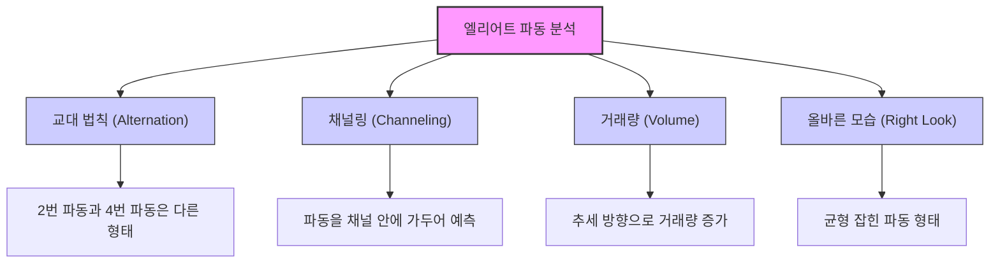

## 엘리어트 파동 이론: 시장의 숨겨진 리듬을 찾아서
이 책은 주식 시장이 무작위로 움직이는 것처럼 보이지만, 사실은 인간의 심리가 만들어내는 반복적인 패턴, 즉 '파동'에 따라 움직인다는 것을 알려주는 책이야. 이 파동의 원리를 이해하면 시장의 큰 흐름을 예측하고, 위험을 피하며, 수익을 얻는 데 도움을 받을 수 있어. 마치 자연의 모든 것이 일정한 리듬을 따르듯이, 주식 시장도 그만의 리듬을 가지고 있다는 것이 핵심 메시지라고 보면 돼.

## 1. 시장은 혼돈이 아니라 인간 심리의 반영이야 

1. **시장은 무작위가 아니야**:
  1. 많은 사람들이 주식 시장을 예측 불가능한 카지노나 무작위적인 혼돈으로 생각하지만, 엘리어트 파동 이론은 그렇지 않다고 말해. 
  2. 뉴스나 중앙은행 발표 같은 외부 요인에 단순히 반응하는 게 아니라, 그 밑에 숨겨진 질서가 있다는 거야. 
2. **인간의 사회적 본성이 시장을 움직여**:
  1. 시장의 움직임은 수많은 사람들의 집단 심리(greed and fear, 탐욕과 공포)가 모여서 만들어지는 거야. 
  2. 이 집단 심리는 특정하고 반복적인 패턴을 만들어내는데, 마치 자연의 법칙처럼 일정한 리듬을 따른다는 거지. 
  3. 이 패턴을 이해하면 시장의 흐름을 예측하고, 큰 손실을 피하며, 수익을 얻을 수 있어. 
3. 엘리어트** 파동 이론의 탄생**:
  1. 1930년대에 <mark>랠프 넬슨 엘리어트</mark>라는 회계사가 건강 문제로 은퇴한 후, 75년치 주식 시장 데이터를 손으로 분석하면서 이 패턴을 발견했어. 
  2. 그는 시장이 무작위가 아니라, <mark>인간의 사회적 본성</mark>에 따라 움직이는 <mark>반복적인 패턴</mark>을 가지고 있다는 것을 깨달았지. 
  3. 이후 프로스트와 프렉터가 엘리어트의 이론을 확장하여 책으로 펴냈어. 
4. **예측보다는 '맥락'이 중요해**:
  1. 엘리어트 파동 이론은 애플 주식이 다음 주 화요일에 얼마가 될지 같은 정확한 가격을 예측하는 <mark>수정 구슬</mark>이 아니야. 
  2. 대신, 시장이 지금 어떤 <mark>단계</mark>에 있는지, 즉 <mark>전체적인 그림</mark>에서 어디쯤 와 있는지를 알려주는 <mark>지도</mark>와 같아. 
  3. 이 <mark>맥락</mark>을 알면 시장의 작은 움직임에 일희일비하지 않고, 큰 흐름 속에서 현명하게 대응할 수 있게 돼. 

## 2. 시장의 기본 리듬: 5단계 상승과 3단계 하락 

1. **시장의 심장 박동: 5-3 패턴**:
  1. 시장의 모든 움직임은 마치 심장이 뛰는 것처럼 <mark>5단계 상승</mark>(충격 파동)과 <mark>3단계 하락</mark>(조정 파동)이라는 기본 리듬을 가지고 있어. 
  2. 이것이 엘리어트 파동 이론의 가장 기본적인 원리라고 보면 돼. 
2. **5단계 상승 (충격 파동, **Impulse Wave**)**:
  1. 이것은 시장이 <mark>주된 방향</mark>으로 나아가는 움직임이야. 마치 두 걸음 앞으로 갔다가 한 걸음 뒤로 물러서는 것처럼, <mark>세 걸음 전진</mark>하고 <mark>두 걸음 후퇴</mark>하는 패턴이지. 
  2. **1번 파동 (Wave 1)**: 새로운 추세의 시작을 알리는 첫 번째 상승이야. 소수의 똑똑한 투자자들이 바닥을 감지하고 매수하기 시작하는 단계지. 
  3. **2번 파동 (Wave 2)**: 1번 파동에서 이익을 본 사람들이 차익 실현을 하거나, 여전히 시장을 비관적으로 보는 사람들이 매도하면서 일시적으로 하락하는 조정 파동이야. 하지만 <mark>1번 파동의 시작점 아래로 내려가지 않는</mark> 것이 중요해. 
  4. **3번 파동 (Wave 3)**: 가장 강력하고 긴 상승 파동이야. 더 많은 사람들이 새로운 추세를 인식하고 시장에 뛰어들면서 대규모 상승이 나타나지. 
  5. **4번 파동 (Wave 4)**: 3번 파동의 상승에 대한 또 다른 조정 파동이야. 보통 2번 파동보다 완만하고 옆으로 기는 듯한 움직임을 보여. <mark>1번 파동의 고점과 겹치지 않는</mark> 것이 중요해. 
  6. **5번 파동 (Wave 5)**: 마지막 상승 파동이야. 뒤늦게 시장에 뛰어드는 사람들이 많아지면서 나타나지만, 3번 파동만큼 강력하지는 않아. 
3. **3단계 하락 (조정 파동, **Corrective Wave**)**:
  1. 5단계 상승이 끝나면, 시장은 그동안의 과열을 식히기 위해 <mark>3단계 하락</mark>으로 전환돼. 
  2. 이때는 숫자가 아닌 <mark>알파벳 A, B, C</mark>로 파동을 표시해. 
  3. **A 파동 (Wave A)**: 5번 파동 이후 나타나는 첫 번째 하락 파동이야. 
  4. **B 파동 (Wave B)**: A 파동에 대한 일시적인 반등이야. 많은 사람들이 조정이 끝났다고 착각하게 만들어서 <mark>매수 함정</mark>(bull trap)이 되기도 해. 
  5. **C 파동 (Wave C)**: 조정의 마지막 하락 파동이야. A 파동보다 더 강력하게 떨어지는 경우가 많아. 

## 3. 시장은 프랙탈 구조를 가지고 있어: 파동 속의 파동 

1. **러시아 인형처럼, 파동 속에 파동이 있어**:
  1. 엘리어트 파동 이론의 가장 신기한 부분은 시장이 프랙탈 구조를 가지고 있다는 거야. 
  2. 마치 러시아 인형처럼, 큰 파동 안에 작은 파동들이 들어있고, 그 작은 파동들 안에는 또 더 작은 파동들이 똑같은 형태로 반복되는 거지. 
  3. 예를 들어, 5단계 상승 파동 하나가 더 큰 시간 단위에서는 그저 <mark>하나의 1번 파동</mark>이 될 수 있어. 
  4. 그리고 그 1번 파동을 확대해보면, 그 안에도 또 다른 5단계 상승 파동이 숨어있는 식이야. 
2. **모든 시간 단위에서 동일한 패턴**:
  1. 이 말은 50년짜리 장기 차트든, 5분짜리 단기 차트든, 시장의 움직임은 항상 <mark>5단계 상승과 3단계 하락</mark>이라는 기본 패턴을 따른다는 거야. 
  2. 시장의 <mark>규모나 기간</mark>은 달라도, <mark>형태</mark>는 항상 같다는 것이 핵심이야. 
  3. 이러한 파동의 크기를 구분하기 위해 <mark>그랜드 슈퍼사이클</mark>부터 <mark>서브미뉴에트</mark>까지 다양한 용어를 사용해. 
3. **자연의 법칙과 연결돼**:
  1. 프랙탈은 자연에서 흔히 볼 수 있는 현상이야. 해안선의 들쭉날쭉한 모양, 나뭇가지의 갈라짐, 구름의 형태 등에서 찾아볼 수 있지. 
  2. 엘리어트는 인간의 사회적 활동도 자연의 일부이기 때문에, 주식 시장도 이러한 자연의 <mark>성장과 쇠퇴의 법칙</mark>을 따른다고 본 거야. 

## 4. 엘리어트 파동의 세 가지 철칙: 절대 어기면 안 되는 규칙 

1. **파동 카운팅의 나침반**:
  1. 엘리어트 파동 이론에는 <mark>절대 어겨서는 안 되는 세 가지 철칙</mark>이 있어. 
  2. 만약 네가 파동을 세다가 이 규칙 중 하나라도 어기면, 네 카운팅은 <mark>틀린 것</mark>이고 다시 시작해야 해. 
2. **철칙 1: 2번 파동은 1번 파동의 시작점을 넘을 수 없어**:
  1. 1번 파동이 시작된 지점 아래로 2번 파동이 내려가면 안 돼. 
  2. 만약 2번 파동이 1번 파동의 시작점을 깨고 내려간다면, 그것은 새로운 상승 추세가 아니라 <mark>가짜 상승</mark>이었거나 여전히 하락 추세가 이어지고 있다는 뜻이야. 
  3. 마치 계단을 한 칸 올라갔다가 그보다 더 아래로 떨어지면, 사실은 올라간 게 아니잖아? 
3. **철칙 2: 3번 파동은 세 개의 **상승 파동**(1, 3, 5번) 중에서 가장 짧을 수 없어**:
  1. 3번 파동은 보통 가장 길고 강력한 파동이지만, 최소한 1번이나 5번 파동보다 짧아서는 안 돼. 
  2. 3번 파동은 대중이 시장에 뛰어드는 <mark>가장 활발한 시기</mark>이기 때문에, 힘이 약할 수 없다는 논리야. 
  3. 만약 3번 파동이 가장 짧다면, 네 카운팅은 잘못된 거야. 
4. **철칙 3: 4번 파동은 1번 파동의 가격 범위 안으로 들어갈 수 없어 (겹치면 안 돼)**:
  1. 4번 파동이 조정될 때, 1번 파동이 만들어낸 <mark>고점</mark> 아래로 내려가면 안 돼. 
  2. 1번 파동의 고점은 새로운 <mark>지지선</mark>이 되어야 한다는 뜻이지. 
  3. 만약 4번 파동이 1번 파동의 영역과 겹친다면, 그것은 강력한 상승 추세가 아니거나 다른 형태의 파동일 가능성이 높아. 

## 5. 파동의 변형: 연장, 미달, 그리고 다이아고날 

1. 연장** (Extension): 파동이 길어지는 현상**:
  1. 가끔 1, 3, 5번 파동 중 하나가 <mark>비정상적으로 길어지는</mark> 경우가 있어. 마치 달리기를 하다가 갑자기 속도가 붙어서 더 멀리 가는 것처럼 말이야. 
  2. 이때는 그 파동 안에 또 다른 5개의 작은 파동이 나타나서, 전체적으로 9개의 파동처럼 보이기도 해. 
  3. 가장 흔하게 연장되는 파동은 <mark>3번 파동</mark>이야. 대중의 참여가 폭발적으로 늘어나면서 파동이 길어지는 거지. 
  4. 연장은 충격 파동(1, 3, 5번)에서만 가능하고, 조정 파동(2, 4번)에서는 일어나지 않아. 
2. **미달 (**Truncation** 또는 Failure): 5번 파동이 목표에 미치지 못하는 현상**:
  1. 5번 파동은 보통 3번 파동의 고점을 넘어서 새로운 고점을 만들어야 해. 하지만 가끔 <mark>힘이 부족해서</mark> 3번 파동의 고점을 넘지 못하고 끝나는 경우가 있어. 
  2. 마치 결승선 직전에 힘이 빠져서 목표에 도달하지 못하는 것과 같지. 
  3. 이것은 시장의 <mark>근본적인 약세</mark>를 나타내며, 곧 강력한 하락이 올 수 있다는 신호야. 
  4. 예를 들어, 1962년 쿠바 미사일 위기 때처럼, 엄청난 공포가 시장의 상승 에너지를 꺾어버린 경우가 있었어. 
3. **다이아고날 (**Diagonal**): **쐐기형** 파동**:
  1. 다이아고날은 <mark>쐐기 모양</mark>으로 수렴하거나 확산하는 파동이야. 
  2. 이 파동에서는 <mark>4번 파동이 1번 파동의 영역과 겹치는</mark> (오버랩되는) 현상이 나타나는데, 이는 일반적인 충격 파동의 철칙을 어기는 예외적인 경우야. 
  3. 엔딩 다이아고날** (Ending Diagonal)**:
  1. 주로 <mark>5번 파동</mark>이나 <mark>C 파동</mark>의 끝에서 나타나. 
  2. 이것은 시장이 <mark>극도로 지쳐서</mark> 마지막 힘을 짜내고 있다는 신호이며, 곧 <mark>급격한 반전</mark>이 올 것을 예고해. 
  3. 내부 파동이 3-3-3-3-3 형태로 나타나서, 힘없이 비틀거리는 듯한 움직임을 보여. 
  4. 가장 위험한 것은 <mark>스로오버(</mark>throwover<mark>)</mark>라는 현상이야. 쐐기형의 상단 추세선을 잠깐 돌파했다가 바로 무너져 내리는 <mark>가짜 상승</mark>(bull trap)으로, 많은 투자자들이 속기 쉬워. 
  4. 리딩 다이아고날** (Leading Diagonal)**:
  1. 주로 <mark>1번 파동</mark>이나 <mark>A 파동</mark>의 시작에서 나타나. 
  2. 시장이 새로운 추세를 시작할 때 <mark>힘겹게</mark> 움직이는 모습을 보여주는 거야. 

## 6. 조정 파동의 종류: 시장의 숨 고르기 

1. 조정** 파동은 예측하기 어려워**:
  1. 조정 파동은 시장이 주된 추세와 <mark>반대 방향</mark>으로 움직이는 구간이야. 마치 달리다가 숨을 고르는 것과 같지. 
  2. 이 구간은 <mark>혼란스럽고</mark> 예측하기 어려워서, 많은 투자자들이 돈을 잃는 경우가 많아. 
  3. 가장 중요한 규칙은 <mark>조정 파동은 절대 5개의 파동으로 이루어지지 않는다</mark>는 거야. 만약 5개의 파동으로 하락한다면, 그것은 조정이 아니라 새로운 하락 추세의 시작일 가능성이 높아. 
2. 지그재그** (**Zigzag**): 날카로운 하락**:
  1. 지그재그는 <mark>번개</mark>처럼 날카롭고 빠르게 떨어지는 조정 파동이야. 
  2. 내부 구조는 <mark>5-3-5</mark>로 이루어져 있어. A 파동이 5개, B 파동이 3개, C 파동이 다시 5개로 구성되지. 
  3. 이것은 가격을 <mark>급격하게 떨어뜨리는</mark> 역할을 해. 
3. 플랫** (**Flat**): 지루한 **횡보:
  1. 플랫은 시장이 <mark>옆으로 기면서</mark> 시간을 끄는 조정 파동이야. 마치 지루하게 그림이 마르기를 기다리는 것과 같지. 
  2. 내부 구조는 <mark>3-3-5</mark>로 이루어져 있어. A 파동이 3개, B 파동이 3개, C 파동이 5개로 구성되지. 
  3. 확장** **플랫** (Expanded Flat)**:
  1. 가장 위험한 조정 패턴 중 하나야. 
  2. B 파동이 A 파동의 시작점보다 <mark>더 높이 올라가서 새로운 고점</mark>을 만들어. 
  3. 많은 사람들이 조정이 끝났다고 착각하고 매수하지만, 곧바로 C 파동이 <mark>급락</mark>하면서 A 파동의 저점 아래로 떨어져. 
  4. 이것은 <mark>강력한 매수 함정</mark>(bull trap)으로, 투자자들에게 큰 손실을 안겨줄 수 있어. 
4. 삼각형** (**Triangle**): 힘을 모으는 구간**:
  1. 삼각형은 시장의 <mark>변동성이 줄어들면서</mark> 가격이 점점 좁은 범위로 모이는 패턴이야. 마치 용수철이 점점 더 팽팽하게 감기는 것과 같지. 
  2. 내부 구조는 <mark>3-3-3-3-3</mark>으로 이루어져 있어. A, B, C, D, E 다섯 개의 파동이 모두 3개씩의 작은 파동으로 구성되지. 
  3. 삼각형이 끝나면 시장은 <mark>강력하게 분출</mark>(thrust)하면서 원래 추세 방향으로 움직여. 
  4. 삼각형은 주로 <mark>4번 파동</mark>이나 <mark>B 파동</mark>에서 나타나며, 추세의 <mark>마지막 단계</mark>를 알리는 신호가 돼. 

## 7. 피보나치 수열: 시장의 수학적 비밀 

1. **자연의 황금 비율**:
  1. 엘리어트 파동 이론의 <mark>수학적 기반</mark>은 피보나치 수열이야. 
  2. 피보나치 수열은 0과 1로 시작해서 앞의 두 숫자를 더해 다음 숫자를 만드는 거야 (0, 1, 1, 2, 3, 5, 8, 13, 21, 34, 55, 89, 144...). 
  3. 이 수열의 숫자들은 엘리어트 파동의 <mark>파동 수</mark>와 일치하는 경우가 많아 (예: 5단계 상승, 3단계 하락, 총 8개 파동, 다음 단계 34개, 144개 등). 
  4. 이 수열에서 파생되는 <mark>황금 비율(</mark>1.618<mark>)</mark>은 은하계의 나선형, 조개껍데기, 해바라기 씨 배열, 인체 비율 등 <mark>자연의 모든 곳</mark>에서 찾아볼 수 있어. 
2. **시장의 움직임도 황금 비율을 따라**:
  1. 엘리어트는 인간의 사회적 활동과 시장의 움직임도 자연의 성장과 형태를 따르기 때문에, 이 황금 비율을 따른다고 주장해. 
  2. 이 비율을 이용하면 파동의 <mark>구체적인 가격 목표</mark>를 예측할 수 있어. 
  3. 예를 들어, 3번 파동은 1번 파동 길이의 <mark>1.618배</mark>가 되는 경우가 많아. 
  4. 이러한 비율은 엘리어트가 이론을 발견했던 1900년대 초반에는 널리 알려지지 않았기 때문에, <mark>자연적인 현상</mark>으로 보는 시각이 많아. 

## 8. 엘리어트 파동 분석의 실용적인 가이드라인 

1. 교대 법칙** (Alternation): 파동은 반복되지 않아**:
  1. 이것은 <mark>2번 파동</mark>과 <mark>4번 파동</mark>이라는 두 개의 조정 파동에 적용되는 규칙이야. 
  2. 만약 2번 파동이 <mark>날카롭고 짧은 </mark>지그재그였다면, 4번 파동은 <mark>복잡하고 긴 횡보형 플랫이나 </mark>삼각형일 가능성이 높아. 
  3. 반대로 2번 파동이 <mark>복잡한 </mark>횡보였다면, 4번 파동은 <mark>짧고 날카로운 </mark>조정일 가능성이 크지. 
  4. 이 법칙은 투자자의 심리를 관리하고, 다음 조정이 어떻게 나타날지 미리 예상하는 데 큰 도움을 줘. 
2. 채널링** (**Channeling**): 파동을 통로에 가두기**:
  1. 1번 파동과 2번 파동이 완성되면, 1번 파동의 시작점과 2번 파동의 끝점을 연결하는 추세선을 그릴 수 있어. 
  2. 그리고 1번 파동의 고점에서 이 추세선과 <mark>평행한 선</mark>을 그으면, 마치 <mark>통로</mark>처럼 파동이 움직이는 <mark>채널</mark>이 만들어져. 
  3. 이 채널은 3, 4, 5번 파동이 어디까지 움직일지 예측하는 데 유용하며, 특히 4번 파동이 채널의 하단선 근처에서 끝나는 경우가 많아. 
3. **거래량 (Volume): 시장의 연료**:
  1. 거래량은 시장 움직임의 <mark>힘</mark>을 나타내. 
  2. 일반적으로 상승 파동<mark>(1, 3, 5번), </mark>조정 파동<mark>(2, 4번)에서는 줄어들어. </mark>
  3. 특히 <mark>3번 파동</mark>에서는 대중의 참여가 많기 때문에 <mark>거래량이 폭발적</mark>으로 증가하는 것이 일반적이야. 
  4. 삼각형 패턴에서는 가격이 좁아지면서 <mark>거래량이 점차 줄어드는</mark> 것이 특징이야. 
4. **올바른 모습 (Right Look): 직관적인 균형**:
  1. 이것은 파동 카운팅이 <mark>기술적인 규칙</mark>뿐만 아니라 <mark>시각적인 균형</mark>도 갖춰야 한다는 의미야. 
  2. 아무리 규칙에 맞게 파동을 세웠더라도, 파동의 <mark>비율이나 모양</mark>이 어색하고 부자연스럽다면, 다시 한번 검토해봐야 해. 
  3. 마치 자연의 황금 비율처럼, 시장의 파동도 <mark>아름답고 균형 잡힌 모습</mark>을 보여야 한다는 거지. 
  4. 너무 작은 파동에만 집중하다가 <mark>큰 그림</mark>을 놓치지 않도록, 항상 한 발짝 물러서서 전체적인 모습을 확인하는 것이 중요해. 

## 9. 엘리어트 파동 이론의 확장된 의미: 삶의 모든 영역에 적용될 수 있을까? 
1. **시장을 넘어선 파동**:
  1. 엘리어트 파동 이론은 주식 시장뿐만 아니라 <mark>인간의 모든 집단 활동</mark>에서 나타날 수 있다고 해. 
  2. 만약 주식 시장이 인간의 집단 심리를 반영하는 가장 민감한 지표라면, <mark>역사, 패션, 정치적 이념</mark> 등도 같은 파동 패턴을 따를 수 있다는 거지. 
  3. 우리가 살고 있는 세상의 모든 현상이 <mark>5단계 상승과 3단계 하락</mark>이라는 우주의 리듬을 따르고 있는 것은 아닐까? 
  4. 이것은 시장을 넘어 <mark>세상을 이해하는 새로운 관점</mark>을 제공해 줄 수 있어. 

