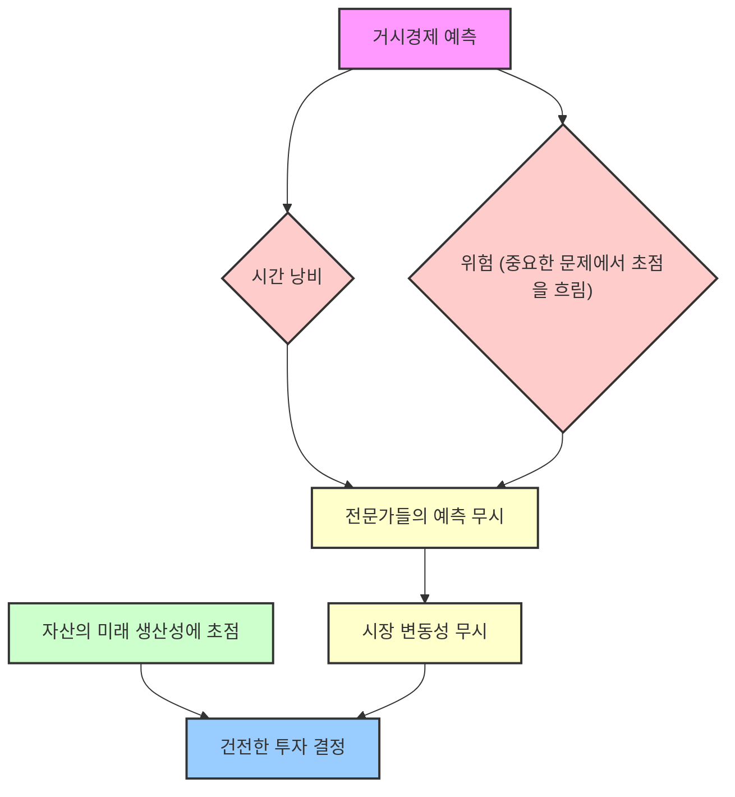

## 워런 버핏 바이블: 투자의 지혜와 삶의 원칙
이 책은 워런 버핏이 주주들에게 보낸 편지들을 모아 그의 투자 철학과 경영 원칙을 주제별로 정리한 책이야. 버핏의 투자 기법보다는 그가 어떤 방식으로 기업을 경영하고 주주들과 소통하며, 어떤 가치관을 가지고 살아가는지에 대한 깊이 있는 통찰을 얻을 수 있을 거야. 특히, 돈을 버는 것뿐만 아니라 돈을 어떻게 관리하고 배분해야 하는지에 대한 버핏의 지혜를 배울 수 있어.

## 1. 주식 투자: 유효 기간이 지난 치즈와 뉴턴의 제4 운동 법칙 

1. **위험을 싫어하는 버핏의 투자 원칙** 
  - 버핏과 찰리 멍거는 적정한 보상을 받을 수 없다면, 조금이라도 위험이 증가하는 것을 몹시 싫어한다.
  - 수익을 위해 투자 기준을 완화하는 행위는 마치 유효 기간이 지난 치즈를 먹는 것과 같다고 비유한다.
2. **주식은 회사의 일부를 소유하는 것** 
  - 버핏은 주식을 단순히 사고파는 대상이 아니라, 회사의 일부를 소유하는 것으로 본다.
  - 그들이 보유한 4대 기업(아메리칸 익스프레스, 코카콜라, 질레트, 웰스 파고)의 이익 중 버크셔의 몫은 해마다 증가하여 매입 원가의 약 31.3%에 이른다. 
  - 현금 배당도 계속 증가하여 2004년까지 받은 총액이 매입 원가의 약 11.3%에 달한다. 
  - 이러한 실적은 극적인 수준은 아니지만, 대체로 만족스러운 정도라고 평가한다. 
3. 주가** 흐름과 사업 실적의 괴리** 
  - PER(주가수익비율)이 높아진 탓에 주가 상승률이 이익 성장률보다 다소 높게 나타나기도 한다.
  - 그러나 사업 실적과 주가 흐름은 자주 따로 놀았고, 간혹 괴리가 심해지기도 했다.
  - 특히 거품이 크게 발생했을 때는 주가 상승률이 사업 실적을 훨씬 능가했다.
4. **백미러와 전면 유리 비유** 
  - 버핏은 과거의 시장을 돌아보면 항상 쉬워 보이지만, 미래를 예측하는 것은 항상 뿌옇다고 말한다. 마치 잘 보이는 백미러와 뿌연 전면 유리에 비유한다.
  - 그는 거품이 발생했을 때 대량 보유 종목을 팔지 않고 수수방관한 자신의 행태를 비난받아 마땅하다고 인정한다. 
  - 당시 보유 종목이 과대평가되었다고 말했지만, 그 수준을 과소평가했고, 행동해야 할 때 말만 앞세웠다고 후회한다. 
5. **합리적인 수익률을 기대할 때만 투자** 
  - 버핏과 찰리는 현재 주식을 사거나 대기업을 추가로 인수하고 싶어 한다.
  - 하지만 합리적인 수익률을 기대할 수 있는 가격일 때만 그렇게 할 것이라고 강조한다.
6. **뉴턴의 제4 운동 법칙: 운동량이 증가할수록 수익은 감소한다** 
  - 회사가 파산하여 채권자들이 손실을 떠안는 일부 사례를 제외하면, 전체 투자자가 벌어들일 수 있는 최대 이익은 전체 기업이 벌어들이는 이익과 같다. 
  - 한 투자자가 비싸게 팔면 다른 투자자는 비싸게 사야 하므로, 투자자 전체로 보면 기업이 번 돈 이상을 기업으로부터 빼내는 마법 같은 방법은 없다. 
  - 실제로 마찰 비용(수수료, 세금 등) 때문에 투자자들이 버는 돈은 기업이 버는 금액에 미치지 못한다. 
  - 이러한 마찰 비용이 증가하면서 현재 투자자들의 수익은 과거 투자자들보다 훨씬 감소하고 있다. 
  - 아이작 뉴턴 경은 남의 회사 거품 사건에서 막대한 손실을 보고 나서 "천체의 움직임은 계산할 수 있지만, 사람들의 광기는 계산할 수가 없더군요"라고 말했다. 
  - 버핏은 뉴턴이 이 손실로 충격을 받지 않았다면, "투자자 전체를 보면 운동량이 증가할수록 수익은 감소한다"는 네 번째 운동 법칙을 발견했을지도 모른다고 비유한다. 

## 2. 마찰 비용의 급증과 조력자들의 역할 

1. **가상의 '**고트락스 가문**' 비유** 
  - 마찰 비용이 급증한 과정을 이해하기 위해, 한 가문(고트락스)이 모든 미국 기업을 소유한다고 가정해 보자.
  - 배당에 대한 세금을 제외하면, 이 가문의 재산은 전체 기업이 벌어들인 이익만큼 대를 이어 계속 늘어난다.
2. **브로커 조력자들의 등장** 
  - 입신양명을 원하는 브로커 조력자들이 가문 사람들에게 개별적으로 접근하여, 어떤 종목을 사고팔면 친척보다 더 부자가 될 수 있다고 설득한다.
  - 이들은 수수료를 받고 거래를 도와주는데, 가문은 여전히 모든 미국 기업을 보유하고 있으므로 거래는 가문 사람들 사이에서 주인이 바뀔 뿐이다.
  - 따라서 가문이 벌어들이는 재산은 미국 기업이 벌어들이는 이익에서 수수료만큼 감소한다.
  - 거래량이 많아질수록 가문의 몫은 줄어들고, 조력자들이 받아가는 몫은 늘어난다. 브로커들은 이 사실을 잘 알고 있으므로, 거래를 활발하게 부추긴다.
3. **펀드 매니저, 재무 설계사, 기관 컨설턴트의 등장** 
  - 얼마 후 가문 사람들 중 일부는 다른 친척을 이기기 위해 펀드 매니저, 재무 설계사, 기관 컨설턴트 같은 다른 조력자들을 찾는다.
  - 이들은 기존 브로커들을 통해 매매를 실행하며, 심지어 거래량을 늘리기까지 한다.
  - 이제는 파이에서 더 큰 몫이 조력자들에게 돌아가고, 가문 사람들은 더욱 실망한다.
  - 이러한 조력자들은 결국 '허풍쟁이 조력자들'이라고 버핏은 말한다.
4. **이익 분배 방식의 문제점** 
  - 조력자들이 똑똑하거나 운이 좋으면 막대한 성과급을 받지만, 멍청하거나 운이 나쁘면 가문 사람들은 높은 고정 보수에 더해 손실까지 모두 떠안는다.
  - 결국, 동전의 앞면이 나오면 조력자들이 막대한 보수를 받고, 동전의 뒷면이 나오면 고트락스 가문이 손실을 보는 계약이 증가하는 셈이다.
  - 오늘날 온갖 마찰 비용(수수료, 보수 등)은 미국 기업 이익의 20%를 훌쩍 넘어간다.
  - 다시 말해, 조력자들에게 지급하는 비용 때문에 미국 주식 투자자들의 이익이 20%나 감소한다.

## 3. 월터 슐러스 이야기: 효율적 시장 가설에 대한 반증 

1. **월터 슐러스의 성공적인 투자 조합 운영** 
  - 워런 버핏의 오랜 친구인 월터 슐러스는 1956년부터 2002년까지 투자 조합을 대단히 성공적으로 운영했다.
  - 그는 투자자들에게 수익을 내주지 못하면 단 한 푼도 받지 않았다.
2. **월터의 단순한 투자 기법** 
  - 월터는 MBA 학위도, 대학도 나오지 않았다.
  - 그는 내부 정보는 물론 외부 정보조차 거의 사용하지 않았고, 주로 벤저민 그레이엄 밑에서 일하면서 배운 단순한 통계 기법으로 종목을 골랐다.
  - 그는 실제적 위험(영구적 원금 손실)이 없는 전략을 사용하면서 47년 동안 S&P 500을 훨씬 뛰어넘는 실적을 올렸다.
  - 그의 아들 에드윈은 투자 기법을 묻는 질문에 "싼 주식을 사려고 노력합니다"라고 간단히 대답했다. 
3. **효율적 시장 가설과 학계의 반응** 
  - 당시 대부분 주요 경영대학원에서 가르치던 투자론의 핵심은 '효율적 시장 가설'이었다.
  - 이 가설은 주가가 언제든 명백하게 잘못 형성되어 있는 일이 없으므로, 공개된 정보만을 이용해서는 시장 평균보다 높은 실적을 얻을 수 없다고 주장한다.
  - 월터의 실적은 이 가설에 대한 강력한 반증이 되었지만, 학계는 마음을 여는 대신 눈을 감았다.
  - 대학교수들은 효율적 시장 가설이 성서만큼이나 확실한 것처럼 계속 가르쳤고, 수많은 학생들이 주식 가치 평가가 소용없다고 배운 다음 사회에 배출되었다.
4. **월터의 성공 비결** 
  - 월터는 젊은이들이 학교에서 잘못 배운 덕분에 시장 실적을 뛰어넘기가 한결 쉬웠다고 버핏은 말한다.
  - 마치 모든 학교에서 지구가 평평하다고 가르친다면, 해운업자는 사업이 한결 수월해질 것이라는 비유를 든다.
  - 월터가 대학을 나오지 않은 것이 그의 투자 조합 고객들에게는 천만다행이었다고 버핏은 결론짓는다.

## 4. 위대한 기업, 좋은 기업, 끔찍한 기업: 해자와 경영자의 중요성 

1. **버핏이 찾는 기업의 특징** 
  - 버핏과 찰리가 찾는 기업은 다음과 같은 특징을 가진다.
  - 사업을 이해할 수 있는 기업
  - 장기 경제성이 좋은 기업
  - 경영진이 유능하고 믿을 수 있는 기업
  - 인수 가격이 합리적인 기업
  - 이들은 회사를 통째로 인수하고 싶어 하지만, 경영권을 인수할 수 없을 때는 주식 시장에서 위대한 기업의 지분을 소량 사들이는 것으로도 만족한다.
  - 모조 다이아몬드를 통째로 소유하는 것보다 최상급 다이아몬드의 일부를 소유하는 편이 낫다고 비유한다. 
2. **위대한 기업의 조건: **항구적 해자 
  - 진정으로 위대한 기업이 되려면 탁월한 수익률을 지켜주는 '항구적 해자'를 보유해야 한다.
  - 해자(moat)는 마치 성을 둘러싼 해자처럼, 경쟁자들이 쉽게 침범할 수 없는 강력한 진입 장벽을 의미한다.
  - 어떤 기업이 높은 수익을 내면 자본주의 역학에 따라 경쟁자들이 끊임없이 공격하기 때문이다.
  - 따라서 낮은 생산 원가나 강력한 세계적 브랜드처럼 가공할 만한 진입 장벽을 보유해야 탁월한 실적을 유지할 수 있다.
  - 역사를 보면 견고해 보이던 해자가 순식간에 사라져 버린 기업들이 넘쳐난다.
  - 자본주의의 '창조적 파괴'는 사회에는 이롭지만, 투자에 대해서는 불확실성을 높인다.
  - 해자를 계속 다시 만들어야 한다면, 해자가 없는 것과 마찬가지라고 말한다.
3. **경영자의 중요성: 슈퍼스타 경영자에 의존하는 기업은 위대하지 않다** 
  - 위대한 경영자가 있어야 높은 성과가 나오는 기업은 버핏의 기준에 따라 탈락한다.
  - 물론 훌륭한 경영자는 어느 기업에나 소중한 자산이지만, 슈퍼스타가 있어야 위대한 실적이 나오는 기업이라면 그 기업은 위대하다고 간주할 수 없다.
  - 지역 최고의 의사와 병원을 세워 동업하면 큰 이익을 얻을 수 있겠지만, 그 의사가 떠나면 해자도 사라지기 때문에 병원의 장래를 알 수 없는 것과 같다.
  - 안정적인 산업에 속하면서 장기 경쟁 우위를 확보한 기업이 버핏이 찾는 기업이다.
  - 이런 기업이 성장성까지 갖추었다면 위대한 기업이 되지만, 성장성이 높지 않아도 투자할 가치가 있다. 이 회사에서 나오는 풍성한 이익으로 비슷한 회사를 인수하면 되기 때문이다.
4. 시즈캔디**(**See's Candies**) 사례: 꿈같은 기업의 원형** 
  - 시즈캔디는 버핏이 말하는 '꿈같은 기업'의 원형이다.
  - 시즈캔디가 속한 초콜릿 산업은 따분하고, 미국의 1인당 초콜릿 소비량은 적으며 증가하지도 않는다.
  - 1972년 버핏은 시즈캔디의 매출이 3천만 달러, 세전 이익이 500만 달러에도 못 미칠 때 2,500만 달러를 주고 인수했다. 당시 사업 운영에 필요한 자본은 800만 달러였다.
  - 작년(보고서 작성 시점) 시즈캔디의 매출은 3억 8,300만 달러, 세전 이익은 8,200만 달러였고, 사업 운영에 필요한 자금은 4천만 달러였다.
  - 이는 1972년 이후 회사의 실물 자산 확대에 재투자한 자금이 3,200만 달러에 불과하다는 뜻이다.
  - 그동안 회사가 벌어들인 세전 이익은 모두 13억 5천만 달러였고, 여기서 3,200만 달러를 제외한 금액이 모두 버크셔로 입금되었다.
  - 버크셔는 이 돈으로 법인세를 지급하고 남은 돈으로 다른 매력적인 기업들을 인수했다.
  - 버핏은 시즈캔디가 가져다준 현금 흐름이 오늘의 버크셔를 만들어냈다고 말한다.
5. **성장에 많은 자본이 들어가는 회사 vs. 적게 들어가는 회사** 
  - 미국의 시즈캔디 같은 회사는 많지 않다.
  - 회사 이익을 500만 달러에서 8,200만 달러로 증가시키려면 대개 4억 달러 정도의 자본이 들어가야 한다. 매출 증가에 따라 운전자본을 늘리고 고정자산에 대한 투자도 늘려야 하기 때문이다.
  - 성장에 많은 자본이 들어가도 투자 대상이 될 수 있지만, 큰 자본이 들어가지 않으면서 계속 성장하는 회사가 훨씬 좋다. 마이크로소프트나 구글이 그 예다.

## 5. 끔찍한 기업: 항공 산업의 교훈 

1. **최악의 기업 유형** 
  - 최악의 기업은 고속으로 성장하고 이 과정에서 막대한 자본이 들어가지만, 이익은 거의 나오지 않는 기업이다.
2. **항공 산업의 사례** 
  - 라이트 형제의 첫 비행기 이후, 항공 산업은 끊임없이 자본을 요구했다.
  - 투자자들은 항공 산업의 성장성에 매력을 느껴 밑 빠진 독에 돈을 쏟아부었다.
  - 버핏 자신도 1989년 US Air의 우선주를 사면서 '바보들의 행진'에 동참했지만, 운 좋게도 1998년에 큰 이익을 남기고 팔았다. US Air는 2000년이 오기 전에 파산했다.
3. **세 가지 기업 유형을 저축 계좌에 비유** 
  - **위대한 저축 계좌:** 금리가 이례적으로 높은 데다, 해가 갈수록 금리가 상승한다.
  - **좋은 저축 계좌:** 금리가 매력적이고, 추가 예금이 필요하지만, 이에 대해서도 매력적인 금리를 준다.
  - **끔찍한 저축 계좌:** 금리도 낮은 데다, 이렇게 낮은 금리로 계속 예금을 추가해야 한다.

## 6. 버핏의 실수: 시즈캔디 인수 무산 위기, MBC 방송국 거절, 덱스터 슈즈 인수 

1. 시즈캔디** 인수 무산 위기** 
  - 버핏은 하마터면 시즈캔디 인수를 무산시킬 뻔했다.
  - 매도자는 3천만 달러를 요구했고, 버핏은 2,500만 달러를 넘길 수 없다고 고집했다.
  - 다행히 매도자가 물러나 인수가 성사되었지만, 그렇지 않았다면 13억 5천만 달러의 기회를 놓쳤을 것이다.
2. **MBC 방송국 인수 제안 거절** 
  - MBC 방송국을 3,500만 달러에 사라는 제안도 있었다.
  - TV 방송국은 시즈캔디처럼 추가 자본 투자가 거의 필요 없으면서도 성장 전망이 탁월한 사업이었다.
  - 운영하기 쉬우면서도 현금이 쏟아지는 사업이었고, 2006년 이 방송국의 세전 이익은 7,300만 달러였으며, 이후 벌어들인 이익 합계는 10억 달러 이상이었다.
  - 버핏은 자신이 왜 거절했는지 의아해한다.
3. **덱스터 슈즈(Dexter Shoes) 인수: 최악의 거래** 
  - 1993년, 버핏은 4억 3,200만 달러 상당의 버크셔 주식으로 신발 회사인 덱스터 슈즈를 인수하는 더 큰 실수를 저질렀다.
  - 그가 생각했던 이 회사의 항구적 경쟁 우위는 몇 년 만에 사라져 버렸다.
  - 게다가 인수 대금을 버크셔 주식으로 지급한 탓에, 그의 실수는 복리로 어마어마하게 증가했다.
  - 버크셔 주주들에게 발생한 비용이 4억 달러가 아니라 35억 달러가 되었다.
  - 쓸모없는 기업을 인수하느라 현재 가치가 2,200억 달러에 이르는 버크셔의 지분을 1.6%나 내준 셈이다.
  - 덱스터 슈즈 인수는 버핏이 체결한 최악의 거래라고 스스로 평가한다.

## 7. 젖소를 키웁시다: 투자의 정의와 세 가지 유형 

1. **버크셔의 투자 정의** 
  - 버크셔가 내리는 투자의 정의는 '장래에 더 많이 소비하려고 현재 소비를 포기하는 행위'이다.
  - 투자 위험은 베타(변동성)로 측정할 것이 아니라, 예정 보유 기간에 투자자에게 발생할 구매력 손실 확률로 측정해야 한다고 말한다.
  - 어떤 자산의 구매력이 매우 확실하게 증가하기만 한다면, 그 자산의 가격이 큰 폭으로 오르내리더라도 위험하지 않다는 뜻이다.
  - 심지어 가격이 변동되지 않는 자산이라도 의외로 위험할 수 있다.
2. **첫 번째 투자 유형: 일정 금액으로 표시되는 투자 (MMF, **채권**, 예금 등)** 
  - 사람들은 이런 자산을 대부분 안전하다고 생각하지만, 실제로는 가장 위험한 자산이다.
  - 베타(변동성)는 제로일지 몰라도, 구매력 손실 위험은 매우 크다.
  - 미국에서조차 화폐 가치는 버핏이 버크셔를 경영한 1967년 이후 86%나 하락했다. 당시 1달러에 살 수 있었던 물건이 지금은 7달러나 한다.
  - 매년 세전 4.3% 이자를 받았어야 구매력을 겨우 유지할 수 있었을 것이며, 이 이자를 소득으로 생각했다면 단단히 착각한 것이다.
  - 현재의 금리로는 구매력을 유지하기 어렵다.
  - 버크셔는 수익 가능성이 이례적으로 높아 보일 때만 이런 곳에 투자한다 (예: 우량 등급 채권의 수익률이 크게 상승했을 때).
  - 지금은 그런 기회가 전혀 없다고 생각하며, 과거에는 무위험 수익을 제공했던 채권이 지금은 '무수익 위험'을 제공하는 채권이 되었다고 비유한다.
3. **두 번째 투자 유형: 아무런 산출물도 나오지 않는 자산 (금, 튤립 등)** 
  - 사람들은 장차 다른 사람이 더 높은 가격에 사줄 것을 기대하면서 이런 자산을 산다. 17세기 튤립이 그랬다.
  - 이런 투자가 유지되려면 매수자 집단이 계속 증가해야 한다.
  - 이들은 자산 자체에서 나오는 산출물에 매력을 느껴서가 아니라, 장래에 다른 사람들이 더 열광적으로 원한다고 믿기 때문에 그 자산을 산다.
  - 금이 대표적인 예다. 금은 용도가 많지 않고, 산출물도 나오지 않는다.
  - 금 1온스는 아무리 오래 보유해도 여전히 금 1온스일 뿐이다.
  - 금은 주로 향후 걱정하는 사람이 증가한다고 믿기 때문에 산다. 지난 10년 동안은 이런 믿음이 옳았던 것으로 드러났다.
  - 버핏은 현재 금 보유량(약 17만 톤, 9.6조 달러)과 같은 금액으로 미국의 모든 농경지를 사고, 엑슨모빌 16개를 살 수 있으며, 1조 달러가 남는 '자산 B'를 비교한다. 100년 뒤에도 자산 A(금)의 복리 수익률은 자산 B보다 훨씬 낮을 것이라고 단언한다.
  - 이 두 가지 유형(금액 표시 증권, 비생산 자산)은 공포감이 극에 달할 때 최고의 인기를 누린다.
  - "현금이 왕"이라는 소리가 들릴 때는 현금을 보유할 시점이 아니라 투자를 할 시점이었고, "현금은 쓰레기"라는 소리가 들릴 때는 채권 투자하기에 가장 매력적인 시점이었다고 말한다.
4. **세 번째 투자 유형: 기업, 농장, 부동산 같은 **생산 자산** (버핏이 선호하는 유형)** 
  - 버핏이 선호하는 투자 자산은 기업이나 농장, 부동산 같은 생산 자산이다.
  - 그중에서도 가장 이상적인 자산은 신규 자본이 거의 들어가지 않으면서, 구매력 가치가 있는 제품을 생산하는 자산이다.
  - 이 기준을 충족하는 자산이 농장, 부동산, 코카콜라, IBM, 시즈캔디 같은 기업들이다.
  - 장기적으로 보면 미국 기업들은 사람들이 원하는 상품과 서비스를 계속해서 효율적으로 제공할 것이다.
  - 마치 상업용 젖소들이 여러 세대를 살면서 갈수록 더 많은 우유를 공급하고, 우유를 판돈은 복리로 증식되는 것과 같다고 비유한다.
  - 이런 기업의 지분을 늘려가는 것이 버크셔의 목표이며, 장기적으로 이 세 번째 유형이 압도적으로 높은 실적을 낼 것이고, 무엇보다 가장 안전한 방법이라고 강조한다.

## 8. 부동산 투자 교훈: 전문가가 아니어도 만족스러운 수익 가능 

1. **농장 투자 사례 (1986년)** 
  - 1973년에서 1981년, 소형 지역 은행들의 대출 정책이 부동산 가격을 부채질한 탓에 거품이 터졌고, 농장 가격이 50% 이상 하락했다.
  - 1986년, 버핏은 오마하에 있는 농장 400에이커를 28만 달러에 사들였다. 이는 은행이 몇 년 전 그 농장을 담보로 대출해 준 금액보다 훨씬 적은 액수였다.
  - 그는 농장 운영에 대해 아는 것이 없었지만, 아들의 도움으로 운영 경비와 산출량을 추산하여 약 10%의 수익을 예상했다. 또한 세월이 흐르면 생산성과 가격이 올라가리라 생각했다.
  - 모두 적중했고, 28년이 지난 지금 농장에서 나오는 이익은 세 배로 불었고, 농장 가격은 다섯 배 이상 뛰었다.
  - 버핏은 특별한 지식이나 정보 없이도 이 투자가 손실 위험은 적고 수익 가능성은 크다고 판단할 수 있었다고 말한다.
2. **뉴욕대학교 인접 상가 부동산 투자 사례 (1993년)** 
  - 1993년, 버핏은 뉴욕대학교에 있는 상가 부동산에 소규모로 투자했다.
  - 당시 상업용 부동산 거품이 붕괴하여 저축기관들이 파산하고, 정리 신탁공사가 이들의 자산을 처분하려고 내놓은 매물이었다.
  - 분석은 간단했다. 수익률이 10%였으나 비어있는 매장이 있었고, 임대료가 매우 낮았다는 사실이 중요했다. 9년 후 재계약 시점이 되면 수익이 대폭 증가할 것이라고 예상했다.
  - 위치도 최고였다 (뉴욕대학교가 엄격할 일은 없으니까).
  - 예상대로 기존 계약이 만료되자, 수익이 세 배로 뛰었다.
3. **투자의 기본 원칙** 
  - 버핏은 이 이야기를 통해 전문가가 아니더라도 만족스러운 투자 수익을 얻을 수 있음을 설명한다.
  - 그러나 전문가가 아니라면 자신의 한계를 인식하고 매우 확실한 방법을 선택해야 한다.
  - 투자는 단순하게 유지해야 하며, 일확천금을 노려서는 안 된다.
  - 누군가 즉시 이익을 내주겠다고 하면 즉시 거절해야 한다.
  - 자산의 미래 생산성에 초점을 맞추고, 미래 이익을 추정하기 어렵다면 그 자산은 포기하고 다른 자산을 찾아야 한다.
  - 모든 투자 기회를 평가할 수 있는 사람은 없으며, 모든 것을 다 알 필요도 없다. 자신이 선택한 것만 이해하면 된다.
  - 자산의 장래 가격 변동에 초점을 맞춘다면 그것은 투기이며, 버핏은 투기를 잘 하지 못하고 계속해서 투기에 성공했다는 사람들의 주장을 믿지 않는다.
  - 여러 사람이 동전 던지기를 하면 첫 회에는 절반 정도가 승리하지만, 계속한다면 아무도 이익을 기대할 수 없는 것과 같다고 비유한다.
  - 어떤 가격이 최근 상승했다는 이유로 그 자산을 사서는 절대 안 된다.

## 9. 거시경제 예측의 무용성 및 시장 변동성에 대한 태도 

1. **거시경제 예측의 무용성** 
  - 거시경제에 대한 관점을 세우거나 남들의 거시경제 예측이나 시장 예측에 귀 기울이는 것은 시간 낭비이며, 사실은 위험하기까지 하다.
  - 정말로 중요한 문제의 초점을 흐릴 수 있기 때문이다.
  - 버핏이 부동산에 투자한 시점(1986년, 1993년)에 경제, 금리, 주식 시장 흐름이 어떻게 될 것인가는 그의 투자 결정에 전혀 중요하지 않았다.
  - 전문가들이 무슨 소리를 하든 내버려 두라고 말한다. 농장에서는 옥수수가 계속 자라고, 뉴욕대학교 인접 상가에는 학생들이 몰려들 것이기 때문이다.
2. **주식과 부동산의 차이: 가격 **변동성 
  - 버핏이 산 부동산과 주식 사이에는 커다란 차이가 하나 있다. 주식은 실시간으로 가격이 나오지만, 그의 농장이나 상가의 가격은 단 한 번도 보지 못했다.
  - 만일 그의 농장 옆에 사는 변덕스러운 농부가 매일 농장 가격을 외치며 큰 폭으로 오르내린다면, 그의 변덕 때문에 이득을 볼 수밖에 없을 것이다. 가격이 싸면 사고, 비싸면 팔거나 그냥 농사를 지을 것이다.
  - 그러나 주식 투자자들은 다른 사람들의 변덕을 부리거나 비합리적으로 행동하면, 그들과 똑같이 비합리적으로 행동하는 경향이 있다.
3. **시장 폭락에 대한 태도** 
  - 변덕스럽고 말 많은 이웃이 있어도 농장의 가치가 떨어지지 않듯이, 시장이 갑작스럽게 폭락하거나 극단적으로 오르내리더라도 투자자가 손실을 보는 것은 아니다.
  - 실제로 진정한 투자자에게는 시장 폭락이 오히려 유리할 수 있다. 주가가 터무니없이 내려갔을 때, 여유 자금이 있다면 투자자에게 공포감은 친구이고, 행복감은 적이다.
  - 2008년 말 이례적인 금융 공황이 발생하여 심각한 침체가 분명히 다가오고 있었는데도, 버핏은 농장이나 상가 매각을 생각하지 않았다.
  - 실망스러운 기업이 있기도 하겠지만, 전체로 보면 틀림없이 좋은 실적이 나올 것이라고 믿는다.
  - 미국의 놀라운 생산 자산과 무한한 창의성이 송두리째 땅속에 파묻힐 것이라고 정말로 믿을 수 있겠냐고 반문한다.

## 10. 평범한 투자자를 위한 조언: 인덱스 펀드와 감정 조절 

1. **기업 이익 추정과 **능력 범위** 인식** 
  - 버핏과 찰리는 기업의 지분을 사들일 때, 먼저 5년 이상 이익 범위를 합리적으로 추정할 수 있는지 판단한다.
  - 그 이익의 추정 범위 하한선(가장 낮게 가정하더라도) 현재 주가가 합리적인 수준이라면 그 주식을 산다.
  - 미래의 이익을 추정할 수 없다면 포기하고 다음 후보로 넘어간다.
  - 자신의 능력 범위를 반드시 인식하고, 확실하게 그 안에 머물러야 한다.
  - 현명한 사람은 잘 모르는 사업에 대해서는 미래 수익을 예측할 수 없다고 판단한다.
2. **비전문가를 위한 투자 전략: 저비용 **S&P 500 인덱스 펀드 
  - 비전문가들에게 좋은 소식이 있다. 평범한 투자자들은 이런 미래 예측 기법조차 필요 없다.
  - 그동안 미국 기업들은 훌륭한 실적을 기록했고, 앞으로도 계속 그럴 것이다.
  - 비전문가들의 목표가 대박 종목을 고르기가 되어서는 안 된다.
  - 저비용 S&P 500 인덱스 펀드를 사면 이 목표를 달성할 수 있다. 이것이 비전문가들이 투자할 종목이다.
  - 시점 역시 중요하다. 초보 투자자는 시장이 과열되었을 때 들어가서 평가 손실이 발생하면 심리적인 압박을 느낄 위험이 있다.
  - 이런 실수를 방지하려면 장기간에 걸쳐 주식을 사 모아야 하며, 악재가 나오거나 폭락 시 절대 팔지 말아야 한다.
  - 이 원칙대로 투자한다면 아무것도 모르는 투자자라도 만족스러운 실적을 올리게 된다.
3. **전문가와 비전문가의 **실적** 비교** 
  - 자신의 약점을 아는 순진한 투자자의 장기 실적이 자신의 약점을 모르는 박식한 전문가보다 높을 것이다.
  - 증권사와 자문사들은 끊임없이 매매하라고 개인과 기관들을 계속 설득하지만, 그 결과 투자자 전체를 보면 아무런 이득이 없는데도 막대한 비용이 발생한다.
4. **버핏의 유서 내용과 '**현명한 투자자**'의 영향** 
  - 버핏은 자신이 여기 쓴 조언이 자신의 유서에 쓴 지시 사항과 똑같다고 말한다.
  - 현금의 10%는 단기 국채에, 90%는 저비용 S&P 500 인덱스 펀드에 넣으라고 했다.
  - 이러한 투자에 관한 생각 대부분은 1949년에 산 벤저민 그레이엄의 저서 《현명한 투자자》에서 배운 것이다.
  - 그는 이 책을 사고 인생이 바뀌었다고 말하며, 이 책을 산 투자가 자신이 한 모든 투자 중에서 최고였다고 강조한다.

## 11. 미국의 밝은 미래: 비관론자들의 착각 

1. **미국 번영에 대한 확신** 
  - 버핏과 찰리는 미국의 지속적인 번영에 거는 배팅이 거의 확실하다고 언제나 생각했다.
  - 지난 238년 동안 미국이 실패하는 쪽에 베팅해서 이득을 본 사람이 어디 있겠냐고 반문한다.
  - 미국의 현재 상황을 1776년과 비교해 본다면 깜짝 놀랄 것이다.
  - 버핏의 일생만 돌아보더라도 미국의 1인당 실질 생산량이 6배나 늘어났다.
  - 비관론자들은 미국의 문제에 대해 끝없이 떠들어대지만, 그는 외국으로 이민 가려는 사람을 한 번도 본 적이 없다고 말한다.
  - 앞으로도 우리 시장 경제에 뿌리박힌 활력은 계속해서 마법을 발휘할 것이라고 믿는다.
2. **발전 과정의 순탄치 않음** 
  - 발전 과정은 순탄하지 않고, 계속 이어지지도 않을 것이다. 과거에도 그랬다.
  - 우리는 자주 정부에 불만을 품을 것이다.
  - 그러나 장담하건대, 미국의 전성기는 아직 시작도 하지 않았다고 강조한다.

## 12. 변동성과 위험: 경영대학원의 잘못된 가르침 

1. **달러 **구매력** 하락과 투자 결론** 
  - 1964년에서 2014년 동안 S&P 500은 84에서 2059로 상승했고, 배당을 재투자했다면 총 수익률은 11,109.16%에 이르렀다.
  - 그러나 이 기간에 달러의 구매력은 무려 87%나 하락했다.
  - 2011년 연차 보고서에서 버핏이 내린 투자의 정의는 '장래에 더 많은 구매력을 받으리라는 합리적인 기대에 따라 현재 구매력을 남에게 이전하는 행위'였다.
  - 지난 50년에 대해 다소 색다른 결론을 내릴 수밖에 없었는데, 국채처럼 통화에 고정된 증권보다는 다양한 미국 기업에 분산 투자하는 편이 훨씬 안전했다는 결론이다.
2. **변동성과 위험의 차이** 
  - 주가는 현금성 자산보다 변동성이 큰 법이지만, 장기적으로는 현금성 자산이 더 위험하다.
  - 그러나 경영대학원에서는 관례상 이런 내용을 가르치지 않으며, 거의 예외 없이 변동성으로 위험을 측정한다.
  - 이런 교수법은 가르치기 쉬울지 몰라도 완전히 틀린 방식이다. 변동성은 절대로 위험이 아니다.
  - 변동성과 위험을 동일시하는 일반 공식들은 학생, 투자자, 어리석은 사람들을 오도한다.
3. **보유 기간에 따른 위험의 차이** 
  - 물론 보유 기간이 일주일이나 1년처럼 짧다면, 주식이 현금성 자산보다 위험하다. 가격이 하락하면 투자자의 생존이 위태로워져 주식을 헐값이라도 팔아야 하기 때문이다.
  - 따라서 가까운 장래에 자금이 필요하다면, 적정 금액을 국채나 은행 예금에 넣어두는 편이 낫다.
  - 그러나 수십 년 동안 투자할 수 있다면, 대다수의 투자자에게 주가 하락은 중요하지 않다.
  - 대신 투자 기간 전체를 통해 구매력을 높이는 일에만 집중해야 한다.
  - 이들에게는 잘 분산된 주식 포트폴리오를 장기간에 걸쳐 사 모으는 방식이 현금성 자산보다 훨씬 안전하다.
  - 변동성을 위험으로 착각하면, 투자자는 주가 변동을 두려워한 나머지 매우 위험한 선택을 하게 될 수도 있다.

## 13. 투자 실패를 부르는 행동과 전문가들의 함정 

1. **주식 투자 시 잘못된 행동** 
  - 주식 투자자 자신의 행동이 큰 위험을 불러올 수 있다.
  - 예를 들어, 빈번한 매매, 시장의 흐름을 예측해 매매 시점을 선택하려는 시도, 과도한 집중 투자, 펀드 매니저나 상담사에게 과도한 보수 지급, 차입금을 이용한 투자 등이다.
  - 특히 투자에 차입금을 사용해서는 절대 안 된다고 강조한다. 시장에서는 언제 무엇이든 벌어질 수 있기 때문이다.
  - 찰리와 버핏은 물론 어떤 상담사, 이코노미스트, TV 해설가도 혼란이 발생할지 말해 줄 수 없다고 말한다.
  - 신앙의 츠카(점쟁이)들이 우리 혀는 채워주어도 우리 지갑은 절대 채워주지 못한다고 비유한다.
2. **기관 투자자들의 **실적** 부진과 보수 문제** 
  - 이러한 행동은 개인 투자자만 저지르는 잘못이 아니다.
  - 집단 전체로 보면, 거대 기관 투자자들의 실적은 인덱스 펀드만 보유한 투자자들의 실적에 오랜 기간 뒤쳐졌다.
  - 이는 주로 보수 때문이다. 기관들은 비싼 보수를 주고 컨설턴트를 고용하면, 이들은 비싼 보수를 받는 펀드 매니저를 추천했다.
  - 이는 '바보들이 벌이는 게임'이라고 비유한다.
  - 물론 실적이 좋은 펀드 매니저도 있지만, 단기 실적만 보고 그 실적이 운인지 실력인지 판단하기는 어렵다.
  - 대부분 상담사는 높은 수익률을 창출하는 솜씨보다 높은 보수를 받아내는 솜씨가 훨씬 뛰어나다. 이들의 핵심 역량은 판매 기술이다.
  - 이들의 유혹에 귀 기울이지 말고, "좋은 복"을 모든 주식을 소유하라를 읽어보라고 권한다.
3. **투자 실패의 근본 원인: 우리 자신이 잘못했다** 
  - 벤저민 그레이엄은 셰익스피어의 말을 인용하며 투자 실패의 책임을 정확하게 지적했다.
  - "브루투스, 별이 정해준 우리 운명이 잘못된 것이 아니라 우리 자신이 잘못된 것이라고."

## 14. 버크셔의 투자 원칙: 영원히 보유할 주식은 없다 

1. **영원히 보유할 주식은 없다** 
  - 간혹 주주나 언론을 통해 버크셔가 특정 주식을 영원히 보유할 것이라는 논평이 나오지만, 이는 사실이 아니다.
  - 물론 보유 종목 중 일부는 내다보는 먼 미래까지 매도할 생각이 없지만, 버크셔는 유가증권 중 어느 것도 영원히 보유하겠다고 약속한 적이 없다.
  - 이러한 혼동은 1983년부터 포함된 경제 원칙 11번을 무심코 읽은 탓일 수도 있는데, 이는 유가증권이 아니라 피인수 회사에 적용되는 원칙이다.
  - 버핏은 매도 가능성이 아무리 낮더라도 버크셔가 어떤 유가증권이든지 매도할 수 있다는 점을 분명히 이해해 달라고 말한다.

## 15. 마법 공식은 없다: 기업 분석과 경영진 평가 

1. **마법 공식은 존재하지 않는다** 
  - 10년 후 이익이 대폭 증가한다고 확신할 만한 기업의 특성을 5개 정도 알려달라는 질문에, 버핏은 모든 기업에 적용되는 마법 공식은 없다고 답한다.
  - 기업별로 적용하는 항목은 매우 다르지만, 5년에서 10년 후 기업의 모습을 합리적으로 예측하려고 노력한다.
2. **경영진과의 통합 의지** 
  - 그러나 이 회사의 경영진과 정말로 통합하고 싶은가라는 질문에 '아니오'라는 대답이 나오면 거기서 분석을 종료한다.
  - 5대 특성 같은 것은 없다고 다시 한번 강조한다.

## 16. 성공 비결: 훌륭한 스승과 초심 유지 

1. **성공의 가장 중요한 이유** 
  - 버핏은 자신이 성공을 거둔 가장 중요한 이유로 훌륭한 스승을 만났고, 초심을 잃지 않았기 때문일 것이라고 말한다.
  - 그레이엄의 《현명한 투자자》를 읽으면서 투자하기가 쉬워졌다고 한다.
  - 공자는 우리에게 합리적으로 행동할 도덕적 의무가 있다고 말했는데, 그래서 버핏은 공자를 좋아한다고 한다.
  - 버크셔는 합리적인 행동의 전당이다.
  - 버핏은 버크셔의 장기 가치가 훼손될 때 괴로워한다. 훌륭한 의사가 환자가 밥을 먹다가 죽어도 괴로워하는 것과 같다고 비유한다.

## 17. 아마존의 영향과 버크셔의 강점 

1. **아마존과의 경쟁 회피** 
  - 아마존의 풀 마케팅이 버크셔에 어떤 영향을 미칠지에 대한 질문에, 버핏은 아마존의 텃밭에 들어가서 그들과 대결할 생각이 없다고 말한다.
  - 베조스와 승산 없는 싸움을 벌이고 싶지 않기 때문이다.
2. **자본주의 사회의 경쟁과 버크셔의 다각화** 
  - 자본주의 사회에서 좋은 실적을 내면 항상 경쟁자가 더 좋은 방법을 개발해서 우리의 몫을 빼앗으려고 공격한다.
  - 다행히 버크셔는 한 가지 산업에 의존하지 않는다.
  - 버크셔는 자본을 배분하는 회사이며, 처음부터 한 산업에만 집중하는 회사였다면 자본을 효율적으로 배분하기 어려웠을 것이라고 말한다.

## 18. 가치 투자의 확산과 경영자 선택의 중요성 

1. **가치 투자의 이해와 확산** 
  - 사람들은 가치 투자를 이해하지 못하는 듯하며, 건전한 투자를 배우려면 어떻게 해야 하는지에 대한 질문에 버핏은 다음과 같이 답한다.
  - 기업 공개가 어떻게 진행되든 걱정할 필요가 없다. 복권 당첨자는 항상 나오는 법이다.
  - 사람들이 불건전한 행동을 하더라도 걱정하지 마라. 우리는 어떤 투자가 합리적인지만 파악하면 된다.
  - 주식을 살 때 기업을 산다고 생각하고, 5년 동안 주가를 확인하지 마라. 그 기업의 실적에 관심을 기울여라.
  - 세상 사람들이 어리석은 게임을 벌이더라도 절대 휩쓸리지 말고 무시해라.
2. **시기심과 합리적인 방법** 
  - 찰리가 늘 하는 말이지만, 수많은 문제가 시기심에서 비롯된다.
  - 스스로 어떤 방법이 합리적인지 파악해서, 그 방법을 따라가야 한다.
3. **경영자 선택의 중요성: 정직함이 최우선** 
  - 경영자를 찾는다면, 똑똑하고 열정적이며 정직한 사람을 골라야 하는데, 똑똑하거나 열정적인 사람보다도 정직한 사람이 우선이다.
  - 정직하지 않은 경영자가 똑똑하고 열정적이면, 수많은 문제가 발생하기 때문이다.
  - 똑같이 되풀이되는 패턴은 하나도 없으며, 흔히 단기적으로는 좋아 보이지만 파국을 맞이하는 패턴들이 계속해서 나타난다.

## 19. 기업의 경쟁 우위와 구글을 놓친 실수 

1. **기업의 확고한 **경쟁 우위 
  - 버핏은 기업의 확고한 경쟁 우위가 무엇인지 살펴본다.
  - 어떤 사업이 수익성이 매우 높으면, 그 사업을 빼앗으려고 경쟁사가 몰려든다.
  - 그 기업이 경쟁사들을 물리칠 능력이 있는지 판단해야 한다.
  - 훌륭한 기업은 시즈캔디처럼 규모가 작더라도 성처럼 견고하다.
  - 그래도 침략자들은 절대로 물러나지 않을 것이므로, 침략자들을 물리치려면 다양한 일을 해야 한다.
  - 보유 종목 점검에 얼마나 시간을 들이냐는 질문에, 매일 점검하고 있다고 답한다.
2. **기술주 분야의 최악의 실수: 구글을 알아보지 못한 것** 
  - 버핏은 기술주 분야에서 저지른 최악의 실수가 무엇이었냐고 묻는다면, 구글을 알아보지 못한 것이라고 생각한다.
  - 초창기 구글에 광고했을 때 효과가 어떤 매체보다도 좋았다는 사실을 파악하고서도, 정작 구글을 알아보지 못한 것이 후회된다고 말한다.
3. 제프 베조스**(Jeff Bezos)의 뛰어난 능력** 
  - 한 사람이 매우 다른 두 분야(소매업과 클라우드 서비스)에서 동시에 이례적인 성과를 거두었다면, 놀라운 일이다.
  - 경쟁자들은 자본이 풍부했고, 아마존 CEO 제프 베조스는 빈손이었는데도 그는 소매업과 클라우드 서비스 양 분야에서 큰 성공을 거두었다.
  - CEO들에게 경쟁자를 제거할 수 있는 탄환이 있다면, 누구를 쏘고 싶냐고 물어보면 베조스를 쏘고 싶은 사람이 많을 것이라고 말한다. 그가 가장 뛰어났기 때문이다.

## 20. 투기적 시장과 저자본 기업 투자 

1. **투기적 시장과 가치 투자자의 기회** 
  - 사람들은 투기에 빠진다. 미국에서도 이런 현상이 발생한다.
  - IQ가 나보다 30이나 낮은 이웃이 주식으로 돈 버는 모습을 지켜보는 것처럼 고통스러운 일도 없을 것이라고 말한다. 결국 사람들은 유혹에 굴복하고 만다.
  - 역사가 짧은 시장이 대체로 더 투기적이다.
  - 투기가 만연할 때에도 침착하게 대응한다면, 가치 투자자들은 더 많은 기회를 얻게 될 것이다.
2. **저자본 기업 투자의 중요성** 
  - 버크셔는 저자본 기업에 투자하는 편이 주주에게 유리하다고 생각한다.
  - 애플, 알파벳, MS, 아마존, 페이스북은 자기 자본이 없어도 운영에 지장이 없을 것이다.
  - 고자본 기업보다는 저자본 기업에 투자하는 편이 백 배 낫다.
  - 우리 자본주의 시스템은 유형 자산을 바탕으로 발명과 혁신, 재투자를 거듭하며 발전했지만, 자본을 들이지 않고 무형 자산을 바탕으로 수천억 달러에 이르는 가치를 창출할 수 있다면 이 방식이 낫다.
  - 지금의 세상은 존재하던 세상이 아니지만, 앞으로는 이런 세상이 이어질 것이라고 전망한다.

## 21. 투자 자문사의 역할과 보상 문제 

1. **전문가의 가치 창출 여부** 
  - 어떤 분야에서든 전문가들은 우리가 직접 문제를 해결할 때보다 더 큰 가치를 창출해 준다.
  - 예컨대, 임산부가 출산할 때에는 배우자나 가족보다 산부인과 의사가 훨씬 도움이 되는 것과 같다.
  - 그러나 투자 분야에서는 그렇지 않다. 전문가들이 올리는 실적의 합계는 소극 운영 투자자들이 올리는 실적의 합계에도 미치지 못한다.
2. **헤지펀드의 보상 문제** 
  - 시장 전체로 보면 절대 나올 수 없는 초과 수익을 약속하면서, 수많은 사람들이 성과 보수를 받는다는 점에서 헤지펀드는 참으로 흥미로운 분야다.
  - 버크셔 아이는 두 사람이 210억 달러를 운영하고 있으며, S&P 대비 초과 수익 기준으로 성과 보수를 지급한다.
  - 실제로 가치를 창출할 때에만 보수를 받겠다고 말하는 헤지펀드 매니저가 얼마나 있을까? 고객이 벌 수 있는 돈 이상을 벌어줄 때만 보수를 받겠다고 말하는 헤지펀드 매니저가 있을까?
  - 그 정도 두들겨 팼으면 충분하다고 말한다.

## 22. 버핏의 투자 변화: 기술주 투자와 학습의 중요성 

1. **기술주 투자에 대한 변화** 
  - 버핏은 좋은 기업에 투자하라고 항상 조언했지만, 기술주 전문가가 아니라고 하면서 요즘은 기술주에 투자하며 기술주에 관한 이야기를 많이 하고 있다.
  - 버핏이 애플을 매수한 것은 매우 좋은 신호라고 본다.
  - 이는 그가 미쳤거나 지금도 배우고 있다는 신호인데, 버핏은 그가 배우고 있다고 해석하고 싶다고 말한다.

## 23. 채권, 외환, 파생상품 투자: 부채의 위험성 

1. **부채의 위험성** 
  - 그동안 수없이 많은 매우 똑똑한 사람들이 어렵게 배운 교훈이 있다. 장기간 연속해서 이상적인 실적을 올렸더라도, 한 번만 영을 곱하면 모두 0이 된다는 사실이다.
  - 마치 아무리 큰 숫자를 여러 번 곱해도 그중에 0이 하나라도 있으면 곱은 0이 되는 것과 같다.
  - 역사를 돌이켜보면 부채는 매우 똑똑한 사람들이 사용하더라도 0을 만들어낸 사례가 너무도 많다.
  - 부채는 회사에도 치명적일 수 있다. 10년 경색이 발생하면 만기의 돈을 빌려줄 수 없다.
  - 이때 회사들은 신용이 산소와 같다는 사실을 알게 된다. 산소가 풍부할 때는 사람들이 산소를 무시하지만, 부족해지면 산소만 주목하는 것과 같다.
  - 회사는 신용을 잠시만 유지하지 못해도 무너질 수 있다. 단지 추가 수익 몇 포인트 얻으려고 이 모든 것을 위태롭게 하는 것은 무책임한 짓이다.
2. 파생상품** 사업의 실제 수익성** 
  - 고속 성장하는 모든 금융기관에는 흔히 커다란 문제가 숨어 있다는 사실을 투자자들은 이해해야 한다.
  - 파생상품 사업의 실제 수익성은 장기간 파생상품 시장이 정체될 때 드러난다.
  - 마치 썰물이 되어야 누가 벌거벗고 수영하는지 드러나는 것처럼 말이다.
3. **파생상품 거래의 문제점** 
  - 파생상품 거래에서 문제를 생각하려면 성병을 피하려는 방식이 필요하다.
  - 내가 누구와 자는가뿐만 아니라, 내 파트너가 누구와 자는가도 중요하다.

## 24. 기업 인수: 슈퍼맨 만화 같은 투자 은행의 자료 

1. **투자 은행의 분석 자료 비판** 
  - 기업 인수 과정에서 투자 은행들은 분석 자료를 작성하는데, 이 자료를 보면 버핏은 어린 시절 보았던 슈퍼맨 만화가 떠오른다고 말한다.
  - 월스트리트 투자 은행의 손을 거치기만 하면 평범한 기업도 단번에 변신해, 경쟁자들을 제치고 이익이 총알보다 빠르게 증가하기 때문이다.
  - 이런 자료에서 특히 재미있는 부분은 여러 해 뒤 실적까지도 매우 정밀하게 추정했다는 사실이다.
  - 그러나 이 자료를 작성한 투자 은행에 그 은행의 다음 달 실적 추정치를 물어보면, 담당자는 방어적인 자세를 취하면서 사업과 시장은 너무도 불확실하므로 감히 예측할 수 없다고 말할 것이라고 비판한다.

## 25. 버크셔의 인수 철학: 전화가 오기를 기다리는 방법 

1. **전화가 오기를 기다리는 방법** 
  - 버크셔 해서웨이가 사업을 개발한 인수 철학은 단지 전화가 오기를 기다리는 방법이다.
  - 다행히 가끔 전화가 오는데, 대개 오래된 기업을 매각했던 경영자가 매각을 검토하는 친구에게 버크셔를 추천해 준 덕분이다.
  - 버핏은 1983년 네브래스카 퍼니처 마트를 인수하면서 블룸킨 가족과 인연을 맺었고, 그 덕분에 RC 윌리와 스타 퍼니처도 인수하게 되었다.
  - 이들과 맺은 인연은 매우 소중하며, 탁월한 가족 소매 회사들을 인수했을 뿐만 아니라, 매우 유명한 사람들과 친구가 될 수 있었다고 말한다.

## 26. 잘못 인수한 기업도 팔지 않는 이유 

1. **매각을 꺼리는 원칙** 
  - 버크셔의 주주들은 버핏이 잘못 인수한 기업들을 계속 보유하는 점이 이상해 보일 수 있다. 이익이 많지 않아 버크셔에 큰 도움이 되지도 못하면서 관리는 더 많은 시간이 들어가기 때문이다.
  - 경영 컨설턴트들은 이런 기업들을 팔아버리라고 말할 것이지만, 버핏은 팔아버릴 일은 없을 것이라고 단언한다.
  - 버크셔의 경제 원칙 11번에서 자회사의 실적이 부진해도 매각을 꺼린다고 설명했다.
  - 이 방식은 다윈의 진화론과 거리가 멀며, 반대하는 사람들도 많을 것이라고 인정한다.
2. **약속 이행과 평판의 중요성** 
  - 버핏은 기업을 인수할 때 기존 소유주에게 어떤 고난이 있어도 회사를 매각하지 않겠다고 약속했고, 앞으로도 이 약속을 지킬 것이라고 말한다.
  - 지금까지 이 약속을 지키는 데 들어간 비용은 많지 않으며, 소중한 기업과 충성스러운 직원들을 맡기려는 소유주들에게 그동안 버크셔가 쌓은 평판으로도 충분히 그 값을 다했다고 생각한다.
  - 이런 소유주들은 버크셔가 제공하는 것을 다른 곳에서는 얻을 수 없으며, 버크셔가 한 약속은 앞으로 수십 년 동안 지켜나갈 것이라는 사실을 잘 안다.
3. **예외적인 매각 조건** 
  - 그러나 버핏은 마조히스트(학대 성향자)나 극단적인 낙천주의자도 아니다.
  - 경제 원칙 11번에서 제시한 조건 중 하나에 해당하면 즉시 단호하게 조치할 것이다.
  - 예를 들어, 장기간 현금이 유출될 전망이거나 고질적인 노동 착취가 일어난다면 매각을 고려할 것이다.
  - 하지만 이런 상황은 47년 역사를 통틀어 겨우 두어 번 발생했으며, 현재 매각을 고려할 정도로 곤경에 처한 기업은 하나도 없다고 말한다.
4. **소기업 인수에서의 실수** 
  - 버핏은 소기업들을 인수하면서 많은 실수를 저질렀다고 인정한다.
  - 찰리가 오래전 "대개 잘해줘도 소용없는 일은 할 필요가 없다"라고 말했는데, 이 말을 들었어야 했다고 후회한다.
  - 어쨌든 버크셔가 인수한 대기업들은 대부분 실적이 좋았으며, 이 섹터는 전반적으로 성과가 우수하다.

## 27. 신문사를 인수한 이유: 지역 뉴스의 중요성 

1. **신문사 인수에 대한 의문** 
  - 지난 15개월 동안 버크셔는 3억 4,400만 달러를 들여 일간 신문 28개를 인수했다.
  - 주주들은 두 가지 이유로 어리둥절할 수 있다. 첫째, 버핏은 오래전부터 신문사들의 판매 부수와 광고가 감소할 것이라고 말해왔기 때문이다. 둘째, 인수한 신문사들이 버크셔의 기존 기업 인수 기준에 훨씬 못 미치기 때문이다.
  - 두 번째 문제는 쉽게 설명할 수 있다. 찰리와 버핏은 신문사를 무척 좋아하며, 경제성만 있다면 인수 기준에 훨씬 못 미치는 작은 신문사라도 기꺼이 사들일 것이다.
  - 그러나 첫 번째 문제에 대해서는 과거사를 포함해서 자세히 설명할 필요가 있다고 말한다.
2. **뉴스룸의 본질과 신문의 과거 위상** 
  - 뉴스룸은 간단히 말해서 '사람들이 알고 싶어 하지만 알지 못하는 정보'를 제공한다.
  - 사람들은 즉시성, 접근 용이성, 신뢰성, 풍부성, 저비용성이 잘 조합된 원천이라면 어디서든 뉴스를 찾으려 할 것이다.
  - TV와 인터넷이 등장하기 전까지 신문은 수없이 다양한 뉴스의 최대 원천이었으므로 사람들 대다수의 필수품이 되었다.
  - 국제, 국내, 지역, 스포츠, 금융 시세 등 독자의 관심사가 무엇이든 신문이 최신 정보를 가장 먼저 알려주었다.
  - 광고주들이 신문 제작 비용을 거의 다 부담했으므로 독자들은 그 덕을 보았고, 광고 자체가 수많은 독자에게 매우 관심 있는 정보를 전달했으므로 실제로는 더욱 값진 뉴스거리가 되었다.
  - 지역 신문도 광고주들에게 필수품이었다. 지역 신문이 없다면, 상점들은 확성기로 주민들에게 매장 개점을 알려야 했을 것이다.
  - 어떤 경쟁 매체도 신문과는 비교도 되지 않았기 때문에 신문 광고는 저절로 팔렸다.
  - 신문사 경영을 잘하느냐 못하느냐 거의 상관없이, 그 지역의 1등 신문이라면 막대한 이익을 거두었다.
3. **신문 산업의 변화와 지역 신문의 역할** 
  - 그러나 이제는 세상이 바뀌었다. 주식 시세와 전국 스포츠의 내부 내용은 신문사 윤전기가 돌아가기도 전에 이미 낡은 소식이 된다.
  - 인터넷은 구인 정보와 주택 매물 정보를 광범위하게 제공하고, TV는 시청자들에게 정치 및 국내외 뉴스를 퍼부어댄다.
  - 이렇게 해서 신문은 지배하던 관심 분야를 하나씩 뺏겼고, 독자가 감소함에 따라 광고도 감소했다.
  - 그러나 지역 뉴스(지역 시장, 세금, 고등학교 미식축구 등)에 대해서는 아직도 신문이 우위를 유지하고 있다.
  - 자신이 사는 지역에서 진행되는 일에 대해 알고자 할 때는 지방 신문을 대신할 만한 매체가 없다.
  - 공동체 의식이 살아 있는 지역이라면, 그 공동체의 특별한 정보 수요를 충족하는 신문은 대다수 지역민에게 필수품으로 남을 것이다.
4. 버크셔** 신문사들의 실적과 미래 전망** 
  - 버크셔 신문사들도 매출이 감소하는 신문 시장의 흐름에서 벗어나 있는 것은 아니지만, 대도시 일간신문들보다 훨씬 좋은 실적을 보였다.
  - 버팔로와 오마하 신문은 지역 구독자 획득률 순위가 정상에 가까운데, 이는 두 신문의 편집자들이 지역 독자들에게 유용한 정보를 제공해 필수품으로 만든 덕분이다.
  - 버크셔 신문사들로부터 벌어들인 현금 이익은 거의 틀림없이 장기적으로 하향 추세를 나타낼 것이며, 합리적인 인터넷 전략을 펼치더라도 완만한 하락세를 막을 수는 없을 것이다.
  - 그래도 이들 신문의 경제성은 버크셔의 인수 기준을 충족하거나 초과할 것이라고 믿는다.
  - 그러나 끝없이 손실이 이어진다면 어느 회사도 영업을 중단할 것이다. 실제로 미디어 제네럴로부터 일괄 인수한 신문사 중 하나는 수익성이 매우 나빠 폐간했다.
  - 버핏은 신문을 사랑하며, 자유롭고 열정적인 신문이 훌륭한 민주주의의 핵심 요소라고 믿는다.
  - 좋은 신문과 인터넷 신문을 결합하면 신문의 파산을 막을 수 있을 것으로 기대하며, 버팔로에서 지속 가능한 사업 모델 개발에 노력을 기울일 것이라고 말한다.
  - 그러나 신문으로 큰돈을 벌던 시대는 지났다고 단언한다.

## 28. 버크셔의 기업 인수 기준 

1. **버크셔가 찾는 기업의 기준** 
  - 버크셔는 기준을 모두 충족하는 기업의 사장이나 대주주와 연락해 주기를 고대한다.
  - **대기업:** 규모가 큰 기업을 선호한다.
  - **지속적인 인수 잉여금:** 꾸준히 이익을 창출하는 기업이어야 한다.
  - **부채가 적거나 없고 ROI(투자수익률)가 높은 기업:** 재무 건전성이 좋고 자본 효율성이 높은 기업을 찾는다.
  - **경영진이 있는 기업:** 기존 경영진이 유능하고 계속 경영할 의지가 있는 기업을 선호한다.
  - **사업이 단순:** 복잡하지 않고 이해하기 쉬운 사업 모델을 가진 기업을 선호한다.
  - **매각 가격:** 합리적인 가격에 매각될 의사가 있는 기업을 찾는다.

## 29. 자사주 매입: 가격이 핵심이다 

1. **자사주 매입의 타당성 평가** 
  - 자사주 매입에 대한 열띤 논쟁이 벌어지지만, 타당성을 평가하기는 어렵지 않다.
  - 기존 주주들에게는 자사주 매입이 항상 유리하다. 매일 주가에 미치는 영향은 미미하겠지만, 시장에 매수자가 늘어나면 매도자에게는 항상 유리하기 때문이다.
  - 그러나 장기 주주들에게는 내재 가치보다 낮은 가격에 살 때만 자사주 매입이 유리해진다. 이렇게 하면 남은 주식들의 내재 가치가 곧바로 상승하기 때문이다.
  - 마치 동업자 세 사람이 3,000달러짜리 회사를 세웠을 때, 두 사람이 나머지 한 사람의 지분을 900달러에 인수하면 50달러씩 이익을 얻지만, 1,100달러에 인수하면 50달러씩 손실을 보는 것과 같다.
  - 이 셈법은 기업과 주주들에게도 그대로 적용된다.
  - 그러므로 자사주 매입이 장기 투자자들에게 가치를 창출하는가 파괴하는가는 전적으로 매수 가격에 달려 있다.
2. **기업들의 가격 무관심 비판** 
  - 기업들이 자사주 매입을 실행할 때 기존 매수 가격을 거의 언급하지 않는다는 사실은 이해하기 어렵다.
  - 기업이 다른 회사를 인수할 때는 반드시 기준 매수 가격을 언급할 것이지만, 자기 회사의 일부를 매수할 때는 가격에 무관심한 경우가 너무도 많다.
  - 소수가 보유한 비상장 회사를 경영하다가 한 사람의 지분을 인수할 때도 이렇게 가격에 무관심할까? 물론 아닐 것이다.
3. **자사주 매입을 하면 안 되는 두 가지 상황** 
  - **첫째:** 자체 사업을 보호하거나 확장하는 용도로 자금이 필요하지만 부채를 더 늘리기는 곤란한 상황이다. 이때는 자금을 사업 용도에 우선적으로 투입해야 한다. 물론 자금을 투입한 후에는 사업에서 근사한 실적을 기대할 수 있어야 한다.
  - **둘째:** 흔치 않지만 기업을 인수하거나 투자할 때 저평가된 자사주 매입보다 훨씬 많은 가치가 창출되는 경우다. 오래전 버크셔도 종종 이런 대안 중에서 선택해야 했다.

## 30. 버크셔의 자사주 매입 정책과 주가 등락에 대한 태도 

1. **버크셔의 **자사주 매입** 정책** 
  - 버핏은 PBR(주가순자산비율)의 120% 이하에서는 버크셔 주식을 대규모로 매입할 권한을 부여받았다.
  - 이런 수준에서 자사주 매입하면 장기 주주들이 분명히 큰 이익을 얻는다고 이사회가 판단했기 때문이다.
  - 버핏은 가치를 정밀하게 계산할 수는 없지만, PBR의 120%라면 내재 가치보다 훨씬 낮은 가격이라고 추정한다.
  - 그렇다고 해서 PBR의 120% 수준에서 주가를 지지한다는 뜻은 아니다. 주가가 이 수준에 도달하면 시장에 과다한 영향을 미치지 않으면서 주식을 최대한 매입하고자 노력할 것이다.
2. **자사주 매입의 어려움과 바람직한 주가** 
  - 지금까지 자사주 매입을 해봤지만 쉬운 일이 아니었다. 아마도 자사주 매입 정책을 명확하게 설명해 버크셔의 내재 가치가 PBR 120%보다 훨씬 높다는 견해를 밝혔기 때문일 것이다.
  - 버핏은 버크셔 주식이 내재 가치에 매우 근접한 가격대에서 거래되기를 바란다.
  - 부당하게 높은 가격에 거래된다면 나중에 실망하는 주주가 생길 것이므로 바람직하지 않고, 지나치게 낮은 가격에 거래되는 것 역시 바람직하지 않다.
  - 동업자의 주식을 헐값에 다시 사들여 돈을 버는 것은 그다지 만족스러운 방법이 아니기 때문이다.
  - 그렇더라도 자사주 매입이 장기 주주와 기존 주주들에게 유리한 시장 상황이 조성될 수도 있으며, 그러면 곧바로 실행에 나설 것이다.
3. **자사주 매입에 대한 오해** 
  - 자사주 매입에 관한 논쟁이 뜨거워지자, 일부에서는 자사주 매입이 비미국적이라고 주장할 지경에 이르렀다.
  - 이는 생산 활동에 투입할 자금을 전용하는 악행으로 보는 것이지만, 실제로는 그렇지 않다.
  - 요즘 미국 기업과 투자자들 모두 자금이 넘쳐나고 있으며, 근래에 어떤 프로젝트가 매력적인데도 자금이 없어서 무산되었다는 말을 들어본 적이 없다고 말한다.

## 31. 회계 평가: 이익을 짜내는 방법과 중요한 숫자 

1. **상장 회사들이 이익을 짜내는 방법** 
  - 상원의원 앨런 심플러스는 "워싱턴에서 대로를 타는 사람들은 교통체증을 걱정할 필요 없다"는 유명한 말을 했다.
  - 버핏은 그가 정말로 한 사람도 찾아봤다면 미국 기업의 회계 관행을 살펴봤을 것이라고 말한다.
  - 1994년 미국 기업의 CEO들은 상원의 압력에 표결 88%로 재무 회계 기준 위원회(FASB)의 입을 틀어막았다.
  - FASB는 CEO가 받는 스톡옵션은 일종의 보너스 임금으로 비용 처리해야 한다고 주장했지만, 상원의 표결 뒤 FASB는 기업들이 결산 보고할 때 두 가지 방법 중 하나를 선택할 수 있다고 결정했다.
  - 바람직한 방법은 옵션을 비용으로 처리하는 것이지만, 옵션이 시장 가격으로 발행되면 기업은 비용을 무시할 수 있었다.
  - 무려 6년 동안 바람직한 방법을 선택한 기업은 S&P 500대 기업 가운데 겨우 2곳뿐이었다. 나머지 CEO들은 쉬운 방법을 선택해 이익을 부풀리고 명백한 비용을 무시했다.
  - 일부 CEO는 스톡옵션을 비용으로 처리할 경우 이사들이 경영자들에 대한 스톡옵션 제공을 주저할까 걱정했을 것이다.
  - 심지어 쉬운 방법으로도 만족하지 못한 CEO들이 많았다. 완화된 규정에서도 행사가격이 시장 가격보다 낮은 스톡옵션을 발행하면 회사 이익에 미치는 영향이 있었기 때문이다.
  - 이 번거로운 규정을 피하려고 기업들은 슬그머니 날짜를 바꿔 스톡옵션을 발행했다. 이렇게 해서 겉보기에는 시장 가격이지만 실제로는 훨씬 낮은 가격에 스톡옵션을 퍼뜨렸다.
2. **연금 비용 계산의 문제점** 
  - 수십 년 동안 회계는 터무니없는 옵션 회계가 이제는 잠잠해졌지만, 다른 회계 기법들이 나와 있다.
  - 이 중에서 중요한 것은 연금 비용을 계산할 때 회사가 가정하는 투자 수익률이다.
  - 기업들의 이익을 실제보다 늘리려고 계속해서 무리한 가정을 세우는 것은 놀라운 일이 아니다.
  - 연금 제도를 보유한 S&P 기업 360개 중 2006년 투자 수익률 가정은 무려 8%였다.
  - 모든 연기금의 채권 및 현금 보유 비중은 약 평균 78%이며, 이들이 제시할 수 있는 수익률은 5% 이내로 보아야 한다.
  - 물론 수익을 더 넓힐 수 있지만, 그러면 손실 위험도 그만큼 증가한다.
  - 이는 연기금이 8% 수익률을 달성하려면 나머지 자산 72%의 수익률이 9.2%가 되어야 한다는 뜻이다. 그것도 모든 수수료를 차감한 다음 9.2%가 나와야 하는데, 지금은 과거 어느 때보다도 수수료가 훨씬 높다.
3. **다우지수 상승률과 연금 수익률 가정의 비현실성** 
  - 20세기 동안 다우지수는 66에서 11,497로 상승했지만, 연 복리로 계산하면 5.3%에 불과하다. 연 5.3%만 가도 정말 엄청난 것이다.
  - 21세기에도 똑같은 수익률을 달성하려면 다우지수가 2099년 12월 31일 종가 기준으로 약 200만은 되어야 한다.
  - 주식 수익률이 1900년대처럼 연 5.3%를 달성한다고 해도, 연금 자산 중 주식 부분의 수익률은 7% 정도에 불과하다.
  - 게다가 요즘 컨설턴트와 펀드 매니저들을 고려하면 실제 비용은 0.5%보다 높다고 봐야 한다.
  - 사람들은 누구나 평균 이상을 기대하며, 조력자들은 고객들이 그렇게 믿도록 부추길 것이다.
  - 그러나 전체로 보면, 조력자의 도움을 받는지 타는 평균을 밑돌 수밖에 없다.
  - 21세기에도 주식에서 연 10% 수익률을 기대하는 사람이 있다면, 그는 2100년 다우지수가 약 2,400만이라고 암묵적으로 예측하는 사람이다.
  - 버핏은 초록 짜조(투자 전문가) 중에는 이상한 나라의 앨리스에 등장하는 여왕의 후손이 많은 모양이라고 비유한다. "나는 아침 먹기도 전에 불가능한 일을 6개나 믿은 적도 있어"라고 말한 여왕 말이다.
  - 고객의 머리는 환상을 체험해서 자기 주머니에 수술을 채우는 입심 좋은 초능력자들을 조심하라고 경고한다.
4. **공적 연금의 문제점** 
  - 장래에 주주들이 연금 비용 때문에 받는 충격보다 장래에 납세자들이 공적 연금 때문에 받는 충격은 몇 갑절이나 더 클 것이다.
  - 공적 연금은 엄청난 약속을 하지만, 재원은 한심할 정도로 부족하기 때문이다.
  - 이 시한폭탄은 도화선이 길어서 정치인들이 물러나고 한참 뒤에야 터지므로, 이들은 좀처럼 유권자들에게 세금 부담을 안기려 하지 않는다.
  - 그래서 정치인들은 유권자들에게 조기 은퇴, 아프지만 생활비 지원 등을 쉽게 약속한다.
  - 그러나 사람들의 수명이 길어지고 인플레이션이 확실시되므로 이런 약속을 지키기는 절대 쉽지 않다.
5. 보험 부채** 추정의 어려움** 
  - 미국 회계에서 자율 관리 제도가 실패했다고 증명되었지만, 버크셔의 거대한 재무상태표 항목에도 바로 이런 제도가 적용된다.
  - 버크셔는 모든 보고서에서 보험 사업에 대한 지급 준비금을 추측해야 한다. 이 추측이 틀린다면 재무상태표와 손익계산서도 틀린다는 뜻이다.
  - 그래서 정확하게 추측하려고 온 힘을 다하지만, 모든 보고서에서 추측은 틀림없이 빗나갈 것이다.
  - 보험 부채를 정확하게 추정하기가 얼마나 어려운지를 보여주는 이야기로, 아버지가 돌아가신 후 장례 비용을 모두 치렀는데도 영안실에서 계속해서 '대여용 수의' 비용 청구서가 날아오는 사례를 든다.
  - 보험 사업에서 늘 우리가 모르는 채 묻어있는 '대여용 수의'가 틀림없이 많다고 비유한다.
  - 버핏은 개인적으로 제시한 준비금이 적정하다고 믿지만, 자신의 생각은 과거에 여러 번 틀렸다고 인정한다.

## 32. 지배 구조: 행동주의 투자자와 버크셔의 방어 전략 

1. **행동주의 투자자로부터의 방어** 
  - 장래의 행동주의 투자자들이 버크셔의 분할을 시도하면 어떤 방법으로 방어할 것이냐는 질문에, 버핏은 처음에는 걱정했지만 지금은 그다지 걱정하지 않는다고 답한다.
  - 지금은 버크셔의 규모가 거대하기 때문이다.
  - 버크셔는 언제든지 자사주를 대규모로 매입할 수 있다. 내재 가치보다 비슷한 가격에 자사주를 매입하는 것은, 주가가 내재 가치보다 크게 내려갈 수 없으므로 버크셔를 분할 매수해도 큰 이익을 얻을 수 없다.
  - 분할하는 과정에서 비용도 많이 발생한다.
  - 버크셔의 에너지는 버크셔를 모회사로 둔 덕에 지금까지 재생 에너지 사업을 진행할 수 있었다.
  - 행동주의 투자자들은 매력을 느낄 만한 수입 기회가 없을 것이다.
  - 물론 기업의 역사를 돌아보면 우량주가 내재 가치보다 훨씬 낮은 가격에 거래된 사례도 있지만, 이런 상황에서는 누구나 자본이 부족하므로 기회를 이용하기가 어렵다.
  - 버핏은 자신이 죽으면 주식 분배 방식 때문에 몇 년 동안 대유산이 버크셔의 최대 주주가 되겠지만, 지금 걱정할 문제는 아니라고 말한다.
2. **주주들의 결집력** 
  - 버크셔가 사악한 행동주의 투자자들의 공격을 당한다면, 주주들이 강하게 결집할 것이라고 믿는다.
  - 버크셔를 저버리고 그들 편에 설 사람이 얼마나 되겠냐고 반문한다.

## 33. 버크셔의 기업 문화: 해자 확대와 예방의 중요성 

1. 해자** 확대의 중요성** 
  - 버크셔 기업들은 매일 매우 다양한 방식으로 경쟁력이 조금씩 가해지거나 약해진다.
  - 고객에게 기쁨을 주거나 불필요한 비용을 절감하여 제품과 서비스를 개선하면 경쟁력이 강해진다.
  - 그러나 고객을 냉대하거나 자만심에 빠지면 경쟁력은 약해진다.
  - 하루 단위로 보면 행동에 미치는 영향은 감지하기 어려울 만큼 작지만, 이런 영향이 누적되면 엄청난 결과를 불러온다.
  - 이렇게 눈에 띄지 않는 행동이 누적되어 장기 경쟁력이 개선되면 이를 '해자 확대'라고 한다.
  - 지금부터 10년, 20년 뒤에 원하는 기업을 보유하려면 해자 확대가 필수적이다.
2. **단기 목표와 장기 목표의 충돌** 
  - 물론 버크셔는 항상 단기에 돈을 벌고 싶어 하지만, 단기 목표와 장기 목표가 충돌한다면 해자 확대가 우선이다.
  - 경영진이 단기 목표를 달성하려고 잘못된 결정을 내리고 그 결과 원가, 고객 만족, 브랜드가 손상된다면, 이후 아무리 뛰어난 능력을 발휘하더라도 손상을 회복할 수 없다.
  - 오늘날 전임자들에게 물려받은 엄청난 문제로 허덕이는 자동차 산업과 항공 산업의 경영자들을 보라고 말한다.
3. 벤저민** 프랭클린의 명언과 경영자들의 열정** 
  - 찰리가 즐겨 인용하는 벤저민 프랭클린의 말이 있다. "예방이 치료보다 낫다."
  - 그러나 때로는 아무리 치료해도 과거의 잘못이 회복되지 않는다.
  - 버크셔 경영자들은 해자 확대에 온 힘을 기울이며, 여기서 뛰어난 능력을 발휘한다.
  - 간단히 말해서 이들은 사업에 열정적이다.
  - 이들 대부분은 버크셔가 인수하기 오래전부터 사업을 운영했으며, 인수한 다음 버크셔가 한 역할은 방해하지 않는 것뿐이다.

## 34. 시장에 대한 관점: 심각한 소화불량과 무역 적자 

1. **미국 달러 약세의 원인** 
  - 2007년 미국 달러는 주요 통화에 대해 더 약세가 되었는데, 그 이유는 단순하다. 외국인들이 사는 미국 제품보다 미국인들이 사는 외국 제품이 많기 때문이다.
  - 그래서 미국은 매일 약 20억 달러의 차용증 자산을 외국으로 실어 보낼 수밖에 없었고, 이 때문에 시간이 흐르면서 달러의 가치가 하락 압박을 받게 되었다.
  - 달러 가치가 떨어지면 외국에서 미국 제품은 가격이 싸지고, 미국에서 외국 제품은 가격이 비싸진다. 그래서 통화 가치 하락은 무역 적자를 해결해야 한다.
2. **달러 가치 하락에도 개선되지 않는 무역 적자** 
  - 실제로 미국의 무역 적자는 달러 가치가 대폭 하락하면서 확실히 완화되고 있지만, 곰곰이 생각해 보면 유로의 평균 환율이 1.146센트였던 2002년에는 독일에 대한 무역 적자가 360억 달러였는데, 유로 평균 환율이 1.37달러인 2007년에는 450억 달러로 증가했다.
  - 마찬가지로 캐나다 달러의 평균 환율이 1.64달러였던 2002년에는 캐나다에 대한 무역 적자가 500억 달러였는데, 평균 환율이 93센트인 2007년에는 640억 달러로 증가했다.
  - 그렇다면 지금까지 달러 가치 하락이 무역 적자 해소에 큰 도움이 되지 않았다는 뜻이다.
3. **외국계 펀드의 미국 기업 인수와 무역 정책** 
  - 최근 외국계 펀드들이 미국 기업들을 사들이는 현상에 대해 논란이 많지만, 이는 미국이 초래한 일이지 외국 정부들의 사악한 음모가 아니다.
  - 미국의 무역 적자 때문에 외국에서 미국으로 대규모 투자가 이루어지는 것이다. 미국이 매일 외국에 20억 달러씩 억지로 떠맡기면, 외국은 그 돈을 미국 어딘가에 투자할 수밖에 없다.
  - 그들이 채권 대신 주식을 선택했다고 해서 미국이 불평해야 하는가?
  - 미국의 달러 약세는 일본, 중국 등의 잘못이 아니다. 다른 선진국들도 미국과 마찬가지로 소비재를 수입하고 있으며, 중국산 제품과 경쟁을 벌이고 있다.
  - 합리적인 무역 정책을 펴면 미국은 몇몇 나라를 제재하거나 몇몇 산업을 보호해서는 안 된다. 다른 나라의 보호 무역 행위를 불러올 만한 행동을 해서도 안 된다.
  - 미국과 외국 모두의 이로운 진정한 무역이 위축될 수 있기 때문이다.
  - 따라서 입법자들은 현재 무역 불균형 상태가 계속 이어질 수 없다는 사실을 인식하고, 가까운 미래에 무역 적자를 대폭 줄이는 정책을 채택해야 한다.
  - 그렇지 않으면 미국이 매일 세계에 억지로 떠맡기는 20억 달러 때문에 세계가 '심각한 소화불량'에 걸릴 것이라고 경고한다.

## 35. 보험업: 최악의 시나리오에 대한 투자 확대 

1. **보험 원가의 **변동성 
  - 가끔 버크셔의 보험 원가가 가파르게 치솟을 것이다.
  - 버크셔 보험 사업 중 변동성이 가장 큰 대재해 보험(재보험) 비중이 크기 때문이다.
  - 버크셔는 보험사와 제공사의 대재해 보험을 판매하고 있다.
  - 안목 있는 보험사들은 버크셔를 선호하는데, 대재해가 발생하면 대재해 보험사들은 재무 건전성이 시험대에 오르는데, 여기서 버크셔가 단연 으뜸이기 때문이다.
2. **대재해 보험 사업의 특성** 
  - 초대형 재해는 드물게 발생하므로 버크셔는 대재해 보험 사업에서 대부분 대규모 흑자를 낼 수 있지만, 가끔 막대한 적자를 기록하게 된다.
  - 다시 말해서, 재보험 사업의 매력을 평가하려면 매우 장기간이 소요된다.
  - 대재해 보험 사업에서 정말로 끔찍한 실적은 발생 가능성이 있는 정도가 아니라 확실히 발생한다고 보아야 한다. 단지 언제 발생하는가의 문제일 뿐이다.
  - 작년 버크셔의 대재해 보험 사업은 매우 좋았다. 세계적으로 대재해가 발생하지 않아 대규모 보험 손실이 없었으므로, 보험 수입 보험료가 거의 모두 이익이 되었기 때문이다.
  - 그러나 이렇게 좋은 실적에는 어두운 면도 있다.

## 36. 대재해 채권의 위험성과 보험 판매 축소 

1. **대재해 채권의 문제점** 
  - 순진한 투자자들은 이른바 '대재해 채권'을 매수함으로써 보험 사업의 짐을 졌다. 이것이 어두운 면이다.
  - 그러나 대재해 채권은 잘못된 명칭이다. 채권은 원래 발행자가 돈을 지급해야 하지만, 대재해 채권은 사실상 채권 발행사가 잠정적으로 지급을 부정하는 계약이다.
  - 법에 의하면 주 당국의 허가를 받은 보험회사는 보험 상품을 판매할 수 있지만, 기획자들은 이 법을 피하려고 이렇게 난해한 계약을 만들어냈다.
  - 이런 보험 계약을 채권으로 본 탓에 순진한 투자자들은 이 계약의 위험을 실제보다 훨씬 과소평가할 수도 있다.
  - 이런 계약을 할 때 위험을 제대로 파악하지 못하면 투자자들은 엄청난 위험을 떠안게 된다.
  - 그러나 대형 보험은 그 치명적인 특성 탓에 가격이 잘못되었다 하더라도 매우 오랜 기간 모르고 지내기 쉽다.
  - 주사위 2개를 던져 12가 나올 확률(36분의 1)을 예로 들어, 보험료가 지나치게 낮게 책정되어도 오랜 기간 손쉽게 돈을 벌고 있다고 착각할 수 있음을 설명한다.
  - 주사위 게임에서는 확률을 쉽게 계산할 수 있지만, 대형 보험의 위험과 취지는 확률을 계산하기가 훨씬 어렵다.
  - 버크셔가 할 수 있는 최선의 방법은 각 확률 사건의 확률 범위를 추정하는 정도다.
  - 이런 대형 보험은 매우 드물고 정확한 데이터도 부족하므로 기획자들은 농간을 부리기 쉽다.
  - 기획자들은 이른바 전문가들을 고용해서 잠재 투자자들에게 손실 확률에 대해 조언해 주는데, 이들은 선취 보수를 받으며 예측이 아무리 빗나가더라도 제때 돌려주지 않는다.
  - 게다가 위험이 높을 때도, 예컨대 주사위 두 개를 던져 12가 나올 확률이 36분의 1이 아니라 100분의 1이라고 가정한다.
2. **보험 판매 축소와 위험 확대 의지** 
  - 이른바 투자자들의 자금이 이렇게 채권에 유입된 탓에, 보험료가 대폭 인하되었다.
  - 그래서 1998년에 버크셔는 보험 판매를 축소할 것이다.
  - 그래도 대규모 장기 계약이 여러 건 유효하므로 계약 규모가 크게 줄어들지는 않을 것이다.
  - 그중 가장 큰 두 건은 플로리다 허리케인 보험과 캘리포니아 지진 보험이다.
  - 캘리포니아 지진 보험으로 최악의 시나리오에서 버크셔가 입는 최대 손실은 약 10억 달러로, 버크셔 시가총액의 약 1%에 불과하다.
  - 만일 적정 가격을 받을 수 있다면, 버크셔는 최악의 시나리오에서 떠안는 위험을 기꺼이 대폭 확대할 생각이다.

## 37. 금융업: 클레이턴의 합리적인 대출 관행과 차입금 활용 

1. **클레이턴의 조립 주택 금융 사업** 
  - 버크셔는 클레이턴을 통해 대규모 조립 주택 금융 사업을 인수했다.
  - 클레이턴도 다른 금융 기업들과 마찬가지로 지금까지는 고객에게 제공한 대출금을 증권화했다.
  - 이렇게 해서 재무상태 부채 부담이 감소했지만, 조기 실현되는 부작용도 있었다.
  - 그러나 버크셔는 이를 서둘러 실행할 필요가 없고 재무상태표도 매우 건전하므로, 대출 자산을 증권화하는 것보다 계속 보유하는 편이 장기적으로 더 유리하다고 믿는다.
  - 그래서 클레이턴은 대출 자산을 보유하기 시작했다.
2. **차입금 활용 이유: 부자 아버지 탓에 자식의 판단이 흐려져서는 안 된다** 
  - 이자가 나오는 건전한 매출 채권이라면 거의 모두 차입금으로 조달해도 문제가 없다고 생각한다.
  - 따라서 버크셔는 직접 자금을 차입해 1% 포인트 가산한 금리로 클레이턴의 매출 채권 유지 자금을 제공할 것이다.
  - 이렇게 가산 금리를 적용하면, 버크셔는 탁월한 신용에 대해 공정한 보상을 받게 되고, 클레이턴은 저렴한 비용으로 자금을 지원받게 된다.
  - 버크셔가 막대한 현금을 쌓아두고도 차입하는 이유가 궁금할 수 있다. 이는 '사람은 누구나 제 힘으로 살아야 한다'는 철학 때문이다.
  - 대출을 제공하는 자산은 무엇으로부터 조달하는 자금에 대해 적정 이자를 지급해야지, 특혜를 받는 것은 아니다.
  - 마치 부자 아버지 탓에 자식의 판단이 흐려져서는 안 되는 것과 같다고 비유한다.
  - 버크셔의 쌓아둔 현금은 기업을 인수하거나 유망한 증권을 살 자금이다.
  - 클레이턴의 대출 포트폴리오는 가까운 장래에 50억 달러 이상으로 증가할 것이며, 합리적인 신용 기준을 유지한다면 상당한 이익을 낼 것이다.

## 38. 제조업 서비스: 신문 산업의 변화와 철도/전력 회사의 중요성 

1. **신문 산업의 변화: 큰돈 벌던 시대는 지났다** 
  - 버크셔 사업들의 이익이 항상 증가하기만 하는 것은 아니다. 산업의 근본적인 경제성이 흔들리면 유능한 경영자라고 해도 실적 둔화 속도를 늦출 수 있을 뿐이다.
  - 신문 산업은 경제성이 확실히 악화되고 있으며, 버팔로 뉴스의 실적도 하락 추세로 접어들었고, 이 추세는 계속 이어질 것이다.
  - 찰리와 버핏이 젊은 시절에는 미국에서 높은 수익을 올리기에 신문 사업이 가장 쉬웠다.
  - 어떤 신문 발행인은 "내가 이렇게 출세한 것은 두 가지 훌륭한 미국 제도 덕분입니다. 하나는 족벌주의이고, 하나는 독점입니다"라고 말했다.
  - 신문이 아무리 부실하거나 경영진이 아무리 무능해도, 도시 신문이 하나뿐이라면 그 신문은 돈을 쓸어모을 수밖에 없었다.
  - 신문 산업이 이렇게 막대한 이익을 올린 이유는 간단하다. 20세기 대부분의 기간 동안 신문은 미국 대중이 정보를 얻는 주요 원천이었고, 일자리를 찾거나 동네 슈퍼마켓의 식료품 가격을 파악하는 가장 쉬운 방법이었다.
  - 대다수 가구가 신문을 매일 보긴 했지만, 신문을 두 가지나 구독하려는 마음은 없었다.
  - 광고주들은 판매 부수가 가장 많은 신문을 선호했고, 독자들은 광고한 지면이 가장 많은 신문을 원했다.
  - 이러한 논리에 따라 "가장 두꺼운 신문이 살아남는다"라는 신문 산업 정글의 법칙이 만들어졌다.
  - 경쟁이 사라진 다음에는 신문사가 광고료와 구독료를 마음대로 정했고, 해마다 광고료와 구독료를 모두 인상했으므로 신문사는 돈을 쓸어 담았다. 신문사 소유주에게는 천국이 따로 없었다.
  - 그러나 1991년 주주 서한에서 버핏은 호황을 누려온 신문 산업의 환경이 바뀌고 있다고 주장했다. 대중매체 사업은 불가피한 전까지 산업 관계자나 대출 회사들이 생각했던 것보다 경제성이 훨씬 나빠질 것이라고 경고했다.
  - 이 말과 이후 버핏의 경고에 일부 신문사는 불쾌함을 드러냈지만, 신문사 소유권은 불멸의 슬롯머신처럼 계속해서 높은 가격에 거래되었다.
  - 그러나 이제는 거의 모든 신문사 소유주가 독자 획득 전쟁에서 계속 밀리고 있다는 사실을 실감하고 있다.
  - 사람들은 신문의 존재를 잊어버린 듯 인터넷을 비롯해서 케이블 방송과 위성 방송을 먼저 떠올린다.
  - 버팔로 뉴스는 인터넷 뉴스 사업을 선도하고 있으며 계속해서 더 많은 독자와 광고를 유치할 것이지만, 클릭 한 번에 무료로 제공되는 대체 정보와 오락이 많은 탓에 인터넷 뉴스 사이트의 수익 잠재력은 과거 경쟁이 없던 시절 종이 신문에 극히 일부에 불과하다.
  - 지역 거주자가 그 지역 신문을 소유하게 되면 스포츠 팀을 소유한 구단주처럼 즉시 저명인사가 되고 권력과 영향력도 갖게 되므로, 부자들은 신문사에 강한 매력을 느낀다.
  - 홍익 정신이 있는 부자들은 지역 신문을 소유함으로써 지방 지역 사회에 이바지할 수 있다고 생각한다.
  - 그러나 신문사의 매출이 비용에도 못 미쳐 손실이 급증하지 말란 법은 없다. 신문사는 고정비 비중이 커서 판매 부수 감소하면 타격이 크다.
  - 신문사 주주가 감소하면 신문사 소유주가 노리는 심리적 가치도 감소하게 된다.
  - 버핏은 신문사가 돌이킬 수 없는 적자 상태로 빠지지 않는 한 계속 보유할 것이며, 신문을 사랑하고 자유롭고 열정적인 신문이 훌륭한 민주주의의 핵심 요소라고 믿는다.
  - 좋은 신문과 인터넷 신문을 결합하면 신문의 파산을 막을 수 있을 것으로 기대하며, 버팔로에서 지속 가능한 사업 모델 개발에 노력을 기울일 것이라고 말한다.
  - 그러나 신문으로 큰돈을 벌던 시대는 지났다고 다시 한번 강조한다.
2. **철도와 전력 회사: BNSF와 **버크셔 해서웨이** 에너지** 
  - 버크셔의 BNSF 철도와 지분 90%인 버크셔 해서웨이 에너지는 다른 자회사들과 주요 특성이 구분되는 대형 자회사들이다.
  - 이들의 연결 재무제표 실적을 버크셔의 GAAP(일반적으로 인정되는 회계 원칙) 기준 재무상태표 및 손익계산서에서 별도 섹션으로 다루고자 한다.
  - 두 회사 이익을 더하면 버크셔 해서웨이 영업이익의 33%에 달한다.
  - 두 회사의 핵심 특성은 버크셔 보증 없이 거액을 장기 부채로 조달해 규제 대상 자산에 초장기로 투자한다는 점이다.
  - 두 회사는 심각한 침체기에도 이자를 충분히 감당할 만큼 수익력이 강하므로 버크셔의 보증이 필요하지 않다.
  - 예를 들어 작년에는 철도 회사들의 실적이 부진했음에도 이자보상비율은 6배가 넘었다.
  - 버크셔 해서웨이 에너지는 모든 기업의 공통적인 요소로서 필수 서비스를 독점적으로 제공하는 회사라서 침체기에도 이익이 잘 유지된다는 점과, 다른 기업에선 찾아보기 어려운 요소로서 수익원이 매우 다양해서 한 곳에서 타격을 받더라도 심각한 타격을 입지 않는다는 두 가지 요소를 갖췄다.
  - 버크셔 해서웨이 에너지는 이렇게 수익원이 다양한 데다 재무 구조가 건전한 버크셔 해서웨이 자회사이므로 지금까지 자금 조달 비용을 대폭 낮출 수 있었고, 버크셔와 고객 모두 혜택을 보고 있다.
  - 작년 버크셔 해서웨이 에너지와 BNSF가 공장과 설비에 투자한 금액은 모두 89억 달러로서 미국의 인프라에 막대한 자금을 투자했다.
  - 합리적인 수익을 약속해 주기만 한다면 이러한 막대한 투자를 매우 좋아하며, 공익 사업의 장래성을 신뢰한다.
  - 정부는 자본가들이 핵심 프로젝트에 끊임없이 자금을 투입하도록 유도해야 정부 자신에게도 이롭고, 버크셔도 정부와 국민이 인정하는 방식으로 사업을 영위해야 버크셔 자신에게 이롭다.
  - 가격을 낮추면 정부와 국민이 매우 기뻐한다.
  - 아이오와에 있는 버크셔 해서웨이 에너지가 공급하는 전력의 소매 요금은 킬로와트시당 7.1센트로, 다른 주요 전력 회사들보다 훨씬 저렴하다.
  - 아이오와 주민들에게 적어도 2029년까지 기본 요금 인상을 하지 않겠다고 약속했으며, 요금이 최저이므로 고객들에게 실제로 비용을 절감해 주고 있다.
  - BNSF는 다른 주요 철도 회사들과 비교하기는 어렵지만, 톤 마일당 요금이 3센트 미만으로 다른 철도 회사들보다 저렴하다.
  - 버크셔 해서웨이 에너지와 BNSF 둘 다 환경 친화 기술 분야를 계속 선도하고 있다.
  - 풍력 발전 분야에서는 아이오와가 단연 앞서가는데, 작년 소매 고객들에게 판매된 풍력 발전량의 55%를 버크셔 해서웨이 에너지가 생산했다.
  - 풍력 발전으로 말하자면, 아이오와는 미국판 사우디아라비아에 해당된다고 비유한다.
  - BNSF 역시 다른 주요 철도 회사들과 마찬가지로 화물 1톤을 500마일 운송하는 데 디젤 연료 단일 계란 4리터를 소비할 뿐이어서, 연료 효율성이 트럭보다 두 배나 높다.
  - 게다가 철도는 고속도로 교통 체증 현상까지 대폭 줄여주므로 고속도로 유지 관리에 들어가는 세금도 절감한다.
  - 결국 버크셔 해서웨이 에너지와 BNSF가 보유한 자산은 버크셔 주주들은 물론 미국에도 매우 중요한 자산이다.

## 39. 학습과 삶의 지혜: 평판, 저축, 그리고 행복한 삶 

1. **젊은이들에게 주는 조언: 좋은 평판과 네트워크** 
  - 좋은 평판을 얻고 영향력 있는 사람들과 네트워크를 구축하고 싶은데 어떻게 해야 하냐는 질문에, 최선을 다해서 노력하라고 답한다.
  - 좋은 평판을 쌓으려면 오랜 기간이 걸리며, 사람들 대부분은 천천히 쌓아갈 수밖에 없다.
  - 살아가면서 바르게 처신하는 것이 가장 중요하다.
  - 사람은 나이가 들면 자신에게 합당한 평판을 얻게 되며, 한동안은 사람들을 속일 수 있겠지만 결국 드러난다. 기업도 마찬가지다.
  - 버크셔는 평판 덕분에 회사가 달라졌다고 말한다.
  - 젊은 시절 버핏은 무례한 질문을 던지는 밉상이었지만, 나중에 큰 부자가 되어 후한 인심을 쓰면서 비로소 호감을 얻게 되었다고 고백한다.
  - 초창기에는 찰리와 버핏 둘 다 밉상이었지만, 아주 훌륭한 선생님을 만났다고 말한다.
  - 존경받고 싶다면 존경하는 사람들을 닮으라고 조언한다. 주변에서 존경하는 사람들을 찾아내어 그들의 장점을 적고 그들을 닮겠다고 결심하라고 한다.
  - 다른 사람들의 단점이 마음에 들지 않는다면, 그와 같은 자신의 단점을 없애라고 한다.
2. **결혼 상대자와 저축 습관** 
  - 결혼 상대자를 고를 때 가장 중요한 것은 지성이나 유머가 아니다. 기대 수준이 높지 않은 사람을 찾으라고 조언한다.
  - 저축도 할 줄 모르는 사람은 도와줄 방법이 없다.
  - 어린 시절부터 저축 습관을 키워야 하며, 그러면 인생이 엄청나게 달라진다.
  - 버크셔는 재미있는 만화 시리즈를 통해 어린이들에게 저축 습관을 키워주려고 노력하고 있으며, 실제로 효과가 좋다고 생각한다.
  - 일찌감치 자녀들에게 돈에 관해서 좋은 습관을 키워주면 인생이 달라질 수 있으니, 자녀가 어릴 때 서둘러 시작하라고 강조한다.

## 40. 국부론과 자본주의: 생산성의 위력 

1. **국부론에서 배운 경제학** 
  - 《국부론》을 읽고 무엇을 배웠냐는 질문에, 버핏은 국부론에서 경제학을 배웠다고 답한다.
  - 빌 게이츠가 《국부론》 원본을 주었다고 한다.
  - 애덤 스미스, 케인스, 리카도, 그리고 《고객의 요트는 어디 있는가?》를 읽으면 지혜가 풍부해질 것이라고 말한다.
  - 애덤 스미스는 시대를 초월한 인물이며, 역사상 가장 현명한 사람 중 하나라고 평가한다.
  - 그는 자본주의 시스템에서 나오는 생산성의 위력을 보여주었다.
  - 공산주의가 처절하게 무너질 때 사람들은 생산성의 위력을 뼈저리게 실감했다.
2. **자본주의 시스템의 생산성 개선** 
  - 버핏은 자본주의 시스템에 의해 생산성이 개선되었다고 말한다.
  - 자본주의는 사람들이 각자 가장 잘하는 일을 계속할 수 있게 해준다.
  - 우리는 각자 생산성이 가장 높은 분야에서 일해야 한다.
  - 찰리 멍거도 자신의 창 수술을 손수 하지 않았다고 비유한다.

## 41. 상속과 재산 배분: 놀고 먹지 못할 만큼의 재산 

1. **자녀에게 주는 재산의 원칙** 
  - 버핏은 자녀들에게 무슨 일이든 할 수 있지만 놀고 먹지는 못할 만큼의 재산을 주겠다고 언급했다.
  - 재산의 99% 이상을 자선 단체에 기부하겠다고 약속했다.
  - 그동안 상속세 면세 한도가 인상되었지만, 상속세는 개인적인 일이다.
  - 소기업 하나만 소유하고 있다면 생각이 지금과 다를 것이라고 말한다.
2. **재산 배분에 대한 고민** 
  - 재산을 어떻게 할 것인지 고민해 보면 선택지가 많지 않다.
  - 찰리가 말했듯이 묘제는 포브스 400 명단이 없다.
  - 버핏은 세상에 더 필요한 것이 없으므로 안전 금고에 넣어둔 주식 증서가 아무 소용이 없다고 말한다.
  - 그러나 세상 사람들에게는 이 주식 증서가 엄청나게 유용할 것이다.
  - 주식 증서를 지금 잘 사용할 수 있는데도 안전 금고에 계속 더 두어야 할까? 누구나 이 문제에 대해 생각해 보아야 한다.
  - 자신의 재산을 어떻게 사용하는 것이 가장 유용한지 스스로 보여야 한다.
  - 버핏의 재산은 수많은 사람들에게 대단히 유용하게 사용될 수 있다.
  - 버핏은 아주 소박한 생활을 좋아한다.
3. **상속세 면세 한도 인상에 대한 **찰리** 멍거의 의견** 
  - 찰리 멍거는 정치인들이 상속세 면세 한도를 500만 달러로 인상한 것은 매우 건설적인 법 개정이라고 말한다.
  - 미국 전체 정치인들이 항상 미친 짓만 하는 것은 아니라고 덧붙인다.

