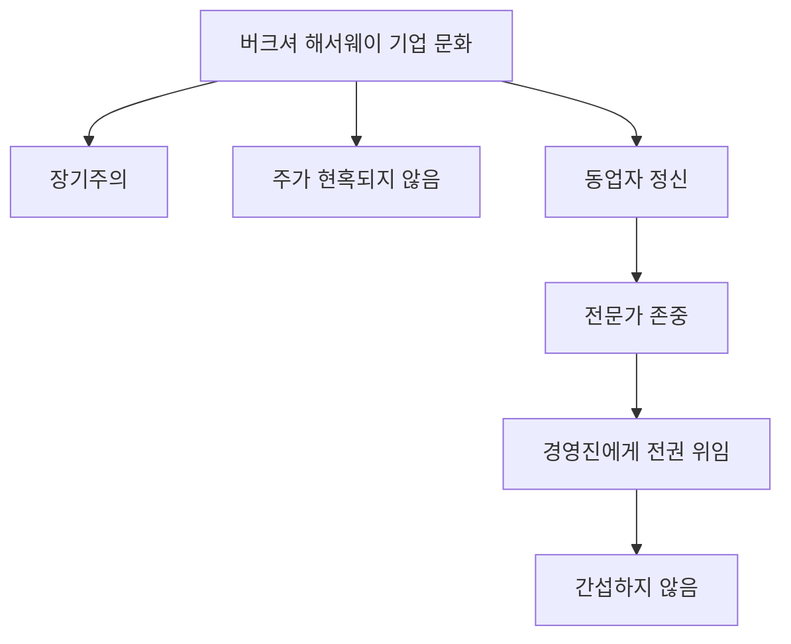

## 워런 버핏의 주주 서한: 투자의 지혜를 담은 살아있는 전설의 이야기
이 책은 워런 버핏이 버크셔 해서웨이 주주들에게 보낸 편지들을 모아 정리한 거야. 워런 버핏은 주식 투자를 통해 약 300조 원의 엄청난 부를 이룬 사람인데, 이 책을 통해 그의 투자 철학과 인생에 대한 깊은 통찰을 배울 수 있어. 특히, 이 책은 버핏이 직접 쓴 글 중 가장 잘 정리된 형태로 그의 생각을 엿볼 수 있는 소중한 자료라고 보면 돼. 

## 1. 워런 버핏, 그는 누구인가? 

1. **어린 시절부터 남달랐던 투자 신동**
  1. 워런 버핏은 1930년에 태어나 아주 어렸을 때부터 사업 감각을 보였어. 
  - 친구들에게 껌이나 코카콜라를 팔았고, 12살 때 처음으로 시티즌 서비스 주식을 샀어. 
  - 신문 배달과 달력 판매도 했고, 14살 때는 처음으로 소득세를 냈을 정도야. 
  - 할아버지가 마트를 운영하셨는데, 코카콜라 6개 묶음을 사서 낱개로 팔아 이득을 남기는 차익 거래를 어릴 때부터 경험했지. 
  - 심지어 자기는 펩시가 더 싸서 펩시를 마셨다고 해. 
  2. 그의 아버지는 증권회사 직원이었고, 공화당 하원 의원을 지낸 분이었어. 
  - 아버지는 대공황 직후인 1930년에 증권회사를 창업했는데, 당시 주식 시장이 매우 어려웠던 시기였어. 
  - 이런 환경에서 버핏은 숫자와 분석에 심취한 독특한 아이로 자랐어. 
  3. 버핏이 본격적으로 투자를 시작한 1950년대는 미국 자본주의가 번성하고 주식 시장도 좋았던 시기였어. 
  - 2차 세계대전 이후 복구와 냉전 시기를 거치며 1950~60년대는 자본주의의 황금기라고 불렸지. 
  - 하지만 60년대 후반부터 70년대, 그리고 닷컴 버블 붕괴 시기 등 어려운 시기도 모두 겪으며 80년간 투자를 해왔어. 
2. 버크셔 해서웨이**: 단순한 회사가 아니야**
  1. 버핏은 버크셔 해서웨이라는 회사의 CEO이자 대주주인데, 이 회사는 원래 1960년대에 인수한 섬유회사였어. 
  - 처음에는 섬유 산업으로 시작했지만, 일본과 한국에 밀려 사양 산업이 되자 1980년대 초에 섬유 사업을 정리하고 지주회사이자 보험회사로 변모했어. 
  - 버핏은 버크셔 해서웨이 인수를 자신의 인생에서 가장 큰 실수였다고 말하기도 했어. 
  2. 버크셔 해서웨이의 주가는 한 주당 약 45만 달러(약 5억 원)로, 비트코인보다 비싸. 
  - 이는 주식을 사고파는 것이 아니라 장기간 보유해야 한다는 버핏의 철학이 반영된 결과야. 
  - 버핏은 주주들이 자주 바뀌는 것을 좋아하지 않고, 좋은 주주들과 장기간 함께 가고 싶어 해. 
  3. 버크셔 해서웨이는 시가총액이 6,430억 달러로, 전 세계에서 6번째로 큰 회사야. 
  - 이 회사는 보험 사업 부문과 비보험 사업 부문으로 나뉘는데, 보험 사업이 핵심적인 역할을 해. 
  - 보험 사업을 통해 들어오는 돈(플로트)을 활용해서 다른 기업들을 인수하고 투자하는 거야. 
3. **버핏의 생각은 어떻게 알 수 있을까?**
  1. 버핏은 직접 책을 쓴 적이 없어. 
  - 그의 생각을 알 수 있는 방법은 크게 세 가지야. 
  - **3개월마다 공개되는 투자 내역**: 버크셔 해서웨이의 투자 내역은 3개월마다 미국 증권거래위원회에 신고돼. 
  - 주주 서한: 매년 주주들에게 보내는 편지로, 버핏의 투자 철학과 경영 원칙이 담겨 있어. 
  - 주주총회** 대담**: 매년 5월경 열리는 버크셔 해서웨이 주주총회에서 버핏과 찰리 멍거가 주주들과 대담을 나누는데, 여기서 그의 생각을 직접 들을 수 있어. 
  2. 이 책은 버핏이 40년 넘게 써온 주주 서한들을 주제별로 정리한 거야. 
  - 매년 업데이트되는 개정판을 읽는 것이 중요해. 
  - 이 책은 버핏의 언어로 쓰여진 가장 압축적인 자료라고 할 수 있어. 

## 2. 버핏의 스승과 동반자: 투자 철학의 진화 

1. 벤자민 그레이엄**: 가치 투자의 아버지**
  1. 버핏은 콜롬비아 대학 MBA 과정에서 벤자민 그레이엄에게 배웠어. 
  - 그레이엄은 '증권 분석'과 '현명한 투자자'라는 책을 썼는데, 버핏은 '현명한 투자자'를 꼭 읽어보라고 추천해. 
  - 그레이엄은 대공황이라는 매우 어려웠던 시기에 투자를 했던 사람이야. 
  2. 그레이엄은 버핏에게 두 가지 중요한 개념을 가르쳐줬어.
  - 미스터 마켓** (**Mr. Market**)**: 시장은 조울증 환자 같아서, 어떨 때는 아주 헐값에 주식을 팔려고 하고, 어떨 때는 터무니없이 비싸게 팔려고 한다는 거야. 
  - 시장은 항상 합리적이지 않기 때문에, 좋은 타이밍에 사고팔기 어렵다고 봤어. 
  - 그래서 가치 투자자들은 보통 장기 투자를 선호하고, 타이밍을 크게 고려하지 않아. 
  - 이 개념은 시장의 변동성을 위험이 아니라 기회로 보는 관점을 제공해. 
  - 안전 마진** (Margin of Safety)**: 기업의 적정 가치를 정확히 알 수 없기 때문에, 내가 추정한 가치보다 훨씬 싸게 주식을 사야 한다는 개념이야. 
  - 마치 건물을 지을 때 혹시 모를 사고에 대비해 튼튼하게 짓는 것처럼, 내 판단이 틀릴 수도 있으니 여유 공간(버퍼)을 확보하는 거야. 
  - 그레이엄은 대공황 시대를 겪었기 때문에 망하지 않는 것이 가장 중요하다고 생각했고, 극단적인 분산 투자를 강조했어. 
  - 그는 마치 버려진 담배꽁초를 주워 몇 번 빨고 버리는 것처럼, 아주 저평가된 주식들을 많이 찾았어. 
2. 찰리 멍거**: 투자 스타일을 바꾼 영혼의 동반자**
  1. 버핏은 1957년에 찰리 멍거를 만났고, 두 사람은 첫눈에 서로에게 반했다고 해. 
  - 멍거는 버핏보다 6살 많고, 변호사 출신으로 부동산 개발로도 돈을 벌었던 훌륭한 투자자였어. 
  - 두 사람은 오마하에서 태어나 자랐고, 심지어 버핏의 할아버지 식료품점에서 멍거가 알바를 한 적도 있었어. 
  2. 멍거는 버핏에게 아주 중요한 조언을 해줬어: "<u>무난한 기업의 주식을 싸게 사는 것보다 좋은 기업의 주식을 제값 주고 사는 게 낫다</u>." 
  - 이 조언은 버핏의 투자 스타일을 크게 변화시켰어. 
  - 초기 버핏은 그레이엄의 영향으로 담배꽁초 주식(저평가된 기업)을 주로 찾았지만, 멍거를 만난 후 코카콜라나 애플처럼 좋은 기업에 투자하게 된 거야. 
  - 멍거는 버핏이 지나치게 싼 주식만 찾던 방식에서 벗어나 유연한 투자자로 바뀌는 데 큰 영향을 줬어. 
  3. 버핏은 멍거의 조언을 "청교도 개혁 운동 시기에 사는 것과 비슷했다. 하루는 마틴 루터 킹 목사의 연설을 듣고, 하루는 교황의 연설을 듣는 시기였다"고 비유했어. 
  4. 멍거는 "무엇을 모르는지 아는 것이 천재적인 것보다 중요하다"거나 "사람들은 똑똑해지려고 노력하지만 나는 그저 멍청하지 않으려 노력한다"는 명언을 남겼어. 
  - 이런 말들은 단지 경제적인 통찰을 넘어 인생에 대한 깊은 지혜를 담고 있어. 

## 3. 버핏의 투자 원칙: 단순함 속에 숨겨진 지혜 

1. **내가 아는 것에만 투자한다 (**능력 범위**)**
  1. 버핏은 "투자는 야구선수보다 훨씬 유리하다"고 말해. 
  - 야구선수는 스트라이크 3개면 삼진 아웃이지만, 투자자는 좋은 공(내가 잘 아는 투자 대상)이 올 때까지 계속 기다릴 수 있다는 거야. 
  - 내가 모르는 것에 분산 투자하는 것보다, 내가 잘 아는 것에 집중 투자하는 것이 더 안전하다고 봐. 
  2. 그는 자신의 능력 범위를 정확히 아는 것이 중요하다고 강조해. 
  - 마이크로소프트나 인텔 같은 소프트웨어 산업은 자신의 능력 밖이라고 생각해서 닷컴 버블 시기에 투자하지 않았어. 
  - 빌 게이츠와 절친임에도 불구하고 IT 기업에 투자하지 않은 것도 같은 이유야. 
  - 아마존도 초기에 제프 베이조스가 매우 똑똑하다고 생각했지만, 아마존이 생존할 수 있을지 예측하기 어려워 투자하지 않았어. 
  - 자동차 회사도 과거 미국에 1,000개가 넘었지만 지금은 4개만 남았는데, 누가 살아남을지 예측하는 것은 불가능하다고 봤어. 
  3. 하지만 구글에 투자하지 못한 것은 후회한다고 말했어. 
  - 자신이 소유한 보험사들이 구글 검색 광고에 쓰는 비용이 점점 늘어나는 것을 보면서도 투자하지 못했기 때문이야. 
  - 이는 아마존처럼 이해 범위 밖의 기업이 아니라, 이미 이해하고 있었음에도 놓친 기회라고 생각한 거야. 
2. **기업을 사는 거지, 종이 쪼가리를 사는 게 아니야**
  1. 버핏은 주식을 사는 것은 한 기업의 작은 조각을 소유할 수 있는 권리, 즉 기업 자체를 사는 것이라고 말해. 
  - 지분이 크든 작든, 주식은 기업을 사는 행위라는 철학이 그의 투자에 늘 관철돼. 
  2. 투자 대상의 내재 가치를 평가하고, 위험률(내가 틀릴 수 있는 가능성)을 감안해서 안전 마진을 확보해야 해. 
  - 안전 마진을 넓게 설정하면 몇 번의 실수로 모든 것이 사라지는 것을 막을 수 있어. 
  3. 올바른 회사를 사면 주가는 저절로 올라간다고 믿어. 
  - 이를 위해서는 기업의 질적인 판단, 즉 통찰력이 필요해. 
  - 단순히 PBR(주가순자산비율)이 낮은 기업을 찾는 것보다, 비즈니스 모델에 대한 이해가 중요하다고 봐. 
  - 코카콜라나 애플처럼 고객 충성도가 높고 가격 결정권이 있는 기업에 투자하는 것이 좋은 예시야. 
3. **경영진의 중요성**
  1. 버핏은 경영진의 중요성을 매우 강조해. 
  - 버크셔 해서웨이의 자회사가 60개가 넘는데, 그는 경영진들에게 거의 전적으로 위임을 해. 
  - 마치 골프 9단을 운영할 때 아놀드 파머나 잭 니클라우스 같은 훌륭한 선수들에게는 감독이 관여할 필요가 없는 것과 같아. 
  - 실력 있는 CEO를 잘 선별하고 그들에게 권한을 주는 것이 중요하다고 생각해. 
  2. 그는 좋은 비즈니스 구조만큼이나 누가 그 사업을 운영하는지가 핵심이라고 봐. 
  - 자신이 만났던 성공한 사업가 친구들도 자신만의 독특한 논리와 깊이 있는 분석 능력을 가지고 있었어. 
  - 특히 레드 오션(경쟁이 치열한 시장)에서도 데이터 기반으로 시장을 분석하고, 그 섹터에서 가장 똑똑하면 돈을 벌 수 있다고 말해. 
4. 복리** 효과와 **장기 투자
  1. 복리 엔진이 작동하도록 하는 것이 투자의 모든 것이라고 말하며, 장기 투자를 강조해. 
  - 그의 재산 90% 이상이 65세 이후에 형성되었을 정도로, 시간의 힘을 믿는 투자자야. 
  - "나는 아직 눈덩이를 단단히 뭉친 뒤 굴렸습니다. 만일 5년이나 10년 늦게 시작했더라면, 그 눈덩이는 지금 언덕에서 있는 눈덩이와는 완전히 달랐을 겁니다. 그래서 난 학생들에게 조금이라도 더 일찍 그 게임을 시작하라고 권해드리고 싶습니다. 금액이 클 필요는 없습니다. 조금이라도 일찍 시작하는 편이 뒤늦게 시작하는 것보다 훨씬 나았습니다." 
  2. 투자는 테크닉이나 비기가 아니라, 긴 호흡을 가지고 원칙을 지키며 꾸준히 하는 것이 중요하다고 봐. 
  - 기질이나 태도가 지적인 능력보다 더 중요하다고 찰리 멍거는 말했어. 

## 4. 시장에 대한 통찰: 미스터 마켓을 활용하는 법 

1. **미스터 마켓은 당신의 하인이자 기회**
  1. 미스터 마켓은 매일 주식을 사고팔라고 제안하지만, 그가 제시하는 가격은 터무니없을 때가 많아. 
  - 시장의 기분에 따라 당신의 판단이 흔들려서는 안 돼. 
  - 하지만 때로는 미스터 마켓이 주식을 싸게 살 기회와 비싸게 팔 기회를 제공하기도 해. 
  2. 시장은 대체로 합리적이지만, 늘 합리적인 것은 아니야. 
  - 특히 투자자들의 마음이 들끓어 오르거나(조증), 주가가 떨어져 침울할 때(우울증)는 비합리적인 경향이 강해져. 
  - 가치 투자자들은 시장이 우울증에 빠졌을 때가 오히려 기회라고 봐. 
  3. 버핏은 "우리는 공포나 탐욕이 언제 왔다가 언제 떠날지 예측할 생각이 전혀 없습니다. 우리 목표는 더 소박합니다. 다른 사람들이 탐욕스러워할 때 두려워하고, 다른 사람들이 두려워할 때 탐욕스러워 하고자 합니다."라고 말했어. 
  - 이는 인간의 본성과 반대로 행동해야 한다는 것을 의미해. 
  - 이 말은 듣기에는 쉽지만, 실제로 실천하기는 매우 어려워. 
2. **불확실성은 투자자의 좋은 친구**
  1. 많은 사람들이 불확실성을 위험하다고 생각하지만, 버핏은 오히려 "진정한 투자자는 변동성을 환영한다"고 말해. 
  - 시장의 변동성은 비합리적인 가격을 만들어내고, 이는 가치 투자자에게 매수 또는 매도 기회를 제공하기 때문이야. 
  - 효율적 시장 가설(시장은 항상 효율적이라는 이론)을 믿는 사람들은 변동성을 위험으로 보지만, 버핏은 돈을 잃는 것이 위험이지 변동성 자체가 위험은 아니라고 주장해. 
  2. "미래는 결코 분명하지 않다. 주식시장에서 긍정적인 의견일지도 얻으려면 많은 대가를 치러야 한다. 불확실성, 그야말로 장기 가치 투자를 하는 사람에게 좋은 친구다." 
  - 불확실성이 존재하기 때문에 안전 마진이라는 개념도 의미가 있는 거야. 
3. **대중과 다르게 생각하라**
  1. 메아리처럼 남이 하는 대로 따라서 인생을 사는 것은 쉬워 보이지만, 앞서가는 사람이 실수하지 않을 때만 그렇다고 말해. 
  - 결국 대중이 늘 맞는 것은 아니기 때문에, 자신만의 통찰력이 필요해. 
  - 안전 마진을 확보하는 투자는 사람들이 그 주식의 가치를 잘 몰랐기 때문에 가격이 싸게 거래되는 경우가 많아. 
  - 이는 약간 역발상적인 사고가 필요하다는 것을 의미해. 
  2. 버핏도 투자 인생에서 세 번 정도 자산이 반토막 나는 어려움을 겪었어. 
  - 1999년 닷컴 버블 때는 버크셔 해서웨이 주가가 19% 떨어졌는데, S&P 500은 19% 올랐어. 
  - 이때 언론에서는 "버핏, 대체 뭐가 문제예요?"라는 비판적인 기사를 내기도 했지. 
  - 하지만 버핏은 "욕하는데 개의치 않아. 난 독립적으로 생각할 거고, 진리는 사람들이 얼마나 많이 동의하느냐가 아니라 그 자체의 옳고 그름이 중요하다"고 말했어. 
  - 그는 어려울 때 버티는 것도 투자라고 생각하며, 자신의 판단이 틀리지 않았다면 시장의 비합리성을 견뎌낼 수 있다고 봐. 

## 5. 현명한 투자자를 위한 실질적인 조언 

1. **보수적인 투자와 꾸준한 저축**
  1. 버핏은 좋은 기회가 있더라도 레버리지(빚을 내서 투자하는 것)를 많이 일으키지 않아. 
  - 일시적으로 큰돈을 벌 기회를 놓쳤다고 후회해본 적이 없다고 해. 
  - "누군가가 나보다 더 부유해지는 것이 뭐가 그리 문제인가?"라는 질문을 던지기도 해. 
  2. 주가 하락은 주식 시장의 본성이며, 하락장에서 사람들은 고통스러워해. 
  - 이럴 때 보수적인 투자와 기적을 바라지 않는 꾸준한 저축이 답이라고 말해. 
  - 여윳돈을 가지고 투자해야 감정을 조절하며 장기적으로 성공할 수 있어. 
  3. 돈으로 표시되는 투자(예금이나 채권)는 인플레이션 때문에 장기적으로 좋은 투자 대상이 아니라고 봐. 
  - 돈의 구매력이 계속 떨어지기 때문에, 확정적인 이자를 주는 것보다는 가치 투자를 통해 성장할 수 있는 자산이 더 낫다고 생각해. 
2. **정보의 질을 중시하고, 모르는 것은 하지 마라**
  1. 버핏은 정보의 질을 매우 중요하게 생각해. 
  - 예측하기 힘든 2차 전지 같은 시장에는 잘 투자하지 않아. 
  - 한국의 전자공시시스템처럼 정보의 질이 높고 가치성이 높은 데이터를 가지고 판단을 내려. 
  - 월스트리트 저널 같은 일간지를 꾸준히 읽으며 아이디어를 얻어. 
  2. "나쁜 생각보다 좋은 생각으로 인해 더 많은 곤란을 당할 수 있다. 좋은 생각에는 한계가 있다는 사실을 잊어버리게 되는 경우가 많다." 
  - 솔깃한 내부자 정보처럼 너무 좋은 생각은 오히려 필터링 기준을 약하게 만들어 위험할 수 있어. 
  - 월스트리트에서 떠나 시골에서 투자한 것도, 정보의 유혹에서 벗어나 공정한 게임을 하고 싶었기 때문이야. 
  - 그는 모두가 보는 공시 정보와 신문 정보만으로 투자하며 큰 자부심을 느꼈어. 
  3. "누군가 즉시 이익을 내주겠다고 약속하면 즉시 거절하십시오." 
  - 자산의 장래 가격 변동에 초점을 맞춘다면 그것은 투기이며, 투기는 가장 쉬워 보일 때 가장 위험한 법이야. 
  - 모멘텀 투자(주가 상승 추세에 따라 투자하는 것)는 잘하는 사람이 없다고 봐. 
3. 인덱스 펀드** 투자와 미국의 기적**
  1. 개별 기업에 투자하기 어렵다면 S&P 500 인덱스 지수를 사는 것을 추천해. 
  - 그는 자신이 세상을 떠나면 아내에게 남은 돈으로 S&P 500 지수에 투자하라고 권장했어. 
  - 이는 100% 분산 투자가 된 것이고, 대부분의 헤지펀드조차 S&P 500 수익률을 이기지 못했기 때문이야. 
  - 결국 자신의 능력 범위를 아는 것과 연결되는 조언이야. 
  2. 버핏은 미국 경제의 꾸준한 성장에 대한 큰 신뢰를 가지고 있어. 
  - 그는 자신이 동남아처럼 인프라가 부족한 나라에서 투자했다면 지금과 같은 부를 이루지 못했을 것이라고 말해. 
  - 미국 자본주의에 대한 신뢰가 그의 투자 철학의 근간에 깔려 있어. 
4. **부자처럼 행동하라: 조급함을 버리고 기회를 기다려라**
  1. 투자는 버스와 같아서, 지나가면 다시 온다고 말해. 
  - 코로나 팬데믹 직후의 강세장도 역사상 가장 이례적인 기회가 아니었어. 
  - 조급함은 투자의 가장 큰 적이야. 
  2. 버핏이 성공할 수 있었던 중요한 조건 중 하나는 그가 보험회사를 소유하고 있었기 때문이야. 
  - 보험 사업을 통해 끊임없이 돈(플로트)이 들어와서 늘 현금을 보유할 수 있었어. 
  - 이는 시장이 비합리적일 때(미스터 마켓이 우울증에 빠졌을 때) 주식을 살 수 있는 구조적인 이점을 제공해. 
  - 마치 상조업처럼 고객의 돈을 미리 받아 운용할 수 있는 비즈니스 모델을 좋아했어. 
  3. 투자는 부자에게 절대적으로 유리한 게임이야. 
  - 돈이 적더라도 부자처럼 행동해야 해. 
  - 빨리 부자가 되려고 조급해하지 말고, 꾸준히 현금 흐름을 만들고 여윳돈을 가지고 기다릴 수 있는 여건을 스스로 만들어야 해. 
  - 위기 상황에서 현금과 용기가 결합할 때 그 가치는 빛을 발해. 
5. **기업 인수와 가치 평가**
  1. 버핏은 기업을 인수할 때 매력적인 가격이면 전체를 인수하고, 그렇지 않으면 일부만 소유해. 
  - 인수한 기업들조차도 거의 경영 간섭을 하지 않아. 
  - 이는 경영 간섭을 안 해도 될 만큼 훌륭한 기업들만 인수하기 때문이야. 
  2. 그는 "평범한 회사를 싼값에 사는 것보다 멋진 회사를 정당한 가격에 사는 게 훨씬 수익률이 좋아"라는 찰리 멍거의 조언을 받아들였어. 
  - 이전에는 담배꽁초 투자법(쇠퇴하는 기업 중 저평가된 주식)을 선호했지만, 멍거의 영향으로 씨즈 캔디(See's Candies) 같은 좋은 기업에 투자하게 됐어. 
  - 씨즈 캔디는 가격 결정권이 있고 고객 충성도가 높아, 적은 비용 투자로 큰 수익을 낼 수 있는 기업이었어. 
  3. 그는 자본 투하가 많이 일어나지 않는 기업에 투자하는 것을 선호해. 
  - 코카콜라처럼 더 이상 대규모 시설 투자가 필요 없는 기업들이 좋은 예시야. 
  - 하지만 BNSF 철도 회사처럼 시설 투자가 많이 들어가더라도 현금 창출 능력이 탁월하고 압도적인 경쟁 우위가 있다면 투자를 해. 
  - 2008년 금융 위기 때 BNSF 철도 회사를 매입한 것이 좋은 예시야. 
  4. 아메리칸 익스프레스 투자 사례도 그의 통찰력을 보여줘. 
  - 회계 부정 이슈로 주가가 폭락했을 때, 그는 직접 상점들을 찾아가 아메리칸 익스프레스 카드 사용 패턴을 확인했어. 
  - 실제 사용에는 변화가 없다는 것을 확인하고, 단기적인 공포에 휩싸인 시장의 비합리성을 이용해 대규모로 인수했지. 
  5. 그는 사고 싶은 회사가 있으면 대표의 심기를 계속 살피다가, 힘들거나 스트레스받는 순간을 노려 인수하기도 해. 
  - 제안이 들어오면 일주일도 안 돼서, 심지어 5분 만에 계약을 끝낼 정도로 철저하게 분석하고 준비해. 

## 6. 미국의 기적과 버크셔의 기업 문화 

1. **미국 자본주의에 대한 신뢰**
  1. 버핏은 자신이 주식으로 많은 돈을 벌 수 있었던 것은 미국이라는 나라의 번영 덕분이라고 말해. 
  - 대공황 직후에 태어나 투자를 시작했지만, 그가 본격적으로 활동한 1950년대는 미국 경제가 좋았던 시기였어. 
  - 미국 자본주의에 대한 깊은 신뢰가 그의 투자 철학의 근간에 깔려 있어. 
2. 버크셔** 해서웨이의 독특한 기업 문화**
  1. 버크셔 해서웨이의 기업 문화는 장기주의를 지향하고, 당장의 주가에 현혹되지 않아. 
  2. 동업자 정신이 매우 강해. 
  - 보험회사를 인수하면 경영진에게 거의 전권을 맡기고 간섭하지 않아. 
  - 이는 전문가에 대한 존중과 신뢰를 바탕으로 해. 
  3. 버크셔 해서웨이는 배당을 한 번도 한 적이 없어. 
  - 기업이 돈을 벌어 쌓아놓은 자본을 경영진이 잘 불릴 수 있다면, 배당할 필요가 없다고 생각해. 
  - 장기적으로 기업 가치를 키워내는 것이 주주들에게 더 이득이라고 보는 거야. 
  - 다만, 주가가 많이 떨어졌을 때는 자사주를 매입해서 소각시켜 주주 가치를 올리기도 해. 
  4. 버핏은 자본 배치를 매우 강조해. 
  - 보험, 철도, IT, 식음료 등 다양한 사업 부문에서 돈을 더 잘 벌 수 있는 곳으로 자본을 효율적으로 배치해. 
  - 배당을 하지 않고 자신들이 재투자를 더 많이 하는 것도 이런 자본 배치 개념과 연결돼. 

