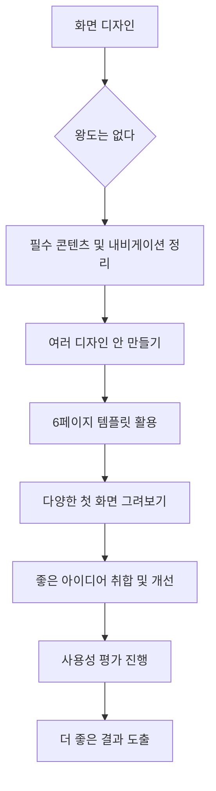
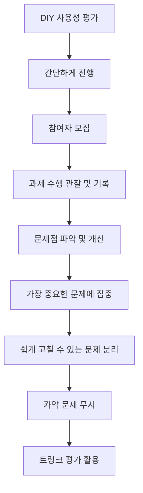

## 사용자를 생각하게 하지 마: 웹사이트 사용성 높이는 비법
이 책은 사용자가 웹사이트를 이용할 때 헷갈리거나 고민하지 않도록 만드는 실용적인 방법을 알려주는 책이야. 복잡한 이론 대신, 사용자가 원하는 것을 쉽게 달성할 수 있도록 돕는 구체적인 팁들을 제공하고 있어. 마치 길을 잃지 않도록 친절하게 안내해주는 지도 같은 책이라고 보면 돼.

## 1. 사용자를 고민에 빠뜨리지 마! 

이 책의 가장 중요한 원칙은 바로 '사용자를 생각하게 하지 마'야. 마치 친구가 "이거 어떻게 하는 거야?"라고 계속 묻는다면 피곤하겠지? 웹사이트도 마찬가지야. 사용자가 뭘 해야 할지 고민하게 만들면 안 돼.

1. **사용자가 고민하는 웹사이트의 특징** 
  1. 구역이 너무 많고 복잡해서 어디부터 봐야 할지 모르겠어.
  2. 버튼이나 링크가 뭘 하는 건지 명확하지 않아.
  3. 클릭이 되는 건지 아닌지 헷갈려.
  4. 내비게이션(길 안내)이 어디 있는지 찾기 어려워.
  5. 같은 링크가 두 개씩 있어서 뭘 눌러야 할지 모르겠어.
2. **좋은 웹사이트는 명확해야 해** 
  1. 사용자가 아무 생각 없이 봐도 "아, 이건 제품 카테고리구나", "이건 할인 상품이구나" 하고 바로 알 수 있어야 해.
  2. 버튼 이름은 "잡스(Jobs)"처럼 명확하게 써서, 누르면 구인 광고 정보가 나올 거라는 걸 바로 알 수 있게 해야 해. 
  3. 버튼은 버튼처럼 생겨야 해. 파란색 글씨만 있는 "리포트"보다는 버튼 모양의 "리포트"가 훨씬 명확해서 사용자가 고민하지 않고 누를 수 있어. 
3. **찰나의 고민도 없애야 해** 
  1. 항공권 예매할 때 출발지나 도착지를 입력하면, 관련 도시 목록이 바로 뜨는 게 좋아.
  2. 만약 "NY"라고 쳤는데 아무것도 안 뜨면, "어? 뉴욕은 어떻게 입력해야 하지?" 하고 잠깐 고민하게 되잖아. 이런 찰나의 고민들이 계속 쌓이면 사용자는 피곤해지고 결국 웹사이트를 떠나게 돼.
  3. 마치 권투 선수가 작은 펀치를 계속 맞다가 결국 기절하는 것처럼, 작은 불편함들이 쌓여서 사용자가 웹사이트를 제대로 못 쓰게 될 수 있어. 

## 2. 사용자는 웹을 어떻게 사용할까? 

우리는 웹사이트를 디자인할 때 사용자가 모든 내용을 꼼꼼히 읽을 거라고 생각하지만, 실제로는 그렇지 않아. 마치 바쁜 사람이 마트에서 필요한 물건만 쓱 보고 지나가는 것처럼 말이야.

1. **사용자는 읽지 않고 훑어봐 (**스캐닝**)** 
  1. 웹은 도구일 뿐이라 모든 걸 다 읽을 필요가 없다고 생각해.
  2. 사람들은 훑어보기에 아주 익숙하고 능숙해.
  3. 중요한 정보가 있을 거라고 생각은 하지만, 일단 훑어보고 대강 뭔지 파악하려고 해.
2. **사용자는 최선의 선택을 하지 않아** 
  1. 항상 시간에 쫓기기 때문에 "이 정도면 괜찮아" 하고 만족해.
  2. 잘못된 선택을 해도 "뒤로 가기" 버튼 누르면 되니까 큰 불이익이 없어.
  3. 최선을 다해도 결과가 더 좋아진다는 보장이 없다고 생각해.
  4. 가끔은 대충 찍는 게 재미있기도 하다고 느껴.
  5. 마치 배달 앱에서 여러 식당을 비교하다가 결국 첫눈에 괜찮아 보이는 곳을 고르는 것과 같아.
3. **사용자는 작동 방식을 이해하려 하지 않아** 
  1. 그냥 작동하기만 하면 계속 사용해.
  2. 어떻게 작동하는지 원리까지 아는 건 중요하지 않다고 생각해.
  3. 마치 스마트폰을 쓸 때 내부 회로가 어떻게 작동하는지 몰라도 잘 쓰는 것과 같아.
4. **사용자의 목적에 따라 페이지가 다르게 보여** 
  1. 뇌는 모든 시각 정보를 처리하는 게 아니라, 관심 있는 부분에만 집중해 (선택적 주의).
  2. 예를 들어, 티켓을 사고 싶은 사람은 티켓 관련 버튼만 눈에 들어오고, 마일리지를 쌓고 싶은 사람은 마일리지 관련 정보만 보게 돼.
  3. 그래서 웹사이트를 만들 때는 사용자의 다양한 목적을 고려해서, 각 목적에 맞는 정보가 잘 보이도록 구성해야 해.
5. **웹사이트를 명확하게 만들어야 하는 이유** 
  1. 사람들은 웹페이지에 아주 적은 시간을 써.
  2. 효과적인 웹페이지는 사용자가 마법처럼 사용 방법을 한눈에 알아볼 수 있어야 해.
  3. 설명이 없어도 이해할 수 있는 페이지를 만들어야 해.
  4. 만약 광고를 통해 들어온 사용자가 복잡한 페이지를 보고 바로 떠난다면, 마케팅 비용만 낭비하는 셈이야.
  5. 정보가 깔끔하게 정리되어 있으면, 더 많은 사람들이 웹사이트를 오래 보고 회원 가입이나 구매로 이어질 확률이 높아져.

## 3. 훑어보기 좋은 디자인 만들기 

사용자들이 웹사이트를 훑어본다는 걸 알았으니, 이제 훑어보기 좋은 디자인을 만들어야 해. 마치 도서관에서 책 제목만 보고도 어떤 내용인지 짐작할 수 있게 만드는 것과 같아.

1. 관습**(Convention)을 이용해** 
  1. 사람들이 이미 알고 있는, 널리 사용되거나 표준화된 디자인 방식을 활용하는 거야.
  2. 예를 들어, 일본어 웹사이트를 봐도 글씨는 몰라도 레이아웃(배치)을 보면 뉴스 사이트라는 걸 바로 알 수 있어.
  3. "바퀴를 다시 발명하지 마라(Do not reinvent the wheel)"는 말처럼, 이미 좋은 디자인이 있다면 그걸 가져다 쓰는 게 좋아.
  4. 새로운 아이디어가 정말 더 낫다고 확신할 때만 새로운 시도를 하고, 그렇지 않다면 익숙한 관습을 따르는 게 사용자에게 더 편해.
2. 명료성**(Clarity)이 **일관성**(Consistency)보다 중요해** 
  1. 사용자가 웹페이지를 보고 "이게 뭔지 알겠어"라고 느끼는 게 가장 중요해.
  2. 다른 페이지와 레이아웃이 조금 다르더라도, 현재 페이지의 내용이 명확하게 전달되는 것이 더 중요해.
  3. 마치 친구에게 설명할 때, 항상 같은 단어를 쓰는 것보다 상황에 맞춰 가장 이해하기 쉬운 단어를 쓰는 게 더 좋은 것과 같아.
3. 시각적 계층 구조**(**Visual Hierarchy**)를 효과적으로 구성해** 
  1. 중요한 정보일수록 더 눈에 띄게 만들어야 해.
  2. **글자 크기**: 더 중요한 내용은 큰 글씨로 써야 해.
  3. **영역 구분**: 왼쪽은 카테고리, 오른쪽은 내용처럼 영역을 명확히 나눠야 해.
  4. **단계 표시**: 1단계, 2단계, 3단계처럼 정보의 상하 관계를 시각적으로 잘 보여줘야 해.
  5. 마치 신문 기사에서 헤드라인은 크게, 세부 내용은 작게 쓰는 것처럼, 중요도에 따라 시각적으로 차이를 두는 거야.
4. **페이지 구역을 또렷하게 구분해** 
  1. UI(사용자 인터페이스)를 만들 때 가장 먼저 해야 할 일은 정보들을 배치하고 영역을 나누는 거야.
  2. 나눈 영역들이 논리적인 상하 관계에 맞는지 확인해야 해.
  3. 영역의 숫자가 적을수록 더 깔끔하고 잘된 디자인이야. 마치 방을 정리할 때 물건을 여러 곳에 두는 것보다 몇 개의 큰 수납공간에 정리하는 게 더 깔끔한 것과 같아.
5. **내용을 **훑어보기** 좋은 방식으로 구성해** 
  1. 제목과 부제목의 글자 크기 차이를 크게 두어 명확하게 구분해야 해.
  2. 글머리(bullet point)는 해당 문단에 딱 붙여서, 어떤 내용에 속하는지 헷갈리지 않게 해야 해.
  3. 사용자가 잠깐이라도 멈칫거리는 요소를 없애는 것이 사용성에서 가장 중요해.
  4. 마치 책의 목차를 볼 때, 대제목과 소제목의 구분이 명확해야 내용을 쉽게 파악할 수 있는 것과 같아.
6. **모바일 최적화 사례: 미디엄(Medium)** 
  1. 미디엄은 모바일에서 글을 읽는 경험에 집중해서 성공한 서비스야.
  2. 미리 주어진 포맷에 글과 이미지를 넣기만 하면 모바일에서 읽기 좋게 만들어져.
  3. 글을 음성으로 듣거나, 읽는 데 걸리는 시간을 표시하는 기능도 있어.
  4. 많은 글을 읽어야 하는 서비스를 기획한다면 미디엄을 참고하는 게 좋아.
7. **단어를 덜어내라** 
  1. 가능한 한 짧게 써야 해. 불필요한 단어는 과감히 없애야 해.
  2. 사용자가 뭘 해야 할지 길게 설명하는 대신, 깔끔하게 정리해서 보여주고 버튼을 눌렀을 때 추가 정보가 나오도록 하는 게 좋아.
  3. 이렇게 하면 사용자가 원하는 행동(예: 구매, 회원 가입)을 할 확률이 훨씬 높아져.
  4. 마치 복잡한 설명서 대신, 핵심만 요약된 안내문을 주는 것과 같아.

## 4. 웹사이트에서 길을 잃는 이유와 내비게이션 디자인 

웹사이트에서 길을 잃는다는 건, 마치 모르는 도시에서 내가 어디에 있는지, 어디로 가야 할지 모르는 것과 같아. 사용자가 웹사이트에서 길을 잃지 않도록 잘 안내하는 것이 바로 내비게이션(Navigation) 디자인이야.

1. **길을 잃는 세 가지 이유** 
  1. **규모에 대한 감각이 없기 때문**: 웹사이트가 페이지 10개짜리인지, 1000개짜리인지 미리 알 수 없어. 실제 지하철역은 규모를 짐작할 수 있지만, 웹사이트는 그렇지 않아서 복잡한 구조에 당황할 수 있어.
  2. **방향 감각이 없기 때문**: 웹사이트에는 상하좌우 같은 물리적인 방향 개념이 없어. 상위/하위 카테고리로 이동하는 것과 뒤로 가기 버튼이 겹쳐서 헷갈릴 때가 많아.
  3. **위치 감각이 없기 때문**: 물리적인 공간에서는 내가 얼마나 걸어왔는지 짐작할 수 있지만, 웹에서는 클릭 한 번에 엉뚱한 곳으로 이동할 수 있어서 내가 어디에 있는지 알기 어려워.
2. **안심을 주는 **고정 내비게이션**(**GNB**)은 필수** 
  1. 서비스** 로고**: 왼쪽 상단에 서비스 로고가 항상 있어야 해. 사용자는 여러 사이트를 왔다 갔다 하기 때문에, 로고가 없으면 "내가 지금 어디에 있지?" 하고 혼란스러워할 수 있어.
  2. **글로벌 **내비게이션** 바(GNB)**: 사이트 전체 구조를 알 수 있는 카테고리, 유틸리티 섹션 등이 상단에 정리되어 있어야 해. 마치 건물의 층별 안내도처럼, 사용자가 어디에 있든 원하는 곳으로 갈 수 있도록 도와줘.
  3. GNB는 사용자가 생각하는 방식(멘탈 모델)과 잘 일치해야 해.
3. **하위 레벨 내비게이션도 중요해** 
  1. 첫 화면뿐만 아니라, 두 번째, 세 번째 단계(뎁스) 페이지에서도 "내가 지금 어디에 있구나"라는 힌트를 줘야 해.
  2. 예를 들어, "제품"을 눌러서 들어온 페이지에서는 "제품"이라는 글자가 파란색으로 표시되거나, 페이지 제목이 "소프트웨어"로 되어 있어서 현재 위치를 알 수 있게 해야 해.
4. **모든 페이지에는 이름이 필요해** 
  1. 페이지 이름은 현재 페이지의 레벨(단계)에 따라 적절한 위치에 눈에 띄게 있어야 해.
  2. 가장 중요한 건, 내가 클릭한 것과 페이지 이름이 일치해야 한다는 거야. "러그너츠" 버튼을 눌렀으면 페이지 제목도 "러그너츠"와 관련 있어야 사용자가 안심할 수 있어.
  3. 만약 엉뚱한 제목이 나오면 사용자는 "이게 뭐지?" 하고 머뭇거리거나 실망하게 돼.
5. 브레드크럼**(**Breadcrumb**)은 정말 중요해** 
  1. 브레드크럼은 "빵 부스러기"라는 뜻인데, 마치 헨젤과 그레텔이 빵 부스러기를 흘려 길을 표시한 것처럼, 사용자가 현재 웹사이트의 어느 위치에 있는지 보여주는 길 안내 표시야.
  2. 예시: "홈 > TV & 홈시어터 > TV 스탠드 > 40인치-49인치"처럼 현재 경로를 보여주는 거야.
  3. 첫 번째 카테고리 이름, 꺽쇠 기호, 두 번째 카테고리, 그리고 마지막 페이지 타이틀은 볼드체(굵은 글씨)로 표시해야 해.
  4. 브레드크럼은 사용자가 길을 잃었을 때 현재 위치를 파악하고, 다른 상위 카테고리로 쉽게 이동할 수 있도록 도와주는 역할을 해.
6. **탭(Tab) 디자인 가이드** 
  1. 탭은 훌륭한 UI 요소지만, 명확하게 디자인해야 해.
  2. 선택된 탭과 본문 내용이 시각적으로 연결되어 있다는 것을 명확히 보여줘야 해. 예를 들어, 선택된 탭과 본문의 배경색을 같게 하는 식이야.
  3. **이중 탭은 절대 사용하지 마!** 
  1. 탭 아래에 또 다른 탭을 두면 사용자들이 내용을 잘 찾지 못하고 헤매게 돼.
  2. 마치 복잡한 매트릭스 구조 안에서 길을 잃는 느낌을 줘.
  3. 음식점 키오스크에서 이중 탭을 많이 사용하는데, 특정 메뉴가 아예 노출되지 않는 경우가 많아.

## 5. 홈페이지 첫 화면 디자인 

홈페이지 첫 화면은 웹사이트나 앱에서 가장 중요한 화면이야. 마치 가게의 간판과 쇼윈도처럼, 사용자가 처음 보고 "이곳이 뭐 하는 곳이구나" 하고 바로 알 수 있어야 해.

1. **첫 화면이 어려운 이유: 누구나 원하기 때문** 
  1. 회사 내 모든 서비스 담당자, 상품 기획자, 마케터들이 첫 화면에 자기 서비스가 나오기를 원해.
  2. 그러다 보니 사공이 많아지고, 모두의 취향을 맞춰주려다 보면 첫 화면이 복잡해지기 쉬워.
  3. 예를 들어, 네이버 홈페이지처럼 많은 서비스가 좁은 공간에 들어가려고 경쟁하는 것과 같아.
  4. 첫 페이지에 노출되는 것이 매출에 큰 영향을 미치기 때문에, 모두가 좋은 자리를 차지하려고 노력해.
  1. 구글 검색 결과에서 첫 페이지에 안 나오면 매출이 10분의 1로 줄어든 사례도 있어. 
  2. 첫 페이지 상위 3개가 전체 클릭의 50%를 차지하고, 첫 번째 사이트가 30%를 차지해. 
2. **가장 잘못된 방법: 이해 당사자들에게 첫 화면을 맡기는 것** 
  1. 각 부서나 팀에서 필요한 내용을 적어내라고 하면, 모든 내용을 첫 화면에 넣으려고 해서 난리가 나.
  2. 마치 대학교 동문회 웹사이트를 만들 때, 교수님들은 학사 일정, 졸업생들은 뉴스 등 각자 원하는 것을 다 넣으려고 하는 것과 같아.
  3. "회사의 홈페이지를 보면 조직도가 보인다"는 말처럼, 첫 화면은 회사 내부의 권력 구조를 보여주기도 해. 
3. **첫 화면 디자인의 핵심: 전체 그림을 보여줘** 
  1. 홈페이지를 보자마자 1초 내에 다음 네 가지 질문에 대한 답이 전달되어야 해.
  1. 여긴 무슨 사이트지?
  2. 이 사이트에서 무엇을 할 수 있지?
  3. 무슨 내용이 담겨 있지?
  4. 다른 사이트보다 내가 이걸 써야 할 이유가 뭐지?
  2. 이 질문들에 대한 답이 명확하지 않으면, 아무리 마케팅으로 사용자를 모아와도 다 떠나가게 돼.
4. **첫 화면 디자인 팁** 
  1. **태그라인(**Tagline**)을 빼먹지 마**: 서비스가 무엇인지 설명하는 짧은 문장이야. 예를 들어, 자동차 렌탈 서비스는 "네가 원할 때 움직일 수 있어"처럼 로고 밑에 서비스를 설명하는 문장을 넣는 거야. 브랜드 파워가 충분하지 않다면 꼭 필요해.
  2. **환영 문구**: 사용자를 환영하는 메시지를 넣어.
  3. **더보기 기능**: 하고 싶은 얘기가 많다면 "더보기" 버튼을 통해 볼 수 있게 해 줘.
  4. **핵심 기능 강조**: 검색은 여기서 하고, 브라우징(둘러보기)은 여기서 하고, 가장 많이 찾는 내용은 여기 있다는 것을 명확히 전달해야 해.

## 6. 종교 전쟁: 사용성 논쟁 해결하기 

웹사이트를 만들다 보면 개발자, 상품 기획자, 마케터 등 여러 팀원들 사이에 의견 충돌이 생기기 마련이야. 저자는 이를 '종교 전쟁'이라고 표현해. 마치 각자 믿는 종교가 달라서 싸우는 것처럼, 각자의 관점에서만 주장하기 때문이야.

1. **종교 전쟁의 예시: 풀다운 **메뉴** 논쟁** 
  1. 디자이너: "제품 목록에 풀다운 메뉴를 쓰는 게 어때요? 공간도 절약되고 좋잖아요."
  2. 개발자: "사람들은 풀다운 메뉴를 싫어해요. 우리 아버지는 풀다운 메뉴 쓰는 사이트 안 가요." (사실은 본인이 싫은 것)
  3. 마케터: "풀다운 메뉴에 대한 연구 데이터가 있나요?"
  4. 개발자: "터치스크린에서 풀다운 메뉴 쓰면 문제가 생길 수도 있어요."
  5. 결국 아무도 결정을 못 하고 회의는 끝나고, 2주 뒤에 다시 똑같은 질문을 하게 돼.
2. **종교적인 논쟁을 해결하는 방법** 
  1. "내 생각에는 이게 좋은데" 또는 "내가 아는 사람들은 이래요"라고 말하지 마.
  2. **사이트를 사용하는 대부분의 사용자에게 좋은 경험을 어떻게 줄 수 있을지 생각해야 해.**
  3. "타겟 사용자(주요 사용자) 중에 몇 퍼센트(%)가 이걸 잘 쓸 수 있을까?"라는 관점으로 논의해야 해.
3. **각자의 역할에 따라 웹사이트를 다르게 바라봐** 
  1. **사장님**: 명확하고 깔끔하게 정리된 웹사이트를 원해.
  2. **개발자**: 체계적으로 설명되어 있고 구조적인 웹사이트를 좋아해.
  3. **디자이너**: 시각적으로 매력적이고 아름다운 웹사이트를 원해.
  4. **비즈니스 담당자**: 광고나 관련 내용이 많아서 사람들이 많이 클릭하는 웹사이트를 상상해.
  5. 이러한 차이 때문에 웹사이트 디자인 결과를 보면, 어떤 팀의 마인드로 만들어졌는지 알 수 있는 경우가 많아.
4. 종교 전쟁** 해결을 위한 8가지 조언** 
  1. 사용성** 관점**: 사용자가 얼마나 쉽게 쓸 수 있는지를 중요하게 생각해.
  2. **비즈니스 관점**: 회원 가입률, 구매 전환율 등 비즈니스 성과와 연결해서 이야기해야 경영진이 관심을 가져. "사용성이 좋아졌어요"보다는 "사용성 개선으로 구매 전환율이 5% 올랐습니다"라고 말하는 게 좋아.
  3. **디자인 관점**: 시각적인 요소와 사용자 경험을 고려해.
  4. **개발 관점**: 기술적인 구현 가능성과 효율성을 생각해.
  5. **마케팅 관점**: 사용자 유입과 브랜드 인지도를 높이는 방법을 고려해.
  6. **모바일 환경**: 모바일 사용성을 최우선으로 고려해.
  7. **시각적인 요소**: 디자인의 아름다움과 명확성을 추구해.
  8. **트렌드**: 최신 트렌드를 파악하고 적용해.
  9. **상사나 경영진을 사용성 평가에 직접 참여시켜**: 상사들이 사용자들이 웹사이트를 사용하는 모습을 직접 보면, "왜 저렇게 하지?" 하고 깨닫게 되어 문제 해결에 도움이 돼.
  10. **격식 없이 빠르게 진행해**: 사용성 평가는 거창하게 할 필요 없어. 이웃 부서 사람을 데려와서 간단하게 테스트하는 것도 좋아.
  11. **경영진과 공감해**: 큰 그림에서 우리 제품이 어디쯤에 있는지 파악하는 것도 중요해.

## 7. 화면 디자인은 어떻게 할까? 

화면 디자인에는 정해진 왕도(가장 좋은 방법)는 없어. 마치 요리할 때 정해진 레시피만 있는 게 아니라, 여러 재료를 조합해서 새로운 맛을 만들어내는 것과 같아.

1. **화면 디자인의 과정** 
  1. 필수 콘텐츠(내용)와 내비게이션(길 안내)이 무엇인지 정리해.
  2. 여러 가지 디자인 안(시안)을 만들어 봐.
2. **6페이지 템플릿 활용** 
  1. A4 용지 한 장에 여섯 개의 화면을 그릴 수 있는 템플릿이야.
  2. 팀원들에게 이 템플릿을 나눠주고, 각자 여섯 개의 다른 첫 화면을 그려보게 해.
  3. 이렇게 하면 다양한 관점에서 여러 디자인 안을 볼 수 있고, "아, 이런 방식으로 정리하는 게 좋겠구나" 하고 깨달을 수 있어.
  4. 여러 안 중에서 좋은 아이디어를 취합하고 개선해서 더 많은 디자인 안을 그려보는 과정을 반복해야 해.
  5. 이 과정에서 사용성 평가를 함께 진행하면 더 좋은 결과를 얻을 수 있어.

## 8. DIY 사용성 평가: 스스로 하는 사용성 테스트 

사용성 평가는 거창하고 돈이 많이 드는 일이라고 생각하기 쉽지만, 사실은 아주 간단하게 스스로 할 수 있어 (DIY: Do It Yourself). 마치 친구에게 새로 만든 장난감을 줘보고 "이거 어떻게 가지고 노는 거야?" 하고 물어보는 것과 같아.

1. **간단하게 진행하는 **사용성 평가 
  1. 고객이나 고객과 비슷한 사람, 또는 옆 부서 사람 한 명을 데려와.
  2. 그 사람에게 웹사이트를 사용해보게 하고, 그 모습을 캠코더나 화면 캡처로 찍어.
  3. 이 영상을 만든 사람들이 다른 방에서 보게 해.
  4. 만든 사람들은 사용자가 웹사이트를 쓰는 모습을 보면서 "아, 내가 저건 잘못 생각했구나" 하고 깨닫게 돼.
  5. 안 하는 것보다 하는 게 무조건 낫고, 빨리 하고 다 같이 보는 게 가장 중요해.
2. **애플의 **사용성 평가** 오해** 
  1. 스티브 잡스가 애플에 복귀하자마자 사용성 평가 랩을 없앴다는 이야기가 있어.
  2. 이것 때문에 "애플도 안 하는데 우리도 필요 없어"라고 생각하는 경우가 있지만, 이건 오해야.
  3. 잡스는 "다 만들고 나서 평가하는 게 무슨 소용이냐, 만들 때 더 잘해라"는 의미로 말한 거야.
  4. 실제로 애플은 제품을 만드는 과정에서 사용성 검증을 엄청 열심히 하는 회사야.
3. **사용성 평가 가이드** 
  1. **누가 해야 할까**: 전문가가 있으면 좋지만, 없으면 만든 사람들이 직접 해도 돼.
  2. **언제 해야 할까**: 프로젝트 초기에 하는 것이 중요해.
  3. **얼마나 자주 할까**: 한 달에 한 번, 반나절 동안 세 명 정도만 테스트해도 충분해.
  1. 세 명이나 여섯 명 정도만 테스트해도 심각한 사용성 문제는 대부분 찾아낼 수 있어.
  4. **다른 부서 참여**: 다른 부서, 특히 개발자들의 참여를 요청하는 게 좋아.
4. **사용성 평가 후 문제 해결 방법** 
  1. **가장 중요한 문제에 집중해**: 심각한 문제 몇 개를 없애는 것이 가벼운 문제 100개를 없애는 것보다 훨씬 중요해.
  2. **쉽게 고칠 수 있는 문제는 따로 빼**: 심각한 문제와 쉽게 고칠 수 있는 문제를 같이 두면, 쉬운 것만 해결하고 심각한 문제는 미루게 될 수 있어.
  3. **사용자 행동에 기반하지 않은 의견은 배제해**: "내 생각에는 이럴 것 같아" 같은 주관적인 의견은 받아들이지 마.
  4. **기능 추가 요청은 신중하게 들어**: 사용자들이 새로운 기능을 요청할 때, 그게 정말 필요한지 신중하게 판단해야 해.
  5. 카약 문제**(Kayak Problem)는 무시해**: 카약 문제는 사용자가 일시적으로 어려움을 겪었지만, 스스로 해결하고 나면 오히려 즐겁거나 아무렇지 않게 생각하는 경험을 말해. 이런 사소한 불편함은 심각한 문제로 보지 않아도 돼.
5. 트렁크 평가**(Trunk Test)** 
  1. 이름처럼 재미있는 평가 방법이야.
  2. 어떤 사람을 눈가리개로 가리고 자동차 트렁크에 갇힌 채 끌려다닌 후, 웹사이트의 깊숙한 곳에 놓았을 때 이 웹페이지를 얼마나 이해하는지 보는 거야.
  3. 실제로는 참여자에게 웹사이트를 보여주기 전에 눈을 가리거나 노인 안경(시야를 흐릿하게 만드는 안경)을 씌워.
  4. 그리고 "사이트 이름에 동그라미 쳐보세요", "내비게이션이 어디에 있는 것 같습니까?" 같은 질문을 빠르게 던져서, 사용자가 얼마나 빨리 핵심 요소를 찾아내는지 확인하는 거야.
  5. 별거 아닌 것 같지만, 많은 것을 얻을 수 있는 재미있는 평가 방법이야.

## 9. 모바일 앱과 관련된 이야기 

이 책은 주로 PC 웹사이트를 중심으로 설명했지만, 모바일 앱에 대한 이야기도 빼놓을 수 없어. 마치 큰 집을 설계하는 것과 작은 원룸을 설계하는 것이 다른 것처럼, 모바일은 PC와는 다른 특징을 가지고 있어.

1. **모바일과 PC 버전의 기능은 같아야 해** 
  1. 모바일과 PC 버전의 기능이 다르면 사용자들이 혼란스러워해.
  2. 요즘은 모바일을 더 많이 사용하기 때문에, 모바일에서 기능이 빠지는 것이 더 큰 문제가 될 수 있어.
2. **모바일의 특징과 어려움** 
  1. **좁은 공간**: 화면이 좁아서 데스크톱보다 정보가 깊어지고 페이지가 길어져.
  2. **커서 없음**: 마우스 커서가 없기 때문에 터치 기반의 인터랙션(상호작용)을 고려해야 해.
  3. **정보 아키텍처(**Information Architecture**)의 중요성**: 좁은 공간에 많은 정보를 효율적으로 배치해야 하므로, 정보 구조를 훨씬 잘 정리해야 해.
  4. 이러한 이유로 PC 웹보다 모바일 디자인이 훨씬 더 어려워. GNB(글로벌 내비게이션 바) 같은 것을 띄울 공간도 부족하니까.
3. 모바일 퍼스트**(Mobile First) 전략** 
  1. 요즘에는 PC, 모바일, TV 등 여러 기기를 지원하는 서비스가 많아.
  2. 이때 무엇을 먼저 만들어야 할지에 대한 답은 거의 확실해졌어. **무조건 모바일 앱부터 만들어야 해.**
  3. 모바일 버전을 먼저 만들고, 그걸 참고해서 PC 버전을 만드는 것이 좋아.
  4. 만약 PC 웹을 먼저 만들고 나서 모바일 웹을 만들려고 하면, 공간 부족 문제로 큰 어려움을 겪게 될 거야.
4. **반응형 웹(Responsive Web)에 대한 의견** 
  1. 반응형 웹은 좋은 시도지만, 세세한 조절이 어려워서 저자는 별로 추천하지 않아.

