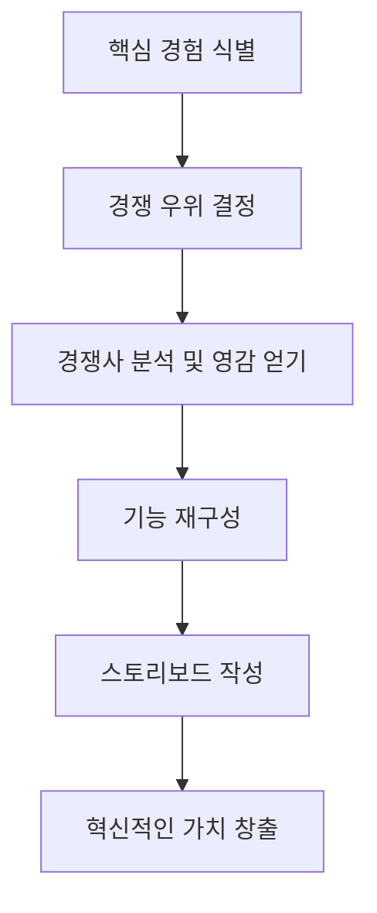

## UX 전략: 사람들이 원하는 혁신적인 디지털 제품을 만드는 방법
이 책은 사용자 경험(UX) 전략을 통해 사람들이 정말로 필요로 하고 사랑할 만한 디지털 제품을 만드는 방법을 알려준다. 비즈니스 목표와 사용자 경험 디자인을 하나로 묶어 성공적인 제품을 개발하는 핵심 비법을 배울 수 있다. 저자인 제이미 레비는 30년 가까이 UX 전략 분야에서 일해온 전문가로, 이 책을 통해 기업가, 제품 관리자, UX/UI 디자이너 등 디지털 제품을 만드는 모든 사람에게 실질적인 지침을 제공한다. 

## 1. UX 전략이 왜 중요할까? 비즈니스와 디자인의 조화 

1. **UX 전략의 핵심**: 사용자 경험(UX) 전략은 단순히 예쁜 디자인을 만드는 것을 넘어, 제품이 사용자에게 어떤 경험을 제공하고, 그 경험이 회사의 전체적인 목표와 어떻게 연결되는지를 고민하는 과정이다. 
  1. 마치 가게에 들어섰을 때 모든 물건이 손에 닿는 곳에 있고, 가게 분위기가 나를 위해 맞춤 제작된 것처럼 느껴지는 것과 같다. 
  2. 디지털 세상에서는 앱이나 웹사이트가 단순히 작동하는 것을 넘어, 사용하기 즐거워야 살아남을 수 있다. 
  3. 하지만 놀랍게도 많은 회사가 UX를 중요한 전략에서 뒷전으로 미루는 경우가 많다. 
2. **실패 사례**: 마약 재활 센터와 중독자를 연결해주는 플랫폼을 만들려던 스타트업이 있었다. 
  1. 그들은 멋진 웹사이트와 앱을 만들었지만, 아무도 가입하지 않았다. 
  2. 문제는 UX 디자인 자체가 아니라, UX 디자인이 회사의 전체적인 사업 전략과 맞지 않았기 때문이다. 
  3. 이처럼 사용자 경험이 사업 목표와 잘 어우러지는지 전체적으로 봐야 한다. 
  4. 사용자 인터페이스(UI)를 다듬기 전에, 과연 이 제품이 잠재적인 사용자들에게 정말 필요한 것인지 먼저 확인해야 한다. 
  5. 즉, UX 디자인을 시작하기 전에 제품이나 서비스에 대한 시장의 수요가 있는지 먼저 증명하는 것이 중요하다. 
  6. 따라서 UX 디자인을 하기 전에 사업 전략과 제품을 다시 평가하는 것이 필수적이다. UX는 사업 전략의 연장선이어야 한다. 
3. **UX 전략의 네 가지 **핵심 요소: 성공적인 UX 전략을 위해서는 다음 네 가지를 이해하고 연결해야 한다. 
  1. 사업 전략** (Business Strategy)**: 회사가 어떤 방향으로 나아갈지 정하는 큰 그림이다.
  2. 가치 혁신** (**Value Innovation**)**: 경쟁자가 없는 새로운 가치를 만들어내는 것이다.
  3. **검증된 사용자 연구 (**Validated User Research**)**: 실제 사용자들의 의견을 듣고 제품을 개선하는 것이다.
  4. **최첨단 디자인 (State-of-the-art Design)**: 사용하기 쉽고 매력적인 디자인을 만드는 것이다.

## 2. 경쟁에서 이기는 사업 전략 세우기: 차별화와 비용 우위 

1. **사업 전략의 중요성**: 회사의 사업 전략은 마치 회사의 DNA와 같아서, 모든 의사 결정을 이끌고 회사가 계속 살아남을 수 있도록 돕는다. 
  1. 경쟁에서 이기기 위해서는 반드시 경쟁 우위(competitive advantage)를 확보해야 한다. 
2. **경쟁 우위를 얻는 두 가지 방법**: 마이클 포터 같은 경영 전략의 대가들은 회사가 경쟁에서 앞서나갈 수 있는 두 가지 주요 전략을 제시한다. 
  1. 차별화** (**Differentiation**)**: 다른 회사와는 다른 특별한 제품이나 서비스를 제공하는 것이다. 
  - 예시: 스타벅스는 단순히 커피를 파는 것이 아니라, 특별한 경험을 팔아서 사람들이 기꺼이 더 비싼 라떼를 사게 만든다. 
  - 예시: 트위터는 2006년에 140자 메시지라는 새로운 서비스를 제공하여 기존 미디어 플랫폼과 차별화했다. 
  2. **비용 우위 (**Cost Leadership**)**: 경쟁사보다 훨씬 저렴한 가격으로 제품을 제공하는 것이다. 
  - 예시: 월마트는 항상 경쟁사보다 저렴한 가격으로 상품을 제공하여 거대한 기업이 되었다. 
3. 가치 혁신** (**Value Innovation**)**: 가장 이상적인 시나리오는 차별화와 비용 우위를 모두 갖추는 것이다. 
  1. 이 두 가지가 합쳐진 것을 **가치 혁신**이라고 부른다. 
  2. 가치 혁신은 경쟁자가 없는 아주 특별하면서도 매우 저렴한 제품을 만들어 경쟁에서 훨씬 앞서나갈 수 있게 한다. 
  3. 이런 제품을 만들면 블루 오션 시장** (**Blue Ocean Market**)**에 진입할 수 있다. 블루 오션 시장은 경쟁이 거의 없고 기회가 무궁무진한 시장을 말한다. 
  4. 예시: 페이스북은 사용자에게 돈을 받지 않으면서도 혁신적인 기능을 제공하여 소셜 미디어의 혁명을 일으켰다. 
  - 페이스북은 사람들이 친구를 쉽게 찾고, 소통하고, 콘텐츠를 공유할 수 있는 기능을 한곳에 모아 제공함으로써, 처음에는 직접적인 경쟁자가 없었다. 

## 3. 사용자 연구와 디자인으로 UX 전략 완성하기 

1. **검증된 사용자 연구 (**Validated User Research**)**: 옛날에는 감에 의존했지만, 이제는 제품을 출시하기 전에 사용자 테스트를 통해 위험을 줄이고 성공 가능성을 높인다. 
  1. 제품을 소수의 사용자에게 먼저 보여주고 피드백을 받으면, 제품을 시장의 요구에 더 잘 맞게 다듬을 수 있다. 
  2. 테스트하고, 측정하고, 평가하고, 피드백을 반영하는 과정을 계속 반복하면 제품은 더욱 완벽해진다. 
  3. 예시: 마크 저커버그는 페이스북을 전 세계에 공개하기 전에 하버드 대학교 안에서 먼저 테스트했다. 
  - 사용자 피드백을 바탕으로 이모티콘이나 통화 기능 같은 새로운 기능들을 추가하며 제품을 개선했다. 
  - 이런 체계적인 과정이 제품을 거의 완벽하게 만드는 데 얼마나 중요한지 보여준다. 
2. **최첨단 **디자인** (State-of-the-art Design)**: 아무리 좋은 아이디어와 연구 결과가 있어도, 뛰어난 UX 디자인이 없으면 제품은 빛을 발할 수 없다. 
  1. 앱을 사용할 때의 느낌, 웹사이트를 탐색할 때의 즐거움이 바로 UX의 영역이다. 
  2. 최고의 UX 디자인은 사용자를 만족시키는 것을 넘어, 계속해서 제품을 다시 찾게 만드는 즐거움을 선사한다. 
  3. 예시: 에어비앤비는 UX 디자인의 훌륭한 예시다. 
  - 에어비앤비의 인터페이스는 매우 간단하고 직관적이다. 가격 범위나 아파트 유형 같은 검색 필터와 지도를 활용한 기능이 사용자를 쉽게 끌어들인다. 
  - 이런 매력적이고 간편한 경험을 통해 고객을 유치하고 유지하는 데 성공했다. 

## 4. 가상 사용자(페르소나)와 실제 피드백으로 아이디어 검증하기 

1. **가상 사용자(**가설** 페르소나) 만들기**: 제품이나 서비스의 가치 제안(value proposition)을 개발하려면, 잠재적인 사용자가 누구인지에 대한 근본적인 질문에 답해야 한다. 
  1. 가장 좋은 방법은 **가설 페르소나 (**Provisional Persona**)**를 만드는 것이다. 
  2. 가설 페르소나는 잠재적인 사용자의 나이, 학력, 직업, 관심사, 행동 방식 등을 스케치하는 도구이다. 
  3. 페르소나에 이름과 사진을 붙여 더 현실적으로 만든다. 
  4. 예시: 결혼 계획 앱을 만든다고 가정해보자. 
  - 가상 사용자에게 이름과 얼굴을 주고, 학력, 직업, 수입, 가치관 같은 세부 정보를 채워 넣는다. 
  - 이들은 바쁜 삶 때문에 결혼 준비에 많은 시간을 할애할 수 없어 효율성을 갈망하는 사람일 수 있다. 
2. **가설 검증을 위한 실제 사용자 인터뷰**: 가설 페르소나는 어디까지나 가설일 뿐이다. 
  1. 실제 세상으로 나가 가설을 검증하거나 수정해야 한다. 
  2. 예시: 북적이는 쇼핑몰에서 어린아이를 데리고 다니는 남성들에게 다가가 인터뷰를 해볼 수 있다. 
  - 이들은 최근에 결혼했을 가능성이 높고, 결혼 준비의 어려움과 성공에 대한 생생한 기억을 가지고 있을 것이다. 
  - 가상 페르소나에게 물었던 것과 같은 질문들을 실제 사람들에게 던져본다. 완벽한 장소를 어떻게 찾았는지, 어떤 도구를 사용했는지, 무엇이 부족했는지 등을 묻는 것이다. 
3. **결과 분석 및 제품 개선**: 인터뷰를 통해 수집한 데이터를 분석한다. 
  1. 만약 대부분의 사람들이 결혼 준비를 위한 '원스톱 허브'의 필요성을 이야기한다면, 당신의 앱 아이디어는 실제 수요에 기반을 둔 것이 된다. 
  2. 가설 페르소나에서 얻은 통찰력과 실제 고객 피드백을 결합하면, 사용자 연구의 기반을 강화하고 제품이 목표 사용자의 실제 요구를 충족시킬 준비가 되었는지 확인할 수 있다. 

## 5. 경쟁사 분석으로 우위 확보하기 

1. **경쟁사 분석의 중요성**: 경쟁 우위를 얻기 위해서는 경쟁사를 철저히 조사하고 분석하는 것이 필수적이다. 
  1. 이 과정은 마치 양파 껍질을 벗기는 것과 같다. 한 겹 한 겹 벗겨낼수록 경쟁사의 사업에 대해 더 깊이 이해하게 된다. 
  2. 직접 경쟁자와 간접 경쟁자를 연구하고, 그들의 성과, 수익 모델, 사용자 등을 분석하면 아직 개척되지 않은 시장 잠재력에 대한 통찰력을 얻을 수 있다. 
  3. 최고의 운동선수들이 상대방의 경기 영상을 몇 시간씩 분석하는 것처럼, 경쟁사의 움직임과 문제 해결 방법을 이해하면 앞으로의 경쟁에 더 잘 대비할 수 있다. 
  4. 깊이 파고들다 보면 당신의 아이디어가 완전히 새로운 것이 아닐 수도 있다는 것을 깨달을 수 있다. 
  5. 하지만 이런 깨달음은 당신의 사업을 진정으로 차별화하는 요소를 찾는 데 필수적이다. 
  6. 당신 사업의 독특한 측면이 바로 미개척 잠재력의 블루 오션을 여는 황금 티켓이다. 
2. 경쟁사 분석** 방법**: 경쟁사를 분석하려면 그들의 온라인 활동, 수익 모델, 사용자, 성과 등을 면밀히 조사해야 한다. 
  1. 예시: 결혼 계획 앱을 만든다면, 기존의 결혼 계획 서비스들을 먼저 확인하고, 그들의 비용 구조, 자금 조달 방식, 웹사이트나 앱 트래픽 등을 분석한다. 
  2. **수익 모델 분석**: 그들이 어떻게 돈을 버는지 파악한다. 페이스북처럼 광고 수익에 의존하는지, 아니면 구독 기반 모델인지 등을 확인한다. 
  3. **트래픽 분석 도구**: Compete.com, Alexa, Quantcast 같은 무료 서비스를 사용하여 웹사이트 트래픽 양을 파악할 수 있다. 
  4. 모바일 앱의 경우 App Annie나 Mop App을 활용한다. 
  5. 모든 데이터를 수집한 후에는 스프레드시트에 정리하고, 그들의 수익 모델, 강점, 약점을 분석한다. 
3. **경쟁사 분류**: 경쟁사를 두 가지 범주로 나눌 수 있다. 
  1. 직접 경쟁자** (**Direct Competitors**)**: 당신의 사업과 동일하거나 유사한 제품을 제공하며, 같은 고객층을 목표로 하는 경쟁사이다. 
  2. 간접 경쟁자** (**Indirect Competitors**)**: 유사한 제품을 가지고 있지만 다른 시장을 공략하거나, 같은 고객층을 목표로 하지만 제품이 다른 경쟁사이다. 
  3. 이러한 지식은 경쟁사로부터 배우고, 당신의 사업을 위한 독특한 판매 제안(Unique Selling Proposition)을 개발하는 데 도움이 된다. 

## 6. 핵심 경험에 집중하고 사용자 여정을 스토리보드로 시각화하기 

1. **핵심 경험에 집중하기**: "적을수록 좋다(less is more)"는 말은 뛰어난 디지털 제품을 디자인할 때도 진리이다. 
  1. 제품을 경쟁사와 차별화하는 핵심 경험에 집중해야 한다. 
  2. 당신의 경쟁 우위가 무엇인지 결정한다. 이는 하나 또는 여러 개의 독특한 기능일 수 있다. 
  3. 예시: 트위터의 핵심 경험은 140자 메시지를 보낼 수 있는 기능이었다. 
  4. 예시: 결혼 계획 앱의 핵심 상호작용은 장소 둘러보기, 케이터링 업체 선택, 장식 테마 고르기 등이 될 수 있다. 
2. **경쟁사에서 영감 얻기**: 제품의 핵심 특징을 파악했다면, 직접 경쟁자와 간접 경쟁사를 평가하여 잠재적인 기능에 대한 영감을 얻는다. 
  1. 이러한 기능들을 당신의 제품에 혁신적으로 재구성할 수 있다. 
  2. 예시: 에어비앤비는 기존의 구글 지도 개념을 차용하여 사용자 경험을 풍부하게 만들었다. 
3. **스토리보드로 **사용자 여정** 시각화하기**: 마지막 단계는 핵심 구성 요소를 스토리보드로 만들어 사용자의 흐름을 시각적으로 표현하는 것이다. 
  1. 스토리보드는 사용자가 제품과 처음 만나는 순간부터 최종 목표를 달성하는 순간까지의 여정을 그리는 것이다. 
  2. 예시: 결혼 계획 앱의 경우, 미래의 신부가 장소 목록, 음식 옵션, 디자인 테마를 둘러보는 과정을 그릴 수 있다. 
  - 신부가 장소를 결정하고, 메뉴와 엔터테인먼트 패키지를 선택하고, 예약 확인을 받은 후, 6개월 뒤 해변에서 결혼하는 과정을 시각화할 수 있다. 
  3. 스토리보드는 간단한 스케치일 수도 있고, 소프트웨어를 사용한 완전한 디자인일 수도 있다. 
  4. 어떤 방법을 사용하든, 스토리보드는 디지털 제품의 핵심 기능을 보여주는 혁신적인 가치 창출을 위한 지침이 된다. 
  5. 이러한 단계를 따르면 성공적인 디지털 제품을 만들 수 있다. 

## 7. 결론: 사용자 중심의 성공적인 디지털 제품 만들기 

1. **UX 전략의 핵심**: 제이미 레비의 'UX 전략'은 사용자의 욕구를 충족시키면서도 사업 전략과 일치하는 디지털 제품을 개발하는 데 필요한 지식을 제공한다. 
2. **네 가지 핵심 요소의 조화**: 다음 네 가지 핵심 요소에 집중하면 경쟁 우위를 가진 사용자 중심의 제품을 만들 수 있다. 
  1. 사업 전략
  2. 가치 혁신
  3. 검증된 사용자 연구
  4. 최첨단 디자인
3. 블루 오션 시장** 진입**: 이러한 전체적인 접근 방식은 차별화와 비용 우위를 결합하여 경쟁이 없는 블루 오션 시장에 진입할 수 있도록 돕는다. 
4. **지속적인 개선**: 사용자 테스트와 경쟁사 분석을 통해 제품을 더욱 개선하고 시장 수요를 검증할 수 있다. 
5. **매력적인 사용자 경험 창조**: 이러한 통찰력을 바탕으로 매력적이고 성공적인 사용자 경험을 만들 준비가 된 것이다. 

