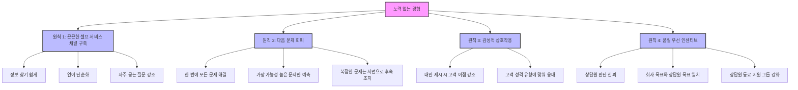
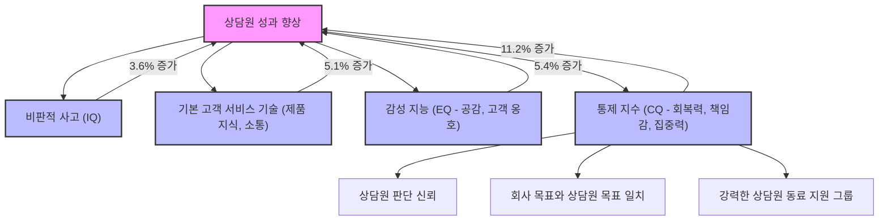
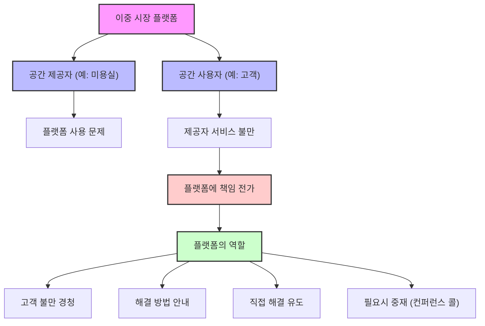

## 책 소개
이 책은 고객 충성도를 높이는 새로운 방법을 제시한다. 고객을 감동시키려 애쓰기보다는, 고객이 겪는 불편함과 노력을 줄여주는 '노력 없는 경험'을 제공하는 것이 핵심이다. 고객 서비스가 단순히 문제를 해결하는 것을 넘어, 고객의 불만을 최소화하고 이탈을 방지하는 방어적인 전략이 되어야 한다고 강조한다.

## 본문 정리

## 1. 고객을 감동시키는 전략은 효과가 없다 

고객 서비스에서 고객을 감동시키는 것이 항상 좋은 결과를 가져오는 것은 아니다. 오히려 고객의 기대를 충족시키는 것만으로도 충분한 경우가 많다.

1. 고객 감동** 전략의 오해**
  1. 많은 기업이 고객을 감동시키기 위해 엄청난 노력을 기울인다. 
  - 예를 들어, 자포스(Zappos) 상담원이 고객과 9시간 넘게 통화하거나, 노드스트롬(Nordstrom) 직원이 고객이 잃어버린 다이아몬드를 진공청소기 먼지통에서 찾아주는 이야기가 있다. 
  - 이런 이야기는 마치 고객 충성도를 높이는 비결처럼 들린다. 
  2. 하지만 이런 '감동 전략'은 오히려 비효율적일 수 있다. 
  - 기업 임원들은 "어떻게 하면 우리도 저런 감동적인 서비스를 제공할 수 있을까?"라고 고민하지만, 실제로는 고객이 원하는 것과 거리가 멀 수 있다. 
  - 고객은 그저 문제가 빠르고 쉽게 해결되기를 바랄 뿐이다. 
2. CEB**(Corporate Executive Board)의 연구 결과**
  1. 97,000명의 고객을 분석한 결과, 고객 서비스 기대치를 <mark>초과 달성한 고객</mark>과 <mark>단순히 충족시킨 고객</mark> 사이의 충성도에는 거의 차이가 없었다. 
  - 이는 마치 시험에서 100점을 맞은 학생과 90점을 맞은 학생이 다음 시험에서도 똑같이 열심히 공부하는 것과 비슷하다. 굳이 100점을 맞기 위해 엄청난 노력을 할 필요가 없다는 뜻이다.
  2. 기업들은 고객의 기대를 <mark>단순히 충족시키는 것</mark>의 중요성을 과소평가하는 경향이 있다. 
  - 대부분의 고객 서비스 경험이 좋지 않기 때문에, 고객들은 약속된 서비스를 제대로 받기만 해도 매우 만족한다. 
  3. 반대로, 고객의 기대를 <mark>초과 달성하는 것</mark>에서 얻는 이점을 과대평가한다. 
  - 고객의 기대를 넘어서는 서비스에 추가 자원을 투자해도 재정적 수익은 거의 없다. 
  - 따라서 고객의 기대치를 파악하고 이를 충족시킨 후, 남은 자원은 다른 곳에 투자하는 것이 현명하다. 

## 2. 만족도가 충성도를 예측하지 못하는 이유 

고객이 서비스에 만족했다고 해서 반드시 그 회사에 계속 충성할 것이라고 생각하면 오산이다. 만족도와 충성도는 별개의 문제인 경우가 많다.

1. **만족도와 충성도의 불일치**
  1. CEB의 글로벌 설문조사 결과, 고객 서비스 만족도 조사에서 높은 점수를 준 고객과 미래 충성도 사이에는 <mark>상관관계가 없었다</mark>. 
  - 마치 친구가 "너 정말 착하다!"라고 말했지만, 다음 날 다른 친구와 놀러 가는 것과 비슷하다. 칭찬은 했지만, 행동은 다를 수 있다는 뜻이다.
  2. 놀랍게도, 고객 경험에 <mark>만족했다고 답한 사람 중 20%</mark>는 경쟁사로 옮길 의향이 있다고 밝혔다. 
  3. 반대로, 고객 서비스 경험에 <mark>불만족했다고 답한 사람 중 28%</mark>는 해당 회사에 계속 충성할 의향이 있다고 밝혔다. 
2. **고객 서비스가 오히려 불충성도를 유발한다**
  1. CEB 연구에 따르면, 고객 서비스 상호작용은 충성도를 높이기보다 <mark>불충성도를 유발할 가능성이 4배 더 높다</mark>. 
  - 이것은 마치 친구와 싸우면 관계가 나빠질 확률이, 친구에게 잘해줘서 관계가 좋아질 확률보다 훨씬 높은 것과 같다.
  2. <mark>제품 경험</mark>과 <mark>서비스 경험</mark>은 고객 충성도에 미치는 영향이 다르다. 
  - **긍정적인 제품 경험**: 71%의 고객이 입소문을 낸다. 
  - **부정적인 제품 경험**: 32%의 고객만 입소문을 낸다. 
  - **긍정적인 서비스 경험**: 25%의 고객만 입소문을 낸다. 
  - **부정적인 서비스 경험**: 65%의 고객이 입소문을 낸다. 
  3. 사람들은 <mark>제품 때문에 회사를 선택</mark>하지만, 서비스 실패<mark> 때문에 회사를 떠난다</mark>. 
  - 마치 맛있는 음식 때문에 식당에 갔다가, 불친절한 서비스 때문에 다시는 가지 않는 것과 같다.
  4. 핵심은 고객을 감동시키려 하기보다, <mark>고객의 불충성도를 줄이는 데</mark> 시간과 돈, 에너지를 투자하는 것이다. 

## 3. 고객 불충성도를 줄이는 핵심: 고객 노력 감소 

고객이 회사에 등을 돌리게 만드는 가장 큰 원인은 바로 '노력'이다. 고객이 문제를 해결하기 위해 너무 많은 노력을 해야 한다고 느끼면, 그들은 떠나게 된다.

1. **불충성도를 유발하는 5가지 요인**
  1. **회사에 여러 번 연락해야 하는 경우**: 불충성도에 가장 큰 영향을 미치며, 절반 이상을 차지한다. 
  - 마치 은행에 전화해서 카드 번호를 입력했는데, 상담원과 연결된 후 또다시 카드 번호를 말해야 하는 상황과 같다. 
  2. **획일적인 서비스**: 고객이 고객 서비스 담당자에게 <mark>숫자처럼 취급받고</mark> 있다고 느끼며, 개인화된 서비스를 받지 못한다고 생각할 때 발생한다. 
  - "안녕하세요, 고객님"이라는 기계적인 인사만 듣는 것과 비슷하다.
  3. **정보를 반복해야 하는 경우**: 여러 번 연락하는 것과 비슷하게, 같은 정보를 계속해서 말해야 할 때 발생한다. 
  - 상담원에게 문제를 설명했는데, 해결되지 않아 상사에게 연결되면서 또다시 처음부터 설명해야 하는 상황이다.
  4. **문제 해결을 위한 추가 노력으로 인식**: 고객이 문제를 해결하기 위해 <mark>자신이 해야 할 일이 많다고 느낄 때</mark> 발생한다. 
  - 실제로는 쉬운 문제라도, 고객이 느끼기에 복잡하고 어렵다고 생각하면 불만이 생긴다.
  5. **사람이나 채널 간에 이리저리 떠넘겨지는 경우**: 온라인으로 문제를 해결하려다가 안 돼서 전화해야 하거나, 부서 간에 계속 전화를 돌려야 할 때 발생한다. 
  - 마치 공무원들이 서로 다른 부서로 민원인을 계속 보내는 것과 같다.
2. 노력** 감소의 중요성**
  1. 위 5가지 요인 중 4가지가 고객이 문제를 해결하기 위해 <mark>추가로 들여야 하는 노력</mark>과 관련이 있다. 
  2. 따라서 고객의 노력을 줄여주는 것이 불충성도를 완화하는 핵심이다. 

## 4. 노력 없는 경험을 만드는 4가지 원칙 

고객이 서비스를 이용할 때 느끼는 노력을 최소화하여, 마치 물 흐르듯 자연스러운 경험을 제공하는 것이 중요하다. 이를 위한 4가지 핵심 원칙이 있다.

### 4.1. 원칙 1: 끈끈한 셀프 서비스 채널 구축 
고객들은 생각보다 스스로 문제를 해결하는 것을 좋아한다. 따라서 고객이 셀프 서비스 채널을 이용하기 시작하면, 그곳에서 문제를 끝까지 해결할 수 있도록 도와야 한다.

1. **셀프 서비스의 중요성**
  1. CEB 연구에 따르면, 대부분의 고객은 셀프 서비스<mark> 채널</mark>을 기꺼이 사용한다. 
  - 이는 서비스 리더들이 고객이 사람과 대화하는 것을 선호한다고 믿는 것과는 다르다. 
  - 마치 요즘 사람들이 식당에서 키오스크로 주문하는 것을 더 편하게 느끼는 것과 비슷하다.
  2. 핵심은 고객이 셀프 서비스를 <mark>시작하게 하는 것</mark>이 아니라, <mark>시작한 고객이 그곳에 머물러 문제를 해결하게 하는 것</mark>이다. 
  3. 전체 인바운드 전화의 58%는 <mark>회사 웹사이트를 방문한 고객</mark>으로부터 온다. 
  - 이는 고객이 웹사이트에서 문제를 해결하지 못하고 결국 전화로 넘어온다는 뜻이다.
2. **웹사이트 방문 후 전화하는 **고객 유형** 및 해결책**
  1. **정보를 찾지 못한 고객**:
  - <mark>해결책</mark>: 셀프 서비스 경험을 <mark>단순화</mark>해야 한다. 
  - 대부분의 서비스 웹사이트는 기능과 콘텐츠가 부족해서가 아니라, <mark>너무 많아서</mark> 실패한다. 
  - 마치 백화점에 너무 많은 물건이 있어서 오히려 뭘 사야 할지 모르는 것과 같다.
  2. **정보를 찾았지만 불분명했던 고객**:
  - <mark>해결책</mark>: 트래블로시티(Travelocity)의 5가지 규칙을 참고한다. 
  3. **처음부터 전화번호를 찾던 고객**:
  - <mark>해결책</mark>: 전화 연결을 어렵게 만들지는 않되, 가능한 경우 셀프 서비스 옵션을 사용하도록 유도한다. 
  - 가장 흔한 질문에 대한 링크를 눈에 띄게 배치하여 고객이 스스로 해결할 수 있도록 돕는다. 

### 4.2. 원칙 2: 다음 문제 회피 (Next Issue Avoidance) 
고객이 회사에 전화했을 때, 현재 문제뿐만 아니라 앞으로 발생할 수 있는 <mark>다음 문제까지 한 번에 해결</mark>해주는 것이 중요하다.

1. **숨겨진 반복 연락 문제**
  1. CEB 연구에 따르면, <mark>반복 연락의 거의 절반</mark>이 회사에서 인지하지 못하는 사이에 발생한다. 
  - 마치 의사가 환자의 주된 증상만 치료하고, 그 증상 때문에 생길 수 있는 다른 문제(예: 약 부작용)는 미리 알려주지 않는 것과 같다.
  2. 고객은 초기 문제가 해결된 후에도, <mark>원래 문제와 간접적으로 관련된 이유</mark>로 다시 전화하는 경우가 많다. 
  - 인접 문제** (Adjacent Issues)**: 원래 문제로 인해 파생되는 후속 문제들이다. 
  - 예를 들어, 제품 환불 후 "환불된 돈은 언제 들어오나요?"라고 다시 전화하는 경우다.
  - **경험 문제 (Experience Issues)**: 상담원에게 제대로 대우받지 못했거나, 받은 답변이 마음에 들지 않아 다시 전화하는 경우다. 
2. **다음 문제 회피를 위한 3가지 규칙**
  1. **규칙 1: 하나만 해결, 두 개는 안 돼 (Down one, not two)**:
  - 대부분의 회사는 2~3단계 미래의 전화까지 예측할 수 있지만, 한 번의 통화로 이 모든 문제를 해결하려 하면 고객이 <mark>압도당할 수 있다</mark>. 
  - 따라서 <mark>가장 가까운 인접 문제</mark>만 미리 해결해주는 것이 좋다. 
  - 마치 여행 계획을 짤 때, 당장 내일의 일정만 자세히 짜고, 한 달 뒤의 일정은 대략적으로만 정하는 것과 같다.
  2. **규칙 2: 승자 선택 (Pick winners)**:
  - 모든 가능한 인접 문제를 미리 해결하려 하지 말고, <mark>가장 발생 가능성이 높은 인접 문제</mark>만 해결한다. 
  - 좋은 기준은 해당 인접 문제가 <mark>최소 20% 이상</mark> 발생할 때만 언급하는 것이다. 
  - 마치 시험공부를 할 때, 모든 내용을 다 외우기보다 가장 중요한 부분만 집중적으로 공부하는 것과 같다.
  3. **규칙 3: 복잡한 문제는 전화로 해결하지 마 (Don't forward resolve complex issues on the phone)**:
  - 문제가 복잡하다면, 전화로 해결하기보다 <mark>서면으로 후속 조치</mark>하는 것이 더 좋다. 
  - 마치 복잡한 계약 내용을 전화로 설명하기보다, 서류로 보내서 천천히 읽어보게 하는 것과 같다.

### 4.3. 원칙 3: 감성적 상호작용을 위한 상담원 역량 강화 
고객이 느끼는 노력은 단순히 물리적인 행동뿐만 아니라, <mark>감정적인 부분</mark>도 크다. 고객 서비스 상호작용에서 감성적인 측면을 잘 다루는 것이 중요하다.

1. **노력의 구성: 행동과 감정**
  1. 고객이 느끼는 노력은 <mark>1/3은 행동</mark>(무엇을 해야 하는가)이고, <mark>2/3는 감정</mark>(어떻게 느끼는가)이다. 
  - 즉, 고객이 <mark>노력한다고 인식하는 것</mark>이 가장 중요하다. 
  - 마치 무거운 짐을 들 때, 실제로 무거운 것도 힘들지만, "이걸 언제 다 옮기지?"라는 생각 때문에 더 힘들게 느껴지는 것과 같다.
  2. 고객의 인식을 관리하는 것은 단순히 친절하게 대하는 것을 넘어, <mark>행동 경제학에 기반한 경험을 설계</mark>하여 긍정적인 반응을 이끌어내는 것이다. 
2. **긍정적인 결과를 이끌어내는 방법**
  1. **고객 이점을 강조하며 대안 제시**:
  - 고객에게 <mark>무엇을 할 수 없는지</mark> 말하기보다, <mark>무엇을 할 수 있는지</mark> 말해야 한다. 
  - **"안 된다"고 너무 빨리 말하지 마**: 당장 불가능한 것을 바로 말하기보다, 잠시 시간을 들여 다른 방법을 찾아본다. 
  - **고객에게 고된 해결책을 설명하게 하지 마**: 상담원이 복잡한 해결책을 고객에게 설명하게 하지 않는다. 
  - **고객의 요청을 문자 그대로 받아들이지 마**: 고객이 요청하는 것과 실제로 원하는 것이 다를 수 있다. 질문을 통해 <mark>진정으로 원하는 것</mark>이 무엇인지 파악한다. 
  - 마치 아이가 "과자 먹고 싶어!"라고 할 때, 단순히 과자를 주는 것이 아니라, "왜 과자를 먹고 싶니? 배고프니?"라고 물어봐서 진짜 원하는 것이 식사인지 간식인지 파악하는 것과 같다.
  2. **성격 기반 **문제 해결:
  - 고객을 4가지 기본 유형으로 나눈다. 
  - 서비스 제공 방식을 고객의 <mark>성격 유형에 맞춰 조정</mark>한다. 
  - 이렇게 하면 고객은 "이 사람이 나를 이해하는구나"라고 느끼며, 훨씬 <mark>노력이 적은 경험</mark>을 하게 된다. 

### 4.4. 원칙 4: 속도와 효율성보다 경험의 품질을 중시하는 인센티브 사용 

노력 없는 경험을 제공하는 회사에서는 상담원들이 고객의 고유한 문제를 가장 잘 처리할 방법을 스스로 결정할 수 있도록 권한을 부여한다. 이를 위해서는 상담원의 특정 기술과 회사의 문화가 중요하다.

1. **상담원 성과 향상에 필요한 기술**
  1. CEB 연구는 상담원 성과 향상에 기여하는 4가지 기술 범주를 확인했다. 
  - 비판적 사고** (IQ)**: 상담원 성과를 3.6% 증가시킨다. 
  - **기본 **고객 서비스** 기술**: 제품 지식, 명확한 의사소통 등. 상담원 성과를 5.1% 증가시킨다. 
  - 감성 지능** (EQ)**: 공감, 고객 옹호 등. 상담원 성과를 5.4% 증가시킨다. 
  - 통제 지수** (CQ - Control Quotient)**: 상담원 성과를 <mark>11.2% 증가</mark>시킨다. 
  - 이것은 마치 운동선수가 단순히 기술이 좋은 것을 넘어, 압박감 속에서도 침착하게 경기를 운영하는 능력과 같다.
2. **통제 지수 (CQ)의 세부 내용**
  1. **회복력 (Resilience)**: 높은 압력 상황에서도 지치지 않고 대처할 수 있는 능력. 
  2. **책임감**: 자신의 행동에 책임을 지는 태도. 
  3. **건설적인 비판 수용**: 관리자의 건설적인 비판에 잘 반응하는 능력. 
  4. **집중력**: 장시간 동안 업무에 집중할 수 있는 능력. 
3. **높은 CQ 환경을 만드는 3가지 방법**
  1. **상담원의 판단 신뢰**:
  - 높은 CQ를 가진 회사에서는 최전선 상담원들이 <mark>현재 응대하는 고객을 위해 무엇이든 할 수 있는 자유</mark>를 느낀다. 
  - 직원들이 신뢰받고 있다고 느끼는지 스스로에게 질문해야 한다. 
  - 마치 부모가 아이에게 "네가 알아서 잘할 거라고 믿어"라고 말하며 자율성을 주는 것과 같다.
  2. **회사 목표와 상담원 목표의 일치**:
  - 상담원이 회사 목표를 이해하고, 자신의 업무가 그 목표와 일치한다고 느끼는 문화를 조성해야 한다. 
  3. **강력한 상담원 동료 지원 그룹**:
  - 상담원들이 서로 <mark>최고의 업무 방식(Best Practices)을 공유</mark>할 시간과 공간을 제공하는 것이 중요하다. 
  - 이는 CQ를 포용하는 문화를 만드는 데 필수적이다. 
  - 마치 같은 일을 하는 동료들끼리 모여서 "이럴 땐 이렇게 하는 게 좋더라" 하고 노하우를 공유하는 스터디 그룹과 같다.

## 5. 고객 여정 분석 및 온보딩 경험 개선 

고객이 제품이나 서비스를 처음 접하는 순간부터 사용하는 모든 과정을 꼼꼼히 살펴보고, 특히 처음 시작하는 '온보딩' 경험을 쉽고 편안하게 만드는 것이 중요하다.

1. 고객 여정** 분석의 중요성**
  1. 고객이 현재 어떤 경험을 하고 있는지 파악하는 것이 중요하다. 
  - 데이터와 직관(gut feeling)을 모두 활용해야 한다. 
  - 마치 요리할 때 레시피(데이터)만 따르지 않고, 맛을 보면서(직관) 간을 맞추는 것과 같다.
  2. **데이터 활용**:
  - 고객 서비스 상담원들이 어떤 종류의 전화를 처리하는지 파악한다. 
  - 구글 애널리틱스(Google Analytics)를 사용하여 고객이 지식 기반(Knowledge Base)에서 무엇을 검색하는지, 어떤 경로를 거치는지 분석한다. 
  - 예를 들어, 고객들이 '기프트 카드'를 검색한 후 '문의하기' 페이지로 이동한다면, 기프트 카드 관련 정보가 부족하다는 뜻이다. 
  - 이 경우, 기프트 카드 관련 지식 기반 문서를 개선하고, 동영상이나 ARS 안내를 추가하여 고객의 노력을 줄일 수 있다. 
  3. **정성적 분석 (Qualitative Analysis)**:
  - 고객이 누구인지, 소비자와 고객이 같은지 이해해야 한다. 
  - 예를 들어, 19세 미만 자녀가 제품을 사용하지만, 부모가 구매하는 경우, 최종 사용자는 자녀이므로 자녀의 요구를 파악해야 한다. 
  - 상담원들이 고객의 질문을 제대로 이해하고 답변하는지 확인한다. 
  - 상담원들이 스크립트에만 의존하여 고객의 실제 요구를 놓칠 수 있다. 
  - 회사 내부의 부서나 개인의 목표가 고객의 기대와 일치하지 않는 경우가 많다. 
  - 마치 오케스트라에서 각 악기 연주자들이 자기 파트만 잘 연주하려다가 전체적인 화음을 놓치는 것과 같다.
  4. **전체 채널 진단**: 이메일, 전화, 소셜 미디어, 웹사이트 등 모든 고객 접점을 <mark>새로운 시각으로 진단</mark>하여 문제점을 파악한다. 
  - 정량적(데이터) 및 정성적(감성) 정보를 모두 활용하여 개선점을 찾는다. 
2. 온보딩 경험** 개선 사례**
  1. **여정 지도 (Journey Mapping)**:
  - 고객 여정 지도를 그리면 고객이 어디서 어려움을 겪는지 <mark>시각적으로 확인</mark>할 수 있다. 
  - 마치 여행 지도를 보면서 어디서 길을 헤매고 있는지 확인하는 것과 같다.
  - "좋았던 점"은 선 위에, "나빴던 점"은 선 아래에 기록하는 식으로 간단하게 시작할 수 있다. 
  - 이를 통해 고객이 "정말 망치고 있는 부분"을 발견하고 개선할 수 있다. 
  2. **온보딩 프로세스 재설계**:
  - 온보딩은 고객이 제품과 서비스를 처음 접하는 <mark>가장 중요한 첫인상</mark>이다. 
  - 이 초기 경험이 환불률에 큰 영향을 미친다. 
  - **과거의 문제점**: 고객에게 너무 많은 정보를 한꺼번에 제공하여 <mark>압도당하게 만들었다</mark>. 
  - 마치 자동차를 사러 온 사람에게 엔진룸을 열고 개스킷, 스파크 플러그 등을 설명하는 것과 같다. 
  - 이로 인해 많은 고객이 교육 과정을 중단하고 제품을 제대로 사용하지 못해 환불했다. 
  - **개선된 방법**: 고객은 <mark>차를 운전하고 싶어 할 뿐</mark>, 엔진을 배우고 싶어 하지 않는다. 
  - 회사가 모든 설정을 대신 해주고, 고객에게는 <mark>사용법과 가치 얻는 방법</mark>만 가르쳤다. 
  - **결과**: 환불률이 9%에서 2%로 감소했고, 상담원의 생산성도 향상되었다. 
  - 이는 고객에게 미리 투자하는 것이 중요하다는 것을 보여준다. 
  3. **Zendesk의 온보딩 맞춤화**:
  - Zendesk는 고객 서비스의 대중화를 목표로 온보딩 과정을 단순화했다. 
  - 이메일 설정, 지식 기반 설정 등 기본적인 단계를 짧은 동영상으로 제공하여 고객이 쉽게 따라 할 수 있게 했다. 
  - 하지만 45,000명의 다양한 고객을 지원하면서, <mark>고객 유형에 따라 다른 지원</mark>이 필요하다는 것을 깨달았다. 
  - 셀프 서비스** 샘 (**Self-service** Sam)**: 도움을 원하지 않고, 지식 기반이나 커뮤니티에서 스스로 해결하려는 고객. 
  - **도와줘 론다 (Come help me Rhonda)**: 스스로 잘하지만, 작은 질문이 있을 때 라이브 채팅 같은 약간의 도움을 원하는 고객. 
  - **체험판 싫어 데이브 (No trial Dave)**: 소프트웨어를 직접 만져보려 하지 않고, 사람과 직접 대화하여 도움을 받고 싶어 하는 고객. 
  - 이처럼 고객 유형에 맞춰 <mark>다양한 시점에 다른 지원</mark>을 제공하는 것이 중요하다. 
3. **신제품 출시 시 서비스 팀 투자**
  1. 신제품 출시 시 영업팀 교육에만 집중하고, <mark>서비스 팀 교육</mark>에는 충분히 투자하지 않는 경향이 있다. 
  - 고객은 구매 후 질문이나 문제가 생기면 서비스 팀에 연락하므로, 서비스 팀도 영업팀만큼 <mark>초기에 충분한 교육</mark>을 받아야 한다. 
  - 마치 전쟁터에 나가는 군인들에게 총 쏘는 법만 가르치고, 부상당했을 때 응급처치하는 법은 가르치지 않는 것과 같다.
  2. 서비스 팀은 제품의 <mark>초기 신호</mark>(결함, 오해 등)를 가장 먼저 감지하는 <mark>최전선</mark>에 있다. 
  - 이러한 초기 피드백은 제품 팀으로 전달되어 제품 개선에 기여할 수 있다. 
  - 서비스 팀에 투자하면 지원 티켓(Support Ticket) 수가 기하급수적으로 줄어든다. 

## 6. 상담원 경험의 중요성 

고객에게 '노력 없는 경험'을 제공하려면, 고객과 직접 소통하는 상담원들이 편안하고 효율적으로 일할 수 있어야 한다. 상담원들이 필요한 정보에 쉽게 접근하고, 회사로부터 지지받는다고 느끼는 것이 중요하다.

1. **상담원의 역할과 중요성**
  1. 고객에게 '노력 없는 경험'을 제공하는 것은 물론, <mark>상담원에게도 '노력 없는 경험'을 제공</mark>하는 것이 중요하다. 
  2. 상담원들이 고객 문제를 해결하는 데 필요한 정보에 쉽게 접근할 수 있어야 한다. 
  3. 고객들은 기술 지원팀과 통화하는 것을 좋아하지 않는다. 
  - 그들은 자신의 고객을 돕고, 자신이 좋아하는 일을 하는 데 시간을 보내고 싶어 한다. 
  4. 상담원에게 고객에 대한 <mark>최대한 많은 정보</mark>를 제공하는 것이 필수적이다. 
  - 예를 들어, 고객이 전화를 걸었을 때 "존 씨, Zendesk 사용자이신가요? 계정 상세 페이지에 계셨던 것 같은데, 문제 있으신가요?"라고 먼저 물어보면, 통화 시간을 단축하고 고객 경험을 향상시킬 수 있다. 
  - 이는 상담원이 고객을 쉽게 느끼게 하는 데 도움이 된다. 
2. **외부 상담원 팀 관리**
  1. 외부(제3자) 상담원들은 종종 팀의 일원이 아니라고 느낄 수 있다. 
  2. 이들에게 <mark>권한을 부여하고 팀의 일원이라는 느낌</mark>을 주는 것이 중요하다. 
  - 직접 방문하여 상담원들을 만나고 소통하는 것만으로도 큰 효과를 볼 수 있다. 
  - 상담원들은 브랜드에 대한 열정이 있고, 고객을 돕고 싶어 한다. 
  3. 상담원들의 고충을 직접 듣고, 그들의 상사에게 전달하여 개선을 요청할 수 있다. 
  - 이는 상담원들을 <mark>중요하게 대하는 상식적인 행동</mark>이다. 
  - 얼굴을 마주하고 대화하거나, 회사 기념품(swag)을 제공하는 작은 노력으로도 큰 효과를 볼 수 있다. 
3. **상담원 업무 환경 개선**
  1. 상담원들이 6~12개의 다른 애플리케이션을 왔다 갔다 하며 작업하는 경우가 많다. 
  - 이는 마치 여러 개의 창을 동시에 띄워놓고 계속 전환하며 일하는 것과 같아서 매우 비효율적이다.
  2. <mark>연결된 조직</mark>을 만드는 방법을 찾아야 한다. 
  - API(응용 프로그래밍 인터페이스)와 마켓플레이스를 통해 다양한 애플리케이션(영업 자동화, 마케팅 자동화, 버그 추적, ERP 시스템 등)을 쉽게 연결할 수 있다. 
  - 이는 상담원이 고객 정보를 한눈에 볼 수 있게 하여, <mark>두 번째 전화</mark>를 방지하는 데 매우 중요하다. 
  - 고객 불충성도의 많은 부분이 <mark>고객 정보 부족</mark>에서 비롯된다. 
  3. 기술 스택(Tech Stack)의 발전으로 3~4년 전보다 훨씬 쉽게 시스템을 연결할 수 있게 되었다. 
  - 하지만 모든 정보를 연결하더라도, 화면이 너무 복잡하여 사용하기 어렵다면 여전히 나쁜 경험을 제공하게 된다. 

## 7. 고객 유형별 맞춤 서비스 전략 

모든 고객을 똑같이 대하는 것은 효과적이지 않다. 고객의 특성, 지불 금액, 연락 빈도, 선호하는 채널 등에 따라 맞춤형 서비스를 제공해야 한다.

1. **반복 연락 고객 관리**
  1. '두 번째 전화'가 고객 불충성도를 크게 유발한다는 책의 내용을 바탕으로, 회사 데이터를 분석했다. 
  2. 매일 걸려오는 전화량의 약 9%가 <mark>반복적으로 전화하는 고객</mark>이었다는 사실에 충격을 받았다. 
  3. **해결책**: 반복적으로 전화하는 고객에게는 <mark>다른 경험</mark>을 제공한다. 
  - 전화 대기열에서 <mark>가장 먼저 연결</mark>해주거나, 즉시 <mark>상위 관리자에게 연결</mark>한다. 
  - 가능하다면 이전에 통화했던 <mark>같은 상담원</mark>과 연결해준다. 
2. **고객 유형에 따른 차등 대우**
  1. 고객 유형에 따라 다르게 대우하는 것이 <mark>필요하다</mark>. 
  - 어떤 고객은 더 많은 돈을 지불하고, 어떤 고객은 더 자주 연락한다. 
  - 마치 VIP 고객에게는 특별한 혜택을 제공하는 것과 같다.
  2. **산업별 맞춤**: 웰니스 및 뷰티 산업을 예로 들면, 미용실 고객과 개인 사업자 고객은 <mark>다른 용어와 접근 방식</mark>으로 대해야 한다. 
  3. **지불 금액별 맞춤**: 연간 2만 달러를 지불하는 고객과 1천 달러를 지불하는 고객에게는 <mark>다른 대우</mark>를 제공해야 한다. 
  - 상담원들은 "모든 고객을 똑같이 대해야 한다"고 생각할 수 있지만, 실제로는 그렇지 않다. 
  - 대기업 CEO와 집에서 첫 스핀 클래스를 운영하는 메리에게는 <mark>다른 언어</mark>를 사용해야 한다. 
  - 이를 위해 상담원 교육과 지원팀 구조를 재고해야 한다. 
3. **채널별 맞춤 서비스**
  1. 디지털 네이티브(Digital Native) 세대에게는 <mark>소셜 미디어</mark>가 전화보다 더 중요한 채널이 될 수 있다. 
  - 전화 응대 우선순위를 낮추고, 소셜 미디어를 우선시하는 전략을 고려할 수 있다. 
  - 전화 불만은 외부로 잘 알려지지 않지만, 소셜 미디어 불만은 <mark>빠르게 확산</mark>될 수 있기 때문이다. 
  2. **예측적/선제적 서비스 (Predictive/**Preemptive** Service)**:
  - 고객이 불만을 표출하기 전에 <mark>미리 감지하고 대응</mark>하는 것이 중요하다. 
  - 고객은 불만을 친구에게 먼저 털어놓거나, 소셜 미디어에 올릴 수 있다. 
  - 소셜 미디어에서 고객의 불만을 감지하고, 그것이 <mark>오해</mark>에서 비롯된 것인지 실제 문제인지 파악하여 선제적으로 대응한다. 

## 8. 마케팅과 지원의 통합: 브랜드와 서비스의 일치 

과거에는 마케팅과 고객 지원이 별개의 영역으로 여겨졌지만, 이제는 이 둘이 긴밀하게 통합되어야 한다. 브랜드가 약속하는 가치와 고객 지원이 실제로 제공하는 경험이 일치해야 고객 충성도를 높일 수 있다.

1. 브랜드** 정체성 재정립**
  1. 회사가 생각하는 브랜드와 <mark>고객이 생각하는 브랜드</mark>가 무엇인지 파악하는 과정이 필요하다. 
  - 고객을 초대하여 회사의 브랜드 문구를 보여주고, "이것이 우리 회사라고 생각하나요?"라고 물었을 때, 고객들은 솔직하게 "아니요"라고 답했다. 
  - 이 과정은 고통스러웠지만, 결국 <mark>고객이 공감하는 진정한 브랜드</mark>를 찾을 수 있었다. 
  2. 이를 통해 팀원들에게 "우리가 어떤 회사가 되고 싶은지"를 전달하고, <mark>어떤 부분이 부족한지</mark> 파악하여 개선할 수 있었다. 
  3. 마케팅 팀이 홍보하는 브랜드와 <mark>실제 서비스가 일치하지 않으면</mark>, 고객은 물론 상담원들도 냉소적으로 변한다. 
  - 마치 광고에서는 최고급 레스토랑이라고 홍보했지만, 실제로는 불친절하고 맛없는 음식을 제공하는 것과 같다.
  4. <mark>고객의 눈으로</mark> 우리 자신을 보고, 부족한 부분을 채워나가는 것이 중요하다. 
2. **브랜드와 서비스의 통합 프레임워크**
  1. "말하는 대로 행동하고, 행동하는 대로 말하라 (Walk the walk, talk the talk)"는 원칙을 따른다. 
  - 고객은 브랜드의 진정성을 느낄 수 있다. 
  2. **정량적 측면 (**Quantitative**)**:
  - 고객이 지원을 받는 데 <mark>얼마나 많은 마찰(friction)이 있는지</mark>를 측정한다. 
  - 목표는 <mark>마찰을 0으로 만드는 것</mark>이다. 
  - "지원 없음 = 승리"라는 생각으로, 고객이 스스로 문제를 해결할 수 있도록 돕는 것이 궁극적인 목표다. 
  3. **정성적 측면 (**Qualitative**)**:
  - <mark>경험</mark>에 초점을 맞춘다. 
  - 지원 부서에서는 종종 ROI(투자 수익률)를 강조하지만, 브랜드 측면에서는 <mark>고객의 감정</mark>과 <mark>느낌</mark>이 중요하다. 
  - "이 경험이 당신을 어떻게 느끼게 하는가? 우리 브랜드에 대해 어떻게 느끼게 하는가?"라는 질문에 집중한다. 
3. **서비스 실패가 브랜드에 미치는 영향**
  1. 수십만 명의 고객을 대상으로 한 연구에 따르면, <mark>훌륭한 제품</mark>이 최고의 긍정적인 입소문(word-of-mouth)을 유발한다. 
  2. 하지만 <mark>부정적인 </mark>입소문을 유발하는 요인을 보면 흥미로운 결과가 나온다. 
  - <mark>나쁜 서비스</mark>는 <mark>나쁜 제품</mark>보다 거의 <mark>3배 더 많은 부정적인 입소문</mark>을 유발한다. 
  - 마케팅과 브랜드에 많은 투자를 하지만, 서비스 실패가 브랜드에 훨씬 더 큰 타격을 줄 수 있다는 의미다. 
  3. 훌륭한 제품이 있더라도, <mark>나쁜 서비스</mark>는 <mark>가장 심각한 부정적인 입소문</mark>을 유발한다. 
  4. 따라서 브랜드를 생각할 때 <mark>서비스를 고려하지 않는 것은 완전히 단절된 생각</mark>이다. 

## 9. 이중 시장(Two-sided Marketplace)에서의 고객 관리 

두 가지 유형의 고객(예: 공간 제공자와 공간 사용자)이 존재하는 이중 시장 플랫폼에서는, 한쪽의 불만이 플랫폼으로 전가될 수 있다. 이때 플랫폼은 고객을 효과적으로 관리하고 중재하는 전략이 필요하다.

1. **이중 시장의 특성**
  1. 이중 시장(Two-sided Marketplace)은 두 가지 유형의 고객이 존재한다. 
  - 예를 들어, 공간을 제공하는 사업자(미용실)와 그 공간을 사용하는 최종 소비자(고객)가 있다. 
  2. 이러한 환경에서는 한쪽 고객의 불만이 플랫폼으로 전가될 수 있다. 
  - 예를 들어, 소비자가 플랫폼을 통해 찾은 미용실의 서비스가 나빴을 때, 플랫폼에 책임을 돌리는 경우가 발생한다. 
2. **플랫폼의 대응 전략**
  1. **고객 불만 경청 및 해결 방법 안내**:
  - 소비자가 플랫폼 때문에 나쁜 경험을 했다고 불평할 때, 그들의 우려를 <mark>경청</mark>하고 <mark>해결 방법을 안내</mark>한다. 
  - 예를 들어, "신용카드 정보를 다시 입력해보세요"와 같이 구체적인 방법을 제시한다. 
  2. **직접 해결 유도**:
  - 소비자가 해당 사업자와 직접 대화하여 문제를 해결하도록 <mark>장려</mark>한다. 
  3. **상담원 역량 강화**:
  - 상담원들이 이러한 상황이 발생할 수 있음을 인지하고, <mark>공감적인 태도</mark>로 고객에게 플랫폼의 책임이 아님을 설명할 수 있도록 교육한다. 
  - 고객이 올바른 도움을 받을 수 있는 <mark>정확한 연락처</mark>를 제공한다. 
  4. **적극적인 중재 (컨퍼런스 콜)**:
  - 고객을 이리저리 떠넘기지 않기 위해, 필요하다면 <mark>컨퍼런스 콜</mark>을 통해 사업자와 고객을 연결하여 문제를 해결한다. 
  - "고객님과 사업자를 연결해드릴게요"라고 말하며, 직접 중재하여 문제를 해결하는 것이다. 
  - 이는 고객이 웹사이트에서 이리저리 헤매거나, 전화가 끊기는 것을 방지하는 데 도움이 된다. 

## 10. 상담원의 지식 부족 문제 해결 
상담원이 고객의 문제에 대해 "모른다"고 말하는 것은 고객에게 큰 불만을 줄 수 있다. 상담원이 충분한 지식을 갖추고, 고객의 문제를 이해할 수 있도록 지원해야 한다.

1. **"모른다"는 답변의 문제점**
  1. 상담원이 고객의 문제에 대해 "모른다"고 말하는 것은 고객에게 <mark>지식 부족의 신호</mark>로 인식된다. 
  - 고객은 "내가 겪는 문제가 나 혼자만의 문제일 리가 없는데, 어떻게 모를 수 있지?"라고 생각한다. 
  - 마치 비행기가 취소되거나 제품에 결함이 있을 때, "내가 첫 번째로 이런 일을 겪는 사람일 리 없어"라고 생각하는 것과 같다. 
2. **해결책: 지식 기반 강화 및 교육**
  1. 상담원이 고객의 문제를 정확히 이해하고 해결할 수 있도록 <mark>충분한 지식 기반</mark>을 제공해야 한다. 
  2. 상담원 교육을 통해 문제 해결<mark> 능력</mark>과 <mark>정보 접근성</mark>을 높여야 한다. 

