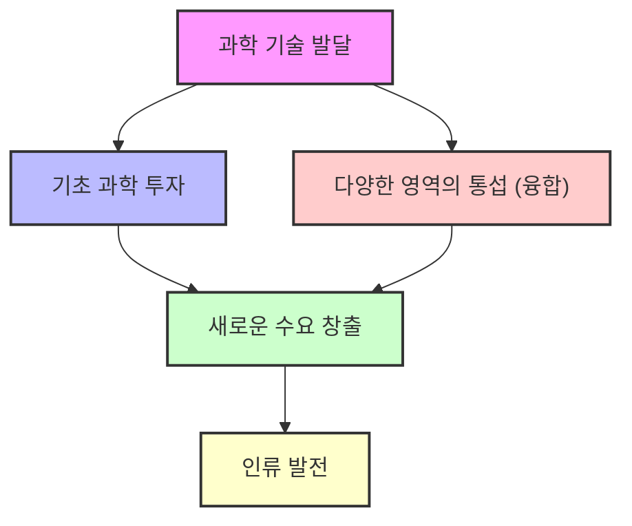

## 디맨드: 세상의 수요를 미리 알아챈 사람들
이 책은 세상의 새로운 수요(사람들이 원하는 것)를 미리 알아채거나 만들어낸 사람들의 이야기를 다루고 있어. 마케팅이나 경영에 대한 어려운 이론 대신, 실제 사례들을 통해 어떻게 사람들의 마음을 사로잡고 새로운 시장을 만들었는지 쉽게 설명해 주는 책이야. 

## 1. 수요 창출의 본질: 사람을 이해하는 것 

1. **진정한 **수요** 창조자는 사람을 이해하는 데 모든 시간을 쏟아붓는 사람이야.** 
  - 마치 소설을 읽으면서 인간의 감정, 광기, 슬픔 같은 걸 배우는 것처럼, 사람들의 마음을 깊이 들여다보는 게 중요해. 
  - 사람들이 무엇을 열망하고, 어떤 크고 작은 불편함(고충)을 겪는지 이해하고 해결하려는 노력이 새로운 수요를 만들어내는 핵심이라고 보면 돼. 

2. **전술적인 **마케팅** 활동은 일시적일 뿐이야.** 
  - 광고, 판촉, 쿠폰 배포 같은 활동들은 잠시 동안 매출을 늘릴 수 있지만, 이런 활동을 멈추면 원래대로 돌아가 버려. 
  - 이런 건 마치 반짝 효과를 내는 임시방편 같은 거지, 근본적인 해결책은 아니라는 거야. 

## 2. 넷플릭스(Netflix) 탄생 이야기: 불편함에서 시작된 혁신 

1. **연체료라는 작은 불편함이 거대한 아이디어가 됐어.** 
  - 1996년, 넷플릭스 창업자 리드 헤이스팅스는 비디오를 빌려 보고 제때 반납하지 못해서 40달러(약 5만 원)라는 비싼 연체료를 물게 됐어. 
  - 그는 "이 돈이면 비디오를 새로 사는 게 낫겠다"고 생각하며 아내에게 혼날까 봐 걱정했지. 
  - 며칠 뒤 헬스클럽에 갔다가 문득 이런 생각을 하게 돼. "헬스클럽은 매달 일정한 회비만 내면 언제든 자유롭게 이용하는데, 왜 비디오 대여점은 연체료를 내야 할까?" 

2. **헬스클럽 모델을 비디오 대여에 적용하다.** 
  - 그는 비디오 대여도 헬스클럽처럼 일정한 멤버십 요금을 받고, 연체료 압박 없이 고객이 원하는 영화를 언제든지 빌려볼 수 있게 하면 어떨까 고민했어. 
  - 이런 고민 끝에 우편으로 DVD를 배달해주는 넷플릭스가 탄생하게 된 거야. 

3. 블록버스터**(Blockbuster)의 실수와 넷플릭스의 성장.** 
  - 넷플릭스는 초기에 당시 최대 비디오 대여점인 블록버스터에 인수 제안을 했지만, 블록버스터는 이를 무시했어. 
  - 만약 블록버스터가 넷플릭스를 인수했다면, 오늘날의 넷플릭스는 없었을지도 몰라. 
  - 블록버스터는 DVD 시장이 커지자 뒤늦게 뛰어들었지만, 넷플릭스보다 5년이나 늦었어. 
  - 넷플릭스는 블록버스터의 추격을 예상하고 꾸준히 준비했고, 블록버스터가 기업 사냥꾼의 개입으로 혼란을 겪는 사이 넷플릭스는 계속 성장했지. 
  - 결국 블록버스터는 2010년에 파산했고, 넷플릭스는 2020년에 회원 수 2억 명을 돌파하는 거대 기업으로 성장했어. 

## 3. 수요 창출의 6단계 핵심 전략 

이 책에서는 수요를 만들어내는 6가지 핵심 단계를 설명하고 있어. 이 단계들은 서로 연결되어 있고, 한 기업이 이 모든 단계를 완벽하게 해내기는 어렵지만, 각 단계에서 어떤 노력을 해야 하는지 보여주는 중요한 지침이 돼. 

1. **매력 (Attraction): 참을 수 없을 정도로 끌리는 제품을 만들어라.** 
  - 사람들이 "와, 이건 정말 대박이야!"라고 열광하고, 주변에 소문낼 만큼 매력적인 제품을 만들어야 해. 
  - 이런 제품은 고객들이 팬이 될 만큼 강력한 끌림이 있어야 해. 

2. 고충 지도** (Pain Map): 고객의 불편함을 찾아 해결하라.** 
  - 고객들이 제품을 사용하면서 겪는 시간 낭비, 비용, 짜증 같은 불편함(고충)을 꼼꼼히 파악하고, 그걸 해결하는 방법을 찾아야 해. 
  - 마치 아픈 곳을 지도에 표시하듯이, 고객의 불편함을 정확히 파악하는 게 중요해. 

3. **배경 스토리 (Backstory): 제품을 둘러싼 생태계까지 고려하라.** 
  - 제품 자체의 기능도 중요하지만, 그 제품을 둘러싼 환경, 서비스, 사용자 경험(에코 시스템)까지 함께 봐야 해. 
  - 마치 영화를 볼 때 배우뿐만 아니라 감독, 시나리오, 배경 음악까지 전체를 보는 것과 같아. 

4. 방아쇠** (**Trigger**): 고객의 행동을 유발하는 결정적인 계기를 만들어라.** 
  - 아무리 좋은 제품이라도 사람들이 익숙하지 않으면 사용하지 않아. 
  - 고객의 무관심, 의심, 습관을 깨고 행동하게 만드는 결정적인 계기(방아쇠)가 필요해. 
  - 마치 총의 방아쇠를 당기면 총알이 나가듯이, 고객의 구매 행동을 유발하는 한 방이 필요하다는 거야. 

5. 궤도** (Orbit): 성공에 안주하지 말고 끊임없이 발전시켜라.** 
  - 초기 성공에 만족하지 않고, 계속해서 제품과 서비스를 개선하고 발전시켜야 해. 
  - 마치 인공위성이 궤도를 돌면서 계속 움직이듯이, 시장의 변화에 맞춰 끊임없이 진화해야 한다는 거지. 

6. **개별화 (Customization): 모든 고객을 똑같이 보지 마라.** 
  - 모든 고객에게 맞는 만병통치약 같은 제품은 없어. 
  - 고객마다 다른 요구(니즈)와 불편함(고충)이 있기 때문에, 개별 고객의 다양한 요구에 맞춰 제품과 서비스를 제공해야 해. 
  - 마치 옷을 맞춤 제작하듯이, 고객 한 명 한 명에게 집중하는 것이 중요해. 

## 4. 매력적인 제품 만들기: 집카(Zipcar)와 웨그먼스(Wegmans) 사례 

1. **집카(Zipcar): 자동차 공유 서비스의 매력.** 
  - 미국처럼 자동차가 많은 나라에서 "굳이 차를 소유해야 할까?"라는 질문에서 시작된 서비스야. 
  - 기름값 상승, 경제적 어려움 등으로 차를 소유하는 부담이 커지면서, 차를 소유하지 않고도 필요할 때마다 쓸 수 있는 방법이 없을까 고민했지. 
  - 집카는 다른 사람이 쓴 차를 내가 쓴다는 느낌을 주지 않기 위해 '쉐어링'이라는 말 대신 '집카'라는 이름을 사용했어. 

2. **집카의 성공 비결: **수요** 밀도 높이기.** 
  - 사람들이 차를 필요로 하는 건 "어디든 간단하게 가고 싶을 때 손쉽게 시동 걸고 바로 갈 수 있는 편리함" 때문이야. 
  - 이전에도 차 공유 시스템이 있었지만, 차를 반납한 곳까지 다시 가야 하는 불편함 때문에 성공하지 못했어. 
  - 집카는 이 불편함을 해결하기 위해 수요<mark> 밀도</mark>를 높이는 전략을 썼어. 
  - 수요 밀도는 마치 잉크 한 방울을 강물에 떨어뜨리면 티가 안 나지만, 작은 컵에 떨어뜨리면 물 색깔이 바뀌는 것처럼, 특정 지역에 서비스를 집중해서 고객들이 변화를 체감하게 하는 거야. 
  - 미국 전역에 서비스를 깔면 돈이 너무 많이 드니까, 특정 소도시(예: 캠브리지, 보스턴)를 정해서 그곳에만 집중적으로 차를 배치했어. 
  - 고객들이 집에서 5분 거리 안에 있는 주차장에서 언제든지 깨끗한 차를 바로 이용할 수 있게 만든 거지. 
  - 이런 편리함 덕분에 그 동네 사람들은 "차를 살 필요가 없겠다"고 생각했고, 입소문이 나면서 다른 동네로 확산될 수 있었어. 
  - 특히 젊고, 기술에 능숙하고, 환경 보호에 관심 많고, 절약을 추구하는 층을 공략했어. 

3. **웨그먼스(Wegmans): 할인점과의 경쟁에서 살아남은 식품점.** 
  - 오래된 식품점인 웨그먼스는 월마트 같은 거대 할인점들이 식품 시장에 뛰어들면서 위기를 맞았어. 
  - 할인점들은 대량 구매와 저렴한 가격으로 시장을 장악했지만, 웨그먼스는 다른 전략을 택했지. 

4. **웨그먼스의 전략: **카테고리 킬러**(Category Killer)와 고객 맞춤 서비스.** 
  - 웨그먼스는 <mark>카테고리 킬러</mark> 전략을 사용했어. 
  - **카테고리 킬러**는 특정 품목(카테고리)에서는 내가 최고라는 뜻이야. 다른 건 몰라도 이 분야에서는 내가 압도적으로 뛰어나다는 거지. 
  - 예를 들어, 장난감 분야의 토이저러스(Toys"R"Us)처럼 말이야. 
  - 웨그먼스는 샌드위치나 소스 같은 특정 품목의 종류를 다른 할인점보다 5배에서 10배 이상 압도적으로 많이 구비했어. 
  - 고객과 지역을 분석해서 그들에게 필요한 모든 것을 제공하려고 노력했지. 
  - 고객이 원하는 제품이 없으면 바로 구해서 갖다 주는 서비스도 제공했어. 
  - 이런 노력 덕분에 웨그먼스는 고객들에게 "저기 가면 늘 풍부하고 새로운 것을 느낄 수 있다"는 인식을 심어줬고, 지금도 많은 도시에서 웨그먼스 매장을 유치하고 싶어 해. 

## 5. 고충 지도 찾아내기: 은행 번호표와 교향악단 주차 문제 

1. 고객의 불편함**(**고충**)을 해결하면 엄청난 수요가 생겨.** 
  - 사람들이 "아, 이거 진짜 불편한데..."라고 느끼는 점을 찾아내서 해결해주면 돼. 
  - 필요해서 쓰긴 하지만 쓸 때마다 아쉬운 점, 짜증 나는 점을 개선하면 고객들의 만족도가 폭발적으로 높아진다는 거야. 

2. **은행 번호표: 줄 서는 불편함을 없애다.** 
  - 예전에는 은행에 가면 줄을 서서 기다려야 했어. 
  - 어떤 줄이 짧은지 눈치껏 보고, 앞에 사람이 서류 뭉치를 꺼내면 절망하는 상황이 많았지. 
  - 하지만 번호표 시스템이 도입되면서 이런 불편함이 사라졌어. 
  - 번호표를 뽑고 우아하게 앉아서 잡지를 보거나 기다리다가 자기 차례가 되면 업무를 보면 돼. 
  - 이 작은 변화 하나가 고객과 은행 직원 모두에게 편리함을 가져다준 거야. 

3. **교향악단 주차 문제: 고객의 진짜 불편함을 찾아라.** 
  - 어떤 도시의 교향악단은 공연 관람객이 적어서 고민이었어. 
  - 사람들은 "클래식을 몰라서 안 오는 걸 거야"라고 생각하고 클래식 저변 확대를 위한 노력을 했지만, 효과가 없었지. 
  - 면밀히 조사해보니, 가장 큰 문제는 <mark>주차</mark>였어. 
  - 공연장 주차 시스템이 제대로 되어 있지 않아서 주차하기 귀찮고 비싸고, 시간도 많이 걸렸던 거야. 
  - 고객들은 공연을 보러 왔다가 주차 때문에 짜증이 나서 다시 오지 않았던 거지. 
  - 주차 문제를 해결하자 관람객이 늘기 시작했어. 
  - 이 사례는 우리가 고객의 불편함을 섣불리 짐작하지 말고, 고객의 입장에서 직접 경험하고 찾아내야 한다는 것을 보여줘. 

4. 블룸버그 통신**(Bloomberg): 정보의 속도와 정확성으로 승부하다.** 
  - 마이클 블룸버그는 주식 거래 회사에서 해고당한 후, 돈을 벌기 위해서는 <mark>정확하고 빠른 정보</mark>가 가장 중요하다는 것을 깨달았어. 
  - 그는 남들보다 빨리 정보를 가공하고 제시하며, 시장가에 따라 거래가 이루어지는 시스템의 속도를 구현하기 시작했지. 
  - 그는 자신의 시스템을 주변 사람들에게 무료로 제공했고, 이 시스템은 "내가 알지 못하는 다양한 정보를 손쉽게 가공할 수 있다"는 점에서 큰 호응을 얻었어. 
  - 특히 경제 위기 때 많은 사람이 해고당했을 때, 블룸버그는 자신의 단말기를 무료로 제공하며 그들이 다시 일어설 수 있는 발판을 마련해 줬어. 
  - 이후 많은 증권 회사들이 블룸버그 시스템을 사용하는 것을 채용 조건으로 내걸 정도로 필수적인 도구가 되었고, 블룸버그는 뉴욕 시장까지 역임하게 돼. 
  - 이처럼 고객의 가장 큰 불편함(정보의 부족과 느린 속도)을 해결해 주는 것이 엄청난 시너지를 일으킨다는 것을 보여주는 사례야. 

## 6. 배경 스토리 창조: 테트라팩(Tetra Pak)과 애플(Apple) 

1. **제품에 스토리를 담아라.** 
  - 사람들은 제품의 기능이나 품질뿐만 아니라, 그 제품이 가진 <mark>스토리</mark>와 <mark>배경 이야기</mark>를 함께 살 때 더 큰 만족감을 느껴. 
  - 마치 잡지에서 제품이 탄생한 배경, 원료, 제작 과정 등을 자세히 설명해 주면 제품에 대한 이해도와 애착이 높아지는 것과 같아. 

2. 테트라팩**(Tetra Pak): 냉장고 없이도 신선함을 유지하는 포장.** 
  - 테트라팩은 종이팩에 우유를 담으면 1년 동안 신선함을 유지할 수 있는 포장 기술이야. 
  - 유럽 사람들은 냉장고를 잘 믿지 않아서, 냉장고에 넣지 않아도 오래 보관할 수 있는 테트라팩을 개발했어. 
  - 이 기술은 우유뿐만 아니라 다양한 식품의 유통 방식을 혁신했고, 제품의 배경 스토리가 얼마나 중요한지 보여주는 사례야. 

3. **애플(Apple): 스티브 잡스의 철학이 담긴 스토리.** 
  - 애플 제품을 쓰는 많은 사람들은 스티브 잡스가 "남들이 생각하지 못했던 길을 처음 간 것"을 좋아한다고 말해. 
  - 삼성에서 더 좋은 기능의 제품이 많이 나와도, 애플의 단순하고 혁신적인 디자인과 철학에 끌리는 이유가 바로 이 <mark>배경 스토리</mark> 때문이야. 
  - 기업의 숨겨진 이야기나 창업자의 철학이 제품의 이미지를 만들고, 고객의 구매 결정에 큰 영향을 미친다는 것을 알 수 있어. 

4. 소니**(Sony) 리브로 vs. 아마존(Amazon) **킨들**(Kindle): 에코 시스템의 중요성.** 
  - 소니는 아마존보다 3년 먼저 전자책 '리브로'를 출시했지만 실패했고, 아마존의 '킨들'은 대박을 쳤어. 
  - 소니 리브로는 디자인도 뛰어났지만, 왜 실패했을까? 
  - **핵심은 제품을 둘러싼 **에코 시스템** (생태계)이었어.** 
  - 아마존은 이미 출판계와 깊은 관계를 맺고 있었고, 인터넷으로 책을 판매하는 경험이 풍부했어. 
  - 킨들은 수많은 책을 무제한으로 다운로드받아 볼 수 있었고, 인터넷 접속 없이도 책을 구매할 수 있었지. 
  - 반면 소니는 출판사들과 협력이 부족했고, 책 구매 방식도 불편했어. 
  - 또한, 아마존은 처음부터 풍부한 <mark>고객 후기</mark>가 있었지만, 소니는 후기가 거의 없어서 사람들이 제품을 신뢰하기 어려웠어. 
  - 이처럼 제품 자체의 성능보다 제품을 둘러싼 전체적인 환경과 서비스가 훨씬 중요하다는 것을 보여주는 사례야. 

## 7. 방아쇠 당기기: 넷플릭스(Netflix)의 배송 시스템 

1. **습관을 만들고 행동을 유발하는 **방아쇠**가 필요해.** 
  - 아무리 좋은 제품이라도 사람들이 익숙하지 않으면 사용하지 않아. 
  - 소비자의 <mark>관성</mark>(하던 대로 하려는 경향), <mark>의심</mark>, <mark>무관심</mark>을 깨고 새로운 습관을 만들게 하는 결정적인 계기(방아쇠)가 중요해. 
  - 마치 아침에 일어나면 칫솔질을 하는 것처럼, 새로운 제품 사용을 습관으로 만들어야 한다는 거야. 

2. 넷플릭스**(Netflix)의 배송 시스템 혁신.** 
  - 넷플릭스는 초기에 샌프란시스코 지역에서만 잘 되고 다른 지역에서는 부진했어. 
  - 창업자는 통계 분석을 통해 그 이유를 찾아냈지. 
  - 샌프란시스코에는 DVD 배송 센터가 있어서, 고객들이 DVD를 반납하면 하루 만에 새 DVD를 받을 수 있었어. 
  - 하지만 다른 지역은 배송 센터가 멀어서 DVD를 받고 반납하는 데 5~6일이 걸렸지. 
  - 마치 주말 드라마를 한꺼번에 몰아봐야 재미있는데, 한 편 보고 일주일을 기다리면 답답해서 안 보게 되는 것과 같아. 
  - 넷플릭스는 이 문제를 해결하기 위해 각 동네마다 배송 센터를 늘렸고, 그 결과 가입률이 두 배로 올랐어. 
  - 이처럼 <mark>빠른 배송</mark>이라는 방아쇠가 고객들의 행동을 유발하고 새로운 습관을 만들게 한 거야. 

## 8. 궤도 구축: 네스프레소(Nespresso)의 끊임없는 혁신 

1. **성공에 안주하지 않고 더 가파른 **궤도**를 구축하라.** 
  - 초기 성공에 만족하지 않고, 끊임없이 제품과 서비스를 개선하고 발전시켜야 해. 
  - 마치 삼성전자가 선두를 달리고 있어도 만족하지 않고, 후발 주자들이 감히 따라올 수 없을 만큼 격차를 벌리려고 노력하는 것과 같아. 

2. 네스프레소**(**Nespresso**)의 탄생과 초기 실패.** 
  - 네스프레소는 1974년에 처음 개발되었고, 네슬레가 1986년에 별도 법인을 설립하며 커피 머신을 개발했어. 
  - 하지만 초기에는 사무실이나 카페에 팔려고 했지만, 바리스타들이 "우리 손맛이 더 중요하다"며 반대해서 실패했지. 
  - 외부 전문가를 영입해서 밀어붙였지만, 역시 실패로 돌아갔어. 

3. **네스프레소의 전환점: 소비자 직접 **판매** 모델.** 
  - 실패를 겪은 후, 네스프레소는 <mark>소비자 직접 판매 모델</mark> (DTC, Direct-to-Consumer)을 시도했어. 
  - 네슬레 내부에서는 반대가 많았지만, 회장의 강력한 의지로 이사회 승인을 받았지. 
  - 초기에는 첫 3일 동안 3명, 2명, 0명만 등록할 정도로 부진했지만, 품질이 뛰어나 입소문이 나면서 서서히 회원이 늘기 시작했어. 
  - 결국 네스프레소는 "애플의 아이팟이 음악 시장을 바꿨고, 아마존의 킨들이 책 시장을 바꿨듯이, 네스프레소 머신이 커피 시장을 바꿨다"는 평가를 받을 정도로 성공했어. 

4. **네스프레소의 **궤도** 확장: 체험 공간과 **조지 클루니**.** 
  - 성공에 안주하지 않고, 네스프레소는 계속해서 궤도를 확장했어. 
  - 1994년에는 비행기 일등석 서비스에 제공하고, 오피니언 리더들에게 제품을 무료로 제공해서 입소문을 냈어. 
  - 2000년대에는 "체험이 중요하다"는 생각으로 백화점에 <mark>부티크</mark>(체험 매장)를 열어 고객들이 직접 커피를 맛보고 경험할 수 있게 했어. 
  - 특히 2006년부터는 할리우드 배우 <mark>조지 클루니</mark>를 광고 모델로 기용하면서 전 세계적으로 폭발적인 인기를 얻었어. 
  - 조지 클루니의 섹시하고 세련된 이미지가 네스프레소의 브랜드 가치를 높이는 데 큰 역할을 한 거야. 

## 9. 개별화 전략: 모든 고객을 똑같이 보지 마라 

1. **평균적인 고객****은 존재하지 않아.** 
  - 모든 상황에 맞는 만병통치약 같은 제품이나 서비스는 없어. 
  - 고객들은 서로 다른 불편함(고충)을 가지고 있고, 심지어 같은 고객이라도 시간이 지나면 원하는 것이 달라져. 
  - 따라서 고객의 다양한 요구에 맞춰 제품과 서비스를 <mark>개별화</mark>하는 것이 매우 중요해. 

2. 네스프레소**(**Nespresso**)의 제품 다양화.** 
  - 네스프레소는 가정용, 기업용, 자동 판매기, 호텔용 등 다양한 고객층에 맞춰 제품을 세분화했어. 
  - 같은 제품이라도 극장에서는 3천 원, 대학가에서는 1천 원에 판매하는 등 상황에 맞춰 가격을 다르게 책정하기도 했지. 

3. 프레타 망제**(Pret A Manger): 고객 의견을 즉각 반영하는 식당.** 
  - 영국 런던에서 시작된 '프레타 망제'는 질 좋고 값싸고 깨끗한 점심 식사를 제공하는 밥집이야. 
  - 점심시간에 비싸고 질 낮은 음식을 먹는 것에 불만을 느낀 창업자가 "스마트하게 먹을 수 있는 방법은 없을까?" 고민해서 만들었지. 
  - 이곳은 편의점처럼 진열된 샌드위치나 음료수를 골라 계산하고 바로 먹을 수 있는 시스템이야. 
  - 특히 <mark>방부제를 일체 사용하지 않고</mark> 바로 만든 제품만 제공하며, 팔리지 않은 음식은 버리는 것을 원칙으로 해. 

4. **프레타 망제의 고객 중심 경영.** 
  - 프레타 망제는 고객의 의견을 <mark>100% 반영</mark>하는 것으로 유명해. 
  - 매일 아침 회의에서 전날 들어온 고객들의 음식, 서비스, 청결에 대한 제안을 논의하고 즉각적으로 개선해. 
  - 고객이 제안한 메뉴를 오디션을 통해 선정하고, "오늘 이런 테마로 오디션을 통해 선정된 제품입니다"라고 홍보하기도 해. 
  - 매장 직원들에게 고객의 불만이나 요구 사항을 <mark>즉각적으로 처리할 수 있는 권한</mark>을 부여했어. 
  - 이런 노력 덕분에 프레타 망제는 다른 기업들이 따라올 수 없는 독보적인 경쟁력을 갖게 되었어. 
  - 프랜차이즈 제안이 많았지만, 유기농 닭 같은 비싼 재료의 품질을 통제할 수 없다는 이유로 거절하기도 했어. 

## 10. 과학 기술과 수요 창출의 미래 

1. **거대한 수요는 ****과학 기술****이 만들어낸다.** 
  - 작은 수요들은 기업의 노력으로 만들어지지만, 인류의 삶을 완전히 바꾸는 거대한 수요는 과학 기술의 발전에서 시작돼. 
  - 예를 들어, 벨 연구소에서 트랜지스터를 발명한 것이 오늘날 인터넷 정보통신 시대를 만든 것처럼 말이야. 

2. **기초 과학 투자와 연구소의 역할.** 
  - 미국이 세계 시장을 제패할 때는 기업들이 단기적인 이익뿐만 아니라, 기업 이익과 직접적인 관련이 없는 <mark>근본적이고 기초적인 과학 기술</mark>에 엄청나게 투자했어. 
  - 연구소들이 활발하게 활동하며 새로운 기술을 개발하는 것이 중요했지. 

3. 통섭**(융합)과 다양한 영역의 연결.** 
  - 이제는 어떤 한 분야에만 국한되지 않고, 다양한 영역의 지식과 기술을 <mark>융합</mark>(통섭)하는 것이 중요해. 
  - 이런 복합적인 접근 방식이 새로운 수요를 창출하는 데 큰 역할을 할 거야. 

4. **미래를 위한 과학 기술 투자.** 
  - 저자는 현재 미국이 과거처럼 과학 기술에 투자하지 않는 것을 우려하고 있어. 
  - 우리나라도 과학 기술 투자가 인색하고, 이공계 기피 현상이 심화되는 점을 반성해야 한다고 말해. 

## 11. 거울을 보는 수요 창조자: 나 자신과 주변의 불편함 찾기 

1. **수요를 만들어내는 사람은 ****거울****을 본다.** 
  - 거울을 본다는 것은 <mark>나 자신을 들여다보고</mark>, 내 주변에서 무엇이 불편한지 주의 깊게 살피는 것을 의미해. 
  - 마치 거울을 보면서 내 얼굴에 뭐가 묻었는지, 옷이 잘 어울리는지 확인하는 것처럼, 내 삶과 주변의 불편함을 찾아내는 것이 중요해. 

2. **홈쇼핑 회사의 사례: 직원들의 라이프스타일에 맞추다.** 
  - 어떤 홈쇼핑 회사는 초기에 40대 주부를 타겟으로 했지만, 직원들이 대부분 20대여서 고객을 잘 이해하지 못했어. 
  - 사장은 "타겟에 대한 이해도가 떨어진다"고 판단하고, <mark>아이템 소싱과 타겟팅을 직원들의 라이프스타일에 맞춰</mark> 다시 정리했어. 
  - 직원들이 회의 때마다 "이거 필요하니?", "이 가격이면 살 거니?"라고 질문하며 자신들의 필요에 맞춰 제품을 선정했지. 
  - 이런 방식으로 회사는 성장했고, 직원들이 나이가 들고 결혼하고 아이를 낳으면서 유아용품, 수납 가구 등 새로운 아이템들이 자연스럽게 추가되었어. 
  - 이처럼 <mark>자신과 주변의 </mark>불편함을 해결하는 것에서부터 새로운 수요가 시작될 수 있다는 것을 보여주는 사례야. 

3. 수요** 창출의 시작: **고충** 지도와 결정적인 **방아쇠**.** 
  - 내가 무엇을 불편해하는지, 내 주변의 고충 지도를 그려볼 줄 안다면, 거기서 시장의 수요가 창출될 수 있어. 
  - 그 불편함을 해결했을 때, <mark>결정적인 </mark>방아쇠를 당겨 급격한 수요를 일으키고, 끊임없이 개선해 나가야 해. 
  - 이 모든 과정에서 <mark>모든 사람을 똑같이 보지 않고</mark>, 과학 기술의 발달을 끊임없이 살피며 업무에 접목시키는 노력이 필요해. 

