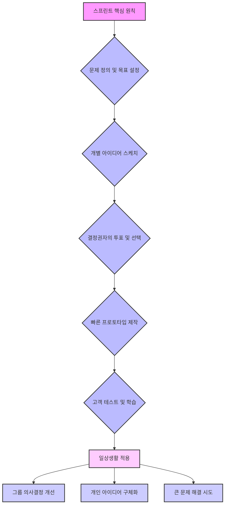
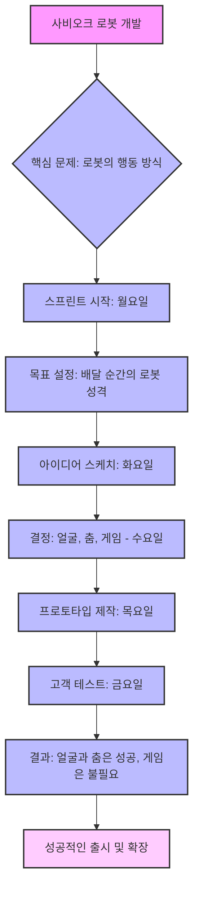

## 스프린트: 5일 만에 큰 문제를 해결하고 새로운 아이디어를 테스트하는 방법
이 책은 구글 벤처스(Google Ventures)에서 개발한 5일짜리 특별한 문제 해결 프로세스인 '스프린트'에 대해 알려주는 책이야. 복잡한 문제를 빠르게 해결하고, 새로운 아이디어를 고객에게 직접 테스트해서 성공 가능성을 미리 확인하는 방법을 알려줄 거야. 마치 미래로 시간 여행을 가서 제품이 잘 될지 안 될지 미리 보고 오는 것과 같다고 보면 돼. 

## 1. 스프린트의 탄생 배경: 왜 5일 만에 해결해야 할까? 

스프린트는 구글에서 일하던 제이크 냅이 비효율적인 업무 방식에 지쳐서 만들게 된 방법이야. 그는 아들이 태어나면서 회사에서 보내는 시간이 정말 중요하다고 느꼈어. 

1. **전통적인 업무 방식의 문제점**:
  - 매일 회의에 시달리고, 이메일을 확인하느라 정작 중요한 일은 못 하는 경우가 많았어. 
  - 아이디어를 내기 위해 그룹 브레인스토밍(다 같이 모여서 아이디어를 마구 쏟아내는 회의)을 하면, 목소리 큰 사람 의견만 반영되거나 좋은 아이디어가 묻히는 일이 많았지. 
  - 몇 달, 심지어 몇 년 동안 제품을 개발했는데, 막상 출시하고 보니 고객들이 원하지 않는 경우도 허다했어. 
  - 이런 비효율적인 과정을 저자는 '첨(churn)'이라고 불렀어. 마치 세탁기가 계속 돌아가기만 하고 빨래는 제대로 안 되는 것처럼, 시간만 보내고 성과는 없는 상태를 말하는 거야. 

2. **문제 해결을 위한 노력**:
  - 제이크는 처음에는 개인적인 생산성을 높이려고 노력했어. '4시간 근무', '끝내기' 같은 시간 관리 책을 읽고, 할 일 목록을 만들면서 회의 사이의 짧은 시간도 최대한 활용했지. 
  - 하지만 개인의 생산성만으로는 팀 전체의 문제를 해결할 수 없다는 걸 깨달았어. 
  - 그래서 그는 '일주일 전체를 깨끗하게 지우고 처음부터 다시 시작한다면 어떨까?' 하고 생각했어. 
  - 이런 고민 끝에 하루짜리 워크숍부터 시작해서, 결국 일주일 동안 진행되는 '스프린트'라는 프로세스를 만들게 된 거야. 

3. 구글 벤처스**(**GV**)에서의 발전**:
  - 2012년, 제이크는 구글 벤처스(지금은 GV라고 불려)로 옮겨서 스프린트 프로세스를 스타트업(새로 시작하는 작은 회사)에 적용하기 시작했어. 
  - 스타트업은 아이디어가 많지만, 어떤 아이디어에 집중해야 할지, 어떤 아이디어가 성공할지 알기 어렵잖아? 
  - 보통은 아이디어를 제품으로 만들고 출시해야만 고객 반응을 알 수 있는데, 제품을 만드는 데는 생각보다 훨씬 오래 걸려. 몇 주 걸릴 것 같아도 몇 달이 걸리고, 몇 달 걸릴 것 같아도 몇 년이 걸릴 수 있지. 
  - 이런 불확실성 때문에 사람들은 새로운 아이디어를 시도하는 것을 주저하고, 어떤 아이디어를 선택할지 끝없이 논쟁하게 돼. 
  - 스프린트는 이런 문제를 해결해 줬어. 단 일주일 만에 아이디어를 빠르게 테스트하고 고객 데이터를 얻을 수 있게 해준 거야. 
  - 이 덕분에 스타트업들은 더 위험한 아이디어도 훨씬 빠르게 시도해볼 수 있게 되었어. 

## 2. 스프린트의 핵심: 5일간의 시간 여행 

스프린트는 마치 미래로 가는 시간 여행과 같아. 제품을 다 만들기도 전에 고객 반응을 미리 볼 수 있게 해주는 거지. 이 과정은 5일 동안 진행되며, 각 요일마다 정해진 단계가 있어. 

1. **스프린트의 기본 원칙**:
  - **집중된 **개인 작업: 그룹 브레인스토밍 대신 각자 조용히 아이디어를 스케치하는 시간을 가져. 
  - **빠른 **프로토타입** 제작**: 완벽한 제품이 아니라, 고객에게 보여줄 수 있는 '가짜' 제품(프로토타입)을 빠르게 만들어. 
  - **엄격한 마감 기한**: 일주일이라는 짧은 시간 안에 모든 것을 끝내야 한다는 압박감이 집중력을 높여줘. 
  - **다학제적 팀 구성**: 다양한 분야의 전문가들이 함께 모여 문제를 해결해. 
  - 고객 테스트: 실제 고객에게 프로토타입을 보여주고 반응을 직접 확인해. 

2. 스프린트** 준비: 올바른 시작을 위한 3가지 요소** 
  - **올바른 도전 과제**: 스프린트는 많은 에너지와 집중이 필요하므로, 정말 중요하고 큰 문제에 사용해야 해. 새로운 제품 출시, 촉박한 마감 기한, 혹은 오랫동안 해결되지 않은 문제처럼 '하이 스테이크(high stakes)'한 도전 과제가 적합해. 
  - **올바른 팀**: 마치 영화 '오션스 일레븐'처럼, 다양한 기술과 경험을 가진 소규모 팀(7명 이하)을 꾸려야 해. 
  - 결정권자**(**Decider**)**: 최종 결정을 내릴 권한이 있는 사람이야. CEO나 프로젝트 리더처럼, 이 사람이 없으면 스프린트에서 아무리 좋은 결정을 내려도 소용없어. 
  - 진행자**(**Facilitator**)**: 스프린트 과정을 이끌고, 시간을 관리하고, 팀원들이 문제에 집중할 수 있도록 도와주는 사람이야. 
  - **전문가들**: 재무, 마케팅, 고객 경험, 기술 개발, 디자인 등 다양한 분야의 전문가들이 팀에 포함되어야 해. 이들의 다양한 관점이 최고의 아이디어를 만들어내는 데 중요해. 
  - **올바른 시간과 공간**:
  - **5일간의 집중**: 월요일부터 목요일까지는 오전 10시부터 오후 5시까지, 금요일은 조금 일찍 시작해. 이 시간 동안은 오직 스프린트에만 집중해야 해. 
  - **전용 공간**: 일주일 내내 사용할 수 있는 방을 예약하고, 최소 두 개의 큰 화이트보드가 있어야 해. 이 화이트보드는 팀의 '공유 두뇌' 역할을 해서 모든 정보가 한눈에 보이게 해줘. 
  - **디바이스 금지**: 노트북, 휴대폰, 태블릿 등 모든 전자기기는 치워야 해. 잠깐 이메일을 확인하는 것만으로도 집중력이 흐트러질 수 있거든. 물론 쉬는 시간에는 확인할 수 있어. 

## 3. 스프린트 5일 과정: 월요일부터 금요일까지 

스프린트는 월요일부터 금요일까지 각 요일마다 정해진 목표와 활동이 있어. 마치 요리 레시피처럼 단계별로 따라가면 돼. 

### 3.1. 월요일: 지도를 만들고 목표를 정하는 날 
월요일은 문제의 큰 그림을 그리고, 어디에 집중할지 결정하는 날이야. 마치 보물찾기를 떠나기 전에 지도를 펼쳐놓고 보물이 어디 있는지 확인하는 것과 같아. 

1. **끝에서 시작하기(**Start at the End**)**:
  - 팀원들에게 "우리가 이 프로젝트를 왜 하는가? 6개월 또는 1년 후에 어떤 성공을 꿈꾸는가?"라는 질문을 던져. 
  - 이것은 막연한 목표가 아니라, 구체적이고 낙관적인 미래의 모습이어야 해. 예를 들어, '블루 보틀 커피'는 단순히 '커피를 더 많이 팔자'가 아니라, '온라인 고객에게도 훌륭한 커피 경험을 제공하자'는 목표를 세웠어. 
  - 이 장기 목표는 화이트보드 맨 위에 적어두고, 일주일 내내 팀의 '북극성'처럼 길잡이 역할을 하게 돼. 

2. **비관적인 시나리오 상상하기**:
  - 이제 반대로, "1년 후 이 프로젝트가 완전히 망했다고 상상해보자. 무엇이 잘못되었을까?"라고 질문해. 
  - 이 과정을 통해 팀원들이 숨기고 있던 걱정이나 가정들을 끄집어낼 수 있어. 예를 들어, 로봇 회사 '사비오크'는 손님들이 로봇을 어색해하거나 혼란스러워할까 봐 걱정했어. 
  - 이런 걱정들을 "손님들이 로봇을 어색해할까?"와 같은 질문으로 바꾸면, 스프린트에서 해결해야 할 가장 중요한 위험 요소 목록이 만들어져. 

3. **지도 그리기(Draw the Map)**:
  - 복잡한 기술 다이어그램이 아니라, 고객 중심의 간단한 이야기를 그림으로 그려. 
  - 화이트보드 왼쪽에 고객이나 사용자와 같은 '주요 인물'을 나열해. 
  - 오른쪽에는 '성공적인 결과'를 적어. 
  - 가운데에는 시작부터 끝까지 이어지는 몇 가지 '핵심 단계'를 그려 넣어. 
  - 사비오크의 경우, '손님', '프런트 데스크', '로봇', '복도 행인'이 주요 인물이었고, '성공적인 배달'이 결과였어. 지도는 손님이 프런트에 전화하고, 직원이 로봇에 물건을 넣고, 로봇이 로비, 엘리베이터, 복도를 거쳐 손님 방으로 가는 과정을 보여줬지. 
  - 이 지도는 팀 전체가 고객 경험을 공유하고 이해하는 데 도움을 줘. 

4. **전문가 인터뷰 및 '**어떻게 하면 좋을까**?' 질문 만들기**:
  - 오후에는 팀 내외부의 전문가들을 인터뷰해서 지도를 더 자세히 다듬어. 
  - 각 전문가(사업 전략가, 고객 담당자, 엔지니어, 디자이너 등)는 자신의 지식을 공유하고, 팀은 그 내용을 바탕으로 지도를 계속 업데이트해. 
  - 이때 팀원들은 단순히 듣는 것이 아니라, '어떻게 하면 좋을까?(How Might We?)'라는 질문 형식으로 통찰력을 기록해. 
  - 예를 들어, '고객들이 우리를 신뢰하지 않는다'는 문제를 '어떻게 하면 새로운 고객들과 신뢰를 쌓을 수 있을까?'와 같은 긍정적인 질문으로 바꾸는 거야. 이렇게 하면 문제가 기회로 바뀌고, 다음 날 아이디어 구상의 재료가 돼. 

5. **목표 선정(Pick a Target)**:
  - 월요일의 마지막이자 가장 중요한 일은 결정권자가 '목표'를 정하는 거야. 
  - 일주일 안에 모든 문제를 해결할 수는 없으니, 한 명의 '타겟 고객'과 지도에서 가장 중요한 '결정적인 순간' 하나를 선택해서 집중해야 해. 
  - 사비오크는 '배달 로봇이 손님에게 물건을 전달하는 순간'을 목표로 삼았어. 
  - 이 결정은 남은 일주일 동안 팀의 초점을 명확하게 만들어줘. 

### 3.2. 화요일: 해결책을 스케치하는 날 
화요일은 아이디어를 구체적인 해결책으로 만드는 날이야. 하지만 다 같이 떠들면서 아이디어를 내는 브레인스토밍이 아니라, 각자 조용히 스케치하면서 아이디어를 발전시키는 '함께 혼자 일하기(work alone together)' 방식을 사용해. 

1. **번개 시연(**Lightning Demos**)으로 영감 얻기**:
  - 오전에는 '번개 시연'이라는 활동으로 영감을 얻어. 
  - 각 팀원은 3분 동안 자신이 본 최고의 해결책을 다른 팀원들에게 소개해. 이때 중요한 건 자기 분야가 아닌 다른 산업에서 영감을 찾는 거야. 
  - 예를 들어, 의료 소프트웨어를 만드는 팀이 항공사의 알림 시스템에서 아이디어를 얻거나, 블루 보틀 커피 팀이 고급 초콜릿 회사가 제품 맛을 설명하는 방식에서 영감을 얻는 식이지. 
  - 이 시연은 단순히 베끼는 것이 아니라, 여러 아이디어의 좋은 부분들을 조합하고 개선해서 새로운 것을 만드는 '재료'를 모으는 과정이야. 
  - 진행자는 이 아이디어들을 화이트보드에 간단한 그림으로 그려서, 오후 스케치 작업의 '영감 팔레트'를 만들어줘. 

2. **해결책 **스케치**(Solution Sketch)하기**:
  - 점심 식사 후에는 본격적으로 스케치를 시작해. 많은 사람이 "나는 그림을 못 그려"라고 걱정하지만, 스프린트 스케치는 예술적인 재능이 필요 없어. 
  - 추상적인 아이디어를 구체적인 해결책으로 바꾸는 것이 목표야. 글씨를 쓰고 상자나 막대기 그림을 그릴 수 있으면 충분해. 
  - 스케치 과정은 4단계로 나뉘어 진행돼: 
  - **1단계: 메모하기(Notes)** (20분): 팀원들은 조용히 방을 돌아다니며 월요일에 정한 목표, 지도, '어떻게 하면 좋을까?' 질문, 그리고 오전에 본 번개 시연 내용을 다시 확인하고 메모해. 마치 컴퓨터를 부팅하는 것처럼 뇌를 활성화하는 과정이야. 
  - **2단계: 아이디어 구상(Ideas)** (20분): 각자 종이에 거친 아이디어, 낙서, 다이어그램, 제목 예시 등을 자유롭게 적어. 아직은 지저분해도 괜찮아. 
  - **3단계: 크레이지 에이트(**Crazy Eights**)** (8분): 종이를 8칸으로 접고, 각 칸에 1분씩 8분 동안 자신의 가장 강력한 아이디어를 8가지 다른 방식으로 스케치해. 이 빠른 속도는 첫 번째로 떠오르는 뻔한 아이디어를 넘어 더 다양한 대안을 탐색하도록 강제해. 
  - **4단계: 해결책 스케치(Solution Sketch)** (30분 이상): 이제 자신의 최고의 아이디어를 3칸짜리 스토리보드(만화처럼 단계별로 보여주는 그림)로 자세히 그려. 이 스케치는 다른 사람의 설명 없이도 이해할 수 있어야 하고, 누가 그렸는지 알 수 없도록 익명으로 작성하며, 눈길을 끄는 제목이 있어야 해. 그림의 질보다는 아이디어의 질에 집중하는 것이 중요해. 
  - 블루 보틀 커피의 커뮤니케이션 매니저인 바이런 던컨은 그림을 못 그린다고 했지만, '마음 읽는 사람(Mind Reader)'이라는 멋진 해결책을 스케치했어. 바리스타가 손님에게 "집에서 커피를 어떻게 만드시나요?"라고 묻는 것처럼, 웹사이트가 고객의 질문에 따라 원두를 추천하는 방식이었지. 상자와 글씨로만 이루어졌지만, 아주 훌륭한 아이디어였어. 
  - 화요일이 끝나면, 팀은 각자 구상한 구체적이고 경쟁력 있는 해결책 스케치들을 잔뜩 가지게 돼. 모두가 각자 작업했기 때문에 '집단 사고(groupthink)'의 함정을 피할 수 있어. 

### 3.3. 수요일: 결정을 내리는 날 
수요일은 화요일에 나온 수많은 아이디어 스케치 중에서 어떤 것을 프로토타입으로 만들지 결정하는 날이야. 자칫하면 끝없는 논쟁으로 이어질 수 있지만, '스티커 결정(sticky decision)'이라는 5단계 과정을 통해 효율적으로 결정을 내려. 

1. **미술관 만들기(Art Museum)**:
  - 모든 해결책 스케치를 벽에 그림처럼 붙여서 '미술관'을 만들어. 

2. 히트맵**(**Heat Map**)으로 관심사 파악**:
  - 팀원들은 작은 점 스티커를 가지고 조용히 미술관을 돌아다니며, 흥미롭다고 생각하는 스케치의 부분에 스티커를 붙여. 
  - 누가 그렸는지, 누가 아이디어를 잘 설명하는지와 상관없이, 스티커가 많이 붙은 곳은 가장 매력적인 아이디어라는 것을 보여주는 '히트맵'이 돼. 

3. **스피드 비평(Speed Critique)**:
  - 팀은 각 스케치 앞에 모여. 진행자는 스케치의 내용과 스티커가 많이 붙은 부분을 빠르게 설명해. 
  - 팀원들은 3분 동안 주요 내용에 대해 토론해. 스케치를 그린 사람은 맨 마지막에 그룹이 놓친 부분이 있으면 설명만 해. 이렇게 하면 자신의 아이디어를 방어적으로 설명하는 것을 막고, 아이디어 자체의 장점으로 평가받을 수 있어. 

4. **여론 조사(**Straw Poll**)**:
  - 모든 스케치에 대한 비평이 끝나면, 각 팀원은 큰 점 스티커 하나를 받아서 자신이 생각하는 최고의 해결책에 조용히 투표해. 
  - 이 투표는 결정권자에게 팀의 의견을 알려주는 비구속적인(꼭 따라야 하는 것은 아닌) 투표야. 

5. 슈퍼 투표**(Super Vote)**:
  - 이제 결정권자가 나설 차례야. 결정권자는 자신의 이니셜이 적힌 특별한 스티커 3개를 받아. 
  - 결정권자만이 최종적이고 구속력 있는 결정을 내려. 여론 조사를 따를 수도 있고, 완전히 다른 방향으로 갈 수도 있어. 결정권자가 스티커를 붙인 아이디어가 프로토타입으로 만들어질 거야. 
  - 이 과정은 팀의 집단 지혜를 존중하면서도, 결정권자의 권한과 책임을 명확히 해줘. 

6. 럼블**(Rumble) - 아이디어들의 대결**:
  - 만약 결정권자가 서로 충돌하는 두 가지 좋은 아이디어를 선택했다면 어떻게 할까? 슬랙(Slack) 스프린트에서 이런 일이 있었어. 하나는 제품의 간단한 '가이드 투어'였고, 다른 하나는 '봇(bot) 팀'과 상호작용하는 재미있는 아이디어였지. 이 둘은 합칠 수 없었어. 
  - 이럴 때는 두 아이디어를 모두 프로토타입으로 만들어서 금요일에 고객들에게 직접 테스트해볼 수 있어. 마치 아이디어들의 레슬링 경기처럼, 어떤 아이디어가 실제 고객에게 더 좋은 반응을 얻는지 확인할 수 있는 거야. 

7. 스토리보드** 만들기(Storyboard)**:
  - 오후에는 선택된 아이디어를 바탕으로 '스토리보드'를 만들어. 
  - 이것은 프로토타입을 만들기 위한 단계별 계획이야. 팀은 선택된 스케치들을 모아서 10~15개의 패널로 이루어진 자세한 이야기를 만들어. 
  - 고객이 제품을 처음 발견하는 순간(예: 웹 검색이나 뉴스 기사)부터 모든 클릭과 상호작용까지 자세히 그려 넣어. 
  - 이 스토리보드는 개발을 시작하기 전에 모든 세부 사항과 작은 결정들을 미리 정하게 해서, 목요일에 엄청난 시간을 절약해 줘. 
  - 수요일이 끝나면 가장 어려운 결정들은 모두 끝났고, 이제 프로토타입을 만들 명확한 계획이 생기는 거야. 

### 3.4. 목요일: 가짜를 만드는 날 
목요일은 단 하루 만에 프로토타입을 만드는 날이야. 이때는 '프로토타입 사고방식(prototype mindset)'을 가져야 해. 프로토타입은 완벽한 제품이 아니라, '가짜'라는 것을 명심해야 해. 

1. 프로토타입** 사고방식**:
  - **외관(Facade)**: 프로토타입은 마치 서부 영화 세트장처럼, 앞에서 보면 완전히 진짜 같지만 뒤에는 아무것도 없는 '외관'과 같아. 
  - **골디락스 품질(Goldilocks Quality)**: 너무 조잡해서 가짜인 티가 나도 안 되고, 너무 완벽하게 만들려고 밤새도록 노력해서도 안 돼. 고객에게 솔직한 반응을 얻을 수 있을 정도로만 '딱 적당한' 품질이어야 해. 
  - **빠른 도구 사용**: 완벽함보다는 속도에 최적화된 도구를 사용해야 해. 
  - **디지털 제품**: 웹사이트나 앱 같은 디지털 제품의 경우, 놀랍게도 '키노트(Keynote)'나 '파워포인트(PowerPoint)' 같은 프레젠테이션 소프트웨어를 사용해. 여러 슬라이드를 만들고 클릭 가능한 부분을 연결하면 실제 앱처럼 보이게 할 수 있어. 
  - **물리적 제품**: 3D 프린터로 모형을 만들거나 기존 제품을 개조할 수 있어. 
  - **서비스**: 스크립트를 쓰고 팀원들이 역할을 연기해서 서비스를 시뮬레이션할 수 있어. 예를 들어, '원 메디컬(One Medical)' 팀은 새로운 가족 클리닉을 프로토타입하기 위해 기존 클리닉을 하룻밤 동안 재배치하고 직원들이 실제 가족들과 함께 역할을 연기했어. 
  - **영리한 지름길 찾기**: 어떤 것이든 영리한 지름길을 찾으면 프로토타입으로 만들 수 있다는 마음가짐이 중요해. 
  - 슬랙 팀은 봇이 사용자 질문에 답하는 기능을 프로토타입하기 위해, 실제 AI 봇 대신 '오즈의 마법사'처럼 커튼 뒤에 사람이 앉아서 직접 답변을 입력하는 방식을 사용했어. 

2. **분할 정복(Divide and Conquer) 전략**:
  - 하루 만에 모든 것을 끝내기 위해 팀은 역할을 나누어 작업해. 
  - **제작자(Makers)**: 프로토타입의 개별 부분을 만드는 사람이야. 
  - **작가(Writer)**: 모든 텍스트를 작성하는 사람이야. 
  - **자산 수집가(Asset Collectors)**: 이미지나 아이콘 등을 찾는 사람이야. 
  - **스티처(Stitcher)**: 모든 조각들을 모아서 하나의 매끄러운 프로토타입으로 완성하는 사람이야. 
  - **인터뷰어(Interviewer)**: 금요일 고객 인터뷰를 위한 스크립트를 작성해. 프로토타입 제작 과정에서 떨어져 있어서 편견 없이 인터뷰를 준비할 수 있어. 
  - 오후 3시쯤에는 팀 전체가 프로토타입을 처음부터 끝까지 사용해보는 '시험 실행(trial run)'을 해서 실수를 찾아내. 
  - 목요일이 끝나면, 실제처럼 보이는 프로토타입이 완성되어 금요일의 '진실의 순간'을 기다리게 돼. 

### 3.5. 금요일: 배우는 날 
금요일은 일주일 내내 준비한 모든 것이 결실을 맺는 날이야. 미래를 엿보고 고객의 반응을 직접 확인하는 날이지. 

1. 고객 테스트** 설정**:
  - **1대1 인터뷰**: 인터뷰어는 5명의 타겟 고객과 한 명씩 1시간 동안 인터뷰를 진행해. 
  - **팀원들의 관찰**: 다른 팀원들은 다른 방에서 라이브 비디오 피드를 통해 인터뷰를 지켜보며 메모해. 
  - **5명의 마법**: "단 5명의 고객으로 충분할까?"라고 생각할 수 있지만, 야콥 닐슨(Jacob Nielsen)이라는 사용성 전문가의 연구에 따르면, 5명의 사용자만으로도 제품의 주요 사용성 문제의 약 85%를 발견할 수 있다고 해. 그 이상은 비슷한 패턴이 반복될 뿐이야. 통계적인 정확성보다는 '크고 명확한 패턴'을 찾는 것이 중요하며, 5명이 그 패턴을 찾기에 가장 적절한 숫자야. 

2. **인터뷰 진행 방식**:
  - 인터뷰는 5단계로 구성된 대화로 진행돼. 
  - **1단계: 환영(Welcome)**: 고객을 편안하게 해줘. 
  - **2단계: 맥락 질문(Context Questions)**: 고객의 상황을 이해하기 위한 질문을 해. 
  - **3단계: **프로토타입** 소개(Introduce **Prototype**)**: 프로토타입을 소개하고, 고객에게 사용하면서 '생각하는 것을 소리 내어 말해달라'고 요청해. 
  - **4단계: 사용 관찰(Observe Use)**: 구체적인 지시 대신 넓은 범위의 과제를 주고, 고객이 프로토타입을 스스로 탐색하는 것을 지켜봐. 
  - **5단계: 요약(Debrief)**: 고객의 전반적인 인상을 파악하기 위해 간단히 요약 질문을 해. 

3. **결과 분석**:
  - 스프린트 룸에서 팀원들은 긍정적, 부정적, 중립적인 모든 관찰 내용을 색깔 스티커 메모에 기록해. 
  - 각 인터뷰가 끝나면, 이 메모들을 화이트보드의 큰 격자(grid)에 고객별, 프로토타입 부분별로 정리해. 
  - 하루가 지나면서 패턴이 나타나기 시작하고, 다섯 번째 인터뷰쯤 되면 그 패턴은 매우 명확해져. 
  - 슬랙 팀의 경우, '가이드 투어'는 성공적이었지만 약간의 혼란이 있었고, '봇 팀' 아이디어는 대부분의 사람들을 당황하게 하는 '효율적인 실패'였다는 것이 명확해졌어. 이 하루의 테스트 덕분에 몇 달간의 개발 작업을 절약할 수 있었지. 

4. **결론 도출**:
  - 하루가 끝나면 팀은 화이트보드에 모여 모든 메모를 보고 패턴을 파악해. 
  - 월요일에 작성했던 스프린트 질문들을 다시 확인하고, 어떤 질문에 답을 얻었는지 확인해. 
  - 항상 완벽한 성공만 있는 것은 아니야. 때로는 '결함 있는 성공(flawed success)'으로, 무엇을 고쳐야 할지 정확히 알게 될 수도 있어. 
  - 때로는 '효율적인 실패(efficient failure)'로, 가치 있는 교훈을 얻고 자신 있게 다른 방향으로 나아갈 수 있게 돼. 
  - 어떤 결과든 스프린트에서는 '질 수 없어'. 단 5일 만에 크고 어려운 문제에 대한 명확하고 데이터 기반의 답을 얻게 되기 때문이야. 
  - 이것이 바로 스프린트의 진정한 마법이야. 끝없는 논쟁을 소량의 강력한 데이터로 대체하고, 아이디어와 현실 사이의 간극을 메워주는 거지. 

## 4. 스프린트의 적용과 확장: 일상생활에서의 활용 

스프린트는 단순히 실리콘밸리 스타트업만을 위한 것이 아니야. 이 프로세스의 핵심 원칙들은 우리 삶의 다양한 문제 해결에 적용될 수 있어. 

1. **스프린트의 가치**:
  - 스프린트는 개인의 창의성과 팀의 집단 지혜를 모두 존중하는 시스템이야. 
  - 우리가 쉽게 산만해지고, 단기 기억력이 제한적이며, 카리스마 있는 사람에게 휘둘리고, 어려운 결정을 피하려는 인간적인 약점을 보완하도록 설계되었어. 
  - 가장 강력한 교훈은 '논쟁을 데이터로 대체한다'는 거야. 우리는 '이게 될까?', '고객이 뭘 원할까?' 같은 추상적인 논쟁에 너무 많은 시간을 낭비하곤 해. 스프린트는 이런 논쟁을 멈추고 직접 학습할 수 있는 길을 제공해. 
  - '프로토타입 사고방식'은 아이디어의 거친 임시 버전을 만들어서 실제 세상에서 어떻게 느껴지는지 확인하려는 의지를 의미해. 

2. **스프린트의 일상생활 적용**:
  - **새로운 프로젝트 시작**: 스프린트는 새로운 프로젝트나 이니셔티브(새로운 시도)를 시작할 때 '킥오프(kickoff)'처럼 활용하기 좋아. 새로운 고객층을 공략하거나, 새로운 기능이나 제품을 도입할 때 특히 유용해. 
  - **반복적인 **스프린트: 첫 스프린트에서 얻은 결과물을 바탕으로 2~3번의 스프린트를 연속으로 진행할 수도 있어. 첫 스프린트에서 발견된 문제점을 수정하고, 더 정교한 프로토타입을 만들거나, 다른 종류의 테스트를 진행하는 식이지. 
  - **강제적인 기능(**Forcing Function**)**: 금요일에 고객 테스트를 진행한다는 마감 기한은 팀원들이 주중에 엄청난 생산성을 발휘하도록 강제하는 역할을 해. 마치 마감 직전에 갑자기 집중력이 폭발하는 것과 같아. 
  - **데이터 활용**: 스프린트를 시작할 때 기존 데이터를 많이 가지고 있다면 오히려 큰 도움이 돼. 데이터 팀이나 제품 관리자가 스프린트 첫날에 기존 데이터를 요약해서 공유해주면, 팀이 문제에 대한 이해를 높일 수 있어. 

3. **스프린트의 부분적인 활용**:
  - **회의 방식 개선**: 회의 중에 논쟁이 길어질 때, "잠깐, 모두 조용히 각자의 아이디어를 적어보자"라고 제안해봐. 이렇게 하면 내성적인 사람이나 아이디어를 잘 발표하지 못하는 사람도 자신의 아이디어를 동등하게 제시할 기회를 얻을 수 있어. 
  - **투표 시스템 활용**: 아이디어를 벽에 붙이고 투표하는 방식은 불필요한 논쟁을 줄이고 빠르게 결정을 내리는 데 도움이 돼. 
  - 스케치** 활용**: 아이디어가 떠오르면 말로만 설명하지 말고, 종이에 상자와 글씨로 그려봐. 이렇게 하면 생각이 명확해지고 다른 사람들도 훨씬 쉽게 이해할 수 있어. 
  - **개인적인 문제 해결**: 당신이 직면한 큰 질문이 있다면, "단 하루 만에 어떤 '외관'을 만들어서 실제 사람들의 반응을 얻을 수 있을까?"라고 스스로에게 물어봐. 웹사이트 목업, 어려운 대화를 위한 스크립트, 방의 새로운 배치 등 무엇이든 될 수 있어. 중요한 건 아이디어를 머릿속에서 세상 밖으로 꺼내서 상호작용할 수 있는 무언가를 만드는 거야. 

## 5. 스프린트의 성공 사례: 사비오크 로봇 

스프린트의 효과를 가장 잘 보여주는 사례 중 하나는 로봇 회사 '사비오크(Savioke)'의 이야기야. 

1. **사비오크의 도전**:
  - 사비오크는 호텔에서 물건을 배달해주는 '릴레이 로봇(Relay robot)'을 개발했어. 이 로봇은 쓰레기통 크기만 하고, 스스로 복도를 돌아다니며, 엘리베이터도 타고 방 문 앞까지 배달할 수 있었지. 
  - 2014년, 이들은 쿠퍼티노의 알로프트 호텔에서 첫 시범 운영을 앞두고 있었어. 하지만 한 가지 큰 문제가 있었어. "로봇이 사람들에게 어떻게 행동해야 할까?"라는 질문이었지. 
  - 스티브 커즌스(Steve Cousins) 사비오크 창업자는 로봇이 아이작 아시모프의 소설에 나오는 것처럼 복잡하게 생각하거나 대화할 수 없다는 것을 알고 있었어. 사람들이 로봇과 대화하려다가 아무 반응이 없으면 실망하거나 좌절할까 봐 걱정했지. 
  - 가장 안전한 방법은 로봇에게 아무런 개성도 부여하지 않는 것이었지만, 동시에 이것은 흥미로운 기회를 놓치는 것일 수도 있었어. 
  - 이들은 이 문제를 해결하기 위해 스프린트를 진행하기로 했어. 

2. 스프린트 과정:
  - **월요일: **목표 설정: 팀은 로봇이 물건을 배달하는 '결정적인 순간'을 가장 큰 위험이자 기회로 보고, 여기에 집중하기로 했어. 손님이 문을 열었을 때 로봇을 처음 마주하는 순간이었지. 
  - **화요일: **아이디어 스케치: 팀원들은 각자 로봇의 개성을 어떻게 표현할지에 대한 아이디어를 스케치했어. 
  - **수요일: 결정**: 여러 아이디어 중에서 세 가지 큰 아이디어를 선택했어. 
  - **얼굴 부여**: 로봇에게 졸린 듯한 표정을 가진 얼굴을 만들어, '나는 친절하지만 대화는 할 수 없어'라는 느낌을 주기로 했어. 
  - **춤추기**: 배달을 마친 후 로봇이 '행복의 춤'을 추는 아이디어도 나왔어. 
  - **게임**: 로봇과 함께 게임을 할 수 있게 하는 아이디어도 있었어. 
  - **목요일: **프로토타입** 제작**: 단 하루 만에 프로토타입을 만들었어. 
  - **얼굴**: 아이패드 미니에 얼굴 이미지를 띄워서 로봇 전면 패널에 임시로 부착했어. 
  - **소리**: 다양한 효과음을 추가했어. 
  - **춤**: 평소에는 자율 주행하는 로봇이었지만, 테스트를 위해 플레이스테이션 리모컨으로 로봇의 움직임을 조종하는 '오즈의 마법사' 방식을 사용했어. 
  - **금요일: **고객 테스트: 5명의 고객을 대상으로 1대1 인터뷰를 진행했어. 
  - 고객들은 크레이그리스트(Craigslist) 광고를 보고 온 사람들이었고, 호텔 방에서 인터뷰어와 대화하며 칫솔을 주문하는 상황을 연출했어. 
  - 팀원들은 다른 방에서 비디오로 고객들의 반응을 실시간으로 관찰했어. 

3. 스프린트** 결과**:
  - 5명의 고객 테스트만으로도 명확한 패턴을 발견할 수 있었어. 
  - **게임**: 아무도 로봇과 게임을 하고 싶어 하지 않았어. 이 아이디어는 바로 폐기할 수 있었고, 덕분에 많은 개발 노력을 절약할 수 있었지. 
  - **얼굴**: 로봇의 얼굴은 큰 성공이었어. 사람들은 로봇과 대화하려 하지 않았지만, 얼굴을 통해 로봇에게 친근함을 느꼈어. 
  - **춤**: 추상적으로 들었을 때는 별로였던 '춤'도 실제로는 매우 즐거운 반응을 얻었어. 
  - 사비오크는 이 스프린트 결과를 바탕으로 로봇에 간단한 눈과 회전하는 춤을 포함한 개성을 부여하고 출시했어. 
  - 결과는 대성공이었고, 지금은 주문량을 감당하기 어려울 정도로 인기를 얻고 있어. 
  - 이 사례는 스프린트가 큰 위험을 감수하지 않고도 아이디어를 빠르게 검증하고, 고객이 정말 좋아하는 것을 찾아낼 수 있음을 보여줘. 

