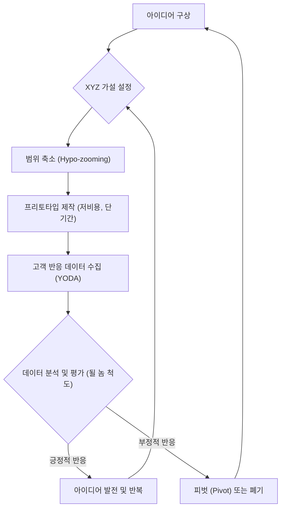

## 아이디어 불패의 법칙: 실패를 두려워 말고, 데이터로 검증하라!
이 책은 창업이나 새로운 일을 시작하려는 사람들을 위한 지침서야. 구글 혁신 전문가인 알베르토 사보이아가 수많은 실패를 겪으면서 얻은 통찰을 담고 있지. 핵심 메시지는 아이디어가 실패하더라도 아프지 않게 배우고, 다음번에는 더 나은 아이디어를 만들 수 있도록 실제 데이터를 기반으로 아이디어를 검증해야 한다는 거야.

## 1. 대부분의 아이디어는 실패한다: 시장 실패의 법칙 

새로운 아이디어를 내면 대부분 실패한다고 보면 돼. 마치 로켓을 쏘아 올리는데 10번 시도하면 9번은 실패하는 것과 같아.

1. **실패는 당연한 일**:
  - 신제품 출시 후 실패 확률이 무려 90%에 달한다고 해. 
  - 이런 실패는 그냥 받아들여야 하는 원칙 같은 거야. 
  - 코카콜라의 '뉴 코크'처럼, 심지어 성공한 대기업들도 신제품 실패 경험이 많아. 
  - 실패를 통해 배우고 성장하는 과정이라고 생각하면 돼. 

2. **실패의 원인**:
  - **시장 조사를 소홀히 하는 경우**: 고객 반응을 제대로 확인하지 않으면 실패할 수밖에 없어. 
  - **사실을 인정하지 않는 경우**: 대부분의 사람들은 주관적인 생각에 갇혀서 실제 데이터를 보지 않으려고 해. 
  - **직관에 의존하는 경우**: 실제 데이터 대신 '내 느낌이 맞아!'라고 생각하다가 낭패를 보는 경우가 많아. 
  - **잘못된 제품을 만드는 경우 (**Wrong It**)**: 아무리 열심히 만들어도 시장이 원하지 않는 제품이라면 실패할 수밖에 없어. 
  - 예를 들어, 맥도날드의 '빅맥'은 성공했지만, 파인애플이 들어간 '맥훌라 버거'는 실패했어. 
  - 스티븐 스필버그가 만든 영화 '스타워즈'는 대박 났지만, 10배의 예산을 들인 '하워드 덕'은 망했지. 
  - 구글의 'Gmail'은 성공했지만, 'Google Wave'는 실패했어. 
  - 이처럼 성공한 회사들도 잘못된 아이디어를 내면 실패한다는 거야. 

3. **실패의 세 가지 유형 (**FLOP**)**: 
  - **Launch (출시) 실패**: 사람들이 아이디어를 모르거나 접근할 수 없는 경우야. 마케팅이 부족해서 사람들이 제품을 알지 못하는 것과 같아. 
  - **Operation (운영) 실패**: 제품이 제대로 작동하지 않거나 서비스 품질이 나쁜 경우야. 앱이 계속 멈추거나 식당 음식이 맛없는 것과 같지. 
  - **Premise (전제) 실패**: 마케팅도 잘하고 제품도 잘 작동하지만, 사람들이 그냥 관심 없는 경우야. 이게 가장 흔한 실패 원인이라고 해. 
  - 사람들이 '만들어주면 살게요!'라고 말해도, 실제로는 관심 없는 경우가 많아. 
  - 대부분의 아이디어는 시장이 원하지 않는 'Wrong It'이기 때문에 실패하는 거야. 

## 2. '될 놈'을 찾아라: 시장에서 성공할 아이디어 

성공하는 아이디어는 처음부터 '될 놈'이라는 특징이 있어. 마치 씨앗부터 튼튼한 나무가 될 싹을 고르는 것과 같지.

1. **'**될 놈**'의 정의**:
  - '될 놈'은 유능하게 실행했을 때 시장에서 성공할 수 있는 신제품 아이디어를 말해. 
  - 비즈니스에서는 '좋은 아이디어'나 '나쁜 아이디어'가 따로 있는 게 아니라, 그냥 시장에서 성공하거나 실패하는 아이디어가 있을 뿐이야. 
  - '될 놈'인 아이디어를 잘 실행하면 성공 확률이 훨씬 높아져. 

2. **'**안 될 놈**'의 정의**:
  - '안 될 놈'은 '될 놈'의 사악한 쌍둥이 같은 존재야. 
  - 아무리 유능하게 실행해도 시장에서 실패할 수밖에 없는 신제품 아이디어를 말해. 

3. **성공을 보장할 수는 없어**:
  - 비즈니스에서 100% 성공을 보장하는 건 없어. 
  - 다른 사람이 똑같은 아이디어를 더 잘, 더 빨리 실행해서 성공할 수도 있어. 
  - 피자 가게처럼, 시장에서 성공이 증명되면 많은 경쟁자들이 뛰어들기 마련이야. 

## 3. 생각의 함정에서 벗어나라: '생각 랜드'의 문제점 

우리가 머릿속으로만 생각하는 공간을 '생각 랜드(Thoughtland)'라고 부르는데, 여기서는 아이디어가 왜곡되기 쉬워. 마치 안개 낀 길을 운전하는 것처럼, 실제와 다르게 보일 수 있다는 거야.

1. 아이디어** 전달의 문제**: 
  - 아이디어는 구체적인 형태가 되기 전까지는 그저 추상적인 생각일 뿐이야. 
  - 내 머릿속의 아이디어를 다른 사람에게 설명하면, 그 사람의 경험, 취향, 편견 때문에 원래 의도와 다르게 해석될 수 있어. 
  - 우버**(Uber) 사례**: 저자는 처음 우버 아이디어를 들었을 때 '모르는 사람이 모르는 사람 차를 탄다고? 미친 아이디어야!'라고 생각했어. 
  - 하지만 직접 이용해보고 나서야 얼마나 편리하고 저렴한지 깨달았지. 
  - 심지어 딸에게는 '절대 모르는 사람 차에 타지 마!'라고 가르쳤지만, 딸은 이미 몇 달 전부터 우버를 이용하고 있었어. 
  - 이처럼 사람들은 아이디어를 자기만의 방식으로 이해하고 판단하기 때문에 소통에 문제가 생겨. 

2. **예측력의 한계**: 
  - 사람들은 경험해보지 못한 것에 대해 미래에 얼마나 좋아할지, 얼마나 자주 이용할지 잘 예측하지 못해. 
  - **초밥(Sushi) 사례**: 저자는 십대 시절, 친구가 일본에서 날것의 생선을 먹는다는 이야기를 듣고 '역겨운 아이디어'라고 생각했어. 
  - 하지만 지금은 일주일에 한 번 이상 초밥을 먹을 정도로 좋아하게 됐지. 
  - **우버(Uber) 사례**: 저자는 우버를 처음 이용할 때 택시처럼 가끔 이용할 거라고 예측했지만, 실제로는 훨씬 더 자주 이용하게 됐어. 
  - 심지어 저자의 딸은 샌프란시스코의 교통 체증과 주차난 때문에 차를 소유하는 것보다 우버를 이용하는 것이 더 효율적이라고 생각하게 됐어. 
  - 이처럼 직접 경험하기 전에는 아이디어의 가치를 제대로 예측하기 어려워. 

3. **적극적 투자의 부재**: 
  - '적극적 투자'는 결과에 대한 분명한 이해관계, 즉 잃을 것도 얻을 것도 있는 상태를 말해. 
  - 친구나 전문가의 '좋은 아이디어네요!'라는 말은 아무런 위험 부담이 없기 때문에 영양가가 없어. 
  - 진정한 투자는 상대방이 시간, 돈, 약속 등 가치 있는 것을 걸었을 때를 의미해. 

4. **확증 편향의 문제**: 
  - 확증 편향은 자신이 믿는 것을 뒷받침하는 정보만 받아들이고, 반대되는 정보는 무시하려는 경향을 말해. 
  - 마치 보고 싶은 것만 보고, 듣고 싶은 것만 듣는 것과 같아. 
  - 이런 편향 때문에 객관적인 판단을 내리기 어렵고, '될 놈'을 못 알아보거나 '안 될 놈'에 과도하게 투자하는 실수를 저지를 수 있어. 

5. **생각 랜드의 결합 문제**: 
  - 위의 네 가지 문제가 합쳐지면 아이디어는 더욱 왜곡돼. 
  - 왜곡된 아이디어를 사람들은 각자의 편향으로 판단하고, 아무런 위험 부담 없는 사람들이 의견을 내놓으며, 결국 우리가 믿고 싶은 대로 해석하게 돼. 
  - 생각 랜드는 객관적인 데이터 대신 주관적이고 편향된 의견들로 가득 차 있어서 잘못된 결론으로 이끌 가능성이 커. 
  - 긍정 오류** (**False Positive**)**: '안 될 놈'인데도 '될 놈'이라고 착각해서 과도하게 투자하는 경우야. 
  - 세그웨이(Segway)처럼 모두가 대박이라고 생각했지만, 결국 실패한 사례가 많아. 
  - 부정 오류** (**False Negative**)**: '될 놈'인데도 '안 될 놈'이라고 착각해서 좋은 기회를 놓치는 경우야. 
  - 트위터(Twitter)처럼 처음에는 '말도 안 되는 아이디어'라고 생각했지만, 결국 성공한 사례가 있지. 
  - 에어비앤비(Airbnb)나 테슬라(Tesla)도 처음에는 많은 사람들이 '안 될 거야'라고 생각했지만, 결국 대박이 났어. 

## 4. 생각은 접어두고 데이터를 모아라: 'YODA'의 중요성 

생각 랜드의 함정에서 벗어나려면 '데이터'가 필요해. 특히 다른 사람의 데이터(OPD)가 아니라, 나만의 데이터(YODA)를 직접 모으는 것이 중요해. 마치 직접 낚시해서 신선한 물고기를 잡는 것과 같지.

1. **데이터의 종류**: 
  - **다른 사람의 데이터 (OPD: Other People's Data)**: 다른 사람들이 다른 시기에, 다른 제품을 위해, 다른 방법으로 수집한 데이터야. 
  - 이 데이터는 나에게 적용되지 않을 가능성이 커서 위험할 수 있어. 
  - 다른 아이디어가 실패했다고 내 아이디어도 실패하는 건 아니고, 반대로 다른 아이디어가 성공했다고 내 아이디어도 성공하는 건 아니야. 
  - 일론 머스크가 테슬라를 만들 때, 다른 전기차 회사들이 실패했다고 포기했다면 지금의 테슬라는 없었을 거야. 
  - 나만의 데이터** (YODA: Your Own Data)**: 내가 직접 시장에서 수집한 신선하고, 관련성 있고, 적극적인 투자가 담긴 데이터야. 
  - 이 데이터는 가장 가치 있는 정보라고 할 수 있어. 

2. **좋은 데이터의 기준**: 
  - **신선함**: 최근 데이터여야 해. 사업 내용을 판단하려면 지난 5년 동안의 데이터를 보는 것이 좋아. 
  - **확실한 관련성**: 내 사업과 직접적으로 관련된 데이터여야 해. 엉뚱한 곳에서 조사한 데이터는 의미가 없어. 
  - **알려진 출처**: 자료의 출처가 명확해야 해. 다른 곳에서 나온 자료를 참고할 때는 가공되었을 수 있으니 주의해야 해. 
  - **충분한 통계**: 소수의 사례가 아니라, 충분한 샘플 사이즈(표본 크기)를 가진 통계여야 해. 

3. **'**적극적 투자**'가 담긴 데이터**: 
  - 사람들이 '좋은 아이디어네요!'라고 말하는 것만으로는 부족해. 
  - 진정한 데이터는 사람들이 시간, 돈, 약속 등 가치 있는 것을 걸었을 때 얻을 수 있어. 
  - **스마트 망치 사례**: '스마트 망치' 아이디어를 물어봤을 때 '좋은 아이디어'라고 말하는 것보다, 50달러를 미리 내고 예약하는 사람이 있다면 그게 진짜 시장의 관심이야. 
  - **테슬라 로드스터 사례**: 일론 머스크는 테슬라 로드스터를 만들 때, 5,000달러의 선수금(선불금)을 받고 예약자를 모집했어. 
  - 아직 차가 나오지도 않았는데 돈을 내는 것은 엄청난 '적극적 투자'이고, 이것이 바로 '될 놈'이라는 증거가 되는 거야. 
  - 사람들이 입을 여는 것보다 지갑을 여는 것이 훨씬 어렵다는 것을 기억해야 해. 

## 5. 아이디어를 숫자로 표현하라: XYZ 가설 

아이디어를 막연하게 생각하지 말고, 구체적인 숫자로 표현하는 연습을 해야 해. 마치 수학 문제를 풀 때 미지수를 정하는 것과 같지.

1. 시장 가설** 세우기**: 
  - 내 아이디어를 시장이 어떻게 받아들일지에 대한 기본적인 가정을 세우는 거야. 
  - **초밥 푸드트럭 사례**: '미국에서 비싼 초밥을 99센트짜리 푸드트럭으로 팔면 많은 사람들이 좋아할 것이다'와 같은 가설을 세우는 거지. 
  - 이 가설을 짧은 문장으로 만들어보는 것이 중요해. 

2. XYZ** 가설로 구체화하기**: 
  - 막연한 시장 가설을 구체적인 숫자가 들어간 가설로 바꾸는 거야.
  - **X%의 Y는 Z할 것이다**라는 형태로 만드는 거지. 
  - **X**: 타겟 목표 시장의 몇 퍼센트가 좋아할 것인지 (시장 점유율). 
  - **Y**: 우리가 생각한 타겟 시장의 구성 요소 (누구를 대상으로 할 것인지). 
  - **Z**: 시장의 반응 정도 (어떤 행동을 할 것인지). 
  - **대기질 탐지기 사례**: '대기질 지수가 100 이상인 도시에 사는 사람 중 10%는 120달러짜리 휴대용 대기질 탐지기를 구매할 것이다'와 같이 구체적인 숫자를 넣는 거야. 
  - **반려견 전용 맥주 사례**: '애완견 주인 중 적어도 15%는 사료를 살 때 반려견 전용 맥주를 함께 구매할 것이다'와 같이 숫자를 넣어 가설을 만드는 거지. 

## 6. 돈 들이지 않고 테스트하라: 프리토타이핑 (Pretotyping) 

아이디어가 '될 놈'인지 '안 될 놈'인지 확인하려면 직접 만들어봐야 하는데, 돈과 시간이 너무 많이 들잖아? 그래서 '프리토타이핑(Pretotyping)'이라는 방법을 쓰는 거야. 이건 진짜 제품인 척하면서 고객 반응을 미리 보는 거지. 마치 연극 무대에서 소품으로 진짜인 척하는 것과 같아.

1. **프리토타이핑이란?**: 
  - 아주 빠르고 저렴하게 데이터를 수집할 수 있는 가장 간단한 도구나 기술을 말해. 
  - 아이디어와 최종 제품 사이의 긴 과정에서 아주 초기에 시도하는 거야. 
  - 몇 분, 몇 시간, 길어도 며칠 안에 만들 수 있고, 비용은 0원에서 몇십만 원 정도면 충분해. 
  - 프로토타입**(Prototype)**은 실제로 작동하는 시제품을 말하고, 만드는 데 시간과 돈이 많이 들어. 
  - **프리토타입(Pretotype)**은 '프로토타입 이전'이라는 뜻도 있지만, '진짜인 척한다(pretend)'는 의미도 담고 있어. 

2. **프리토타이핑의 목적**: 
  - '이 아이디어가 과연 '될 놈'일까?' '사람들이 이걸 정말 사용할까?' '어떤 용도로 사용할까?'와 같은 질문에 답을 얻는 거야.
  - '어떻게 만들까?'가 아니라 '만들어야 할까?'를 묻는 거지. 
  - 대부분의 아이디어는 기술적으로 만들 수 있지만, 사람들이 원하지 않아서 실패하는 경우가 많아. 

3. **프리토타이핑의 다양한 방법**:
  - **기계식 터크 (**Mechanical Turk**) **프리토타입: 
  - 사람이 뒤에서 조작해서 마치 기계가 작동하는 것처럼 보이게 하는 거야.
  - **IBM 음성 인식 컴퓨터 사례**: IBM은 음성 인식 컴퓨터를 만들고 싶었지만, 당시 기술로는 불가능했어. 그래서 사람들이 마이크에 말하면 옆방에서 타이핑이 빠른 사람이 대신 입력해서 컴퓨터가 인식하는 것처럼 보이게 했지. 
  - 사람들은 음성 인식이 잘 된다고 생각했지만, 실제로 사용해보니 목이 아프고 주변이 시끄러워 불편하다는 것을 알게 됐어. 
  - **빨래 개는 기계 사례**: 빨래를 자동으로 개는 기계를 테스트할 때, 실제로는 사람이 기계 안에 들어가서 빨래를 개는 척하는 거야. 
  - 파사드** (**Facade**) 프리토타입**: 
  - 겉모습만 그럴듯하게 만들어서 진짜 제품인 것처럼 보이게 하는 거야.
  - **CarsDirect.com 사례**: 인터넷 초기에 사람들이 온라인으로 중고차를 살지 궁금했던 CarsDirect는 실제 차 없이 간단한 웹사이트만 만들어서 광고했어. 이틀 만에 4대가 팔리자, 그때서야 웹사이트를 닫고 차를 사서 팔았지. 
  - **IKEA Wall Hub 사례**: IKEA 직원이 아닌 사람들이 IKEA 로고가 붙은 가짜 제품 라벨을 만들어서 실제 IKEA 매장 선반에 올려놓고 사람들이 구매하는지 관찰했어. 
  - **임페르소네이터 (**Impersonator**) 프리토타입**: 
  - 기존 제품에 새로운 아이디어를 덧씌워서 새로운 제품인 것처럼 보이게 하는 거야.
  - **테슬라 로드스터 사례**: 일론 머스크는 로터스 엘리스라는 스포츠카에 전기 모터를 달아서 테슬라 로드스터 시제품인 척 사람들에게 시승 기회를 제공했어. 
  - **이틀 된 초밥 사례**: '이틀 된 초밥'을 팔아보려고, 신선한 초밥에 '이틀 된 초밥'이라는 라벨을 붙여서 팔아봤지만, 아무도 사지 않았어. 
  - **핀팡 (Pin-Fan) 프리토타입**: 
  - 내가 가진 자원을 직접 팔아보는 거야. 온라인 쇼핑몰에서 잘 팔리는 물건을 먼저 팔아보고, 팔리면 그때 도매로 물건을 떼오는 방식과 같아. 
  - 마스크를 팔 때도, 먼저 온라인에서 주문을 받고, 주문이 들어오면 그때부터 제조하거나 물건을 구해서 보내주는 거지. 
  - **블로그 연재 사례**: 소설 '마션'의 작가는 처음에는 소설책으로 출판하려 했지만 반응이 없자, 내용을 쪼개서 블로그에 조금씩 연재했어. 독자들이 관심을 보이자, 이를 기반으로 이북을 내고, 결국 책으로 출판하고 영화로까지 만들어졌지. 

4. **프리토타이핑의 핵심 원칙**: 
  - 적극적인 투자** 유도**: 고객이 실제로 돈을 내거나 행동으로 보여주는 '적극적 투자'를 이끌어내야 해. 
  - **짧은 **실행** 기간**: 아이디어를 테스트하는 데 너무 오래 걸리면 안 돼. 당장 실행할 수 있는 범위로 짧게 만들어야 해. 
  - **저렴한 비용**: 돈을 들이지 않고 저렴하게 테스트해야 해. 실패하더라도 아프지 않게 배울 수 있도록. 
  - **반복과 개선**: 한 번의 테스트로 끝내지 말고, 시장 반응을 보면서 계속 고치고 뒤집고 개선해야 해. 

## 7. 작게 시작하고 빠르게 반복하라: 성공 전략 

아이디어를 성공시키려면 크게 생각하되, 작게 시작해서 빠르게 테스트하고 계속 개선하는 전략이 필요해. 마치 작은 씨앗을 심어 큰 나무로 키우는 것과 같지.

1. **생각은 글로벌하게, 시작은 로컬하게**: 
  - 처음에는 전 세계 사람들을 대상으로 할 큰 그림을 그리지만, 실제 테스트는 우리 동네 사람들을 대상으로 작게 시작하는 거야.
  - **하이포-줌 (**Hypo-zooming**)**: 큰 가설을 지금 당장 여기서 테스트할 수 있는 작은 가설로 축소하는 방법이야. 
  - 예를 들어, '전국 초밥 구매자의 20%가 이틀 된 초밥을 살 것이다'라는 큰 가설을 '스탠퍼드 대학교 쿠바 카페에서 저녁을 먹는 학생 중 20%가 이틀 된 초밥을 살 것이다'와 같이 구체적으로 줄이는 거지. 

2. **오늘 당장 테스트하라**: 
  - '내일 할게'라고 미루지 말고, 지금 당장 테스트할 수 있는 방법을 찾아야 해.
  - 데이터를 얻는 데 걸리는 시간(Time to Data), 비용(Dollars to Data), 거리(Distance to Data)를 최소화해야 해. 

3. **돈 들이지 않고 테스트하라**: 
  - 돈이 없어도 아이디어를 테스트할 수 있는 방법을 찾아야 해.

4. **고치고 뒤집고 반복하라**: 
  - 한 번의 테스트로 끝내지 말고, 시장 반응을 보면서 계속 아이디어를 수정하고 개선해야 해.
  - 될 놈** 척도**: 아이디어가 '될 놈'인지 아닌지 판단하는 기준을 만들어서 계속 평가해야 해. 
  - 처음 아이디어가 성공할 확률은 10%밖에 안 되지만, 계속 개선하고 반복하면 다섯 번째, 여섯 번째쯤에는 히트 상품이 나올 가능성이 커져. 
  - 피벗** (Pivot)**: 만약 10번 정도 테스트했는데도 반응이 없다면, 그 아이디어는 '안 될 놈'일 가능성이 높으니 과감하게 사업 방향을 바꾸거나 포기해야 해. 
  - 이때 돈을 거의 들이지 않았기 때문에 실패하더라도 크게 아프지 않게 배울 수 있어. 

