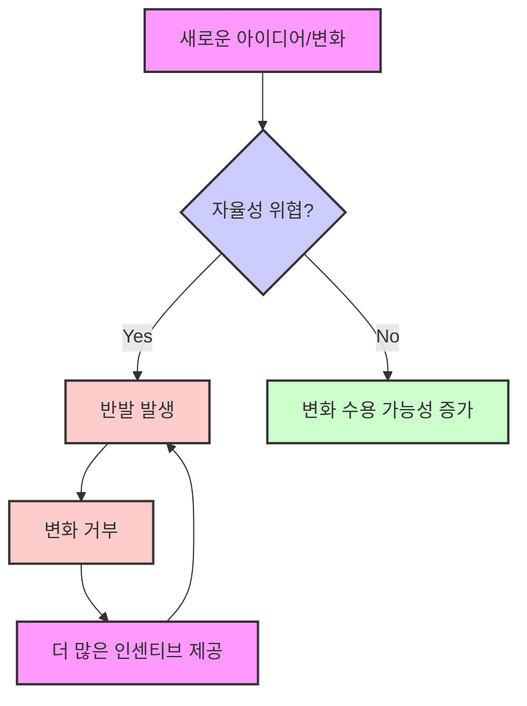
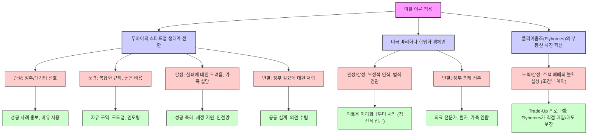

## 책 소개
이 책은 좋은 아이디어가 왜 현실에서 성공하기 어려운지, 그 숨겨진 이유를 파헤치는 책이다. 저자 데이비드 숀탈과 로렌 노드그렌은 사람들이 변화를 거부하는 네 가지 심리적 저항(관성, 노력, 감정, 반발)을 '마찰(Friction)'이라는 개념으로 설명한다. 이 책은 단순히 아이디어를 좋게 만드는 '연료(Fuel)'에 집중하는 대신, 사람들이 변화를 받아들이기 어렵게 만드는 '마찰'을 이해하고 줄이는 방법을 제시하며, 혁신과 변화를 이끌어내는 새로운 관점을 제공한다.

## 본문 정리

## 1. 좋은 아이디어가 실패하는 이유: '연료'와 '마찰'의 개념 

새로운 아이디어나 변화를 시도할 때, 우리는 보통 그 아이디어가 얼마나 좋은지, 어떤 이점이 있는지에만 집중하는 경향이 있다. 이걸 저자들은 '연료(Fuel)'라고 부른다.

1. 연료**(Fuel)는 아이디어를 앞으로 나아가게 하는 힘이다.** 
  - 연료는 아이디어의 긍정적인 측면, 즉 편리함, 비용 절감, 사회적 지위 향상 같은 것들을 말한다. 
  - 우리는 보통 아이디어가 충분히 좋으면 사람들이 당연히 받아들일 거라고 생각한다. 
  - 하지만 시장 조사를 통해 사람들이 아이디어를 좋아한다고 해도, 막상 실행 단계에서는 사람들이 외면하는 경우가 많다. 

2. 마찰**(**Friction**)은 변화를 가로막는 숨겨진 저항이다.** 
  - 마찰은 아이디어가 아무리 좋아도 사람들이 변화를 받아들이기 어렵게 만드는 심리적인 힘이다. 
  - 마치 무거운 바위를 언덕 위로 밀어 올리려고 할 때, 아무리 열심히 밀어도 보이지 않는 힘이 나를 방해하는 것과 같다. 
  - 이 마찰은 우리가 흔히 간과하는 '인간적인 요소(Human Element)'에서 비롯된다. 
  - 혁신이나 기업가정신, 디자인 분야에서는 주로 '연료'를 늘리는 데 집중하지만, '마찰'을 이해하고 줄이는 것이 훨씬 중요하다. 

3. **마찰은 네 가지 주요 유형으로 나뉜다.** 
  - 관성**(**Inertia**)**: 익숙한 것을 고수하고 새로운 것을 피하려는 경향이다. 
  - 노력**(**Effort**)**: 변화를 위해 필요한 시간, 돈, 정신적, 육체적 수고를 말한다. 
  - 감정**(Emotion)**: 변화가 불러일으킬 수 있는 불안감, 두려움, 불신 같은 부정적인 감정이다. 
  - 반발**(**Reactance**)**: 자유나 자율성이 위협받는다고 느낄 때 변화에 저항하는 심리다. 

4. **마찰을 이해하는 것이 혁신의 핵심이다.** 
  - 우리는 종종 자신의 아이디어에 너무 빠져서 다른 사람들의 관점을 놓치곤 한다. 
  - 마찰을 이해하면, 아이디어를 더 매력적으로 만드는 대신, 사람들이 변화를 더 쉽게 받아들이도록 돕는 방법을 찾을 수 있다. 
  - 마찰을 발견하는 것은 마치 의료 영상에서 조영제를 주입하여 문제의 원인을 밝혀내는 것과 같다. 
  - 마찰을 일찍 파악할수록 변화의 과정이 훨씬 순조로워진다. 

## 2. 첫 번째 마찰: '관성(Inertia)' – 익숙한 것을 고수하려는 심리 

우리는 익숙한 것을 좋아하고 새로운 것을 피하려는 경향이 있다. 마치 고집 센 게가 특정 크기의 홍합만 먹으려고 하는 것처럼, 다른 홍합이 많아도 익숙한 것만 고집하다가 굶어 죽는 경우도 있다. 

1. **관성은 안전을 추구하는 본능에서 비롯된다.** 
  - 익숙한 것을 고수하는 것은 위험을 최소화하려는 진화론적인 본능이다. 
  - 새로운 것을 시도하는 것은 노력 낭비나 심지어 위험을 초래할 수 있다고 생각하기 때문이다. 
  - 이러한 심리는 사람들이 새로운 소프트웨어 업데이트를 거부하거나, 새로운 이메일 시스템을 배우려 하지 않는 이유를 설명한다. 

2. **관성은 우리의 선택을 비합리적으로 만든다.** 
  - 트로피카나 주스가 포장 디자인을 바꿨을 때, 주스 맛은 그대로인데도 사람들이 강하게 반발하여 매출이 급락한 사례가 있다. 
  - 이는 우리가 논리보다는 익숙함에 더 큰 영향을 받는다는 것을 보여준다. 
  - 일본 투자자들이 전 세계 자본의 91%가 일본 외부에 있는데도 80%의 자금을 일본 기업에 투자하는 것도 관성의 예시다. 

3. **관성을 극복하는 방법: 낯선 것을 익숙하게 만들기.** 
  - **점진적인 변화(Baby Steps)**: 한 번에 큰 변화를 주기보다는 작은 변화를 점진적으로 도입하여 사람들이 익숙해지도록 돕는다. 
  - 마치 거미 공포증 환자에게 거미 사진부터 보여주고 점차 실제 거미에 노출시키는 노출 치료와 같다. 
  - **비유 사용(Analogies)**: 새로운 아이디어를 사람들이 이미 알고 있는 익숙한 개념에 비유하여 설명한다. 
  - 스티브 잡스가 개인용 컴퓨터의 파일을 설명할 때 '데스크톱'이라는 개념을 사용한 것처럼, 낯선 것을 익숙한 것으로 포장하는 것이다. 
  - 테슬라가 전기차를 일반 자동차와 똑같이 보이게 만든 것도 같은 맥락이다. 
  - **반복 노출(Repetition)**: 사람들이 새로운 아이디어를 자주 접하게 하면, 더 쉽게 받아들이고 심지어 좋아하게 된다. 
  - **익숙한 전달자(Familiar Messenger)**: 사람들이 신뢰하거나 자신과 비슷하다고 느끼는 사람이 아이디어를 전달하면 더 잘 받아들인다. 
  - **극단적인 대안 제시(Extreme Alternative)**: 의도적으로 매우 비싸거나 복잡한 대안을 먼저 제시하여, 내가 원하는 아이디어가 상대적으로 합리적이고 쉬워 보이게 만든다. 
  - 레스토랑에서 와인 리스트에 터무니없이 비싼 와인을 올려두면, 다른 비싼 와인들이 상대적으로 저렴하게 느껴져서 판매가 늘어나는 것과 같다. 
  - 이것을 '미끼 효과(Decoy Effect)'라고도 하는데, 정말 매력 없는 선택지를 제시하여 사람들이 원하는 대안을 더 쉽게 선택하게 만드는 것이다. 

## 3. 두 번째 마찰: '노력(Effort)' – 수고를 피하려는 심리 

우리는 어떤 일을 할 때 가장 적은 노력이 드는 길을 선택하려는 경향이 있다. 마치 공원에서 포장된 길 대신 잔디밭을 가로질러 지름길을 만드는 것처럼, 우리는 항상 '최소 노력의 법칙'을 따른다. 

1. **노력은 편리함과 직결된다.** 
  - 사람들은 종종 품질보다 편리함을 우선시한다. 
  - 음악 파일의 음질이 더 나빠도 스트리밍 서비스로 수백만 곡을 쉽게 들을 수 있기 때문에 압축된 음악 파일을 듣는 것과 같다. 
  - 이러한 경향은 채용 과정에서도 나타나는데, 관리자들은 유능한 후보자보다 다루기 쉬운 후보자를 선택하기도 한다. 

2. **노력은 우리의 인식을 왜곡시킨다.** 
  - 어떤 실험에서 조이스틱을 오른쪽으로 움직이는 것을 어렵게 만들자, 사람들은 화면의 점들이 실제로는 오른쪽으로 움직여도 왼쪽으로 움직인다고 인식하는 경향을 보였다. 
  - 사탕 그릇을 몇 인치만 멀리 두어도 사람들이 먹는 양이 절반으로 줄어드는 것처럼, 아주 작은 노력의 차이도 큰 영향을 미친다. 

3. 노력** 마찰을 극복하는 방법: 변화를 더 쉽게 만들기.** 
  - **명확한 **로드맵** 제시(Clear Roadmap)**: 복잡한 작업을 작고 관리하기 쉬운 단계로 나누어 제시한다. 
  - 제2차 세계대전 당시 미국 정부가 전쟁 채권 판매를 두 배로 늘린 방법은 포스터에 "직장 동료가 서명하라고 요청하면 구매하세요"라는 문구를 추가하여 사람들이 언제, 어떻게 기부해야 할지 정확히 알려준 것이었다. 
  - **'만약-그러면' 트리거(**If-Then Triggers**)**: 특정 상황(만약)이 발생하면 특정 행동(그러면)을 하도록 유도하는 것이다. 
  - 부동산 중개인이 친구에게 새로운 동료를 만날 때마다 "부동산 중개인이 필요하세요?"라고 묻도록 한 것처럼, 간단한 트리거를 원하는 행동과 연결한다. 
  - **장애물 제거(**Streamlining**)**: 변화를 가로막는 물리적, 정신적 장벽을 직접 제거한다. 
  - 가구 회사 '비치 하우스(Beach House)'는 사람들이 새 소파를 사면서 헌 소파를 처리하는 것을 귀찮아한다는 것을 발견했다. 그래서 헌 소파를 무료로 수거하고 기부해주는 서비스를 제공하자 매출이 급증했다. 
  - 이는 사람들이 지름길을 찾는 '욕망 경로(Desire Paths)'를 파악하고, 원하는 행동을 더 쉽게 만들라는 교훈을 준다. 
  - **'예스'를 기본값으로 만들기(Make Yes the Default)**: 사람들이 '아니오'라고 말하는 데 노력이 들게 만들면, '예스'를 선택할 가능성이 높아진다. 
  - 예를 들어, 장기 기증 동의를 기본값으로 설정하면 동의율이 훨씬 높아진다.

## 4. 세 번째 마찰: '감정(Emotion)' – 변화에 대한 부정적인 감정 

변화는 종종 두려움, 불안, 불신, 압도감 같은 부정적인 감정을 불러일으킨다. 이런 감정은 논리적으로 변화가 좋다는 것을 알아도 강력한 저항으로 작용할 수 있다. 

1. **감정은 기능적 필요만큼 중요하다.** 
  - 1950년대 초기에 케이크 믹스가 실패했던 이유는 여성들이 케이크 만들기를 사랑의 표현이자 자부심으로 여겼기 때문이다. 
  - 믹스를 사용하면 너무 쉽다고 느껴져서 '진정한 제빵사'라는 자부심을 잃는다고 생각했다. 
  - 이후 제너럴 밀스(General Mills)가 믹스에 계란을 추가하도록 바꾸자, 약간의 노력이 들어가면서 여성들이 믹스를 받아들이기 시작했다. 
  - 이는 감정적 필요가 기능적 필요만큼, 어쩌면 그 이상으로 중요하다는 것을 보여준다. 

2. **감정은 다양한 상황에서 발생한다.** 
  - 데이트 앱 '틴더(Tinder)'는 거절당할지도 모른다는 감정적 마찰을 제거하여 온라인 데이팅 시장을 혁신했다. 
  - 기업 간 거래(B2B)나 조직 내부에서도 감정적 마찰이 발생할 수 있다. 
  - 예를 들어, 리더가 자신의 권력을 위협한다고 느껴지는 유능한 후보자를 고용하지 않거나, 재능 있는 사람을 배제하는 경우가 있다. 

3. 감정** 마찰을 극복하는 방법: 숨겨진 감정적 장벽을 찾아내기.** 
  - **'왜?'라고 깊이 질문하기(Ask Why)**: 표면적인 피드백에만 머무르지 않고, 사람들이 저항하는 진짜 이유를 파고든다. 
  - 도요타(Toyota)가 대중화한 '5가지 왜(Five Whys)' 기법처럼, '왜'를 다섯 번 반복해서 물으면 근본적인 원인을 찾을 수 있다. 
  - 어떤 기업가가 소프트웨어 플랫폼을 판매할 때 고객이 '너무 비싸다'고 말했지만, 실제로는 이사회 승인을 받기 어려울까 봐 두려워했다는 사례가 있다. 
  - **민족지학자처럼 관찰하기(Think Like an **Ethnographer**)**: 사람들이 일상생활에서 어떻게 행동하는지 직접 관찰하여 숨겨진 필요와 문제점을 발견한다. 
  - 아메리칸 익스프레스(American Express)는 밀레니얼 세대가 신용카드에 대한 불안감과 부채에 대한 두려움을 가지고 있다는 것을 발견했다. 
  - 이에 '페이 잇 플래닛(Pay It Planet)'이라는 기능을 만들어 결제를 더 작게 나누어 관리할 수 있게 하여 통제감을 주었고, 큰 성공을 거두었다. 
  - 혁신** 과정에 사람들을 참여시키기(Involve People in Innovation)**: 아이디어 설계 과정에 대상 고객을 참여시키면 감정적 마찰을 최소화할 수 있다. 
  - **무료 체험 및 취소 가능성 제공(Free Trials & Reversibility)**: 사람들이 부담 없이 시도하고, 원하면 언제든지 결정을 바꿀 수 있게 하면 감정적 부담을 줄일 수 있다. 
  - **지원 서비스 제공(Support Services)**: 애플의 '지니어스 바(Genius Bar)'나 베스트 바이(Best Buy)의 '긱 스쿼드(Geek Squad)'처럼 문제가 생겼을 때 도움을 받을 수 있다는 확신을 주면 불안감을 해소할 수 있다. 
  - 공감 연극** 피하기(Avoid Empathy Theater)**: 가짜 공감은 오히려 역효과를 낼 수 있으므로, 진정으로 사람들의 감정적 필요를 이해하려 노력해야 한다. 
  - **공감하는 팀 구성(Empathetic Teams)**: 만성 질환 관리 회사 '린코(LeanCo)'는 환자들이 질병에 대해 비난받는다고 느끼는 감정적 마찰을 해결하기 위해, 직접 만성 질환을 앓고 있는 사람들을 코치로 고용하여 공감적이고 비판적이지 않은 지원을 제공했다. 

## 5. 네 번째 마찰: '반발(Reactance)' – 자율성 위협에 대한 저항 

반발은 사람들이 자신의 자유나 자율성이 위협받는다고 느낄 때 나타나는 본능적인 저항이다. 마치 반항적인 십대들이 부모님이 시키는 것과 반대로 행동하는 것처럼, 압력을 받으면 오히려 반대로 행동하려는 심리다. 

1. **반발은 인센티브를 역효과로 만들 수 있다.** 
  - 사람들은 자신의 자율성이 위협받는다고 느끼면, 아무리 좋은 증거나 이점을 제시해도 이를 압력으로 인식하고 반발한다. 
  - 1980년대에 안전벨트 착용 의무화 법안이 도입되었을 때, 사람들이 정부가 자신들을 통제하려 한다고 느껴 반발했던 사례가 있다. 
  - 이러한 반발은 사람들이 자신의 핵심 신념이 위협받을 때, 변화를 강요받을 때, 또는 설계 과정에서 배제될 때 특히 강하게 나타난다. 

2. **반발을 극복하는 방법: 스스로 설득하게 만들기(**Self-Persuasion**).** 
  - **질문으로 유도하기(Asking Questions)**: 직접 지시하기보다는 질문을 통해 사람들이 스스로 결론에 도달하도록 돕는다. 
  - 흡연자들이 금연 메시지를 직접 소리 내어 읽었을 때, 단순히 듣기만 한 사람들보다 금연할 가능성이 높았다. 
  - 이는 메시지가 '자신의 아이디어'가 되었기 때문이다. 
  - 전설적인 고등학교 미식축구 코치 밥 라이저(Bob Liser)는 선수들에게 소리 지르거나 연설하는 대신, 각자 주간 목표를 적게 하여 스스로 동기를 부여하게 했다. 
  - **'**예스 사다리**' 만들기(Building a Yes Ladder)**: 사람들이 동의할 만한 쉬운 질문부터 시작하여 점차 더 어려운 질문으로 나아간다. 
  - 마리화나 합법화 운동가들은 먼저 의료용 마리화나 합법화에 대한 동의를 얻은 후, 점차 오락용 마리화나 비범죄화로 나아갔다. 
  - 공동 설계**(Co-Design)를 통해 참여 유도하기**: 사람들이 아이디어 설계 과정에 참여하면, 아이디어에 대한 소유감을 느끼고 반발이 줄어든다. 
  - 시카고의 헬스케어 기술 인큐베이터 '매터(Matter)'는 병원, 보험사, 스타트업 등 다양한 이해관계자들을 워크숍과 토론에 참여시켜 공동으로 아이디어를 설계함으로써 합의를 이끌어냈다. 
  - **'문간에 발 들여놓기' 기법(**Foot-in-the-Door Technique**)**: 작은 요청부터 시작하여 사람들이 동의하게 만들고, 점차 더 큰 요청으로 나아간다. 
  - 한국 전쟁 당시 중국군 포로수용소에서 포로들에게 "어떤 나라도 완벽하지 않다"와 같은 간단한 질문부터 시작하여, 점차 자신의 조국을 비난하게 만든 섬뜩한 사례가 있다. 
  - 이러한 점진적인 접근 방식은 뇌세척(Brainwashing)과 같은 극단적인 상황에서도 효과적이다. 
  - **공개적인 약속(Public Commitments)**: 사람들이 공개적으로 약속하게 하면 책임감과 내적인 헌신이 생긴다. 

## 6. 마찰 이론의 실제 적용 사례 

마찰 이론은 다양한 분야에서 실제 변화를 이끌어내는 데 활용될 수 있다.

1. **두바이의 스타트업 생태계 전환 **노력**.** 
  - **문제**: 두바이는 석유 기반 경제에서 벗어나 스타트업 중심의 미래 경제를 만들고자 했다. 
  - 하지만 대학생들은 기업가보다는 고임금의 정부 공무원을 선호하는 '관성'이 있었다. 
  - 기업가적 실패는 개인과 가족에게 수치심을 안겨주는 '감정적 마찰'이 컸다. 
  - 복잡한 규제와 높은 비용은 '노력' 마찰을 유발했다. 
  - 정부가 기업가 정신을 강요한다고 느끼는 '반발'도 있었다. 
  - **해결책**: 두바이는 네 가지 마찰을 모두 해결하기 위한 다각적인 접근 방식을 사용했다. 
  - 관성: 성공적인 에미리트 기업가들을 홍보하고, 창업을 '산 오르기'에 비유하여 도전적이지만 보람 있는 일로 만들었다. 
  - 노력: 규제를 간소화하고 비용을 낮춘 '자유 구역'을 만들었으며, 로드맵과 멘토링을 제공했다. 
  - 감정: 기업가들을 위한 시상식과 재정 지원 프로그램을 만들어 실패에 대한 두려움을 완화하고, 두바이 통치자가 직접 기업가 부모에게 감사 편지를 보내 자부심을 높였다. 
  - 반발: 예비 기업가들을 워크숍과 포커스 그룹에 참여시켜 공동 설계 과정을 통해 의견을 수렴했다. 
  - **결과**: 두바이는 현재 글로벌 기업가 정신의 허브로 성장했다. 

2. **미국 마리화나 합법화 캠페인.** 
  - **문제**: 마리화나는 한때 악마화되었던 물질로, 깊이 뿌리박힌 부정적인 태도와 신념을 바꿔야 했다. 
  - 범죄 증가와 사회 붕괴에 대한 '두려움(감정)'과 '정부가 간섭해서는 안 된다(반발)'는 인식이 강했다. 
  - **해결책**: '의료용 마리화나'에 초점을 맞추는 전략을 사용했다. 
  - 관성**/감정**: 의료용 마리화나는 사람들에게 마리화나를 '약'으로 인식하게 하여 익숙함을 높이고, 급진적이지 않고 덜 위협적으로 보이게 했다. 
  - **감정**: 의료용 마리화나가 심각한 질병 환자들에게 도움이 되는 것을 보여주면서, 사회 붕괴에 대한 두려움을 줄였다. 
  - 의사, 환자, 가족 등 다양한 지지자 연합을 구축하여 설득력을 높였다. 
  - **결과**: 의료용 마리화나 합법화는 오락용 마리화나 합법화의 길을 열었다. 

3. **부동산 스타트업 플라이홈즈(Flyhomes)의 **혁신**.** 
  - **문제**: 전통적인 부동산 매매 과정은 '조건부 계약(Contingency)' 때문에 스트레스와 불확실성이 컸다. 
  - 구매자가 기존 주택을 팔아야 새 주택을 살 수 있는 조건 때문에, 양측 모두에게 불확실성과 불안감(감정)을 유발했다. 
  - **해결책**: '트레이드업(Trade-Up)' 프로그램을 만들었다. 
  - 노력**/감정**: 플라이홈즈가 고객의 기존 주택을 미리 정해진 가격에 매입하고, 고객의 새 주택에 현금으로 제안하여 조건부 계약을 없앴다. 
  - 고객은 헌집 판매나 자금 조달 걱정 없이 새집을 살 수 있게 되어, 과정이 훨씬 원활하고 스트레스가 줄어들었다. 
  - **결과**: 플라이홈즈는 부동산 시장의 주요 마찰 지점을 해결하여 혁신적인 성공을 거두었다. 

## 7. 마찰 이론의 미래와 활용 

마찰 이론은 앞으로도 계속 중요해질 것이며, 몇 가지 주요 트렌드에 의해 그 중요성이 더욱 부각될 것이다.

1. **가속화되는 변화와 새로운 마찰의 등장.** 
  - 기술 발전 속도가 빨라지면서 우리는 끊임없이 새로운 방식에 적응해야 한다. 
  - AI 자동화, 긱 경제(Gig Economy) 같은 트렌드는 기존 시스템을 파괴하고 새로운 형태의 마찰을 만들어낸다. 

2. **개인화 요구 증가와 마찰에 대한 낮은 관용.** 
  - 사람들은 자신의 고유한 필요에 맞춰진 제품, 서비스, 경험을 기대한다. 
  - 아마존(Amazon)의 추천 시스템처럼 고도로 개인화된 경험에 익숙해지면서, 조금이라도 불편하거나 관련 없는 것은 쉽게 포기하게 된다. 
  - 이는 기업들이 마찰을 줄이고 원활한 경험을 제공해야 한다는 압박을 증가시킨다. 

3. **정신 건강과 웰빙에 대한 관심 증가.** 
  - 사람들은 스트레스와 번아웃이 심각한 문제임을 인식하고 정신 건강을 우선시하기 시작했다. 
  - 불필요한 마찰이 우리의 웰빙에 미치는 부정적인 영향에 대한 인식이 높아지고 있다. 
  - 명상 앱, 노이즈 캔슬링 헤드폰, 식사 키트 서비스처럼 스트레스를 최소화하고 웰빙을 증진하는 제품과 서비스에 대한 수요가 증가할 것이다. 

4. **마찰을 긍정적인 힘으로 활용하는 전략.** 
  - 마찰은 단순히 피해야 할 적이 아니라, 전략적으로 활용될 때 긍정적인 변화를 이끌어낼 수 있는 강력한 도구가 될 수 있다. 
  - 정부가 마찰을 활용하여 친환경적인 행동을 장려하거나, 기업이 직원 참여를 유도하는 데 활용하는 것을 상상할 수 있다. 
  - 이는 마찰을 수동적으로 피하는 것이 아니라, 의도적으로 사용하여 원하는 결과를 만들어내는 능동적인 사고방식으로의 전환을 의미한다. 

5. **마찰을 이해하는 것은 새로운 세상을 보는 렌즈다.** 
  - 마찰을 이해하면 세상의 많은 현상을 새로운 관점으로 볼 수 있게 된다. 
  - 이러한 통찰력을 윤리적으로 사용하여 혁신과 긍정적인 변화를 만들어내는 것이 중요하다. 

