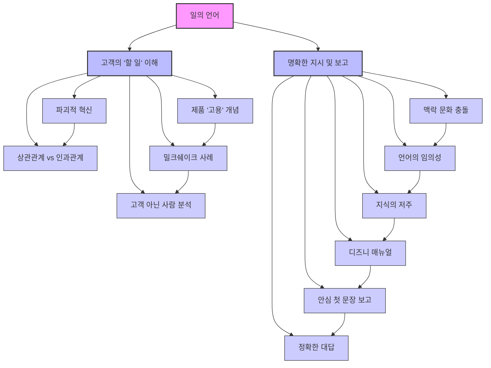

## 일의 언어: 일 잘하는 사람들의 비밀
이 책은 직장에서 효과적으로 소통하고, 혁신적인 아이디어를 발굴하며, 성공적인 결과를 만들어내는 방법을 알려주는 책이야. 특히, 우리가 흔히 저지르는 소통 오류를 짚어주고, 어떻게 하면 더 명확하고 구체적으로 말하고 들을 수 있는지 그 비법을 전수해 줘. 이 책을 통해 일의 언어를 배우고, 더 나은 직장 생활을 만들어갈 수 있을 거야.

## 1. 파괴적 혁신과 잡스 이론: 고객의 진짜 '할 일'을 찾아라 

클레이튼 크리스텐슨 교수는 '파괴적 혁신'이라는 개념으로 유명해졌어. 파괴적 혁신은 마치 작은 새싹이 자라서 큰 나무를 쓰러뜨리듯이, 처음에는 별 볼 일 없어 보이지만 새로운 고객의 요구를 딱 맞춰서 기존 시장을 완전히 바꿔버리는 혁신을 말해. 하지만 이런 혁신적인 제품을 어떻게 만들어야 할까? 그 답을 찾기 위해 크리스텐슨 교수는 '잡스 이론(Jobs-to-be-Done Theory)'을 만들었어.

### 1.1. 파괴적 혁신이란 무엇일까? 
1. **새로운 제품이 기존 시장을 뒤엎는 것**:
  - 처음에는 좀 허술해 보여도, 새로운 고객의 필요를 정확히 채워주는 제품이 있어.
  - 이런 제품이 시간이 지나면서 점점 발전하면, 결국 기존의 잘나가던 제품들을 밀어내고 시장의 주류가 되는 거야.
  - 예를 들어, 옛날 비디오 플레이어(VCR) 같은 제품들이 새로운 기술에 밀려 사라진 것처럼 말이야.

### 1.2. '경쟁의 행운과 대양에서'라는 책 제목의 의미 
1. **운에 맡기는 사업 방식에 대한 비판**:
  - 책의 원래 영어 제목은 'Competing Against Luck'인데, 이걸 직역하면 '운에 맞서 경쟁한다'는 뜻이야.
  - 많은 사람이 사업을 할 때 "이거 잘 될 것 같은데?" 하면서 주먹구구식으로 시작하는 경우가 많아.
  - 기술이 아무리 뛰어나도, 고객이 왜 이 제품을 사야 하는지 명확한 이유를 모르면 결국 운에 맡기는 것과 다름없다는 거지.
  - 크리스텐슨 교수는 이런 운에 맡기는 방식으로는 성공할 수 없다고 말해.

### 1.3. 상관관계와 인과관계의 차이: 진짜 원인을 찾아라 
1. **데이터의 함정: 상관관계에 속지 마라**:
  - 사람들은 성공 방법을 찾기 위해 데이터를 많이 모으려고 해.
  - 하지만 단순히 데이터가 많다고 해서 답이 나오는 건 아니야.
  - 두 가지 현상이 동시에 일어난다고 해서, 하나가 다른 하나의 원인이라고 착각하는 경우가 많아. 이걸 '상관관계'라고 해.
  - 예를 들어, 여름에 아이스크림 판매량이 늘고 산불도 많이 난다고 해서, 아이스크림을 많이 먹으면 산불이 난다고 말할 수 없는 것과 같아. 이건 둘 다 '더운 날씨'라는 진짜 원인 때문에 일어나는 현상일 뿐이야.
2. **진짜 중요한 것은 '**인과관계**'**:
  - 혁신적인 제품을 만들려면, 어떤 현상이 왜 일어나는지, 즉 '원인과 결과'를 정확히 알아야 해. 이걸 '인과관계'라고 해.
  - 고객이 어떤 제품을 사는 진짜 이유, 즉 '원인'을 파악해야만 그 문제를 해결해 줄 수 있는 제품을 만들 수 있어.
  - 마치 병의 원인을 정확히 알아야 치료법을 찾을 수 있는 것과 같지. 옛날에는 체질이나 나쁜 공기가 병의 원인이라고 생각했지만, 파스퇴르가 세균을 발견하면서 진짜 원인을 알게 된 것처럼 말이야. 

### 1.4. 잡스 이론의 핵심: 고객은 제품을 '고용'한다 
1. **제품을 '고용'하고 '해고'하는 **고객:
  - 고객은 어떤 '할 일(Job)'을 해결하기 위해 제품이나 서비스를 '고용'하는 거야.
  - 그리고 그 할 일이 끝나면 제품을 '해고'하는 거지.
  - 예를 들어, 다이어트를 위해 헬스클럽을 '고용'했다가 목표를 달성하면 '해고'하는 것처럼 말이야. 
2. **고객의 '할 일'이란 무엇인가**:
  - 고객이 제품을 사는 진짜 목적, 즉 '해결하고 싶은 문제'가 바로 '할 일'이야.
  - 아이패드를 사는 사람은 단순히 예쁜 기기를 사는 게 아니라, 이동하면서 자유롭게 자료를 입력하고, 검색하고, 책을 보고 싶은 '할 일'을 해결하기 위해 사는 거야. 
  - 이 '할 일'은 고객이 어떤 상황에서 어떤 욕구를 가지고 있는지 깊이 관찰해야만 알 수 있어.

### 1.5. 밀크쉐이크 사례: 숨겨진 '할 일'을 발견하다 

1. **기존 시장 조사의 한계**:
  - 밀크쉐이크 판매량을 늘리기 위해 일반적인 시장 조사를 했다고 가정해 봐.
  - 고객들에게 "밀크쉐이크를 어떻게 개선하면 좋을까요?"라고 물으면, "더 달게 해주세요", "과일을 넣어주세요" 같은 대답이 나올 거야.
  - 하지만 이런 대답들은 진짜 '할 일'을 알려주지 못해.
2. **관찰을 통한 '할 일' 발견**:
  - 크리스텐슨 교수는 직접 매장에 가서 고객들을 관찰했어.
  - **오전 9시 이전 출근길 **고객:
  - 이들은 혼자 와서 밀크쉐이크를 사서 차에 싣고 가는 경우가 많았어.
  - 이들에게 밀크쉐이크는 1시간 넘는 출근길에 심심함을 달래고, 포만감을 주는 '할 일'을 해주는 제품이었어.
  - 이때 밀크쉐이크의 경쟁자는 바나나, 베이글, 커피 등이었지. 
  - **오후 늦게 아이와 함께 오는 고객**:
  - 이들은 아이에게 밀크쉐이크를 사주는 경우가 많았어.
  - 아이에게 미안한 마음을 달래주고, 아이가 좋아할 만한 보상을 해주는 '할 일'을 해주는 제품이었어.
  - 이때 밀크쉐이크의 경쟁자는 장난감이나 다른 간식들이었지. 
3. **상황에 따라 달라지는 '할 일'과 **경쟁자:
  - 같은 밀크쉐이크라도 고객이 어떤 상황에 처해 있느냐에 따라 '할 일'이 달라지고, 그에 따라 경쟁자도 달라진다는 것을 알 수 있어.
  - 이처럼 '할 일'을 이해하면 진정한 제품 차별화 포인트를 찾고, 장기적인 제품 개발 방향을 설정할 수 있어. 

### 1.6. 새로운 기회는 '고객이 아닌 사람'에게서 온다 
1. **우리의 고객이 아닌 사람들을 분석하라**:
  - 왜 어떤 사람들은 우리 제품을 사용하지 않을까? 그들이 제품을 사용하지 못하는 '제약 조건'은 무엇일까?
  - 이런 질문을 통해 새로운 시장과 기회를 발견할 수 있어.
  - 예를 들어, 인도에서 타타 자동차가 300만 원짜리 초저가 자동차를 만든 사례가 있어. 
  - 인도에서는 대중교통이 발달하지 않아 많은 가족이 오토바이 한 대에 여러 명이 타는 위험한 상황이 많았어.
  - 타타는 이런 저소득층 가족들이 안전하게 이동할 수 있는 '할 일'을 해결하기 위해 저렴한 자동차를 개발한 거야.
  - 처음에는 품질이 떨어졌지만, 계속 개선하면서 결국 주력 제품 중 하나가 되었지.
2. **제품을 '안 사는 이유'와 '다르게 쓰는 방법'을 관찰하라**:
  - 사람들이 왜 특정 제품을 안 사는지, 혹은 사더라도 예상치 못한 방식으로 사용하는지 관찰하면 새로운 통찰력을 얻을 수 있어. 
  - 예를 들어, 만년필을 쓰는 사람들이 일반 노트 대신 비싼 노트를 사는 이유는, 일반 노트는 만년필 잉크가 뒤로 배어 나오기 때문이야. 
  - 에버노트 사용자 커뮤니티에서는 개발자도 몰랐던 새로운 기능 활용법들이 공유되기도 했지. 
3. **사회적, 정서적 '할 일'도 중요하다**:
  - 제품의 기능적인 측면뿐만 아니라, 사회적, 정서적인 '할 일'도 고객의 선택에 큰 영향을 미쳐. 
  - 예를 들어, 강남의 IT 벤처 창업가들이 아이폰과 맥북을 쓰는 것은 단순히 기능 때문이 아니라, 특정 커뮤니티에 소속감을 느끼고 인정받고 싶은 사회적, 정서적 '할 일' 때문일 수 있어.
  - 이런 복합적인 '할 일'을 이해해야 진정한 혁신을 이룰 수 있어.

### 1.7. '할 일'을 중심으로 회사의 모든 것을 재정비하라 
1. **고객의 '**할 일**'을 회사의 비전으로 삼아라**:
  - 회사의 목표와 비전을 '고객의 할 일을 해결하는 것'으로 명확히 설정해야 해.
  - 모든 직원과 부서가 이 목표에 집중할 수 있도록 시스템을 구축해야 해.
  - 예를 들어, 드릴을 파는 회사는 단순히 '드릴'을 파는 것이 아니라, '벽에 구멍을 뚫는 할 일'을 해결해 주는 회사라고 생각해야 해. 
2. **'할 일'을 구체적으로 정의하고 해결책을 제시하라**:
  - 고객의 '할 일'을 단순히 "340ml의 밀크쉐이크가 필요하다"처럼 제품으로 정의하면 안 돼. 
  - "차를 몰고 가는 동안 나를 심심하게 하지 않을 것이 필요하다"처럼, 고객이 원하는 '결과'를 중심으로 정의해야 해.
  - 이 '할 일'을 해결하기 위한 구체적인 솔루션을 만들고, 이를 중심으로 브랜드와 시스템을 구축해야 해.

## 2. 일의 언어: 지시편 - 오해 없이 정확하게 소통하는 법 

직장에서 일을 잘하려면 '일의 언어'를 잘 사용해야 해. 특히 지시하거나 요청할 때 오해 없이 정확하게 전달하는 것이 중요해. 많은 사람들이 "분명히 말했는데 왜 엉뚱하게 해오지?"라고 생각하지만, 사실은 서로 다른 언어를 쓰고 있기 때문이야.

### 2.1. 맥락 문화의 충돌: 동양과 서양의 소통 방식 차이 
1. 동양의 고맥락 문화:
  - 우리는 눈치나 뉘앙스처럼 말하지 않아도 알아듣는 것을 중요하게 생각해.
  - "좀 덥지 않니?"라고 말하면 에어컨을 틀어달라는 뜻으로 알아듣는 것처럼 말이야. 
  - 간접적이고 비언어적인 표현을 많이 사용하고, 집단의 분위기를 중시하는 경향이 있어.
2. 서양의 저맥락 문화:
  - 서양은 직접적이고 명확하게 말하는 것을 선호해.
  - "에어컨 틀어줬으면 좋겠다"라고 직접적으로 말하는 것처럼 말이야. 
  - 개인주의적 가치관을 바탕으로 선형적인 논리(직선적인 사고방식)를 강조해.
3. **세대 간 오해**:
  - 요즘 세대(MZ세대)는 동양의 고맥락 문화 해독력이 떨어지는 경우가 많아.
  - 팀장님이 지각하는 직원에게 계속 기침 소리를 내며 눈치를 줘도, 직원은 팀장님이 감기에 걸렸다고 생각할 수 있어. 
  - 이사님이 "저쪽 파트너사는 세 명이 나오는데 우리 회사는 나 혼자네"라고 말해도, 직원은 그저 독백이라고 생각하고 따라갈 생각을 못 할 수 있지. 
  - 이런 오해는 나쁜 사람이 있어서가 아니라, 서로 다른 언어 레벨에서 소통하기 때문에 생기는 거야.

### 2.2. 언어의 임의성과 지식의 저주: 내가 아는 것을 상대방도 알까? 
1. **세상에 완벽히 똑같은 단어는 없다**:
  - 같은 단어라도 사람마다 다르게 받아들일 수 있어. 이걸 '언어의 임의성'이라고 해.
  - '사랑해요'라는 말도 듣는 사람의 상황에 따라 따뜻하게 들릴 수도, 무섭게 들릴 수도 있는 것처럼 말이야. 
  - 직장에서 "1사분기 매출 현황 간단히 정리해 주세요"라고 지시했을 때, '간단히'의 기준이 사람마다 다를 수 있어. 
  - 어떤 직원은 메모지에 핵심 숫자만 적는 것을 '간단히'라고 생각할 수 있고,
  - 다른 직원은 한 페이지에 주요 항목별 추이를 정리하는 것을 '간단히'라고 생각할 수 있지.
  - 지시하는 사람은 본인의 머릿속에 있는 기준을 상대방도 알 것이라고 착각하기 쉬워.
2. **지식의 저주: 내가 아는 것을 상대방도 안다고 착각하는 것**:
  - 내가 어떤 내용을 잘 알고 있으면, 상대방도 당연히 알 것이라고 생각하는 경향이 있어. 이걸 '지식의 저주'라고 해.
  - 엘리자베스 뉴턴의 '노래 맞추기 실험'처럼, 노래를 치는 사람은 멜로디를 머릿속으로 들으니 상대방도 맞출 것이라고 생각하지만, 실제로는 거의 맞추지 못하는 것과 같아. 
  - 프로젝트를 오래 진행한 사람은 그 내용에 대해 하루 종일 생각하기 때문에, 다른 사람들도 그 맥락을 알 것이라고 생각하고 대화하다가 오해가 생기기도 해. 

### 2.3. 모호한 지시가 부르는 오해: 구체적으로 말해야 하는 이유 
1. **똑바로 말해도 오해가 생기는 경우**:
  - "맨 앞에 있는 우주선"이라고 말해도, 어떤 사람은 가장 가까이 있는 우주선을, 어떤 사람은 가장 큰 우주선을 '맨 앞에 있는 우주선'이라고 생각할 수 있어. 
  - "개 상체에 마이크로칩을 달아줘"라고 했을 때, 어떤 사람은 머리와 앞다리를 상체로, 어떤 사람은 머리와 등을 상체로 생각할 수 있어. 
  - 이처럼 간단한 말도 사람마다 다르게 해석될 수 있기 때문에, 내가 아는 단어가 당연히 그 의미일 것이라고 생각하면 안 돼.
2. **경력이 늘수록 잃어버리는 것: 초심자의 마음**:
  - 일의 경력이 늘어나면, 내가 예전에 몰랐던 것들을 잊어버리게 돼.
  - 새로운 업계나 분야에 가면 그 특유의 용어나 질서가 가장 어려운데, 본인이 그 분야에 오래 있다 보면 남들도 다 아는 이야기처럼 느껴지는 거야.
  - 필라테스 강사가 "갈비뼈 닫으세요", "척추를 하나하나 쌓으세요"라고 말하면 초심자는 혼란에 빠지는 것처럼, 전문 용어는 다른 사람에게는 이해하기 어려운 말이 될 수 있어. 
  - 따라서 지시할 때는 가능한 한 정확하고 구체적이며 명확하게 말해야 해.

### 2.4. 디즈니처럼 구체적으로 지시하라 

1. **상대방의 경험에 의존하지 마라**:
  - "방 청소해라"라고 했을 때, 내가 생각하는 청소와 상대방이 생각하는 청소의 기준이 다를 수 있어. 
  - 상대방의 경험이나 지식에 의존하지 않고, 누가 봐도 똑같이 따라 할 수 있도록 매뉴얼을 만드는 것이 중요해.
2. **디즈니랜드의 매뉴얼 방식**:
  - 디즈니랜드는 전 세계 다양한 배경을 가진 직원들이 일하지만, 세계 최고 수준의 서비스를 제공해.
  - 이는 아무런 배경 지식이나 경험이 없는 사람도 그대로 따라 하면 원하는 스탠더드를 달성할 수 있도록 '완벽하게' 매뉴얼을 만들기 때문이야.
  - 예를 들어, 세면대 청소 매뉴얼을 만들 때: 
  - "세면대 주변 쓰레기를 쓰레기통에 넣는다."
  - "세제와 스펀지로 세면대 안쪽을 닦는다."
  - "걸레를 물이 흐르지 않을 정도로 짜서 반쪽 면으로 세면대 안쪽을 구석구석 닦는다."
  - "남은 휴지가 1분 이하면 남아 있어도 보충한다."
  - 이처럼 구체적인 기준을 제시하여 '보충할까 말까' 고민할 필요가 없게 만드는 거야.
3. **지시할 때 5분을 투자하라**:
  - 상사에게는 너무 많이 말하고, 직원에게는 너무 적게 말하는 경향이 있어.
  - 지시할 때는 텍스트나 참고 자료를 활용하여 '조감도'(전체적인 그림)를 그려주는 것이 중요해.
  - 예를 들어, "국내 바이오 산업 현황 발전 방안 보고서 써 줘"라고만 하지 말고, "제한 배경 한 페이지, 문제점은 이 세 가지 키워드 위주로, 참고 자료는 이거"처럼 구체적으로 가이드라인을 제시하는 거야. 
  - 지시하는 사람이 5분을 투자하면, 원하는 결과물을 더 빨리 얻을 가능성이 높아져.
  - 텍스트가 어렵다면 그림으로라도 보여주는 것이 좋아. 미용실에서 원하는 헤어스타일 사진을 보여주는 것처럼 말이야. 

### 2.5. 평범한 사람이 이해할 수 있는 언어로 말하라 
1. 전문 용어** 사용에 주의하라**:
  - 각 분야마다 고유한 전문 용어가 있지만, 다른 분야 사람들에게는 이해하기 어렵거나 우스꽝스럽게 들릴 수 있어.
  - "이번 스프링 시즌에 릴렉스한 위크엔드 블루톤이 감미된 시크 아웃핏 한 원피스는 로맨스를 꿈꾸는 당신의 머스트 해브"처럼 말하면, 패션 업계 사람이 아니면 무슨 말인지 알기 어렵지. 
  - 같은 부서 직원에게도 조심해야 하지만, 특히 파트너사와 협업할 때는 평범한 사람도 이해할 수 있는 언어로 바꿔서 소통하는 것이 중요해.
2. **계속 체크하고 명확하게 지시하라**:
  - 내가 생각하는 것과 상대방이 생각하는 것이 같은지 계속 확인해야 해.
  - "나는 이렇게 생각하지만 상대방도 그렇게 생각하고 있는지 계속 체크하는 것이 중요하다"는 것을 잊지 마. 
  - 이제는 정확하고 명확하게, 그리고 친절하게 지시해야 할 때야.

## 3. 일의 언어: 보고편 - 상사가 원하는 방식으로 보고하는 법 

일의 언어는 일상생활의 언어와는 본질적으로 달라. 하지만 타고나는 것이 아니라 배우면 누구나 잘할 수 있는 기술이야. 특히 상사나 클라이언트에게 보고할 때는 그들이 원하는 방식으로 소통하는 것이 중요해.

### 3.1. 상사의 특징: 주의력 결핍 증후군 
1. **상사는 '**주의력 결핍 증후군**' 환자**:
  - 대부분의 상사나 클라이언트는 아무리 성격이 좋아도 '주의력 결핍 증후군' 증상을 보여. 
  - 보고를 듣고 있으면 "결론이 뭐야?"라고 묻거나, 딴생각을 하다가 나중에 엉뚱한 소리를 하기도 해.
  - 상사는 여러 팀원의 수많은 업무와 미팅, 지시 사항 등으로 머리가 복잡하기 때문이야.
2. **'내가 무슨 말을 했느냐'보다 '상대방이 무슨 말을 들었느냐'가 중요**:
  - 아인슈타인이 "어떤 것을 간단하게 설명하지 못했다면 제대로 이해하지 못했기 때문"이라고 말한 것처럼, 보고는 듣는 사람 입장에서 이해하기 쉬워야 해. 

### 3.2. 안심 첫 문장, 30초 두괄식 보고 

1. **보고의 세 가지 목적**:
  - **자랑**: 당신이 시킨 일이 잘 진행되고 있으니, 당신도 당신 상사에게 자랑해도 된다는 것을 알리는 거야. 
  - 현황 중계: 다른 일도 잘 진행되고 있는데, 참고로 알아야 할 것들을 알려주는 거야. 
  - 도움 요청: 문제가 생겼을 때, 해결 과제와 함께 도움을 요청하는 거야. 
2. 안심 첫 문장**, 30초 두괄식의 중요성**:
  - 보고를 잘 못하는 사람들은 자랑을 해도 욕을 먹고, 도움을 요청해도 혼나는 경우가 많아.
  - 상사는 결론이 나올 때까지 집중하지 못하기 때문에, 먼저 결론부터 말해서 '안심'시켜야 해.
  - **자랑 **보고: "팀장님, 좋은 소식이 있어서 보고드리러 왔어요!"라고 먼저 말하면, 팀장은 집중해서 듣게 돼. 
  - 예를 들어, "저번 달 프로젝트를 대표님이 너무 마음에 들어 하셔서 식사 한번 같이 하시자고 연락이 왔어요"라고 말하면, 팀장도 자기 상사에게 보고할 내용을 미리 생각하며 집중해서 듣게 되는 거지. 
  - **현황 중계 보고**: "팀장님, 별거 아니고요, 지금 한 3개 정도 여쭤볼 게 있어서 간단한 현황 보고드리려고 하는데 시간 괜찮으세요?"라고 말하면, 듣는 사람도 편안하게 받아들일 수 있어. 
  - 유치원 선생님이 학부모에게 전화할 때 "어머니, 우리 아이 너무너무 잘하고 있고요, 구청에서 식습관 조사 공문이 내려와서 그것 때문에 전화드렸어요"라고 말하는 것과 같아. 
  - **도움 요청 보고**: "상무님, A 컨퍼런스 관련해서 다 잘 진행되고 있는데요, 연사 비용 200만 원 예산 초과 이슈가 있어서 보고드리러 왔어요"라고 먼저 말하면, 상무님은 이미 상황을 파악하고 듣게 돼. 
  - 더 나아가 "재무팀에 전화 한 통 해주셨으면 해서 왔어요"처럼, 상사가 해야 할 일까지 명확히 제시하면 더욱 좋아. 
  - 이렇게 안심 첫 문장과 두괄식으로 보고하면, 상사는 집중해서 듣고, 긍정적인 반응을 보일 가능성이 높아져.

### 3.3. 정확한 대답과 질문: 오해를 줄이는 소통 습관 

1. **물어본 것에 정확하게 대답하라**:
  - 많은 사람이 질문에 대해 정확하게 대답하지 않는 경우가 많아.
  - 예를 들어, "김대리, 아침 먹었어요?"라고 물었을 때, "오늘 조찬 회의가 있었어요"라고 대답하면, 먹었다는 건지 안 먹었다는 건지 알 수 없어. 
  - 정확하게는 "네, 먹었어요. 오늘 조찬 회의가 있었거든요" 또는 "아니요, 안 먹었어요. 오늘 조찬 회의가 있었거든요"라고 대답해야 해. 
  - "카탈로그 언제 완성되나요?"라는 질문에 "방금 디자이너한테 넘겼습니다"라고 대답하면, 언제 완성될지는 알 수 없어. 
  - "2주 정도 걸려요"라고 명확하게 대답해야 해. 
  - "해외 출장 항공편과 숙박 잘 예약되어 있나요?"라는 질문에 "여행사에 얘기했습니다"라고 대답하면, 예약이 완료되었는지 알 수 없어. 
  - "네, 잘 예약되어 있습니다" 또는 "아니요, 아직 확인 안 해봤습니다"라고 정확하게 대답해야 해. 
2. **습관적으로 고쳐야 할 부분**:
  - 본인은 정확하게 대답했다고 생각하지만, 상대방은 그렇지 않다고 느끼는 경우가 많아.
  - 특히 실무자들 중 80% 이상이 이런 실수를 저지르기 때문에, 의도적으로 고치려는 노력이 필요해.
  - 물어본 것에 정확하게 대답하고, 그 후에 부연 설명을 이어가는 습관을 들이는 것이 중요해.

