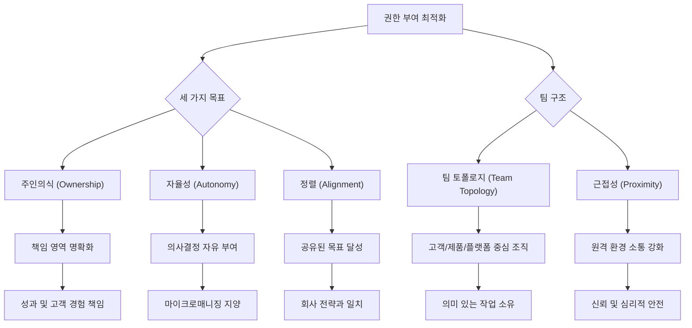
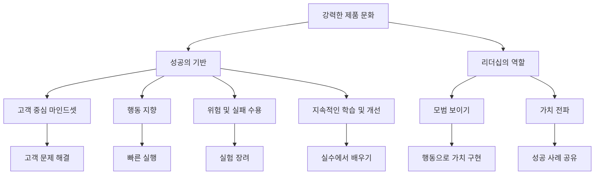

## 1. 책 소개 
이 책은 평범한 사람들이 모여 특별한 제품을 만드는 방법을 알려주는 책이야. 특히 제품 개발 방식을 바꾸고, 팀원들에게 권한을 주는 것이 얼마나 중요한지 강조하고 있어. 최고의 제품을 만드는 회사들이 어떻게 일하는지 궁금하다면 이 책이 답을 줄 거야.

## 2. 제품 개발의 새로운 생각: 권한을 가진 팀 

제품을 만드는 방식에 대한 생각을 바꿔야 해. 마치 축구팀에서 감독이 모든 걸 지시하는 게 아니라, 선수들이 스스로 판단하고 움직이도록 하는 것과 같아.

1. **마인드셋의 변화**:
  1. 예전에는 '10배 잘하는 직원' 같은 슈퍼스타를 찾으려고 했어. 마치 혼자서 모든 골을 넣는 스트라이커를 찾는 것처럼 말이야. 
  2. 하지만 이 책은 그런 슈퍼스타 한 명보다는, 모든 팀원이 자기 능력을 최대한 발휘할 수 있는 환경을 만드는 게 더 중요하다고 말해. 
  3. 평범한 사람들도 특별한 결과를 만들 수 있도록 팀에 권한을 줘야 한다는 거야. 

2. **권한을 가진 팀 vs. **기능 팀:
  1. **기능 팀(Feature Teams)**은 마치 식당에서 주문만 받는 직원 같아. 
  - 그냥 '이 기능 만들어' 하고 목록을 주면 시키는 대로 만드는 팀이야.
  - 자기가 만드는 제품에 대한 주인의식이 없어서 영감을 받기 어렵고, 결국 노력 낭비나 기회 상실로 이어질 수 있어. 
  2. **권한을 가진 팀(**Empowered Teams**)**은 마치 요리사가 직접 메뉴를 개발하고 손님 반응까지 책임지는 것과 같아. 
  - 이 팀은 '왜 이 문제를 해결해야 하는지(Why)'를 이해하고, 문제 자체를 자기 것으로 여겨.
  - 단순히 기능을 만드는 것을 넘어, 어떤 결과(Outcome)를 만들어낼지, 어떤 영향(Impact)을 줄지에 책임감을 느껴.
  - 예를 들어, 'X 버튼을 만들어'가 아니라 '사용자가 Y를 달성하도록 어떻게 도울까?'를 고민하는 거지. 
  3. 이런 작은 변화가 팀의 창의력과 문제 해결 에너지를 엄청나게 끌어올릴 수 있어. 

## 3. 권한을 가진 팀을 만드는 실질적인 방법 

권한을 가진 팀을 만들려면 몇 가지 중요한 단계가 필요해. 마치 배가 목적지에 잘 도착하려면 나침반과 지도가 필요한 것과 같아.

1. 전략적 맥락**(Strategic Context) 제공**:
  1. 팀에게 단순히 '문제'만 던져주고 알아서 하라고 하면 안 돼. 
  2. 팀은 회사의 비전, 핵심 가치, 전체 전략이 무엇인지 깊이 이해해야 해. 마치 지도를 주고 어디로 가야 할지 알려주는 것처럼 말이야. 
  3. 이런 맥락이 없으면 팀은 어둠 속에서 헤매는 것과 같아. 기술적으로 아무리 훌륭한 것을 만들어도 회사의 목표나 고객의 진짜 필요와 맞지 않으면 헛수고가 될 수 있어. 

2. **리더십의 역할 변화**:
  1. 리더는 예전처럼 위에서 모든 것을 통제하는 '지휘자'가 아니야. 
  2. 오히려 팀이 잘 성장할 수 있는 환경을 만들어주는 '정원사'와 같다고 보면 돼. 
  3. 팀원들이 자유롭게 협력하고, 위험을 감수하며 실수로부터 배울 수 있는 신뢰의 문화를 만들어야 해. 

## 4. 제품 리더의 핵심 책임: 비전, 전략, 원칙 

제품 리더는 마치 오케스트라의 지휘자 같아. 전체 연주가 아름답게 흘러가도록 큰 그림을 그리고 방향을 제시해야 해.

1. **명확한 **제품 비전**(**Product Vision**) 제시**:
  1. 제품 비전은 팀의 '북극성'과 같아. 모두가 나아가야 할 방향을 명확하게 보여주는 거야. 
  2. 이 비전은 미래에 대한 매력적인 그림을 그려야 해. '우리가 무엇을 만들고 싶은가?', '어떻게 사람들의 삶을 개선할 것인가?' 같은 질문에 답해야 해. 
  3. 이것은 조직 전체를 하나로 묶는 '함성'이 되고, 팀원들에게 영감을 줘. 

2. **비전을 구체적인 **전략**(**Strategy**)으로 전환**:
  1. 비전이 '어디로 갈 것인가'라면, 전략은 '어떻게 갈 것인가'에 대한 계획이야. 
  2. 제품 전략은 어려운 선택을 하는 과정이야. 어떤 문제를 우선순위에 둘지, 어떤 시장에 집중할지, 경쟁사보다 어떻게 돋보일지 결정해야 해. 
  3. 중요하지 않은 것들에 '아니오'라고 말할 줄 알아야 정말 중요한 것에 '예'라고 할 수 있어. 

3. **명확한 **제품 원칙**(**Product Principles**) 정의**:
  1. 제품 원칙은 팀이 결정을 내릴 때 따르는 '가이드라인'과 같아. 마치 요리할 때 레시피를 따르는 것처럼 말이야. 
  2. 이 원칙들은 팀이 어려운 상황에서 일관된 결정을 내리도록 도와줘.
  3. 예를 들어, '사용자 우선', '간결함 유지', '데이터 기반 의사결정' 같은 것들이 될 수 있어. 
  4. 이런 원칙이 있으면 모두가 무엇이 중요한지 이해하고 같은 방향으로 나아갈 수 있어. 

4. **조직 전체에 비전과 **전략** 전파(Evangelizing)**:
  1. 리더는 단순히 방향을 설정하는 것을 넘어, 모든 팀원이 그 여정에 대해 흥분하고 동참하도록 '영업'해야 해. 
  2. 제품 리더는 훌륭한 소통가이자 동기 부여자가 되어야 해. 회사의 모든 단계에서 비전, 전략, 원칙을 끊임없이 옹호하고 전파해야 해. 
  3. 이는 독재자처럼 명령하는 것이 아니라, 영감을 주는 '코치'처럼 이끄는 것을 의미해. 

## 5. 권한을 가진 팀의 실제 운영 방식 

권한을 가진 팀은 단순히 '왜' 권한을 줘야 하는지를 넘어, '어떻게' 실제로 움직이는지가 중요해. 마치 축구팀이 왜 이겨야 하는지 아는 것뿐만 아니라, 어떻게 훈련하고 경기를 운영하는지 아는 것과 같아.

1. **'10배 잘하는 직원' 신화 깨기**:
  1. 많은 회사들이 '10배 잘하는 직원(10x employee)'이라는 신화에 빠져 있어. 마치 모든 문제를 해결할 수 있는 슈퍼히어로 개발자가 필요하다고 믿는 것처럼 말이야. 
  2. 하지만 이 책은 그게 사실이 아니라고 말해. 아무리 뛰어난 개인이라도 그 영향력이 항상 커지는 건 아니야. 
  3. 오히려 협력적이지 않거나 팀에 해로운 행동을 하는 개인은 팀 전체에 더 큰 피해를 줄 수 있어. 
  4. 중요한 건 개인의 뛰어남이 아니라 '팀 역학'이야. 전체가 각 부분의 합보다 커지는 것이 핵심이지. 

## 6. 강력한 제품 회사의 인재 채용 및 육성 

강력한 제품 회사는 단순히 사람을 뽑는 것을 넘어, 팀의 문화와 성장에 맞는 인재를 찾고 지속적으로 성장시키는 데 집중해. 마치 씨앗을 심고 물을 주며 잘 자라도록 돌보는 것과 같아.

1. **채용 과정에 대한 주인의식**:
  1. 강력한 제품 리더들은 채용 과정을 단순히 인사팀의 업무로 보지 않아. 
  2. 그들은 적극적으로 채용에 참여하며, 기술뿐만 아니라 회사의 문화에 잘 맞는 사람을 찾아. 
  3. 새로운 직원은 회사 문화에 대한 '투자'라고 생각하기 때문에 매우 신중하게 사람을 뽑아. 

2. **엄격한 면접 과정**:
  1. 이력서의 체크리스트를 넘어서, 후보자가 어떻게 생각하고 문제를 해결하는지, 다른 사람들과 어떻게 상호작용하는지 보려고 해. 
  2. 특히 회사의 미션에 대한 '열정'과 협력하려는 의지, 고객 중심적인 태도를 중요하게 봐. 
  3. 단순한 기술적 능력뿐만 아니라 문화적 적합성과 문제 해결에 대한 진정한 열정을 가진 사람을 찾는 거야. 

3. **효과적인 온보딩(Onboarding) 및 지속적인 **코칭:
  1. 채용으로 끝나는 게 아니야. 신입 직원이 회사에 잘 적응하도록 돕는 '온보딩'과 지속적인 '코칭'이 매우 중요해. 
  2. 온보딩은 단순히 서류 작업이나 소개를 넘어, 신입 직원을 회사 문화에 몰입시키고 소속감을 느끼게 해야 해. 
  3. 성공에 필요한 자원을 제공하고, 첫날부터 성공할 수 있도록 지원하며, 팀의 일원으로서 목적의식을 느끼게 해야 해. 
  4. 그리고 지속적인 코칭과 개발이 진짜 중요해. 리더는 팀원들이 성장하고 잠재력을 최대한 발휘하도록 돕는 것을 가장 중요한 책임으로 여겨. 

## 7. 효과적인 코칭과 성장 지원 

효과적인 코칭은 팀원들이 스스로 문제를 해결하고 성장할 수 있도록 돕는 거야. 마치 낚시하는 법을 가르쳐주는 것과 같지, 물고기를 그냥 주는 게 아니라. 

1. 코칭** 마인드셋(Coaching Mindset) 채택**:
  1. 팀원들의 잠재력을 진정으로 믿고, 그들의 기술과 지식을 개발하도록 적극적으로 도와야 해. 
  2. 단순히 '무엇을 할지' 지시하는 것이 아니라, '어떻게 할지'를 안내하고, 위험을 감수하고 실수해도 괜찮은 안전한 공간을 만들어줘야 해. 
  3. 이런 '심리적 안전감'이 없으면 팀원들은 실험하지 않고 배우지 못하게 돼. 

2. **대화형 코칭**:
  1. 코칭은 일방적인 강의가 아니라 '대화'여야 해. 
  2. 질문을 하고, 팀원들의 말에 귀 기울이며, 건설적인 피드백을 주고, 스스로 강점과 약점을 파악하도록 도와야 해. 
  3. 이는 팀원들이 자신의 성장과 발전을 스스로 책임지도록 권한을 주는 협력적인 방식이야. 

3. **개인별 맞춤형 **코칭** 계획**:
  1. '평가(Assessment)' 도구를 사용해서 개인의 현재 기술과 지식을 역할 기대치와 비교해봐. 
  2. 이를 통해 코칭이 가장 큰 영향을 줄 수 있는 영역을 파악하고, 각 개인의 고유한 필요와 목표에 맞춰 코칭 방식을 조절할 수 있어. 
  3. 제품 지식, 산업 지식, 프로세스 기술 등 다양한 영역에 대한 맞춤형 코칭 계획을 세울 수 있어. 

4. **오너십(Ownership)을 가진 사고방식 코칭**:
  1. 제품 담당자들이 단순히 직원이 아니라 '오너'처럼 생각하고 행동하도록 코칭해야 해. 
  2. 단순히 '결과물(Output)'을 만드는 것을 넘어, '성과(Outcome)'에 집중하고, 결정이 미칠 더 넓은 영향까지 고려하도록 해야 해. 
  3. '서면 내러티브(Written Narrative)' 기법을 활용해 자신의 주장이나 제안을 작은 사업 계획서처럼 글로 쓰게 해봐. 
  - 이는 생각을 명확히 하고, 결정을 정당화하며, 아이디어를 구체화하도록 강제하는 효과가 있어. 
  - 이 내러티브를 팀과 이해관계자들과 공유하여 합의를 형성하고 모두가 같은 방향을 보도록 할 수 있어. 

## 8. 시간 관리와 협업의 중요성 

시간 관리는 마치 요리사가 여러 재료를 동시에 다루면서도 가장 중요한 요리에 집중하는 것과 같아. 그리고 협업은 여러 요리사가 함께 최고의 요리를 만드는 것과 같지.

1. **시간의 우선순위 정하기**:
  1. 제품 담당자들은 자신의 시간을 '무자비하게' 우선순위화해야 해. 
  2. 매일 최소 4시간은 방해받지 않고 '깊은 작업(Deep Work)'을 할 시간을 확보해야 해. 
  3. 이 시간에는 제품 발굴, 전략 개발, 고객 조사 등 큰 그림을 그리는 중요한 일에 집중해야 해. 
  4. 가치가 낮은 활동에는 '아니오'라고 말하고, 위임할 수 있는 것은 위임하며, 집중할 시간을 보호하는 경계를 설정해야 해. 

2. **진정한 협업(Collaboration) 문화 구축**:
  1. 권한을 가진 팀 내에서의 진정한 협업은 단순히 함께 일하는 것을 넘어, 팀의 다양한 관점과 기술을 적극적으로 활용하여 최고의 해결책을 찾는 것을 의미해. 
  2. 높은 수준의 '신뢰'와 '심리적 안전감'이 있어야 팀원들이 아이디어를 자유롭게 공유하고, 가정을 의심하며, 모르는 것을 인정할 수 있어. 
  3. 사람들이 말하기를 두려워하면 귀중한 통찰력을 놓치게 되고, 진정한 혁신은 일어나기 어려워. 
  4. 정기적인 브레인스토밍 세션, 공동 사용자 조사, 시각적 도구 사용 등을 통해 협업을 의도적인 실천으로 만들어야 해. 
  5. 협업은 저절로 생기는 것이 아니라, 번성할 수 있는 공간과 구조를 의도적으로 만들어야 해. 

## 9. 이해관계자 협력과 의사결정 

이해관계자들과의 협력은 마치 영화 제작에서 감독이 배우, 스태프, 투자자들과 소통하며 모두를 한 방향으로 이끄는 것과 같아.

1. 이해관계자**(Stakeholders)와의 관계 구축**:
  1. 효과적인 이해관계자 협력은 '강력한 관계'를 구축하는 것에서 시작해. 
  2. 이는 단순히 그들을 관리하는 것이 아니라, 그들의 관점과 목표를 이해하고, 모두에게 이익이 되는 결과를 달성하기 위해 함께 일하는 '파트너'로 보는 거야. 
  3. 적극적인 소통, 투명성, 정보 공유를 통해 이해관계자들을 의사결정 과정에 참여시키고 피드백을 요청하여 팀의 일원처럼 느끼게 해야 해. 

2. **제품 관리자의 역할**:
  1. 제품 관리자는 고객을 옹호하면서도 비즈니스의 제약을 존중하는 '균형 잡힌 역할'을 해야 해. 
  2. 적극적인 경청, 공감 능력, 회의적인 사람들을 설득하는 창의적인 방법 등 '이해관계자 관리 기술'을 개발해야 해. 
  3. 이해관계자와의 상호작용을 단순히 장애물이 아니라 관계를 구축하고 결과에 영향을 미칠 '기회'로 바꿔야 해. 

3. 가면 증후군**(Impostor Syndrome)에 대한 새로운 관점**:
  1. 가면 증후군(자신이 부족하다고 느끼는 것)은 많은 사람이 겪는 현실적인 문제이지만, 건강한 '자기 인식'의 신호일 수도 있어. 
  2. 이는 배우고 성장하려는 욕구로 볼 수 있어. 불확실성을 받아들이고, 더 배우기 위해 질문하고, 피드백을 구하는 동기가 될 수 있지. 
  3. 내면의 비판적인 목소리를 약점이 아니라, 더 나아가도록 격려하는 '코치'로 생각하는 관점의 전환이 필요해. 
  4. 가면 증후군은 '성실성'의 신호일 수도 있어. 이 증후군을 겪는 사람들은 대개 양심적이고, 자신의 일을 중요하게 여기며, 최선을 다하려는 높은 기준을 가지고 있어. 

4. **무결성(Integrity)에 기반한 의사결정**:
  1. 좋은 의사결정은 '무결성'에 뿌리를 두고 있어. 이는 신뢰할 수 있고, 회사의 최선의 이익을 위해 행동하며, 결과에 책임을 지는 것을 의미해. 
  2. 제품에 좋은 결정뿐만 아니라, 회사의 가치와 일치하는 결정을 내리는 것이 중요해. 
  3. '의사결정 프로세스 적정화(Right-sizing the decision-making process)'를 통해 모든 결정에 대해 공식적인 회의나 긴 분석이 필요하지 않다는 것을 알아야 해. 
  - 위험 수준과 잠재적 결과를 고려하여, 일부 결정은 빠르게, 다른 결정은 더 신중하게 내려야 해. 
  - 속도와 신중함 사이의 균형을 찾는 것이 중요해. 
  4. 권한을 가진 팀은 '협력적으로' 의사결정을 내리는 데 익숙해야 해. 제품 관리자는 디자인, 유용성, 기술과 같은 영역에서 팀원들의 전문 지식을 활용해야 해. 
  5. 이는 제품 관리자가 유일한 의사결정자가 아니라, 팀의 집단 지혜를 활용하는 것을 의미해. 

## 10. 성과 관리와 고객 중심 제품 개발 

성과 관리는 팀원들이 각자의 목표를 넘어 함께 큰 목표를 달성하도록 돕는 거야. 그리고 고객 중심 제품 개발은 마치 요리사가 손님의 입맛을 정확히 파악해서 최고의 음식을 만드는 것과 같아.

1. **개인 목표와 팀 목표의 조화**:
  1. 전통적인 성과 관리 시스템은 종종 경쟁적인 환경을 만들어서 협력을 저해할 수 있어. 
  2. 대신 '팀 목표'와 '공동 책임'에 초점을 맞춰야 해. 개인의 성과보다는 '집단적인 성공'에 보상하는 거야. 
  3. 개인의 기여는 동료 피드백, 자기 평가, 관리자 의견을 조합하여 측정할 수 있어. 
  4. 보상은 회사의 전반적인 성과와 팀의 기여도에 맞춰야 해. 
  5. 투명성과 공정성이 중요해. 사람들이 결정 과정을 이해하고 공정하게 대우받는다고 느껴야 사기 저하와 동기 부족을 막을 수 있어. 

2. 고객 중심**(Customer Centricity) 제품 개발**:
  1. 권한을 가진 팀은 단순히 기능만 만드는 공장이 아니야. 
  2. 고객의 필요를 이해하는 것부터 해결책을 설계하고 제공하는 것까지, 전체 '고객 여정'에 책임이 있어. 
  3. 그들은 책임 영역 내에서 의사결정을 내리고 문제를 해결할 자율성을 부여받아. 
  4. 이는 고객의 필요, 고충, 목표를 깊이 이해하는 '고객 중심성'을 의미해. 
  5. 제품을 고객의 눈으로 보고, 고객 경험을 우선시하는 결정을 내려야 해. 
  6. 고객 중심이 부족하면 제품이 시장에서 실패할 수 있어. '올바른 것을 제대로 만드는 것'이 중요하지, 단순히 '제대로 만드는 것'만이 중요한 게 아니야. 
  7. 권한을 가진 팀은 고객과 더 가깝고, 더 많은 자율성을 가지며, 고객 문제 해결에 더 열정적이기 때문에 고객 중심적일 가능성이 높아. 

## 11. 제품 로드맵과 반복 개발 

제품 로드맵은 마치 여행 계획과 같아. 큰 방향은 있지만, 상황에 따라 유연하게 바꿀 수 있어야 해. 그리고 반복 개발은 작은 걸음으로 계속 나아가면서 배우고 개선하는 것과 같아.

1. **유연한 **제품 로드맵**(Product **Roadmap**) 활용**:
  1. 로드맵은 팀의 '정렬'과 '소통'에 필수적이지만, 돌에 새겨진 것처럼 고정된 문서로 취급해서는 안 돼. 
  2. 이는 일반적인 방향과 우선순위에 대한 공유된 이해를 제공하지만, 피드백, 시장 상황, 팀의 학습에 따라 지속적으로 '진화'하는 유연한 문서여야 해. 
  3. 전체 팀을 로드맵 과정에 참여시켜 의견과 피드백을 수렴하고, 모두가 우선순위와 과제에 대한 공유된 이해를 갖도록 해야 해. 
  4. 이해관계자들에게 로드맵을 소통하고, 진행 상황과 방향 변경 사항을 계속 알려주는 '투명성'이 중요해. 

2. **반복 개발(Iterative Development)과 지속적인 개선**:
  1. 제품을 만들고 출시할 때는 '반복 개발'이 중요해. 즉, '애자일(Agile)' 접근 방식처럼 작게 만들고, 테스트하고, 배우고, 반복하는 거야. 
  2. 큰 프로젝트를 작고 관리하기 쉬운 덩어리로 나누고, 이를 반복적으로 만들고 테스트하며, 피드백을 수집해야 해. 
  3. 사용자에게 가능한 한 빨리 제품을 제공하고, 피드백을 통해 배우고, 필요에 맞게 개선하는 것이 중요해. 
  4. '지속적인 통합(Continuous Integration)'과 '지속적인 배포(Continuous Delivery)'를 통해 제품을 빠르고 자주 출시할 수 있도록 자동화해야 해. 
  5. '데이터 기반 의사결정'을 통해 핵심 지표를 추적하고, 제품의 성공을 평가하는 데 활용해야 해. 
  6. OKR(목표 및 핵심 결과) 프레임워크는 제품 개발 노력을 전반적인 비즈니스 목표와 일치시키고 진행 상황을 추적하는 데 효과적이야. 
  7. 팀이 자체 핵심 결과를 정의하도록 권한을 부여하면, 성공에 필수적인 '주인의식'과 '책임감'을 만들 수 있어. 

## 12. 권한을 가진 팀의 실제 사례: 온라인 구인 시장 

온라인 구인 시장의 한 회사는 권한을 가진 팀의 원칙을 받아들여 혁신과 성장을 이끌어냈어. 마치 작은 가게가 큰 기업으로 성장하기 위해 운영 방식을 완전히 바꾼 것과 같아.

1. **직면한 도전 과제**:
  1. 이 회사는 빠르게 성장하고 있었고, 시장이 폭발적으로 커지면서 제품과 팀을 확장해야 하는 큰 도전에 직면했어. 
  2. 하지만 혁신 속도를 따라가지 못하고 있었고, 제품 개발 과정에 문제가 생기기 시작했어. 
  3. 전통적인 계층적, 하향식 접근 방식으로는 더 이상 안 된다는 것을 깨달았어. 
  4. 팀원들에게 더 많은 자율성, 혁신성, 변화에 대한 반응성을 부여해야 할 필요성을 느꼈어. 

2. **권한을 가진 팀으로의 전환**:
  1. 그들은 '기능별 사일로(Functional Silos)'(각 부서가 따로 일하는 방식)에서 벗어나 팀을 재편성했어. 
  2. 대신 특정 고객의 필요나 경험에 초점을 맞춘 '교차 기능 팀(Cross-functional Teams)'을 만들었어. 
  3. 엔지니어링, 디자인, 제품 관리 팀을 모두 한데 모아 더 효과적으로 협력할 수 있도록 했어. 
  4. 각 팀은 고용주 홈페이지, 채용 도구, 구직 검색 등 제품의 특정 영역에 전념했고, 책임 영역 내에서 의사결정을 내리고 문제를 해결할 자율성을 가졌어. 
  5. 강력한 내부 플랫폼을 구축하여 데이터 분석, 사용자 인증, 커뮤니케이션 도구와 같은 필수 서비스를 제공했어. 
  6. OKR 프로세스를 엄격하게 구현하여 팀 목표를 회사 목표와 일치시키고, 팀이 자체 핵심 결과를 정의할 자율성을 부여했어. 

3. **놀라운 결과**:
  1. 개발 속도가 크게 향상되었고, 새로운 기능과 제품을 훨씬 빠르게 출시할 수 있었어. 
  2. 고객 만족도와 참여도로 측정되는 제품 품질도 크게 개선되었어. 
  3. 더 빠르고 더 나은 제품을 만들면서, 더 참여적이고 동기 부여된 인력을 만들었어. 
  4. 팀원들은 매일 출근하는 것을 즐거워했고, 권한을 부여받았다고 느끼며, 자신이 변화를 만들고 있다고 느꼈어. 
  5. 이는 사람들이 자신보다 더 큰 무언가의 일부라고 느끼고, 진정한 영향을 미칠 자율성을 가지며, 재능 있고 지원적인 동료들에게 둘러싸인 작업 환경을 만드는 것이 가능하다는 것을 보여줘. 

## 13. 영감을 주는 제품 리더들의 이야기 

이 책은 권한을 가진 팀의 원칙을 받아들여 놀라운 결과를 달성한 영감을 주는 제품 리더들의 이야기를 들려줘. 마치 위대한 예술가들이 각자의 방식으로 걸작을 만든 것처럼 말이야.

1. **주디 길포드(Judy Guilford): 적응력과 용기**: 
  1. HP, Apple, Microsoft 등에서 임원직을 역임한 베테랑 제품 리더야. 
  2. 그녀의 여정은 '적응력', 새로운 도전을 받아들이는 의지, 훌륭한 제품을 만들겠다는 깊은 헌신이 얼마나 중요한지 강조해. 
  3. 개인용 컴퓨터 혁명의 초기 시절을 거치며 하드웨어에서 소프트웨어로, 기업에서 소비자로, 기존 거대 기업에서 스타트업으로 이동하며 변화를 놀라운 민첩성으로 헤쳐나갔어. 
  4. Apple과 Microsoft에서의 경험은 그녀의 리더십 스타일을 형성하는 데 큰 영향을 미쳤어. 공유된 비전의 힘, 고객 중심의 중요성, 권한을 가진 팀의 혁신적인 영향을 직접 목격했지. 
  5. **리더십 여정의 핵심**:
  - **용기**: 그녀는 위험을 감수하고, 현상 유지에 도전하며, 새로운 작업 방식을 받아들이는 것을 두려워하지 않았어. 
  - 예를 들어, Microsoft에 합류하여 MSN을 출시하는 것은 엄청난 도전이었지만, 그녀는 비전과 리더십 기술을 사용하여 팀을 결집하고 가능한 것의 경계를 허물었어. 
  - **사람들을 이끄는 용기**: 팀원들에게 의사결정을 내리고 문제를 해결할 자율성과 책임을 부여하며, 신뢰와 협력의 문화를 조성했어. 
  - 솔직한 피드백을 제공하는 데 용기가 있었고, 피드백을 성장에 필수적인 것으로 보았어. 

2. **아비드 리자다 두간(Avid Lizada Dugan): 기술과 비즈니스의 융합**: 
  1. eBay, Skype, Google에서 리더십 역할을 수행했으며, 성공적인 기업가이기도 해. 
  2. 그녀는 기술과 비즈니스라는 두 가지 세계를 결합하여 혁신을 주도하고 가치를 창출했어. 
  3. 소프트웨어 엔지니어로 경력을 시작하여 강력한 기술 기반을 구축했지만, 비즈니스 측면에도 매료되었어. 
  4. 이러한 기술 전문성과 비즈니스 통찰력의 결합은 그녀가 기술과 비즈니스 사이의 간극을 메우고, 복잡한 개념을 이해하기 쉬운 용어로 번역하며, 기술이 실제 문제를 해결하는 데 어떻게 사용될 수 있는지 큰 그림을 보는 데 도움이 되었어. 
  5. **그녀의 이야기에서 얻은 교훈**:
  - 고객 중심: 고객, 그들의 필요, 고충, 목표를 깊이 이해하는 것의 중요성을 강조해. 
  - 제품을 고객의 눈으로 보고, 고객을 최우선으로 하는 결정을 내릴 자율성과 책임을 팀에 부여하는 것을 강조해. 
  - **속도와 민첩성**: 오늘날 빠르게 변화하는 세상에서는 빠르게 움직이고 변화에 적응할 수 있어야 한다는 것을 인식해. 
  - 제품 개발에 대한 반복적인 접근 방식을 옹호하며, 관료주의에 얽매이지 않고 팀이 빠르게 의사결정을 내리고 움직일 수 있도록 권한을 부여하는 것을 강조해. 

3. **오드리 크레인(Audrey Crane): 연극 연출가로서의 **제품 리더: 
  1. 그녀는 제품 리더의 역할을 '연극 연출가'에 비유해. 
  2. 훌륭한 제품을 만드는 것과 연극을 연출하는 것 모두 다양한 재능과 관점을 가진 사람들을 모아 응집력 있고 매력적인 경험을 만들기 위해 노력해야 한다는 점에서 비슷해. 
  3. **그녀가 제시하는 유사점**:
  - **명확한 **비전** 설정**: 연출가가 연극의 주제와 분위기를 설정하는 것처럼, 제품에 대한 명확한 비전을 설정하는 것이 중요해. 
  - **적합한 인재 선택**: 각 팀원이 제품 성공에 기여하는 데 필요한 기술과 경험을 갖도록 적합한 사람을 역할에 맞게 선택하는 것을 강조해. 
  - **협력과 소통 촉진**: 모든 사람이 효과적으로 함께 일할 수 있는 환경을 조성하여 시너지를 창출하는 것을 강조해. 
  - **세부 사항에 주의**: 제품의 모든 측면을 신중하게 고려하고, 작은 세부 사항이 큰 차이를 만들 수 있다는 것을 이해하는 것의 중요성을 강조해. 
  - **반복과 피드백**: 연출가가 연극을 리허설하고 피드백에 따라 조정하는 것처럼, 제품을 지속적으로 개선하고 개선하는 것의 중요성을 강조해. 
  4. 훌륭한 제품 리더는 훌륭한 연출가처럼 팀에 영감을 주고, 동기를 부여하며, 안내하여 진정으로 특별한 것을 만들어낼 수 있어야 해. 

## 14. 권한 부여를 위한 조직 최적화 

권한 부여는 단순히 말로만 하는 것이 아니라, 조직과 프로세스를 권한을 가진 팀을 지원하도록 '설계'해야 해. 마치 건물을 지을 때 튼튼한 기초를 다지는 것과 같아.

1. **세 가지 상호 연관된 목표**:
  1. **주인의식(Ownership)**: 팀이 자신의 작업 영역에 대한 명확한 책임감을 갖도록 하는 거야. 
  - 단순히 기능뿐만 아니라 결과와 고객 경험에 대한 책임감을 느끼고, '내 일'이라는 자부심을 갖도록 해야 해. 
  2. **자율성(Autonomy)**: 팀이 책임 영역 내에서 의사결정을 내리고 문제를 해결할 '자유'를 주는 거야. 
  - 마이크로매니징(세세하게 간섭하는 것)을 멈추고, 협력적이고 신뢰 기반의 접근 방식을 받아들여야 해. 
  3. **정렬(Alignment)**: 모든 팀이 회사의 전체 전략과 일치하는 '공유된 목표'를 향해 나아가도록 하는 거야. 
  - 자유와 집중 사이의 균형을 찾아, 팀이 자율적이면서도 큰 그림과 일치하도록 해야 해. 

2. **팀 구조의 핵심 요소**:
  1. 팀 토폴로지**(Team Topology)**: 팀을 어떻게 조직하고, 책임 영역을 어떻게 정의하며, 팀들이 서로 어떻게 관계를 맺는지에 대한 방식이야. 
  - 조직과 제품에 따라 다양한 접근 방식이 있을 수 있어. 정답은 없어. 
  - 고객의 필요, 제품 영역, 플랫폼 기능 등을 중심으로 팀을 조직하는 것이 일반적이야. 
  - 팀이 의미 있는 작업을 소유하고, 효과적으로 협력하며, 결과에 책임을 질 수 있는 구조를 찾는 것이 중요해. 
  2. **근접성(Proximity)**: 팀의 물리적 위치를 의미해. 
  - 원격 근무와 분산된 팀이 늘어나면서 중요성이 커졌어. 
  - 사람들이 물리적으로 함께 있지 않을 때도 연결감과 협력감을 유지하는 것이 중요해. 
  - 화상 회의, 공유 온라인 작업 공간, 명확한 소통 및 의사결정 지침 등을 통해 원격 환경에서 소통과 협업을 의도적으로 해야 해. 
  - 신뢰와 심리적 안전감을 구축하여 모든 사람이 아이디어를 공유하고, 도움을 요청하며, 어려움을 인정하는 데 편안함을 느끼도록 해야 해. 
  - 가상 팀 빌딩 활동, 비공식적인 온라인 상호작용 기회 제공, 함께 성공을 축하하는 것 등을 통해 관계와 소속감을 구축해야 해. 

3. **지속적인 최적화 과정**:
  1. 권한 부여를 위한 최적화는 '지속적인 과정'이야. 한 번 하고 끝나는 것이 아니야. 
  2. 팀 구조, 소통 프로세스, 리더십 접근 방식을 지속적으로 평가해야 해. 
  3. 소프트웨어 개발뿐만 아니라 제품 조직을 구축하고 이끄는 데 있어서도 '애자일 마인드셋'을 받아들여야 해. 
  4. 정기적인 팀 회고, 이해관계자 피드백 수집, 다양한 접근 방식 실험 등을 통해 배우고 적응하는 데 개방적이어야 해. 
  5. 분석과 개선뿐만 아니라, 팀의 노력과 성과를 '축하'하는 것도 중요해. 

## 15. 강력한 제품 문화 구축 

문화는 권한을 가진 팀이 번성할 수 있는 '토양'과 같아. 혁신이 꽃피울 수 있는 환경을 만드는 것이지.

1. **강력한 제품 문화의 특징**:
  1. '고객 중심 마인드셋', '행동 지향', '위험과 실패를 받아들이는 의지', '지속적인 학습과 개선'에 대한 헌신과 같은 것들이 있어. 
  2. 사람들이 다르게 생각하고, 실험하고, 실수로부터 배우고, 항상 탁월함을 추구하도록 격려하는 환경을 만드는 것이 중요해. 

2. **리더십의 역할**:
  1. 이런 문화를 구축하는 것은 단순히 말이나 정책만으로는 안 돼. '말한 대로 행동하는 것'이 중요해. 
  2. 모든 사람의 행동을 안내하는 '공유된 가치와 신념'을 확립해야 해. 
  3. 제품 리더는 '모범'을 보이고, 팀에서 보고 싶은 가치와 행동을 구현해야 해. 
  4. 제품 리더는 제품 문화의 '가시적인 옹호자'가 되어, 하는 모든 일에서 이러한 가치를 일관되게 강화해야 해. 
  5. 고객 성공을 축하하고, 혁신과 학습의 이야기를 공유하며, 회사의 가치와 일치하는 행동을 인정하는 것과 같은 실질적인 방법들이 있어. 

3. **궁극적인 메시지**:
  1. 특별한 제품을 만드는 것은 마법의 공식이나 지름길이 아니야. 
  2. 사람들이 최고의 성과를 낼 수 있도록 '권한을 부여하는 문화'를 구축하는 것이 중요해. 
  3. 이런 문화는 모든 사람이 가치 있고, 도전받고, 성장하도록 지원받는 환경이야. 
  4. 혁신, 협력, 고객 우선의 사고방식을 육성하고, 학습, 적응, 성장의 지속적인 여정을 받아들이는 것이 중요해. 
  5. 이 여정은 도전적이지만, 엄청나게 보람 있는 일이야. 경계를 허물고, 불확실성을 받아들이며, 진정으로 특별한 것을 만드는 것이지. 
  6. 이 모든 것은 팀에 '권한을 부여하는' 간단하지만 강력한 변화에서 시작돼. 
  7. 팀에 권한을 부여하면 그들의 창의성, 열정, 잠재력을 최대한 발휘할 수 있고, 비즈니스를 변화시킬 수 있는 혁신의 힘을 만들 수 있어. 
  8. 권한을 가진 팀이 다른 사람들에게 영감을 주고, 그 에너지가 조직 전체로 퍼져나가는 '파급 효과'를 만들 수 있어. 
  9. 이는 단순히 좋은 아이디어가 아니라, 성공으로 가는 입증된 길이야. 
  10. 궁극적으로, 세상에 어떤 영향을 미치고 싶은지, 어떤 문제를 해결하고 싶은지, 실패에 대한 두려움이 없다면 어떤 제품을 만들 것인지 스스로에게 물어봐야 해. 

