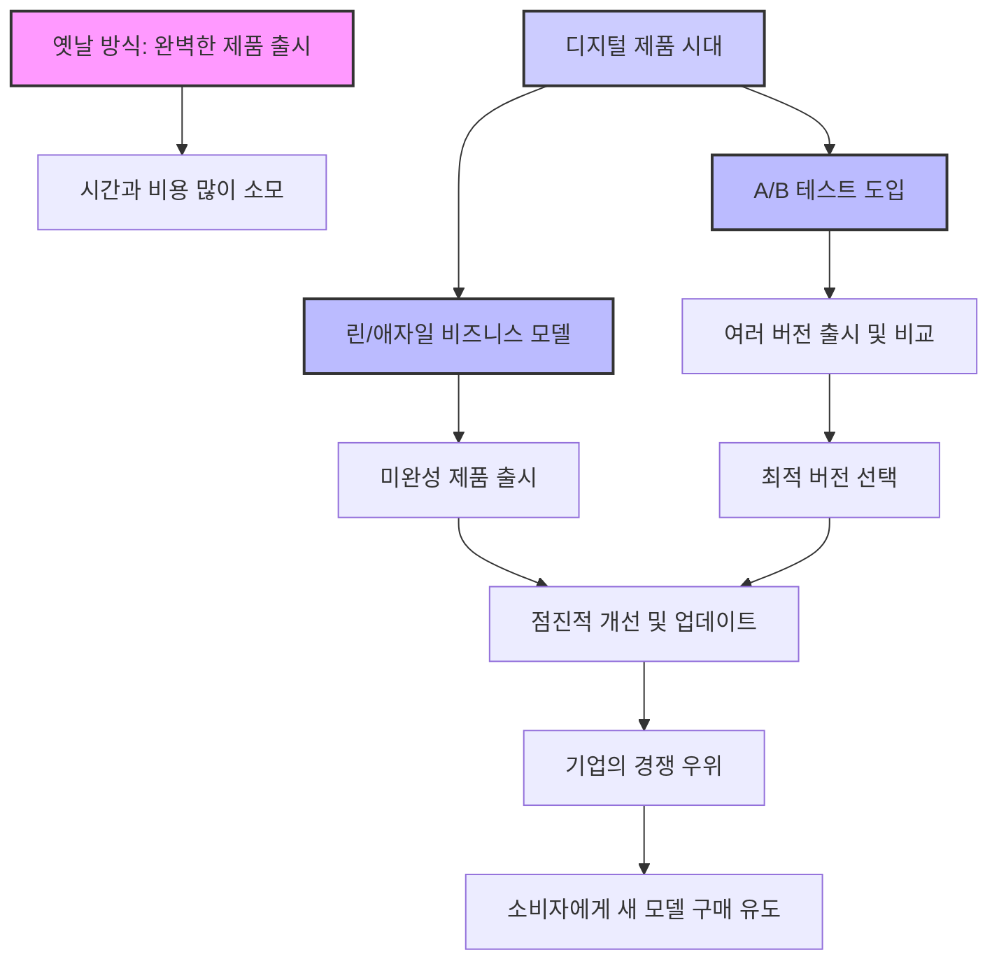
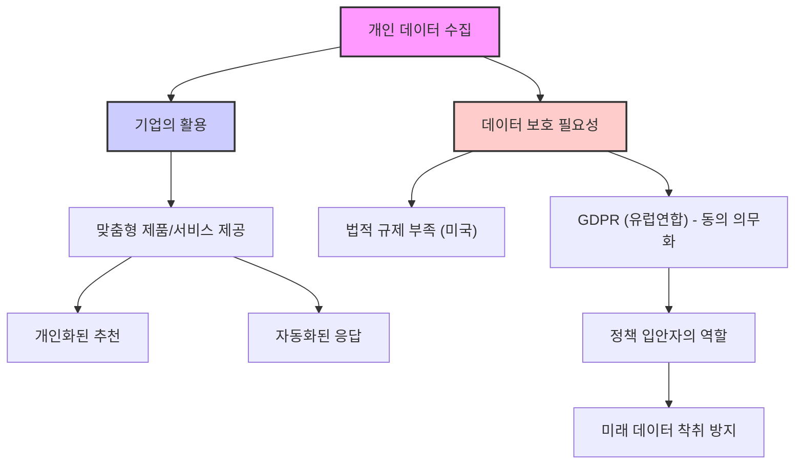

## 존 마에다의 "기계와 대화하는 법": 컴퓨터의 언어를 이해하는 쉬운 가이드
이 책은 컴퓨터가 어떻게 작동하고, 인공지능(AI)이 우리 삶에 어떤 영향을 미치는지 쉽게 설명해 주는 책이야. 복잡한 컴퓨터 과학 개념을 일상적인 비유로 풀어내서, 기술에 익숙하지 않은 사람들도 기계의 언어를 이해하고 미래를 준비할 수 있도록 도와주는 가이드라고 보면 돼. 

## 1. 컴퓨터는 지치지 않아: 반복과 재귀의 힘 

컴퓨터는 우리가 시키는 일을 지치지 않고 계속할 수 있어. 마치 로봇이 똑같은 일을 계속하는 것처럼 말이야. 이게 가능한 건 '반복(loops)'과 '재귀(recursion)'라는 두 가지 마법 같은 개념 덕분이야.

1. **반복(Loops)은 끝없이 이어지는 작업이야.**
  - 마치 공장에서 컨베이어 벨트가 계속 돌아가면서 똑같은 작업을 반복하는 것과 같아. 
  - 컴퓨터는 우리가 '멈춰!'라고 명령하거나, 뭔가 잘못될 때까지 이 작업을 계속해. 
  - 예를 들어, 7학년 학생이 컴퓨터에게 자기 이름 '콜린'을 계속해서 타이핑하라고 시키면, 컴퓨터는 지치지 않고 콜린, 콜린, 콜린... 하고 계속 쓰는 거지. 

2. 재귀**(Recursion)는 자기 안에 작은 자기가 있는 거야.**
  - 러시아 인형 '마트료시카'를 생각해 봐. 큰 인형 안에 작은 인형이 있고, 그 안에 더 작은 인형이 계속 들어있잖아? 
  - 재귀는 이렇게 자기 자신을 계속해서 더 작은 형태로 호출하는 방식이야. 
  - 이것도 반복과 마찬가지로, 멈추라는 명령이 없으면 끝없이 계속될 수 있어. 

## 2. 컴퓨터는 상상 이상으로 커지고 작아질 수 있어: 중첩의 놀라운 힘 

컴퓨터는 우리가 생각하는 것보다 훨씬 더 큰 세상과 아주 작은 세상을 동시에 다룰 수 있어. 마치 망원경으로 우주를 보다가 현미경으로 세포를 보는 것처럼 말이야.

1. 중첩**(Nesting)은 공간을 무한히 확장하는 힘이야.**
  - 컴퓨터 코드는 마치 러시아 인형처럼, 코드 안에 또 다른 코드를 넣고, 그 안에 또 다른 코드를 넣을 수 있어. 
  - 이렇게 중첩된 코드는 필요한 만큼 아주 커질 수도 있고, 아주 작아질 수도 있어. 
  - 이런 중첩 덕분에 컴퓨터는 엄청나게 복잡한 관계와 정보를 처리할 수 있는 거야. 

2. **컴퓨터는 서로 연결되어 엄청난 힘을 만들어내.**
  - 우리가 쓰는 모든 기기들은 '클라우드'라고 불리는 거대한 컴퓨터 네트워크에 연결되어 있어. 
  - 이 컴퓨터들이 서로 대화하면서 힘을 합치면, 그 계산 능력은 상상할 수 없을 정도로 커져. 
  - 하지만 이렇게 컴퓨터와 매일 일하는 사람들은 현실 감각을 잃지 않도록 조심해야 해. 

## 3. AI는 점점 더 인간을 닮아갈 거야: 인공지능의 진화 

인공지능(AI)은 계속 발전해서 언젠가는 인간과 구별하기 어려울 정도로 똑똑해질 거야. 마치 영화 속 로봇처럼 말이야.

1. **AI는 인간처럼 생각하고 행동하게 될 거야.**
  - AI가 계속 발전하면, 언제쯤 '살아있다'고 말할 수 있을지, 그리고 인간의 지능을 뛰어넘을지에 대한 질문이 생길 거야. 
  - '딥러닝(Deep Learning)'이라는 기술 덕분에 AI는 이미 인간을 아주 잘 흉내 내고 있어. 
  - 이런 발전은 미래에 '특이점(Singularity)'이라는 것이 올 수도 있다는 이론으로 이어져. 특이점은 AI가 인간의 지능을 넘어서는 시점을 말해. 

2. **AI는 우리의 감정까지 이해하고 스스로 발전할 거야.**
  - AI가 인간과 점점 더 비슷해지면, 우리의 감정을 분석하고 우리가 좋아할 만한 방식으로 행동하게 될 거야. 
  - 결국에는 기계가 스스로를 설계하고 유지보수하는 시대가 올 수도 있어. 

## 4. 완벽한 제품은 없어: A/B 테스트와 애자일 모델 

요즘은 제품을 만들 때 처음부터 완벽하게 만들려고 하지 않아. 마치 요리사가 새로운 레시피를 만들 때, 여러 번 시도하고 맛을 보면서 조금씩 바꿔나가는 것과 같아.

1. **A/B 테스트는 가장 좋은 것을 찾는 방법이야.**
  - 디지털 제품은 만드는 비용이 적게 들어서, 회사는 여러 가지 버전의 제품을 동시에 출시해 볼 수 있어. 
  - 이걸 'A/B 테스트'라고 하는데, 어떤 버전이 사람들에게 더 인기가 많은지 비교해서 최종 버전을 결정하는 거야. 
  - 예를 들어, 오바마 대통령의 2012년 선거 캠페인에서는 A/B 테스트를 통해 모금액을 200만 달러 이상 더 늘렸어. 

2. **린(**Lean**) 또는 애자일(Agile) 모델은 계속해서 발전하는 방식이야.**
  - 이 모델은 제품을 처음부터 완벽하게 만들지 않고, 일단 기본적인 기능만 있는 상태로 출시해. 
  - 그리고 A/B 테스트에서 얻은 정보들을 바탕으로, 제품을 계속해서 업데이트하고 개선해 나가는 거지. 
  - 이런 방식은 회사에게는 계속해서 제품을 좋게 만들 수 있는 장점이 있지만, 소비자들에게는 더 빠르고 비싼 새 모델을 계속 사도록 유도할 수도 있어. 

## 5. 내 정보는 어디로 갈까: 개인 데이터의 힘과 위험 

우리가 인터넷을 사용하면, 회사들은 우리의 개인 정보를 모아서 우리가 뭘 좋아하는지 알아내. 마치 내가 뭘 좋아하는지 알고 딱 맞는 선물을 주는 친구처럼 말이야.

1. **기업은 우리의 데이터를 활용해 맞춤 서비스를 제공해.**
  - 회사들은 우리의 개인 데이터를 수집해서 우리가 어떤 제품이나 서비스를 좋아할지 예측해. 
  - 이 덕분에 우리는 개인화된 추천을 받거나, 자동으로 답변을 해주는 서비스를 이용할 수 있어. 
  - 이런 '쌍방향 소통'은 편리하지만, 우리가 모르는 사이에 너무 많은 정보가 수집될 수도 있다는 문제가 있어. 

2. 개인 데이터** 보호를 위한 법적 장치가 필요해.**
  - 현재는 회사들이 데이터를 얼마나 많이 수집할 수 있는지 제한하는 법이 거의 없어. 
  - 유럽연합(EU)에서는 2018년에 'GDPR(일반 데이터 보호 규정)'이라는 법을 만들어서, 회사들이 고객의 동의 없이 데이터를 수집하지 못하게 했어. 
  - 하지만 미국 같은 나라에는 아직 이런 법이 부족해서, 미래에 우리의 개인 정보가 악용되지 않도록 정책을 만드는 사람들이 나서야 해. 

## 6. 기술 산업의 다양성 부족: 혁신을 가로막는 문제 

기술 회사들을 보면, 다양한 사람들이 함께 일하는 모습이 부족할 때가 많아. 마치 한 가지 색깔의 크레파스만 가지고 그림을 그리는 것과 같아서, 다양한 색깔을 가진 그림을 그리기 어려운 거지.

1. **기술 산업은 다양성이 부족해.**
  - 미국 인구의 많은 부분을 차지하는 여성이나 유색인종이 기술 분야에서는 훨씬 적게 일하고 있어. 
  - 이런 문제는 회사 내 괴롭힘이나 '우리 회사 문화에 맞는 사람'만 뽑으려는 경향 때문일 수도 있어. 

2. **다양성 부족은 제품의 문제로 이어져.**
  - 다양한 사람들이 없으면, 제품을 만들 때 중요한 부분을 놓치거나 잘못된 것을 만들 수 있어. 
  - 예를 들어, 어떤 이미지 필터는 특정 인종에게 불쾌하게 보이거나, 채용 도구가 특정 성별에 편향된 결과를 내기도 했어. 
  - 기술 산업이 더 혁신하고 성장하려면, 그리고 사회의 불평등을 해결하려면, 다양성을 늘리려는 노력이 정말 중요해. 

## 7. 기계는 완벽하지 않아: 인간의 역할은 여전히 중요해 

기계는 아무리 똑똑해져도 완벽하지 않아. 마치 아무리 좋은 요리책을 보고 요리해도, 사람의 손맛과 감각이 필요한 것처럼 말이야.

1. **인간은 '질적인 데이터'를 이해하는 능력이 있어.**
  - 기계는 엄청난 힘과 능력으로 계속 발전하고 있지만, '질적인 데이터'를 이해하는 능력은 아직 인간이 훨씬 뛰어나. 
  - 질적인 데이터는 숫자로 딱 떨어지지 않는, 예를 들어 '맛있다', '아름답다', '기분 좋다' 같은 감각적인 정보들을 말해. 
  - 예를 들어, AI가 수프를 만드는 지시를 완벽하게 따랐는데도 맛없는 수프를 만들었어. 그런데 사람이 수프 냄새를 맡고 문제가 뭔지 알아내서 고쳤지. 

2. **알고리즘 데이터는 신중하게 살펴봐야 해.**
  - 컴퓨터가 만들어낸 데이터나 결론은 항상 옳다고 생각하면 안 돼. 잘못된 결론으로 이어질 수도 있거든. 
  - 그래서 컴퓨터가 만들어낸 데이터를 해석하고 평가하는 인간의 능력을 키우는 것이 정말 중요해. 
  - 그래야 미래에 기계가 모든 결정을 내리는 것을 막을 수 있어. 

3. **인간과 기계의 균형 잡힌 협력이 중요해.**
  - 컴퓨터는 강력하고 효율적이며 세상을 변화시키는 힘이 있어. 
  - AI는 기하급수적으로 발전해서 곧 인간의 지능과 구별하기 어려워질 거야. 
  - 하지만 기계에게도 부족한 점이 있어. 
  - 기계의 작동 방식을 이해하고, 기술 분야의 다양성 문제를 해결하면, 기계의 장점을 최대한 활용하면서 위험을 줄일 수 있어. 
  - 결국, AI가 아무리 빠르게 발전해도 인간이 잘하는 질적인 데이터 분석은 계속해서 중요할 거야. 
  - 급변하는 디지털 세상에서는 인간과 기계가 균형을 이루며 협력하는 것이 가장 좋은 방법이야. 

