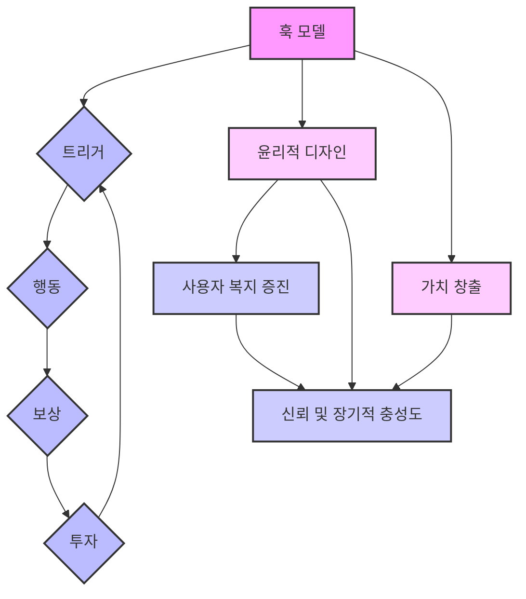

## 훅(Hooked) 요약: 습관 형성 제품을 만드는 방법
이 책은 사람들이 계속해서 찾게 되는 제품을 만드는 비법을 알려주는 책이야. 운이 좋아서가 아니라, 심리학을 이용해서 사람들이 습관처럼 제품을 사용하게 만드는 방법을 알려줄 거야. 페이스북, 인스타그램, 넷플릭스 같은 회사들이 어떻게 우리 삶에 없어서는 안 될 제품을 만들었는지 그 비밀을 파헤쳐 볼 거야. 이 책은 제품 디자이너나 마케터뿐만 아니라, 습관이 어떻게 행동을 만드는지, 그리고 사람들의 마음을 사로잡는 제품을 어떻게 만들지 궁금한 사람들을 위한 책이야. 

## 1. 훅 모델 이해하기: 습관을 만드는 4단계 마법 

사람들이 자꾸만 찾게 되는 제품을 만드는 비법은 바로 '훅 모델'이라는 4단계 마법을 이해하고 사용하는 데 있어. 이건 마치 게임처럼 사용자를 계속 끌어들이는 반복적인 순환 과정인데, 트리거<u>(</u>Trigger<u>), </u>행동<u>(</u>Action<u>), </u>보상<u>(Reward), </u>투자<u>(</u>Investment<u>)</u>로 이루어져 있어.  인스타그램 같은 제품들이 왜 그렇게 중독성이 강한지 생각해 보면, 이 4단계가 제품 디자인에 아주 자연스럽게 녹아들어 있기 때문이야. 마치 우리 일상생활의 일부처럼 느껴지게 만드는 거지. 

1. 트리거** (Trigger): 시작을 알리는 신호** 
  - 트리거는 사용자가 제품을 사용하도록 유도하는 첫 번째 단계야. 마치 "자, 이제 시작해!" 하고 알려주는 신호 같은 거지. 
  - **외부 트리거**: 처음에는 외부에서 오는 신호가 중요해.
  - 알림, 이메일, 광고 같은 것들이 여기에 해당해. 
  - 새로운 사용자들이 제품을 처음 접하고 사용해 보도록 이끄는 시작점이라고 보면 돼. 
  - **내부 트리거**: 시간이 지나면서 사용자가 제품에 익숙해지면, 외부 신호 없이도 스스로 제품을 찾게 돼.
  - 이게 바로 내부 트리거인데, 지루함, 스트레스, 누군가와 연결되고 싶은 마음 같은 감정이나 상황이 여기에 해당해. 
  - 인스타그램을 예로 들면, 사람들이 지루하거나 뭔가 다른 것에 집중하고 싶을 때, 알림이 없어도 습관처럼 앱을 여는 경우가 많잖아? 이게 바로 내부 트리거가 작동하는 거야. 
2. 행동** (Action): 아주 쉽게 따라 하는 움직임** 
  - 트리거가 발생하면 사용자는 어떤 행동을 하게 돼. 이 행동은 보상을 기대하며 하는 가장 간단한 움직임이야. 
  - 성공적인 제품들은 이 행동을 <u>최대한 쉽고 간단하게</u> 만들어. 마치 아무 생각 없이도 할 수 있게 말이야. 
  - 인스타그램에서 스크롤하고, 게시물을 올리고, '좋아요'를 누르는 게 몇 초밖에 안 걸리잖아? 이렇게 사용하기 쉽게 만드는 거지. 
  - BJ 포그(BJ Fogg)라는 행동 모델 전문가에 따르면, 어떤 행동이 일어나려면 동기(Motivation), 능력(Ability), 그리고 트리거(Trigger) 이 세 가지가 동시에 있어야 한대. 
  - 인스타그램처럼 행동을 쉽고 바로 보상받을 수 있게 만들면, 사람들이 계속해서 사용하게 될 가능성이 높아지는 거야. 
3. 보상** (Reward): 예측할 수 없는 즐거움** 
  - 보상은 훅 모델에서 가장 중요한 단계라고 할 수 있어. 이 보상은 <u>예측할 수 없어야</u> 사용자의 흥미를 계속 유지할 수 있어. 
  - 예측 불가능한 보상은 우리 뇌의 도파민 시스템을 자극하는데, 도파민은 새로운 것과 예측 불가능한 것을 좋아하거든. 
  - 인스타그램 피드를 계속 스크롤하면 어떤 새로운 콘텐츠가 나올지 모르잖아? 이게 바로 예측 불가능한 보상이야. 
  - 자신이 올린 게시물에 '좋아요'나 댓글이 얼마나 달릴지 모르는 것도 마찬가지야. 이런 사회적인 보상이 사람들을 계속 앱으로 돌아오게 만드는 거지. 
  - 이건 찰스 두히그(Charles Duhigg)의 '습관의 힘'에서 말하는 '보상' 개념과도 비슷해. 보상이 행동을 강화하고 반복하게 만드는 역할을 하는 거야. 
4. 투자** (Investment): 나의 흔적을 남기는 **노력 
  - 마지막 단계는 투자야. 사용자가 제품에 시간, 노력, 데이터 같은 가치 있는 것을 기여하는 단계지. 
  - 이 투자는 사용자가 제품에 대한 소유감과 애착을 느끼게 해서, 다시 돌아올 가능성을 높여주는 아주 중요한 단계야. 
  - 인스타그램에서 사진을 올리고, 다른 사람들과 소통하고, 자기 프로필을 꾸미는 것들이 모두 투자에 해당해. 
  - 이런 행동들은 사용자에게 플랫폼의 가치를 높여줄 뿐만 아니라, 제품과의 감정적인 연결을 더 강하게 만들어줘. 
  - 더 많이 투자할수록, 떠나기가 더 어려워지는 거야. 왜냐하면 자신이 들인 시간과 노력을 잃고 싶지 않으니까. 

이 4단계를 제품 경험에 자연스럽게 녹여내면, 제품은 사용자 일상의 필수적인 부분이 될 수 있어. 넷플릭스를 예로 들면, 새로운 에피소드 알림(트리거)을 보내고, 바로 콘텐츠를 볼 수 있게 쉽게 만들고(행동), 원하는 엔터테인먼트를 제공하고(보상), 시청한 프로그램에 별점을 매기거나 보고 싶은 목록에 추가하도록 유도하는 것(투자)이 모두 훅 모델을 활용하는 방법이야. 

하지만 이 훅 모델은 윤리적으로 사용해야 해. 사용자들의 약점을 이용하는 것이 아니라, 그들의 삶을 더 좋게 만드는 데 기여해야 한다는 점을 잊지 말아야 해.  인스타그램이 성공한 이유는 사람들이 연결되고 싶고, 창의적인 활동을 하고 싶어 하는 욕구를 충족시켜주기 때문이야.  윤리적인 디자인은 훅 모델이 긍정적인 습관을 만들고, 사용자들의 신뢰와 장기적인 충성도를 높이는 데 도움이 될 거야. 

## 2. 트리거 활용하기: 사용자의 마음을 움직이는 신호 

트리거는 사용자의 행동을 이끌어내는 촉매제 같은 거야. 마치 불꽃처럼 참여와 습관 형성을 시작하게 만들지.  트리거는 크게 두 가지로 나눌 수 있어.

1. 외부 트리거**: 처음 문을 두드리는 소리** 
  - 알림, 광고, '지금 바로 행동하세요!' 같은 메시지처럼 외부에서 오는 신호들이야. 
  - 이런 외부 트리거는 사용자가 제품을 처음 사용하도록 유도하는 데 중요해. 
  - 하지만 너무 자주 보내거나 관련 없는 내용을 보내면 사용자들이 짜증을 내거나 무시하게 될 수 있어. 
2. 내부 트리거**: 내 안에서 울리는 목소리** 
  - 이건 훨씬 더 강력한 트리거인데, 감정, 일상적인 행동, 무의식적인 신호에서 비롯돼. 
  - 외부에서 아무런 신호가 없어도 사용자가 스스로 제품을 다시 찾게 만드는 힘이 바로 내부 트리거에 있어. 
  - 성공적인 제품들은 이 두 가지 트리거를 자연스럽게 연결해서 사용자들이 행동하게 만들고, 플랫폼과의 연결을 더 깊게 만들어. 

핀터레스트(Pinterest)는 내부 트리거를 아주 잘 활용하는 예시야.  사람들이 호기심을 느끼거나, 영감을 얻고 싶거나, 심지어 지루함을 느낄 때 핀터레스트를 열게 만드는 거지.  뭔가 새로운 아이디어를 찾고 싶을 때, 핀터레스트를 열면 자신의 관심사에 맞는 수많은 이미지를 볼 수 있다는 걸 알기 때문에 자연스럽게 앱을 열게 돼. 

- 이렇게 외부 트리거에서 내부 트리거로 넘어가는 것이 사용자의 일상생활에 제품이 자리 잡는 데 아주 중요해. 
- 시간이 지나면서 특정 감정과 제품 사이의 연결이 강해지면, 그 행동은 거의 자동적으로 일어나게 돼. 
- 이건 대니얼 카너먼(Daniel Kahneman)의 '생각에 관한 생각'에서 말하는 통찰과도 비슷해. 그는 인간 행동의 많은 부분이 감정적이고 환경적인 신호에 의해 움직이는 빠르고 무의식적인 사고에 영향을 받는다고 했어. 
- 외부 트리거는 사용자의 빠른 사고 시스템에 호소하는 초기 자극 역할을 하고, 내부 트리거는 제품을 감정적, 인지적 패턴에 심어 습관을 굳히는 역할을 하는 거야. 
효과적인 트리거를 만들려면 사용자들의 필요, 감정, 행동 패턴을 깊이 이해해야 해.  스포티파이(Spotify)를 예로 들면, 사용자들의 청취 습관에 맞춰 개인화된 플레이리스트와 추천곡을 보내주잖아? 이건 새로운 것을 발견하고 싶고, 자신에게 맞춰진 것을 좋아하는 사용자들의 마음을 사로잡는 거야.  이렇게 하면 사용자들이 앱을 열게 될 뿐만 아니라, 그들의 취향을 미리 알아주는 것 같아서 더 강한 감정적인 연결을 만들 수 있어. 

트리거는 특정 사용자 행동과 직접적으로 연결되어야 해. 예를 들어, 어떤 기능이나 혜택을 알려주는 알림은 사용자가 바로 행동할 수 있도록 쉽게 만들어야 해.  아마존(Amazon)의 '원클릭 구매' 기능이 좋은 예시인데, 트리거와 행동 사이의 마찰을 줄여서 아주 매끄러운 사용자 경험을 제공하는 거야.  행동이 쉬울수록 사용자들이 트리거에 반응할 가능성이 높아져. 

트리거를 효과적으로 활용하려면 계속해서 테스트하고 개선해야 해. 외부 트리거에만 너무 의존하면 효과가 떨어질 수 있으니 조심해야 해.  대신 외부 트리거와 내부 트리거 사이의 균형을 맞추고, 점차적으로 사용자들이 외부 신호 없이도 제품을 찾게 만드는 내부 트리거로 유도하는 데 집중해야 해.  예를 들어, 피트니스 앱은 처음에는 운동 기록 알림을 보내지만, 궁극적인 목표는 사용자들이 알림 없이도 운동해야겠다고 느끼는 습관을 만드는 거야. 

트리거를 디자인할 때는 윤리적인 부분도 아주 중요해. 트리거는 사용자들의 삶을 더 좋게 만들어야지, 불필요하거나 해로운 행동을 하도록 조종해서는 안 돼.  듀오링고(Duolingo) 같은 앱은 트리거를 사용해서 꾸준히 언어 학습을 하도록 격려하고, 개인적인 성장과 기술 발전을 돕잖아.  이렇게 긍정적인 결과와 트리거를 연결하면, 신뢰와 충성도를 쌓고 사용자들의 삶에 진정한 가치를 더할 수 있어. 

## 3. 행동 단순화하기: 게으른 뇌를 위한 디자인 

사용자 참여를 유도하는 핵심은 바로 <u>단순함</u>이야.  사용자가 행동하기 쉬울수록, 그 행동을 계속할 가능성이 높아져. 복잡함은 마찰을 만들고, 마찰은 참여를 방해하거든.  성공적인 제품들은 장애물을 없애고 과정을 간소화해서, 모든 단계가 직관적이고 쉬워 보이게 만들어. 

우버(Uber)가 좋은 예시야. 택시를 부르는 과정을 혁신했잖아.  예전처럼 콜센터에 전화하거나 현금을 찾을 필요 없이, 버튼 하나만 누르면 차를 부를 수 있게 만들었어.  이렇게 단순하게 만드니까, 잠재적인 사용자들이 충성도 높은 고객이 되는 거야. 

- 이 원칙은 BJ 포그(BJ Fogg)의 '아주 작은 습관의 힘'에서 말하는 통찰과도 일치해. 그는 행동을 시작하는 문턱을 낮추는 가장 효과적인 방법이 바로 단순함이라고 설명했어. 
- 포그의 행동 모델에 따르면, 동기, 능력, 트리거 이 세 가지가 합쳐질 때 행동이 일어난대. 
- 불필요한 단계나 복잡함을 제거해서 '능력' 부분을 단순화하면, 사용자가 원하는 행동을 할 가능성이 높아지는 거지. 
- 단순함은 행동을 쉽게 만들 뿐만 아니라, 반복 가능하게 만들어서 장기적인 참여를 위한 길을 열어줘. 
우버의 디자인이 어떻게 단순함과 행동을 보여주는지 생각해 봐.  앱을 열자마자 과정이 아주 직관적이야. 앱이 사용자 위치를 감지하고, 근처 차량 옵션을 보여주고, 미리 요금을 알려줘.  결제도 자동으로 이루어져서 현금이나 카드 교환이 필요 없어.  모든 요소가 의사 결정과 노력을 최소화하도록 설계되어 있어.  이렇게 모든 마찰 지점을 해결함으로써, 우버는 차량을 예약하는 행위가 거의 무의식적인 행동이 되도록 만들었어.  그 결과, 사용자들이 계속해서 돌아오게 만드는 매끄러운 경험을 제공하는 거지. 

단순함의 중요성은 제품 디자인의 모든 측면에 적용돼. 아마존(Amazon)의 '원클릭 구매'도 또 다른 예시야.  결제 및 배송 정보를 다시 입력할 필요를 없애서, 구매를 완료하는 데 필요한 단계를 획기적으로 줄였어.  이 혁신은 전환율을 높였을 뿐만 아니라, 더 부드럽고 즐거운 쇼핑 경험을 만들었어.  사용자들은 시간을 존중해 주는 제품을 좋아하고, 단순함은 시간을 존중하는 궁극적인 방법이야. 

행동을 단순화하려면, 제품에서 불필요한 복잡성과 참여 장벽을 평가해야 해.  모든 기능이 쉽고 접근하기 쉬운지 사용자 중심적인 관점에서 꼼꼼히 살펴봐야 해.  사용자가 취하기를 원하는 핵심 행동을 먼저 파악하고, 그 행동으로 이어지는 모든 단계를 분석해 봐.  불필요한 클릭, 양식, 결정이 제거될 수 있는 부분이 있을까? 원하는 행동이 아주 쉬워질 때까지 과정을 단순화해야 해. 

단순함은 예측 가능성을 위한 디자인이기도 해.  사용자들은 무엇을 기대해야 할지 알 때 더 많이 참여하는 경향이 있어.  넷플릭스(Netflix) 같은 플랫폼은 탐색을 간단하게 만들어서 이 점을 활용해.  개인화된 추천부터 다음 에피소드 자동 재생까지, 모든 상호 작용은 결정 피로를 줄이도록 최적화되어 있어.  사용자들이 다음에 무엇을 해야 할지 덜 생각할수록, 더 많이 참여할 가능성이 높아지는 거야. 

하지만 단순함이 깊이나 기능을 희생한다는 의미는 아니야. 복잡한 과정을 직관적으로 느끼게 만드는 것을 의미해.  애플(Apple)의 아이폰(iPhone)은 이 균형을 아주 잘 보여주는 대표적인 예시야.  아이폰은 다양한 기능과 성능을 제공하지만, 기술에 능숙한 사람부터 스마트폰을 처음 사용하는 사람까지 누구나 쉽게 사용할 수 있도록 사용자 인터페이스가 설계되어 있어.  스와이프 제스처, 음성 명령, 깔끔한 레이아웃 같은 기능들은 사용자들이 압도당하는 느낌 없이 작업을 수행할 수 있도록 해줘. 

피드백도 행동을 단순화하는 데 아주 중요한 요소야.  사용자들은 자신의 행동이 성공적이었다는 즉각적인 확인이 필요해.  예를 들어, 사용자가 왓츠앱(WhatsApp)에서 메시지를 보내면, 앱은 메시지 전송 및 읽음 상태를 나타내는 체크 표시를 보여줘.  이 실시간 피드백은 사용자들을 안심시키고 불확실성을 없애서, 행동을 강화하는 역할을 해.  명확한 피드백이 없으면, 간단한 행동조차 불완전하거나 답답하게 느껴질 수 있어. 

단순함은 반복적인 개선도 필요로 해.  사용자 행동은 시간이 지남에 따라 변하고, 제품은 직관성을 유지하기 위해 적응해야 해.  실제 사용자들과 함께 디자인을 정기적으로 테스트해서 문제점과 개선할 부분을 찾아내야 해.  예를 들어, 인스타그램의 초기 버전은 지속적인 피드백과 개선을 통해 간소화되었어.  필터와 편집 도구 같은 기능들이 더 쉽게 접근할 수 있게 만들어졌고, 이는 플랫폼의 광범위한 인기에 기여했어. 

단순함의 이점은 사용자 참여를 넘어 장기적인 충성도로 이어져.  사용자들이 제품을 쉽고 편리하다고 생각하면, 다시 돌아오고 다른 사람들에게 추천할 가능성이 높아져.  반대로, 아무리 혁신적인 기능이 많더라도 제품이 번거롭거나 혼란스럽게 느껴지면 사용자들을 멀어지게 할 위험이 있어.  단순함은 단순한 디자인 선택이 아니라, 경쟁 우위가 되는 거야. 

## 4. 예측 불가능한 보상 제공하기: 뇌를 자극하는 슬롯머신 효과 

예측 불가능한 보상은 사용자들이 계속해서 제품을 찾게 만드는 비법이야.  보상이 언제, 어떻게 나올지 예측할 수 없으면 흥분과 기대감을 불러일으켜서, 제품을 단순히 매력적인 것을 넘어 중독성 있게 만들 수 있어.  인스타그램이나 트위터 같은 제품들은 '좋아요', '리트윗', '새로운 팔로워' 같은 예측 불가능한 보상을 제공해서 이 원칙을 활용해.  이런 예측 불가능한 강화는 슬롯머신 심리와 비슷해. 사용자들은 다음 대박을 기대하며 계속 게임을 하게 되는 거지. 

- 예측 불가능한 보상은 새로운 것과 놀라움에 대한 깊은 심리적 욕구를 자극해서, 단순한 상호 작용을 습관적인 행동으로 바꿔줘. 
- 이 원칙은 BF 스키너(BF Skinner)의 획기적인 연구와도 일치해. 그는 간헐적인 강화(intermittent reinforcement)가 일관된 보상보다 행동을 유도하는 데 훨씬 더 효과적이라는 것을 보여줬어. 
- 스키너의 비둘기 실험에서, 고정된 스케줄이 아니라 예측 불가능한 스케줄로 보상을 받은 비둘기들이 더 오랫동안 행동에 참여하고 동기 부여를 유지했어. 
- 인간 행동도 마찬가지야. 언제, 어떤 종류의 보상이 나타날지 모르는 불확실성이 사용자들의 호기심과 참여를 유지시키는 거야. 
인스타그램은 예측 불가능한 보상이 어떻게 작동하는지 보여주는 대표적인 예시야.  사용자들이 사진을 올릴 때, 얼마나 많은 '좋아요'나 댓글을 받을지, 누가 자신의 콘텐츠와 상호 작용할지 알 수 없어.  이 예측 불가능성이 사용자들을 계속 알림을 확인하게 만드는 기대감을 만들어.  앱을 열 때마다 다른 조합의 상호 작용을 보상으로 받게 돼.  어떤 게시물은 예상보다 더 많은 반응을 얻고, 어떤 게시물은 덜 얻지.  이런 가변성이 앱으로 다시 돌아오는 습관을 강화하는 피드백 루프를 만드는 거야. 

트위터도 리트윗, '좋아요', 새로운 팔로워를 통해 예측 불가능한 보상을 활용해.  사용자가 트윗을 올릴 때마다 어떤 반응을 받을지 알 수 없어.  자신의 게시물이 바이럴이 될까? 의미 있는 대화가 시작될까? 이런 불확실성이 사용자들을 계속 참여하게 만들고, 끊임없이 인정이나 발견의 스릴을 추구하게 해.  유튜브(YouTube)도 마찬가지야. 추천 동영상의 예측 불가능성에서 예측 불가능한 보상을 얻는 거지.  사용자들은 다음에 무엇을 발견할지 모르지만, 흥미로운 것을 찾을 수 있다는 기대감 때문에 계속 스크롤하게 돼. 

예측 불가능한 보상의 힘은 뇌의 도파민 시스템을 자극하는 능력에 있어. 도파민은 보상을 받을 때가 아니라, <u>보상을 기대할 때</u> 활성화되거든.  이 기대감은 사용자들이 다음 보상을 바라며 행동을 반복하게 만드는 갈망을 만들어.  하지만 예측 가능한 보상은 빠르게 매력을 잃어.  사용자들이 무엇을 언제 받을지 정확히 안다면, 흥분감은 사라지고 행동은 강박적인 것이 아니라 일상적인 것이 되어버려. 

효과적인 예측 불가능한 보상을 디자인하려면, 먼저 사용자들을 무엇이 동기 부여하는지 이해해야 해.  예측 불가능한 보상은 세 가지 유형으로 나눌 수 있어. 

1. **부족의 **보상** (**Rewards of the Tribe**): 사회적 인정과 소속감** 
  - 인정, 승인, 소속감 같은 사회적인 보상이야. 
  - 페이스북(Facebook) 같은 플랫폼에서 '좋아요'와 댓글이 사회적 인정을 제공하는 것이 여기에 해당해. 
2. 사냥의 보상** (**Rewards of the Hunt**): 정보와 자원 획득** 
  - 핀터레스트나 구글(Google)처럼 사용자들이 영감이나 답을 찾기 위해 검색하는 것처럼, 자원이나 정보를 얻는 것에 대한 보상이야. 
3. **자아의 **보상** (**Rewards of the Self**): 개인적인 성취와 숙달감** 
  - 게임에서 레벨업을 하거나 생산성 앱에서 작업을 완료하는 것처럼, 개인적인 성취나 숙달감에서 오는 내적인 보상이야. 

잘 설계된 제품은 이 세 가지 유형의 보상을 결합해서 여러 수준에서 사용자들의 참여를 유지하는 경우가 많아.  예를 들어, 링크드인(LinkedIn)은 프로필 조회수나 연결 요청을 통해 '부족의 보상'을 제공하고, 채용 공고나 산업 업데이트를 통해 '사냥의 보상'을 제공하며, 프로필 강도나 기술 추천 같은 진행 상황 표시를 통해 '자아의 보상'을 제공해.  이렇게 다각적인 접근 방식은 사용자들이 다양한 이유로 계속 참여하게 만들어서, 제품을 더 습관 형성적으로 만드는 거야. 

하지만 예측 불가능한 보상은 책임감 있게 사용해야 해.  참여를 유도할 수는 있지만, 사용자들의 최선의 이익과 일치하지 않으면 강박적이거나 건강하지 못한 행동으로 이어질 수도 있어.  윤리적인 제품 디자인은 예측 불가능한 보상이 사용자들의 약점을 이용하는 것이 아니라, 그들의 삶을 더 좋게 만드는 데 기여하도록 해야 해.  예를 들어, 듀오링고는 예측 불가능한 보상을 사용해서 언어 학습을 장려하고, 사용자들에게 연속 기록, 배지, 예상치 못한 이정표를 제공해서 지속적인 발전을 동기 부여해.  이런 보상들은 의존성을 만드는 것이 아니라, 긍정적인 습관을 강화하도록 설계되어 있어. 

성공적인 구현의 핵심은 가변성과 가치의 균형을 맞추는 거야.  예측 불가능한 보상은 사용자 목표에 의미 있고 관련성 있게 느껴져야 해.  보상이 무작위적이거나 노력 없이 얻은 것으로 인식되면, 사용자들을 참여시키기보다는 멀어지게 할 위험이 있어.  예를 들어, 깜짝 할인이나 혜택을 제공하는 로열티 프로그램은 보상이 사용자 선호도와 필요에 부합할 때 잘 작동해.  반대로, 관련 없는 보상을 제공하는 제대로 설계되지 않은 시스템은 지속적인 참여를 만드는 데 실패할 거야. 

## 5. 투자 장려하기: 떠나기 어렵게 만드는 나의 흔적 

투자는 평범한 사용자를 헌신적인 사용자로 바꾸는 엔진이야.  링크드인(LinkedIn) 같은 플랫폼이 사용자 투자를 활용해서 참여를 심화하고 소유감을 만드는 방법을 생각해 봐.  사용자들이 프로필을 업데이트하고, 네트워크를 구축하고, 동료를 추천하는 데 시간을 투자하면, 플랫폼에 노력과 데이터를 투자하는 것이 되고, 이는 플랫폼을 포기하기 점점 더 어렵게 만들어. 

- 이 원칙은 '매몰 비용(sunk cost)'이라는 심리적 개념과도 일치해. 사람들은 이미 투자한 자원, 시간, 노력, 돈 때문에 제품이나 서비스를 계속 사용할 가능성이 더 높다는 거야. 
- 투자를 장려하는 기능을 설계함으로써, 애착과 충성도의 순환을 만들고 습관 루프를 강화할 수 있어. 
링크드인은 사용자 생성 콘텐츠와 전문적인 연결을 강조함으로써 이 원칙을 잘 보여줘.  사용자들이 프로필 사진을 올리거나, 경력을 자세히 기록하거나, 동료들과 연결하는 등 모든 행동은 플랫폼에 가치를 더하고 동시에 플랫폼에 대한 애착을 깊게 만들어.  시간이 지나면서 사용자들은 자신의 링크드인 프로필을 전문적인 정체성의 확장으로 여기게 되고, 이는 플랫폼에서 벗어나기 더 어렵게 만들어.  플랫폼은 또한 프로필 조회수, 연결 요청, 기술 추천에 대한 알림을 통해 지속적인 투자를 유도해서, 다시 돌아와 더 참여하는 습관을 강화해. 

- 이 접근 방식은 '매몰 비용 효과'와 비슷해. 사람들이 어떤 것에 더 많이 투자할수록, 그것을 끝까지 해내야 한다고 느끼는 경향이 있다는 거지. 
- 투자는 사용자와 제품 사이에 심리적인 유대감을 형성해서, 제품을 개인적이고 없어서는 안 될 것으로 바꿔줘. 
- 이러한 현상은 스트라바(Strava) 같은 피트니스 앱에서도 볼 수 있어. 사용자들은 운동을 기록하고, 진행 상황을 추적하고, 성과를 공유해.  각 데이터 입력은 투자를 의미하며, 사용자들은 자신의 진행 상황과 커뮤니티와의 연결을 유지하기 위해 앱을 계속 사용할 가능성이 높아져. 
투자는 데이터나 노력에만 국한되지 않아. 감정적, 사회적 약속도 포함돼.  인스타그램이나 페이스북 같은 소셜 미디어 플랫폼은 개인적인 순간을 공유하고, 친구들과 소통하고, 디지털 존재를 관리하도록 장려함으로써 사용자들이 감정적으로 투자하도록 유도해.  이러한 투자는 사용자들이 자신의 콘텐츠와 연결에 대한 강한 소유감을 느끼기 때문에 다른 플랫폼으로 전환하기 어렵게 만들어.  이러한 감정적인 애착은 지속적인 참여와 충성도를 보장해. 

사용자 투자를 위한 디자인은 의미 있는 기여를 유도하는 기능을 만드는 것을 필요로 해.  이러한 기여는 점진적이어야 하며, 사용자들이 시간이 지남에 따라 적은 양의 노력을 투자할 수 있도록 해야 해.  이렇게 점진적으로 쌓아가는 것은 사용자들을 압도하지 않으면서 습관 루프를 강화해.  예를 들어, 듀오링고는 일일 연속 기록을 추적하고 이정표에 대한 배지를 수여함으로써 투자를 장려해.  각 완료된 수업은 작은 투자를 의미하며, 사용자들은 연속 기록과 진행 상황을 유지하기 위해 계속 학습하도록 동기 부여돼. 

투자는 또한 진행 상황과 성취감을 조성해서 사용자들의 참여를 유지시켜.  스팀(Steam) 같은 게임 플랫폼은 플레이어의 성과와 통계를 추적해서, 사용자들에게 노력에 대한 성취감을 제공해.  마찬가지로, 트렐로(Trello)나 아사나(Asana) 같은 생산성 도구는 사용자들이 프로젝트를 만들고 관리하도록 장려함으로써 투자를 유도해.  각 완료된 작업이나 업데이트된 상태는 진행 상황을 느끼게 해서, 플랫폼을 사용자 워크플로우의 필수적인 부분으로 만들어. 

투자의 효과를 극대화하려면, 사용자들이 자신의 기여가 중요하다고 느끼게 만드는 기능을 디자인해야 해.  스포티파이를 예로 들면, 사용자들은 자신의 선호도에 따라 플레이리스트를 만들고 새로운 음악을 발견할 수 있어.  시간이 지남에 따라 이러한 플레이리스트는 취향과 기억의 개인적인 기록 보관소가 되어, 플랫폼에 대한 사용자들의 애착을 깊게 만들어.  사용자들이 얼마나 많은 음악을 들었는지, 가장 많이 재생한 노래가 무엇인지 등을 보여줌으로써, 스포티파이는 그들의 참여 가치를 강화해. 

투자를 미래의 보상과 연결하는 것도 중요해.  사용자들이 자신의 기여가 보상으로 이어질 것이라고 인식할 때, 계속 참여할 가능성이 높아져.  예를 들어, 링크드인의 추천 및 추천 기능은 사용자들이 자신의 프로필을 향상시키고 채용 담당자에게 가시성을 높일 것이라는 것을 알기 때문에 연결을 지원하도록 장려해.  이러한 상호 강화는 투자가 사용자와 플랫폼 모두에게 이익이 되도록 보장하여, 참여의 선순환을 만들어. 

하지만 투자를 위한 디자인을 할 때는 윤리적인 고려 사항이 아주 중요해.  의미 있고 긍정적인 기여를 장려하는 것이 신뢰를 구축하고 장기적인 충성도를 높이는 핵심이야.  사용자들의 투자를 이용하면서 진정한 가치를 제공하지 않는 플랫폼은 신뢰와 참여를 잃을 위험이 있어.  예를 들어, 사용자 경험을 향상시키지 않고 업그레이드 판매에만 집중하는 피트니스 앱은 사용자들을 멀어지게 할 수 있어.  사려 깊은 디자인은 모든 투자가 보람 있고 사용자 목표와 일치하도록 보장해. 

## 6. 중독이 아닌 습관을 만들자: 윤리적인 디자인의 중요성 

습관을 형성하는 제품을 디자인하는 것은 강력한 도구지만, 이 힘은 책임감 있게 사용해야 해.  윤리적인 디자인은 사용자들의 약점을 이용하거나 건강하지 못한 의존성을 조장하는 것이 아니야. 그들의 삶을 진정으로 향상시키는 습관을 만드는 것이지.  제품은 사용자들에게 힘을 실어주고, 의미 없는 참여의 끝없는 순환에 가두는 것이 아니라 목표를 달성하도록 도와야 해.  습관과 중독 사이의 이러한 구별은 신뢰를 구축하고, 장기적인 충성도를 높이며, 윤리적인 제품 디자인 원칙에 부합하는 데 아주 중요해. 

피트니스 앱인 핏빗(Fitbit)처럼 건강한 행동을 장려하기 위해 게임 요소를 사용하는 긍정적인 예시들이 있어.  핏빗의 디자인은 훅 모델을 활용해서 트리거, 행동, 보상, 투자를 통해 사용자들이 활동을 추적하고, 피트니스 목표를 설정하고, 이정표를 축하하도록 동기 부여해.  이러한 습관은 유익할 뿐만 아니라, 사용자의 장기적인 건강과도 일치해.  한 걸음 한 걸음 내딛고, 목표를 달성할 때마다 긍정적인 참여의 순환을 강화해서 건강과 만족감을 증진시켜. 

- 이러한 접근 방식은 의미 있는 이점 없이 중독적인 경향을 이용하는 제품들과는 극명한 대조를 이뤄. 
- 윤리적인 디자인 철학은 트리스탄 해리스(Tristan Harris)와 휴먼 테크놀로지 센터(Center for Humane Technology)의 작업과 밀접하게 일치해. 
- 해리스는 사용자 복지보다 '기기 사용 시간' 같은 지표를 우선시하는 플랫폼들을 비판하는데, 이런 플랫폼들은 끝없는 스크롤이나 예측 불가능한 알림을 통해 주의를 조작하는 경우가 많아. 
- 이러한 관행은 가치를 제공하기보다는 의존성을 조장해서, 사용자들을 만족감보다는 지쳐버리게 만들어. 
- 반대로, 윤리적인 디자인은 사용자들이 성장하고, 연결하고, 열망을 달성하도록 돕는 도구를 만드는 것을 우선시해. 
- 삶을 풍요롭게 하는 습관을 만들고, 사용자들을 이용하지 않는 것이 제품의 무결성과 지속 가능성을 보장하는 거야. 
습관과 중독의 차이는 디자인의 의도와 결과에 있어.  습관은 사용자 목표와 일치하고 삶의 질을 향상시키는 행동인 반면, 중독은 개인적인 의도를 무시하고 강박적인 순환에 사용자를 가두는 행동이야.  명상 앱인 캄(Calm)과 끝없이 스크롤하는 플랫폼의 차이를 생각해 봐.  캄은 사용자들이 휴식을 취하고, 성찰하고, 스트레스를 해소하도록 격려해서 정신 건강과 회복력을 증진시켜.  반면에 끝없는 콘텐츠 소비를 이용하는 플랫폼은 사용자들이 몇 시간을 보내더라도 비생산적이거나 압도당하는 느낌을 받게 할 수 있어. 

습관을 위한 디자인은 사용자 목표와 제품이 그 목표를 달성하는 데 어떻게 도움이 될 수 있는지에 대한 명확한 이해를 필요로 해.  예를 들어, 듀오링고는 연속 기록, 배지, 진행 상황 추적을 사용해서 사용자들이 언어를 배우도록 동기 부여해.  이러한 기능들은 매일 연습하는 습관을 강화하면서, 사용자들의 열망과 일치하는 실질적인 이점(언어 능력)을 제공해.  핵심은 보람 있고 목적 있는 참여 루프를 만들어서, 사용자들이 자신의 시간과 노력을 잘 보냈다고 느끼게 하는 거야. 

제품의 더 넓은 영향에 대해 성찰하는 것이 중요해.  스스로에게 물어봐. 이 제품이 사용자들이 더 건강하고, 행복하고, 생산적이 되도록 돕는가? 그들의 장기적인 목표와 일치하는가, 아니면 의미 있는 가치를 제공하지 않고 단순히 시간과 주의를 소비하는가?  의미 있는 참여를 위한 디자인은 사용자들이 후회 없이 자신의 삶에 통합할 수 있는 제품을 만드는 것을 의미해.  예를 들어, 헤드스페이스(Headspace)는 짧고 접근하기 쉬운 명상 세션을 통해 마음 챙김을 장려해서, 사용자들이 스트레스를 관리하고 집중력을 향상시키도록 도와.  이러한 긍정적인 습관은 사용자들을 고갈시키는 것이 아니라 풍요롭게 만들어. 

중독이 아닌 습관을 만들기 위해서는 투명성과 사용자 통제가 필수적이야.  시간 제한을 설정하거나 알림을 끄는 것과 같이 사용자들이 자신의 참여를 관리할 수 있는 도구를 제공해야 해.  인스타그램과 유튜브 같은 플랫폼은 화면 시간을 추적하고 의식적인 사용을 장려하는 기능을 도입해서, 더 윤리적인 디자인 관행으로의 전환을 보여주고 있어.  이러한 도구는 사용자들이 자신의 행동을 통제할 수 있도록 해서, 그들의 참여가 의도적이고 균형 잡힌 상태를 유지하도록 보장해. 

피드백도 윤리적인 습관 디자인의 중요한 요소야.  사용자들은 자신의 노력과 진행 상황에 대해 의미 있는 방식으로 보상받는다고 느껴야 해.  핏빗의 이정표 축하 메시지나 듀오링고의 연속 기록 완료 축하 메시지는 긍정적인 강화가 의존성을 만들지 않고 사용자들을 동기 부여하는 방법을 보여주는 예시야.  보상은 사용자들의 성취감을 높여야지, 그들의 감정이나 행동을 조작해서는 안 돼. 

궁극적으로 중독이 아닌 습관을 만드는 것은 제품 디자인을 신뢰와 존중의 가치와 일치시키는 것을 의미해.  윤리적인 제품은 일일 활성 사용자 수나 기기 사용 시간 같은 단기적인 지표보다 장기적인 사용자 만족도를 우선시해.  사용자들의 삶을 개선하는 습관을 만드는 데 집중함으로써, 제품의 성공을 지속시킬 신뢰와 충성도의 기반을 구축할 수 있어.  가장 성공적인 습관 형성 제품은 사용자들이 자신의 일상생활에 통합하는 것을 좋게 느끼는 제품들이야. 

윤리적인 디자인은 단순한 도덕적 의무가 아니야. 전략적인 이점이기도 해.  삶을 향상시키는 제품은 입소문 추천, 더 강력한 브랜드 충성도, 더 적은 규제 위험을 만들어내.  피트니스 앱, 생산성 도구, 학습 플랫폼 등 무엇을 디자인하든, 항상 사용자 목표와 복지에 부합하는 의미 있는 참여를 만드는 데 집중해야 해.  착취하는 중독이 아닌, 힘을 실어주는 습관을 만들면, 시간이 지나도 변치 않는 제품을 만들 수 있을 거야. 

## 7. 테스트하고 개선하기: 완벽을 향한 끊임없는 노력 

습관을 형성하는 제품은 처음부터 완벽하게 만들어지지 않아. 끊임없는 테스트, 피드백, 개선을 통해 만들어지는 거야.  훅 모델의 트리거, 행동, 보상, 투자 요소를 사용자 행동과 데이터를 기반으로 계속해서 다듬는 것이 중요해.  이 과정은 제품이 사용자 요구를 충족시키면서 관련성과 참여를 유지하도록 보장해.  테스트와 개선은 선택 사항이 아니라, 성공적인 제품 개발의 기반이야. 

드롭박스(Dropbox) 같은 회사들이 이 접근 방식을 잘 보여줘. AB 테스트 같은 도구를 사용해서 기능을 최적화하고, 사용자 경험을 개선하고, 참여를 유도했어.  드롭박스의 성공은 실험에 대한 헌신에서 비롯돼.  개발 초기에는 새로운 사용자를 충성도 높은 고객으로 전환하는 가장 효과적인 방법을 찾기 위해 다양한 온보딩 경험을 테스트했어.  사용자 행동을 분석하고 가입 과정의 여러 버전을 테스트함으로써, 드롭박스는 추천 인센티브로 추가 무료 저장 공간을 제공하는 것이 사용자 확보와 참여를 크게 증가시킨다는 것을 발견했어.  이러한 반복적인 접근 방식은 회사가 전략을 다듬고 빠르게 확장할 수 있도록 해주었고, 데이터에 의해 안내될 때 작은 변화도 큰 영향을 미칠 수 있다는 것을 증명했어. 

- 이 방법론은 에릭 리스(Eric Ries)의 '린 스타트업(The Lean Startup)'에서 말하는 원칙과 밀접하게 일치해. 그는 빠른 반복과 학습이 성공의 핵심이라고 강조했어. 
- 리스는 '만들고, 측정하고, 배우는' 피드백 루프를 옹호하는데, 이는 최소 기능 제품(MVP)을 개발하고, 시장에서 테스트하고, 통찰력을 사용해서 개선하는 순환 과정이야. 
- 이 반복적인 과정은 위험을 최소화하고 각 변화가 사용자 요구와 일치하도록 보장해. 
- 이러한 사고방식을 채택함으로써, 시장과 함께 진화하고 경쟁자보다 앞서나가며 사용자 참여를 유지하는 제품을 만들 수 있어. 
테스트와 개선은 사용자 이해에서 시작돼.  피드백을 수집해서 문제점과 개선 기회를 식별하는 것이 중요해.  이는 단순히 사용량 지표를 모니터링하는 것 이상을 의미해. 설문 조사, 인터뷰, 사용성 테스트를 통해 사용자들과 적극적으로 소통해야 해.  예를 들어, 인스타그램의 초기 성공은 사용자 피드백에 대한 반응성 덕분이었어.  창업자들은 플랫폼의 사진 공유 기능이 사용자들에게 가장 큰 공감을 얻는다는 것을 빠르게 깨달았고, 이 핵심 기능을 강화하는 데 집중하면서 인기가 덜한 기능들을 제거했어. 

통찰력을 얻었다면, AB 테스트는 제품을 개선하는 강력한 도구가 돼.  기능이나 디자인 요소의 두 가지 버전을 비교함으로써, 어떤 것이 더 잘 작동하고 그 이유가 무엇인지 판단할 수 있어.  넷플릭스 같은 회사들은 썸네일 디자인부터 추천 알고리즘까지 모든 것을 실험하면서 AB 테스트를 광범위하게 사용해.  데이터에 의해 안내되는 이러한 작은 조정들은 사용자 경험을 누적적으로 향상시키고 유지율을 높여.  핵심은 반복적으로 테스트하고 각 실험에서 배우면서, 제품이 사용자 행동과 선호도에 맞춰 진화하도록 하는 거야. 

유연성은 반복 과정에서 필수적이야.  사용자 요구와 시장 상황은 시간이 지남에 따라 변하고, 제품은 관련성을 유지하기 위해 적응해야 해.  스포티파이가 음악 발견을 개선하기 위해 사용자 인터페이스와 알고리즘을 지속적으로 개선하는 방법을 생각해 봐.  이 회사는 개인화된 플레이리스트와 팟캐스트 추천 같은 새로운 기능을 정기적으로 테스트해서, 플랫폼이 신선하고 매력적인 상태를 유지하도록 보장해.  이러한 적응력 덕분에 스포티파이는 경쟁이 치열한 스트리밍 산업에서 선두 자리를 유지할 수 있었어. 

반복은 훅 모델의 구성 요소를 재평가하는 것도 포함해.  트리거가 사용자 행동을 유도하는 데 효과적인가? 행동이 직관적이고 쉬운가? 보상이 참여를 유지할 만큼 매력적인가? 사용자들이 제품과의 연결을 심화하는 방식으로 투자하고 있는가?  각 요소는 습관 형성 과정을 지원하는지 확인하기 위해 테스트하고 개선해야 해.  예를 들어, 듀오링고는 알림과 수업 디자인을 최적화하기 위해 데이터를 지속적으로 분석해서, 사용자들이 학습 동기를 유지하고 목표를 달성하도록 보장해. 

하지만 테스트와 개선은 단순히 점진적인 개선만을 의미하지 않아. 필요할 때 과감한 위험을 감수하는 것도 포함돼.  더 이상 작동하지 않는 기능이나 전략을 기꺼이 버릴 의지가 중요해.  이는 겸손함과 사용자 최선의 이익에 대한 헌신을 필요로 해.  트위터는 예를 들어, 리트윗과 해시태그 같은 기능을 도입하고 덜 효과적인 요소들을 단계적으로 폐지하면서 수년 동안 상당한 변화를 겪었어.  실험과 사용자 피드백에 의해 안내된 이러한 결정들은 플랫폼을 관련성 있고 매력적인 상태로 유지했어. 

반복 과정에서 윤리적인 고려 사항이 가장 중요해.  참여를 최적화하는 것이 중요하지만, 사용자 복지를 희생해서는 안 돼.  중독적인 경향을 이용하는 것을 경계하고, 대신 사용자 목표와 가치에 부합하는 제품을 디자인해야 해.  테스트와 개선은 사용자 경험을 향상시키고 의미 있는 가치를 제공하는 데 집중해야 해.  캄과 헤드스페이스 같은 제품들은 반복적인 디자인이 의존성을 조장하지 않고 사용자들의 삶을 풍요롭게 하는 긍정적인 습관을 어떻게 만들 수 있는지 보여줘. 

궁극적으로 테스트와 개선 과정은 제품이 사용자 참여를 위한 역동적이고 진화하는 도구로 남아 있도록 보장해.  피드백을 수집하고, 데이터를 분석하고, 새로운 아이디어를 실험함으로써, 훅 모델을 개선하고 변화하는 사용자 요구에 적응할 수 있어.  AB 테스트를 실행하든, 사용자 상호 작용에서 통찰력을 얻든, 핵심 기능을 재평가하든, 목표는 지속적으로 개선되는 제품을 만드는 거야.  유연성을 유지하고, 호기심을 유지하고, 학습을 멈추지 마.  반복은 과정의 한 단계가 아니라, 그 자체가 과정이야. 

## 8. 올바른 사용자 타겟팅: 누구에게 필요한 제품인가? 

습관 형성은 모든 사람에게 똑같이 적용되는 것이 아니야. 모든 사용자가 제품을 일상생활에 통합하지는 않을 거고, 그건 괜찮아.  성공적인 습관 형성 제품은 제품의 가치와 자연스럽게 일치하는 행동을 가진 사용자들에게 집중해.  제품의 혜택을 가장 많이 받고 제품에 참여할 가능성이 가장 높은 올바른 잠재 고객을 타겟팅함으로써, 지속적인 성장을 위한 강력한 기반을 만들 수 있어.  습관 형성은 모든 사람에게 어필하는 것이 아니라, 올바른 사람들에게 깊이 공감해서 제품이 그들의 삶에 없어서는 안 될 부분이 되도록 하는 거야. 

슬랙(Slack) 같은 앱은 올바른 사용자를 타겟팅하는 대표적인 예시야.  슬랙은 출시될 때 모든 회사나 팀에 어필하려고 하지 않았어.  대신, 슬랙이 해결할 수 있는 의사소통 문제로 이미 어려움을 겪고 있던 얼리 어답터(early adopter) 조직에 집중했어.  특정 문제점을 해결함으로써, 슬랙은 원활한 협업과 효율성을 중요하게 생각하는 팀들 사이에서 빠르게 인기를 얻었어.  이 얼리 어답터들은 전도사가 되어 더 넓은 채택을 이끌었고, 슬랙을 직장 의사소통의 지배적인 세력으로 만들었어. 

- 이 원칙은 제프리 무어(Geoffrey Moore)의 '캐즘 마케팅(Crossing the Chasm)'에서 말하는 통찰과도 일치해. 그는 혁신적인 제품을 출시할 때 얼리 어답터에 집중하는 것이 중요하다고 강조했어. 
- 얼리 어답터는 새로운 솔루션에 더 개방적이고, 제품이 자신의 필요에 어떻게 부합하는지 탐색하는 데 시간을 투자할 의향이 있어. 
- 그들이 제품의 가치를 경험하면, 더 크고 주류적인 잠재 고객으로의 격차를 메우는 데 도움을 줄 수 있어. 
- 이 초기 그룹을 우선시함으로써, 제품의 도달 범위를 확대하는 파급 효과를 만들 수 있어. 
올바른 사용자를 식별하려면 타겟 고객에 대한 깊은 이해가 필요해.  어떤 사용자가 제품에 가장 자주, 가장 효과적으로 참여하는지 파악하기 위해 사용자 행동을 분석하는 것이 중요해.  이러한 사용자들은 종종 제품을 중심으로 습관을 형성하기 쉬운 특성을 보여줘.  예를 들어, 스트라바 같은 피트니스 앱은 처음에는 자신의 성과를 추적하고 성과를 공유하는 데 이미 헌신적인 진지한 운동선수와 사이클링 애호가들을 타겟팅했어.  이 틈새 시장에 맞춰 스트라바는 다른 사람들이 참여하기를 원하면서 유기적으로 확장되는 충성도 높은 커뮤니티를 구축했어. 

이러한 고도로 참여하는 사용자들의 요구를 충족시키기 위해 제품을 맞춤화하는 것이 중요해.  기능은 타겟 고객의 특정 문제점과 목표에 부합해야 해.  펠로톤(Peloton)이 집에서 고품질 운동의 편리함을 중요하게 생각하는 피트니스 애호가들에게 집중한 방법을 생각해 봐.  라이브 수업, 리더보드, 커뮤니티 참여를 제공함으로써, 펠로톤은 핵심 사용자들에게 깊이 공감하는 습관 형성 생태계를 만들었어.  그 결과, 많은 사람들에게 일상적인 의식이 되는 제품이 탄생했고, 이는 충성도와 성장을 모두 이끌었어. 

사용자를 이해하는 것은 누가 타겟 고객이 아닌지 인식하는 것도 의미해.  모든 사람에게 어필하려고 하면 제품의 초점과 효과가 희석될 수 있으니 주의해야 해.  예를 들어, 링크드인의 성공은 전문적인 네트워킹 플랫폼으로서의 명확한 포지셔닝에서 비롯돼.  경력 기회와 산업 연결을 찾는 전문가들을 타겟팅함으로써, 링크드인은 페이스북과 같은 더 넓은 소셜 미디어 플랫폼과 직접 경쟁하는 함정을 피했어.  이러한 전략적 명확성 덕분에 링크드인은 올바른 사용자들과 습관을 구축하면서 고유한 가치 제안을 유지할 수 있었어. 

데이터는 올바른 사용자를 식별하고 타겟팅하는 데 중요한 역할을 해.  사용자 유지율, 사용 빈도, 참여 패턴과 같은 지표를 분석하면 제품을 중심으로 습관을 형성할 가능성이 가장 높은 잠재 고객 세그먼트를 정확히 찾아내는 데 도움이 될 수 있어.  스포티파이는 예를 들어, 데이터를 사용해서 헤비 리스너를 식별하고, 이 사용자들을 계속 참여시키기 위해 추천과 기능을 맞춤화해.  가장 충성도 높은 사용자들에게 집중함으로써, 스포티파이는 핵심 고객이 만족하는 동시에 점진적으로 새로운 사용자를 유치하도록 보장해. 

올바른 사용자를 타겟팅하는 과정은 메시징과 온보딩 경험을 개선하는 것도 포함해.  사용자들이 제품과 처음 상호 작용하는 것이 습관을 형성하는 데 아주 중요해.  슬랙의 온보딩 과정은 예를 들어, 팀이 채널을 설정하고 협업을 시작하도록 도움으로써 그 가치를 즉시 보여주도록 설계되어 있어.  이 초기 경험은 얼리 어답터들이 제품이 자신의 문제를 어떻게 해결하는지 빠르게 알 수 있도록 보장해서, 지속적인 사용 가능성을 높여. 

사용자를 타겟팅할 때는 윤리적인 고려 사항이 가장 중요해.  사용자들의 약점을 이용하는 것이 아니라, 그들의 삶을 진정으로 개선하는 제품을 디자인하는 것이 중요해.  올바른 잠재 고객에게 의미 있는 가치를 제공하는 데 집중함으로써, 신뢰와 장기적인 충성도를 구축할 수 있어.  듀오링고처럼 사용자들이 새로운 언어를 배우도록 돕는 제품은 긍정적인 결과와 함께 올바른 사용자를 타겟팅하는 것이 회사와 고객 모두에게 이익이 되는 지속 가능한 습관 루프를 어떻게 만드는지 보여줘. 

궁극적으로 올바른 사용자를 타겟팅하는 것은 습관 형성과 성장을 위한 강력한 기반을 만드는 것을 의미해.  제품의 가치와 가장 밀접하게 일치하는 잠재 고객을 식별하고, 그들의 필요에 맞춰 기능을 맞춤화하고, 탁월한 온보딩 경험을 보장함으로써, 참여와 유지율 가능성을 극대화할 수 있어.  슬랙, 링크드인, 스트라바 같은 제품들은 얼리 어답터와 핵심 사용자에게 집중하는 것이 시간이 지남에 따라 더 넓은 성공으로 이어진다는 것을 보여줘.  올바른 사용자들과 습관을 구축하면, 충성도, 지지, 장기적인 영향을 통해 번성하는 제품을 만들 수 있을 거야. 

## 9. 감정적 트리거에 집중하기: 마음을 움직이는 연결고리 

감정은 인간 행동의 핵심이며, 습관을 형성하는 데 아주 중요한 역할을 해.  성공적인 습관 형성 제품은 사용자들의 감정적 트리거를 활용해서, 참여를 유도하는 깊은 개인적인 연결을 만들어.  외로움, 소외감(FOMO), 인정받고 싶은 욕구 등 무엇이든, 감정은 의사 결정과 행동을 이끄는 강력한 동기 부여 요소가 돼.  감정적으로 공감하는 제품은 기능적인 필요를 충족시킬 뿐만 아니라, 사용자 삶의 없어서는 안 될 부분이 돼. 

페이스북(Facebook)은 감정적 트리거를 효과적으로 활용하는 대표적인 예시야.  이 플랫폼은 외로움과 소외감을 해결하는 데 중점을 두어, 사용자들이 연결하고, 공유하고, 정보를 얻을 수 있는 공간을 제공해.  알림, '좋아요', 업데이트는 항상 확인할 것이 있고, 댓글을 달거나 응답할 것이 있다는 것을 상기시켜서, 연결과 인정에 대한 감정적 필요를 충족시켜줘.  이러한 감정적인 참여는 사용자들을 계속 돌아오게 만들고, 페이스북을 일상생활에 통합하는 습관을 강화해. 

- 감정적 트리거 뒤에 숨겨진 과학은 안토니오 다마지오(Antonio Damasio)의 획기적인 저서 '데카르트의 오류(Decart's Error)'에서 뒷받침돼. 그는 감정이 의사 결정에 필수적이라는 것을 보여줬어. 
- 다마지오는 뇌 손상으로 인해 감정 반응이 없는 사람들이 간단한 결정조차 내리는 데 어려움을 겪는다는 것을 발견했어. 
- 이 통찰은 감정을 불러일으키는 제품을 디자인하는 것의 중요성을 강조해. 이러한 감정은 사용자들이 제품과 상호 작용하고 우선순위를 정하는 방식을 형성하기 때문이야. 
- 제품이 감정적으로 공감하지 못하면, 아무리 기능적이거나 혁신적이더라도 간과될 위험이 있어. 
타겟 고객의 감정적 지형을 이해하는 것이 더 깊은 수준에서 연결되는 기능을 디자인하는 첫 번째 단계야.  인스타그램이 사용자들의 자기표현과 인정 욕구에 어떻게 어필하는지 생각해 봐.  엄선된 순간을 공유하고 '좋아요'와 댓글을 받을 수 있는 플랫폼을 제공함으로써, 인스타그램은 자부심, 소속감, 심지어 질투와 같은 감정을 활용해.  이러한 감정적 트리거는 사용자들이 콘텐츠를 만들고 공유하는 데 시간과 노력을 투자하도록 유도해서, 참여 습관을 강화해. 

감정적 트리거의 역할은 소셜 미디어를 넘어 확장돼.  예를 들어, 마이 피트니스 팔(My Fitness Pal) 같은 피트니스 앱은 더 나은 건강에 대한 사용자들의 열망과 진행 상황을 잃을까 봐 두려워하는 마음을 활용해.  식사를 기록하거나 이정표를 축하하는 알림은 사용자들이 꾸준함을 유지하도록 동기 부여하는 감정을 불러일으켜.  마찬가지로, 듀오링고는 게임 요소와 연속 기록 알림을 사용해서 연속 기록을 깨뜨릴까 봐 두려워하는 사용자들의 마음을 활용하고, 책임감과 성취감을 조성해.  사용자들의 감정적 동기와 기능을 일치시킴으로써, 이러한 제품들은 지속되는 습관을 만들어. 

감정적 트리거를 위한 디자인을 하려면, 타겟 고객에게 공감하는 특정 감정을 식별해야 해.  사용자 행동과 피드백을 연구해서 참여를 유도하는 욕구, 두려움, 열망을 밝혀내는 것이 중요해.  예를 들어, 링크드인은 사용자들의 직업적 야망과 네트워킹 기회를 놓칠까 봐 두려워하는 마음을 활용해.  프로필 조회수, 추천, 채용 공고 업데이트와 같은 기능들은 이러한 감정을 강화해서, 사용자들이 활동적이고 참여하도록 장려해. 

타이밍도 감정적 트리거를 활용하는 데 아주 중요해.  사용자의 감정에 즉각적으로 반응하는 제품은 더 강한 연결을 만들어.  예를 들어, 스포티파이의 '데일리 믹스'나 '디스커버 위클리' 같은 개인화된 플레이리스트는 사용자들의 기분과 선호도를 활용해.  적절한 시기에 감정적으로 공감하는 경험을 제공함으로써, 사용자들의 감정 상태와 일치하는 가치를 제공해.  스포티파이는 플랫폼이 신뢰할 수 있는 동반자가 되도록 보장해. 

하지만 감정적 트리거를 비윤리적으로 이용하는 것을 경계해야 해.  감정을 활용하는 것이 참여를 유도할 수 있지만, 사용자 복지를 희생하면서 그렇게 하는 것은 신뢰와 장기적인 충성도를 손상시켜.  윤리적인 제품 디자인은 취약점을 이용하는 것이 아니라, 가치를 창출하고 긍정적인 감정적 경험을 조성하는 데 집중해.  예를 들어, 캄과 헤드스페이스는 스트레스와 불안 같은 감정적 트리거를 활용해서 마음 챙김과 휴식을 증진시키고, 제품을 사용자 복지와 일치시켜. 

피드백 루프도 감정적인 연결을 강화하는 데 역할을 해.  사용자들의 행동과 진행 상황을 검증하는 제품은 성취감과 만족감을 불러일으켜.  펠로톤이 운동 완료를 지표, 리더보드, 강사의 격려 메시지로 축하하는 방법을 생각해 봐.  이러한 기능들은 인정과 커뮤니티에 대한 사용자들의 필요를 활용해서, 긍정적인 감정으로 가득 찬 습관 루프를 만들어. 

궁극적으로 감정적 트리거에 집중하는 것은 제품을 개인적으로 관련성 있고 깊이 매력적으로 만드는 것을 의미해.  페이스북, 인스타그램, 듀오링고 같은 제품들은 사용자들이 중요하게 생각하는 감정적 필요를 해결하기 때문에 성공해.  연결부터 자기 개선까지, 이러한 감정을 이해하고 디자인함으로써, 깊은 수준에서 공감하는 경험을 만들고, 평범한 사용자를 충성도 높은 지지자로 바꿀 수 있어.  잠재 고객을 연구하고, 기능을 그들의 감정적 지형과 일치시키고, 제품이 의미 있고 보람 있는 가치를 제공하도록 보장해야 해. 

## 10. 행동 변화를 위한 디자인: 삶을 변화시키는 제품 만들기 

습관 형성 제품의 진정한 힘은 의미 있는 행동 변화를 유도하는 능력에 있어.  궁극적인 목표는 단순히 사용자 참여가 아니라, 사용자들에게 힘을 실어주고, 그들의 목표를 삶에 자연스럽게 통합되는 방식으로 달성하도록 돕는 것이어야 해.  이 임무에 성공하는 제품은 단순히 기능을 제공하는 것이 아니야. 개인적인 성장, 학습, 개선을 위한 도구가 돼.  행동 변화를 위한 디자인은 사용자들의 열망과 일치하는 가치를 창출하고, 그들의 삶을 더 쉽고, 더 좋고, 더 즐겁게 만드는 데 집중하는 거야. 

듀오링고(Duolingo) 같은 교육 앱은 이 점에서 모범적인 예시야.  언어 학습 과정을 게임처럼 만들어서, 지루하게 느껴질 수 있는 것을 재미있고 매력적인 습관으로 바꿔줘.  이 앱은 연속 기록, 배지, 짧은 수업을 사용해서 사용자들의 동기를 유지하고 헌신하도록 해.  각 상호 작용은 긍정적인 행동 변화의 순환을 강화해서, 사용자들이 접근하기 쉽고 보람 있는 방식으로 가치 있는 기술을 구축하도록 도와.  이러한 접근 방식은 사려 깊은 디자인이 사용자의 의도를 지속적인 행동으로 어떻게 바꿀 수 있는지 보여줘. 

- 제임스 클리어(James Clear)의 '아주 작은 습관의 힘(Atomic Habits)' 원칙은 행동 변화의 메커니즘에 대한 더 깊은 통찰력을 제공해. 
- 클리어는 작고 일관된 변화가 의미 있는 변화의 구성 요소라고 주장해. 
- 이 아이디어는 습관 형성 제품의 디자인과 완벽하게 일치해. 
- 복잡한 목표를 관리 가능한 단계로 나누어, 이러한 제품들은 사용자들을 압도하지 않고 진행 상황으로 이끌어. 
- 마이 피트니스 팔 같은 피트니스 앱을 생각해 봐. 이 앱은 사용자들이 식사를 추적하고, 운동을 모니터링하고, 이정표를 축하하도록 도와. 
- 이 앱은 점진적인 진행을 장려해서, 체중 감량과 같은 어려운 목표를 달성 가능한 일련의 일일 행동으로 바꿔줘. 
행동 변화를 위한 디자인을 하려면, 먼저 사용자들의 목표와 문제점을 이해해야 해.  그들은 무엇을 달성하고 싶어 하고, 어떤 장애물이 그들의 길을 가로막고 있을까?  잠재 고객에게 공감하고 그들의 내재적인 동기와 일치하는 기능을 디자인하는 것이 중요해.  예를 들어, 캄과 헤드스페이스는 접근하기 쉽고 일상생활에 통합하기 쉬운 가이드 명상 세션을 제공해서 스트레스와 불안을 해결해.  이러한 앱은 사용자들이 정신 건강을 증진시키는 습관을 구축하도록 힘을 실어주고, 사려 깊은 디자인을 통해 지속적인 가치를 창출해. 

행동 변화는 트리거, 행동, 보상, 투자의 완벽한 조화를 필요로 해.  훅 모델의 구성 요소들이지.  각 단계는 직관적이고 보람 있게 느껴져야 하며, 사용자들이 다시 돌아와 계속 참여하도록 장려해야 해.  예를 들어, 스포티파이의 '디스커버 위클리' 같은 개인화된 플레이리스트는 사용자들이 새로운 음악을 탐색하도록 유도하는 트리거 역할을 해.  플레이리스트를 듣는 행동은 쉽고, 보상은 자신의 취향에 맞춰진 노래를 발견하는 즐거움이야.  시간이 지남에 따라 사용자들은 플레이리스트를 만들고 좋아하는 곡을 저장하는 데 투자해서, 스포티파이를 즐겨 찾는 음악 플랫폼으로 사용하는 습관을 강화해. 

게임 요소(Gamification)는 행동 변화를 위한 디자인에 강력한 도구지만, 책임감 있게 사용해야 해.  배지, 연속 기록, 진행 상황 추적기와 같은 보상은 성취감과 인정 욕구를 활용하기 때문에 효과적이야.  하지만 이러한 요소들은 제품의 핵심 가치를 보완해야지, 가려서는 안 돼.  윤리적인 디자인은 게임 요소가 사용자 경험을 향상시키고 그들의 목표를 지원하며, 건강하지 못한 의존성을 조장하지 않도록 보장해.  듀오링고는 예를 들어, 게임 요소를 사용해서 학습 동기를 부여하지만, 언어를 효과적으로 가르치려는 사명을 잊지 않아. 

피드백과 강화는 성공적인 행동 변화의 중요한 구성 요소야.  사용자들은 자신의 노력이 변화를 만들고 있다고 느껴야 하며, 제품은 그들의 진행 상황을 검증하기 위해 명확하고 즉각적인 피드백을 제공해야 해.  핏빗 같은 피트니스 트래커가 알림과 활동 시각적 요약으로 이정표를 축하하는 방법을 생각해 봐.  이러한 기능들은 긍정적인 행동을 강화해서, 사용자들에게 성취감을 느끼게 하고 계속하도록 동기 부여해.  강화는 습관 루프를 강화해서, 행동 변화가 사용자 일상생활의 자연스러운 부분이 되도록 보장해. 

목적을 가지고 디자인하는 것도 중요해.  제품이 만드는 습관은 사용자들의 최선의 이익과 일치해야 하며, 그들의 복지를 증진시키고 의미 있는 목표를 달성하도록 도와야 해.  게임화된 작업 관리 앱인 하비티카(Habitica) 같은 제품은 실제 생활 작업을 퀘스트처럼 다룸으로써 사용자들이 생산적인 습관을 구축하도록 장려해.  디자인과 목적 사이의 이러한 일치는 형성된 습관이 유익하고 지속 가능하도록 보장해서, 사용자와 제작자 모두에게 윈윈(win-win)을 만들어. 

윤리적인 고려 사항은 디자인 과정의 모든 단계를 안내해야 해.  참여나 유지율 같은 지표에만 집중하고 싶은 유혹이 있지만, 제품이 사용자들의 삶을 진정으로 개선하지 않는다면 이러한 숫자는 의미가 없어.  사용자들의 약점을 이용하거나 건강하지 못한 행동을 조장하는 것을 경계해야 해.  대신, 사용자들이 감사하고 지지할 가치를 창출하는 데 집중해야 해.  캄과 헤드스페이스 같은 앱은 사용자들을 참여 루프에 가두기 때문이 아니라, 사용자들이 소중히 여기는 실질적인 이점을 제공하기 때문에 성공해. 

궁극적으로 행동 변화를 위한 디자인은 제품 기능을 사용자들의 열망과 동기와 일치시키는 것을 의미해.  그들의 필요를 이해하고, 그들의 여정을 단순화하고, 그들의 진행 상황을 강화함으로써, 그들의 일상생활에서 신뢰할 수 있는 동반자가 되는 제품을 만들 수 있어.  새로운 언어를 배우든, 스트레스를 관리하든, 새로운 음악을 발견하든, 습관 형성 제품은 사용자들이 목표를 달성하도록 힘을 실어줘야 해.  진정성, 목적, 공감을 가지고 디자인하면, 단순히 참여를 유도하는 것이 아니라 변화를 가져오는 제품을 만들 수 있을 거야. 

## 결론: 훅 모델의 힘과 윤리적 책임 

'훅(Hooked)'은 습관 형성 제품을 이해하고 만드는 강력한 틀을 제공해.  닐 아이얄(Nir Eyal)의 훅 모델인 트리거<u>, </u>행동<u>, </u>보상<u>, </u>투자는 사용자 참여가 우연이 아니라 설계된 것임을 보여줘.  트리거를 활용하고, 행동을 단순화하고, 예측 불가능한 보상을 제공하고, 투자를 장려함으로써, 없어서는 안 될 제품을 디자인할 수 있어.  하지만 아이얄은 사용자들을 이용하는 것이 아니라, 그들에게 이익이 되는 습관을 만들도록 윤리적으로 생각하라고 강조해.  더 깊은 통찰력을 얻으려면 제임스 클리어의 '아주 작은 습관의 힘'과 찰스 두히그의 '습관의 힘'을 읽어보는 것이 좋아. 이 두 책 모두 아이얄의 행동 및 습관 형성 가르침을 보완해 줄 거야.  참여를 위한 디자인은 단순히 제품을 만드는 것이 아니라, 가치를 만드는 것임을 기억해.  습관의 힘을 활용하면 진정으로 지속되는 것을 만들 수 있을 거야. 

